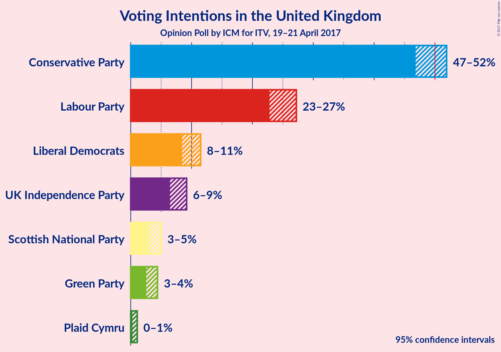
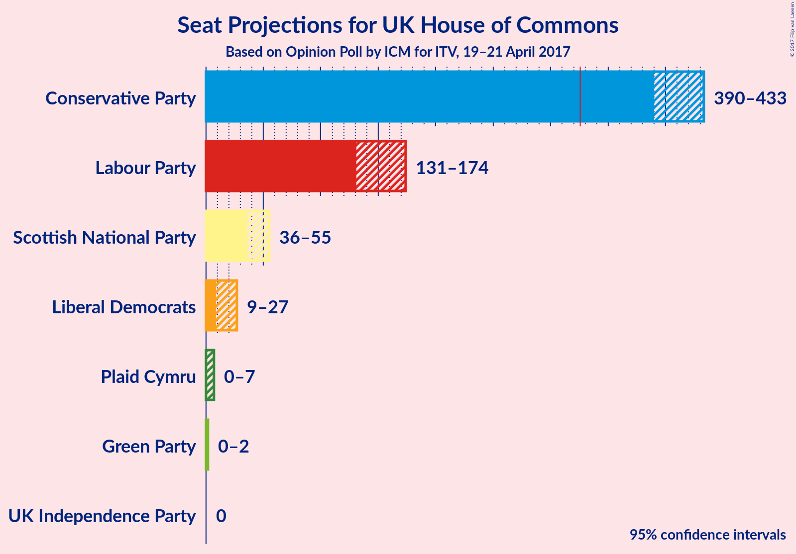

# Opinion Poll by ICM for ITV, 19–21 April 2017

<a href="#voting-intentions">Voting Intentions</a> | <a href="#seats">Seats</a> | <a href="#technical-information">Technical Information</a>

## Voting Intentions

### Confidence Intervals

| Party | 80% Confidence Interval | 90% Confidence Interval | 95% Confidence Interval | 99% Confidence Interval |
|:-----:|:-----------------------:|:-----------------------:|:-----------------------:|:-----------------------:|
| Conservative Party | 47.7–51.0% |47.2–51.5% |46.8–51.9% |46.0–52.7% |
| Labour Party | 23.5–26.4% |23.2–26.9% |22.8–27.2% |22.2–27.9% |
| Liberal Democrats | 8.9–10.9% |8.7–11.2% |8.4–11.5% |8.0–12.0% |
| UK Independence Party | 6.9–8.7% |6.7–8.9% |6.5–9.2% |6.1–9.7% |
| Scottish National Party | 3.3–4.6% |3.2–4.8% |3.0–5.0% |2.8–5.4% |
| Green Party | 2.8–4.0% |2.7–4.2% |2.5–4.4% |2.3–4.8% |
| Plaid Cymru | 0.4–0.9% |0.3–1.0% |0.3–1.1% |0.2–1.2% |

## Seats

## Technical Information

### Opinion Poll

+ **Pollster:** ICM
+ **Media:** ITV
+ **Fieldwork period:** 19–21 April 2017

### Calculations

+ **Simulations done:** 4,194,304
+ **Error estimate:** 0.88%

