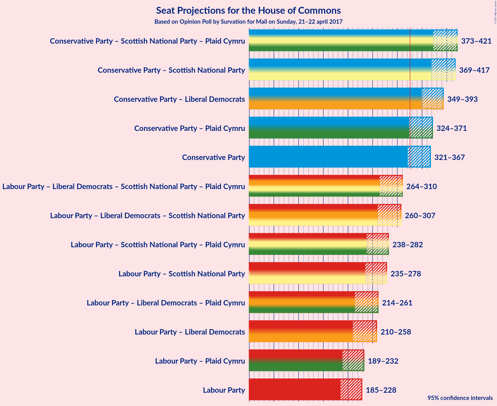

# Opinion Poll by Survation for Mail on Sunday, 21–22 april 2017

<a href="#voting-intentions">Voting Intentions</a> | <a href="#seats">Seats</a> | <a href="#coalitions">Coalitions</a> | <a href="#technical-information">Technical Information</a>

## Voting Intentions

### Confidence Intervals

| Party | Last Result | Poll Result | 80% Confidence Interval | 90% Confidence Interval | 95% Confidence Interval | 99% Confidence Interval |
|:-----:|:-----------:|:-----------:|:-----------------------:|:-----------------------:|:-----------------------:|:-----------------------:|
| Conservative Party | 37.8% | 40.5% | 38.1–41.2% |37.6–41.6% |37.3–42.0% |36.5–42.7% |
| Labour Party | 31.2% | 29.3% | 27.3–30.1% |26.9–30.5% |26.5–30.9% |25.9–31.6% |
| UK Independence Party | 12.9% | 11.6% | 10.4–12.4% |10.1–12.7% |9.9–12.9% |9.4–13.5% |
| Liberal Democrats | 8.1% | 11.1% | 9.9–11.9% |9.6–12.2% |9.4–12.4% |9.0–12.9% |
| Scottish National Party | 4.9% | 4.5% | 3.8–5.1% |3.7–5.3% |3.5–5.5% |3.3–5.9% |
| Green Party | 3.8% | 2.4% | 1.9–2.9% |1.8–3.0% |1.7–3.1% |1.5–3.4% |
| Plaid Cymru | 0.6% | 0.6% | 0.4–0.9% |0.4–1.0% |0.3–1.1% |0.3–1.3% |

*Note:* The poll result column reflects the actual value used in the calculations. Published results may vary slightly, and in addition be rounded to fewer digits.

## Seats

### Confidence Intervals

| Party | Last Result | 80% Confidence Interval | 90% Confidence Interval | 95% Confidence Interval | 99% Confidence Interval |
|:-----:|:-----------:|:-----------------------:|:-----------------------:|:-----------------------:|:-----------------------:|
| <a href="#conservative-party">Conservative Party</a> | 331 | 330–358 |324–361 |321–369 |311–374 |
| <a href="#labour-party">Labour Party</a> | 232 | 193–220 |190–224 |186–228 |179–235 |
| <a href="#uk-independence-party">UK Independence Party</a> | 1 | 0–1 |0–1 |0–1 |0–1 |
| <a href="#liberal-democrats">Liberal Democrats</a> | 8 | 19–36 |16–40 |13–41 |11–45 |
| <a href="#scottish-national-party">Scottish National Party</a> | 56 | 47–54 |45–56 |44–56 |40–58 |
| <a href="#green-party">Green Party</a> | 1 | 0–1 |0–1 |0–1 |0–1 |
| <a href="#plaid-cymru">Plaid Cymru</a> | 3 | 3–4 |1–5 |0–7 |0–7 |

### Conservative Party

| Number of Seats | Probability | Accumulated |
|:---------------:|:-----------:|:-----------:|
| 299 | 0% | 100% |
| 300 | 0% | 99.9% |
| 301 | 0% | 99.9% |
| 302 | 0% | 99.9% |
| 303 | 0% | 99.9% |
| 304 | 0% | 99.9% |
| 305 | 0% | 99.9% |
| 306 | 0% | 99.9% |
| 307 | 0.1% | 99.9% |
| 308 | 0.1% | 99.7% |
| 309 | 0% | 99.7% |
| 310 | 0.1% | 99.7% |
| 311 | 0.2% | 99.6% |
| 312 | 0.1% | 99.4% |
| 313 | 0.1% | 99.3% |
| 314 | 0.1% | 99.2% |
| 315 | 0.1% | 99.1% |
| 316 | 0.1% | 99.0% |
| 317 | 0.7% | 98.9% |
| 318 | 0.2% | 98% |
| 319 | 0.3% | 98% |
| 320 | 0.2% | 98% |
| 321 | 0.8% | 98% |
| 322 | 0.9% | 97% |
| 323 | 0.5% | 96% |
| 324 | 1.0% | 95% |
| 325 | 0.5% | 94% |
| 326 | 1.4% | 94% |
| 327 | 0.8% | 92% |
| 328 | 0.4% | 92% |
| 329 | 0.9% | 91% |
| 330 | 1.2% | 90% |
| 331 | 3% | 89% |
| 332 | 2% | 87% |
| 333 | 2% | 84% |
| 334 | 3% | 82% |
| 335 | 2% | 80% |
| 336 | 3% | 78% |
| 337 | 1.1% | 75% |
| 338 | 3% | 74% |
| 339 | 9% | 71% |
| 340 | 4% | 62% |
| 341 | 4% | 57% |
| 342 | 3% | 53% |
| 343 | 2% | 50% |
| 344 | 3% | 49% |
| 345 | 3% | 46% |
| 346 | 7% | 43% |
| 347 | 2% | 36% |
| 348 | 3% | 34% |
| 349 | 2% | 31% |
| 350 | 4% | 29% |
| 351 | 0.4% | 26% |
| 352 | 4% | 25% |
| 353 | 0.9% | 21% |
| 354 | 2% | 20% |
| 355 | 3% | 19% |
| 356 | 0.5% | 16% |
| 357 | 1.0% | 15% |
| 358 | 5% | 14% |
| 359 | 2% | 10% |
| 360 | 2% | 8% |
| 361 | 0.8% | 6% |
| 362 | 0.4% | 5% |
| 363 | 0.5% | 5% |
| 364 | 0.4% | 4% |
| 365 | 0.1% | 4% |
| 366 | 0.2% | 4% |
| 367 | 0.5% | 3% |
| 368 | 0.1% | 3% |
| 369 | 0.4% | 3% |
| 370 | 0.8% | 2% |
| 371 | 0.4% | 1.5% |
| 372 | 0.3% | 1.1% |
| 373 | 0.2% | 0.8% |
| 374 | 0.3% | 0.6% |
| 375 | 0.1% | 0.2% |
| 376 | 0% | 0.2% |
| 377 | 0% | 0.1% |
| 378 | 0% | 0.1% |
| 379 | 0% | 0.1% |
| 380 | 0% | 0.1% |
| 381 | 0% | 0% |

### Labour Party

| Number of Seats | Probability | Accumulated |
|:---------------:|:-----------:|:-----------:|
| 174 | 0% | 100% |
| 175 | 0% | 99.9% |
| 176 | 0% | 99.9% |
| 177 | 0% | 99.9% |
| 178 | 0.3% | 99.8% |
| 179 | 0.1% | 99.5% |
| 180 | 0.2% | 99.5% |
| 181 | 0.5% | 99.3% |
| 182 | 0.2% | 98.8% |
| 183 | 0.2% | 98.6% |
| 184 | 0.5% | 98% |
| 185 | 0.2% | 98% |
| 186 | 0.5% | 98% |
| 187 | 0.9% | 97% |
| 188 | 0.4% | 96% |
| 189 | 0.5% | 96% |
| 190 | 2% | 96% |
| 191 | 0.4% | 93% |
| 192 | 0.8% | 93% |
| 193 | 3% | 92% |
| 194 | 0.9% | 89% |
| 195 | 2% | 88% |
| 196 | 2% | 86% |
| 197 | 3% | 85% |
| 198 | 3% | 81% |
| 199 | 6% | 78% |
| 200 | 1.5% | 72% |
| 201 | 2% | 71% |
| 202 | 0.8% | 69% |
| 203 | 3% | 69% |
| 204 | 1.1% | 66% |
| 205 | 2% | 65% |
| 206 | 1.5% | 63% |
| 207 | 3% | 61% |
| 208 | 3% | 58% |
| 209 | 12% | 56% |
| 210 | 3% | 44% |
| 211 | 3% | 41% |
| 212 | 2% | 38% |
| 213 | 3% | 36% |
| 214 | 11% | 33% |
| 215 | 2% | 22% |
| 216 | 3% | 20% |
| 217 | 5% | 18% |
| 218 | 1.4% | 13% |
| 219 | 0.5% | 11% |
| 220 | 2% | 11% |
| 221 | 0.4% | 9% |
| 222 | 2% | 8% |
| 223 | 0.6% | 7% |
| 224 | 2% | 6% |
| 225 | 0.5% | 4% |
| 226 | 0.3% | 4% |
| 227 | 0.7% | 3% |
| 228 | 0.5% | 3% |
| 229 | 0.2% | 2% |
| 230 | 0.4% | 2% |
| 231 | 0.5% | 2% |
| 232 | 0.1% | 1.0% |
| 233 | 0.1% | 0.8% |
| 234 | 0.1% | 0.7% |
| 235 | 0.1% | 0.6% |
| 236 | 0.1% | 0.5% |
| 237 | 0% | 0.4% |
| 238 | 0.1% | 0.4% |
| 239 | 0% | 0.3% |
| 240 | 0.1% | 0.3% |
| 241 | 0% | 0.2% |
| 242 | 0% | 0.2% |
| 243 | 0.1% | 0.1% |
| 244 | 0% | 0.1% |
| 245 | 0% | 0.1% |
| 246 | 0% | 0.1% |
| 247 | 0% | 0% |

### UK Independence Party

| Number of Seats | Probability | Accumulated |
|:---------------:|:-----------:|:-----------:|
| 0 | 43% | 100% |
| 1 | 57% | 57% |
| 2 | 0.2% | 0.2% |
| 3 | 0% | 0% |

### Liberal Democrats

| Number of Seats | Probability | Accumulated |
|:---------------:|:-----------:|:-----------:|
| 9 | 0.1% | 100% |
| 10 | 0.1% | 99.9% |
| 11 | 0.3% | 99.8% |
| 12 | 0.5% | 99.5% |
| 13 | 2% | 99.0% |
| 14 | 0.7% | 97% |
| 15 | 0.8% | 97% |
| 16 | 2% | 96% |
| 17 | 2% | 94% |
| 18 | 1.3% | 92% |
| 19 | 8% | 91% |
| 20 | 3% | 84% |
| 21 | 4% | 80% |
| 22 | 4% | 76% |
| 23 | 5% | 72% |
| 24 | 6% | 67% |
| 25 | 6% | 61% |
| 26 | 8% | 55% |
| 27 | 8% | 47% |
| 28 | 5% | 38% |
| 29 | 6% | 33% |
| 30 | 5% | 28% |
| 31 | 5% | 23% |
| 32 | 2% | 19% |
| 33 | 2% | 17% |
| 34 | 2% | 15% |
| 35 | 2% | 13% |
| 36 | 2% | 11% |
| 37 | 0.4% | 9% |
| 38 | 1.4% | 9% |
| 39 | 2% | 8% |
| 40 | 3% | 5% |
| 41 | 0.8% | 3% |
| 42 | 1.0% | 2% |
| 43 | 0.2% | 0.8% |
| 44 | 0% | 0.6% |
| 45 | 0.2% | 0.5% |
| 46 | 0.1% | 0.3% |
| 47 | 0.1% | 0.2% |
| 48 | 0% | 0.1% |
| 49 | 0% | 0% |

### Scottish National Party

| Number of Seats | Probability | Accumulated |
|:---------------:|:-----------:|:-----------:|
| 37 | 0% | 100% |
| 38 | 0% | 99.9% |
| 39 | 0.3% | 99.9% |
| 40 | 0.2% | 99.6% |
| 41 | 0.3% | 99.4% |
| 42 | 0.6% | 99.1% |
| 43 | 0.8% | 98% |
| 44 | 1.4% | 98% |
| 45 | 2% | 96% |
| 46 | 4% | 94% |
| 47 | 15% | 90% |
| 48 | 4% | 75% |
| 49 | 21% | 71% |
| 50 | 15% | 50% |
| 51 | 10% | 35% |
| 52 | 1.2% | 25% |
| 53 | 13% | 24% |
| 54 | 3% | 11% |
| 55 | 3% | 8% |
| 56 | 3% | 6% |
| 57 | 1.2% | 2% |
| 58 | 1.1% | 1.1% |
| 59 | 0% | 0% |

### Green Party

| Number of Seats | Probability | Accumulated |
|:---------------:|:-----------:|:-----------:|
| 0 | 46% | 100% |
| 1 | 54% | 54% |
| 2 | 0% | 0% |

### Plaid Cymru

| Number of Seats | Probability | Accumulated |
|:---------------:|:-----------:|:-----------:|
| 0 | 4% | 100% |
| 1 | 1.0% | 96% |
| 2 | 4% | 95% |
| 3 | 27% | 91% |
| 4 | 58% | 64% |
| 5 | 1.4% | 6% |
| 6 | 1.1% | 4% |
| 7 | 3% | 3% |
| 8 | 0.3% | 0.4% |
| 9 | 0% | 0% |

## Coalitions

### Confidence Intervals

| Coalition | Last Result | 80% Confidence Interval | 90% Confidence Interval | 95% Confidence Interval | 99% Confidence Interval |
|:---------:|:-----------:|:-----------------------:|:-----------------------:|:-----------------------:|:-----------------------:|
| Conservative Party | 331 | 330–358 | 324–361 | 321–369 | 311–374 |
| Conservative Party – Liberal Democrats | 339 | 357–385 | 352–387 | 350–392 | 341–400 |
| Conservative Party – Plaid Cymru | 334 | 333–362 | 328–365 | 323–372 | 315–377 |
| Conservative Party – Scottish National Party – Plaid Cymru | 390 | 381–412 | 375–417 | 372–422 | 362–429 |
| Conservative Party – Scottish National Party | 387 | 378–408 | 372–413 | 368–419 | 358–425 |
| Labour Party | 232 | 193–220 | 190–224 | 186–228 | 179–235 |
| Labour Party – Liberal Democrats | 240 | 219–249 | 214–256 | 210–259 | 202–269 |
| Labour Party – Liberal Democrats – Plaid Cymru | 243 | 223–253 | 218–258 | 213–263 | 206–273 |
| Labour Party – Liberal Democrats – Scottish National Party – Plaid Cymru | 299 | 273–301 | 269–307 | 263–310 | 257–320 |
| Labour Party – Liberal Democrats – Scottish National Party | 296 | 269–298 | 266–303 | 260–307 | 254–316 |
| Labour Party – Plaid Cymru | 235 | 197–224 | 194–227 | 190–231 | 183–239 |
| Labour Party – Scottish National Party – Plaid Cymru | 291 | 246–274 | 243–279 | 239–281 | 232–289 |
| Labour Party – Scottish National Party | 288 | 243–271 | 240–275 | 235–278 | 228–286 |

## Technical Information

### Opinion Poll

+ **Pollster:** Survation
+ **Media:** Mail on Sunday
+ **Fieldwork period:** 21–22 april 2017

### Calculations

+ **Sample size:** 1616
+ **Simulations done:** 524,288
+ **Error estimate:** 1.05%

