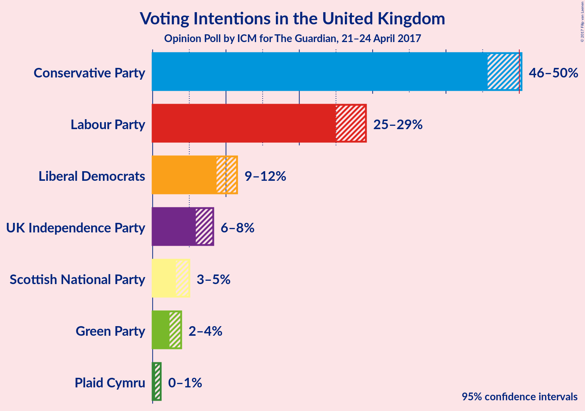

# Opinion Poll by ICM for The Guardian, 21–24 April 2017

<a href="#voting-intentions">Voting Intentions</a> | <a href="#seats">Seats</a> | <a href="#technical-information">Technical Information</a>

## Voting Intentions

### Confidence Intervals

| Party | 80% Confidence Interval | 90% Confidence Interval | 95% Confidence Interval | 99% Confidence Interval |
|:-----:|:-----------------------:|:-----------------------:|:-----------------------:|:-----------------------:|
| Conservative Party | 46.5–49.5% |46.0–49.9% |45.7–50.3% |44.9–51.0% |
| Labour Party | 25.7–28.4% |25.3–28.7% |25.0–29.1% |24.4–29.8% |
| Liberal Democrats | 9.2–11.0% |8.9–11.3% |8.7–11.5% |8.3–12.0% |
| UK Independence Party | 6.3–7.8% |6.1–8.0% |5.9–8.3% |5.6–8.7% |
| Scottish National Party | 3.4–4.6% |3.3–4.8% |3.2–5.0% |2.9–5.3% |
| Green Party | 2.5–3.6% |2.4–3.7% |2.3–3.9% |2.1–4.2% |
| Plaid Cymru | 0.4–0.9% |0.4–1.0% |0.3–1.1% |0.3–1.3% |

## Seats

### Confidence Intervals

| Party | 80% Confidence Interval | 90% Confidence Interval | 95% Confidence Interval | 99% Confidence Interval |
|:-----:|:-----------------------:|:-----------------------:|:-----------------------:|:-----------------------:|
| Conservative Party | 381–408 |379–412 |376–415 |370–420 |
| Labour Party | 155–182 |152–184 |149–186 |144–192 |
| Liberal Democrats | 12–23 |11–25 |9–27 |7–29 |
| UK Independence Party | 0 |0 |0 |0 |
| Scottish National Party | 42–53 |40–54 |38–54 |34–56 |
| Green Party | 0–1 |0–1 |0–1 |0–1 |
| Plaid Cymru | 3–4 |1–6 |0–7 |0–8 |

## Technical Information

### Opinion Poll

+ **Pollster:** ICM
+ **Media:** The Guardian
+ **Fieldwork period:** 21–24 April 2017

### Calculations

+ **Simulations done:** 4,194,304
+ **Error estimate:** 0.49%

