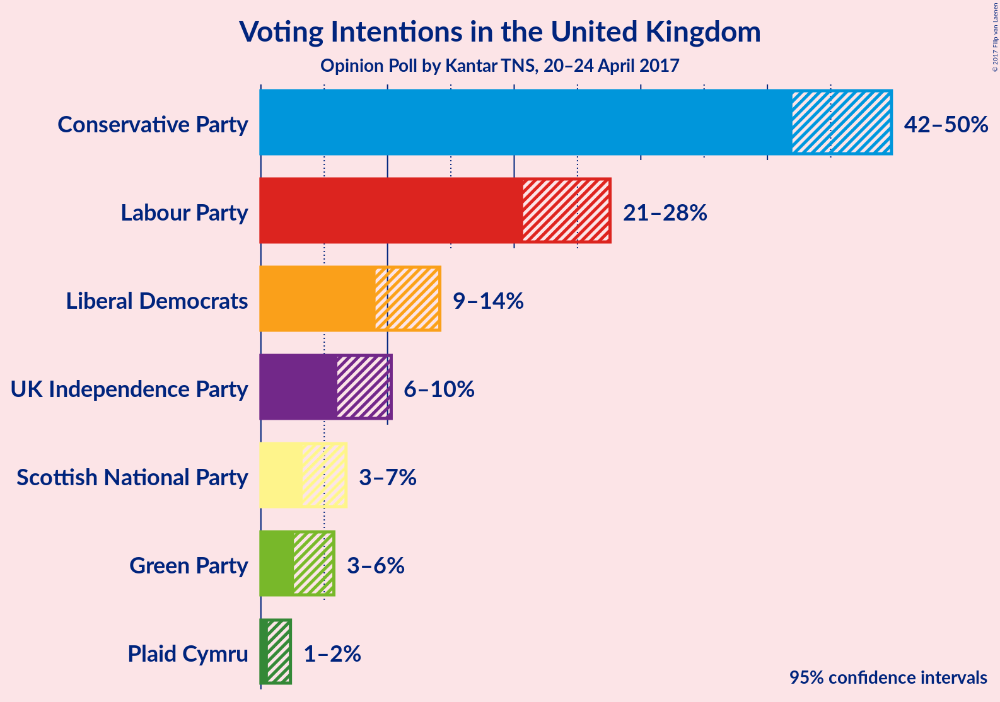
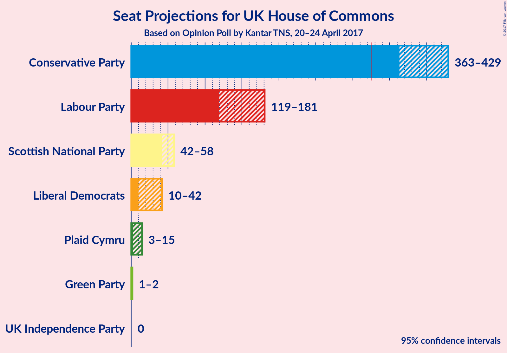

# Opinion Poll by Kantar TNS, 20–24 April 2017

<a href="#voting-intentions">Voting Intentions</a> | <a href="#seats">Seats</a> | <a href="#technical-information">Technical Information</a>

## Voting Intentions

## Seats

## Technical Information

| Key | Value |
|-----|-------|
| **Pollster** | Kantar TNS | 
| **Media** | — | 
| **Fieldwork period** | 20–24 April 2017 | 

