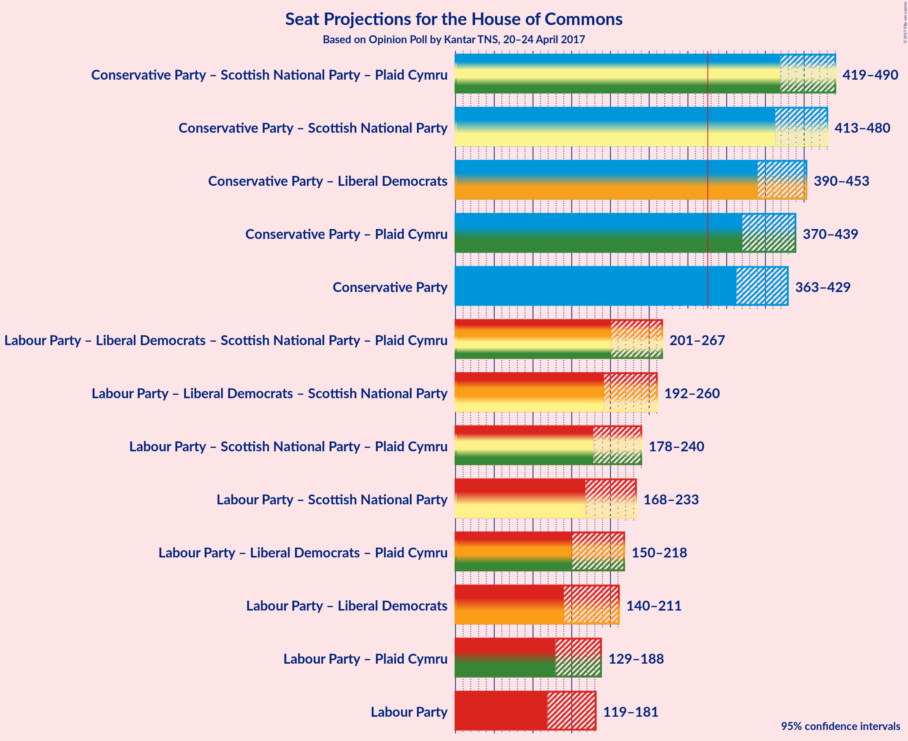

# Opinion Poll by Kantar TNS, 20–24 April 2017

<a href="#voting-intentions">Voting Intentions</a> | <a href="#seats">Seats</a> | <a href="#coalitions">Coalitions</a> | <a href="#technical-information">Technical Information</a>

## Voting Intentions

### Confidence Intervals

| Party | Last Result | Poll Result | 80% Confidence Interval | 90% Confidence Interval | 95% Confidence Interval | 99% Confidence Interval |
|:-----:|:-----------:|:-----------:|:-----------------------:|:-----------------------:|:-----------------------:|:-----------------------:|
| Conservative Party | 37.8% | 46.4% | 43.3–48.6% |42.7–49.2% |42.0–49.8% |40.7–51.0% |
| Labour Party | 31.2% | 24.2% | 21.8–26.3% |21.3–27.0% |20.7–27.6% |19.8–28.7% |
| Liberal Democrats | 8.1% | 11.5% | 9.9–13.2% |9.5–13.7% |9.1–14.1% |8.4–15.0% |
| UK Independence Party | 12.9% | 8.0% | 6.6–9.5% |6.3–9.9% |6.0–10.3% |5.5–11.1% |
| Scottish National Party | 4.9% | 4.8% | 3.7–6.0% |3.4–6.4% |3.3–6.7% |2.9–7.4% |
| Green Party | 3.8% | 4.0% | 3.0–5.2% |2.9–5.5% |2.6–5.8% |2.3–6.4% |
| Plaid Cymru | 0.6% | 1.1% | 0.7–1.9% |0.5–2.2% |0.5–2.3% |0.4–2.7% |

*Note:* The poll result column reflects the actual value used in the calculations. Published results may vary slightly, and in addition be rounded to fewer digits.

## Seats

### Confidence Intervals

| Party | Last Result | 80% Confidence Interval | 90% Confidence Interval | 95% Confidence Interval | 99% Confidence Interval |
|:-----:|:-----------:|:-----------------------:|:-----------------------:|:-----------------------:|:-----------------------:|
| <a href="#conservative-party">Conservative Party</a> | 331 | 374–419 |369–424 |363–429 |352–439 |
| <a href="#labour-party">Labour Party</a> | 232 | 130–173 |124–177 |119–181 |110–193 |
| <a href="#liberal-democrats">Liberal Democrats</a> | 8 | 15–34 |12–37 |10–42 |8–48 |
| <a href="#uk-independence-party">UK Independence Party</a> | 1 | 0 |0 |0 |0 |
| <a href="#scottish-national-party">Scottish National Party</a> | 56 | 45–56 |43–58 |42–58 |37–59 |
| <a href="#green-party">Green Party</a> | 1 | 1–2 |1–2 |1–2 |0–2 |
| <a href="#plaid-cymru">Plaid Cymru</a> | 3 | 4–12 |4–14 |3–15 |1–19 |

## Coalitions

## Technical Information

### Opinion Poll

+ **Pollster:** Kantar TNS
+ **Media:** —
+ **Fieldwork period:** 20–24 April 2017

### Calculations

+ **Sample size:** 627
+ **Simulations done:** 1,048,576
+ **Error estimate:** 0.82%

