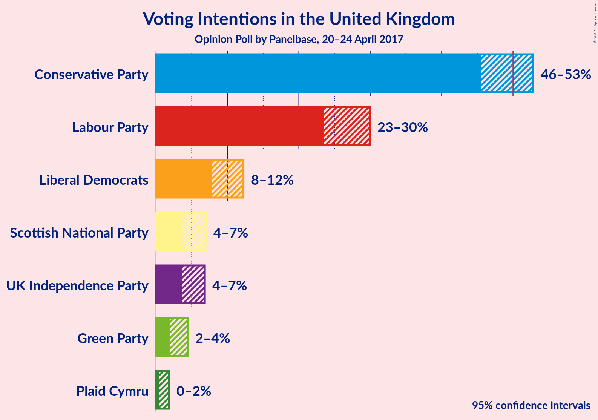
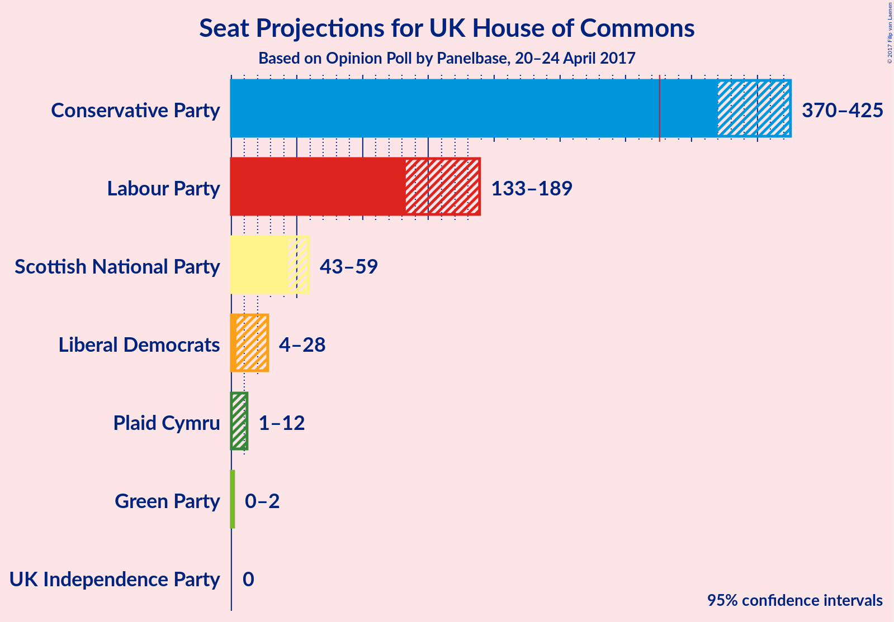

# Opinion Poll by Panelbase, 20–24 April 2017

<a href="#voting-intentions">Voting Intentions</a> | <a href="#seats">Seats</a> | <a href="#technical-information">Technical Information</a>

## Voting Intentions

### Confidence Intervals

| Party | Last Result | Poll Result | 80% Confidence Interval | 90% Confidence Interval | 95% Confidence Interval | 99% Confidence Interval |
|:-----:|:-----------:|:-----------:|:-----------------------:|:-----------------------:|:-----------------------:|:-----------------------:|
| Conservative Party | 37.8% | 49.4% | 46.8–51.6% |46.1–52.2% |45.5–52.8% |44.4–54.0% |
| Labour Party | 31.2% | 26.7% | 24.6–28.8% |24.0–29.4% |23.5–29.9% |22.5–31.0% |
| Liberal Democrats | 8.1% | 9.9% | 8.5–11.4% |8.2–11.8% |7.9–12.2% |7.3–13.0% |
| Scottish National Party | 4.9% | 5.2% | 4.2–6.3% |3.9–6.7% |3.7–7.0% |3.3–7.6% |
| UK Independence Party | 12.9% | 5.0% | 4.1–6.2% |3.8–6.5% |3.6–6.8% |3.2–7.5% |
| Green Party | 3.8% | 2.9% | 2.2–3.9% |2.1–4.2% |1.9–4.4% |1.6–4.9% |
| Plaid Cymru | 0.6% | 0.8% | 0.5–1.5% |0.4–1.6% |0.4–1.8% |0.3–2.2% |

*Note:* The poll result column reflects the actual value used in the calculations. Published results may vary slightly, and in addition be rounded to fewer digits.

## Seats

### Confidence Intervals

| Party | Last Result | 80% Confidence Interval | 90% Confidence Interval | 95% Confidence Interval | 99% Confidence Interval |
|:-----:|:-----------:|:-----------------------:|:-----------------------:|:-----------------------:|:-----------------------:|
| <a href="conservative-party">Conservative Party</a> | 331 | 380–418 |374–421 |370–425 |360–434 |
| <a href="labour-party">Labour Party</a> | 232 | 141–180 |138–183 |133–189 |123–199 |
| <a href="liberal-democrats">Liberal Democrats</a> | 8 | 6–23 |5–26 |4–28 |4–31 |
| <a href="scottish-national-party">Scottish National Party</a> | 56 | 47–58 |45–59 |43–59 |40–59 |
| <a href="uk-independence-party">UK Independence Party</a> | 1 | 0 |0 |0 |0 |
| <a href="green-party">Green Party</a> | 1 | 0–1 |0–1 |0–2 |0–2 |
| <a href="plaid-cymru">Plaid Cymru</a> | 3 | 4–8 |3–11 |1–12 |0–13 |

## Technical Information

### Opinion Poll

+ **Pollster:** Panelbase
+ **Media:** —
+ **Fieldwork period:** 20–24 April 2017

### Calculations

+ **Sample size:** 718
+ **Simulations done:** 2,097,152
+ **Error estimate:** 1.63%

