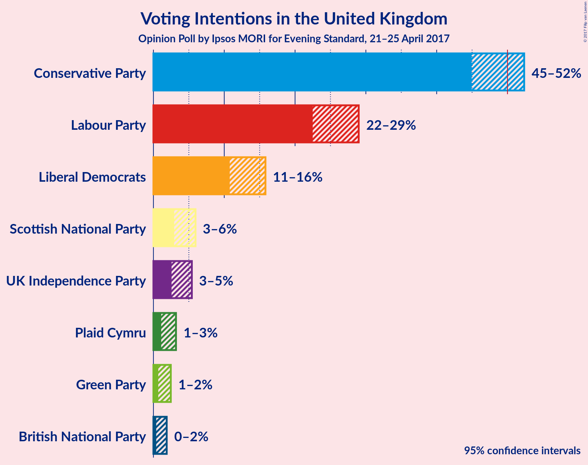

# Opinion Poll by Ipsos MORI for Evening Standard, 21–25 April 2017

<a href="#voting-intentions">Voting Intentions</a> | <a href="#seats">Seats</a> | <a href="#technical-information">Technical Information</a>

## Voting Intentions

### Confidence Intervals

| Party | 80% Confidence Interval | 90% Confidence Interval | 95% Confidence Interval | 99% Confidence Interval |
|:-----:|:-----------------------:|:-----------------------:|:-----------------------:|:-----------------------:|
| Conservative Party | 46.2–51.1% |45.5–51.8% |44.9–52.4% |43.8–53.5% |
| Labour Party | 23.6–27.8% |23.0–28.5% |22.5–29.0% |21.6–30.1% |
| Liberal Democrats | 11.6–14.9% |11.1–15.4% |10.8–15.8% |10.1–16.7% |
| Scottish National Party | 3.3–5.3% |3.1–5.6% |2.9–5.9% |2.6–6.5% |
| UK Independence Party | 3.0–4.8% |2.7–5.2% |2.6–5.4% |2.2–6.0% |
| Plaid Cymru | 1.4–2.7% |1.2–3.0% |1.1–3.2% |0.9–3.6% |
| Green Party | 0.9–2.0% |0.8–2.3% |0.7–2.5% |0.5–2.9% |
| British National Party | 0.5–1.5% |0.5–1.7% |0.4–1.9% |0.3–2.2% |

## Seats

## Technical Information

### Opinion Poll

+ **Pollster:** Ipsos MORI
+ **Media:** Evening Standard
+ **Fieldwork period:** 21–25 April 2017

### Calculations

+ **Simulations done:** 1,048,576
+ **Error estimate:** 1.19%

