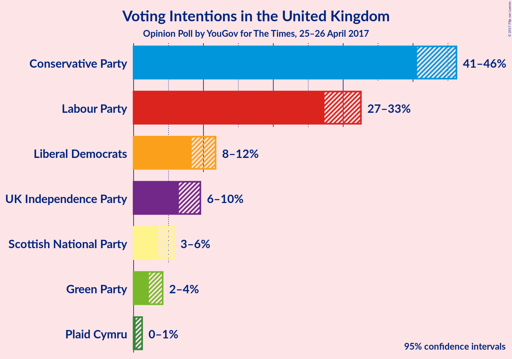
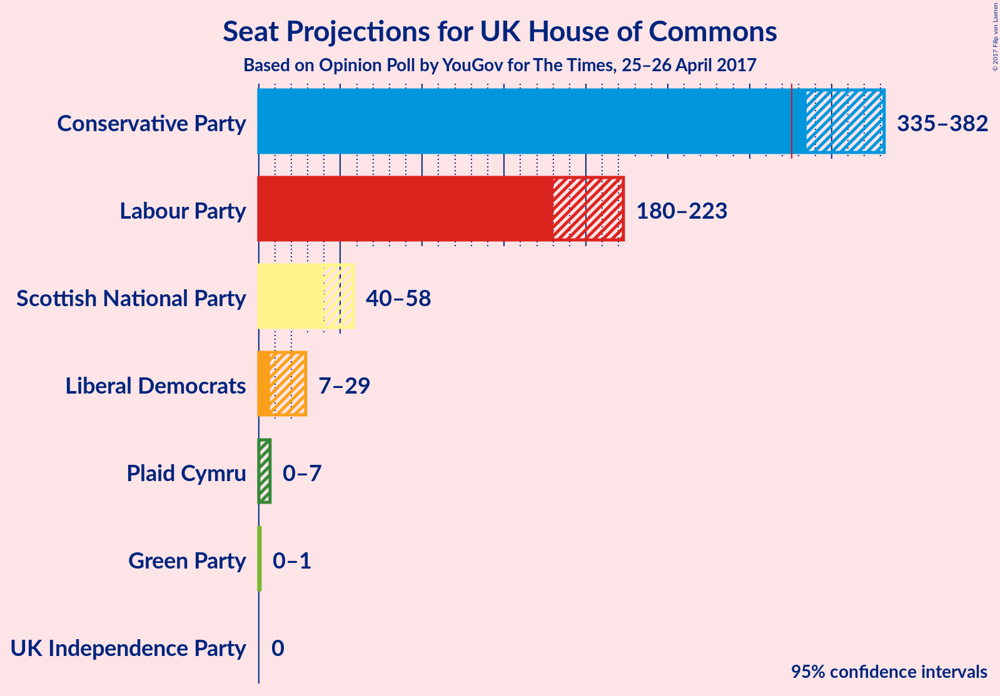

# Opinion Poll by YouGov for The Times, 25–26 April 2017

<a href="#voting-intentions">Voting Intentions</a> | <a href="#seats">Seats</a> | <a href="#technical-information">Technical Information</a>

## Voting Intentions

### Confidence Intervals

| Party | 80% Confidence Interval | 90% Confidence Interval | 95% Confidence Interval | 99% Confidence Interval |
|:-----:|:-----------------------:|:-----------------------:|:-----------------------:|:-----------------------:|
| Conservative Party | 42–45% |41–46% |41–46% |40–47% |
| Labour Party | 28–32% |28–32% |27–33% |27–33% |
| Liberal Democrats | 9–11% |9–11% |8–12% |8–12% |
| UK Independence Party | 7–9% |7–9% |6–10% |6–10% |
| Scottish National Party | 4–5% |4–6% |3–6% |3–6% |
| Green Party | 2–4% |2–4% |2–4% |2–5% |
| Plaid Cymru | 0–1% |0–1% |0–1% |0–1% |

## Seats

## Technical Information

### Opinion Poll

+ **Pollster:** YouGov
+ **Media:** The Times
+ **Fieldwork period:** 25–26 April 2017

### Calculations

+ **Simulations done:** 131,072
+ **Error estimate:** 2.36%

