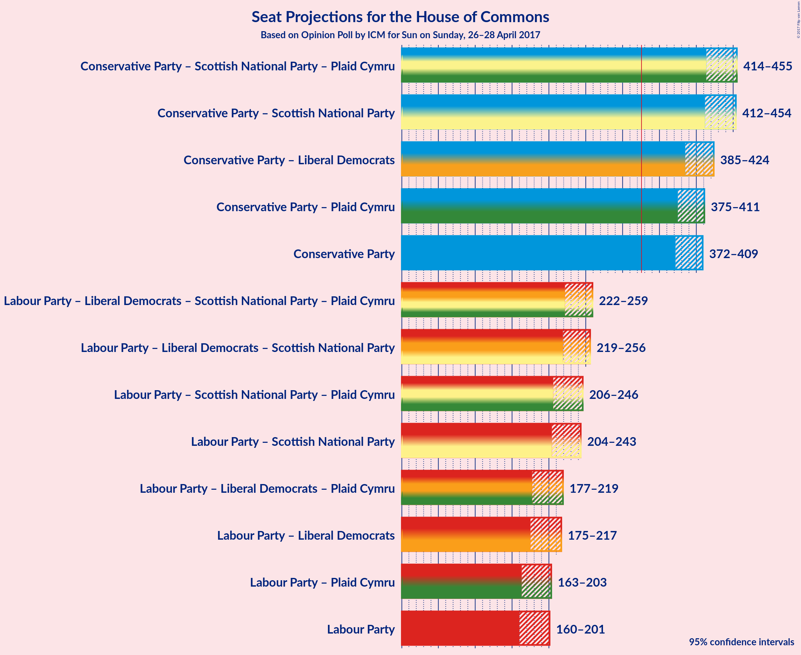

# Opinion Poll by ICM for Sun on Sunday, 26–28 April 2017

<a href="#voting-intentions">Voting Intentions</a> | <a href="#seats">Seats</a> | <a href="#coalitions">Coalitions</a> | <a href="#technical-information">Technical Information</a>

## Voting Intentions

### Confidence Intervals

| Party | Last Result | Poll Result | 80% Confidence Interval | 90% Confidence Interval | 95% Confidence Interval | 99% Confidence Interval |
|:-----:|:-----------:|:-----------:|:-----------------------:|:-----------------------:|:-----------------------:|:-----------------------:|
| Conservative Party | 37.8% | 47.0% | 45.6–48.5% |45.2–48.9% |44.8–49.2% |44.2–49.9% |
| Labour Party | 31.2% | 28.0% | 26.7–29.3% |26.4–29.7% |26.1–30.0% |25.5–30.6% |
| Liberal Democrats | 8.1% | 9.0% | 8.2–9.9% |8.0–10.1% |7.8–10.3% |7.5–10.8% |
| UK Independence Party | 12.9% | 8.0% | 7.3–8.8% |7.1–9.1% |6.9–9.3% |6.6–9.7% |
| Green Party | 3.8% | 4.0% | 3.5–4.6% |3.3–4.8% |3.2–4.9% |3.0–5.2% |
| Scottish National Party | 4.9% | 3.5% | 3.0–4.1% |2.9–4.3% |2.8–4.4% |2.6–4.7% |
| Plaid Cymru | 0.6% | 0.4% | 0.3–0.7% |0.3–0.8% |0.2–0.9% |0.2–1.0% |

*Note:* The poll result column reflects the actual value used in the calculations. Published results may vary slightly, and in addition be rounded to fewer digits.

## Seats

### Confidence Intervals

| Party | Last Result | 80% Confidence Interval | 90% Confidence Interval | 95% Confidence Interval | 99% Confidence Interval |
|:-----:|:-----------:|:-----------------------:|:-----------------------:|:-----------------------:|:-----------------------:|
| <a href="#conservative-party">Conservative Party</a> | 331 | 379–400 |374–406 |372–409 |365–414 |
| <a href="#labour-party">Labour Party</a> | 232 | 170–193 |165–196 |160–201 |155–210 |
| <a href="#liberal-democrats">Liberal Democrats</a> | 8 | 10–19 |9–19 |8–20 |6–24 |
| <a href="#uk-independence-party">UK Independence Party</a> | 1 | 0 |0 |0 |0 |
| <a href="#green-party">Green Party</a> | 1 | 1–2 |1–2 |1–2 |1–2 |
| <a href="#scottish-national-party">Scottish National Party</a> | 56 | 36–50 |34–52 |28–53 |20–55 |
| <a href="#plaid-cymru">Plaid Cymru</a> | 3 | 0–4 |0–4 |0–4 |0–6 |

### Conservative Party

| Number of Seats | Probability | Accumulated |
|:---------------:|:-----------:|:-----------:|
| 358 | 0% | 100% |
| 359 | 0% | 99.9% |
| 360 | 0% | 99.9% |
| 361 | 0% | 99.9% |
| 362 | 0% | 99.9% |
| 363 | 0% | 99.8% |
| 364 | 0.1% | 99.8% |
| 365 | 0.1% | 99.6% |
| 366 | 0.1% | 99.5% |
| 367 | 0.3% | 99.4% |
| 368 | 0.3% | 99.1% |
| 369 | 0.4% | 98.8% |
| 370 | 0.3% | 98% |
| 371 | 0.2% | 98% |
| 372 | 0.8% | 98% |
| 373 | 1.1% | 97% |
| 374 | 1.1% | 96% |
| 375 | 0.6% | 95% |
| 376 | 1.4% | 94% |
| 377 | 0.8% | 93% |
| 378 | 2% | 92% |
| 379 | 2% | 91% |
| 380 | 3% | 89% |
| 381 | 4% | 86% |
| 382 | 6% | 81% |
| 383 | 5% | 76% |
| 384 | 6% | 71% |
| 385 | 4% | 65% |
| 386 | 7% | 61% |
| 387 | 5% | 54% |
| 388 | 4% | 49% |
| 389 | 3% | 45% |
| 390 | 6% | 42% |
| 391 | 3% | 37% |
| 392 | 9% | 34% |
| 393 | 3% | 25% |
| 394 | 3% | 22% |
| 395 | 2% | 19% |
| 396 | 1.5% | 17% |
| 397 | 3% | 16% |
| 398 | 0.7% | 13% |
| 399 | 1.2% | 12% |
| 400 | 2% | 11% |
| 401 | 2% | 10% |
| 402 | 1.0% | 8% |
| 403 | 1.0% | 7% |
| 404 | 0.5% | 6% |
| 405 | 0.5% | 6% |
| 406 | 1.0% | 5% |
| 407 | 0.6% | 4% |
| 408 | 0.5% | 3% |
| 409 | 0.6% | 3% |
| 410 | 0.4% | 2% |
| 411 | 0.4% | 2% |
| 412 | 0.4% | 1.5% |
| 413 | 0.5% | 1.1% |
| 414 | 0.1% | 0.6% |
| 415 | 0.1% | 0.5% |
| 416 | 0.1% | 0.4% |
| 417 | 0.1% | 0.3% |
| 418 | 0.1% | 0.2% |
| 419 | 0% | 0.2% |
| 420 | 0% | 0.1% |
| 421 | 0% | 0.1% |
| 422 | 0% | 0.1% |
| 423 | 0% | 0% |

### Labour Party

| Number of Seats | Probability | Accumulated |
|:---------------:|:-----------:|:-----------:|
| 149 | 0% | 100% |
| 150 | 0% | 99.9% |
| 151 | 0.1% | 99.9% |
| 152 | 0% | 99.9% |
| 153 | 0.1% | 99.8% |
| 154 | 0.1% | 99.8% |
| 155 | 0.3% | 99.7% |
| 156 | 0.1% | 99.4% |
| 157 | 0.2% | 99.3% |
| 158 | 0.3% | 99.1% |
| 159 | 0.7% | 98.8% |
| 160 | 1.0% | 98% |
| 161 | 0.5% | 97% |
| 162 | 0.4% | 97% |
| 163 | 0.6% | 96% |
| 164 | 0.5% | 96% |
| 165 | 0.7% | 95% |
| 166 | 0.7% | 94% |
| 167 | 0.7% | 94% |
| 168 | 2% | 93% |
| 169 | 0.7% | 91% |
| 170 | 1.1% | 91% |
| 171 | 1.5% | 90% |
| 172 | 1.0% | 88% |
| 173 | 3% | 87% |
| 174 | 1.3% | 85% |
| 175 | 3% | 83% |
| 176 | 4% | 81% |
| 177 | 6% | 76% |
| 178 | 4% | 71% |
| 179 | 4% | 67% |
| 180 | 5% | 62% |
| 181 | 3% | 57% |
| 182 | 4% | 54% |
| 183 | 3% | 50% |
| 184 | 6% | 46% |
| 185 | 6% | 41% |
| 186 | 4% | 35% |
| 187 | 4% | 31% |
| 188 | 4% | 27% |
| 189 | 5% | 23% |
| 190 | 2% | 18% |
| 191 | 2% | 16% |
| 192 | 4% | 14% |
| 193 | 2% | 10% |
| 194 | 2% | 8% |
| 195 | 1.0% | 7% |
| 196 | 0.8% | 6% |
| 197 | 0.9% | 5% |
| 198 | 0.4% | 4% |
| 199 | 0.5% | 3% |
| 200 | 0.3% | 3% |
| 201 | 0.5% | 3% |
| 202 | 0.3% | 2% |
| 203 | 0.3% | 2% |
| 204 | 0.2% | 1.5% |
| 205 | 0.4% | 1.3% |
| 206 | 0.1% | 0.9% |
| 207 | 0.1% | 0.7% |
| 208 | 0.1% | 0.6% |
| 209 | 0.1% | 0.6% |
| 210 | 0.1% | 0.5% |
| 211 | 0% | 0.4% |
| 212 | 0.1% | 0.4% |
| 213 | 0.1% | 0.3% |
| 214 | 0% | 0.2% |
| 215 | 0% | 0.2% |
| 216 | 0% | 0.1% |
| 217 | 0% | 0.1% |
| 218 | 0% | 0.1% |
| 219 | 0% | 0.1% |
| 220 | 0% | 0.1% |
| 221 | 0% | 0% |

### Liberal Democrats

| Number of Seats | Probability | Accumulated |
|:---------------:|:-----------:|:-----------:|
| 5 | 0.1% | 100% |
| 6 | 0.4% | 99.8% |
| 7 | 1.3% | 99.4% |
| 8 | 2% | 98% |
| 9 | 4% | 96% |
| 10 | 3% | 91% |
| 11 | 5% | 89% |
| 12 | 12% | 84% |
| 13 | 11% | 71% |
| 14 | 4% | 60% |
| 15 | 11% | 56% |
| 16 | 6% | 45% |
| 17 | 16% | 39% |
| 18 | 2% | 23% |
| 19 | 17% | 21% |
| 20 | 2% | 4% |
| 21 | 1.1% | 2% |
| 22 | 0.2% | 1.1% |
| 23 | 0.3% | 0.8% |
| 24 | 0.3% | 0.5% |
| 25 | 0.1% | 0.2% |
| 26 | 0.1% | 0.1% |
| 27 | 0% | 0.1% |
| 28 | 0% | 0% |

### UK Independence Party

| Number of Seats | Probability | Accumulated |
|:---------------:|:-----------:|:-----------:|
| 0 | 100% | 100% |
| 1 | 0% | 0% |

### Green Party

| Number of Seats | Probability | Accumulated |
|:---------------:|:-----------:|:-----------:|
| 1 | 83% | 100% |
| 2 | 17% | 17% |
| 3 | 0% | 0% |

### Scottish National Party

| Number of Seats | Probability | Accumulated |
|:---------------:|:-----------:|:-----------:|
| 12 | 0% | 100% |
| 13 | 0% | 99.9% |
| 14 | 0% | 99.9% |
| 15 | 0% | 99.9% |
| 16 | 0% | 99.8% |
| 17 | 0% | 99.8% |
| 18 | 0% | 99.8% |
| 19 | 0.1% | 99.7% |
| 20 | 0.2% | 99.7% |
| 21 | 0.1% | 99.5% |
| 22 | 0.3% | 99.4% |
| 23 | 0% | 99.1% |
| 24 | 0% | 99.1% |
| 25 | 0.4% | 99.0% |
| 26 | 0.6% | 98.7% |
| 27 | 0.6% | 98% |
| 28 | 0.1% | 98% |
| 29 | 0.4% | 97% |
| 30 | 0.2% | 97% |
| 31 | 0.1% | 97% |
| 32 | 0.6% | 97% |
| 33 | 0.4% | 96% |
| 34 | 1.1% | 96% |
| 35 | 1.0% | 95% |
| 36 | 5% | 94% |
| 37 | 4% | 88% |
| 38 | 5% | 85% |
| 39 | 4% | 79% |
| 40 | 6% | 76% |
| 41 | 3% | 70% |
| 42 | 9% | 67% |
| 43 | 4% | 58% |
| 44 | 8% | 54% |
| 45 | 11% | 46% |
| 46 | 7% | 35% |
| 47 | 6% | 27% |
| 48 | 5% | 22% |
| 49 | 4% | 16% |
| 50 | 3% | 12% |
| 51 | 2% | 9% |
| 52 | 3% | 7% |
| 53 | 2% | 4% |
| 54 | 1.0% | 2% |
| 55 | 0.6% | 0.7% |
| 56 | 0.1% | 0.1% |
| 57 | 0% | 0% |

### Plaid Cymru

| Number of Seats | Probability | Accumulated |
|:---------------:|:-----------:|:-----------:|
| 0 | 22% | 100% |
| 1 | 10% | 78% |
| 2 | 0.3% | 69% |
| 3 | 35% | 68% |
| 4 | 31% | 33% |
| 5 | 2% | 2% |
| 6 | 0.2% | 0.6% |
| 7 | 0.4% | 0.4% |
| 8 | 0% | 0% |

## Coalitions

### Confidence Intervals

| Coalition | Last Result | 80% Confidence Interval | 90% Confidence Interval | 95% Confidence Interval | 99% Confidence Interval |
|:---------:|:-----------:|:-----------------------:|:-----------------------:|:-----------------------:|:-----------------------:|
| Conservative Party – Scottish National Party – Plaid Cymru | 390 | 422–446 | 418–452 | 414–455 | 406–461 |
| Conservative Party – Scottish National Party | 387 | 420–443 | 417–450 | 412–454 | 403–460 |
| Conservative Party – Liberal Democrats | 339 | 392–415 | 389–420 | 385–424 | 379–431 |
| Conservative Party – Plaid Cymru | 334 | 381–403 | 378–407 | 375–411 | 367–417 |
| Conservative Party | 331 | 379–400 | 374–406 | 372–409 | 365–414 |
| Labour Party – Liberal Democrats – Scottish National Party – Plaid Cymru | 299 | 230–252 | 225–257 | 222–259 | 216–266 |
| Labour Party – Liberal Democrats – Scottish National Party | 296 | 228–250 | 223–253 | 219–256 | 214–264 |
| Labour Party – Scottish National Party – Plaid Cymru | 291 | 215–239 | 210–242 | 206–246 | 200–252 |
| Labour Party – Scottish National Party | 288 | 213–236 | 208–240 | 204–243 | 198–249 |
| Labour Party – Liberal Democrats – Plaid Cymru | 243 | 187–211 | 181–214 | 177–219 | 171–228 |
| Labour Party – Liberal Democrats | 240 | 184–209 | 179–213 | 175–217 | 169–225 |
| Labour Party – Plaid Cymru | 235 | 172–195 | 167–199 | 163–203 | 158–212 |
| Labour Party | 232 | 170–193 | 165–196 | 160–201 | 155–210 |

## Technical Information

### Opinion Poll

+ **Pollster:** ICM
+ **Media:** Sun on Sunday
+ **Fieldwork period:** 26–28 April 2017

### Calculations

+ **Sample size:** 2011
+ **Simulations done:** 4,194,304
+ **Error estimate:** 0.64%

