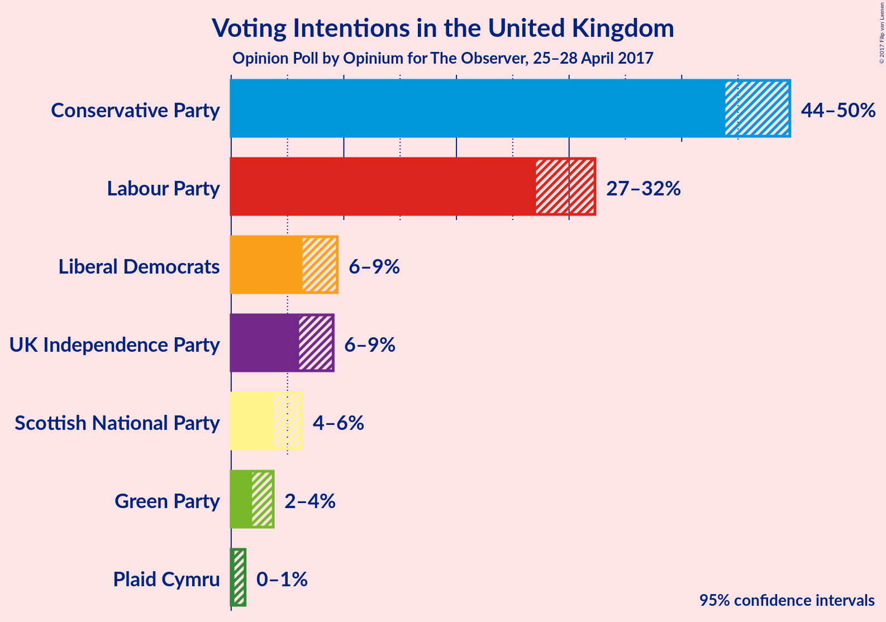
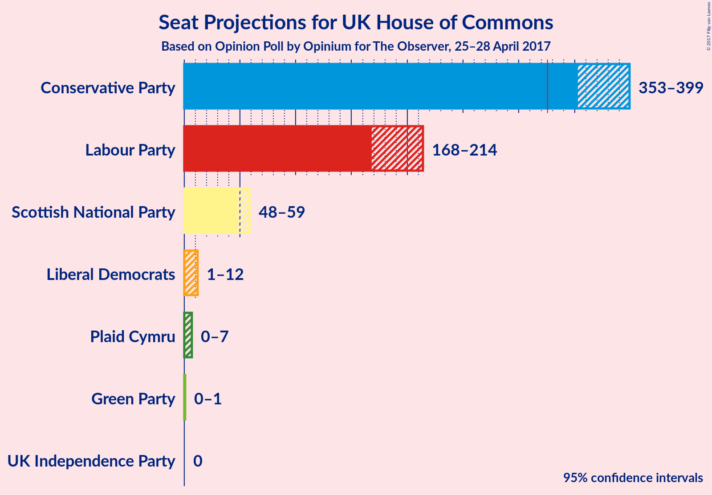

# Opinion Poll by Opinium for The Observer, 25–28 April 2017

<a href="#voting-intentions">Voting Intentions</a> | <a href="#seats">Seats</a> | <a href="#technical-information">Technical Information</a>

## Voting Intentions

### Confidence Intervals

| Party | Last Result | Poll Result | 80% Confidence Interval | 90% Confidence Interval | 95% Confidence Interval | 99% Confidence Interval |
|:-----:|:-----------:|:-----------:|:-----------------------:|:-----------------------:|:-----------------------:|:-----------------------:|
| Conservative Party | 37.8% | 46.9% | 44.9–48.6% |44.3–49.1% |43.9–49.6% |43.0–50.5% |
| Labour Party | 31.2% | 29.7% | 28.0–31.4% |27.5–31.9% |27.1–32.3% |26.3–33.2% |
| Liberal Democrats | 8.1% | 7.8% | 6.8–8.8% |6.6–9.1% |6.3–9.4% |5.9–10.0% |
| UK Independence Party | 12.9% | 7.4% | 6.5–8.5% |6.2–8.8% |6.0–9.1% |5.6–9.6% |
| Scottish National Party | 4.9% | 4.9% | 4.1–5.8% |3.9–6.0% |3.8–6.2% |3.4–6.7% |
| Green Party | 3.8% | 2.6% | 2.1–3.4% |2.0–3.6% |1.9–3.7% |1.6–4.1% |
| Plaid Cymru | 0.6% | 0.6% | 0.4–1.0% |0.3–1.1% |0.3–1.2% |0.2–1.5% |

*Note:* The poll result column reflects the actual value used in the calculations. Published results may vary slightly, and in addition be rounded to fewer digits.

## Seats

### Confidence Intervals

| Party | Last Result | 80% Confidence Interval | 90% Confidence Interval | 95% Confidence Interval | 99% Confidence Interval |
|:-----:|:-----------:|:-----------------------:|:-----------------------:|:-----------------------:|:-----------------------:|
| Conservative Party | 331 | 363–390 |357–395 |353–399 |348–408 |
| Labour Party | 232 | 177–204 |173–211 |168–214 |159–219 |
| Liberal Democrats | 8 | 3–9 |2–11 |1–12 |0–15 |
| UK Independence Party | 1 | 0 |0 |0 |0 |
| Scottish National Party | 56 | 52–57 |50–58 |48–59 |42–59 |
| Green Party | 1 | 0–1 |0–1 |0–1 |0–1 |
| Plaid Cymru | 3 | 1–5 |0–7 |0–7 |0–8 |

## Technical Information

### Opinion Poll

+ **Pollster:** Opinium
+ **Media:** The Observer
+ **Fieldwork period:** 25–28 April 2017

### Calculations

+ **Sample size:** 1170
+ **Simulations done:** 2,097,152
+ **Error estimate:** 0.34%

