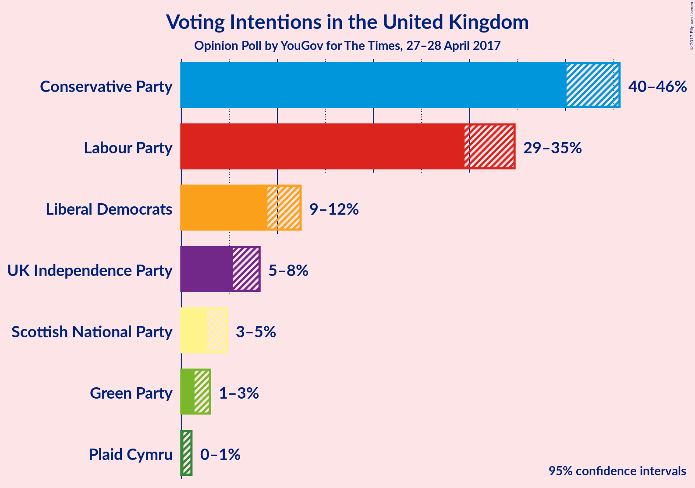

# Opinion Poll by YouGov for The Times, 27–28 April 2017

<a href="#voting-intentions">Voting Intentions</a> | <a href="#seats">Seats</a> | <a href="#technical-information">Technical Information</a>

## Voting Intentions

### Confidence Intervals

| Party | 80% Confidence Interval | 90% Confidence Interval | 95% Confidence Interval | 99% Confidence Interval |
|:-----:|:-----------------------:|:-----------------------:|:-----------------------:|:-----------------------:|
| Conservative Party | 41.0–44.6% |40.5–45.2% |40.1–45.6% |39.2–46.5% |
| Labour Party | 30.3–33.8% |29.9–34.2% |29.5–34.7% |28.7–35.5% |
| Liberal Democrats | 9.5–11.8% |9.2–12.1% |9.0–12.4% |8.5–13.0% |
| UK Independence Party | 5.8–7.6% |5.5–7.9% |5.3–8.1% |5.0–8.6% |
| Scottish National Party | 3.0–4.3% |2.8–4.5% |2.7–4.7% |2.4–5.1% |
| Green Party | 1.6–2.6% |1.5–2.8% |1.4–3.0% |1.2–3.3% |
| Plaid Cymru | 0.3–0.9% |0.3–1.0% |0.2–1.1% |0.2–1.3% |

## Seats

### Confidence Intervals

| Party | 80% Confidence Interval | 90% Confidence Interval | 95% Confidence Interval | 99% Confidence Interval |
|:-----:|:-----------------------:|:-----------------------:|:-----------------------:|:-----------------------:|
| Conservative Party | 329–363 |324–367 |320–372 |311–380 |
| Labour Party | 203–240 |198–248 |194–255 |186–269 |
| Liberal Democrats | 16–29 |14–30 |13–33 |10–39 |
| UK Independence Party | 0 |0 |0 |0 |
| Scottish National Party | 27–49 |17–50 |10–53 |4–54 |
| Green Party | 0–1 |0–1 |0–1 |0–1 |
| Plaid Cymru | 0–4 |0–4 |0–5 |0–7 |

## Technical Information

### Opinion Poll

+ **Pollster:** YouGov
+ **Media:** The Times
+ **Fieldwork period:** 27–28 April 2017

### Calculations

+ **Simulations done:** 2,097,152
+ **Error estimate:** 1.37%

