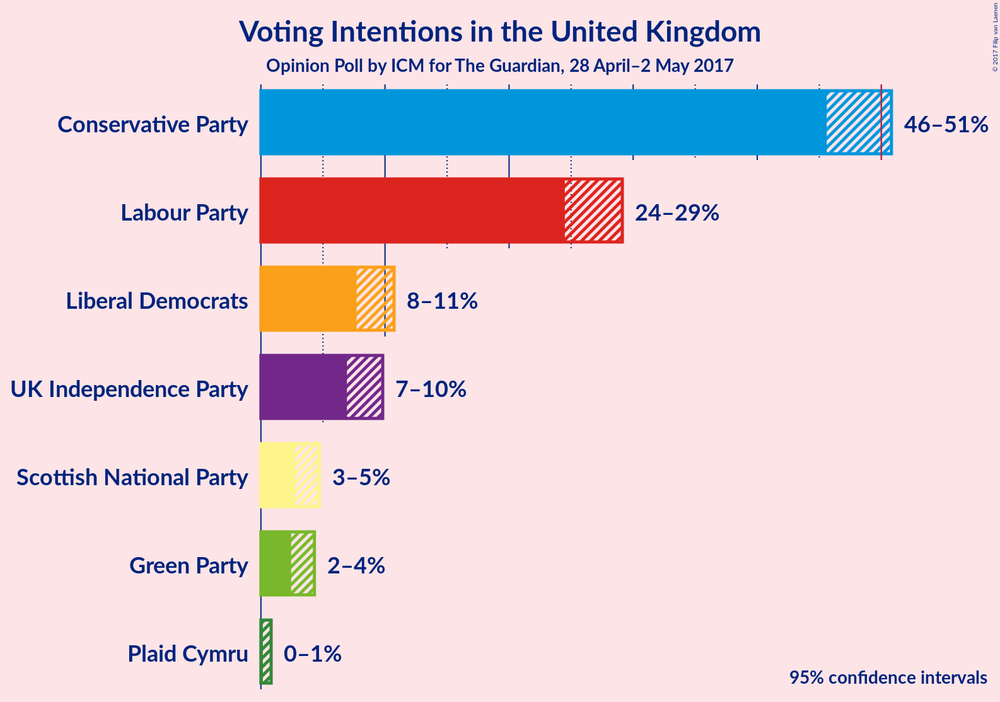
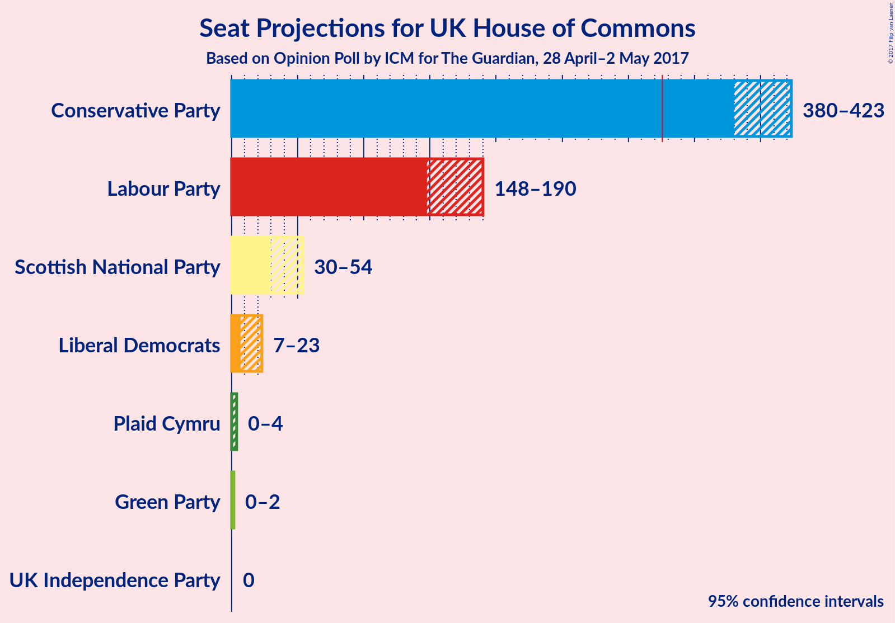

# Opinion Poll by ICM for The Guardian, 28 April–2 May 2017

<a href="#voting-intentions">Voting Intentions</a> | <a href="#seats">Seats</a> | <a href="#technical-information">Technical Information</a>

## Voting Intentions

### Confidence Intervals

| Party | Last Result | Poll Result | 80% Confidence Interval | 90% Confidence Interval | 95% Confidence Interval | 99% Confidence Interval |
|:-----:|:-----------:|:-----------:|:-----------------------:|:-----------------------:|:-----------------------:|:-----------------------:|
| Conservative Party | 37.8% | 48.4% | 46.5–49.9% |46.0–50.4% |45.6–50.8% |44.8–51.6% |
| Labour Party | 31.2% | 26.9% | 25.3–28.3% |24.9–28.7% |24.5–29.1% |23.8–29.9% |
| Liberal Democrats | 8.1% | 9.1% | 8.2–10.2% |7.9–10.5% |7.7–10.7% |7.3–11.2% |
| UK Independence Party | 12.9% | 8.3% | 7.4–9.3% |7.1–9.6% |6.9–9.8% |6.5–10.3% |
| Scottish National Party | 4.9% | 3.6% | 3.0–4.3% |2.9–4.5% |2.7–4.7% |2.5–5.1% |
| Green Party | 3.8% | 3.3% | 2.7–3.9% |2.6–4.1% |2.4–4.3% |2.2–4.7% |
| Plaid Cymru | 0.6% | 0.4% | 0.2–0.7% |0.2–0.7% |0.2–0.8% |0.1–1.0% |

*Note:* The poll result column reflects the actual value used in the calculations. Published results may vary slightly, and in addition be rounded to fewer digits.

## Seats

### Confidence Intervals

| Party | Last Result | 80% Confidence Interval | 90% Confidence Interval | 95% Confidence Interval | 99% Confidence Interval |
|:-----:|:-----------:|:-----------------------:|:-----------------------:|:-----------------------:|:-----------------------:|
| Conservative Party | 331 | 386–416 |383–421 |380–423 |374–430 |
| Labour Party | 232 | 153–185 |150–188 |148–190 |142–199 |
| Liberal Democrats | 8 | 9–19 |8–21 |7–23 |6–27 |
| UK Independence Party | 1 | 0 |0 |0 |0 |
| Scottish National Party | 56 | 36–51 |34–53 |30–54 |22–56 |
| Green Party | 1 | 1 |0–1 |0–2 |0–2 |
| Plaid Cymru | 3 | 0–4 |0–4 |0–4 |0–7 |

### Conservative Party

| Number of Seats | Probability |
|:---------------:|:-----------:|
| 370 | 0.1% |
| 371 | 0.1% |
| 372 | 0% |
| 373 | 0% |
| 374 | 0.2% |
| 375 | 0.2% |
| 376 | 0.2% |
| 377 | 0.2% |
| 378 | 0.5% |
| 379 | 0.6% |
| 380 | 0.5% |
| 381 | 0.4% |
| 382 | 0.7% |
| 383 | 2% |
| 384 | 1.2% |
| 385 | 1.0% |
| 386 | 5% |
| 387 | 1.1% |
| 388 | 4% |
| 389 | 0.5% |
| 390 | 3% |
| 391 | 4% |
| 392 | 3% |
| 393 | 2% |
| 394 | 3% |
| 395 | 5% |
| 396 | 2% |
| 397 | 1.1% |
| 398 | 2% |
| 399 | 2% |
| 400 | 2% |
| 401 | 5% |
| 402 | 2% |
| 403 | 2% |
| 404 | 3% |
| 405 | 3% |
| 406 | 1.3% |
| 407 | 4% |
| 408 | 4% |
| 409 | 1.1% |
| 410 | 3% |
| 411 | 4% |
| 412 | 0.8% |
| 413 | 3% |
| 414 | 2% |
| 415 | 2% |
| 416 | 2% |
| 417 | 2% |
| 418 | 0.9% |
| 419 | 1.1% |
| 420 | 0.4% |
| 421 | 0.8% |
| 422 | 1.0% |
| 423 | 0.9% |
| 424 | 0.5% |
| 425 | 0.3% |
| 426 | 0.3% |
| 427 | 0.1% |
| 428 | 0.5% |
| 429 | 0.1% |
| 430 | 0.1% |
| 431 | 0.1% |
| 432 | 0.1% |
| 433 | 0.1% |
| 434 | 0% |
| 435 | 0.1% |

### Labour Party

| Number of Seats | Probability |
|:---------------:|:-----------:|
| 140 | 0.1% |
| 141 | 0.1% |
| 142 | 0.3% |
| 143 | 0.3% |
| 144 | 0.1% |
| 145 | 0.4% |
| 146 | 0.2% |
| 147 | 0.4% |
| 148 | 1.4% |
| 149 | 0.5% |
| 150 | 1.4% |
| 151 | 1.2% |
| 152 | 3% |
| 153 | 1.1% |
| 154 | 1.2% |
| 155 | 2% |
| 156 | 1.0% |
| 157 | 2% |
| 158 | 4% |
| 159 | 4% |
| 160 | 4% |
| 161 | 2% |
| 162 | 2% |
| 163 | 2% |
| 164 | 3% |
| 165 | 3% |
| 166 | 1.0% |
| 167 | 7% |
| 168 | 2% |
| 169 | 0.8% |
| 170 | 3% |
| 171 | 1.3% |
| 172 | 4% |
| 173 | 2% |
| 174 | 3% |
| 175 | 2% |
| 176 | 2% |
| 177 | 5% |
| 178 | 1.5% |
| 179 | 4% |
| 180 | 1.4% |
| 181 | 4% |
| 182 | 2% |
| 183 | 2% |
| 184 | 1.3% |
| 185 | 2% |
| 186 | 2% |
| 187 | 1.2% |
| 188 | 1.0% |
| 189 | 0.6% |
| 190 | 2% |
| 191 | 0.4% |
| 192 | 0.4% |
| 193 | 0.1% |
| 194 | 0.2% |
| 195 | 0.3% |
| 196 | 0.1% |
| 197 | 0.1% |
| 198 | 0.1% |
| 199 | 0.1% |
| 200 | 0.1% |
| 201 | 0% |
| 202 | 0% |
| 203 | 0% |
| 204 | 0% |
| 205 | 0% |
| 206 | 0% |
| 207 | 0.1% |

### Liberal Democrats

| Number of Seats | Probability |
|:---------------:|:-----------:|
| 5 | 0.3% |
| 6 | 0.8% |
| 7 | 3% |
| 8 | 3% |
| 9 | 4% |
| 10 | 2% |
| 11 | 5% |
| 12 | 7% |
| 13 | 7% |
| 14 | 13% |
| 15 | 9% |
| 16 | 8% |
| 17 | 13% |
| 18 | 4% |
| 19 | 12% |
| 20 | 3% |
| 21 | 2% |
| 22 | 0.9% |
| 23 | 0.7% |
| 24 | 0.7% |
| 25 | 0.5% |
| 26 | 0.3% |
| 27 | 0.4% |
| 28 | 0% |
| 29 | 0.2% |

### UK Independence Party

| Number of Seats | Probability |
|:---------------:|:-----------:|
| 0 | 100% |

### Scottish National Party

| Number of Seats | Probability |
|:---------------:|:-----------:|
| 16 | 0.1% |
| 17 | 0% |
| 18 | 0% |
| 19 | 0% |
| 20 | 0% |
| 21 | 0.1% |
| 22 | 0.2% |
| 23 | 0% |
| 24 | 0.1% |
| 25 | 0.2% |
| 26 | 1.0% |
| 27 | 0.2% |
| 28 | 0.2% |
| 29 | 0% |
| 30 | 0.2% |
| 31 | 0.3% |
| 32 | 0.4% |
| 33 | 0.8% |
| 34 | 3% |
| 35 | 0.8% |
| 36 | 4% |
| 37 | 2% |
| 38 | 4% |
| 39 | 2% |
| 40 | 4% |
| 41 | 3% |
| 42 | 6% |
| 43 | 7% |
| 44 | 5% |
| 45 | 11% |
| 46 | 10% |
| 47 | 7% |
| 48 | 7% |
| 49 | 4% |
| 50 | 3% |
| 51 | 4% |
| 52 | 2% |
| 53 | 3% |
| 54 | 2% |
| 55 | 1.2% |
| 56 | 0.9% |
| 57 | 0.1% |

### Green Party

| Number of Seats | Probability |
|:---------------:|:-----------:|
| 0 | 9% |
| 1 | 88% |
| 2 | 3% |

### Plaid Cymru

| Number of Seats | Probability |
|:---------------:|:-----------:|
| 0 | 39% |
| 1 | 12% |
| 2 | 0.9% |
| 3 | 26% |
| 4 | 20% |
| 5 | 1.1% |
| 6 | 0.3% |
| 7 | 0.6% |

## Technical Information

### Opinion Poll

+ **Pollster:** ICM
+ **Media:** The Guardian
+ **Fieldwork period:** 28 April–2 May 2017

### Calculations

+ **Sample size:** 1410
+ **Simulations done:** 1,048,576
+ **Error estimate:** 1.10%

