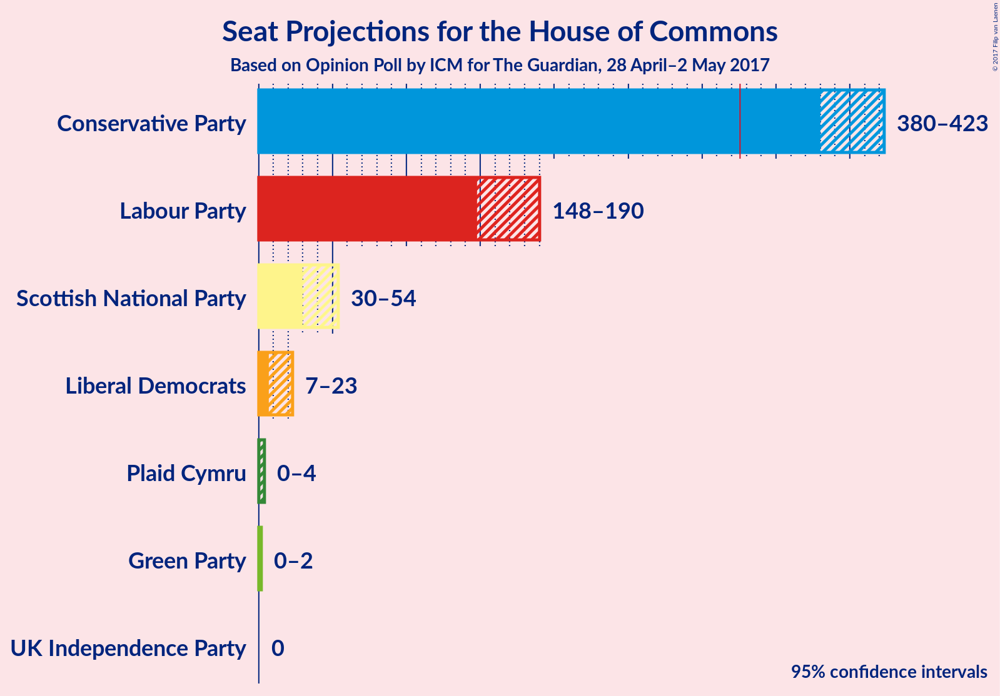

# Opinion Poll by ICM for The Guardian, 28 April–2 May 2017

<a href="#voting-intentions">Voting Intentions</a> | <a href="#seats">Seats</a> | <a href="#technical-information">Technical Information</a>

## Voting Intentions

### Confidence Intervals

| Party | 80% Confidence Interval | 90% Confidence Interval | 95% Confidence Interval | 99% Confidence Interval |
|:-----:|:-----------------------:|:-----------------------:|:-----------------------:|:-----------------------:|
| Conservative Party | 47–50% |46–50% |46–51% |45–52% |
| Labour Party | 25–28% |25–29% |24–29% |24–30% |
| Liberal Democrats | 8–10% |8–10% |8–11% |7–11% |
| UK Independence Party | 7–9% |7–10% |7–10% |7–10% |
| Scottish National Party | 3–4% |3–5% |3–5% |2–5% |
| Green Party | 3–4% |3–4% |2–4% |2–5% |
| Plaid Cymru | 0–1% |0–1% |0–1% |0–1% |

## Seats

## Technical Information

### Opinion Poll

+ **Pollster:** ICM
+ **Media:** The Guardian
+ **Fieldwork period:** 28 April–2 May 2017

### Calculations

+ **Simulations done:** 1,048,576
+ **Error estimate:** 1.10%

