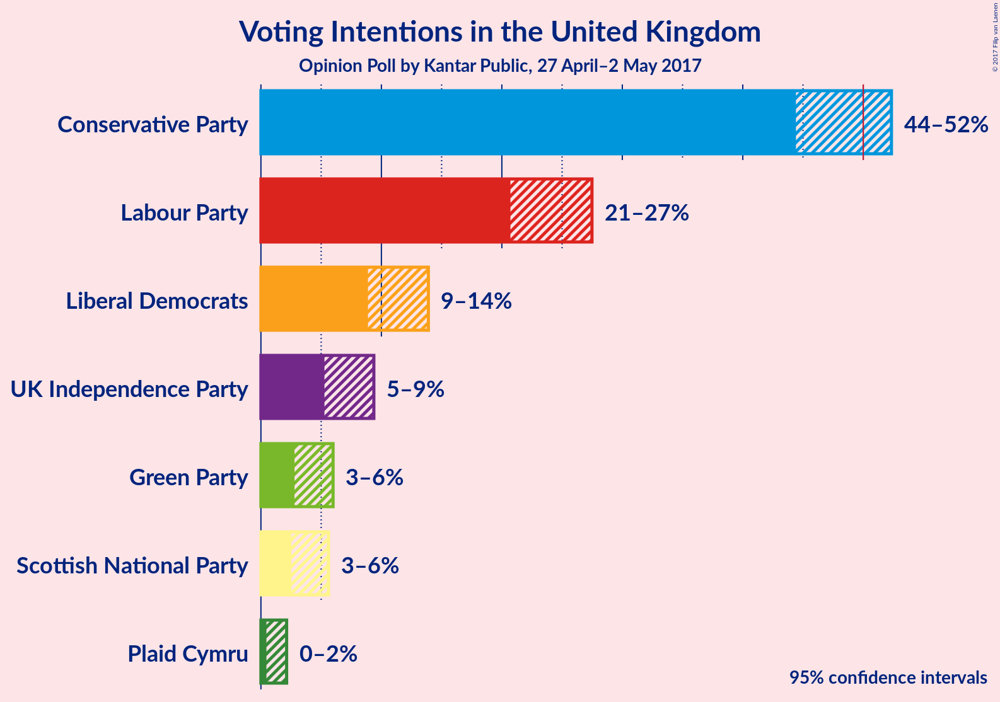

# Opinion Poll by Kantar Public, 27 April–2 May 2017

<a href="#voting-intentions">Voting Intentions</a> | <a href="#seats">Seats</a> | <a href="#technical-information">Technical Information</a>

## Voting Intentions

### Confidence Intervals

| Party | Last Result | Poll Result | 80% Confidence Interval | 90% Confidence Interval | 95% Confidence Interval | 99% Confidence Interval |
|:-----:|:-----------:|:-----------:|:-----------------------:|:-----------------------:|:-----------------------:|:-----------------------:|
| Conservative Party | 37.8% | 49% | 45.8–51.0% |45.0–51.7% |44.4–52.3% |43.2–53.6% |
| Labour Party | 31.2% | 24% | 21.8–26.3% |21.2–26.9% |20.7–27.5% |19.7–28.6% |
| Liberal Democrats | 8.1% | 11% | 9.7–12.9% |9.2–13.5% |8.9–13.9% |8.2–14.8% |
| UK Independence Party | 12.9% | 7% | 5.9–8.6% |5.5–9.0% |5.3–9.4% |4.8–10.1% |
| Green Party | 3.8% | 4% | 3.2–5.3% |3.0–5.7% |2.8–6.0% |2.4–6.6% |
| Scottish National Party | 4.9% | 4% | 2.9–5.0% |2.7–5.3% |2.5–5.6% |2.2–6.2% |
| Plaid Cymru | 0.6% | 1% | 0.6–1.7% |0.5–1.9% |0.5–2.1% |0.3–2.5% |

## Seats

### Confidence Intervals

| Party | Last Result | 80% Confidence Interval | 90% Confidence Interval | 95% Confidence Interval | 99% Confidence Interval |
|:-----:|:-----------:|:-----------------------:|:-----------------------:|:-----------------------:|:-----------------------:|
| Conservative Party | 331 | 388–433 |380–438 |376–442 |364–453 |
| Labour Party | 232 | 123–167 |118–174 |114–178 |104–190 |
| Liberal Democrats | 8 | 16–32 |13–35 |11–38 |8–45 |
| UK Independence Party | 1 | 0 |0 |0 |0 |
| Green Party | 1 | 1–2 |1–2 |1–2 |0–2 |
| Scottish National Party | 56 | 36–52 |33–54 |32–56 |16–57 |
| Plaid Cymru | 3 | 4–12 |3–13 |3–14 |1–18 |

## Technical Information

### Opinion Poll

+ **Pollster:** Kantar Public
+ **Media:** —
+ **Fieldwork period:** 27 April–2 May 2017

### Calculations

+ **Sample size:** 606
+ **Simulations done:** 2,097,152
+ **Error estimate:** 0.96%

