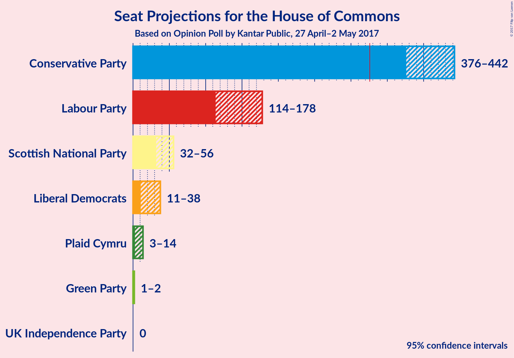

# Opinion Poll by Kantar Public, 27 April–2 May 2017

<a href="#voting-intentions">Voting Intentions</a> | <a href="#seats">Seats</a> | <a href="#technical-information">Technical Information</a>

## Voting Intentions

### Confidence Intervals

## Seats

## Technical Information

### Opinion Poll

+ **Pollster:** Kantar Public
+ **Media:** —
+ **Fieldwork period:** 27 April–2 May 2017

### Calculations

+ **Simulations done:** 1,048,576
+ **Error estimate:** 0.78%

