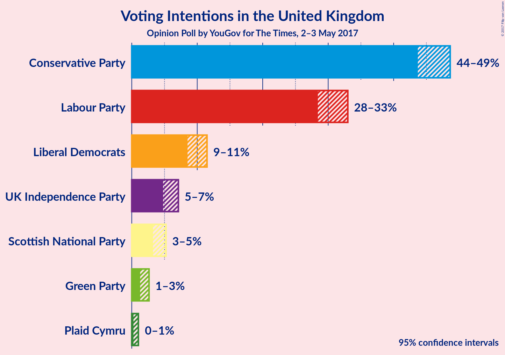
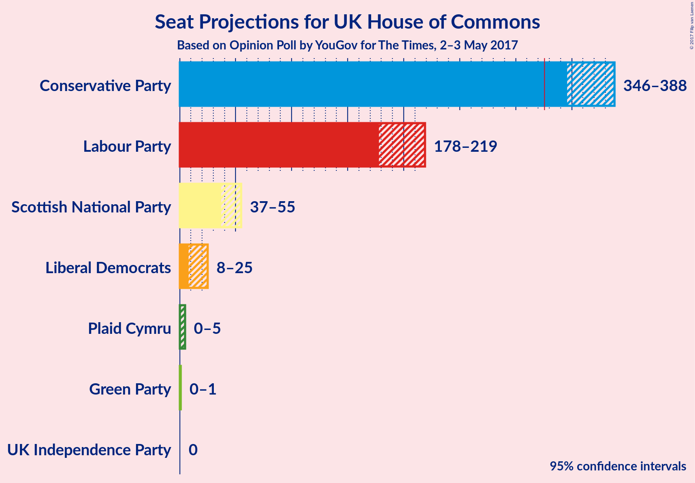

# Opinion Poll by YouGov for The Times, 2–3 May 2017

<a href="#voting-intentions">Voting Intentions</a> | <a href="#seats">Seats</a> | <a href="#technical-information">Technical Information</a>

## Voting Intentions

### Confidence Intervals

| Party | 80% Confidence Interval | 90% Confidence Interval | 95% Confidence Interval | 99% Confidence Interval |
|:-----:|:-----------------------:|:-----------------------:|:-----------------------:|:-----------------------:|
| Conservative Party | 45–48% |44–48% |44–49% |43–49% |
| Labour Party | 29–32% |29–33% |28–33% |28–34% |
| Liberal Democrats | 9–11% |9–11% |9–11% |8–12% |
| UK Independence Party | 5–7% |5–7% |5–7% |4–8% |
| Scottish National Party | 4–5% |3–5% |3–5% |3–6% |
| Green Party | 1–2% |1–3% |1–3% |1–3% |
| Plaid Cymru | 0–1% |0–1% |0–1% |0–1% |

## Seats

## Technical Information

### Opinion Poll

+ **Pollster:** YouGov
+ **Media:** The Times
+ **Fieldwork period:** 2–3 May 2017

### Calculations

+ **Simulations done:** 4,194,304
+ **Error estimate:** 0.99%

