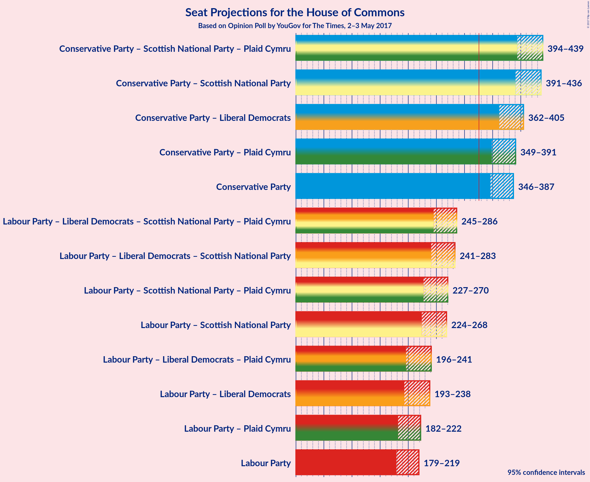

# Opinion Poll by YouGov for The Times, 2–3 May 2017

<a href="#voting-intentions">Voting Intentions</a> | <a href="#seats">Seats</a> | <a href="#coalitions">Coalitions</a> | <a href="#technical-information">Technical Information</a>

## Voting Intentions

### Confidence Intervals

| Party | Last Result | Poll Result | 80% Confidence Interval | 90% Confidence Interval | 95% Confidence Interval | 99% Confidence Interval |
|:-----:|:-----------:|:-----------:|:-----------------------:|:-----------------------:|:-----------------------:|:-----------------------:|
| Conservative Party | 37.8% | 46.6% | 44.6–47.8% |44.1–48.2% |43.7–48.6% |42.9–49.4% |
| Labour Party | 31.2% | 31.0% | 29.2–32.2% |28.8–32.6% |28.4–33.0% |27.7–33.7% |
| Liberal Democrats | 8.1% | 10.0% | 9.0–10.9% |8.7–11.2% |8.5–11.5% |8.1–12.0% |
| UK Independence Party | 12.9% | 5.9% | 5.1–6.7% |5.0–6.9% |4.8–7.1% |4.5–7.5% |
| Scottish National Party | 4.9% | 4.2% | 3.6–4.8% |3.4–5.1% |3.2–5.2% |3.0–5.6% |
| Green Party | 3.8% | 1.9% | 1.5–2.4% |1.4–2.5% |1.3–2.6% |1.1–2.9% |
| Plaid Cymru | 0.6% | 0.5% | 0.3–0.8% |0.3–0.9% |0.3–1.0% |0.2–1.2% |

*Note:* The poll result column reflects the actual value used in the calculations. Published results may vary slightly, and in addition be rounded to fewer digits.

## Seats

### Confidence Intervals

| Party | Last Result | 80% Confidence Interval | 90% Confidence Interval | 95% Confidence Interval | 99% Confidence Interval |
|:-----:|:-----------:|:-----------------------:|:-----------------------:|:-----------------------:|:-----------------------:|
| <a href="#conservative-party">Conservative Party</a> | 331 | 352–382 |349–385 |346–387 |341–393 |
| <a href="#labour-party">Labour Party</a> | 232 | 184–213 |182–216 |179–219 |174–225 |
| <a href="#liberal-democrats">Liberal Democrats</a> | 8 | 10–23 |9–24 |8–25 |6–28 |
| <a href="#uk-independence-party">UK Independence Party</a> | 1 | 0 |0 |0 |0 |
| <a href="#scottish-national-party">Scottish National Party</a> | 56 | 40–53 |39–54 |37–55 |27–56 |
| <a href="#green-party">Green Party</a> | 1 | 0 |0 |0–1 |0–1 |
| <a href="#plaid-cymru">Plaid Cymru</a> | 3 | 0–4 |0–4 |0–5 |0–7 |

### Conservative Party

| Number of Seats | Probability | Accumulated |
|:---------------:|:-----------:|:-----------:|
| 333 | 0% | 100% |
| 334 | 0% | 99.9% |
| 335 | 0% | 99.9% |
| 336 | 0% | 99.9% |
| 337 | 0% | 99.9% |
| 338 | 0% | 99.8% |
| 339 | 0.1% | 99.8% |
| 340 | 0.1% | 99.7% |
| 341 | 0.2% | 99.6% |
| 342 | 0.2% | 99.4% |
| 343 | 0.4% | 99.2% |
| 344 | 0.5% | 98.8% |
| 345 | 0.5% | 98% |
| 346 | 0.5% | 98% |
| 347 | 0.7% | 97% |
| 348 | 1.2% | 97% |
| 349 | 1.2% | 95% |
| 350 | 1.2% | 94% |
| 351 | 1.1% | 93% |
| 352 | 2% | 92% |
| 353 | 1.1% | 90% |
| 354 | 2% | 89% |
| 355 | 2% | 87% |
| 356 | 2% | 86% |
| 357 | 1.3% | 84% |
| 358 | 1.2% | 83% |
| 359 | 2% | 81% |
| 360 | 2% | 79% |
| 361 | 2% | 77% |
| 362 | 3% | 75% |
| 363 | 3% | 72% |
| 364 | 4% | 69% |
| 365 | 4% | 65% |
| 366 | 4% | 61% |
| 367 | 2% | 57% |
| 368 | 3% | 55% |
| 369 | 3% | 52% |
| 370 | 2% | 49% |
| 371 | 3% | 46% |
| 372 | 3% | 43% |
| 373 | 4% | 40% |
| 374 | 2% | 36% |
| 375 | 5% | 34% |
| 376 | 3% | 30% |
| 377 | 2% | 27% |
| 378 | 3% | 25% |
| 379 | 3% | 22% |
| 380 | 3% | 19% |
| 381 | 3% | 15% |
| 382 | 3% | 12% |
| 383 | 2% | 10% |
| 384 | 2% | 8% |
| 385 | 2% | 6% |
| 386 | 1.5% | 5% |
| 387 | 0.7% | 3% |
| 388 | 0.4% | 2% |
| 389 | 0.4% | 2% |
| 390 | 0.3% | 2% |
| 391 | 0.4% | 1.3% |
| 392 | 0.2% | 0.9% |
| 393 | 0.2% | 0.7% |
| 394 | 0.1% | 0.5% |
| 395 | 0.1% | 0.4% |
| 396 | 0.1% | 0.3% |
| 397 | 0% | 0.2% |
| 398 | 0% | 0.2% |
| 399 | 0% | 0.2% |
| 400 | 0% | 0.1% |
| 401 | 0% | 0.1% |
| 402 | 0% | 0.1% |
| 403 | 0% | 0.1% |
| 404 | 0% | 0% |

### Labour Party

| Number of Seats | Probability | Accumulated |
|:---------------:|:-----------:|:-----------:|
| 164 | 0% | 100% |
| 165 | 0% | 99.9% |
| 166 | 0% | 99.9% |
| 167 | 0% | 99.9% |
| 168 | 0% | 99.8% |
| 169 | 0% | 99.8% |
| 170 | 0.1% | 99.8% |
| 171 | 0.1% | 99.7% |
| 172 | 0% | 99.6% |
| 173 | 0.1% | 99.6% |
| 174 | 0.2% | 99.5% |
| 175 | 0.4% | 99.3% |
| 176 | 0.4% | 98.9% |
| 177 | 0.3% | 98% |
| 178 | 0.6% | 98% |
| 179 | 0.5% | 98% |
| 180 | 0.7% | 97% |
| 181 | 1.2% | 96% |
| 182 | 3% | 95% |
| 183 | 2% | 92% |
| 184 | 3% | 90% |
| 185 | 2% | 87% |
| 186 | 4% | 85% |
| 187 | 3% | 81% |
| 188 | 3% | 78% |
| 189 | 4% | 75% |
| 190 | 3% | 71% |
| 191 | 4% | 69% |
| 192 | 2% | 65% |
| 193 | 2% | 63% |
| 194 | 4% | 60% |
| 195 | 2% | 57% |
| 196 | 5% | 55% |
| 197 | 3% | 50% |
| 198 | 3% | 47% |
| 199 | 4% | 44% |
| 200 | 5% | 41% |
| 201 | 4% | 36% |
| 202 | 4% | 32% |
| 203 | 3% | 28% |
| 204 | 2% | 25% |
| 205 | 2% | 23% |
| 206 | 1.2% | 21% |
| 207 | 1.4% | 19% |
| 208 | 1.2% | 18% |
| 209 | 1.2% | 17% |
| 210 | 1.3% | 15% |
| 211 | 2% | 14% |
| 212 | 2% | 13% |
| 213 | 2% | 11% |
| 214 | 2% | 9% |
| 215 | 2% | 7% |
| 216 | 1.1% | 6% |
| 217 | 0.8% | 5% |
| 218 | 1.0% | 4% |
| 219 | 0.6% | 3% |
| 220 | 0.5% | 2% |
| 221 | 0.5% | 2% |
| 222 | 0.3% | 1.1% |
| 223 | 0.2% | 0.8% |
| 224 | 0.1% | 0.7% |
| 225 | 0.1% | 0.6% |
| 226 | 0% | 0.4% |
| 227 | 0.1% | 0.4% |
| 228 | 0% | 0.3% |
| 229 | 0% | 0.3% |
| 230 | 0% | 0.2% |
| 231 | 0% | 0.2% |
| 232 | 0% | 0.2% |
| 233 | 0% | 0.1% |
| 234 | 0% | 0.1% |
| 235 | 0% | 0.1% |
| 236 | 0% | 0.1% |
| 237 | 0% | 0.1% |
| 238 | 0% | 0% |

### Liberal Democrats

| Number of Seats | Probability | Accumulated |
|:---------------:|:-----------:|:-----------:|
| 5 | 0.1% | 100% |
| 6 | 0.5% | 99.8% |
| 7 | 1.4% | 99.3% |
| 8 | 2% | 98% |
| 9 | 3% | 96% |
| 10 | 4% | 93% |
| 11 | 10% | 89% |
| 12 | 4% | 79% |
| 13 | 6% | 75% |
| 14 | 11% | 69% |
| 15 | 8% | 58% |
| 16 | 8% | 50% |
| 17 | 9% | 43% |
| 18 | 6% | 34% |
| 19 | 7% | 28% |
| 20 | 4% | 21% |
| 21 | 5% | 17% |
| 22 | 2% | 12% |
| 23 | 4% | 10% |
| 24 | 3% | 7% |
| 25 | 2% | 4% |
| 26 | 0.6% | 2% |
| 27 | 0.4% | 1.3% |
| 28 | 0.4% | 0.9% |
| 29 | 0.2% | 0.5% |
| 30 | 0.2% | 0.3% |
| 31 | 0.1% | 0.1% |
| 32 | 0% | 0.1% |
| 33 | 0% | 0% |

### UK Independence Party

| Number of Seats | Probability | Accumulated |
|:---------------:|:-----------:|:-----------:|
| 0 | 100% | 100% |
| 1 | 0% | 0% |

### Scottish National Party

| Number of Seats | Probability | Accumulated |
|:---------------:|:-----------:|:-----------:|
| 16 | 0% | 100% |
| 17 | 0% | 99.9% |
| 18 | 0% | 99.9% |
| 19 | 0% | 99.9% |
| 20 | 0% | 99.9% |
| 21 | 0% | 99.9% |
| 22 | 0.1% | 99.9% |
| 23 | 0.1% | 99.8% |
| 24 | 0% | 99.8% |
| 25 | 0.1% | 99.7% |
| 26 | 0.1% | 99.7% |
| 27 | 0.1% | 99.6% |
| 28 | 0.1% | 99.5% |
| 29 | 0.1% | 99.4% |
| 30 | 0% | 99.3% |
| 31 | 0.1% | 99.2% |
| 32 | 0% | 99.2% |
| 33 | 0.1% | 99.1% |
| 34 | 0.1% | 99.0% |
| 35 | 0.2% | 98.9% |
| 36 | 0.5% | 98.7% |
| 37 | 0.8% | 98% |
| 38 | 1.3% | 97% |
| 39 | 4% | 96% |
| 40 | 3% | 92% |
| 41 | 2% | 89% |
| 42 | 5% | 87% |
| 43 | 3% | 83% |
| 44 | 5% | 80% |
| 45 | 6% | 75% |
| 46 | 6% | 70% |
| 47 | 7% | 64% |
| 48 | 7% | 57% |
| 49 | 9% | 50% |
| 50 | 11% | 41% |
| 51 | 3% | 30% |
| 52 | 3% | 27% |
| 53 | 15% | 24% |
| 54 | 5% | 9% |
| 55 | 3% | 4% |
| 56 | 0.6% | 0.9% |
| 57 | 0.2% | 0.2% |
| 58 | 0.1% | 0.1% |
| 59 | 0% | 0% |

### Green Party

| Number of Seats | Probability | Accumulated |
|:---------------:|:-----------:|:-----------:|
| 0 | 96% | 100% |
| 1 | 4% | 4% |
| 2 | 0% | 0% |

### Plaid Cymru

| Number of Seats | Probability | Accumulated |
|:---------------:|:-----------:|:-----------:|
| 0 | 18% | 100% |
| 1 | 2% | 82% |
| 2 | 3% | 80% |
| 3 | 39% | 77% |
| 4 | 35% | 39% |
| 5 | 2% | 4% |
| 6 | 0.4% | 1.3% |
| 7 | 0.9% | 0.9% |
| 8 | 0% | 0% |

## Coalitions

### Confidence Intervals

| Coalition | Last Result | 80% Confidence Interval | 90% Confidence Interval | 95% Confidence Interval | 99% Confidence Interval |
|:---------:|:-----------:|:-----------------------:|:-----------------------:|:-----------------------:|:-----------------------:|
| Conservative Party | 331 | 352–382 | 349–385 | 346–387 | 341–393 |
| Conservative Party – Liberal Democrats | 339 | 369–399 | 365–402 | 362–405 | 357–411 |
| Conservative Party – Plaid Cymru | 334 | 355–385 | 351–388 | 349–391 | 344–396 |
| Conservative Party – Scottish National Party – Plaid Cymru | 390 | 403–434 | 398–437 | 394–439 | 387–445 |
| Conservative Party – Scottish National Party | 387 | 400–431 | 395–434 | 391–436 | 384–442 |
| Labour Party | 232 | 184–213 | 182–216 | 179–219 | 174–225 |
| Labour Party – Liberal Democrats | 240 | 198–229 | 195–234 | 193–238 | 187–245 |
| Labour Party – Liberal Democrats – Plaid Cymru | 243 | 201–232 | 198–237 | 196–241 | 190–248 |
| Labour Party – Liberal Democrats – Scottish National Party – Plaid Cymru | 299 | 250–279 | 247–283 | 245–286 | 239–291 |
| Labour Party – Liberal Democrats – Scottish National Party | 296 | 247–276 | 244–281 | 241–283 | 236–288 |
| Labour Party – Plaid Cymru | 235 | 186–216 | 184–219 | 182–222 | 176–228 |
| Labour Party – Scottish National Party – Plaid Cymru | 291 | 233–263 | 230–267 | 227–270 | 221–275 |
| Labour Party – Scottish National Party | 288 | 230–260 | 227–265 | 224–268 | 219–272 |

## Technical Information

### Opinion Poll

+ **Pollster:** YouGov
+ **Media:** The Times
+ **Fieldwork period:** 2–3 May 2017

### Calculations

+ **Sample size:** 1560
+ **Simulations done:** 4,194,304
+ **Error estimate:** 0.99%

