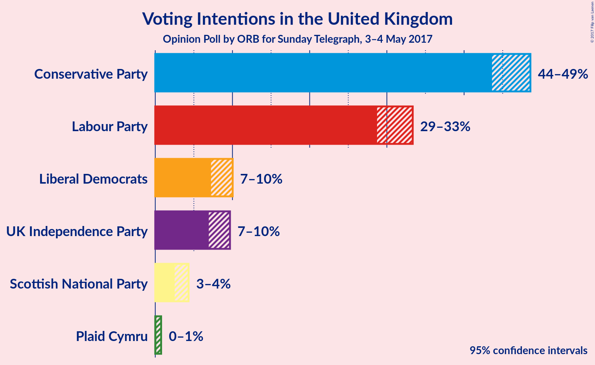
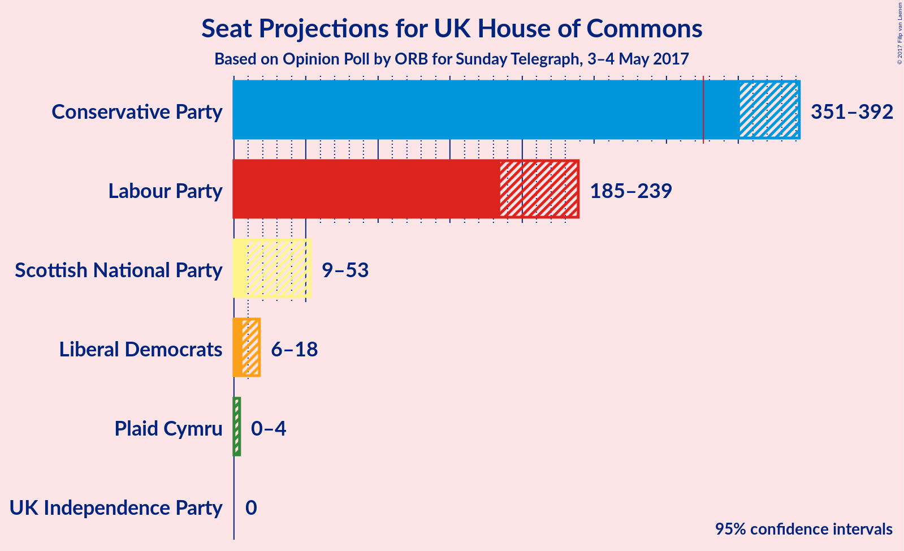

# Opinion Poll by ORB for Sunday Telegraph, 3–4 May 2017

<a href="#voting-intentions">Voting Intentions</a> | <a href="#seats">Seats</a> | <a href="#technical-information">Technical Information</a>

## Voting Intentions

### Confidence Intervals

| Party | Last Result | Poll Result | 80% Confidence Interval | 90% Confidence Interval | 95% Confidence Interval | 99% Confidence Interval |
|:-----:|:-----------:|:-----------:|:-----------------------:|:-----------------------:|:-----------------------:|:-----------------------:|
| Conservative Party | 37.8% | 47.3% | 44.5–47.7% |44.0–48.2% |43.6–48.6% |42.8–49.4% |
| Labour Party | 31.2% | 31.8% | 29.5–32.5% |29.1–33.0% |28.7–33.3% |28.0–34.1% |
| Liberal Democrats | 8.1% | 8.7% | 7.7–9.5% |7.4–9.8% |7.2–10.0% |6.8–10.5% |
| UK Independence Party | 12.9% | 8.4% | 7.4–9.2% |7.1–9.4% |6.9–9.7% |6.6–10.2% |
| Scottish National Party | 4.9% | 3.4% | 2.8–4.0% |2.6–4.1% |2.5–4.3% |2.3–4.6% |
| Plaid Cymru | 0.6% | 0.3% | 0.2–0.6% |0.2–0.7% |0.1–0.8% |0.1–0.9% |

*Note:* The poll result column reflects the actual value used in the calculations. Published results may vary slightly, and in addition be rounded to fewer digits.

## Seats

### Confidence Intervals

| Party | Last Result | 80% Confidence Interval | 90% Confidence Interval | 95% Confidence Interval | 99% Confidence Interval |
|:-----:|:-----------:|:-----------------------:|:-----------------------:|:-----------------------:|:-----------------------:|
| Conservative Party | 331 | 356–385 |353–390 |351–392 |347–397 |
| Labour Party | 232 | 191–226 |187–233 |185–239 |180–249 |
| Liberal Democrats | 8 | 8–17 |7–17 |6–18 |5–21 |
| UK Independence Party | 1 | 0 |0 |0 |0 |
| Scottish National Party | 56 | 20–49 |13–52 |9–53 |4–55 |
| Plaid Cymru | 3 | 0–3 |0–4 |0–4 |0–5 |

### Conservative Party

| Number of Seats | Probability |
|:---------------:|:-----------:|
| 343 | 0.1% |
| 344 | 0% |
| 345 | 0.1% |
| 346 | 0.1% |
| 347 | 0.2% |
| 348 | 0.3% |
| 349 | 0.4% |
| 350 | 0.7% |
| 351 | 0.9% |
| 352 | 1.3% |
| 353 | 2% |
| 354 | 1.4% |
| 355 | 2% |
| 356 | 2% |
| 357 | 1.4% |
| 358 | 2% |
| 359 | 2% |
| 360 | 0.9% |
| 361 | 2% |
| 362 | 0.9% |
| 363 | 0.9% |
| 364 | 2% |
| 365 | 1.4% |
| 366 | 0.9% |
| 367 | 2% |
| 368 | 5% |
| 369 | 3% |
| 370 | 4% |
| 371 | 4% |
| 372 | 6% |
| 373 | 4% |
| 374 | 5% |
| 375 | 4% |
| 376 | 3% |
| 377 | 5% |
| 378 | 6% |
| 379 | 3% |
| 380 | 3% |
| 381 | 3% |
| 382 | 2% |
| 383 | 2% |
| 384 | 2% |
| 385 | 1.4% |
| 386 | 1.3% |
| 387 | 1.0% |
| 388 | 0.7% |
| 389 | 1.1% |
| 390 | 0.8% |
| 391 | 1.5% |
| 392 | 0.9% |
| 393 | 0.3% |
| 394 | 0.4% |
| 395 | 0.5% |
| 396 | 0.2% |
| 397 | 0.2% |
| 398 | 0.2% |
| 399 | 0% |
| 400 | 0.1% |

### Labour Party

| Number of Seats | Probability |
|:---------------:|:-----------:|
| 177 | 0.1% |
| 178 | 0% |
| 179 | 0.2% |
| 180 | 0.2% |
| 181 | 0.1% |
| 182 | 0.2% |
| 183 | 0.6% |
| 184 | 0.4% |
| 185 | 1.0% |
| 186 | 0.8% |
| 187 | 1.2% |
| 188 | 0.8% |
| 189 | 2% |
| 190 | 2% |
| 191 | 2% |
| 192 | 2% |
| 193 | 1.1% |
| 194 | 1.4% |
| 195 | 3% |
| 196 | 2% |
| 197 | 4% |
| 198 | 2% |
| 199 | 3% |
| 200 | 2% |
| 201 | 4% |
| 202 | 3% |
| 203 | 3% |
| 204 | 4% |
| 205 | 5% |
| 206 | 3% |
| 207 | 5% |
| 208 | 4% |
| 209 | 0.8% |
| 210 | 0.8% |
| 211 | 0.9% |
| 212 | 2% |
| 213 | 2% |
| 214 | 3% |
| 215 | 1.4% |
| 216 | 3% |
| 217 | 4% |
| 218 | 1.0% |
| 219 | 2% |
| 220 | 2% |
| 221 | 0.7% |
| 222 | 0.9% |
| 223 | 2% |
| 224 | 1.4% |
| 225 | 1.0% |
| 226 | 1.4% |
| 227 | 0.9% |
| 228 | 0.6% |
| 229 | 0.6% |
| 230 | 0.5% |
| 231 | 0.4% |
| 232 | 0.4% |
| 233 | 0.6% |
| 234 | 0.6% |
| 235 | 0.6% |
| 236 | 0.1% |
| 237 | 0.5% |
| 238 | 0.4% |
| 239 | 0.3% |
| 240 | 0.2% |
| 241 | 0.1% |
| 242 | 0.5% |
| 243 | 0.2% |
| 244 | 0.1% |
| 245 | 0.2% |
| 246 | 0.1% |
| 247 | 0.1% |
| 248 | 0.1% |
| 249 | 0.1% |
| 250 | 0.1% |
| 251 | 0.1% |
| 252 | 0% |
| 253 | 0.1% |
| 254 | 0.1% |

### Liberal Democrats

| Number of Seats | Probability |
|:---------------:|:-----------:|
| 3 | 0.1% |
| 4 | 0.3% |
| 5 | 1.3% |
| 6 | 2% |
| 7 | 4% |
| 8 | 6% |
| 9 | 3% |
| 10 | 3% |
| 11 | 9% |
| 12 | 13% |
| 13 | 8% |
| 14 | 11% |
| 15 | 18% |
| 16 | 2% |
| 17 | 17% |
| 18 | 1.2% |
| 19 | 1.1% |
| 20 | 0.4% |
| 21 | 0.3% |
| 22 | 0.1% |
| 23 | 0.2% |

### UK Independence Party

| Number of Seats | Probability |
|:---------------:|:-----------:|
| 0 | 100% |

### Scottish National Party

| Number of Seats | Probability |
|:---------------:|:-----------:|
| 2 | 0.1% |
| 3 | 0.2% |
| 4 | 0.6% |
| 5 | 0.4% |
| 6 | 0.4% |
| 7 | 0.4% |
| 8 | 0.1% |
| 9 | 1.4% |
| 10 | 0% |
| 11 | 0.1% |
| 12 | 0.3% |
| 13 | 1.3% |
| 14 | 0.3% |
| 15 | 0.8% |
| 16 | 0.9% |
| 17 | 0.8% |
| 18 | 1.2% |
| 19 | 0.2% |
| 20 | 0.7% |
| 21 | 0.9% |
| 22 | 3% |
| 23 | 2% |
| 24 | 0.6% |
| 25 | 1.1% |
| 26 | 2% |
| 27 | 2% |
| 28 | 2% |
| 29 | 2% |
| 30 | 1.2% |
| 31 | 2% |
| 32 | 0.5% |
| 33 | 0.5% |
| 34 | 0.6% |
| 35 | 3% |
| 36 | 3% |
| 37 | 2% |
| 38 | 5% |
| 39 | 6% |
| 40 | 4% |
| 41 | 6% |
| 42 | 8% |
| 43 | 4% |
| 44 | 3% |
| 45 | 4% |
| 46 | 3% |
| 47 | 2% |
| 48 | 3% |
| 49 | 3% |
| 50 | 2% |
| 51 | 3% |
| 52 | 2% |
| 53 | 2% |
| 54 | 1.0% |
| 55 | 1.1% |

### Plaid Cymru

| Number of Seats | Probability |
|:---------------:|:-----------:|
| 0 | 61% |
| 1 | 1.1% |
| 2 | 2% |
| 3 | 28% |
| 4 | 8% |
| 5 | 0.9% |

## Technical Information

### Opinion Poll

+ **Pollster:** ORB
+ **Media:** Sunday Telegraph
+ **Fieldwork period:** 3–4 May 2017

### Calculations

+ **Sample size:** 1509
+ **Simulations done:** 524,288
+ **Error estimate:** 0.52%

