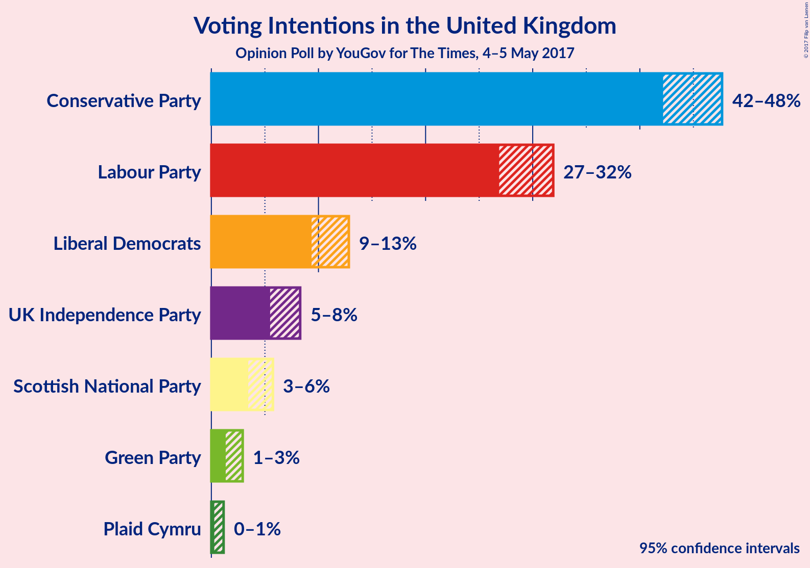
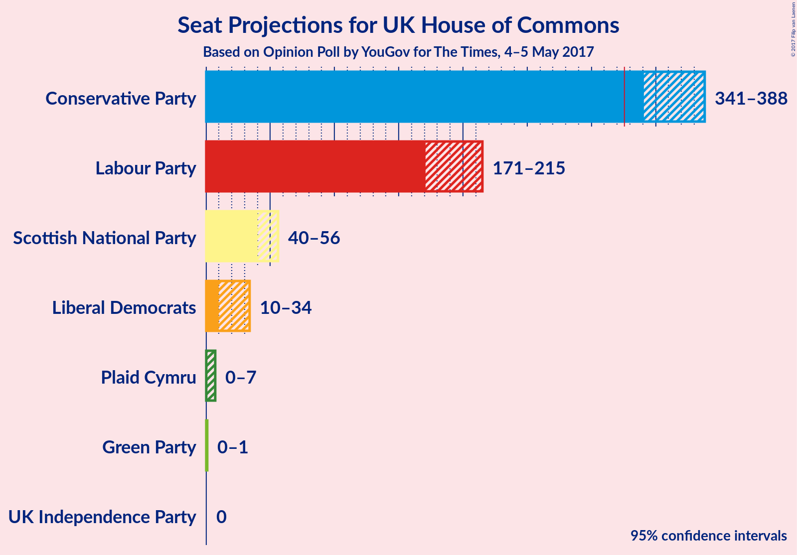

# Opinion Poll by YouGov for The Times, 4–5 May 2017

<a href="#voting-intentions">Voting Intentions</a> | <a href="#seats">Seats</a> | <a href="#technical-information">Technical Information</a>

## Voting Intentions

### Confidence Intervals

| Party | Last Result | Poll Result | 80% Confidence Interval | 90% Confidence Interval | 95% Confidence Interval | 99% Confidence Interval |
|:-----:|:-----------:|:-----------:|:-----------------------:|:-----------------------:|:-----------------------:|:-----------------------:|
| Conservative Party | 37.8% | 45.4% | 43.1–46.7% |42.6–47.2% |42.2–47.7% |41.3–48.5% |
| Labour Party | 31.2% | 29.6% | 27.7–31.0% |27.3–31.5% |26.9–31.9% |26.1–32.7% |
| Liberal Democrats | 8.1% | 11.1% | 9.9–12.2% |9.6–12.5% |9.4–12.8% |8.9–13.4% |
| UK Independence Party | 12.9% | 6.8% | 5.9–7.8% |5.7–8.0% |5.5–8.3% |5.1–8.8% |
| Scottish National Party | 4.9% | 4.5% | 3.8–5.3% |3.6–5.5% |3.4–5.7% |3.1–6.2% |
| Green Party | 3.8% | 2.0% | 1.6–2.6% |1.4–2.8% |1.3–2.9% |1.2–3.2% |
| Plaid Cymru | 0.6% | 0.6% | 0.4–0.9% |0.3–1.1% |0.3–1.1% |0.2–1.4% |

*Note:* The poll result column reflects the actual value used in the calculations. Published results may vary slightly, and in addition be rounded to fewer digits.

## Seats

### Confidence Intervals

| Party | Last Result | 80% Confidence Interval | 90% Confidence Interval | 95% Confidence Interval | 99% Confidence Interval |
|:-----:|:-----------:|:-----------------------:|:-----------------------:|:-----------------------:|:-----------------------:|
| Conservative Party | 331 | 348–381 |344–385 |341–388 |334–397 |
| Labour Party | 232 | 178–209 |174–213 |171–216 |161–221 |
| Liberal Democrats | 8 | 14–30 |12–33 |10–34 |9–40 |
| UK Independence Party | 1 | 0 |0 |0 |0 |
| Scottish National Party | 56 | 44–54 |42–55 |40–56 |37–58 |
| Green Party | 1 | 0–1 |0–1 |0–1 |0–1 |
| Plaid Cymru | 3 | 0–4 |0–5 |0–7 |0–7 |

## Technical Information

### Opinion Poll

+ **Pollster:** YouGov
+ **Media:** The Times
+ **Fieldwork period:** 4–5 May 2017

### Calculations

+ **Sample size:** 1245
+ **Simulations done:** 2,097,152
+ **Error estimate:** 1.22%

