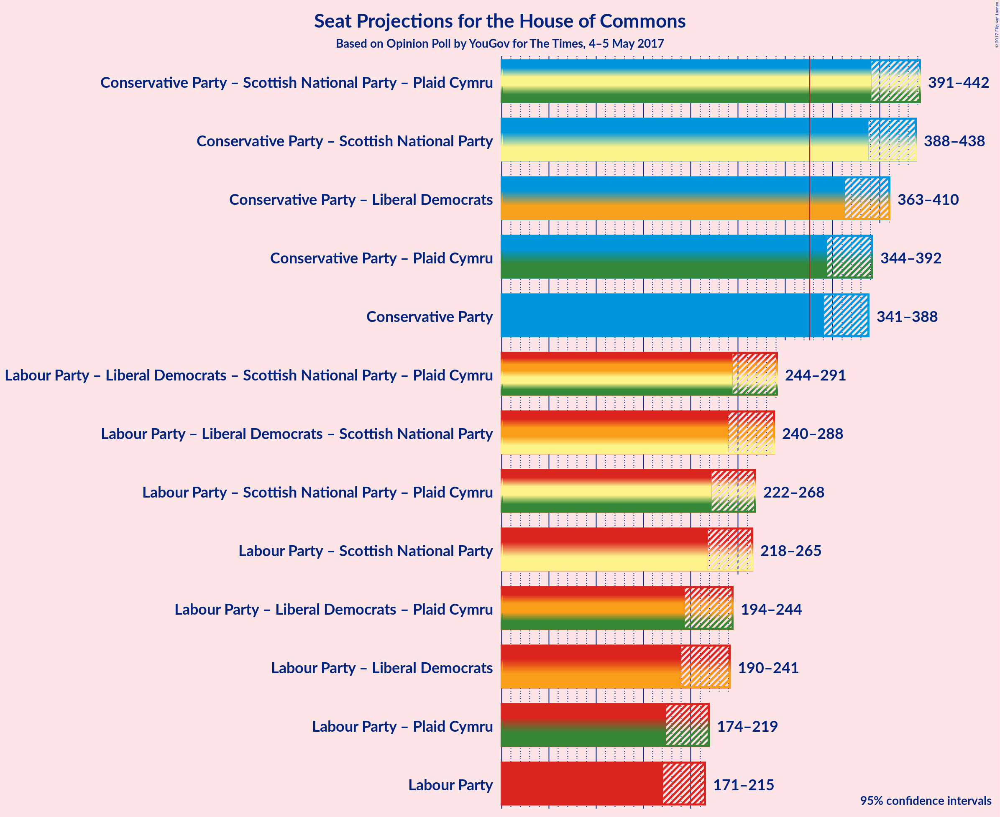

# Opinion Poll by YouGov for The Times, 4–5 May 2017

<a href="#voting-intentions">Voting Intentions</a> | <a href="#seats">Seats</a> | <a href="#coalitions">Coalitions</a> | <a href="#technical-information">Technical Information</a>

## Voting Intentions

### Confidence Intervals

| Party | Last Result | Poll Result | 80% Confidence Interval | 90% Confidence Interval | 95% Confidence Interval | 99% Confidence Interval |
|:-----:|:-----------:|:-----------:|:-----------------------:|:-----------------------:|:-----------------------:|:-----------------------:|
| Conservative Party | 37.8% | 45.4% | 43.1–46.7% |42.6–47.2% |42.2–47.7% |41.3–48.5% |
| Labour Party | 31.2% | 29.6% | 27.7–31.0% |27.3–31.5% |26.9–31.9% |26.1–32.7% |
| Liberal Democrats | 8.1% | 11.1% | 9.9–12.2% |9.6–12.5% |9.4–12.8% |8.9–13.4% |
| UK Independence Party | 12.9% | 6.8% | 5.9–7.8% |5.7–8.0% |5.5–8.3% |5.1–8.8% |
| Scottish National Party | 4.9% | 4.5% | 3.8–5.3% |3.6–5.5% |3.4–5.7% |3.1–6.2% |
| Green Party | 3.8% | 2.0% | 1.6–2.6% |1.4–2.8% |1.3–2.9% |1.2–3.2% |
| Plaid Cymru | 0.6% | 0.6% | 0.4–0.9% |0.3–1.1% |0.3–1.1% |0.2–1.4% |

*Note:* The poll result column reflects the actual value used in the calculations. Published results may vary slightly, and in addition be rounded to fewer digits.

## Seats

### Confidence Intervals

| Party | Last Result | 80% Confidence Interval | 90% Confidence Interval | 95% Confidence Interval | 99% Confidence Interval |
|:-----:|:-----------:|:-----------------------:|:-----------------------:|:-----------------------:|:-----------------------:|
| <a href="#conservative-party">Conservative Party</a> | 331 | 348–381 |344–384 |341–388 |334–397 |
| <a href="#labour-party">Labour Party</a> | 232 | 178–209 |174–213 |171–215 |161–221 |
| <a href="#liberal-democrats">Liberal Democrats</a> | 8 | 14–30 |12–32 |11–34 |8–40 |
| <a href="#uk-independence-party">UK Independence Party</a> | 1 | 0 |0 |0 |0 |
| <a href="#scottish-national-party">Scottish National Party</a> | 56 | 44–54 |42–55 |40–56 |37–58 |
| <a href="#green-party">Green Party</a> | 1 | 0–1 |0–1 |0–1 |0–1 |
| <a href="#plaid-cymru">Plaid Cymru</a> | 3 | 0–4 |0–6 |0–7 |0–7 |

### Conservative Party

| Number of Seats | Probability | Accumulated |
|:---------------:|:-----------:|:-----------:|
| 325 | 0% | 100% |
| 326 | 0% | 99.9% |
| 327 | 0% | 99.9% |
| 328 | 0% | 99.9% |
| 329 | 0.1% | 99.9% |
| 330 | 0% | 99.8% |
| 331 | 0.1% | 99.8% |
| 332 | 0.1% | 99.7% |
| 333 | 0.1% | 99.6% |
| 334 | 0.1% | 99.6% |
| 335 | 0.1% | 99.5% |
| 336 | 0.2% | 99.4% |
| 337 | 0.3% | 99.2% |
| 338 | 0.3% | 98.8% |
| 339 | 0.4% | 98% |
| 340 | 0.4% | 98% |
| 341 | 0.9% | 98% |
| 342 | 0.6% | 97% |
| 343 | 0.9% | 96% |
| 344 | 0.9% | 95% |
| 345 | 0.9% | 94% |
| 346 | 1.3% | 93% |
| 347 | 1.2% | 92% |
| 348 | 1.3% | 91% |
| 349 | 0.6% | 90% |
| 350 | 1.2% | 89% |
| 351 | 2% | 88% |
| 352 | 0.8% | 86% |
| 353 | 2% | 85% |
| 354 | 2% | 84% |
| 355 | 2% | 82% |
| 356 | 2% | 80% |
| 357 | 2% | 78% |
| 358 | 2% | 76% |
| 359 | 3% | 74% |
| 360 | 3% | 71% |
| 361 | 3% | 68% |
| 362 | 3% | 65% |
| 363 | 2% | 62% |
| 364 | 2% | 59% |
| 365 | 3% | 58% |
| 366 | 3% | 55% |
| 367 | 3% | 51% |
| 368 | 3% | 49% |
| 369 | 3% | 45% |
| 370 | 2% | 42% |
| 371 | 4% | 40% |
| 372 | 3% | 37% |
| 373 | 3% | 33% |
| 374 | 5% | 30% |
| 375 | 2% | 25% |
| 376 | 3% | 23% |
| 377 | 3% | 20% |
| 378 | 2% | 17% |
| 379 | 2% | 15% |
| 380 | 3% | 13% |
| 381 | 2% | 10% |
| 382 | 1.2% | 8% |
| 383 | 1.3% | 7% |
| 384 | 1.1% | 6% |
| 385 | 0.7% | 5% |
| 386 | 0.5% | 4% |
| 387 | 0.8% | 4% |
| 388 | 0.4% | 3% |
| 389 | 0.5% | 2% |
| 390 | 0.3% | 2% |
| 391 | 0.2% | 2% |
| 392 | 0.2% | 1.3% |
| 393 | 0.1% | 1.1% |
| 394 | 0.2% | 1.0% |
| 395 | 0.1% | 0.8% |
| 396 | 0.1% | 0.7% |
| 397 | 0.1% | 0.6% |
| 398 | 0.1% | 0.5% |
| 399 | 0.1% | 0.4% |
| 400 | 0.1% | 0.3% |
| 401 | 0% | 0.3% |
| 402 | 0% | 0.2% |
| 403 | 0% | 0.2% |
| 404 | 0% | 0.1% |
| 405 | 0% | 0.1% |
| 406 | 0% | 0.1% |
| 407 | 0% | 0.1% |
| 408 | 0% | 0% |

### Labour Party

| Number of Seats | Probability | Accumulated |
|:---------------:|:-----------:|:-----------:|
| 153 | 0% | 100% |
| 154 | 0% | 99.9% |
| 155 | 0% | 99.9% |
| 156 | 0.1% | 99.9% |
| 157 | 0% | 99.8% |
| 158 | 0.1% | 99.8% |
| 159 | 0.1% | 99.7% |
| 160 | 0.1% | 99.7% |
| 161 | 0.1% | 99.6% |
| 162 | 0.1% | 99.5% |
| 163 | 0.2% | 99.4% |
| 164 | 0.1% | 99.2% |
| 165 | 0.1% | 99.1% |
| 166 | 0.2% | 99.0% |
| 167 | 0.2% | 98.7% |
| 168 | 0.2% | 98.5% |
| 169 | 0.2% | 98% |
| 170 | 0.4% | 98% |
| 171 | 0.6% | 98% |
| 172 | 0.8% | 97% |
| 173 | 0.6% | 96% |
| 174 | 1.2% | 96% |
| 175 | 1.0% | 95% |
| 176 | 1.2% | 94% |
| 177 | 1.4% | 92% |
| 178 | 2% | 91% |
| 179 | 2% | 89% |
| 180 | 2% | 87% |
| 181 | 4% | 84% |
| 182 | 3% | 80% |
| 183 | 5% | 77% |
| 184 | 3% | 72% |
| 185 | 2% | 69% |
| 186 | 4% | 67% |
| 187 | 4% | 63% |
| 188 | 3% | 59% |
| 189 | 2% | 55% |
| 190 | 3% | 53% |
| 191 | 3% | 50% |
| 192 | 3% | 47% |
| 193 | 3% | 45% |
| 194 | 2% | 42% |
| 195 | 3% | 40% |
| 196 | 2% | 37% |
| 197 | 5% | 35% |
| 198 | 3% | 30% |
| 199 | 3% | 27% |
| 200 | 2% | 24% |
| 201 | 2% | 21% |
| 202 | 2% | 19% |
| 203 | 1.4% | 17% |
| 204 | 1.0% | 15% |
| 205 | 0.9% | 14% |
| 206 | 0.6% | 13% |
| 207 | 1.0% | 13% |
| 208 | 2% | 12% |
| 209 | 1.1% | 10% |
| 210 | 1.3% | 9% |
| 211 | 1.2% | 8% |
| 212 | 1.2% | 6% |
| 213 | 0.9% | 5% |
| 214 | 1.2% | 4% |
| 215 | 0.7% | 3% |
| 216 | 0.7% | 2% |
| 217 | 0.5% | 2% |
| 218 | 0.4% | 1.3% |
| 219 | 0.2% | 1.0% |
| 220 | 0.3% | 0.8% |
| 221 | 0.1% | 0.5% |
| 222 | 0.1% | 0.4% |
| 223 | 0.1% | 0.3% |
| 224 | 0% | 0.3% |
| 225 | 0% | 0.2% |
| 226 | 0% | 0.2% |
| 227 | 0% | 0.2% |
| 228 | 0% | 0.1% |
| 229 | 0% | 0.1% |
| 230 | 0% | 0.1% |
| 231 | 0% | 0.1% |
| 232 | 0% | 0.1% |
| 233 | 0% | 0% |

### Liberal Democrats

| Number of Seats | Probability | Accumulated |
|:---------------:|:-----------:|:-----------:|
| 6 | 0% | 100% |
| 7 | 0.2% | 99.9% |
| 8 | 0.3% | 99.8% |
| 9 | 0.9% | 99.5% |
| 10 | 1.0% | 98.6% |
| 11 | 2% | 98% |
| 12 | 2% | 96% |
| 13 | 3% | 94% |
| 14 | 3% | 91% |
| 15 | 3% | 88% |
| 16 | 4% | 84% |
| 17 | 5% | 81% |
| 18 | 5% | 75% |
| 19 | 5% | 71% |
| 20 | 7% | 66% |
| 21 | 6% | 59% |
| 22 | 6% | 53% |
| 23 | 7% | 47% |
| 24 | 6% | 40% |
| 25 | 6% | 34% |
| 26 | 5% | 28% |
| 27 | 4% | 23% |
| 28 | 4% | 19% |
| 29 | 3% | 15% |
| 30 | 3% | 12% |
| 31 | 3% | 9% |
| 32 | 1.4% | 6% |
| 33 | 2% | 5% |
| 34 | 0.7% | 3% |
| 35 | 0.5% | 2% |
| 36 | 0.4% | 1.4% |
| 37 | 0.1% | 1.0% |
| 38 | 0.2% | 0.9% |
| 39 | 0.2% | 0.7% |
| 40 | 0.1% | 0.6% |
| 41 | 0.2% | 0.5% |
| 42 | 0.2% | 0.3% |
| 43 | 0% | 0.1% |
| 44 | 0% | 0% |

### UK Independence Party

| Number of Seats | Probability | Accumulated |
|:---------------:|:-----------:|:-----------:|
| 0 | 100% | 100% |
| 1 | 0% | 0% |

### Scottish National Party

| Number of Seats | Probability | Accumulated |
|:---------------:|:-----------:|:-----------:|
| 25 | 0% | 100% |
| 26 | 0% | 99.9% |
| 27 | 0% | 99.9% |
| 28 | 0% | 99.9% |
| 29 | 0% | 99.9% |
| 30 | 0% | 99.9% |
| 31 | 0% | 99.9% |
| 32 | 0% | 99.8% |
| 33 | 0% | 99.8% |
| 34 | 0% | 99.8% |
| 35 | 0.1% | 99.8% |
| 36 | 0.1% | 99.7% |
| 37 | 0.2% | 99.7% |
| 38 | 0.3% | 99.4% |
| 39 | 1.1% | 99.1% |
| 40 | 1.2% | 98% |
| 41 | 0.6% | 97% |
| 42 | 2% | 96% |
| 43 | 2% | 94% |
| 44 | 3% | 92% |
| 45 | 6% | 88% |
| 46 | 5% | 83% |
| 47 | 10% | 78% |
| 48 | 5% | 68% |
| 49 | 16% | 63% |
| 50 | 19% | 48% |
| 51 | 4% | 29% |
| 52 | 3% | 24% |
| 53 | 10% | 21% |
| 54 | 5% | 12% |
| 55 | 2% | 6% |
| 56 | 2% | 4% |
| 57 | 1.1% | 2% |
| 58 | 0.8% | 0.9% |
| 59 | 0.1% | 0.1% |
| 60 | 0% | 0% |

### Green Party

| Number of Seats | Probability | Accumulated |
|:---------------:|:-----------:|:-----------:|
| 0 | 86% | 100% |
| 1 | 14% | 14% |
| 2 | 0% | 0% |

### Plaid Cymru

| Number of Seats | Probability | Accumulated |
|:---------------:|:-----------:|:-----------:|
| 0 | 12% | 100% |
| 1 | 1.3% | 88% |
| 2 | 2% | 87% |
| 3 | 31% | 85% |
| 4 | 47% | 55% |
| 5 | 2% | 7% |
| 6 | 2% | 5% |
| 7 | 3% | 4% |
| 8 | 0.4% | 0.5% |
| 9 | 0% | 0.1% |
| 10 | 0% | 0.1% |
| 11 | 0% | 0% |

## Coalitions

### Confidence Intervals

| Coalition | Last Result | 80% Confidence Interval | 90% Confidence Interval | 95% Confidence Interval | 99% Confidence Interval |
|:---------:|:-----------:|:-----------------------:|:-----------------------:|:-----------------------:|:-----------------------:|
| Conservative Party | 331 | 348–381 | 344–384 | 341–388 | 334–397 |
| Conservative Party – Liberal Democrats | 339 | 371–403 | 367–406 | 363–410 | 358–420 |
| Conservative Party – Plaid Cymru | 334 | 352–384 | 347–388 | 344–392 | 337–400 |
| Conservative Party – Scottish National Party – Plaid Cymru | 390 | 401–434 | 395–438 | 391–442 | 384–451 |
| Conservative Party – Scottish National Party | 387 | 398–431 | 392–435 | 388–438 | 381–447 |
| Labour Party | 232 | 178–209 | 174–213 | 171–215 | 161–221 |
| Labour Party – Liberal Democrats | 240 | 198–231 | 194–237 | 190–241 | 181–248 |
| Labour Party – Liberal Democrats – Plaid Cymru | 243 | 201–234 | 197–240 | 194–244 | 185–251 |
| Labour Party – Liberal Democrats – Scottish National Party – Plaid Cymru | 299 | 251–284 | 248–288 | 244–291 | 234–298 |
| Labour Party – Liberal Democrats – Scottish National Party | 296 | 248–280 | 244–285 | 240–288 | 231–295 |
| Labour Party – Plaid Cymru | 235 | 182–212 | 178–216 | 174–219 | 165–224 |
| Labour Party – Scottish National Party – Plaid Cymru | 291 | 229–261 | 225–265 | 222–268 | 212–274 |
| Labour Party – Scottish National Party | 288 | 226–257 | 222–262 | 218–265 | 209–272 |

## Technical Information

### Opinion Poll

+ **Pollster:** YouGov
+ **Media:** The Times
+ **Fieldwork period:** 4–5 May 2017

### Calculations

+ **Sample size:** 1245
+ **Simulations done:** 4,194,304
+ **Error estimate:** 0.66%

