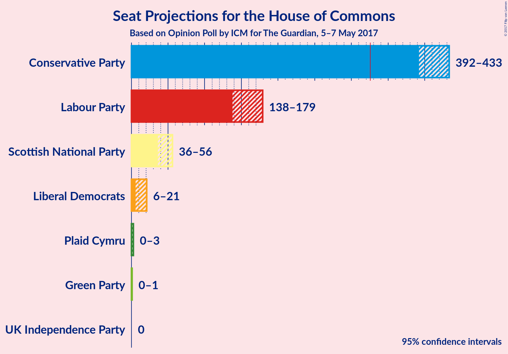

# Opinion Poll by ICM for The Guardian, 5–7 May 2017

<a href="#voting-intentions">Voting Intentions</a> | <a href="#seats">Seats</a> | <a href="#coalitions">Coalitions</a> | <a href="#technical-information">Technical Information</a>

## Voting Intentions

### Confidence Intervals

| Party | Last Result | Poll Result | 80% Confidence Interval | 90% Confidence Interval | 95% Confidence Interval | 99% Confidence Interval |
|:-----:|:-----------:|:-----------:|:-----------------------:|:-----------------------:|:-----------------------:|:-----------------------:|
| Conservative Party | 36.9% | 51.2% | 49.2–52.5% |48.7–53.0% |48.3–53.4% |47.5–54.2% |
| Labour Party | 30.4% | 26.3% | 24.7–27.6% |24.3–28.0% |23.9–28.4% |23.3–29.1% |
| Liberal Democrats | 7.9% | 9.2% | 8.2–10.2% |8.0–10.5% |7.8–10.7% |7.4–11.2% |
| UK Independence Party | 12.6% | 6.0% | 5.2–6.8% |5.0–7.0% |4.8–7.3% |4.5–7.7% |
| Scottish National Party | 4.7% | 4.0% | 3.4–4.7% |3.2–4.9% |3.1–5.1% |2.8–5.5% |
| Green Party | 3.8% | 3.2% | 2.7–3.8% |2.5–4.0% |2.4–4.2% |2.2–4.5% |
| Plaid Cymru | 0.6% | 0.1% | 0.1–0.4% |0.0–0.4% |0.0–0.5% |0.0–0.6% |

*Note:* The poll result column reflects the actual value used in the calculations. Published results may vary slightly, and in addition be rounded to fewer digits.

## Seats

### Confidence Intervals

| Party | Last Result | 80% Confidence Interval | 90% Confidence Interval | 95% Confidence Interval | 99% Confidence Interval |
|:-----:|:-----------:|:-----------------------:|:-----------------------:|:-----------------------:|:-----------------------:|
| <a href="#conservative-party">Conservative Party</a> | 331 | 402–427 |394–430 |392–433 |386–440 |
| <a href="#labour-party">Labour Party</a> | 232 | 143–169 |141–177 |138–179 |131–184 |
| <a href="#liberal-democrats">Liberal Democrats</a> | 8 | 8–19 |7–20 |6–21 |5–24 |
| <a href="#uk-independence-party">UK Independence Party</a> | 1 | 0 |0 |0 |0 |
| <a href="#scottish-national-party">Scottish National Party</a> | 56 | 40–53 |39–55 |36–56 |33–56 |
| <a href="#green-party">Green Party</a> | 1 | 0–1 |0–1 |0–1 |0–2 |
| <a href="#plaid-cymru">Plaid Cymru</a> | 3 | 0–1 |0–1 |0–3 |0–4 |

### Conservative Party

| Number of Seats | Probability | Accumulated |
|:---------------:|:-----------:|:-----------:|
| 381 | 0% | 100% |
| 382 | 0.1% | 99.9% |
| 383 | 0.2% | 99.9% |
| 384 | 0.1% | 99.7% |
| 385 | 0.1% | 99.6% |
| 386 | 0.2% | 99.5% |
| 387 | 0.1% | 99.3% |
| 388 | 0.1% | 99.1% |
| 389 | 0.3% | 99.0% |
| 390 | 0.7% | 98.7% |
| 391 | 0.5% | 98% |
| 392 | 0.5% | 98% |
| 393 | 1.1% | 97% |
| 394 | 2% | 96% |
| 395 | 0.3% | 94% |
| 396 | 0.3% | 94% |
| 397 | 0.8% | 94% |
| 398 | 0.4% | 93% |
| 399 | 1.0% | 92% |
| 400 | 0.6% | 92% |
| 401 | 0.5% | 91% |
| 402 | 0.9% | 90% |
| 403 | 2% | 90% |
| 404 | 2% | 88% |
| 405 | 2% | 86% |
| 406 | 3% | 84% |
| 407 | 3% | 82% |
| 408 | 4% | 79% |
| 409 | 4% | 74% |
| 410 | 4% | 71% |
| 411 | 3% | 67% |
| 412 | 3% | 64% |
| 413 | 4% | 62% |
| 414 | 6% | 58% |
| 415 | 4% | 52% |
| 416 | 5% | 48% |
| 417 | 2% | 43% |
| 418 | 6% | 41% |
| 419 | 4% | 34% |
| 420 | 3% | 30% |
| 421 | 3% | 28% |
| 422 | 2% | 25% |
| 423 | 3% | 23% |
| 424 | 3% | 20% |
| 425 | 4% | 17% |
| 426 | 3% | 13% |
| 427 | 1.1% | 10% |
| 428 | 1.3% | 9% |
| 429 | 2% | 8% |
| 430 | 0.6% | 5% |
| 431 | 1.1% | 5% |
| 432 | 0.6% | 4% |
| 433 | 0.8% | 3% |
| 434 | 0.4% | 2% |
| 435 | 0.3% | 2% |
| 436 | 0.4% | 2% |
| 437 | 0.5% | 1.3% |
| 438 | 0.2% | 0.8% |
| 439 | 0.1% | 0.6% |
| 440 | 0.1% | 0.5% |
| 441 | 0.1% | 0.4% |
| 442 | 0% | 0.3% |
| 443 | 0.1% | 0.3% |
| 444 | 0.1% | 0.2% |
| 445 | 0% | 0.1% |
| 446 | 0% | 0.1% |
| 447 | 0% | 0.1% |
| 448 | 0% | 0% |

### Labour Party

| Number of Seats | Probability | Accumulated |
|:---------------:|:-----------:|:-----------:|
| 124 | 0% | 100% |
| 125 | 0% | 99.9% |
| 126 | 0% | 99.9% |
| 127 | 0% | 99.9% |
| 128 | 0.1% | 99.9% |
| 129 | 0.1% | 99.8% |
| 130 | 0.1% | 99.7% |
| 131 | 0.2% | 99.6% |
| 132 | 0.1% | 99.4% |
| 133 | 0.2% | 99.2% |
| 134 | 0.2% | 99.1% |
| 135 | 0.4% | 98.9% |
| 136 | 0.3% | 98% |
| 137 | 0.3% | 98% |
| 138 | 0.5% | 98% |
| 139 | 0.7% | 97% |
| 140 | 1.0% | 97% |
| 141 | 2% | 96% |
| 142 | 2% | 94% |
| 143 | 2% | 92% |
| 144 | 1.4% | 90% |
| 145 | 4% | 88% |
| 146 | 4% | 84% |
| 147 | 2% | 80% |
| 148 | 2% | 78% |
| 149 | 2% | 76% |
| 150 | 3% | 74% |
| 151 | 3% | 71% |
| 152 | 2% | 68% |
| 153 | 8% | 66% |
| 154 | 2% | 58% |
| 155 | 5% | 56% |
| 156 | 3% | 51% |
| 157 | 4% | 48% |
| 158 | 4% | 44% |
| 159 | 6% | 40% |
| 160 | 6% | 34% |
| 161 | 6% | 29% |
| 162 | 4% | 22% |
| 163 | 0.6% | 18% |
| 164 | 2% | 18% |
| 165 | 1.2% | 16% |
| 166 | 1.5% | 15% |
| 167 | 1.2% | 13% |
| 168 | 1.3% | 12% |
| 169 | 1.4% | 11% |
| 170 | 0.7% | 9% |
| 171 | 0.9% | 8% |
| 172 | 0.4% | 8% |
| 173 | 0.3% | 7% |
| 174 | 0.4% | 7% |
| 175 | 0.9% | 7% |
| 176 | 0.6% | 6% |
| 177 | 1.3% | 5% |
| 178 | 0.6% | 4% |
| 179 | 1.3% | 3% |
| 180 | 0.4% | 2% |
| 181 | 0.2% | 1.4% |
| 182 | 0.2% | 1.2% |
| 183 | 0.3% | 1.0% |
| 184 | 0.2% | 0.7% |
| 185 | 0.1% | 0.5% |
| 186 | 0.2% | 0.3% |
| 187 | 0.1% | 0.2% |
| 188 | 0% | 0.1% |
| 189 | 0% | 0.1% |
| 190 | 0% | 0.1% |
| 191 | 0% | 0% |

### Liberal Democrats

| Number of Seats | Probability | Accumulated |
|:---------------:|:-----------:|:-----------:|
| 4 | 0.1% | 100% |
| 5 | 0.4% | 99.9% |
| 6 | 3% | 99.5% |
| 7 | 4% | 96% |
| 8 | 6% | 93% |
| 9 | 5% | 87% |
| 10 | 5% | 82% |
| 11 | 12% | 76% |
| 12 | 6% | 65% |
| 13 | 7% | 59% |
| 14 | 11% | 52% |
| 15 | 10% | 40% |
| 16 | 6% | 30% |
| 17 | 9% | 24% |
| 18 | 4% | 15% |
| 19 | 4% | 11% |
| 20 | 4% | 8% |
| 21 | 1.4% | 4% |
| 22 | 0.5% | 2% |
| 23 | 1.3% | 2% |
| 24 | 0.3% | 0.7% |
| 25 | 0.1% | 0.3% |
| 26 | 0% | 0.2% |
| 27 | 0.1% | 0.2% |
| 28 | 0% | 0% |

### UK Independence Party

| Number of Seats | Probability | Accumulated |
|:---------------:|:-----------:|:-----------:|
| 0 | 100% | 100% |
| 1 | 0% | 0% |

### Scottish National Party

| Number of Seats | Probability | Accumulated |
|:---------------:|:-----------:|:-----------:|
| 25 | 0% | 100% |
| 26 | 0% | 99.9% |
| 27 | 0% | 99.9% |
| 28 | 0% | 99.9% |
| 29 | 0% | 99.9% |
| 30 | 0% | 99.9% |
| 31 | 0.1% | 99.8% |
| 32 | 0.1% | 99.8% |
| 33 | 0.9% | 99.6% |
| 34 | 0.3% | 98.8% |
| 35 | 0.7% | 98% |
| 36 | 0.5% | 98% |
| 37 | 0.9% | 97% |
| 38 | 0.7% | 96% |
| 39 | 3% | 96% |
| 40 | 5% | 93% |
| 41 | 2% | 88% |
| 42 | 3% | 86% |
| 43 | 7% | 83% |
| 44 | 1.4% | 77% |
| 45 | 10% | 75% |
| 46 | 16% | 65% |
| 47 | 4% | 49% |
| 48 | 5% | 45% |
| 49 | 8% | 40% |
| 50 | 4% | 32% |
| 51 | 8% | 28% |
| 52 | 5% | 20% |
| 53 | 5% | 15% |
| 54 | 3% | 10% |
| 55 | 3% | 7% |
| 56 | 4% | 4% |
| 57 | 0.3% | 0.3% |
| 58 | 0% | 0% |

### Green Party

| Number of Seats | Probability | Accumulated |
|:---------------:|:-----------:|:-----------:|
| 0 | 19% | 100% |
| 1 | 78% | 81% |
| 2 | 2% | 2% |
| 3 | 0% | 0% |

### Plaid Cymru

| Number of Seats | Probability | Accumulated |
|:---------------:|:-----------:|:-----------:|
| 0 | 89% | 100% |
| 1 | 7% | 11% |
| 2 | 0.2% | 4% |
| 3 | 3% | 4% |
| 4 | 1.0% | 1.0% |
| 5 | 0% | 0% |

## Coalitions

### Confidence Intervals

| Coalition | Last Result | 80% Confidence Interval | 90% Confidence Interval | 95% Confidence Interval | 99% Confidence Interval |
|:---------:|:-----------:|:-----------------------:|:-----------------------:|:-----------------------:|:-----------------------:|
| Conservative Party – Scottish National Party – Plaid Cymru | 390 | 449–475 | 442–478 | 438–480 | 432–487 |
| Conservative Party – Scottish National Party | 387 | 448–474 | 442–477 | 438–480 | 432–487 |
| Conservative Party – Liberal Democrats | 339 | 413–442 | 407–446 | 403–449 | 397–457 |
| Conservative Party – Plaid Cymru | 334 | 402–427 | 394–431 | 392–434 | 386–440 |
| Conservative Party | 331 | 402–427 | 394–430 | 392–433 | 386–440 |
| Labour Party – Liberal Democrats – Scottish National Party – Plaid Cymru | 299 | 205–229 | 201–237 | 198–240 | 192–246 |
| Labour Party – Liberal Democrats – Scottish National Party | 296 | 204–229 | 201–237 | 198–239 | 191–245 |
| Labour Party – Scottish National Party – Plaid Cymru | 291 | 189–218 | 185–224 | 182–228 | 174–234 |
| Labour Party – Scottish National Party | 288 | 189–217 | 184–224 | 182–228 | 174–234 |
| Labour Party – Liberal Democrats | 240 | 156–183 | 154–189 | 152–193 | 145–199 |
| Labour Party – Liberal Democrats – Plaid Cymru | 243 | 157–183 | 154–189 | 152–193 | 145–199 |
| Labour Party | 232 | 143–169 | 141–177 | 138–179 | 131–184 |
| Labour Party – Plaid Cymru | 235 | 144–169 | 141–177 | 138–179 | 131–185 |

## Technical Information

### Opinion Poll

+ **Pollster:** ICM
+ **Media:** The Guardian
+ **Fieldwork period:** 5–7 May 2017

### Calculations

+ **Sample size:** 1476
+ **Simulations done:** 2,097,152
+ **Error estimate:** 0.82%

