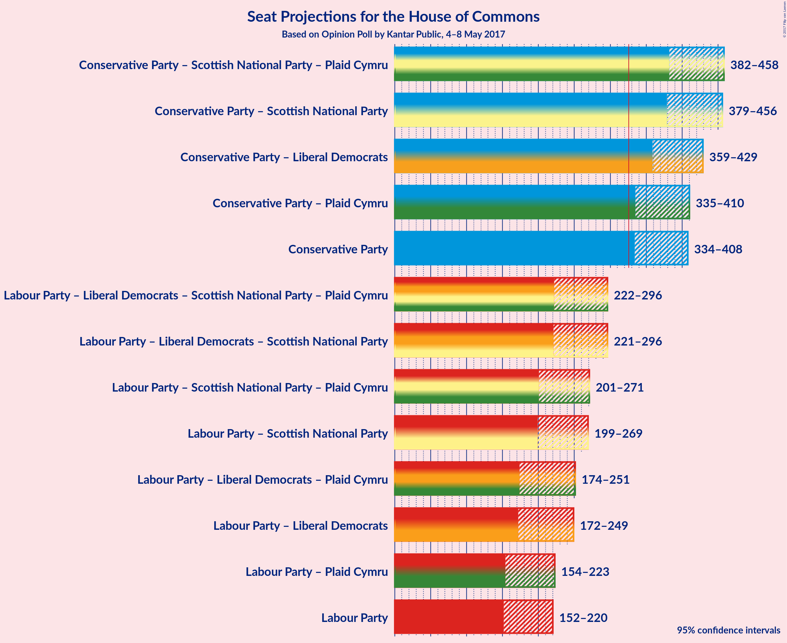

# Opinion Poll by Kantar Public, 4–8 May 2017

<a href="#voting-intentions">Voting Intentions</a> | <a href="#seats">Seats</a> | <a href="#coalitions">Coalitions</a> | <a href="#technical-information">Technical Information</a>

## Voting Intentions

### Confidence Intervals

| Party | Last Result | Poll Result | 80% Confidence Interval | 90% Confidence Interval | 95% Confidence Interval | 99% Confidence Interval |
|:-----:|:-----------:|:-----------:|:-----------------------:|:-----------------------:|:-----------------------:|:-----------------------:|
| Conservative Party | 36.9% | 44.2% | 41.4–46.6% |40.7–47.3% |40.1–48.0% |38.9–49.2% |
| Labour Party | 30.4% | 28.0% | 25.6–30.3% |25.0–31.0% |24.4–31.6% |23.4–32.7% |
| Liberal Democrats | 7.9% | 10.8% | 9.3–12.5% |8.8–13.0% |8.5–13.4% |7.8–14.3% |
| UK Independence Party | 12.6% | 7.8% | 6.5–9.3% |6.2–9.8% |5.9–10.2% |5.3–11.0% |
| Green Party | 3.8% | 4.6% | 3.7–5.9% |3.4–6.3% |3.2–6.6% |2.8–7.3% |
| Scottish National Party | 4.7% | 4.3% | 3.4–5.5% |3.1–5.9% |2.9–6.2% |2.6–6.9% |
| Plaid Cymru | 0.6% | 0.3% | 0.2–0.9% |0.1–1.0% |0.1–1.2% |0.0–1.5% |

*Note:* The poll result column reflects the actual value used in the calculations. Published results may vary slightly, and in addition be rounded to fewer digits.

## Seats

### Confidence Intervals

| Party | Last Result | 80% Confidence Interval | 90% Confidence Interval | 95% Confidence Interval | 99% Confidence Interval |
|:-----:|:-----------:|:-----------------------:|:-----------------------:|:-----------------------:|:-----------------------:|
| <a href="#conservative-party">Conservative Party</a> | 331 | 347–392 |341–401 |334–408 |322–417 |
| <a href="#labour-party">Labour Party</a> | 232 | 167–210 |157–215 |152–220 |143–233 |
| <a href="#liberal-democrats">Liberal Democrats</a> | 8 | 12–33 |10–38 |9–42 |6–47 |
| <a href="#uk-independence-party">UK Independence Party</a> | 1 | 0 |0 |0 |0 |
| <a href="#green-party">Green Party</a> | 1 | 1–2 |1–2 |1–2 |1–2 |
| <a href="#scottish-national-party">Scottish National Party</a> | 56 | 42–56 |40–57 |38–58 |22–59 |
| <a href="#plaid-cymru">Plaid Cymru</a> | 3 | 0–4 |0–6 |0–7 |0–10 |

### Conservative Party

| Number of Seats | Probability | Accumulated |
|:---------------:|:-----------:|:-----------:|
| 307 | 0% | 100% |
| 308 | 0% | 99.9% |
| 309 | 0% | 99.9% |
| 310 | 0% | 99.9% |
| 311 | 0% | 99.9% |
| 312 | 0% | 99.9% |
| 313 | 0% | 99.9% |
| 314 | 0% | 99.9% |
| 315 | 0% | 99.9% |
| 316 | 0% | 99.8% |
| 317 | 0% | 99.8% |
| 318 | 0% | 99.8% |
| 319 | 0.1% | 99.7% |
| 320 | 0% | 99.7% |
| 321 | 0.1% | 99.7% |
| 322 | 0.1% | 99.6% |
| 323 | 0.1% | 99.5% |
| 324 | 0% | 99.4% |
| 325 | 0.2% | 99.4% |
| 326 | 0.2% | 99.2% |
| 327 | 0.2% | 98.9% |
| 328 | 0.1% | 98.7% |
| 329 | 0.2% | 98.6% |
| 330 | 0.2% | 98% |
| 331 | 0.1% | 98% |
| 332 | 0.2% | 98% |
| 333 | 0.2% | 98% |
| 334 | 0.3% | 98% |
| 335 | 0.4% | 97% |
| 336 | 0.2% | 97% |
| 337 | 0.4% | 97% |
| 338 | 0.4% | 96% |
| 339 | 0.6% | 96% |
| 340 | 0.5% | 96% |
| 341 | 0.6% | 95% |
| 342 | 0.3% | 94% |
| 343 | 0.6% | 94% |
| 344 | 0.5% | 94% |
| 345 | 0.5% | 93% |
| 346 | 2% | 93% |
| 347 | 1.1% | 90% |
| 348 | 1.2% | 89% |
| 349 | 0.9% | 88% |
| 350 | 2% | 87% |
| 351 | 1.1% | 85% |
| 352 | 0.8% | 84% |
| 353 | 3% | 83% |
| 354 | 3% | 81% |
| 355 | 1.2% | 78% |
| 356 | 0.8% | 76% |
| 357 | 3% | 76% |
| 358 | 2% | 73% |
| 359 | 1.0% | 71% |
| 360 | 1.3% | 70% |
| 361 | 2% | 69% |
| 362 | 1.2% | 67% |
| 363 | 2% | 65% |
| 364 | 2% | 64% |
| 365 | 1.3% | 62% |
| 366 | 1.5% | 61% |
| 367 | 1.5% | 59% |
| 368 | 1.0% | 58% |
| 369 | 2% | 57% |
| 370 | 3% | 55% |
| 371 | 3% | 52% |
| 372 | 3% | 49% |
| 373 | 3% | 46% |
| 374 | 2% | 43% |
| 375 | 3% | 41% |
| 376 | 2% | 38% |
| 377 | 3% | 36% |
| 378 | 3% | 33% |
| 379 | 3% | 30% |
| 380 | 3% | 27% |
| 381 | 3% | 24% |
| 382 | 2% | 21% |
| 383 | 1.2% | 19% |
| 384 | 1.0% | 18% |
| 385 | 2% | 17% |
| 386 | 1.4% | 14% |
| 387 | 0.5% | 13% |
| 388 | 0.7% | 12% |
| 389 | 0.3% | 12% |
| 390 | 0.9% | 11% |
| 391 | 0.5% | 10% |
| 392 | 0.9% | 10% |
| 393 | 0.3% | 9% |
| 394 | 0.6% | 9% |
| 395 | 0.5% | 8% |
| 396 | 0.2% | 8% |
| 397 | 0.4% | 8% |
| 398 | 0.7% | 7% |
| 399 | 0.3% | 6% |
| 400 | 1.0% | 6% |
| 401 | 0.6% | 5% |
| 402 | 0.3% | 5% |
| 403 | 0.3% | 4% |
| 404 | 0.5% | 4% |
| 405 | 0.4% | 4% |
| 406 | 0.4% | 3% |
| 407 | 0.2% | 3% |
| 408 | 0.5% | 3% |
| 409 | 0.1% | 2% |
| 410 | 0.3% | 2% |
| 411 | 0.2% | 2% |
| 412 | 0.3% | 1.5% |
| 413 | 0.2% | 1.2% |
| 414 | 0.1% | 1.0% |
| 415 | 0.2% | 0.9% |
| 416 | 0.2% | 0.7% |
| 417 | 0.1% | 0.5% |
| 418 | 0.1% | 0.4% |
| 419 | 0.1% | 0.3% |
| 420 | 0% | 0.2% |
| 421 | 0% | 0.2% |
| 422 | 0% | 0.2% |
| 423 | 0% | 0.1% |
| 424 | 0% | 0.1% |
| 425 | 0% | 0.1% |
| 426 | 0% | 0.1% |
| 427 | 0% | 0% |

### Labour Party

| Number of Seats | Probability | Accumulated |
|:---------------:|:-----------:|:-----------:|
| 134 | 0% | 100% |
| 135 | 0% | 99.9% |
| 136 | 0% | 99.9% |
| 137 | 0% | 99.9% |
| 138 | 0% | 99.8% |
| 139 | 0.1% | 99.8% |
| 140 | 0% | 99.8% |
| 141 | 0.1% | 99.7% |
| 142 | 0.1% | 99.6% |
| 143 | 0.1% | 99.6% |
| 144 | 0.1% | 99.5% |
| 145 | 0.2% | 99.4% |
| 146 | 0.1% | 99.2% |
| 147 | 0.4% | 99.1% |
| 148 | 0.3% | 98.7% |
| 149 | 0.3% | 98% |
| 150 | 0.1% | 98% |
| 151 | 0.5% | 98% |
| 152 | 0.4% | 98% |
| 153 | 0.6% | 97% |
| 154 | 0.5% | 97% |
| 155 | 0.4% | 96% |
| 156 | 0.4% | 96% |
| 157 | 0.7% | 95% |
| 158 | 0.5% | 94% |
| 159 | 0.5% | 94% |
| 160 | 0.2% | 93% |
| 161 | 0.4% | 93% |
| 162 | 0.7% | 93% |
| 163 | 0.4% | 92% |
| 164 | 0.4% | 92% |
| 165 | 0.3% | 91% |
| 166 | 0.5% | 91% |
| 167 | 0.8% | 91% |
| 168 | 1.0% | 90% |
| 169 | 0.5% | 89% |
| 170 | 1.2% | 88% |
| 171 | 0.6% | 87% |
| 172 | 1.2% | 86% |
| 173 | 1.5% | 85% |
| 174 | 2% | 84% |
| 175 | 3% | 82% |
| 176 | 2% | 79% |
| 177 | 4% | 77% |
| 178 | 3% | 73% |
| 179 | 3% | 70% |
| 180 | 2% | 68% |
| 181 | 3% | 65% |
| 182 | 3% | 62% |
| 183 | 4% | 59% |
| 184 | 3% | 56% |
| 185 | 3% | 52% |
| 186 | 2% | 50% |
| 187 | 3% | 48% |
| 188 | 2% | 45% |
| 189 | 2% | 43% |
| 190 | 1.4% | 41% |
| 191 | 2% | 39% |
| 192 | 1.1% | 38% |
| 193 | 3% | 37% |
| 194 | 1.2% | 34% |
| 195 | 1.0% | 33% |
| 196 | 2% | 32% |
| 197 | 0.9% | 30% |
| 198 | 3% | 29% |
| 199 | 1.4% | 26% |
| 200 | 3% | 25% |
| 201 | 0.9% | 22% |
| 202 | 2% | 21% |
| 203 | 1.5% | 19% |
| 204 | 0.4% | 17% |
| 205 | 0.7% | 17% |
| 206 | 0.8% | 16% |
| 207 | 1.2% | 15% |
| 208 | 0.8% | 14% |
| 209 | 2% | 13% |
| 210 | 1.4% | 11% |
| 211 | 0.7% | 10% |
| 212 | 2% | 9% |
| 213 | 0.6% | 7% |
| 214 | 0.6% | 6% |
| 215 | 1.1% | 6% |
| 216 | 0.7% | 5% |
| 217 | 0.4% | 4% |
| 218 | 0.3% | 4% |
| 219 | 0.4% | 3% |
| 220 | 0.4% | 3% |
| 221 | 0.4% | 2% |
| 222 | 0.3% | 2% |
| 223 | 0.1% | 2% |
| 224 | 0.1% | 2% |
| 225 | 0.2% | 2% |
| 226 | 0.1% | 1.5% |
| 227 | 0.2% | 1.4% |
| 228 | 0.2% | 1.2% |
| 229 | 0.1% | 0.9% |
| 230 | 0.1% | 0.8% |
| 231 | 0.1% | 0.7% |
| 232 | 0.1% | 0.6% |
| 233 | 0% | 0.5% |
| 234 | 0% | 0.5% |
| 235 | 0.1% | 0.4% |
| 236 | 0% | 0.4% |
| 237 | 0% | 0.3% |
| 238 | 0% | 0.3% |
| 239 | 0% | 0.3% |
| 240 | 0% | 0.2% |
| 241 | 0% | 0.2% |
| 242 | 0% | 0.2% |
| 243 | 0% | 0.2% |
| 244 | 0% | 0.2% |
| 245 | 0% | 0.1% |
| 246 | 0% | 0.1% |
| 247 | 0% | 0.1% |
| 248 | 0% | 0.1% |
| 249 | 0% | 0.1% |
| 250 | 0% | 0.1% |
| 251 | 0% | 0.1% |
| 252 | 0% | 0.1% |
| 253 | 0% | 0% |

### Liberal Democrats

| Number of Seats | Probability | Accumulated |
|:---------------:|:-----------:|:-----------:|
| 4 | 0.1% | 100% |
| 5 | 0.2% | 99.9% |
| 6 | 0.6% | 99.7% |
| 7 | 0.7% | 99.1% |
| 8 | 0.8% | 98% |
| 9 | 2% | 98% |
| 10 | 2% | 95% |
| 11 | 3% | 93% |
| 12 | 2% | 90% |
| 13 | 3% | 88% |
| 14 | 3% | 86% |
| 15 | 4% | 83% |
| 16 | 5% | 79% |
| 17 | 3% | 74% |
| 18 | 2% | 71% |
| 19 | 5% | 68% |
| 20 | 4% | 63% |
| 21 | 2% | 59% |
| 22 | 4% | 57% |
| 23 | 7% | 53% |
| 24 | 4% | 46% |
| 25 | 3% | 41% |
| 26 | 4% | 38% |
| 27 | 4% | 35% |
| 28 | 6% | 30% |
| 29 | 3% | 25% |
| 30 | 3% | 22% |
| 31 | 4% | 19% |
| 32 | 2% | 14% |
| 33 | 3% | 13% |
| 34 | 1.3% | 9% |
| 35 | 1.4% | 8% |
| 36 | 1.1% | 7% |
| 37 | 0.4% | 5% |
| 38 | 0.9% | 5% |
| 39 | 0.6% | 4% |
| 40 | 0.4% | 4% |
| 41 | 0.5% | 3% |
| 42 | 1.1% | 3% |
| 43 | 0.5% | 2% |
| 44 | 0.2% | 1.1% |
| 45 | 0.1% | 0.9% |
| 46 | 0.2% | 0.8% |
| 47 | 0.3% | 0.6% |
| 48 | 0.1% | 0.3% |
| 49 | 0.1% | 0.3% |
| 50 | 0.1% | 0.1% |
| 51 | 0% | 0% |

### UK Independence Party

| Number of Seats | Probability | Accumulated |
|:---------------:|:-----------:|:-----------:|
| 0 | 99.9% | 100% |
| 1 | 0.1% | 0.1% |
| 2 | 0% | 0% |

### Green Party

| Number of Seats | Probability | Accumulated |
|:---------------:|:-----------:|:-----------:|
| 0 | 0.1% | 100% |
| 1 | 46% | 99.9% |
| 2 | 53% | 53% |
| 3 | 0% | 0% |

### Scottish National Party

| Number of Seats | Probability | Accumulated |
|:---------------:|:-----------:|:-----------:|
| 4 | 0.1% | 100% |
| 5 | 0% | 99.9% |
| 6 | 0% | 99.9% |
| 7 | 0% | 99.9% |
| 8 | 0% | 99.8% |
| 9 | 0.1% | 99.8% |
| 10 | 0% | 99.8% |
| 11 | 0% | 99.8% |
| 12 | 0% | 99.8% |
| 13 | 0% | 99.7% |
| 14 | 0% | 99.7% |
| 15 | 0% | 99.7% |
| 16 | 0% | 99.7% |
| 17 | 0% | 99.6% |
| 18 | 0% | 99.6% |
| 19 | 0% | 99.6% |
| 20 | 0% | 99.6% |
| 21 | 0% | 99.6% |
| 22 | 0.1% | 99.6% |
| 23 | 0.1% | 99.5% |
| 24 | 0% | 99.4% |
| 25 | 0.1% | 99.4% |
| 26 | 0.1% | 99.3% |
| 27 | 0.1% | 99.2% |
| 28 | 0.1% | 99.1% |
| 29 | 0.1% | 99.0% |
| 30 | 0.1% | 98.9% |
| 31 | 0.1% | 98.8% |
| 32 | 0.1% | 98.7% |
| 33 | 0.1% | 98.6% |
| 34 | 0.2% | 98% |
| 35 | 0.1% | 98% |
| 36 | 0.3% | 98% |
| 37 | 0.3% | 98% |
| 38 | 0.4% | 98% |
| 39 | 0.9% | 97% |
| 40 | 2% | 96% |
| 41 | 1.3% | 95% |
| 42 | 8% | 93% |
| 43 | 3% | 86% |
| 44 | 4% | 83% |
| 45 | 7% | 78% |
| 46 | 4% | 72% |
| 47 | 12% | 67% |
| 48 | 4% | 55% |
| 49 | 8% | 52% |
| 50 | 8% | 44% |
| 51 | 4% | 36% |
| 52 | 2% | 31% |
| 53 | 6% | 29% |
| 54 | 5% | 23% |
| 55 | 6% | 17% |
| 56 | 4% | 11% |
| 57 | 2% | 7% |
| 58 | 4% | 5% |
| 59 | 1.0% | 1.0% |
| 60 | 0% | 0% |

### Plaid Cymru

| Number of Seats | Probability | Accumulated |
|:---------------:|:-----------:|:-----------:|
| 0 | 41% | 100% |
| 1 | 5% | 59% |
| 2 | 1.3% | 53% |
| 3 | 15% | 52% |
| 4 | 29% | 38% |
| 5 | 1.5% | 8% |
| 6 | 2% | 7% |
| 7 | 3% | 4% |
| 8 | 0.9% | 2% |
| 9 | 0.1% | 0.6% |
| 10 | 0.2% | 0.5% |
| 11 | 0.2% | 0.3% |
| 12 | 0% | 0.1% |
| 13 | 0% | 0% |

## Coalitions

### Confidence Intervals

| Coalition | Last Result | 80% Confidence Interval | 90% Confidence Interval | 95% Confidence Interval | 99% Confidence Interval |
|:---------:|:-----------:|:-----------------------:|:-----------------------:|:-----------------------:|:-----------------------:|
| Conservative Party – Scottish National Party – Plaid Cymru | 390 | 396–443 | 389–454 | 382–458 | 370–468 |
| Conservative Party – Scottish National Party | 387 | 395–440 | 387–451 | 379–456 | 368–464 |
| Conservative Party – Liberal Democrats | 339 | 370–413 | 364–423 | 359–429 | 348–440 |
| Conservative Party – Plaid Cymru | 334 | 349–394 | 344–404 | 335–410 | 325–419 |
| Conservative Party | 331 | 347–392 | 341–401 | 334–408 | 322–417 |
| Labour Party – Liberal Democrats – Scottish National Party – Plaid Cymru | 299 | 239–284 | 229–290 | 222–296 | 213–309 |
| Labour Party – Liberal Democrats – Scottish National Party | 296 | 236–281 | 226–286 | 221–296 | 211–306 |
| Labour Party – Scottish National Party – Plaid Cymru | 291 | 217–261 | 208–266 | 201–271 | 190–283 |
| Labour Party – Scottish National Party | 288 | 214–259 | 206–264 | 199–269 | 189–281 |
| Labour Party – Liberal Democrats – Plaid Cymru | 243 | 190–235 | 179–244 | 174–251 | 166–263 |
| Labour Party – Liberal Democrats | 240 | 187–234 | 176–242 | 172–249 | 162–260 |
| Labour Party – Plaid Cymru | 235 | 170–212 | 159–217 | 154–223 | 145–235 |
| Labour Party | 232 | 167–210 | 157–215 | 152–220 | 143–233 |

## Technical Information

### Opinion Poll

+ **Pollster:** Kantar Public
+ **Media:** —
+ **Fieldwork period:** 4–8 May 2017

### Calculations

+ **Sample size:** 604
+ **Simulations done:** 2,097,152
+ **Error estimate:** 2.26%

