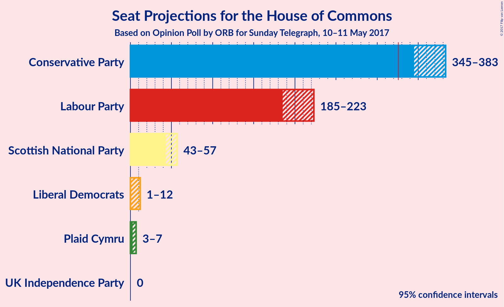

# Opinion Poll by ORB for Sunday Telegraph, 10–11 May 2017

<a href="#voting-intentions">Voting Intentions</a> | <a href="#seats">Seats</a> | <a href="#technical-information">Technical Information</a>

## Voting Intentions

### Confidence Intervals

| Party | Last Result | Poll Result | 80% Confidence Interval | 90% Confidence Interval | 95% Confidence Interval | 99% Confidence Interval |
|:-----:|:-----------:|:-----------:|:-----------------------:|:-----------------------:|:-----------------------:|:-----------------------:|
| Conservative Party | 37.8% | 46.4% | 44.4–47.7% |43.9–48.1% |43.5–48.5% |42.7–49.4% |
| Labour Party | 31.2% | 32.3% | 30.5–33.6% |30.1–34.0% |29.7–34.4% |29.0–35.2% |
| Liberal Democrats | 8.1% | 8.1% | 7.2–9.0% |7.0–9.3% |6.8–9.5% |6.4–10.0% |
| UK Independence Party | 12.9% | 7.1% | 6.2–8.0% |6.0–8.2% |5.8–8.4% |5.5–8.9% |
| Scottish National Party | 4.9% | 3.2% | 2.7–3.9% |2.5–4.0% |2.4–4.2% |2.2–4.5% |
| Green Party | 3.8% | 2.5% | 2.1–3.1% |1.9–3.3% |1.8–3.4% |1.6–3.8% |
| Plaid Cymru | 0.6% | 0.4% | 0.2–0.7% |0.2–0.8% |0.2–0.9% |0.1–1.0% |

*Note:* The poll result column reflects the actual value used in the calculations. Published results may vary slightly, and in addition be rounded to fewer digits.

## Seats

### Confidence Intervals

| Party | Last Result | 80% Confidence Interval | 90% Confidence Interval | 95% Confidence Interval | 99% Confidence Interval |
|:-----:|:-----------:|:-----------------------:|:-----------------------:|:-----------------------:|:-----------------------:|
| <a href="#conservative-party">Conservative Party</a> | 331 | 354–381 |352–385 |349–388 |340–393 |
| <a href="#labour-party">Labour Party</a> | 232 | 198–239 |194–247 |190–250 |186–261 |
| <a href="#liberal-democrats">Liberal Democrats</a> | 8 | 6–16 |5–17 |4–17 |3–18 |
| <a href="#uk-independence-party">UK Independence Party</a> | 1 | 0 |0 |0 |0 |
| <a href="#scottish-national-party">Scottish National Party</a> | 56 | 13–49 |6–51 |4–53 |2–55 |
| <a href="#green-party">Green Party</a> | 1 | 0–1 |0–1 |0–1 |0–1 |
| <a href="#plaid-cymru">Plaid Cymru</a> | 3 | 0–4 |0–5 |0–5 |0–5 |

### Conservative Party

| Number of Seats | Probability | Accumulated |
|:---------------:|:-----------:|:-----------:|
| 332 | 0% | 100% |
| 333 | 0% | 99.9% |
| 334 | 0% | 99.9% |
| 335 | 0% | 99.9% |
| 336 | 0% | 99.8% |
| 337 | 0.1% | 99.8% |
| 338 | 0% | 99.7% |
| 339 | 0.1% | 99.7% |
| 340 | 0.1% | 99.6% |
| 341 | 0.1% | 99.5% |
| 342 | 0% | 99.4% |
| 343 | 0.2% | 99.3% |
| 344 | 0.2% | 99.1% |
| 345 | 0.2% | 98.9% |
| 346 | 0.2% | 98.7% |
| 347 | 0.2% | 98% |
| 348 | 0.4% | 98% |
| 349 | 0.5% | 98% |
| 350 | 0.6% | 97% |
| 351 | 0.9% | 97% |
| 352 | 1.4% | 96% |
| 353 | 2% | 94% |
| 354 | 3% | 93% |
| 355 | 2% | 89% |
| 356 | 2% | 87% |
| 357 | 5% | 85% |
| 358 | 4% | 81% |
| 359 | 3% | 77% |
| 360 | 4% | 75% |
| 361 | 4% | 71% |
| 362 | 3% | 67% |
| 363 | 2% | 64% |
| 364 | 4% | 63% |
| 365 | 2% | 59% |
| 366 | 2% | 56% |
| 367 | 3% | 54% |
| 368 | 4% | 51% |
| 369 | 3% | 48% |
| 370 | 3% | 45% |
| 371 | 5% | 42% |
| 372 | 3% | 37% |
| 373 | 4% | 33% |
| 374 | 4% | 30% |
| 375 | 4% | 26% |
| 376 | 2% | 22% |
| 377 | 2% | 19% |
| 378 | 3% | 18% |
| 379 | 2% | 15% |
| 380 | 2% | 14% |
| 381 | 2% | 12% |
| 382 | 2% | 10% |
| 383 | 1.1% | 8% |
| 384 | 0.7% | 7% |
| 385 | 1.4% | 6% |
| 386 | 2% | 5% |
| 387 | 0.4% | 3% |
| 388 | 0.6% | 3% |
| 389 | 0.4% | 2% |
| 390 | 0.4% | 2% |
| 391 | 0.4% | 1.2% |
| 392 | 0.2% | 0.8% |
| 393 | 0.1% | 0.6% |
| 394 | 0.2% | 0.5% |
| 395 | 0.1% | 0.3% |
| 396 | 0.1% | 0.2% |
| 397 | 0% | 0.2% |
| 398 | 0% | 0.2% |
| 399 | 0% | 0.1% |
| 400 | 0% | 0.1% |
| 401 | 0% | 0.1% |
| 402 | 0% | 0% |

### Labour Party

| Number of Seats | Probability | Accumulated |
|:---------------:|:-----------:|:-----------:|
| 178 | 0% | 100% |
| 179 | 0% | 99.9% |
| 180 | 0% | 99.9% |
| 181 | 0% | 99.9% |
| 182 | 0% | 99.9% |
| 183 | 0.1% | 99.8% |
| 184 | 0.1% | 99.8% |
| 185 | 0.1% | 99.7% |
| 186 | 0.2% | 99.5% |
| 187 | 0.3% | 99.4% |
| 188 | 0.5% | 99.1% |
| 189 | 0.5% | 98.6% |
| 190 | 0.6% | 98% |
| 191 | 0.8% | 97% |
| 192 | 0.4% | 97% |
| 193 | 1.1% | 96% |
| 194 | 1.3% | 95% |
| 195 | 0.6% | 94% |
| 196 | 1.3% | 93% |
| 197 | 2% | 92% |
| 198 | 0.7% | 90% |
| 199 | 2% | 89% |
| 200 | 2% | 88% |
| 201 | 2% | 86% |
| 202 | 2% | 84% |
| 203 | 2% | 82% |
| 204 | 1.3% | 80% |
| 205 | 2% | 79% |
| 206 | 4% | 77% |
| 207 | 4% | 73% |
| 208 | 3% | 69% |
| 209 | 2% | 66% |
| 210 | 0.9% | 64% |
| 211 | 0.4% | 63% |
| 212 | 2% | 62% |
| 213 | 2% | 61% |
| 214 | 1.5% | 59% |
| 215 | 2% | 58% |
| 216 | 3% | 55% |
| 217 | 3% | 52% |
| 218 | 6% | 49% |
| 219 | 2% | 44% |
| 220 | 2% | 42% |
| 221 | 2% | 41% |
| 222 | 2% | 39% |
| 223 | 1.2% | 37% |
| 224 | 1.0% | 35% |
| 225 | 2% | 34% |
| 226 | 3% | 33% |
| 227 | 5% | 30% |
| 228 | 3% | 25% |
| 229 | 0.7% | 22% |
| 230 | 2% | 21% |
| 231 | 1.1% | 19% |
| 232 | 0.3% | 18% |
| 233 | 0.8% | 18% |
| 234 | 1.1% | 17% |
| 235 | 0.4% | 16% |
| 236 | 1.1% | 15% |
| 237 | 1.0% | 14% |
| 238 | 3% | 13% |
| 239 | 1.1% | 10% |
| 240 | 1.1% | 9% |
| 241 | 0.6% | 8% |
| 242 | 0.5% | 8% |
| 243 | 0.6% | 7% |
| 244 | 0.2% | 6% |
| 245 | 0.4% | 6% |
| 246 | 0.6% | 6% |
| 247 | 0.4% | 5% |
| 248 | 1.1% | 5% |
| 249 | 0.5% | 4% |
| 250 | 0.8% | 3% |
| 251 | 0.1% | 2% |
| 252 | 0.3% | 2% |
| 253 | 0.3% | 2% |
| 254 | 0.3% | 2% |
| 255 | 0.1% | 1.4% |
| 256 | 0.2% | 1.3% |
| 257 | 0.2% | 1.0% |
| 258 | 0% | 0.8% |
| 259 | 0.1% | 0.8% |
| 260 | 0.1% | 0.6% |
| 261 | 0.1% | 0.6% |
| 262 | 0.1% | 0.5% |
| 263 | 0% | 0.4% |
| 264 | 0.1% | 0.3% |
| 265 | 0.1% | 0.2% |
| 266 | 0% | 0.2% |
| 267 | 0% | 0.2% |
| 268 | 0% | 0.1% |
| 269 | 0% | 0.1% |
| 270 | 0% | 0.1% |
| 271 | 0% | 0.1% |
| 272 | 0% | 0.1% |
| 273 | 0% | 0.1% |
| 274 | 0% | 0% |

### Liberal Democrats

| Number of Seats | Probability | Accumulated |
|:---------------:|:-----------:|:-----------:|
| 1 | 0.1% | 100% |
| 2 | 0.3% | 99.9% |
| 3 | 0.9% | 99.6% |
| 4 | 2% | 98.7% |
| 5 | 3% | 97% |
| 6 | 5% | 94% |
| 7 | 6% | 89% |
| 8 | 5% | 83% |
| 9 | 5% | 78% |
| 10 | 6% | 74% |
| 11 | 13% | 68% |
| 12 | 13% | 54% |
| 13 | 9% | 41% |
| 14 | 13% | 32% |
| 15 | 7% | 18% |
| 16 | 2% | 11% |
| 17 | 8% | 9% |
| 18 | 0.5% | 0.9% |
| 19 | 0.2% | 0.4% |
| 20 | 0% | 0.3% |
| 21 | 0.1% | 0.2% |
| 22 | 0% | 0.1% |
| 23 | 0.1% | 0.1% |
| 24 | 0% | 0% |

### UK Independence Party

| Number of Seats | Probability | Accumulated |
|:---------------:|:-----------:|:-----------:|
| 0 | 100% | 100% |
| 1 | 0% | 0% |

### Scottish National Party

| Number of Seats | Probability | Accumulated |
|:---------------:|:-----------:|:-----------:|
| 2 | 0.5% | 100% |
| 3 | 0.7% | 99.5% |
| 4 | 2% | 98.8% |
| 5 | 2% | 97% |
| 6 | 0.2% | 95% |
| 7 | 0.5% | 95% |
| 8 | 0.4% | 94% |
| 9 | 3% | 94% |
| 10 | 0.1% | 91% |
| 11 | 0% | 91% |
| 12 | 0.1% | 91% |
| 13 | 2% | 90% |
| 14 | 2% | 89% |
| 15 | 1.4% | 87% |
| 16 | 0.6% | 86% |
| 17 | 2% | 85% |
| 18 | 1.1% | 83% |
| 19 | 3% | 82% |
| 20 | 2% | 79% |
| 21 | 0.7% | 78% |
| 22 | 0.3% | 77% |
| 23 | 1.4% | 77% |
| 24 | 3% | 75% |
| 25 | 2% | 73% |
| 26 | 2% | 70% |
| 27 | 0.4% | 68% |
| 28 | 0.6% | 68% |
| 29 | 3% | 67% |
| 30 | 6% | 65% |
| 31 | 1.3% | 59% |
| 32 | 0.2% | 57% |
| 33 | 0.5% | 57% |
| 34 | 0.5% | 57% |
| 35 | 0.4% | 56% |
| 36 | 3% | 56% |
| 37 | 3% | 53% |
| 38 | 5% | 50% |
| 39 | 2% | 46% |
| 40 | 5% | 44% |
| 41 | 5% | 39% |
| 42 | 5% | 34% |
| 43 | 3% | 29% |
| 44 | 3% | 25% |
| 45 | 6% | 22% |
| 46 | 2% | 16% |
| 47 | 2% | 14% |
| 48 | 2% | 12% |
| 49 | 3% | 10% |
| 50 | 2% | 7% |
| 51 | 1.0% | 5% |
| 52 | 1.4% | 4% |
| 53 | 1.3% | 3% |
| 54 | 0.9% | 2% |
| 55 | 0.9% | 0.9% |
| 56 | 0.1% | 0.1% |
| 57 | 0% | 0% |

### Green Party

| Number of Seats | Probability | Accumulated |
|:---------------:|:-----------:|:-----------:|
| 0 | 57% | 100% |
| 1 | 43% | 43% |
| 2 | 0% | 0% |

### Plaid Cymru

| Number of Seats | Probability | Accumulated |
|:---------------:|:-----------:|:-----------:|
| 0 | 45% | 100% |
| 1 | 1.0% | 55% |
| 2 | 4% | 54% |
| 3 | 35% | 49% |
| 4 | 10% | 15% |
| 5 | 5% | 5% |
| 6 | 0.1% | 0.2% |
| 7 | 0.1% | 0.1% |
| 8 | 0% | 0% |

## Technical Information

### Opinion Poll

+ **Pollster:** ORB
+ **Media:** Sunday Telegraph
+ **Fieldwork period:** 10–11 May 2017

### Calculations

+ **Sample size:** 1496
+ **Simulations done:** 2,097,152
+ **Error estimate:** 0.67%

