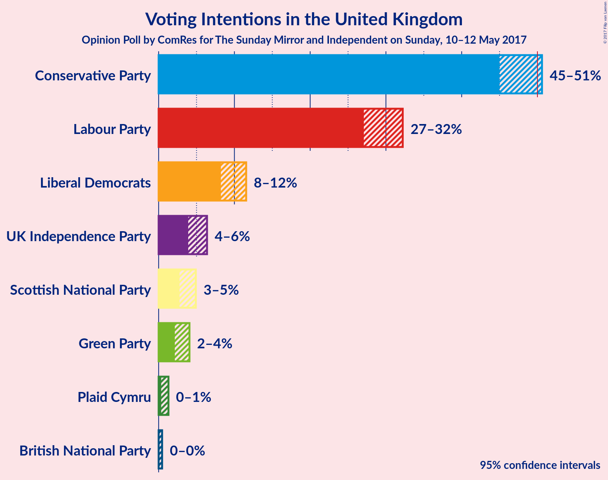
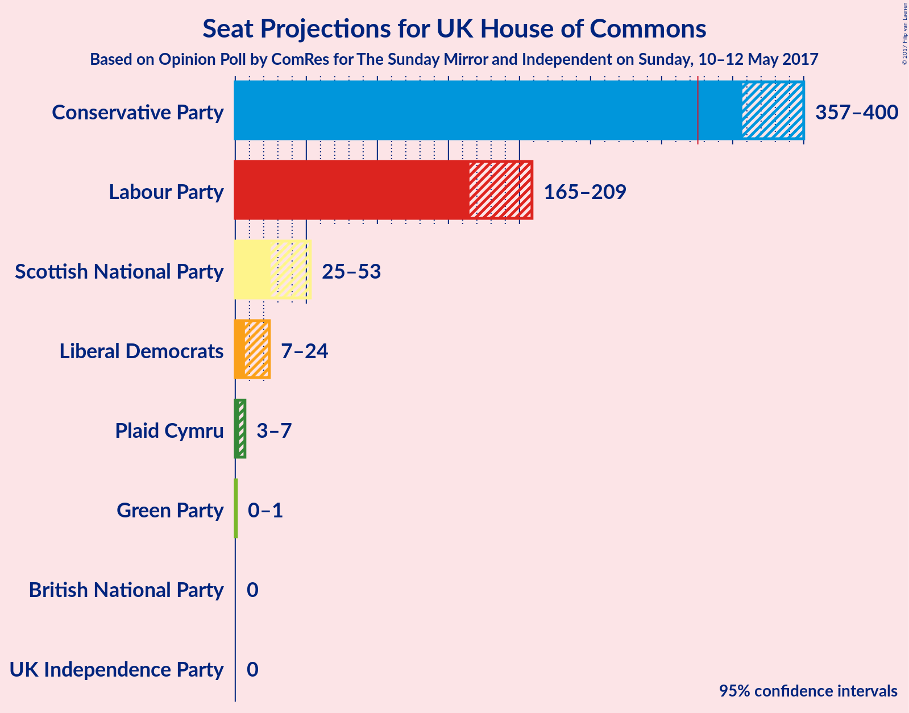

# Opinion Poll by ComRes for The Sunday Mirror and Independent on Sunday, 10–12 May 2017

<a href="#voting-intentions">Voting Intentions</a> | <a href="#seats">Seats</a> | <a href="#technical-information">Technical Information</a>

## Voting Intentions

### Confidence Intervals

| Party | Last Result | Poll Result | 80% Confidence Interval | 90% Confidence Interval | 95% Confidence Interval | 99% Confidence Interval |
|:-----:|:-----------:|:-----------:|:-----------------------:|:-----------------------:|:-----------------------:|:-----------------------:|
| Conservative Party | 37.8% | 48.0% | 46.0–49.6% |45.4–50.1% |45.0–50.6% |44.1–51.5% |
| Labour Party | 31.2% | 29.7% | 28.0–31.3% |27.5–31.8% |27.1–32.2% |26.3–33.1% |
| Liberal Democrats | 8.1% | 9.8% | 8.7–10.9% |8.4–11.3% |8.2–11.6% |7.7–12.1% |
| UK Independence Party | 12.9% | 5.0% | 4.3–5.9% |4.1–6.2% |3.9–6.4% |3.6–6.8% |
| Scottish National Party | 4.9% | 3.7% | 3.1–4.5% |2.9–4.7% |2.8–4.9% |2.5–5.3% |
| Green Party | 3.8% | 3.0% | 2.4–3.7% |2.3–3.9% |2.1–4.1% |1.9–4.4% |
| Plaid Cymru | 0.6% | 0.7% | 0.4–1.1% |0.4–1.2% |0.3–1.3% |0.2–1.5% |
| British National Party | N/A% | 0.1% | 0.0–0.3% |0.0–0.4% |0.0–0.5% |0.0–0.6% |

*Note:* The poll result column reflects the actual value used in the calculations. Published results may vary slightly, and in addition be rounded to fewer digits.

## Seats

### Confidence Intervals

| Party | Last Result | 80% Confidence Interval | 90% Confidence Interval | 95% Confidence Interval | 99% Confidence Interval |
|:-----:|:-----------:|:-----------------------:|:-----------------------:|:-----------------------:|:-----------------------:|
| <a href="#conservative-party">Conservative Party</a> | 331 | 364–390 |362–395 |357–400 |352–412 |
| <a href="#labour-party">Labour Party</a> | 232 | 179–201 |173–203 |165–209 |157–219 |
| <a href="#liberal-democrats">Liberal Democrats</a> | 8 | 11–20 |9–23 |7–24 |5–29 |
| <a href="#uk-independence-party">UK Independence Party</a> | 1 | 0 |0 |0 |0 |
| <a href="#scottish-national-party">Scottish National Party</a> | 56 | 38–50 |32–53 |25–53 |18–55 |
| <a href="#green-party">Green Party</a> | 1 | 0–1 |0–1 |0–1 |0–1 |
| <a href="#plaid-cymru">Plaid Cymru</a> | 3 | 4 |4–5 |3–7 |0–7 |
| <a href="#british-national-party">British National Party</a> | N/A | 0 |0 |0 |0 |

### Conservative Party

| Number of Seats | Probability | Accumulated |
|:---------------:|:-----------:|:-----------:|
| 343 | 0% | 100% |
| 344 | 0% | 99.9% |
| 345 | 0% | 99.9% |
| 346 | 0% | 99.9% |
| 347 | 0% | 99.9% |
| 348 | 0% | 99.9% |
| 349 | 0% | 99.8% |
| 350 | 0% | 99.8% |
| 351 | 0.1% | 99.8% |
| 352 | 0.2% | 99.7% |
| 353 | 0.7% | 99.4% |
| 354 | 0.1% | 98.8% |
| 355 | 0.2% | 98.6% |
| 356 | 0.7% | 98% |
| 357 | 0.3% | 98% |
| 358 | 0.1% | 97% |
| 359 | 0% | 97% |
| 360 | 0% | 97% |
| 361 | 0.3% | 97% |
| 362 | 5% | 97% |
| 363 | 0.1% | 93% |
| 364 | 5% | 92% |
| 365 | 0% | 87% |
| 366 | 0.2% | 87% |
| 367 | 0.1% | 87% |
| 368 | 0.9% | 87% |
| 369 | 0.1% | 86% |
| 370 | 0.8% | 86% |
| 371 | 12% | 85% |
| 372 | 0.8% | 73% |
| 373 | 0.6% | 72% |
| 374 | 0.7% | 72% |
| 375 | 6% | 71% |
| 376 | 0.8% | 66% |
| 377 | 0% | 65% |
| 378 | 1.3% | 65% |
| 379 | 1.2% | 63% |
| 380 | 1.2% | 62% |
| 381 | 3% | 61% |
| 382 | 29% | 58% |
| 383 | 1.3% | 29% |
| 384 | 3% | 28% |
| 385 | 0.2% | 25% |
| 386 | 13% | 25% |
| 387 | 0.5% | 12% |
| 388 | 0.2% | 11% |
| 389 | 0.5% | 11% |
| 390 | 3% | 11% |
| 391 | 1.1% | 8% |
| 392 | 1.5% | 7% |
| 393 | 0.1% | 6% |
| 394 | 0.2% | 5% |
| 395 | 0.4% | 5% |
| 396 | 0.6% | 5% |
| 397 | 0.3% | 4% |
| 398 | 1.0% | 4% |
| 399 | 0.1% | 3% |
| 400 | 0.9% | 3% |
| 401 | 0.3% | 2% |
| 402 | 0.1% | 2% |
| 403 | 0.1% | 2% |
| 404 | 0% | 2% |
| 405 | 0.3% | 2% |
| 406 | 0.4% | 1.3% |
| 407 | 0% | 0.9% |
| 408 | 0% | 0.9% |
| 409 | 0% | 0.9% |
| 410 | 0.2% | 0.8% |
| 411 | 0.1% | 0.7% |
| 412 | 0.4% | 0.6% |
| 413 | 0% | 0.2% |
| 414 | 0% | 0.2% |
| 415 | 0% | 0.2% |
| 416 | 0.1% | 0.2% |
| 417 | 0% | 0.1% |
| 418 | 0% | 0.1% |
| 419 | 0% | 0.1% |
| 420 | 0% | 0.1% |
| 421 | 0% | 0.1% |
| 422 | 0% | 0% |

### Labour Party

| Number of Seats | Probability | Accumulated |
|:---------------:|:-----------:|:-----------:|
| 149 | 0% | 100% |
| 150 | 0% | 99.9% |
| 151 | 0% | 99.9% |
| 152 | 0% | 99.9% |
| 153 | 0% | 99.9% |
| 154 | 0% | 99.9% |
| 155 | 0% | 99.8% |
| 156 | 0.3% | 99.8% |
| 157 | 0.1% | 99.5% |
| 158 | 0.2% | 99.4% |
| 159 | 0% | 99.2% |
| 160 | 0% | 99.2% |
| 161 | 0.2% | 99.1% |
| 162 | 0% | 98.9% |
| 163 | 0.1% | 98.9% |
| 164 | 0.4% | 98.8% |
| 165 | 0.9% | 98% |
| 166 | 0.5% | 97% |
| 167 | 0.1% | 97% |
| 168 | 0.6% | 97% |
| 169 | 0.1% | 96% |
| 170 | 0.2% | 96% |
| 171 | 0.1% | 96% |
| 172 | 0.1% | 96% |
| 173 | 2% | 96% |
| 174 | 0.4% | 94% |
| 175 | 3% | 94% |
| 176 | 0.4% | 91% |
| 177 | 0% | 90% |
| 178 | 0.3% | 90% |
| 179 | 0.5% | 90% |
| 180 | 0.2% | 90% |
| 181 | 0.7% | 89% |
| 182 | 4% | 89% |
| 183 | 0.1% | 85% |
| 184 | 2% | 85% |
| 185 | 6% | 83% |
| 186 | 12% | 78% |
| 187 | 2% | 66% |
| 188 | 28% | 64% |
| 189 | 3% | 36% |
| 190 | 1.1% | 34% |
| 191 | 0.6% | 33% |
| 192 | 0.7% | 32% |
| 193 | 11% | 31% |
| 194 | 0.4% | 21% |
| 195 | 0.4% | 20% |
| 196 | 7% | 20% |
| 197 | 2% | 13% |
| 198 | 0.1% | 12% |
| 199 | 0.1% | 12% |
| 200 | 1.0% | 11% |
| 201 | 4% | 10% |
| 202 | 0.6% | 6% |
| 203 | 2% | 6% |
| 204 | 0.1% | 4% |
| 205 | 0.8% | 4% |
| 206 | 0.2% | 3% |
| 207 | 0.2% | 3% |
| 208 | 0% | 3% |
| 209 | 0.2% | 3% |
| 210 | 1.1% | 2% |
| 211 | 0% | 1.3% |
| 212 | 0% | 1.3% |
| 213 | 0.1% | 1.3% |
| 214 | 0.3% | 1.2% |
| 215 | 0% | 0.9% |
| 216 | 0.2% | 0.9% |
| 217 | 0.1% | 0.6% |
| 218 | 0% | 0.5% |
| 219 | 0% | 0.5% |
| 220 | 0% | 0.5% |
| 221 | 0.1% | 0.5% |
| 222 | 0% | 0.4% |
| 223 | 0.1% | 0.4% |
| 224 | 0% | 0.3% |
| 225 | 0% | 0.3% |
| 226 | 0% | 0.3% |
| 227 | 0% | 0.3% |
| 228 | 0% | 0.2% |
| 229 | 0% | 0.2% |
| 230 | 0.1% | 0.2% |
| 231 | 0% | 0.1% |
| 232 | 0% | 0.1% |
| 233 | 0% | 0.1% |
| 234 | 0% | 0.1% |
| 235 | 0% | 0.1% |
| 236 | 0% | 0.1% |
| 237 | 0% | 0.1% |
| 238 | 0% | 0.1% |
| 239 | 0% | 0.1% |
| 240 | 0% | 0.1% |
| 241 | 0% | 0% |

### Liberal Democrats

| Number of Seats | Probability | Accumulated |
|:---------------:|:-----------:|:-----------:|
| 5 | 0.7% | 100% |
| 6 | 0.3% | 99.3% |
| 7 | 2% | 98.9% |
| 8 | 1.1% | 97% |
| 9 | 0.7% | 96% |
| 10 | 0.2% | 95% |
| 11 | 6% | 95% |
| 12 | 2% | 89% |
| 13 | 44% | 86% |
| 14 | 8% | 42% |
| 15 | 0.8% | 34% |
| 16 | 2% | 33% |
| 17 | 8% | 31% |
| 18 | 1.0% | 22% |
| 19 | 7% | 21% |
| 20 | 7% | 14% |
| 21 | 0.9% | 8% |
| 22 | 0.3% | 7% |
| 23 | 4% | 7% |
| 24 | 0.5% | 3% |
| 25 | 1.2% | 2% |
| 26 | 0.2% | 1.0% |
| 27 | 0.2% | 0.8% |
| 28 | 0% | 0.6% |
| 29 | 0.2% | 0.6% |
| 30 | 0.2% | 0.4% |
| 31 | 0.1% | 0.2% |
| 32 | 0% | 0.1% |
| 33 | 0.1% | 0.1% |
| 34 | 0% | 0% |

### UK Independence Party

| Number of Seats | Probability | Accumulated |
|:---------------:|:-----------:|:-----------:|
| 0 | 100% | 100% |
| 1 | 0% | 0% |

### Scottish National Party

| Number of Seats | Probability | Accumulated |
|:---------------:|:-----------:|:-----------:|
| 4 | 0% | 100% |
| 5 | 0% | 99.9% |
| 6 | 0% | 99.9% |
| 7 | 0% | 99.9% |
| 8 | 0% | 99.9% |
| 9 | 0% | 99.9% |
| 10 | 0% | 99.8% |
| 11 | 0% | 99.8% |
| 12 | 0.1% | 99.8% |
| 13 | 0% | 99.8% |
| 14 | 0% | 99.7% |
| 15 | 0% | 99.7% |
| 16 | 0.1% | 99.7% |
| 17 | 0.1% | 99.6% |
| 18 | 0% | 99.5% |
| 19 | 0.5% | 99.5% |
| 20 | 0% | 99.0% |
| 21 | 0.1% | 99.0% |
| 22 | 0.2% | 98.9% |
| 23 | 0% | 98.7% |
| 24 | 0.1% | 98.7% |
| 25 | 2% | 98.6% |
| 26 | 0.1% | 97% |
| 27 | 0.2% | 96% |
| 28 | 0.4% | 96% |
| 29 | 0% | 96% |
| 30 | 0% | 96% |
| 31 | 0.1% | 96% |
| 32 | 2% | 96% |
| 33 | 0.2% | 94% |
| 34 | 1.3% | 93% |
| 35 | 0.1% | 92% |
| 36 | 0.4% | 92% |
| 37 | 2% | 92% |
| 38 | 0.6% | 90% |
| 39 | 0.4% | 90% |
| 40 | 0.9% | 89% |
| 41 | 0.6% | 88% |
| 42 | 12% | 88% |
| 43 | 1.3% | 75% |
| 44 | 28% | 74% |
| 45 | 6% | 46% |
| 46 | 0.4% | 40% |
| 47 | 9% | 39% |
| 48 | 8% | 30% |
| 49 | 1.3% | 22% |
| 50 | 11% | 20% |
| 51 | 0.9% | 9% |
| 52 | 0.3% | 8% |
| 53 | 5% | 8% |
| 54 | 0.4% | 2% |
| 55 | 2% | 2% |
| 56 | 0.1% | 0.1% |
| 57 | 0% | 0% |

### Green Party

| Number of Seats | Probability | Accumulated |
|:---------------:|:-----------:|:-----------:|
| 0 | 19% | 100% |
| 1 | 81% | 81% |
| 2 | 0.1% | 0.1% |
| 3 | 0% | 0% |

### Plaid Cymru

| Number of Seats | Probability | Accumulated |
|:---------------:|:-----------:|:-----------:|
| 0 | 2% | 100% |
| 1 | 0.3% | 98% |
| 2 | 0.3% | 98% |
| 3 | 2% | 98% |
| 4 | 88% | 96% |
| 5 | 5% | 8% |
| 6 | 0.2% | 3% |
| 7 | 2% | 3% |
| 8 | 0.2% | 0.4% |
| 9 | 0.1% | 0.1% |
| 10 | 0% | 0.1% |
| 11 | 0% | 0% |

### British National Party

| Number of Seats | Probability | Accumulated |
|:---------------:|:-----------:|:-----------:|
| 0 | 100% | 100% |
| 1 | 0% | 0% |

## Technical Information

### Opinion Poll

+ **Pollster:** ComRes
+ **Media:** The Sunday Mirror and Independent on Sunday
+ **Fieldwork period:** 10–12 May 2017

### Calculations

+ **Sample size:** 1214
+ **Simulations done:** 524,288
+ **Error estimate:** 1.91%

