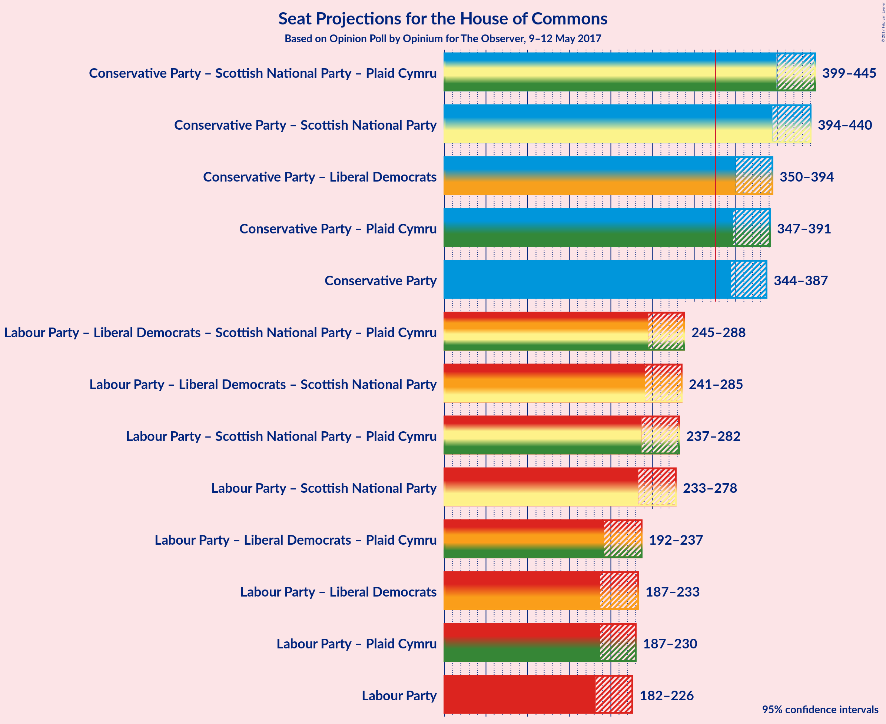

# Opinion Poll by Opinium for The Observer, 9–12 May 2017

<a href="#voting-intentions">Voting Intentions</a> | <a href="#seats">Seats</a> | <a href="#coalitions">Coalitions</a> | <a href="#technical-information">Technical Information</a>

## Voting Intentions

### Confidence Intervals

| Party | Last Result | Poll Result | 80% Confidence Interval | 90% Confidence Interval | 95% Confidence Interval | 99% Confidence Interval |
|:-----:|:-----------:|:-----------:|:-----------------------:|:-----------------------:|:-----------------------:|:-----------------------:|
| Conservative Party | 37.8% | 47.2% | 45.2–49.0% |44.7–49.5% |44.2–50.0% |43.4–50.9% |
| Labour Party | 31.2% | 32.5% | 30.7–34.2% |30.2–34.7% |29.8–35.1% |28.9–36.0% |
| Liberal Democrats | 8.1% | 8.0% | 7.1–9.1% |6.8–9.4% |6.6–9.7% |6.2–10.3% |
| UK Independence Party | 12.9% | 4.7% | 4.0–5.6% |3.8–5.9% |3.7–6.1% |3.3–6.6% |
| Scottish National Party | 4.9% | 4.6% | 3.9–5.5% |3.7–5.7% |3.5–5.9% |3.2–6.4% |
| Green Party | 3.8% | 2.2% | 1.8–2.9% |1.6–3.1% |1.5–3.3% |1.3–3.6% |
| Plaid Cymru | 0.6% | 0.7% | 0.5–1.1% |0.4–1.2% |0.4–1.4% |0.3–1.6% |

*Note:* The poll result column reflects the actual value used in the calculations. Published results may vary slightly, and in addition be rounded to fewer digits.

## Seats

### Confidence Intervals

| Party | Last Result | 80% Confidence Interval | 90% Confidence Interval | 95% Confidence Interval | 99% Confidence Interval |
|:-----:|:-----------:|:-----------------------:|:-----------------------:|:-----------------------:|:-----------------------:|
| <a href="#conservative-party">Conservative Party</a> | 331 | 351–381 |347–384 |344–387 |337–392 |
| <a href="#labour-party">Labour Party</a> | 232 | 188–219 |185–223 |182–226 |177–235 |
| <a href="#liberal-democrats">Liberal Democrats</a> | 8 | 2–11 |1–12 |1–14 |0–17 |
| <a href="#uk-independence-party">UK Independence Party</a> | 1 | 0 |0 |0 |0 |
| <a href="#scottish-national-party">Scottish National Party</a> | 56 | 47–56 |45–57 |41–57 |31–59 |
| <a href="#green-party">Green Party</a> | 1 | 0–1 |0–1 |0–1 |0–1 |
| <a href="#plaid-cymru">Plaid Cymru</a> | 3 | 3–5 |0–7 |0–7 |0–8 |

### Conservative Party

| Number of Seats | Probability | Accumulated |
|:---------------:|:-----------:|:-----------:|
| 324 | 0% | 100% |
| 325 | 0% | 99.9% |
| 326 | 0% | 99.9% |
| 327 | 0% | 99.9% |
| 328 | 0% | 99.9% |
| 329 | 0% | 99.9% |
| 330 | 0% | 99.9% |
| 331 | 0% | 99.8% |
| 332 | 0% | 99.8% |
| 333 | 0% | 99.8% |
| 334 | 0% | 99.8% |
| 335 | 0.1% | 99.7% |
| 336 | 0.1% | 99.6% |
| 337 | 0.1% | 99.6% |
| 338 | 0.2% | 99.5% |
| 339 | 0.2% | 99.2% |
| 340 | 0.1% | 99.0% |
| 341 | 0.2% | 98.9% |
| 342 | 0.5% | 98.6% |
| 343 | 0.6% | 98% |
| 344 | 0.3% | 98% |
| 345 | 0.7% | 97% |
| 346 | 0.5% | 97% |
| 347 | 1.1% | 96% |
| 348 | 2% | 95% |
| 349 | 1.3% | 93% |
| 350 | 1.3% | 92% |
| 351 | 3% | 91% |
| 352 | 2% | 87% |
| 353 | 4% | 85% |
| 354 | 4% | 81% |
| 355 | 5% | 78% |
| 356 | 2% | 73% |
| 357 | 4% | 71% |
| 358 | 3% | 67% |
| 359 | 2% | 64% |
| 360 | 0.8% | 62% |
| 361 | 2% | 61% |
| 362 | 3% | 59% |
| 363 | 4% | 57% |
| 364 | 4% | 52% |
| 365 | 1.2% | 49% |
| 366 | 3% | 47% |
| 367 | 3% | 45% |
| 368 | 2% | 42% |
| 369 | 3% | 40% |
| 370 | 2% | 37% |
| 371 | 3% | 35% |
| 372 | 4% | 32% |
| 373 | 2% | 28% |
| 374 | 0.7% | 27% |
| 375 | 2% | 26% |
| 376 | 5% | 24% |
| 377 | 2% | 19% |
| 378 | 1.4% | 16% |
| 379 | 3% | 15% |
| 380 | 1.3% | 12% |
| 381 | 3% | 11% |
| 382 | 0.7% | 8% |
| 383 | 1.2% | 7% |
| 384 | 2% | 6% |
| 385 | 0.7% | 4% |
| 386 | 0.6% | 3% |
| 387 | 0.5% | 3% |
| 388 | 0.3% | 2% |
| 389 | 0.5% | 2% |
| 390 | 0.2% | 1.2% |
| 391 | 0.2% | 1.0% |
| 392 | 0.4% | 0.8% |
| 393 | 0.1% | 0.4% |
| 394 | 0.2% | 0.4% |
| 395 | 0% | 0.2% |
| 396 | 0% | 0.2% |
| 397 | 0% | 0.2% |
| 398 | 0% | 0.1% |
| 399 | 0% | 0.1% |
| 400 | 0% | 0.1% |
| 401 | 0% | 0.1% |
| 402 | 0% | 0% |

### Labour Party

| Number of Seats | Probability | Accumulated |
|:---------------:|:-----------:|:-----------:|
| 167 | 0% | 100% |
| 168 | 0% | 99.9% |
| 169 | 0% | 99.9% |
| 170 | 0% | 99.9% |
| 171 | 0% | 99.9% |
| 172 | 0% | 99.9% |
| 173 | 0% | 99.8% |
| 174 | 0.1% | 99.8% |
| 175 | 0.1% | 99.7% |
| 176 | 0.1% | 99.6% |
| 177 | 0.5% | 99.5% |
| 178 | 0.3% | 99.1% |
| 179 | 0.2% | 98.8% |
| 180 | 0.1% | 98.6% |
| 181 | 0.3% | 98% |
| 182 | 0.7% | 98% |
| 183 | 0.6% | 97% |
| 184 | 1.0% | 97% |
| 185 | 2% | 96% |
| 186 | 1.0% | 93% |
| 187 | 1.4% | 92% |
| 188 | 1.1% | 91% |
| 189 | 2% | 90% |
| 190 | 3% | 88% |
| 191 | 3% | 85% |
| 192 | 4% | 82% |
| 193 | 0.8% | 78% |
| 194 | 1.4% | 77% |
| 195 | 3% | 76% |
| 196 | 4% | 73% |
| 197 | 3% | 69% |
| 198 | 2% | 67% |
| 199 | 1.1% | 65% |
| 200 | 4% | 64% |
| 201 | 3% | 60% |
| 202 | 3% | 58% |
| 203 | 3% | 55% |
| 204 | 3% | 52% |
| 205 | 3% | 49% |
| 206 | 2% | 46% |
| 207 | 2% | 44% |
| 208 | 3% | 42% |
| 209 | 2% | 39% |
| 210 | 2% | 37% |
| 211 | 2% | 35% |
| 212 | 2% | 32% |
| 213 | 5% | 30% |
| 214 | 4% | 25% |
| 215 | 2% | 21% |
| 216 | 4% | 19% |
| 217 | 2% | 15% |
| 218 | 1.3% | 13% |
| 219 | 3% | 11% |
| 220 | 2% | 8% |
| 221 | 0.9% | 7% |
| 222 | 0.6% | 6% |
| 223 | 0.9% | 5% |
| 224 | 1.0% | 4% |
| 225 | 0.4% | 3% |
| 226 | 0.7% | 3% |
| 227 | 0.2% | 2% |
| 228 | 0.4% | 2% |
| 229 | 0.3% | 2% |
| 230 | 0.2% | 1.3% |
| 231 | 0.3% | 1.1% |
| 232 | 0.1% | 0.8% |
| 233 | 0.1% | 0.7% |
| 234 | 0.1% | 0.6% |
| 235 | 0.1% | 0.5% |
| 236 | 0% | 0.4% |
| 237 | 0% | 0.4% |
| 238 | 0.1% | 0.3% |
| 239 | 0.1% | 0.3% |
| 240 | 0% | 0.2% |
| 241 | 0% | 0.2% |
| 242 | 0% | 0.2% |
| 243 | 0% | 0.2% |
| 244 | 0% | 0.1% |
| 245 | 0% | 0.1% |
| 246 | 0% | 0.1% |
| 247 | 0% | 0.1% |
| 248 | 0% | 0.1% |
| 249 | 0% | 0.1% |
| 250 | 0% | 0% |

### Liberal Democrats

| Number of Seats | Probability | Accumulated |
|:---------------:|:-----------:|:-----------:|
| 0 | 1.5% | 100% |
| 1 | 4% | 98.5% |
| 2 | 6% | 94% |
| 3 | 8% | 88% |
| 4 | 14% | 80% |
| 5 | 15% | 66% |
| 6 | 13% | 51% |
| 7 | 11% | 39% |
| 8 | 6% | 28% |
| 9 | 7% | 22% |
| 10 | 4% | 14% |
| 11 | 4% | 10% |
| 12 | 2% | 7% |
| 13 | 0.9% | 5% |
| 14 | 2% | 4% |
| 15 | 0.7% | 2% |
| 16 | 0.3% | 0.9% |
| 17 | 0.3% | 0.6% |
| 18 | 0.1% | 0.3% |
| 19 | 0.1% | 0.2% |
| 20 | 0.1% | 0.1% |
| 21 | 0% | 0.1% |
| 22 | 0% | 0% |

### UK Independence Party

| Number of Seats | Probability | Accumulated |
|:---------------:|:-----------:|:-----------:|
| 0 | 100% | 100% |
| 1 | 0% | 0% |

### Scottish National Party

| Number of Seats | Probability | Accumulated |
|:---------------:|:-----------:|:-----------:|
| 17 | 0% | 100% |
| 18 | 0% | 99.9% |
| 19 | 0% | 99.9% |
| 20 | 0% | 99.9% |
| 21 | 0% | 99.9% |
| 22 | 0% | 99.9% |
| 23 | 0% | 99.9% |
| 24 | 0.1% | 99.8% |
| 25 | 0% | 99.8% |
| 26 | 0% | 99.8% |
| 27 | 0.1% | 99.7% |
| 28 | 0.1% | 99.7% |
| 29 | 0% | 99.6% |
| 30 | 0.1% | 99.6% |
| 31 | 0.1% | 99.5% |
| 32 | 0% | 99.4% |
| 33 | 0.1% | 99.4% |
| 34 | 0.1% | 99.3% |
| 35 | 0.1% | 99.2% |
| 36 | 0.1% | 99.2% |
| 37 | 0.3% | 99.1% |
| 38 | 0.1% | 98.8% |
| 39 | 0.3% | 98.7% |
| 40 | 0.4% | 98% |
| 41 | 0.5% | 98% |
| 42 | 0.9% | 97% |
| 43 | 0.9% | 97% |
| 44 | 0.4% | 96% |
| 45 | 2% | 95% |
| 46 | 2% | 93% |
| 47 | 3% | 91% |
| 48 | 2% | 88% |
| 49 | 4% | 87% |
| 50 | 5% | 83% |
| 51 | 4% | 77% |
| 52 | 6% | 73% |
| 53 | 9% | 68% |
| 54 | 9% | 59% |
| 55 | 28% | 50% |
| 56 | 18% | 23% |
| 57 | 3% | 5% |
| 58 | 1.0% | 2% |
| 59 | 1.1% | 1.1% |
| 60 | 0% | 0% |

### Green Party

| Number of Seats | Probability | Accumulated |
|:---------------:|:-----------:|:-----------:|
| 0 | 82% | 100% |
| 1 | 18% | 18% |
| 2 | 0% | 0% |

### Plaid Cymru

| Number of Seats | Probability | Accumulated |
|:---------------:|:-----------:|:-----------:|
| 0 | 7% | 100% |
| 1 | 0.6% | 93% |
| 2 | 0.9% | 93% |
| 3 | 25% | 92% |
| 4 | 22% | 67% |
| 5 | 35% | 44% |
| 6 | 1.4% | 9% |
| 7 | 7% | 8% |
| 8 | 0.8% | 0.9% |
| 9 | 0% | 0.2% |
| 10 | 0.1% | 0.1% |
| 11 | 0.1% | 0.1% |
| 12 | 0% | 0% |

## Coalitions

### Confidence Intervals

| Coalition | Last Result | 80% Confidence Interval | 90% Confidence Interval | 95% Confidence Interval | 99% Confidence Interval |
|:---------:|:-----------:|:-----------------------:|:-----------------------:|:-----------------------:|:-----------------------:|
| Conservative Party | 331 | 351–381 | 347–384 | 344–387 | 337–392 |
| Conservative Party – Liberal Democrats | 339 | 356–388 | 352–391 | 350–394 | 342–400 |
| Conservative Party – Plaid Cymru | 334 | 355–385 | 351–388 | 347–391 | 341–396 |
| Conservative Party – Scottish National Party – Plaid Cymru | 390 | 407–438 | 402–441 | 399–445 | 388–449 |
| Conservative Party – Scottish National Party | 387 | 403–433 | 398–436 | 394–440 | 384–445 |
| Labour Party | 232 | 188–219 | 185–223 | 182–226 | 177–235 |
| Labour Party – Liberal Democrats | 240 | 194–225 | 191–230 | 187–233 | 183–244 |
| Labour Party – Liberal Democrats – Plaid Cymru | 243 | 199–229 | 196–234 | 192–237 | 187–248 |
| Labour Party – Liberal Democrats – Scottish National Party – Plaid Cymru | 299 | 251–281 | 248–284 | 245–288 | 240–295 |
| Labour Party – Liberal Democrats – Scottish National Party | 296 | 247–277 | 244–281 | 241–285 | 235–291 |
| Labour Party – Plaid Cymru | 235 | 192–223 | 189–226 | 187–230 | 181–238 |
| Labour Party – Scottish National Party – Plaid Cymru | 291 | 244–276 | 241–280 | 237–282 | 232–290 |
| Labour Party – Scottish National Party | 288 | 240–272 | 237–275 | 233–278 | 227–286 |

## Technical Information

### Opinion Poll

+ **Pollster:** Opinium
+ **Media:** The Observer
+ **Fieldwork period:** 9–12 May 2017

### Calculations

+ **Sample size:** 1158
+ **Simulations done:** 2,097,152
+ **Error estimate:** 1.63%

