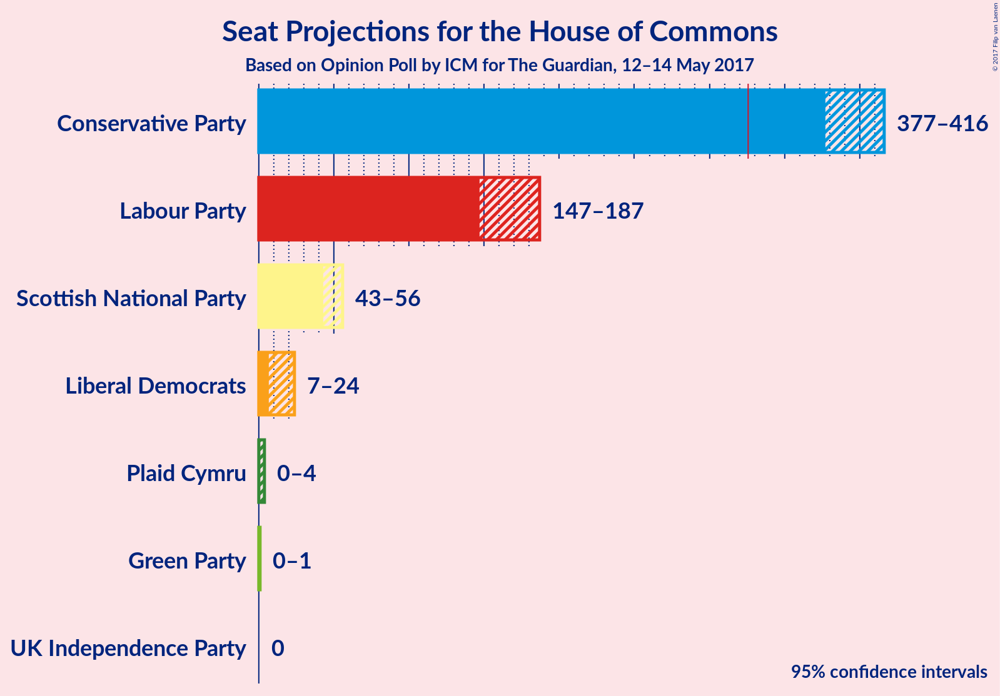

# Opinion Poll by ICM for The Guardian, 12–14 May 2017

<a href="#voting-intentions">Voting Intentions</a> | <a href="#seats">Seats</a> | <a href="#technical-information">Technical Information</a>

## Voting Intentions

### Confidence Intervals

| Party | Last Result | Poll Result | 80% Confidence Interval | 90% Confidence Interval | 95% Confidence Interval | 99% Confidence Interval |
|:-----:|:-----------:|:-----------:|:-----------------------:|:-----------------------:|:-----------------------:|:-----------------------:|
| Conservative Party | 37.8% | 49.3% | 47.3–50.7% |46.9–51.2% |46.4–51.6% |45.6–52.4% |
| Labour Party | 31.2% | 27.4% | 25.8–28.8% |25.4–29.2% |25.0–29.6% |24.4–30.4% |
| Liberal Democrats | 8.1% | 10.0% | 9.0–11.0% |8.7–11.3% |8.5–11.6% |8.1–12.1% |
| UK Independence Party | 12.9% | 5.2% | 4.5–6.0% |4.3–6.3% |4.2–6.5% |3.9–6.9% |
| Scottish National Party | 4.9% | 4.7% | 4.0–5.5% |3.8–5.7% |3.7–5.9% |3.4–6.3% |
| Green Party | 3.8% | 3.0% | 2.5–3.6% |2.3–3.8% |2.2–3.9% |2.0–4.3% |
| Plaid Cymru | 0.6% | 0.4% | 0.3–0.7% |0.2–0.8% |0.2–0.9% |0.1–1.1% |

*Note:* The poll result column reflects the actual value used in the calculations. Published results may vary slightly, and in addition be rounded to fewer digits.

## Seats

### Confidence Intervals

| Party | Last Result | 80% Confidence Interval | 90% Confidence Interval | 95% Confidence Interval | 99% Confidence Interval |
|:-----:|:-----------:|:-----------------------:|:-----------------------:|:-----------------------:|:-----------------------:|
| <a href="#conservative-party">Conservative Party</a> | 331 | 383–410 |380–413 |377–416 |369–421 |
| <a href="#labour-party">Labour Party</a> | 232 | 153–180 |150–183 |147–186 |141–194 |
| <a href="#liberal-democrats">Liberal Democrats</a> | 8 | 10–21 |8–22 |7–24 |5–28 |
| <a href="#uk-independence-party">UK Independence Party</a> | 1 | 0 |0 |0 |0 |
| <a href="#scottish-national-party">Scottish National Party</a> | 56 | 45–56 |44–56 |43–56 |40–57 |
| <a href="#green-party">Green Party</a> | 1 | 0–1 |0–1 |0–1 |0–1 |
| <a href="#plaid-cymru">Plaid Cymru</a> | 3 | 0–4 |0–4 |0–4 |0–7 |

### Conservative Party

| Number of Seats | Probability | Accumulated |
|:---------------:|:-----------:|:-----------:|
| 362 | 0% | 100% |
| 363 | 0% | 99.9% |
| 364 | 0% | 99.9% |
| 365 | 0% | 99.9% |
| 366 | 0.2% | 99.8% |
| 367 | 0% | 99.7% |
| 368 | 0.1% | 99.6% |
| 369 | 0% | 99.5% |
| 370 | 0% | 99.5% |
| 371 | 0.1% | 99.4% |
| 372 | 0.1% | 99.3% |
| 373 | 0.7% | 99.2% |
| 374 | 0.3% | 98.6% |
| 375 | 0.3% | 98% |
| 376 | 0.2% | 98% |
| 377 | 0.5% | 98% |
| 378 | 0.5% | 97% |
| 379 | 1.3% | 97% |
| 380 | 2% | 95% |
| 381 | 2% | 94% |
| 382 | 0.9% | 92% |
| 383 | 2% | 91% |
| 384 | 1.3% | 89% |
| 385 | 3% | 88% |
| 386 | 6% | 85% |
| 387 | 2% | 79% |
| 388 | 8% | 78% |
| 389 | 8% | 70% |
| 390 | 0.5% | 62% |
| 391 | 0.5% | 62% |
| 392 | 2% | 61% |
| 393 | 3% | 59% |
| 394 | 1.0% | 56% |
| 395 | 0.3% | 55% |
| 396 | 7% | 55% |
| 397 | 6% | 48% |
| 398 | 2% | 42% |
| 399 | 2% | 40% |
| 400 | 2% | 38% |
| 401 | 2% | 36% |
| 402 | 2% | 34% |
| 403 | 0.4% | 31% |
| 404 | 7% | 31% |
| 405 | 2% | 24% |
| 406 | 6% | 22% |
| 407 | 1.0% | 16% |
| 408 | 1.3% | 15% |
| 409 | 1.2% | 14% |
| 410 | 4% | 13% |
| 411 | 3% | 9% |
| 412 | 0.5% | 6% |
| 413 | 1.4% | 5% |
| 414 | 0.4% | 4% |
| 415 | 1.0% | 4% |
| 416 | 1.0% | 3% |
| 417 | 0.4% | 2% |
| 418 | 0.2% | 1.2% |
| 419 | 0.2% | 1.0% |
| 420 | 0.2% | 0.8% |
| 421 | 0.1% | 0.6% |
| 422 | 0.1% | 0.4% |
| 423 | 0.1% | 0.3% |
| 424 | 0.1% | 0.2% |
| 425 | 0% | 0.2% |
| 426 | 0% | 0.1% |
| 427 | 0% | 0.1% |
| 428 | 0% | 0.1% |
| 429 | 0% | 0.1% |
| 430 | 0% | 0.1% |
| 431 | 0% | 0% |

### Labour Party

| Number of Seats | Probability | Accumulated |
|:---------------:|:-----------:|:-----------:|
| 134 | 0% | 100% |
| 135 | 0% | 99.9% |
| 136 | 0% | 99.9% |
| 137 | 0% | 99.9% |
| 138 | 0.1% | 99.9% |
| 139 | 0.1% | 99.8% |
| 140 | 0.1% | 99.7% |
| 141 | 0.1% | 99.6% |
| 142 | 0.1% | 99.5% |
| 143 | 0.8% | 99.4% |
| 144 | 0.1% | 98.6% |
| 145 | 0.1% | 98% |
| 146 | 0.6% | 98% |
| 147 | 1.2% | 98% |
| 148 | 1.0% | 96% |
| 149 | 0.3% | 96% |
| 150 | 0.4% | 95% |
| 151 | 3% | 95% |
| 152 | 1.2% | 92% |
| 153 | 2% | 91% |
| 154 | 4% | 89% |
| 155 | 4% | 85% |
| 156 | 0.6% | 81% |
| 157 | 5% | 81% |
| 158 | 3% | 76% |
| 159 | 2% | 73% |
| 160 | 3% | 70% |
| 161 | 1.4% | 68% |
| 162 | 3% | 66% |
| 163 | 2% | 64% |
| 164 | 2% | 62% |
| 165 | 2% | 60% |
| 166 | 8% | 58% |
| 167 | 5% | 50% |
| 168 | 1.2% | 45% |
| 169 | 2% | 44% |
| 170 | 0.6% | 42% |
| 171 | 0.7% | 42% |
| 172 | 0.7% | 41% |
| 173 | 9% | 40% |
| 174 | 8% | 32% |
| 175 | 3% | 24% |
| 176 | 4% | 20% |
| 177 | 0.5% | 17% |
| 178 | 3% | 16% |
| 179 | 1.0% | 14% |
| 180 | 3% | 13% |
| 181 | 0.8% | 10% |
| 182 | 3% | 9% |
| 183 | 2% | 7% |
| 184 | 2% | 5% |
| 185 | 0.5% | 3% |
| 186 | 0.4% | 3% |
| 187 | 0.4% | 2% |
| 188 | 0.3% | 2% |
| 189 | 0.3% | 2% |
| 190 | 0.2% | 1.4% |
| 191 | 0.4% | 1.3% |
| 192 | 0% | 0.8% |
| 193 | 0.3% | 0.8% |
| 194 | 0.1% | 0.5% |
| 195 | 0.1% | 0.5% |
| 196 | 0.1% | 0.4% |
| 197 | 0% | 0.3% |
| 198 | 0.1% | 0.3% |
| 199 | 0% | 0.2% |
| 200 | 0% | 0.1% |
| 201 | 0% | 0.1% |
| 202 | 0% | 0.1% |
| 203 | 0% | 0% |

### Liberal Democrats

| Number of Seats | Probability | Accumulated |
|:---------------:|:-----------:|:-----------:|
| 5 | 0.5% | 100% |
| 6 | 2% | 99.5% |
| 7 | 2% | 98% |
| 8 | 0.9% | 96% |
| 9 | 3% | 95% |
| 10 | 2% | 91% |
| 11 | 6% | 89% |
| 12 | 7% | 83% |
| 13 | 20% | 76% |
| 14 | 7% | 56% |
| 15 | 2% | 49% |
| 16 | 15% | 47% |
| 17 | 9% | 32% |
| 18 | 5% | 23% |
| 19 | 3% | 18% |
| 20 | 3% | 15% |
| 21 | 7% | 13% |
| 22 | 3% | 6% |
| 23 | 0.3% | 3% |
| 24 | 1.1% | 3% |
| 25 | 0.6% | 2% |
| 26 | 0.5% | 1.2% |
| 27 | 0.2% | 0.7% |
| 28 | 0.2% | 0.5% |
| 29 | 0.1% | 0.3% |
| 30 | 0% | 0.2% |
| 31 | 0.1% | 0.2% |
| 32 | 0% | 0.1% |
| 33 | 0% | 0% |

### UK Independence Party

| Number of Seats | Probability | Accumulated |
|:---------------:|:-----------:|:-----------:|
| 0 | 100% | 100% |
| 1 | 0% | 0% |

### Scottish National Party

| Number of Seats | Probability | Accumulated |
|:---------------:|:-----------:|:-----------:|
| 36 | 0% | 100% |
| 37 | 0% | 99.9% |
| 38 | 0% | 99.9% |
| 39 | 0% | 99.8% |
| 40 | 0.4% | 99.8% |
| 41 | 0% | 99.4% |
| 42 | 1.1% | 99.4% |
| 43 | 3% | 98% |
| 44 | 3% | 95% |
| 45 | 3% | 93% |
| 46 | 1.2% | 90% |
| 47 | 7% | 88% |
| 48 | 10% | 82% |
| 49 | 9% | 72% |
| 50 | 3% | 63% |
| 51 | 5% | 60% |
| 52 | 3% | 54% |
| 53 | 20% | 51% |
| 54 | 12% | 31% |
| 55 | 8% | 19% |
| 56 | 9% | 11% |
| 57 | 1.4% | 2% |
| 58 | 0.3% | 0.3% |
| 59 | 0.1% | 0.1% |
| 60 | 0% | 0% |

### Green Party

| Number of Seats | Probability | Accumulated |
|:---------------:|:-----------:|:-----------:|
| 0 | 25% | 100% |
| 1 | 74% | 75% |
| 2 | 0.4% | 0.4% |
| 3 | 0% | 0% |

### Plaid Cymru

| Number of Seats | Probability | Accumulated |
|:---------------:|:-----------:|:-----------:|
| 0 | 19% | 100% |
| 1 | 16% | 81% |
| 2 | 0.2% | 65% |
| 3 | 33% | 65% |
| 4 | 31% | 33% |
| 5 | 0.7% | 2% |
| 6 | 0.4% | 1.1% |
| 7 | 0.7% | 0.8% |
| 8 | 0.1% | 0.1% |
| 9 | 0% | 0% |

## Technical Information

### Opinion Poll

+ **Pollster:** ICM
+ **Media:** The Guardian
+ **Fieldwork period:** 12–14 May 2017

### Calculations

+ **Sample size:** 1451
+ **Simulations done:** 524,288
+ **Error estimate:** 1.37%

