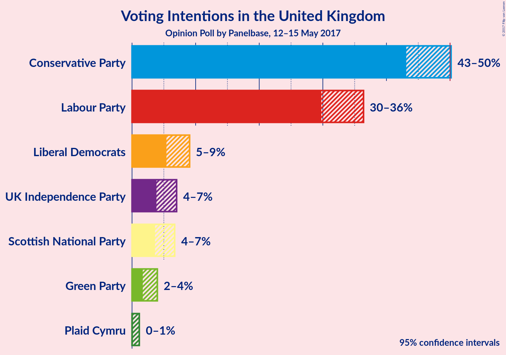
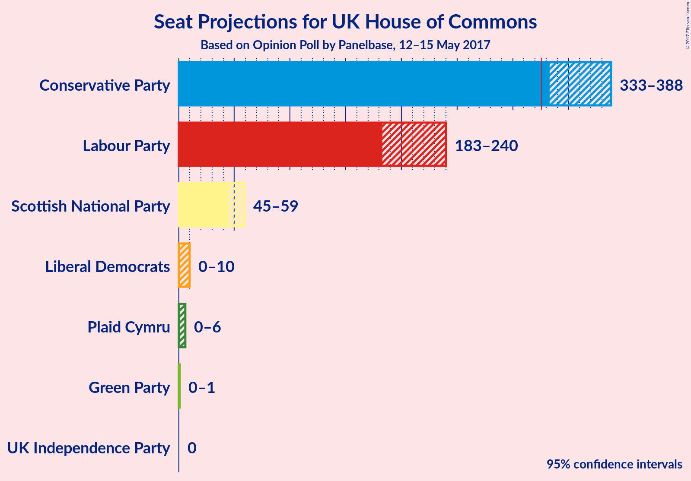
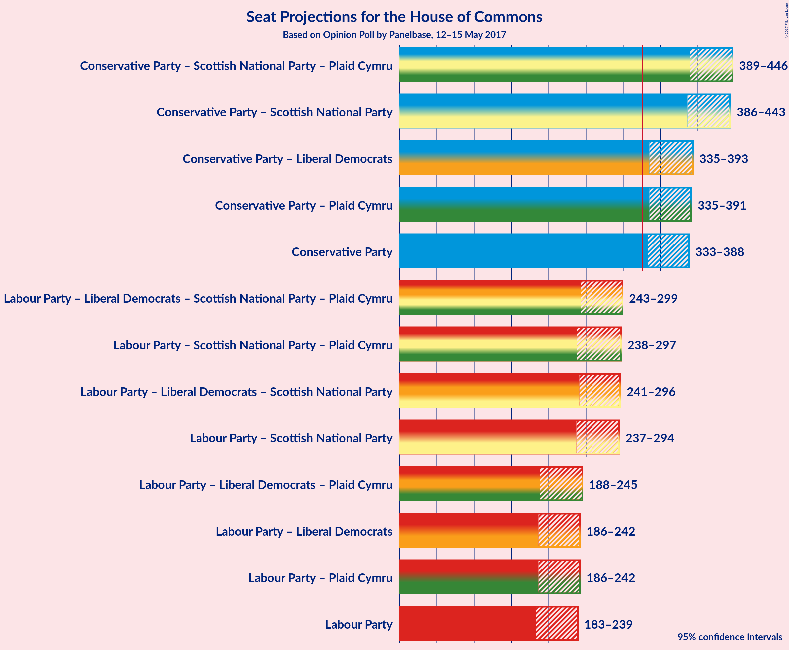

# Opinion Poll by Panelbase, 12–15 May 2017

<a href="#voting-intentions">Voting Intentions</a> | <a href="#seats">Seats</a> | <a href="#coalitions">Coalitions</a> | <a href="#technical-information">Technical Information</a>

## Voting Intentions

### Confidence Intervals

| Party | Last Result | Poll Result | 80% Confidence Interval | 90% Confidence Interval | 95% Confidence Interval | 99% Confidence Interval |
|:-----:|:-----------:|:-----------:|:-----------------------:|:-----------------------:|:-----------------------:|:-----------------------:|
| Conservative Party | 37.8% | 46.7% | 44.3–48.9% |43.7–49.6% |43.1–50.2% |42.0–51.3% |
| Labour Party | 31.2% | 33.1% | 30.9–35.2% |30.3–35.8% |29.8–36.4% |28.8–37.5% |
| Liberal Democrats | 8.1% | 7.0% | 6.0–8.3% |5.7–8.7% |5.4–9.1% |4.9–9.7% |
| UK Independence Party | 12.9% | 5.2% | 4.3–6.4% |4.0–6.7% |3.8–7.0% |3.4–7.6% |
| Scottish National Party | 4.9% | 4.9% | 4.1–6.1% |3.8–6.4% |3.6–6.7% |3.2–7.3% |
| Green Party | 3.8% | 2.6% | 2.0–3.5% |1.8–3.7% |1.7–4.0% |1.4–4.5% |
| Plaid Cymru | 0.6% | 0.4% | 0.2–0.9% |0.2–1.0% |0.1–1.1% |0.1–1.4% |

*Note:* The poll result column reflects the actual value used in the calculations. Published results may vary slightly, and in addition be rounded to fewer digits.

## Seats

### Confidence Intervals

| Party | Last Result | 80% Confidence Interval | 90% Confidence Interval | 95% Confidence Interval | 99% Confidence Interval |
|:-----:|:-----------:|:-----------------------:|:-----------------------:|:-----------------------:|:-----------------------:|
| <a href="#conservative-party">Conservative Party</a> | 331 | 344–382 |337–386 |333–388 |321–396 |
| <a href="#labour-party">Labour Party</a> | 232 | 188–229 |185–236 |183–239 |175–252 |
| <a href="#liberal-democrats">Liberal Democrats</a> | 8 | 1–7 |0–9 |0–11 |0–15 |
| <a href="#uk-independence-party">UK Independence Party</a> | 1 | 0 |0 |0 |0 |
| <a href="#scottish-national-party">Scottish National Party</a> | 56 | 51–58 |48–59 |45–59 |33–59 |
| <a href="#green-party">Green Party</a> | 1 | 0–1 |0–1 |0–1 |0–1 |
| <a href="#plaid-cymru">Plaid Cymru</a> | 3 | 0–5 |0–5 |0–6 |0–7 |

### Conservative Party

| Number of Seats | Probability | Accumulated |
|:---------------:|:-----------:|:-----------:|
| 315 | 0% | 100% |
| 316 | 0% | 99.9% |
| 317 | 0% | 99.9% |
| 318 | 0% | 99.9% |
| 319 | 0% | 99.8% |
| 320 | 0.1% | 99.8% |
| 321 | 0.2% | 99.6% |
| 322 | 0.2% | 99.5% |
| 323 | 0.2% | 99.3% |
| 324 | 0.2% | 99.1% |
| 325 | 0.1% | 98.9% |
| 326 | 0.1% | 98.8% |
| 327 | 0.2% | 98.7% |
| 328 | 0.1% | 98% |
| 329 | 0.2% | 98% |
| 330 | 0.2% | 98% |
| 331 | 0.1% | 98% |
| 332 | 0.2% | 98% |
| 333 | 0.5% | 98% |
| 334 | 0.2% | 97% |
| 335 | 1.1% | 97% |
| 336 | 0.6% | 96% |
| 337 | 0.2% | 95% |
| 338 | 0.8% | 95% |
| 339 | 0.3% | 94% |
| 340 | 0.5% | 94% |
| 341 | 0.4% | 93% |
| 342 | 3% | 93% |
| 343 | 0.2% | 90% |
| 344 | 1.0% | 90% |
| 345 | 0.9% | 89% |
| 346 | 0.9% | 88% |
| 347 | 2% | 87% |
| 348 | 0.9% | 85% |
| 349 | 3% | 84% |
| 350 | 3% | 81% |
| 351 | 3% | 78% |
| 352 | 3% | 75% |
| 353 | 1.4% | 72% |
| 354 | 2% | 70% |
| 355 | 5% | 68% |
| 356 | 3% | 64% |
| 357 | 0.9% | 61% |
| 358 | 1.3% | 60% |
| 359 | 3% | 59% |
| 360 | 0.3% | 56% |
| 361 | 1.1% | 55% |
| 362 | 1.0% | 54% |
| 363 | 2% | 53% |
| 364 | 1.0% | 51% |
| 365 | 6% | 50% |
| 366 | 3% | 44% |
| 367 | 3% | 41% |
| 368 | 2% | 38% |
| 369 | 3% | 36% |
| 370 | 1.5% | 33% |
| 371 | 1.3% | 31% |
| 372 | 1.3% | 30% |
| 373 | 2% | 29% |
| 374 | 2% | 26% |
| 375 | 2% | 25% |
| 376 | 2% | 22% |
| 377 | 3% | 21% |
| 378 | 3% | 18% |
| 379 | 0.3% | 15% |
| 380 | 2% | 15% |
| 381 | 2% | 13% |
| 382 | 0.9% | 11% |
| 383 | 1.2% | 10% |
| 384 | 2% | 9% |
| 385 | 1.1% | 7% |
| 386 | 1.3% | 5% |
| 387 | 0.8% | 4% |
| 388 | 1.2% | 3% |
| 389 | 0.3% | 2% |
| 390 | 0.4% | 2% |
| 391 | 0.1% | 1.3% |
| 392 | 0.3% | 1.2% |
| 393 | 0.2% | 0.9% |
| 394 | 0% | 0.7% |
| 395 | 0.2% | 0.7% |
| 396 | 0.1% | 0.5% |
| 397 | 0.1% | 0.4% |
| 398 | 0% | 0.3% |
| 399 | 0.1% | 0.3% |
| 400 | 0% | 0.2% |
| 401 | 0% | 0.2% |
| 402 | 0% | 0.2% |
| 403 | 0% | 0.1% |
| 404 | 0% | 0.1% |
| 405 | 0% | 0.1% |
| 406 | 0% | 0.1% |
| 407 | 0% | 0.1% |
| 408 | 0% | 0.1% |
| 409 | 0% | 0% |

### Labour Party

| Number of Seats | Probability | Accumulated |
|:---------------:|:-----------:|:-----------:|
| 165 | 0% | 100% |
| 166 | 0% | 99.9% |
| 167 | 0% | 99.9% |
| 168 | 0% | 99.9% |
| 169 | 0.1% | 99.9% |
| 170 | 0% | 99.8% |
| 171 | 0% | 99.8% |
| 172 | 0% | 99.8% |
| 173 | 0.1% | 99.8% |
| 174 | 0.2% | 99.7% |
| 175 | 0% | 99.5% |
| 176 | 0.1% | 99.5% |
| 177 | 0.1% | 99.4% |
| 178 | 0.3% | 99.2% |
| 179 | 0.3% | 98.9% |
| 180 | 0.1% | 98.7% |
| 181 | 0.2% | 98.6% |
| 182 | 0.6% | 98% |
| 183 | 1.0% | 98% |
| 184 | 1.5% | 97% |
| 185 | 0.8% | 95% |
| 186 | 3% | 95% |
| 187 | 1.3% | 92% |
| 188 | 1.5% | 91% |
| 189 | 0.9% | 89% |
| 190 | 3% | 88% |
| 191 | 1.4% | 85% |
| 192 | 2% | 84% |
| 193 | 3% | 82% |
| 194 | 0.8% | 79% |
| 195 | 2% | 79% |
| 196 | 2% | 76% |
| 197 | 2% | 74% |
| 198 | 0.7% | 72% |
| 199 | 1.1% | 71% |
| 200 | 4% | 70% |
| 201 | 4% | 67% |
| 202 | 3% | 63% |
| 203 | 3% | 61% |
| 204 | 5% | 58% |
| 205 | 2% | 53% |
| 206 | 2% | 51% |
| 207 | 2% | 48% |
| 208 | 0.3% | 47% |
| 209 | 0.5% | 46% |
| 210 | 2% | 46% |
| 211 | 2% | 44% |
| 212 | 2% | 42% |
| 213 | 1.2% | 40% |
| 214 | 2% | 39% |
| 215 | 2% | 37% |
| 216 | 4% | 35% |
| 217 | 4% | 31% |
| 218 | 0.7% | 27% |
| 219 | 1.3% | 26% |
| 220 | 2% | 25% |
| 221 | 4% | 23% |
| 222 | 2% | 19% |
| 223 | 2% | 17% |
| 224 | 2% | 15% |
| 225 | 1.0% | 13% |
| 226 | 0.2% | 12% |
| 227 | 0.5% | 12% |
| 228 | 1.0% | 12% |
| 229 | 0.7% | 11% |
| 230 | 2% | 10% |
| 231 | 0.8% | 8% |
| 232 | 0.4% | 7% |
| 233 | 0.3% | 7% |
| 234 | 0.7% | 6% |
| 235 | 0.4% | 6% |
| 236 | 1.2% | 5% |
| 237 | 0.3% | 4% |
| 238 | 0.7% | 4% |
| 239 | 0.5% | 3% |
| 240 | 0.3% | 2% |
| 241 | 0.1% | 2% |
| 242 | 0.2% | 2% |
| 243 | 0.1% | 2% |
| 244 | 0.2% | 2% |
| 245 | 0.3% | 2% |
| 246 | 0.2% | 1.3% |
| 247 | 0.1% | 1.1% |
| 248 | 0.1% | 1.0% |
| 249 | 0.1% | 0.8% |
| 250 | 0.1% | 0.7% |
| 251 | 0% | 0.7% |
| 252 | 0.1% | 0.6% |
| 253 | 0.1% | 0.5% |
| 254 | 0.1% | 0.4% |
| 255 | 0% | 0.3% |
| 256 | 0.1% | 0.3% |
| 257 | 0% | 0.2% |
| 258 | 0% | 0.2% |
| 259 | 0.1% | 0.2% |
| 260 | 0% | 0.1% |
| 261 | 0% | 0.1% |
| 262 | 0% | 0.1% |
| 263 | 0% | 0.1% |
| 264 | 0% | 0% |

### Liberal Democrats

| Number of Seats | Probability | Accumulated |
|:---------------:|:-----------:|:-----------:|
| 0 | 7% | 100% |
| 1 | 14% | 93% |
| 2 | 20% | 79% |
| 3 | 12% | 59% |
| 4 | 14% | 47% |
| 5 | 12% | 33% |
| 6 | 8% | 21% |
| 7 | 4% | 13% |
| 8 | 3% | 9% |
| 9 | 3% | 6% |
| 10 | 0.7% | 3% |
| 11 | 0.5% | 3% |
| 12 | 0.9% | 2% |
| 13 | 0.3% | 1.1% |
| 14 | 0.3% | 0.8% |
| 15 | 0.3% | 0.5% |
| 16 | 0% | 0.2% |
| 17 | 0.1% | 0.2% |
| 18 | 0% | 0.1% |
| 19 | 0% | 0.1% |
| 20 | 0% | 0% |

### UK Independence Party

| Number of Seats | Probability | Accumulated |
|:---------------:|:-----------:|:-----------:|
| 0 | 100% | 100% |
| 1 | 0% | 0% |

### Scottish National Party

| Number of Seats | Probability | Accumulated |
|:---------------:|:-----------:|:-----------:|
| 13 | 0% | 100% |
| 14 | 0% | 99.9% |
| 15 | 0% | 99.9% |
| 16 | 0% | 99.9% |
| 17 | 0% | 99.9% |
| 18 | 0% | 99.9% |
| 19 | 0% | 99.9% |
| 20 | 0% | 99.9% |
| 21 | 0% | 99.9% |
| 22 | 0% | 99.9% |
| 23 | 0% | 99.9% |
| 24 | 0% | 99.8% |
| 25 | 0% | 99.8% |
| 26 | 0% | 99.8% |
| 27 | 0% | 99.8% |
| 28 | 0% | 99.7% |
| 29 | 0.1% | 99.7% |
| 30 | 0% | 99.6% |
| 31 | 0% | 99.6% |
| 32 | 0% | 99.5% |
| 33 | 0% | 99.5% |
| 34 | 0.1% | 99.5% |
| 35 | 0.1% | 99.4% |
| 36 | 0.1% | 99.3% |
| 37 | 0.1% | 99.2% |
| 38 | 0.2% | 99.1% |
| 39 | 0.2% | 99.0% |
| 40 | 0.1% | 98.8% |
| 41 | 0.2% | 98.6% |
| 42 | 0.2% | 98% |
| 43 | 0.2% | 98% |
| 44 | 0.2% | 98% |
| 45 | 1.2% | 98% |
| 46 | 0.7% | 97% |
| 47 | 0.8% | 96% |
| 48 | 1.0% | 95% |
| 49 | 1.1% | 94% |
| 50 | 2% | 93% |
| 51 | 2% | 91% |
| 52 | 2% | 89% |
| 53 | 6% | 86% |
| 54 | 7% | 80% |
| 55 | 18% | 73% |
| 56 | 35% | 55% |
| 57 | 8% | 20% |
| 58 | 6% | 12% |
| 59 | 6% | 6% |
| 60 | 0% | 0% |

### Green Party

| Number of Seats | Probability | Accumulated |
|:---------------:|:-----------:|:-----------:|
| 0 | 54% | 100% |
| 1 | 46% | 46% |
| 2 | 0% | 0% |

### Plaid Cymru

| Number of Seats | Probability | Accumulated |
|:---------------:|:-----------:|:-----------:|
| 0 | 31% | 100% |
| 1 | 2% | 69% |
| 2 | 4% | 67% |
| 3 | 33% | 63% |
| 4 | 8% | 30% |
| 5 | 18% | 22% |
| 6 | 1.0% | 3% |
| 7 | 2% | 2% |
| 8 | 0.2% | 0.3% |
| 9 | 0% | 0.1% |
| 10 | 0% | 0.1% |
| 11 | 0% | 0% |

## Coalitions

### Confidence Intervals

| Coalition | Last Result | 80% Confidence Interval | 90% Confidence Interval | 95% Confidence Interval | 99% Confidence Interval |
|:---------:|:-----------:|:-----------------------:|:-----------------------:|:-----------------------:|:-----------------------:|
| Conservative Party – Scottish National Party – Plaid Cymru | 390 | 400–441 | 393–443 | 389–446 | 374–454 |
| Conservative Party – Scottish National Party | 387 | 398–437 | 391–440 | 386–443 | 374–451 |
| Conservative Party – Liberal Democrats | 339 | 345–387 | 339–389 | 335–393 | 324–400 |
| Conservative Party – Plaid Cymru | 334 | 344–385 | 339–387 | 335–391 | 323–398 |
| Conservative Party | 331 | 344–382 | 337–386 | 333–388 | 321–396 |
| Labour Party – Liberal Democrats – Scottish National Party – Plaid Cymru | 299 | 249–288 | 246–294 | 243–299 | 236–310 |
| Labour Party – Scottish National Party – Plaid Cymru | 291 | 244–286 | 242–292 | 238–297 | 232–308 |
| Labour Party – Liberal Democrats – Scottish National Party | 296 | 246–287 | 244–292 | 241–296 | 233–309 |
| Labour Party – Scottish National Party | 288 | 242–285 | 239–290 | 237–294 | 230–305 |
| Labour Party – Liberal Democrats – Plaid Cymru | 243 | 194–234 | 191–240 | 188–245 | 180–258 |
| Labour Party – Liberal Democrats | 240 | 191–232 | 189–238 | 186–242 | 178–257 |
| Labour Party – Plaid Cymru | 235 | 191–231 | 188–236 | 186–242 | 177–254 |
| Labour Party | 232 | 188–229 | 185–236 | 183–239 | 175–252 |

## Technical Information

### Opinion Poll

+ **Pollster:** Panelbase
+ **Media:** —
+ **Fieldwork period:** 12–15 May 2017

### Calculations

+ **Sample size:** 768
+ **Simulations done:** 1,048,576
+ **Error estimate:** 0.82%

