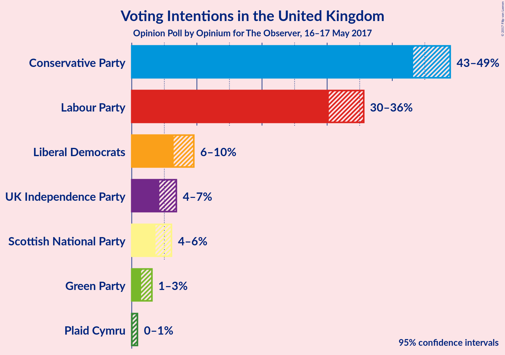
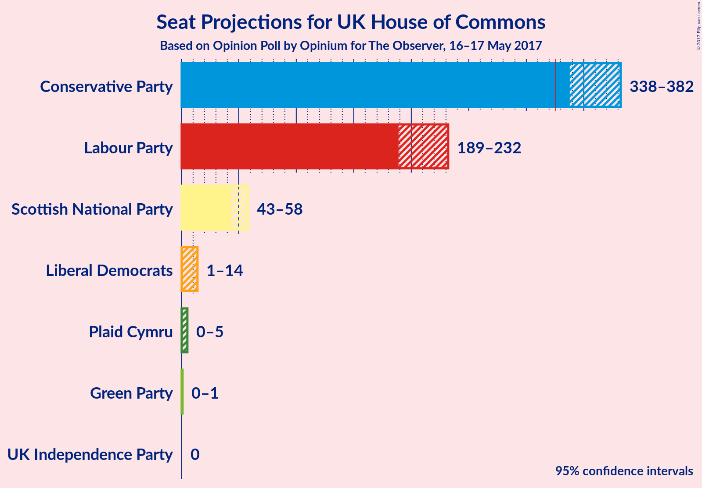
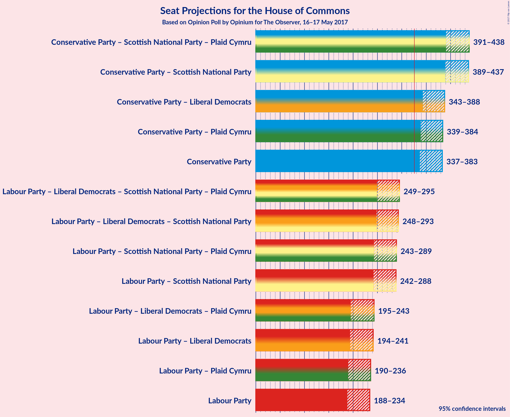

# Opinion Poll by Opinium for The Observer, 16–17 May 2017

<a href="#voting-intentions">Voting Intentions</a> | <a href="#seats">Seats</a> | <a href="#coalitions">Coalitions</a> | <a href="#technical-information">Technical Information</a>

## Voting Intentions

### Confidence Intervals

| Party | Last Result | Poll Result | 80% Confidence Interval | 90% Confidence Interval | 95% Confidence Interval | 99% Confidence Interval |
|:-----:|:-----------:|:-----------:|:-----------------------:|:-----------------------:|:-----------------------:|:-----------------------:|
| Conservative Party | 37.8% | 46.3% | 44.2–47.9% |43.7–48.4% |43.2–48.9% |42.3–49.8% |
| Labour Party | 31.2% | 33.1% | 31.2–34.7% |30.7–35.2% |30.3–35.6% |29.4–36.5% |
| Liberal Democrats | 8.1% | 7.9% | 6.9–8.9% |6.7–9.3% |6.4–9.5% |6.0–10.1% |
| UK Independence Party | 12.9% | 5.4% | 4.6–6.3% |4.4–6.6% |4.2–6.8% |3.9–7.3% |
| Scottish National Party | 4.9% | 4.8% | 4.0–5.6% |3.8–5.9% |3.6–6.1% |3.3–6.5% |
| Green Party | 3.8% | 2.1% | 1.7–2.8% |1.5–2.9% |1.4–3.1% |1.2–3.4% |
| Plaid Cymru | 0.6% | 0.3% | 0.2–0.7% |0.2–0.8% |0.1–0.9% |0.1–1.1% |

*Note:* The poll result column reflects the actual value used in the calculations. Published results may vary slightly, and in addition be rounded to fewer digits.

## Seats

### Confidence Intervals

| Party | Last Result | 80% Confidence Interval | 90% Confidence Interval | 95% Confidence Interval | 99% Confidence Interval |
|:-----:|:-----------:|:-----------------------:|:-----------------------:|:-----------------------:|:-----------------------:|
| <a href="#conservative-party">Conservative Party</a> | 331 | 347–374 |340–378 |338–382 |328–385 |
| <a href="#labour-party">Labour Party</a> | 232 | 195–227 |192–230 |189–232 |185–246 |
| <a href="#liberal-democrats">Liberal Democrats</a> | 8 | 2–13 |2–14 |1–14 |0–15 |
| <a href="#uk-independence-party">UK Independence Party</a> | 1 | 0 |0 |0 |0 |
| <a href="#scottish-national-party">Scottish National Party</a> | 56 | 47–56 |45–57 |43–58 |40–59 |
| <a href="#green-party">Green Party</a> | 1 | 0–1 |0–1 |0–1 |0–1 |
| <a href="#plaid-cymru">Plaid Cymru</a> | 3 | 0–4 |0–5 |0–5 |0–5 |

### Conservative Party

| Number of Seats | Probability | Accumulated |
|:---------------:|:-----------:|:-----------:|
| 320 | 0.2% | 100% |
| 321 | 0% | 99.8% |
| 322 | 0% | 99.8% |
| 323 | 0.1% | 99.8% |
| 324 | 0% | 99.6% |
| 325 | 0% | 99.6% |
| 326 | 0% | 99.6% |
| 327 | 0% | 99.6% |
| 328 | 0.2% | 99.5% |
| 329 | 0% | 99.3% |
| 330 | 0.1% | 99.3% |
| 331 | 0% | 99.2% |
| 332 | 0.5% | 99.2% |
| 333 | 0% | 98.7% |
| 334 | 0.2% | 98.7% |
| 335 | 0.4% | 98% |
| 336 | 0.1% | 98% |
| 337 | 0.3% | 98% |
| 338 | 1.2% | 98% |
| 339 | 1.1% | 97% |
| 340 | 0.6% | 96% |
| 341 | 0.2% | 95% |
| 342 | 2% | 95% |
| 343 | 0.2% | 93% |
| 344 | 1.2% | 92% |
| 345 | 0.4% | 91% |
| 346 | 0.4% | 91% |
| 347 | 5% | 90% |
| 348 | 1.0% | 85% |
| 349 | 4% | 84% |
| 350 | 3% | 80% |
| 351 | 0.7% | 78% |
| 352 | 1.0% | 77% |
| 353 | 6% | 76% |
| 354 | 0.6% | 70% |
| 355 | 2% | 70% |
| 356 | 5% | 68% |
| 357 | 0.1% | 63% |
| 358 | 15% | 62% |
| 359 | 0.4% | 48% |
| 360 | 0.2% | 47% |
| 361 | 0.7% | 47% |
| 362 | 0.1% | 46% |
| 363 | 14% | 46% |
| 364 | 0.3% | 32% |
| 365 | 3% | 31% |
| 366 | 3% | 28% |
| 367 | 3% | 25% |
| 368 | 0.6% | 22% |
| 369 | 3% | 21% |
| 370 | 0.5% | 18% |
| 371 | 5% | 18% |
| 372 | 0.6% | 13% |
| 373 | 0.9% | 12% |
| 374 | 4% | 12% |
| 375 | 0.7% | 8% |
| 376 | 0.5% | 7% |
| 377 | 0.6% | 7% |
| 378 | 2% | 6% |
| 379 | 0.4% | 4% |
| 380 | 0% | 4% |
| 381 | 1.1% | 4% |
| 382 | 0.2% | 3% |
| 383 | 1.2% | 2% |
| 384 | 0.3% | 1.3% |
| 385 | 0.5% | 1.0% |
| 386 | 0% | 0.5% |
| 387 | 0.2% | 0.5% |
| 388 | 0% | 0.2% |
| 389 | 0% | 0.2% |
| 390 | 0% | 0.2% |
| 391 | 0% | 0.2% |
| 392 | 0.1% | 0.1% |
| 393 | 0% | 0.1% |
| 394 | 0% | 0% |

### Labour Party

| Number of Seats | Probability | Accumulated |
|:---------------:|:-----------:|:-----------:|
| 178 | 0.1% | 100% |
| 179 | 0% | 99.9% |
| 180 | 0% | 99.8% |
| 181 | 0% | 99.8% |
| 182 | 0.1% | 99.8% |
| 183 | 0.1% | 99.7% |
| 184 | 0.1% | 99.6% |
| 185 | 0.2% | 99.5% |
| 186 | 1.1% | 99.3% |
| 187 | 0.1% | 98% |
| 188 | 0.3% | 98% |
| 189 | 1.3% | 98% |
| 190 | 0.6% | 97% |
| 191 | 0.7% | 96% |
| 192 | 0.5% | 95% |
| 193 | 0.3% | 95% |
| 194 | 2% | 94% |
| 195 | 5% | 92% |
| 196 | 0.8% | 87% |
| 197 | 1.1% | 86% |
| 198 | 0.9% | 85% |
| 199 | 0.5% | 84% |
| 200 | 2% | 84% |
| 201 | 0.5% | 82% |
| 202 | 3% | 82% |
| 203 | 3% | 78% |
| 204 | 0.7% | 75% |
| 205 | 2% | 74% |
| 206 | 16% | 72% |
| 207 | 0.4% | 56% |
| 208 | 2% | 55% |
| 209 | 0.7% | 54% |
| 210 | 0.1% | 53% |
| 211 | 3% | 53% |
| 212 | 0.3% | 50% |
| 213 | 12% | 50% |
| 214 | 0.8% | 38% |
| 215 | 2% | 37% |
| 216 | 3% | 35% |
| 217 | 4% | 32% |
| 218 | 4% | 28% |
| 219 | 2% | 24% |
| 220 | 5% | 22% |
| 221 | 2% | 17% |
| 222 | 0.5% | 16% |
| 223 | 0.8% | 15% |
| 224 | 0.2% | 14% |
| 225 | 3% | 14% |
| 226 | 1.4% | 11% |
| 227 | 3% | 10% |
| 228 | 1.2% | 7% |
| 229 | 0.1% | 6% |
| 230 | 1.0% | 6% |
| 231 | 0.1% | 5% |
| 232 | 2% | 5% |
| 233 | 0.5% | 2% |
| 234 | 0.1% | 2% |
| 235 | 0% | 2% |
| 236 | 0% | 2% |
| 237 | 0.2% | 2% |
| 238 | 0% | 1.4% |
| 239 | 0% | 1.3% |
| 240 | 0.5% | 1.3% |
| 241 | 0% | 0.8% |
| 242 | 0% | 0.8% |
| 243 | 0.1% | 0.8% |
| 244 | 0% | 0.7% |
| 245 | 0.1% | 0.7% |
| 246 | 0.1% | 0.5% |
| 247 | 0.1% | 0.4% |
| 248 | 0% | 0.3% |
| 249 | 0% | 0.3% |
| 250 | 0% | 0.3% |
| 251 | 0.2% | 0.3% |
| 252 | 0% | 0.1% |
| 253 | 0% | 0.1% |
| 254 | 0% | 0.1% |
| 255 | 0% | 0.1% |
| 256 | 0% | 0.1% |
| 257 | 0% | 0.1% |
| 258 | 0% | 0.1% |
| 259 | 0% | 0% |

### Liberal Democrats

| Number of Seats | Probability | Accumulated |
|:---------------:|:-----------:|:-----------:|
| 0 | 0.6% | 100% |
| 1 | 2% | 99.4% |
| 2 | 9% | 97% |
| 3 | 9% | 89% |
| 4 | 5% | 80% |
| 5 | 9% | 75% |
| 6 | 32% | 65% |
| 7 | 7% | 34% |
| 8 | 4% | 27% |
| 9 | 5% | 24% |
| 10 | 3% | 19% |
| 11 | 4% | 16% |
| 12 | 2% | 12% |
| 13 | 1.0% | 10% |
| 14 | 8% | 9% |
| 15 | 0.7% | 1.1% |
| 16 | 0.2% | 0.4% |
| 17 | 0.1% | 0.3% |
| 18 | 0.1% | 0.1% |
| 19 | 0% | 0.1% |
| 20 | 0% | 0.1% |
| 21 | 0% | 0% |

### UK Independence Party

| Number of Seats | Probability | Accumulated |
|:---------------:|:-----------:|:-----------:|
| 0 | 100% | 100% |
| 1 | 0% | 0% |

### Scottish National Party

| Number of Seats | Probability | Accumulated |
|:---------------:|:-----------:|:-----------:|
| 20 | 0% | 100% |
| 21 | 0% | 99.9% |
| 22 | 0% | 99.9% |
| 23 | 0% | 99.9% |
| 24 | 0% | 99.9% |
| 25 | 0.1% | 99.9% |
| 26 | 0% | 99.8% |
| 27 | 0% | 99.8% |
| 28 | 0% | 99.8% |
| 29 | 0% | 99.8% |
| 30 | 0% | 99.7% |
| 31 | 0% | 99.7% |
| 32 | 0% | 99.7% |
| 33 | 0% | 99.7% |
| 34 | 0% | 99.7% |
| 35 | 0% | 99.7% |
| 36 | 0.1% | 99.7% |
| 37 | 0% | 99.6% |
| 38 | 0% | 99.6% |
| 39 | 0.1% | 99.6% |
| 40 | 0.5% | 99.5% |
| 41 | 0.2% | 99.0% |
| 42 | 0.1% | 98.8% |
| 43 | 2% | 98.7% |
| 44 | 0.6% | 97% |
| 45 | 2% | 96% |
| 46 | 0.2% | 94% |
| 47 | 9% | 94% |
| 48 | 1.0% | 85% |
| 49 | 1.1% | 84% |
| 50 | 1.4% | 83% |
| 51 | 3% | 82% |
| 52 | 2% | 78% |
| 53 | 5% | 76% |
| 54 | 3% | 71% |
| 55 | 42% | 68% |
| 56 | 19% | 26% |
| 57 | 4% | 7% |
| 58 | 1.3% | 3% |
| 59 | 2% | 2% |
| 60 | 0% | 0% |

### Green Party

| Number of Seats | Probability | Accumulated |
|:---------------:|:-----------:|:-----------:|
| 0 | 89% | 100% |
| 1 | 11% | 11% |
| 2 | 0% | 0% |

### Plaid Cymru

| Number of Seats | Probability | Accumulated |
|:---------------:|:-----------:|:-----------:|
| 0 | 47% | 100% |
| 1 | 3% | 53% |
| 2 | 15% | 50% |
| 3 | 20% | 35% |
| 4 | 9% | 15% |
| 5 | 6% | 6% |
| 6 | 0.1% | 0.3% |
| 7 | 0.2% | 0.2% |
| 8 | 0% | 0% |

## Coalitions

### Confidence Intervals

| Coalition | Last Result | 80% Confidence Interval | 90% Confidence Interval | 95% Confidence Interval | 99% Confidence Interval |
|:---------:|:-----------:|:-----------------------:|:-----------------------:|:-----------------------:|:-----------------------:|
| Conservative Party – Scottish National Party – Plaid Cymru | 390 | 400–430 | 397–435 | 391–437 | 382–442 |
| Conservative Party – Scottish National Party | 387 | 398–427 | 394–432 | 388–436 | 379–441 |
| Conservative Party – Liberal Democrats | 339 | 350–380 | 348–384 | 344–388 | 333–393 |
| Conservative Party – Plaid Cymru | 334 | 347–375 | 342–380 | 339–384 | 328–387 |
| Conservative Party | 331 | 347–374 | 340–378 | 338–382 | 328–385 |
| Labour Party – Liberal Democrats – Scottish National Party – Plaid Cymru | 299 | 258–285 | 253–292 | 249–294 | 246–304 |
| Labour Party – Liberal Democrats – Scottish National Party | 296 | 257–285 | 252–290 | 248–293 | 245–304 |
| Labour Party – Scottish National Party – Plaid Cymru | 291 | 252–282 | 247–284 | 244–288 | 239–299 |
| Labour Party – Scottish National Party | 288 | 250–280 | 246–283 | 242–288 | 236–298 |
| Labour Party – Liberal Democrats – Plaid Cymru | 243 | 205–234 | 200–238 | 195–244 | 191–253 |
| Labour Party – Liberal Democrats | 240 | 202–232 | 197–235 | 195–241 | 190–250 |
| Labour Party – Plaid Cymru | 235 | 199–227 | 194–232 | 190–234 | 187–249 |
| Labour Party | 232 | 195–227 | 192–230 | 189–232 | 185–246 |

## Technical Information

### Opinion Poll

+ **Pollster:** Opinium
+ **Media:** The Observer
+ **Fieldwork period:** 16–17 May 2017

### Calculations

+ **Sample size:** 1178
+ **Simulations done:** 131,072
+ **Error estimate:** 1.07%

