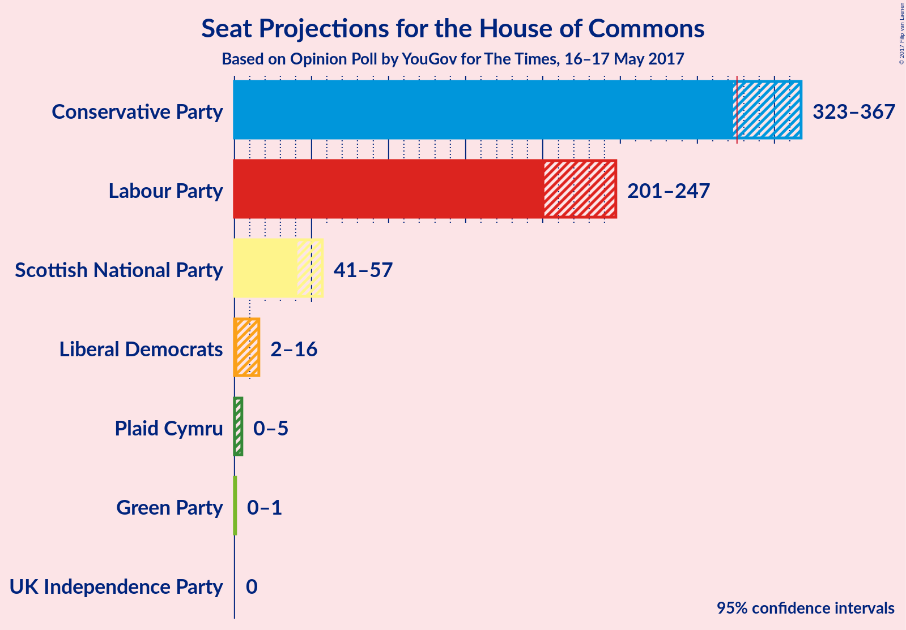
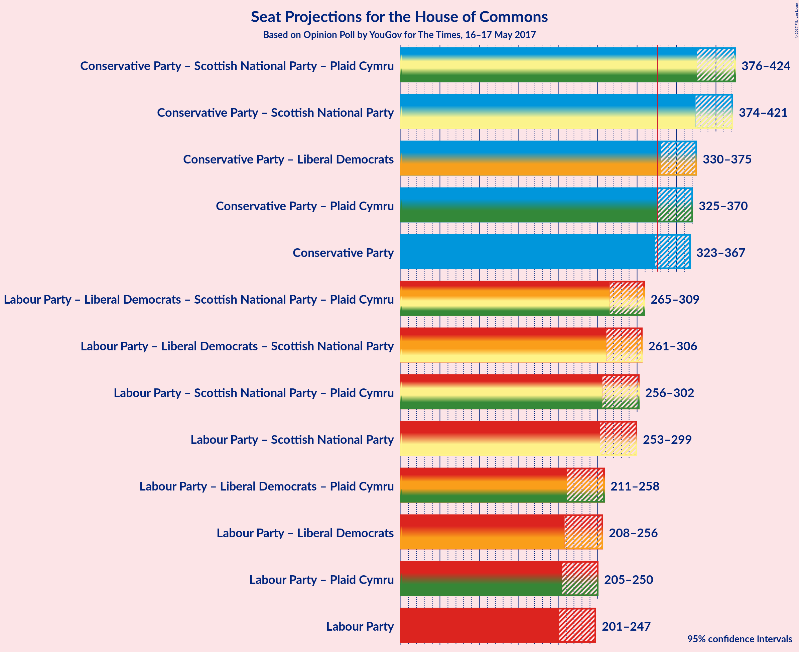

# Opinion Poll by YouGov for The Times, 16–17 May 2017

<a href="#voting-intentions">Voting Intentions</a> | <a href="#seats">Seats</a> | <a href="#coalitions">Coalitions</a> | <a href="#technical-information">Technical Information</a>

## Voting Intentions

### Confidence Intervals

| Party | Last Result | Poll Result | 80% Confidence Interval | 90% Confidence Interval | 95% Confidence Interval | 99% Confidence Interval |
|:-----:|:-----------:|:-----------:|:-----------------------:|:-----------------------:|:-----------------------:|:-----------------------:|
| Conservative Party | 37.8% | 44.3% | 41.7–45.1% |41.3–45.6% |40.8–46.1% |40.0–46.9% |
| Labour Party | 31.2% | 34.0% | 31.7–35.0% |31.3–35.4% |30.9–35.8% |30.1–36.6% |
| Liberal Democrats | 8.1% | 8.3% | 7.3–9.2% |7.1–9.5% |6.9–9.8% |6.4–10.3% |
| UK Independence Party | 12.9% | 6.2% | 5.3–7.0% |5.1–7.3% |5.0–7.5% |4.6–7.9% |
| Scottish National Party | 4.9% | 4.5% | 3.8–5.2% |3.6–5.5% |3.5–5.7% |3.2–6.1% |
| Green Party | 3.8% | 2.0% | 1.6–2.6% |1.5–2.8% |1.4–2.9% |1.2–3.2% |
| Plaid Cymru | 0.6% | 0.6% | 0.4–0.9% |0.3–1.0% |0.3–1.1% |0.2–1.3% |

*Note:* The poll result column reflects the actual value used in the calculations. Published results may vary slightly, and in addition be rounded to fewer digits.

## Seats

### Confidence Intervals

| Party | Last Result | 80% Confidence Interval | 90% Confidence Interval | 95% Confidence Interval | 99% Confidence Interval |
|:-----:|:-----------:|:-----------------------:|:-----------------------:|:-----------------------:|:-----------------------:|
| <a href="#conservative-party">Conservative Party</a> | 331 | 332–358 |327–364 |323–367 |317–375 |
| <a href="#labour-party">Labour Party</a> | 232 | 211–237 |204–243 |201–247 |194–253 |
| <a href="#liberal-democrats">Liberal Democrats</a> | 8 | 4–13 |3–14 |2–16 |1–20 |
| <a href="#uk-independence-party">UK Independence Party</a> | 1 | 0 |0 |0 |0 |
| <a href="#scottish-national-party">Scottish National Party</a> | 56 | 47–56 |44–56 |41–57 |28–59 |
| <a href="#green-party">Green Party</a> | 1 | 0 |0–1 |0–1 |0–1 |
| <a href="#plaid-cymru">Plaid Cymru</a> | 3 | 1–5 |0–5 |0–5 |0–7 |

### Conservative Party

| Number of Seats | Probability | Accumulated |
|:---------------:|:-----------:|:-----------:|
| 311 | 0% | 100% |
| 312 | 0% | 99.9% |
| 313 | 0% | 99.9% |
| 314 | 0% | 99.9% |
| 315 | 0.1% | 99.8% |
| 316 | 0.1% | 99.7% |
| 317 | 0.2% | 99.6% |
| 318 | 0.3% | 99.5% |
| 319 | 0.3% | 99.2% |
| 320 | 0.5% | 98.9% |
| 321 | 0.6% | 98% |
| 322 | 0.2% | 98% |
| 323 | 0.5% | 98% |
| 324 | 0.5% | 97% |
| 325 | 0.7% | 97% |
| 326 | 0.5% | 96% |
| 327 | 0.6% | 95% |
| 328 | 1.2% | 95% |
| 329 | 0.7% | 94% |
| 330 | 2% | 93% |
| 331 | 0.8% | 91% |
| 332 | 1.4% | 91% |
| 333 | 2% | 89% |
| 334 | 2% | 87% |
| 335 | 2% | 85% |
| 336 | 2% | 83% |
| 337 | 3% | 81% |
| 338 | 2% | 78% |
| 339 | 3% | 77% |
| 340 | 2% | 74% |
| 341 | 4% | 72% |
| 342 | 1.5% | 68% |
| 343 | 3% | 67% |
| 344 | 1.4% | 64% |
| 345 | 4% | 62% |
| 346 | 3% | 58% |
| 347 | 9% | 55% |
| 348 | 4% | 46% |
| 349 | 8% | 42% |
| 350 | 5% | 34% |
| 351 | 3% | 30% |
| 352 | 4% | 27% |
| 353 | 3% | 23% |
| 354 | 4% | 20% |
| 355 | 2% | 16% |
| 356 | 2% | 13% |
| 357 | 1.4% | 12% |
| 358 | 0.7% | 10% |
| 359 | 1.1% | 9% |
| 360 | 0.4% | 8% |
| 361 | 0.8% | 8% |
| 362 | 0.3% | 7% |
| 363 | 1.2% | 7% |
| 364 | 1.1% | 6% |
| 365 | 1.0% | 5% |
| 366 | 0.9% | 4% |
| 367 | 0.5% | 3% |
| 368 | 0.3% | 2% |
| 369 | 0.3% | 2% |
| 370 | 0.3% | 2% |
| 371 | 0.2% | 1.3% |
| 372 | 0.2% | 1.1% |
| 373 | 0.2% | 0.9% |
| 374 | 0.2% | 0.7% |
| 375 | 0.1% | 0.6% |
| 376 | 0.1% | 0.5% |
| 377 | 0.1% | 0.3% |
| 378 | 0.1% | 0.3% |
| 379 | 0% | 0.2% |
| 380 | 0% | 0.1% |
| 381 | 0% | 0.1% |
| 382 | 0% | 0.1% |
| 383 | 0% | 0.1% |
| 384 | 0% | 0% |

### Labour Party

| Number of Seats | Probability | Accumulated |
|:---------------:|:-----------:|:-----------:|
| 186 | 0% | 100% |
| 187 | 0% | 99.9% |
| 188 | 0% | 99.9% |
| 189 | 0.1% | 99.9% |
| 190 | 0.1% | 99.8% |
| 191 | 0.1% | 99.7% |
| 192 | 0.1% | 99.7% |
| 193 | 0.1% | 99.6% |
| 194 | 0.1% | 99.5% |
| 195 | 0.2% | 99.5% |
| 196 | 0.2% | 99.2% |
| 197 | 0.1% | 99.0% |
| 198 | 0.3% | 98.9% |
| 199 | 0.3% | 98.6% |
| 200 | 0.5% | 98% |
| 201 | 0.5% | 98% |
| 202 | 0.7% | 97% |
| 203 | 0.9% | 97% |
| 204 | 1.1% | 96% |
| 205 | 0.6% | 95% |
| 206 | 0.8% | 94% |
| 207 | 0.9% | 93% |
| 208 | 0.4% | 92% |
| 209 | 0.6% | 92% |
| 210 | 0.9% | 91% |
| 211 | 1.5% | 90% |
| 212 | 2% | 89% |
| 213 | 2% | 87% |
| 214 | 3% | 85% |
| 215 | 4% | 82% |
| 216 | 3% | 78% |
| 217 | 4% | 76% |
| 218 | 7% | 72% |
| 219 | 8% | 65% |
| 220 | 4% | 57% |
| 221 | 5% | 52% |
| 222 | 4% | 47% |
| 223 | 3% | 43% |
| 224 | 3% | 40% |
| 225 | 2% | 37% |
| 226 | 2% | 35% |
| 227 | 3% | 33% |
| 228 | 3% | 30% |
| 229 | 3% | 27% |
| 230 | 3% | 24% |
| 231 | 1.2% | 22% |
| 232 | 2% | 20% |
| 233 | 2% | 18% |
| 234 | 2% | 16% |
| 235 | 2% | 14% |
| 236 | 1.3% | 12% |
| 237 | 1.4% | 11% |
| 238 | 2% | 10% |
| 239 | 1.1% | 8% |
| 240 | 0.6% | 7% |
| 241 | 1.0% | 7% |
| 242 | 0.3% | 6% |
| 243 | 1.0% | 5% |
| 244 | 0.7% | 4% |
| 245 | 0.4% | 4% |
| 246 | 0.6% | 3% |
| 247 | 0.5% | 3% |
| 248 | 0.5% | 2% |
| 249 | 0.4% | 2% |
| 250 | 0.4% | 1.4% |
| 251 | 0.2% | 1.0% |
| 252 | 0.2% | 0.9% |
| 253 | 0.2% | 0.6% |
| 254 | 0.1% | 0.5% |
| 255 | 0% | 0.4% |
| 256 | 0.1% | 0.3% |
| 257 | 0% | 0.3% |
| 258 | 0% | 0.2% |
| 259 | 0% | 0.2% |
| 260 | 0% | 0.2% |
| 261 | 0% | 0.1% |
| 262 | 0% | 0.1% |
| 263 | 0% | 0.1% |
| 264 | 0% | 0.1% |
| 265 | 0% | 0.1% |
| 266 | 0% | 0.1% |
| 267 | 0% | 0% |

### Liberal Democrats

| Number of Seats | Probability | Accumulated |
|:---------------:|:-----------:|:-----------:|
| 1 | 1.1% | 100% |
| 2 | 3% | 98.8% |
| 3 | 5% | 96% |
| 4 | 8% | 91% |
| 5 | 12% | 82% |
| 6 | 16% | 71% |
| 7 | 9% | 55% |
| 8 | 11% | 46% |
| 9 | 8% | 35% |
| 10 | 8% | 27% |
| 11 | 4% | 19% |
| 12 | 2% | 14% |
| 13 | 4% | 12% |
| 14 | 4% | 9% |
| 15 | 2% | 5% |
| 16 | 1.3% | 3% |
| 17 | 0.6% | 2% |
| 18 | 0.5% | 1.4% |
| 19 | 0.4% | 0.9% |
| 20 | 0.2% | 0.5% |
| 21 | 0.2% | 0.4% |
| 22 | 0.1% | 0.2% |
| 23 | 0.1% | 0.1% |
| 24 | 0% | 0.1% |
| 25 | 0% | 0% |

### UK Independence Party

| Number of Seats | Probability | Accumulated |
|:---------------:|:-----------:|:-----------:|
| 0 | 100% | 100% |
| 1 | 0% | 0% |

### Scottish National Party

| Number of Seats | Probability | Accumulated |
|:---------------:|:-----------:|:-----------:|
| 16 | 0% | 100% |
| 17 | 0% | 99.9% |
| 18 | 0% | 99.9% |
| 19 | 0% | 99.9% |
| 20 | 0% | 99.9% |
| 21 | 0% | 99.9% |
| 22 | 0% | 99.9% |
| 23 | 0% | 99.8% |
| 24 | 0% | 99.8% |
| 25 | 0% | 99.8% |
| 26 | 0% | 99.8% |
| 27 | 0.1% | 99.7% |
| 28 | 0.1% | 99.6% |
| 29 | 0.1% | 99.5% |
| 30 | 0.1% | 99.4% |
| 31 | 0.1% | 99.4% |
| 32 | 0.2% | 99.2% |
| 33 | 0.1% | 99.0% |
| 34 | 0.1% | 98.9% |
| 35 | 0.1% | 98.8% |
| 36 | 0% | 98.7% |
| 37 | 0.2% | 98.6% |
| 38 | 0.1% | 98% |
| 39 | 0.2% | 98% |
| 40 | 0.3% | 98% |
| 41 | 0.7% | 98% |
| 42 | 1.0% | 97% |
| 43 | 0.7% | 96% |
| 44 | 2% | 95% |
| 45 | 2% | 94% |
| 46 | 2% | 92% |
| 47 | 2% | 90% |
| 48 | 1.3% | 88% |
| 49 | 5% | 87% |
| 50 | 4% | 82% |
| 51 | 4% | 78% |
| 52 | 6% | 74% |
| 53 | 11% | 68% |
| 54 | 12% | 57% |
| 55 | 31% | 45% |
| 56 | 10% | 14% |
| 57 | 2% | 4% |
| 58 | 1.3% | 2% |
| 59 | 0.7% | 0.7% |
| 60 | 0% | 0% |

### Green Party

| Number of Seats | Probability | Accumulated |
|:---------------:|:-----------:|:-----------:|
| 0 | 93% | 100% |
| 1 | 7% | 7% |
| 2 | 0% | 0% |

### Plaid Cymru

| Number of Seats | Probability | Accumulated |
|:---------------:|:-----------:|:-----------:|
| 0 | 9% | 100% |
| 1 | 4% | 91% |
| 2 | 4% | 88% |
| 3 | 43% | 84% |
| 4 | 19% | 41% |
| 5 | 20% | 22% |
| 6 | 0.5% | 2% |
| 7 | 1.4% | 1.4% |
| 8 | 0.1% | 0.1% |
| 9 | 0% | 0% |

## Coalitions

### Confidence Intervals

| Coalition | Last Result | 80% Confidence Interval | 90% Confidence Interval | 95% Confidence Interval | 99% Confidence Interval |
|:---------:|:-----------:|:-----------------------:|:-----------------------:|:-----------------------:|:-----------------------:|
| Conservative Party – Scottish National Party – Plaid Cymru | 390 | 386–415 | 381–420 | 376–424 | 367–431 |
| Conservative Party – Scottish National Party | 387 | 383–411 | 378–417 | 374–421 | 364–428 |
| Conservative Party – Liberal Democrats | 339 | 339–366 | 335–371 | 330–375 | 325–384 |
| Conservative Party – Plaid Cymru | 334 | 335–361 | 330–368 | 325–370 | 320–378 |
| Conservative Party | 331 | 332–358 | 327–364 | 323–367 | 317–375 |
| Labour Party – Liberal Democrats – Scottish National Party – Plaid Cymru | 299 | 274–300 | 268–305 | 265–309 | 257–315 |
| Labour Party – Liberal Democrats – Scottish National Party | 296 | 271–297 | 264–302 | 261–306 | 254–312 |
| Labour Party – Scottish National Party – Plaid Cymru | 291 | 266–293 | 261–297 | 256–302 | 248–307 |
| Labour Party – Scottish National Party | 288 | 262–289 | 257–295 | 253–299 | 245–304 |
| Labour Party – Liberal Democrats – Plaid Cymru | 243 | 221–249 | 214–254 | 211–258 | 204–268 |
| Labour Party – Liberal Democrats | 240 | 217–246 | 212–251 | 208–256 | 201–265 |
| Labour Party – Plaid Cymru | 235 | 214–240 | 208–245 | 205–250 | 197–256 |
| Labour Party | 232 | 211–237 | 204–243 | 201–247 | 194–253 |

## Technical Information

### Opinion Poll

+ **Pollster:** YouGov
+ **Media:** The Times
+ **Fieldwork period:** 16–17 May 2017

### Calculations

+ **Sample size:** 1366
+ **Simulations done:** 2,097,152
+ **Error estimate:** 0.44%

