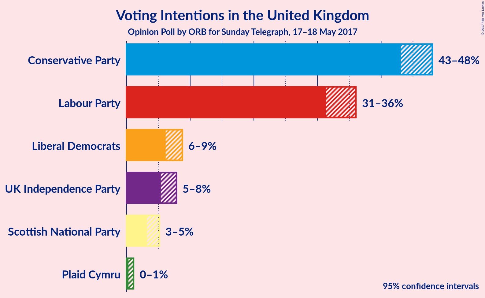
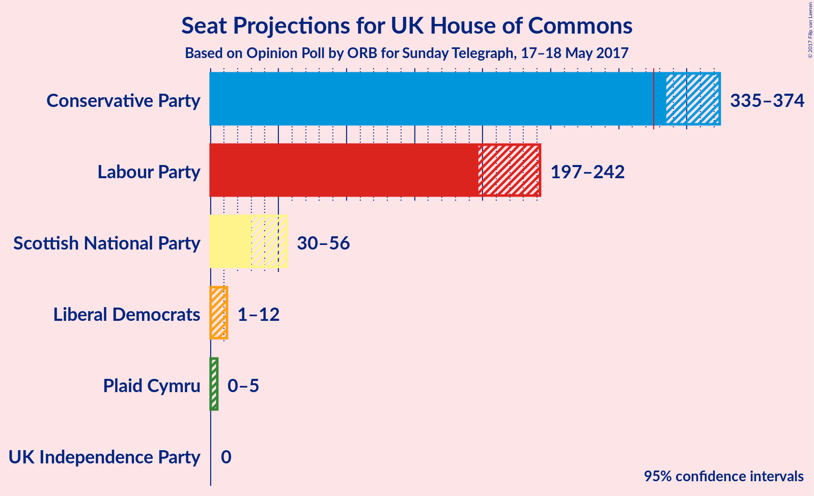
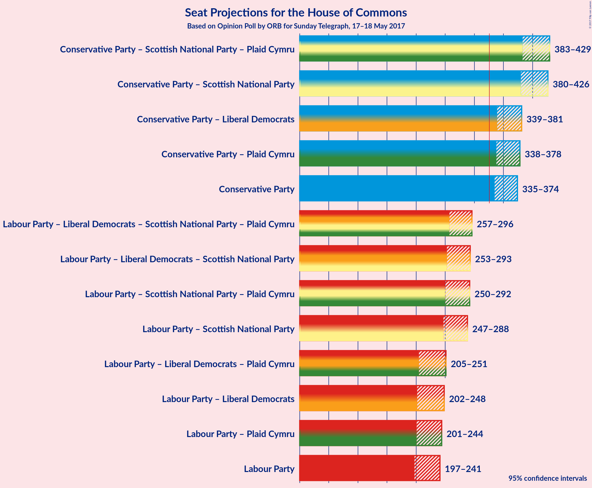

# Opinion Poll by ORB for Sunday Telegraph, 17–18 May 2017

<a href="#voting-intentions">Voting Intentions</a> | <a href="#seats">Seats</a> | <a href="#coalitions">Coalitions</a> | <a href="#technical-information">Technical Information</a>

## Voting Intentions

### Confidence Intervals

| Party | Last Result | Poll Result | 80% Confidence Interval | 90% Confidence Interval | 95% Confidence Interval | 99% Confidence Interval |
|:-----:|:-----------:|:-----------:|:-----------------------:|:-----------------------:|:-----------------------:|:-----------------------:|
| Conservative Party | 37.8% | 46.6% | N/A |N/A |N/A |N/A |
| Labour Party | 31.2% | 34.4% | N/A |N/A |N/A |N/A |
| Liberal Democrats | 8.1% | 7.5% | N/A |N/A |N/A |N/A |
| UK Independence Party | 12.9% | 6.7% | N/A |N/A |N/A |N/A |
| Scottish National Party | 4.9% | 4.2% | N/A |N/A |N/A |N/A |
| Plaid Cymru | 0.6% | 0.6% | N/A |N/A |N/A |N/A |

*Note:* The poll result column reflects the actual value used in the calculations. Published results may vary slightly, and in addition be rounded to fewer digits.

## Seats

### Confidence Intervals

| Party | Last Result | 80% Confidence Interval | 90% Confidence Interval | 95% Confidence Interval | 99% Confidence Interval |
|:-----:|:-----------:|:-----------------------:|:-----------------------:|:-----------------------:|:-----------------------:|
| <a href="#conservative-party">Conservative Party</a> | 331 | N/A |N/A |N/A |N/A |
| <a href="#labour-party">Labour Party</a> | 232 | N/A |N/A |N/A |N/A |
| <a href="#liberal-democrats">Liberal Democrats</a> | 8 | N/A |N/A |N/A |N/A |
| <a href="#uk-independence-party">UK Independence Party</a> | 1 | N/A |N/A |N/A |N/A |
| <a href="#scottish-national-party">Scottish National Party</a> | 56 | N/A |N/A |N/A |N/A |
| <a href="#plaid-cymru">Plaid Cymru</a> | 3 | N/A |N/A |N/A |N/A |

## Coalitions

## Technical Information

### Opinion Poll

+ **Pollster:** ORB
+ **Media:** Sunday Telegraph
+ **Fieldwork period:** 17–18 May 2017

### Calculations

+ **Sample size:** 1516
+ **Simulations done:** 0
+ **Error estimate:** 100.00%

