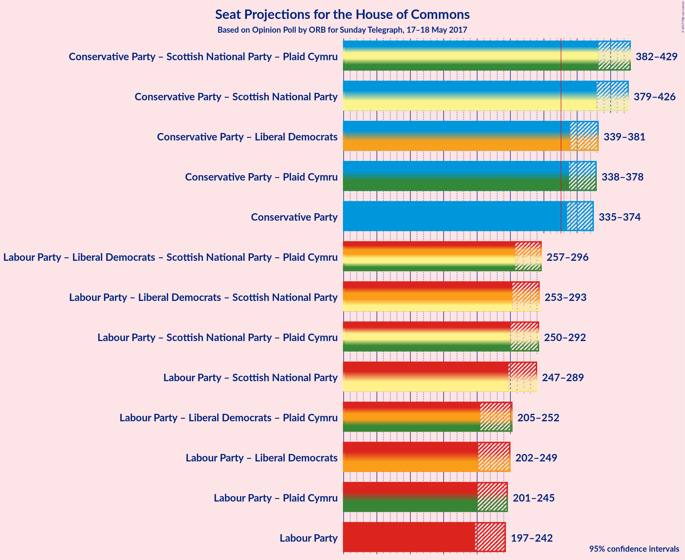

# Opinion Poll by ORB for Sunday Telegraph, 17–18 May 2017

<a href="#voting-intentions">Voting Intentions</a> | <a href="#seats">Seats</a> | <a href="#coalitions">Coalitions</a> | <a href="#technical-information">Technical Information</a>

## Voting Intentions

### Confidence Intervals

| Party | Last Result | Poll Result | 80% Confidence Interval | 90% Confidence Interval | 95% Confidence Interval | 99% Confidence Interval |
|:-----:|:-----------:|:-----------:|:-----------------------:|:-----------------------:|:-----------------------:|:-----------------------:|
| Conservative Party | 36.9% | 46.6% | 43.9–47.2% |43.5–47.6% |43.1–48.0% |42.3–48.8% |
| Labour Party | 30.4% | 34.4% | 32.1–35.2% |31.7–35.7% |31.3–36.0% |30.6–36.8% |
| Liberal Democrats | 7.9% | 7.5% | 6.6–8.3% |6.3–8.5% |6.1–8.8% |5.8–9.2% |
| UK Independence Party | 12.6% | 6.7% | 5.8–7.4% |5.6–7.6% |5.4–7.8% |5.0–8.3% |
| Scottish National Party | 4.7% | 4.2% | 3.5–4.8% |3.3–5.0% |3.2–5.2% |2.9–5.5% |
| Plaid Cymru | 0.6% | 0.6% | 0.4–0.9% |0.3–1.0% |0.3–1.1% |0.2–1.3% |

*Note:* The poll result column reflects the actual value used in the calculations. Published results may vary slightly, and in addition be rounded to fewer digits.

## Seats

### Confidence Intervals

| Party | Last Result | 80% Confidence Interval | 90% Confidence Interval | 95% Confidence Interval | 99% Confidence Interval |
|:-----:|:-----------:|:-----------------------:|:-----------------------:|:-----------------------:|:-----------------------:|
| <a href="#conservative-party">Conservative Party</a> | 331 | 343–367 |339–371 |335–374 |327–381 |
| <a href="#labour-party">Labour Party</a> | 232 | 204–231 |201–237 |197–242 |191–253 |
| <a href="#liberal-democrats">Liberal Democrats</a> | 8 | 2–9 |1–11 |1–12 |0–14 |
| <a href="#uk-independence-party">UK Independence Party</a> | 1 | 0 |0 |0 |0 |
| <a href="#scottish-national-party">Scottish National Party</a> | 56 | 42–56 |35–56 |30–56 |19–56 |
| <a href="#plaid-cymru">Plaid Cymru</a> | 3 | 0–5 |0–5 |0–5 |0–7 |

### Conservative Party

| Number of Seats | Probability | Accumulated |
|:---------------:|:-----------:|:-----------:|
| 321 | 0% | 100% |
| 322 | 0.1% | 99.9% |
| 323 | 0.1% | 99.9% |
| 324 | 0.1% | 99.8% |
| 325 | 0.1% | 99.7% |
| 326 | 0.1% | 99.7% |
| 327 | 0.1% | 99.6% |
| 328 | 0.1% | 99.5% |
| 329 | 0.2% | 99.4% |
| 330 | 0.2% | 99.2% |
| 331 | 0.3% | 99.0% |
| 332 | 0.3% | 98.8% |
| 333 | 0.3% | 98% |
| 334 | 0.5% | 98% |
| 335 | 0.3% | 98% |
| 336 | 0.6% | 97% |
| 337 | 0.8% | 97% |
| 338 | 0.7% | 96% |
| 339 | 0.6% | 95% |
| 340 | 0.9% | 95% |
| 341 | 1.3% | 94% |
| 342 | 2% | 93% |
| 343 | 0.9% | 91% |
| 344 | 1.3% | 90% |
| 345 | 1.3% | 89% |
| 346 | 2% | 87% |
| 347 | 2% | 86% |
| 348 | 3% | 83% |
| 349 | 4% | 80% |
| 350 | 8% | 76% |
| 351 | 5% | 68% |
| 352 | 7% | 63% |
| 353 | 4% | 56% |
| 354 | 7% | 52% |
| 355 | 4% | 45% |
| 356 | 5% | 41% |
| 357 | 3% | 36% |
| 358 | 4% | 32% |
| 359 | 4% | 28% |
| 360 | 2% | 25% |
| 361 | 2% | 23% |
| 362 | 1.5% | 21% |
| 363 | 1.2% | 20% |
| 364 | 2% | 19% |
| 365 | 2% | 17% |
| 366 | 3% | 15% |
| 367 | 2% | 12% |
| 368 | 2% | 10% |
| 369 | 2% | 8% |
| 370 | 1.1% | 6% |
| 371 | 0.9% | 5% |
| 372 | 0.9% | 4% |
| 373 | 0.6% | 3% |
| 374 | 0.4% | 3% |
| 375 | 0.6% | 2% |
| 376 | 0.3% | 2% |
| 377 | 0.4% | 2% |
| 378 | 0.2% | 1.2% |
| 379 | 0.3% | 1.0% |
| 380 | 0.2% | 0.8% |
| 381 | 0.2% | 0.6% |
| 382 | 0.1% | 0.5% |
| 383 | 0.1% | 0.3% |
| 384 | 0.1% | 0.2% |
| 385 | 0% | 0.2% |
| 386 | 0% | 0.1% |
| 387 | 0% | 0.1% |
| 388 | 0% | 0% |

### Labour Party

| Number of Seats | Probability | Accumulated |
|:---------------:|:-----------:|:-----------:|
| 185 | 0% | 100% |
| 186 | 0.1% | 99.9% |
| 187 | 0.1% | 99.9% |
| 188 | 0.1% | 99.8% |
| 189 | 0.1% | 99.7% |
| 190 | 0.1% | 99.6% |
| 191 | 0.2% | 99.5% |
| 192 | 0.2% | 99.3% |
| 193 | 0.1% | 99.1% |
| 194 | 0.2% | 98.9% |
| 195 | 0.4% | 98.7% |
| 196 | 0.3% | 98% |
| 197 | 0.7% | 98% |
| 198 | 0.3% | 97% |
| 199 | 0.6% | 97% |
| 200 | 0.8% | 96% |
| 201 | 1.2% | 96% |
| 202 | 2% | 94% |
| 203 | 2% | 93% |
| 204 | 2% | 91% |
| 205 | 2% | 89% |
| 206 | 2% | 86% |
| 207 | 2% | 84% |
| 208 | 0.7% | 82% |
| 209 | 1.3% | 82% |
| 210 | 1.1% | 80% |
| 211 | 2% | 79% |
| 212 | 3% | 78% |
| 213 | 3% | 75% |
| 214 | 5% | 72% |
| 215 | 4% | 68% |
| 216 | 3% | 64% |
| 217 | 5% | 61% |
| 218 | 4% | 56% |
| 219 | 7% | 52% |
| 220 | 4% | 44% |
| 221 | 7% | 40% |
| 222 | 4% | 34% |
| 223 | 5% | 30% |
| 224 | 3% | 25% |
| 225 | 3% | 22% |
| 226 | 2% | 19% |
| 227 | 2% | 18% |
| 228 | 2% | 15% |
| 229 | 1.2% | 14% |
| 230 | 1.4% | 13% |
| 231 | 2% | 11% |
| 232 | 1.1% | 10% |
| 233 | 0.7% | 9% |
| 234 | 0.6% | 8% |
| 235 | 1.3% | 7% |
| 236 | 0.8% | 6% |
| 237 | 0.9% | 5% |
| 238 | 0.4% | 4% |
| 239 | 0.4% | 4% |
| 240 | 0.6% | 4% |
| 241 | 0.5% | 3% |
| 242 | 0.2% | 3% |
| 243 | 0.3% | 2% |
| 244 | 0.3% | 2% |
| 245 | 0.2% | 2% |
| 246 | 0.3% | 2% |
| 247 | 0.1% | 1.3% |
| 248 | 0.1% | 1.1% |
| 249 | 0.1% | 1.0% |
| 250 | 0.1% | 0.9% |
| 251 | 0.1% | 0.8% |
| 252 | 0.1% | 0.7% |
| 253 | 0.1% | 0.6% |
| 254 | 0.1% | 0.5% |
| 255 | 0.1% | 0.4% |
| 256 | 0% | 0.3% |
| 257 | 0% | 0.3% |
| 258 | 0% | 0.2% |
| 259 | 0% | 0.2% |
| 260 | 0% | 0.2% |
| 261 | 0% | 0.2% |
| 262 | 0% | 0.1% |
| 263 | 0% | 0.1% |
| 264 | 0% | 0.1% |
| 265 | 0% | 0.1% |
| 266 | 0% | 0.1% |
| 267 | 0% | 0.1% |
| 268 | 0% | 0.1% |
| 269 | 0% | 0% |

### Liberal Democrats

| Number of Seats | Probability | Accumulated |
|:---------------:|:-----------:|:-----------:|
| 0 | 2% | 100% |
| 1 | 6% | 98% |
| 2 | 13% | 92% |
| 3 | 13% | 79% |
| 4 | 14% | 65% |
| 5 | 13% | 52% |
| 6 | 12% | 39% |
| 7 | 9% | 27% |
| 8 | 6% | 17% |
| 9 | 3% | 12% |
| 10 | 3% | 9% |
| 11 | 3% | 6% |
| 12 | 1.2% | 3% |
| 13 | 0.6% | 2% |
| 14 | 0.8% | 1.3% |
| 15 | 0.2% | 0.5% |
| 16 | 0.1% | 0.2% |
| 17 | 0.1% | 0.2% |
| 18 | 0% | 0% |

### UK Independence Party

| Number of Seats | Probability | Accumulated |
|:---------------:|:-----------:|:-----------:|
| 0 | 100% | 100% |
| 1 | 0% | 0% |

### Scottish National Party

| Number of Seats | Probability | Accumulated |
|:---------------:|:-----------:|:-----------:|
| 5 | 0% | 100% |
| 6 | 0% | 99.9% |
| 7 | 0% | 99.9% |
| 8 | 0% | 99.9% |
| 9 | 0% | 99.9% |
| 10 | 0% | 99.8% |
| 11 | 0% | 99.8% |
| 12 | 0% | 99.8% |
| 13 | 0% | 99.8% |
| 14 | 0% | 99.7% |
| 15 | 0% | 99.7% |
| 16 | 0% | 99.7% |
| 17 | 0% | 99.6% |
| 18 | 0.1% | 99.6% |
| 19 | 0.2% | 99.5% |
| 20 | 0.2% | 99.4% |
| 21 | 0% | 99.2% |
| 22 | 0% | 99.1% |
| 23 | 0.1% | 99.1% |
| 24 | 0.3% | 99.0% |
| 25 | 0.4% | 98.7% |
| 26 | 0.2% | 98% |
| 27 | 0.2% | 98% |
| 28 | 0.2% | 98% |
| 29 | 0.2% | 98% |
| 30 | 0.3% | 98% |
| 31 | 0.4% | 97% |
| 32 | 0.1% | 97% |
| 33 | 0% | 97% |
| 34 | 1.0% | 97% |
| 35 | 0.9% | 96% |
| 36 | 0.5% | 95% |
| 37 | 0.4% | 94% |
| 38 | 0.2% | 94% |
| 39 | 0.4% | 94% |
| 40 | 1.1% | 93% |
| 41 | 1.3% | 92% |
| 42 | 2% | 91% |
| 43 | 1.2% | 89% |
| 44 | 2% | 87% |
| 45 | 5% | 86% |
| 46 | 5% | 81% |
| 47 | 5% | 77% |
| 48 | 5% | 72% |
| 49 | 3% | 67% |
| 50 | 5% | 63% |
| 51 | 6% | 58% |
| 52 | 8% | 53% |
| 53 | 7% | 45% |
| 54 | 11% | 38% |
| 55 | 17% | 27% |
| 56 | 10% | 11% |
| 57 | 0.2% | 0.3% |
| 58 | 0.1% | 0.1% |
| 59 | 0% | 0% |

### Plaid Cymru

| Number of Seats | Probability | Accumulated |
|:---------------:|:-----------:|:-----------:|
| 0 | 11% | 100% |
| 1 | 2% | 89% |
| 2 | 5% | 87% |
| 3 | 40% | 82% |
| 4 | 13% | 43% |
| 5 | 28% | 30% |
| 6 | 0.5% | 1.4% |
| 7 | 0.9% | 0.9% |
| 8 | 0% | 0% |

## Coalitions

### Confidence Intervals

| Coalition | Last Result | 80% Confidence Interval | 90% Confidence Interval | 95% Confidence Interval | 99% Confidence Interval |
|:---------:|:-----------:|:-----------------------:|:-----------------------:|:-----------------------:|:-----------------------:|
| Conservative Party – Scottish National Party – Plaid Cymru | 390 | 394–422 | 388–426 | 382–429 | 370–436 |
| Conservative Party – Scottish National Party | 387 | 391–419 | 385–422 | 379–426 | 366–432 |
| Conservative Party – Liberal Democrats | 339 | 348–373 | 343–377 | 339–381 | 332–387 |
| Conservative Party – Plaid Cymru | 334 | 347–371 | 342–375 | 338–378 | 331–385 |
| Conservative Party | 331 | 343–367 | 339–371 | 335–374 | 327–381 |
| Labour Party – Liberal Democrats – Scottish National Party – Plaid Cymru | 299 | 264–288 | 260–292 | 257–296 | 250–304 |
| Labour Party – Liberal Democrats – Scottish National Party | 296 | 260–284 | 256–289 | 253–293 | 246–300 |
| Labour Party – Scottish National Party – Plaid Cymru | 291 | 258–283 | 254–288 | 250–292 | 244–299 |
| Labour Party – Scottish National Party | 288 | 254–280 | 251–284 | 247–289 | 240–296 |
| Labour Party – Liberal Democrats – Plaid Cymru | 243 | 212–240 | 209–246 | 205–252 | 199–265 |
| Labour Party – Liberal Democrats | 240 | 209–237 | 205–243 | 202–249 | 195–261 |
| Labour Party – Plaid Cymru | 235 | 207–235 | 204–240 | 201–245 | 194–257 |
| Labour Party | 232 | 204–231 | 201–237 | 197–242 | 191–253 |

## Technical Information

### Opinion Poll

+ **Pollster:** ORB
+ **Media:** Sunday Telegraph
+ **Fieldwork period:** 17–18 May 2017

### Calculations

+ **Sample size:** 1516
+ **Simulations done:** 1,048,576
+ **Error estimate:** 0.78%

