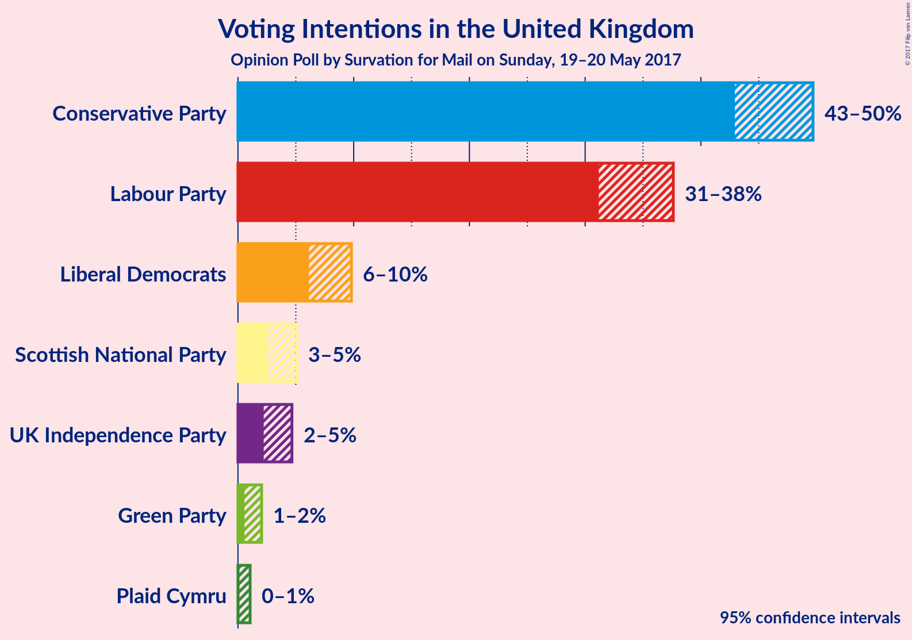
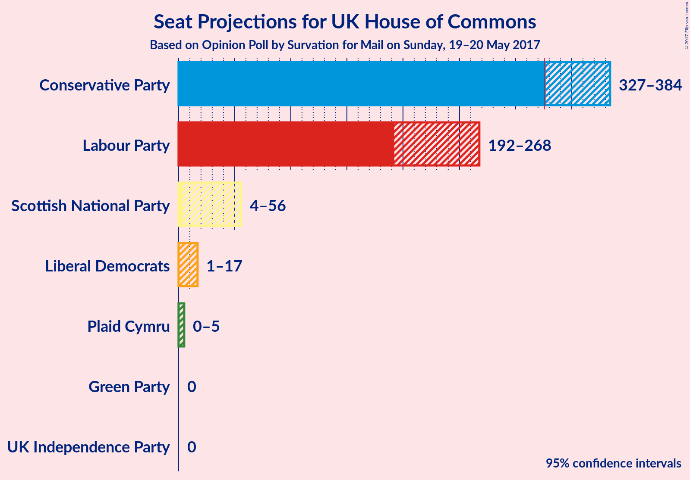
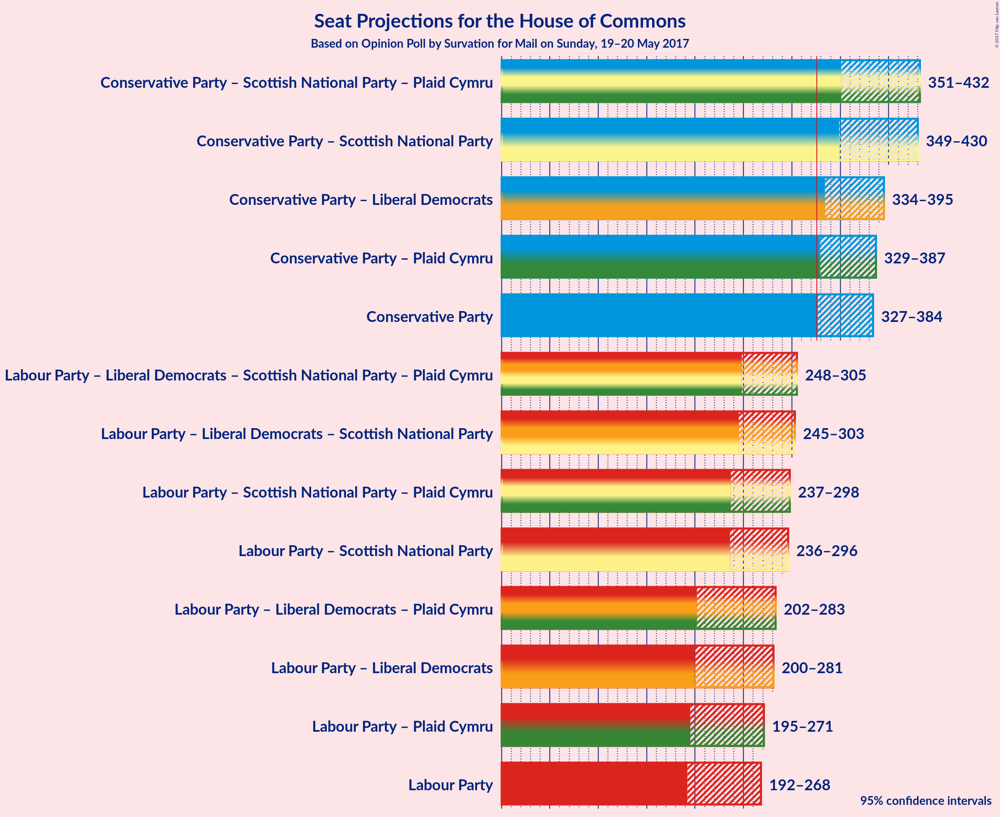

# Opinion Poll by Survation for Mail on Sunday, 19–20 May 2017

<a href="#voting-intentions">Voting Intentions</a> | <a href="#seats">Seats</a> | <a href="#coalitions">Coalitions</a> | <a href="#technical-information">Technical Information</a>

## Voting Intentions

### Confidence Intervals

| Party | Last Result | Poll Result | 80% Confidence Interval | 90% Confidence Interval | 95% Confidence Interval | 99% Confidence Interval |
|:-----:|:-----------:|:-----------:|:-----------------------:|:-----------------------:|:-----------------------:|:-----------------------:|
| Conservative Party | 37.8% | 47.9% | 44.1–48.5% |43.5–49.1% |42.9–49.7% |41.9–50.8% |
| Labour Party | 31.2% | 35.5% | 32.3–36.5% |31.7–37.1% |31.2–37.6% |30.2–38.7% |
| Liberal Democrats | 8.1% | 8.0% | 6.7–9.1% |6.4–9.5% |6.1–9.8% |5.7–10.5% |
| Scottish National Party | 4.9% | 3.7% | 2.9–4.6% |2.7–4.8% |2.5–5.1% |2.2–5.6% |
| UK Independence Party | 12.9% | 3.3% | 2.6–4.2% |2.4–4.4% |2.2–4.7% |2.0–5.2% |
| Green Party | 3.8% | 1.1% | 0.7–1.7% |0.6–1.9% |0.6–2.0% |0.4–2.4% |
| Plaid Cymru | 0.6% | 0.4% | 0.2–0.8% |0.2–0.9% |0.1–1.1% |0.1–1.3% |

*Note:* The poll result column reflects the actual value used in the calculations. Published results may vary slightly, and in addition be rounded to fewer digits.

## Seats

### Confidence Intervals

| Party | Last Result | 80% Confidence Interval | 90% Confidence Interval | 95% Confidence Interval | 99% Confidence Interval |
|:-----:|:-----------:|:-----------------------:|:-----------------------:|:-----------------------:|:-----------------------:|
| <a href="#conservative-party">Conservative Party</a> | 331 | 339–379 |330–380 |326–383 |320–395 |
| <a href="#labour-party">Labour Party</a> | 232 | 198–254 |193–259 |191–264 |186–275 |
| <a href="#liberal-democrats">Liberal Democrats</a> | 8 | 2–14 |2–17 |1–17 |1–23 |
| <a href="#scottish-national-party">Scottish National Party</a> | 56 | 6–55 |3–55 |3–56 |2–57 |
| <a href="#uk-independence-party">UK Independence Party</a> | 1 | 0 |0 |0 |0 |
| <a href="#green-party">Green Party</a> | 1 | 0 |0 |0 |0 |
| <a href="#plaid-cymru">Plaid Cymru</a> | 3 | 0–5 |0–5 |0–5 |0–7 |

### Conservative Party

| Number of Seats | Probability | Accumulated |
|:---------------:|:-----------:|:-----------:|
| 314 | 0.1% | 100% |
| 315 | 0% | 99.9% |
| 316 | 0% | 99.9% |
| 317 | 0.1% | 99.8% |
| 318 | 0.1% | 99.8% |
| 319 | 0.1% | 99.7% |
| 320 | 0.5% | 99.6% |
| 321 | 0% | 99.1% |
| 322 | 0.1% | 99.1% |
| 323 | 0.6% | 99.0% |
| 324 | 0% | 98% |
| 325 | 0.4% | 98% |
| 326 | 0.6% | 98% |
| 327 | 0.2% | 97% |
| 328 | 0% | 97% |
| 329 | 2% | 97% |
| 330 | 0.3% | 95% |
| 331 | 0.3% | 95% |
| 332 | 1.4% | 95% |
| 333 | 0.1% | 93% |
| 334 | 0.1% | 93% |
| 335 | 0.1% | 93% |
| 336 | 0% | 93% |
| 337 | 0.5% | 93% |
| 338 | 0.2% | 92% |
| 339 | 3% | 92% |
| 340 | 0.9% | 89% |
| 341 | 1.0% | 88% |
| 342 | 5% | 87% |
| 343 | 1.0% | 82% |
| 344 | 7% | 81% |
| 345 | 0.1% | 75% |
| 346 | 0.6% | 75% |
| 347 | 5% | 74% |
| 348 | 0.2% | 69% |
| 349 | 1.1% | 69% |
| 350 | 8% | 68% |
| 351 | 0.1% | 60% |
| 352 | 3% | 60% |
| 353 | 3% | 57% |
| 354 | 1.1% | 54% |
| 355 | 3% | 53% |
| 356 | 0.3% | 50% |
| 357 | 2% | 49% |
| 358 | 0.3% | 48% |
| 359 | 7% | 47% |
| 360 | 0.6% | 40% |
| 361 | 4% | 39% |
| 362 | 4% | 35% |
| 363 | 0.4% | 32% |
| 364 | 4% | 31% |
| 365 | 0.2% | 27% |
| 366 | 0% | 27% |
| 367 | 4% | 27% |
| 368 | 0.3% | 22% |
| 369 | 4% | 22% |
| 370 | 0.3% | 18% |
| 371 | 2% | 18% |
| 372 | 0.1% | 16% |
| 373 | 0.8% | 15% |
| 374 | 3% | 15% |
| 375 | 0.1% | 12% |
| 376 | 2% | 12% |
| 377 | 0.1% | 10% |
| 378 | 0% | 10% |
| 379 | 5% | 10% |
| 380 | 2% | 5% |
| 381 | 0.5% | 4% |
| 382 | 0.1% | 3% |
| 383 | 0.5% | 3% |
| 384 | 0% | 2% |
| 385 | 0.8% | 2% |
| 386 | 0.2% | 2% |
| 387 | 0.2% | 2% |
| 388 | 0% | 1.3% |
| 389 | 0.1% | 1.3% |
| 390 | 0% | 1.2% |
| 391 | 0% | 1.1% |
| 392 | 0% | 1.1% |
| 393 | 0% | 1.1% |
| 394 | 0.5% | 1.1% |
| 395 | 0.1% | 0.6% |
| 396 | 0% | 0.5% |
| 397 | 0.3% | 0.4% |
| 398 | 0% | 0.2% |
| 399 | 0.1% | 0.1% |
| 400 | 0% | 0% |

### Labour Party

| Number of Seats | Probability | Accumulated |
|:---------------:|:-----------:|:-----------:|
| 178 | 0% | 100% |
| 179 | 0% | 99.9% |
| 180 | 0% | 99.9% |
| 181 | 0% | 99.9% |
| 182 | 0% | 99.9% |
| 183 | 0.1% | 99.9% |
| 184 | 0.1% | 99.8% |
| 185 | 0.2% | 99.8% |
| 186 | 0% | 99.5% |
| 187 | 0.3% | 99.5% |
| 188 | 0.2% | 99.2% |
| 189 | 0.1% | 99.0% |
| 190 | 0.1% | 98.9% |
| 191 | 2% | 98.8% |
| 192 | 0.4% | 97% |
| 193 | 2% | 97% |
| 194 | 0% | 95% |
| 195 | 0.2% | 95% |
| 196 | 0.1% | 95% |
| 197 | 0.1% | 95% |
| 198 | 5% | 94% |
| 199 | 0.2% | 90% |
| 200 | 0% | 89% |
| 201 | 0.2% | 89% |
| 202 | 0.2% | 89% |
| 203 | 0.2% | 89% |
| 204 | 3% | 89% |
| 205 | 0.6% | 86% |
| 206 | 0.2% | 85% |
| 207 | 2% | 85% |
| 208 | 0.1% | 83% |
| 209 | 0.1% | 83% |
| 210 | 0.2% | 83% |
| 211 | 4% | 83% |
| 212 | 4% | 79% |
| 213 | 0.6% | 75% |
| 214 | 2% | 74% |
| 215 | 2% | 73% |
| 216 | 0.2% | 70% |
| 217 | 0.5% | 70% |
| 218 | 0.9% | 70% |
| 219 | 0.1% | 69% |
| 220 | 8% | 69% |
| 221 | 3% | 61% |
| 222 | 0% | 57% |
| 223 | 2% | 57% |
| 224 | 0.1% | 55% |
| 225 | 5% | 55% |
| 226 | 6% | 50% |
| 227 | 0.1% | 44% |
| 228 | 3% | 44% |
| 229 | 0.1% | 41% |
| 230 | 0% | 40% |
| 231 | 1.0% | 40% |
| 232 | 1.2% | 39% |
| 233 | 1.1% | 38% |
| 234 | 3% | 37% |
| 235 | 0% | 34% |
| 236 | 0.1% | 34% |
| 237 | 3% | 34% |
| 238 | 1.2% | 31% |
| 239 | 0.3% | 30% |
| 240 | 0.6% | 30% |
| 241 | 0.1% | 29% |
| 242 | 6% | 29% |
| 243 | 1.1% | 24% |
| 244 | 0.3% | 22% |
| 245 | 0% | 22% |
| 246 | 2% | 22% |
| 247 | 2% | 20% |
| 248 | 0.6% | 19% |
| 249 | 0.4% | 18% |
| 250 | 5% | 18% |
| 251 | 0.4% | 13% |
| 252 | 1.1% | 13% |
| 253 | 1.4% | 12% |
| 254 | 0.4% | 10% |
| 255 | 0.1% | 10% |
| 256 | 0.1% | 10% |
| 257 | 0.2% | 10% |
| 258 | 4% | 9% |
| 259 | 0.2% | 5% |
| 260 | 0% | 5% |
| 261 | 0.2% | 5% |
| 262 | 0% | 5% |
| 263 | 2% | 5% |
| 264 | 0% | 3% |
| 265 | 0% | 2% |
| 266 | 0% | 2% |
| 267 | 0.3% | 2% |
| 268 | 0.8% | 2% |
| 269 | 0.1% | 1.4% |
| 270 | 0% | 1.4% |
| 271 | 0.2% | 1.3% |
| 272 | 0% | 1.1% |
| 273 | 0% | 1.1% |
| 274 | 0.5% | 1.1% |
| 275 | 0.1% | 0.6% |
| 276 | 0% | 0.5% |
| 277 | 0.1% | 0.5% |
| 278 | 0% | 0.4% |
| 279 | 0% | 0.4% |
| 280 | 0% | 0.4% |
| 281 | 0% | 0.4% |
| 282 | 0% | 0.4% |
| 283 | 0% | 0.4% |
| 284 | 0.1% | 0.4% |
| 285 | 0% | 0.2% |
| 286 | 0.1% | 0.2% |
| 287 | 0% | 0.1% |
| 288 | 0% | 0.1% |
| 289 | 0% | 0.1% |
| 290 | 0% | 0.1% |
| 291 | 0% | 0.1% |
| 292 | 0% | 0.1% |
| 293 | 0% | 0% |

### Liberal Democrats

| Number of Seats | Probability | Accumulated |
|:---------------:|:-----------:|:-----------:|
| 0 | 0.2% | 100% |
| 1 | 5% | 99.8% |
| 2 | 10% | 95% |
| 3 | 7% | 86% |
| 4 | 7% | 78% |
| 5 | 9% | 71% |
| 6 | 9% | 63% |
| 7 | 2% | 53% |
| 8 | 0.6% | 51% |
| 9 | 5% | 51% |
| 10 | 1.1% | 45% |
| 11 | 6% | 44% |
| 12 | 16% | 38% |
| 13 | 5% | 22% |
| 14 | 9% | 17% |
| 15 | 0.9% | 9% |
| 16 | 0.5% | 8% |
| 17 | 6% | 7% |
| 18 | 0.2% | 1.5% |
| 19 | 0.5% | 1.3% |
| 20 | 0.1% | 0.8% |
| 21 | 0.1% | 0.8% |
| 22 | 0.1% | 0.7% |
| 23 | 0.5% | 0.6% |
| 24 | 0.1% | 0.1% |
| 25 | 0% | 0.1% |
| 26 | 0% | 0.1% |
| 27 | 0% | 0% |

### Scottish National Party

| Number of Seats | Probability | Accumulated |
|:---------------:|:-----------:|:-----------:|
| 0 | 0.1% | 100% |
| 1 | 0.1% | 99.9% |
| 2 | 0.7% | 99.8% |
| 3 | 4% | 99.1% |
| 4 | 0% | 95% |
| 5 | 4% | 95% |
| 6 | 2% | 91% |
| 7 | 0.5% | 90% |
| 8 | 0.3% | 89% |
| 9 | 1.3% | 89% |
| 10 | 2% | 87% |
| 11 | 0.9% | 85% |
| 12 | 0.1% | 84% |
| 13 | 0.1% | 84% |
| 14 | 0% | 84% |
| 15 | 0% | 84% |
| 16 | 0% | 84% |
| 17 | 0% | 84% |
| 18 | 1.3% | 84% |
| 19 | 0.2% | 83% |
| 20 | 1.1% | 83% |
| 21 | 0.5% | 82% |
| 22 | 3% | 81% |
| 23 | 3% | 79% |
| 24 | 1.4% | 76% |
| 25 | 0.1% | 75% |
| 26 | 0.4% | 75% |
| 27 | 0.2% | 74% |
| 28 | 1.0% | 74% |
| 29 | 0.7% | 73% |
| 30 | 0.2% | 72% |
| 31 | 0.5% | 72% |
| 32 | 8% | 71% |
| 33 | 0.1% | 63% |
| 34 | 0.1% | 63% |
| 35 | 0.2% | 63% |
| 36 | 0.7% | 63% |
| 37 | 0.9% | 62% |
| 38 | 0% | 62% |
| 39 | 0.1% | 62% |
| 40 | 1.0% | 61% |
| 41 | 1.0% | 60% |
| 42 | 0.2% | 59% |
| 43 | 8% | 59% |
| 44 | 5% | 52% |
| 45 | 0.1% | 47% |
| 46 | 4% | 47% |
| 47 | 5% | 43% |
| 48 | 5% | 38% |
| 49 | 3% | 33% |
| 50 | 0.6% | 30% |
| 51 | 0.2% | 29% |
| 52 | 0.2% | 29% |
| 53 | 4% | 29% |
| 54 | 5% | 25% |
| 55 | 17% | 21% |
| 56 | 3% | 3% |
| 57 | 0.4% | 0.6% |
| 58 | 0.1% | 0.1% |
| 59 | 0% | 0% |

### UK Independence Party

| Number of Seats | Probability | Accumulated |
|:---------------:|:-----------:|:-----------:|
| 0 | 100% | 100% |
| 1 | 0% | 0% |

### Green Party

| Number of Seats | Probability | Accumulated |
|:---------------:|:-----------:|:-----------:|
| 0 | 99.9% | 100% |
| 1 | 0.1% | 0.1% |
| 2 | 0% | 0% |

### Plaid Cymru

| Number of Seats | Probability | Accumulated |
|:---------------:|:-----------:|:-----------:|
| 0 | 41% | 100% |
| 1 | 3% | 59% |
| 2 | 4% | 55% |
| 3 | 33% | 51% |
| 4 | 8% | 18% |
| 5 | 9% | 11% |
| 6 | 0.1% | 2% |
| 7 | 2% | 2% |
| 8 | 0.1% | 0.1% |
| 9 | 0% | 0% |

## Coalitions

### Confidence Intervals

| Coalition | Last Result | 80% Confidence Interval | 90% Confidence Interval | 95% Confidence Interval | 99% Confidence Interval |
|:---------:|:-----------:|:-----------------------:|:-----------------------:|:-----------------------:|:-----------------------:|
| Conservative Party – Scottish National Party – Plaid Cymru | 390 | 367–422 | 362–430 | 360–434 | 347–439 |
| Conservative Party – Scottish National Party | 387 | 367–422 | 360–429 | 357–431 | 347–438 |
| Conservative Party – Liberal Democrats | 339 | 348–389 | 335–391 | 331–392 | 329–407 |
| Conservative Party – Plaid Cymru | 334 | 339–379 | 333–382 | 329–385 | 323–395 |
| Conservative Party | 331 | 339–379 | 330–380 | 326–383 | 320–395 |
| Labour Party – Liberal Democrats – Scottish National Party – Plaid Cymru | 299 | 253–293 | 252–302 | 249–306 | 237–312 |
| Labour Party – Liberal Democrats – Scottish National Party | 296 | 253–293 | 250–299 | 247–303 | 237–309 |
| Labour Party – Scottish National Party – Plaid Cymru | 291 | 243–284 | 241–297 | 240–301 | 225–303 |
| Labour Party – Scottish National Party | 288 | 241–282 | 241–295 | 236–299 | 225–301 |
| Labour Party – Liberal Democrats – Plaid Cymru | 243 | 210–265 | 203–272 | 201–275 | 194–285 |
| Labour Party – Liberal Democrats | 240 | 210–265 | 202–270 | 198–272 | 193–285 |
| Labour Party – Plaid Cymru | 235 | 198–256 | 196–263 | 194–266 | 189–277 |
| Labour Party | 232 | 198–254 | 193–259 | 191–264 | 186–275 |

## Technical Information

### Opinion Poll

+ **Pollster:** Survation
+ **Media:** Mail on Sunday
+ **Fieldwork period:** 19–20 May 2017

### Calculations

+ **Sample size:** 808
+ **Simulations done:** 65,536
+ **Error estimate:** 1.27%

