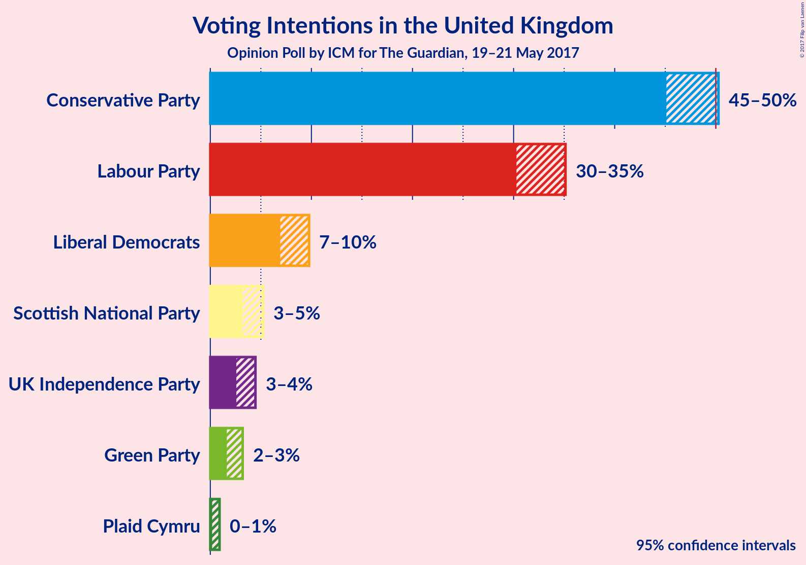
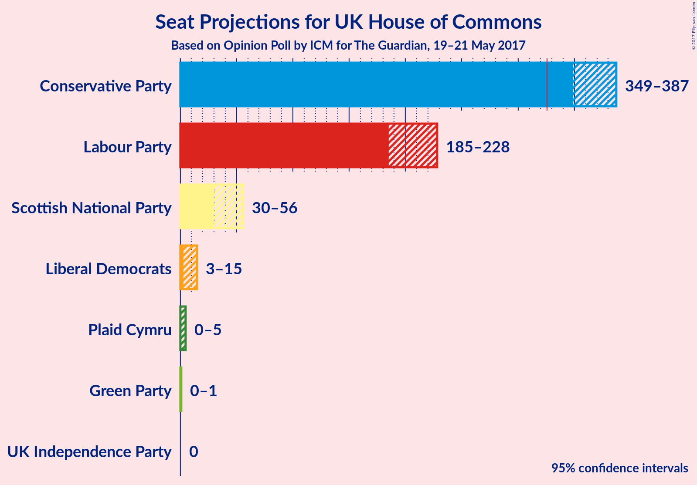
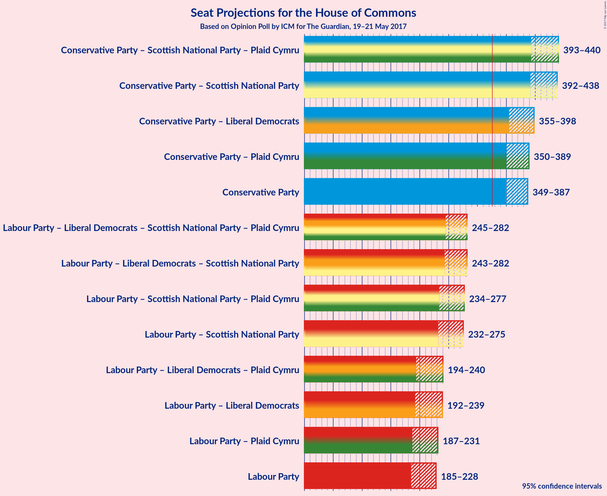

# Opinion Poll by ICM for The Guardian, 19–21 May 2017

<a href="#voting-intentions">Voting Intentions</a> | <a href="#seats">Seats</a> | <a href="#coalitions">Coalitions</a> | <a href="#technical-information">Technical Information</a>

## Voting Intentions

### Confidence Intervals

| Party | Last Result | Poll Result | 80% Confidence Interval | 90% Confidence Interval | 95% Confidence Interval | 99% Confidence Interval |
|:-----:|:-----------:|:-----------:|:-----------------------:|:-----------------------:|:-----------------------:|:-----------------------:|
| Conservative Party | 36.9% | 48.3% | 46.0–49.4% |45.5–49.9% |45.1–50.3% |44.3–51.1% |
| Labour Party | 30.4% | 33.1% | 31.1–34.3% |30.7–34.7% |30.3–35.1% |29.6–35.9% |
| Liberal Democrats | 7.9% | 8.3% | 7.4–9.2% |7.1–9.5% |6.9–9.8% |6.5–10.3% |
| Scottish National Party | 4.7% | 4.1% | 3.5–4.8% |3.3–5.0% |3.2–5.2% |2.9–5.6% |
| UK Independence Party | 12.6% | 3.4% | 2.9–4.1% |2.7–4.3% |2.6–4.5% |2.3–4.8% |
| Green Party | 3.8% | 2.3% | 1.8–2.9% |1.7–3.0% |1.6–3.2% |1.4–3.5% |
| Plaid Cymru | 0.6% | 0.4% | 0.3–0.7% |0.2–0.8% |0.2–0.9% |0.1–1.1% |

*Note:* The poll result column reflects the actual value used in the calculations. Published results may vary slightly, and in addition be rounded to fewer digits.

## Seats

### Confidence Intervals

| Party | Last Result | 80% Confidence Interval | 90% Confidence Interval | 95% Confidence Interval | 99% Confidence Interval |
|:-----:|:-----------:|:-----------------------:|:-----------------------:|:-----------------------:|:-----------------------:|
| <a href="#conservative-party">Conservative Party</a> | 331 | 353–383 |351–385 |349–387 |341–392 |
| <a href="#labour-party">Labour Party</a> | 232 | 190–221 |186–224 |185–228 |180–241 |
| <a href="#liberal-democrats">Liberal Democrats</a> | 8 | 4–13 |4–15 |3–15 |2–17 |
| <a href="#scottish-national-party">Scottish National Party</a> | 56 | 41–55 |36–55 |30–56 |17–56 |
| <a href="#uk-independence-party">UK Independence Party</a> | 1 | 0 |0 |0 |0 |
| <a href="#green-party">Green Party</a> | 1 | 0–1 |0–1 |0–1 |0–1 |
| <a href="#plaid-cymru">Plaid Cymru</a> | 3 | 0–4 |0–5 |0–5 |0–5 |

### Conservative Party

| Number of Seats | Probability | Accumulated |
|:---------------:|:-----------:|:-----------:|
| 332 | 0% | 100% |
| 333 | 0% | 99.9% |
| 334 | 0% | 99.9% |
| 335 | 0% | 99.9% |
| 336 | 0.1% | 99.9% |
| 337 | 0% | 99.8% |
| 338 | 0.1% | 99.8% |
| 339 | 0.1% | 99.7% |
| 340 | 0.1% | 99.6% |
| 341 | 0.2% | 99.6% |
| 342 | 0.1% | 99.4% |
| 343 | 0.2% | 99.3% |
| 344 | 0.2% | 99.2% |
| 345 | 0.3% | 99.0% |
| 346 | 0.1% | 98.7% |
| 347 | 0.5% | 98.6% |
| 348 | 0.5% | 98% |
| 349 | 0.7% | 98% |
| 350 | 2% | 97% |
| 351 | 1.3% | 95% |
| 352 | 2% | 94% |
| 353 | 3% | 92% |
| 354 | 4% | 89% |
| 355 | 4% | 85% |
| 356 | 5% | 82% |
| 357 | 3% | 77% |
| 358 | 1.5% | 74% |
| 359 | 5% | 73% |
| 360 | 2% | 68% |
| 361 | 0.4% | 66% |
| 362 | 2% | 65% |
| 363 | 2% | 64% |
| 364 | 2% | 62% |
| 365 | 4% | 60% |
| 366 | 4% | 56% |
| 367 | 4% | 52% |
| 368 | 4% | 48% |
| 369 | 1.0% | 44% |
| 370 | 2% | 43% |
| 371 | 2% | 41% |
| 372 | 4% | 39% |
| 373 | 4% | 35% |
| 374 | 3% | 31% |
| 375 | 1.4% | 28% |
| 376 | 3% | 27% |
| 377 | 2% | 24% |
| 378 | 2% | 23% |
| 379 | 3% | 21% |
| 380 | 2% | 17% |
| 381 | 3% | 15% |
| 382 | 1.4% | 12% |
| 383 | 3% | 11% |
| 384 | 2% | 7% |
| 385 | 2% | 6% |
| 386 | 0.8% | 4% |
| 387 | 0.8% | 3% |
| 388 | 0.7% | 2% |
| 389 | 0.2% | 2% |
| 390 | 0.3% | 1.3% |
| 391 | 0.3% | 1.0% |
| 392 | 0.1% | 0.6% |
| 393 | 0.1% | 0.5% |
| 394 | 0.1% | 0.4% |
| 395 | 0.1% | 0.3% |
| 396 | 0.1% | 0.2% |
| 397 | 0% | 0.2% |
| 398 | 0% | 0.1% |
| 399 | 0% | 0.1% |
| 400 | 0% | 0.1% |
| 401 | 0% | 0.1% |
| 402 | 0% | 0% |

### Labour Party

| Number of Seats | Probability | Accumulated |
|:---------------:|:-----------:|:-----------:|
| 172 | 0% | 100% |
| 173 | 0% | 99.9% |
| 174 | 0% | 99.9% |
| 175 | 0% | 99.9% |
| 176 | 0% | 99.9% |
| 177 | 0.1% | 99.9% |
| 178 | 0.1% | 99.8% |
| 179 | 0.1% | 99.7% |
| 180 | 0.1% | 99.6% |
| 181 | 0.1% | 99.5% |
| 182 | 0.2% | 99.4% |
| 183 | 0.3% | 99.2% |
| 184 | 0.7% | 98.9% |
| 185 | 1.0% | 98% |
| 186 | 3% | 97% |
| 187 | 1.2% | 95% |
| 188 | 0.8% | 93% |
| 189 | 2% | 93% |
| 190 | 1.3% | 91% |
| 191 | 2% | 90% |
| 192 | 2% | 87% |
| 193 | 2% | 86% |
| 194 | 2% | 83% |
| 195 | 2% | 81% |
| 196 | 2% | 79% |
| 197 | 2% | 76% |
| 198 | 2% | 75% |
| 199 | 3% | 72% |
| 200 | 2% | 69% |
| 201 | 3% | 67% |
| 202 | 6% | 64% |
| 203 | 2% | 59% |
| 204 | 3% | 56% |
| 205 | 4% | 53% |
| 206 | 4% | 49% |
| 207 | 2% | 44% |
| 208 | 2% | 42% |
| 209 | 3% | 40% |
| 210 | 1.4% | 38% |
| 211 | 0.6% | 36% |
| 212 | 5% | 36% |
| 213 | 0.6% | 30% |
| 214 | 3% | 30% |
| 215 | 6% | 27% |
| 216 | 0.9% | 21% |
| 217 | 2% | 20% |
| 218 | 5% | 18% |
| 219 | 1.2% | 13% |
| 220 | 2% | 12% |
| 221 | 1.2% | 10% |
| 222 | 2% | 9% |
| 223 | 0.8% | 7% |
| 224 | 2% | 6% |
| 225 | 0.7% | 5% |
| 226 | 0.5% | 4% |
| 227 | 0.4% | 3% |
| 228 | 0.8% | 3% |
| 229 | 0.1% | 2% |
| 230 | 0.3% | 2% |
| 231 | 0.2% | 2% |
| 232 | 0.1% | 2% |
| 233 | 0.2% | 2% |
| 234 | 0.1% | 1.3% |
| 235 | 0.2% | 1.2% |
| 236 | 0.1% | 1.0% |
| 237 | 0.1% | 0.9% |
| 238 | 0.1% | 0.8% |
| 239 | 0.1% | 0.7% |
| 240 | 0% | 0.6% |
| 241 | 0.2% | 0.5% |
| 242 | 0% | 0.4% |
| 243 | 0.1% | 0.3% |
| 244 | 0% | 0.2% |
| 245 | 0% | 0.2% |
| 246 | 0% | 0.2% |
| 247 | 0% | 0.2% |
| 248 | 0% | 0.2% |
| 249 | 0% | 0.1% |
| 250 | 0% | 0.1% |
| 251 | 0% | 0.1% |
| 252 | 0% | 0.1% |
| 253 | 0% | 0% |

### Liberal Democrats

| Number of Seats | Probability | Accumulated |
|:---------------:|:-----------:|:-----------:|
| 0 | 0.1% | 100% |
| 1 | 0.4% | 99.9% |
| 2 | 1.4% | 99.5% |
| 3 | 3% | 98% |
| 4 | 9% | 95% |
| 5 | 9% | 87% |
| 6 | 13% | 78% |
| 7 | 13% | 65% |
| 8 | 12% | 53% |
| 9 | 8% | 41% |
| 10 | 5% | 33% |
| 11 | 7% | 28% |
| 12 | 7% | 21% |
| 13 | 4% | 14% |
| 14 | 5% | 10% |
| 15 | 3% | 5% |
| 16 | 0.5% | 2% |
| 17 | 2% | 2% |
| 18 | 0.2% | 0.4% |
| 19 | 0.1% | 0.3% |
| 20 | 0.1% | 0.1% |
| 21 | 0% | 0.1% |
| 22 | 0% | 0% |

### Scottish National Party

| Number of Seats | Probability | Accumulated |
|:---------------:|:-----------:|:-----------:|
| 7 | 0% | 100% |
| 8 | 0% | 99.9% |
| 9 | 0% | 99.9% |
| 10 | 0% | 99.9% |
| 11 | 0% | 99.9% |
| 12 | 0% | 99.9% |
| 13 | 0.1% | 99.8% |
| 14 | 0% | 99.7% |
| 15 | 0% | 99.7% |
| 16 | 0.1% | 99.7% |
| 17 | 0.2% | 99.6% |
| 18 | 0% | 99.5% |
| 19 | 0.1% | 99.4% |
| 20 | 0% | 99.4% |
| 21 | 0.1% | 99.3% |
| 22 | 0.2% | 99.3% |
| 23 | 0.3% | 99.1% |
| 24 | 0.1% | 98.8% |
| 25 | 0.1% | 98.7% |
| 26 | 0.2% | 98.7% |
| 27 | 0.2% | 98.5% |
| 28 | 0.3% | 98% |
| 29 | 0.1% | 98% |
| 30 | 0.7% | 98% |
| 31 | 0.3% | 97% |
| 32 | 0.2% | 97% |
| 33 | 0.3% | 97% |
| 34 | 0.2% | 96% |
| 35 | 0.9% | 96% |
| 36 | 0.4% | 95% |
| 37 | 0.3% | 95% |
| 38 | 0.9% | 94% |
| 39 | 1.4% | 94% |
| 40 | 1.3% | 92% |
| 41 | 3% | 91% |
| 42 | 4% | 88% |
| 43 | 4% | 83% |
| 44 | 2% | 79% |
| 45 | 6% | 77% |
| 46 | 4% | 71% |
| 47 | 5% | 68% |
| 48 | 4% | 63% |
| 49 | 5% | 59% |
| 50 | 4% | 53% |
| 51 | 7% | 49% |
| 52 | 4% | 42% |
| 53 | 11% | 38% |
| 54 | 7% | 27% |
| 55 | 16% | 20% |
| 56 | 4% | 4% |
| 57 | 0.2% | 0.3% |
| 58 | 0.1% | 0.1% |
| 59 | 0% | 0% |

### UK Independence Party

| Number of Seats | Probability | Accumulated |
|:---------------:|:-----------:|:-----------:|
| 0 | 100% | 100% |
| 1 | 0% | 0% |

### Green Party

| Number of Seats | Probability | Accumulated |
|:---------------:|:-----------:|:-----------:|
| 0 | 80% | 100% |
| 1 | 20% | 20% |
| 2 | 0% | 0% |

### Plaid Cymru

| Number of Seats | Probability | Accumulated |
|:---------------:|:-----------:|:-----------:|
| 0 | 42% | 100% |
| 1 | 1.2% | 58% |
| 2 | 5% | 57% |
| 3 | 34% | 51% |
| 4 | 12% | 18% |
| 5 | 5% | 6% |
| 6 | 0.1% | 0.3% |
| 7 | 0.2% | 0.2% |
| 8 | 0% | 0% |

## Coalitions

### Confidence Intervals

| Coalition | Last Result | 80% Confidence Interval | 90% Confidence Interval | 95% Confidence Interval | 99% Confidence Interval |
|:---------:|:-----------:|:-----------------------:|:-----------------------:|:-----------------------:|:-----------------------:|
| Conservative Party – Scottish National Party – Plaid Cymru | 390 | 402–434 | 397–437 | 393–440 | 380–444 |
| Conservative Party – Scottish National Party | 387 | 400–432 | 395–435 | 392–438 | 378–442 |
| Conservative Party – Liberal Democrats | 339 | 360–392 | 357–395 | 355–397 | 348–404 |
| Conservative Party – Plaid Cymru | 334 | 356–385 | 352–388 | 350–389 | 342–395 |
| Conservative Party | 331 | 353–383 | 351–385 | 349–387 | 341–392 |
| Labour Party – Liberal Democrats – Scottish National Party – Plaid Cymru | 299 | 249–279 | 247–281 | 245–283 | 239–291 |
| Labour Party – Liberal Democrats – Scottish National Party | 296 | 247–276 | 244–279 | 243–282 | 237–290 |
| Labour Party – Scottish National Party – Plaid Cymru | 291 | 240–272 | 237–275 | 235–277 | 228–284 |
| Labour Party – Scottish National Party | 288 | 239–270 | 235–272 | 232–275 | 226–281 |
| Labour Party – Liberal Democrats – Plaid Cymru | 243 | 200–232 | 197–237 | 194–240 | 190–254 |
| Labour Party – Liberal Democrats | 240 | 198–230 | 195–235 | 192–238 | 188–252 |
| Labour Party – Plaid Cymru | 235 | 192–223 | 189–226 | 187–231 | 183–242 |
| Labour Party | 232 | 190–221 | 186–224 | 185–228 | 180–241 |

## Technical Information

### Opinion Poll

+ **Pollster:** ICM
+ **Media:** The Guardian
+ **Fieldwork period:** 19–21 May 2017

### Calculations

+ **Sample size:** 1427
+ **Simulations done:** 1,048,576
+ **Error estimate:** 0.85%

