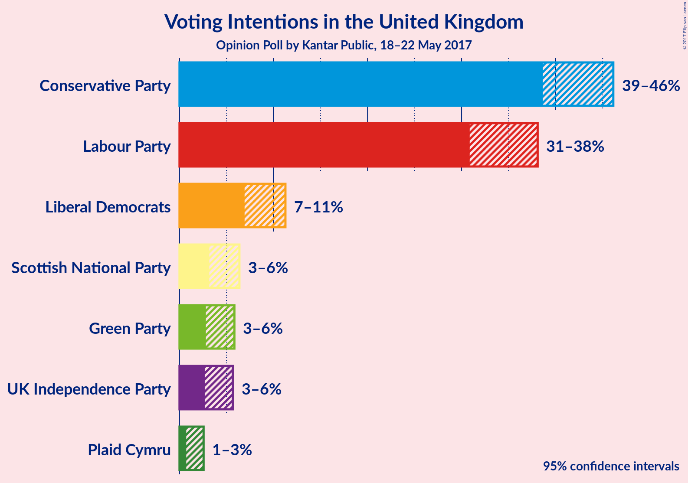
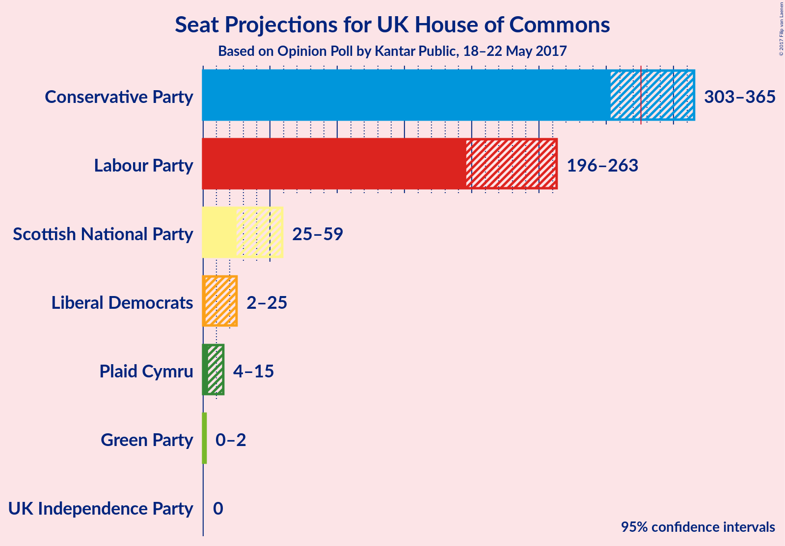
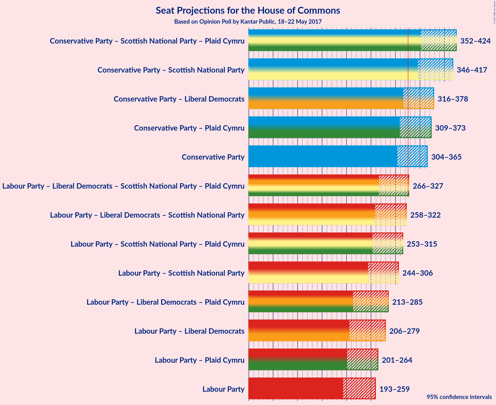

# Opinion Poll by Kantar Public, 18–22 May 2017

<a href="#voting-intentions">Voting Intentions</a> | <a href="#seats">Seats</a> | <a href="#coalitions">Coalitions</a> | <a href="#technical-information">Technical Information</a>

## Voting Intentions

### Confidence Intervals

| Party | Last Result | Poll Result | 80% Confidence Interval | 90% Confidence Interval | 95% Confidence Interval | 99% Confidence Interval |
|:-----:|:-----------:|:-----------:|:-----------------------:|:-----------------------:|:-----------------------:|:-----------------------:|
| Conservative Party | 36.9% | 42.6% | 39.9–44.8% |39.2–45.5% |38.6–46.1% |37.5–47.3% |
| Labour Party | 30.4% | 34.6% | 32.1–36.8% |31.4–37.5% |30.9–38.1% |29.8–39.2% |
| Liberal Democrats | 7.9% | 8.9% | 7.6–10.4% |7.2–10.9% |6.9–11.3% |6.4–12.1% |
| Scottish National Party | 4.7% | 4.5% | 3.6–5.7% |3.4–6.1% |3.2–6.4% |2.8–7.0% |
| Green Party | 3.8% | 4.1% | 3.2–5.2% |3.0–5.5% |2.8–5.8% |2.5–6.4% |
| UK Independence Party | 12.6% | 3.9% | 3.1–5.0% |2.9–5.4% |2.7–5.7% |2.3–6.3% |
| Plaid Cymru | 0.6% | 1.4% | 0.9–2.1% |0.8–2.3% |0.7–2.6% |0.5–3.0% |

*Note:* The poll result column reflects the actual value used in the calculations. Published results may vary slightly, and in addition be rounded to fewer digits.

## Seats

### Confidence Intervals

| Party | Last Result | 80% Confidence Interval | 90% Confidence Interval | 95% Confidence Interval | 99% Confidence Interval |
|:-----:|:-----------:|:-----------------------:|:-----------------------:|:-----------------------:|:-----------------------:|
| <a href="#conservative-party">Conservative Party</a> | 331 | 313–353 |309–359 |303–364 |294–375 |
| <a href="#labour-party">Labour Party</a> | 232 | 209–250 |202–256 |197–263 |186–280 |
| <a href="#liberal-democrats">Liberal Democrats</a> | 8 | 4–20 |2–22 |2–24 |1–30 |
| <a href="#scottish-national-party">Scottish National Party</a> | 56 | 42–57 |33–58 |24–59 |8–59 |
| <a href="#green-party">Green Party</a> | 1 | 1 |1–2 |0–2 |0–2 |
| <a href="#uk-independence-party">UK Independence Party</a> | 1 | 0 |0 |0 |0 |
| <a href="#plaid-cymru">Plaid Cymru</a> | 3 | 5–11 |4–13 |4–15 |3–17 |

### Conservative Party

| Number of Seats | Probability | Accumulated |
|:---------------:|:-----------:|:-----------:|
| 274 | 0% | 100% |
| 275 | 0% | 99.9% |
| 276 | 0% | 99.9% |
| 277 | 0% | 99.9% |
| 278 | 0% | 99.9% |
| 279 | 0% | 99.9% |
| 280 | 0% | 99.9% |
| 281 | 0% | 99.9% |
| 282 | 0% | 99.8% |
| 283 | 0% | 99.8% |
| 284 | 0% | 99.8% |
| 285 | 0% | 99.8% |
| 286 | 0% | 99.8% |
| 287 | 0% | 99.8% |
| 288 | 0% | 99.7% |
| 289 | 0% | 99.7% |
| 290 | 0% | 99.7% |
| 291 | 0% | 99.7% |
| 292 | 0% | 99.6% |
| 293 | 0.1% | 99.6% |
| 294 | 0.1% | 99.6% |
| 295 | 0.1% | 99.5% |
| 296 | 0.1% | 99.4% |
| 297 | 0.2% | 99.3% |
| 298 | 0.2% | 99.1% |
| 299 | 0.2% | 98.9% |
| 300 | 0.3% | 98.8% |
| 301 | 0.3% | 98% |
| 302 | 0.4% | 98% |
| 303 | 0.3% | 98% |
| 304 | 0.2% | 97% |
| 305 | 0.5% | 97% |
| 306 | 0.6% | 97% |
| 307 | 0.5% | 96% |
| 308 | 0.3% | 96% |
| 309 | 0.6% | 95% |
| 310 | 0.8% | 95% |
| 311 | 1.4% | 94% |
| 312 | 2% | 93% |
| 313 | 2% | 91% |
| 314 | 2% | 88% |
| 315 | 2% | 86% |
| 316 | 2% | 85% |
| 317 | 2% | 83% |
| 318 | 2% | 81% |
| 319 | 1.2% | 80% |
| 320 | 1.3% | 78% |
| 321 | 1.0% | 77% |
| 322 | 1.2% | 76% |
| 323 | 1.3% | 75% |
| 324 | 1.1% | 73% |
| 325 | 2% | 72% |
| 326 | 2% | 70% |
| 327 | 2% | 68% |
| 328 | 2% | 66% |
| 329 | 2% | 64% |
| 330 | 4% | 62% |
| 331 | 3% | 59% |
| 332 | 2% | 55% |
| 333 | 3% | 53% |
| 334 | 2% | 50% |
| 335 | 2% | 48% |
| 336 | 3% | 47% |
| 337 | 2% | 44% |
| 338 | 1.3% | 42% |
| 339 | 0.9% | 41% |
| 340 | 0.7% | 40% |
| 341 | 3% | 39% |
| 342 | 2% | 36% |
| 343 | 2% | 35% |
| 344 | 1.1% | 33% |
| 345 | 2% | 32% |
| 346 | 3% | 30% |
| 347 | 7% | 27% |
| 348 | 3% | 20% |
| 349 | 3% | 17% |
| 350 | 2% | 15% |
| 351 | 0.8% | 12% |
| 352 | 0.9% | 11% |
| 353 | 0.8% | 10% |
| 354 | 1.4% | 10% |
| 355 | 1.3% | 8% |
| 356 | 1.0% | 7% |
| 357 | 0.5% | 6% |
| 358 | 0.4% | 6% |
| 359 | 0.3% | 5% |
| 360 | 0.3% | 5% |
| 361 | 0.5% | 5% |
| 362 | 0.3% | 4% |
| 363 | 0.4% | 4% |
| 364 | 0.9% | 3% |
| 365 | 0.5% | 2% |
| 366 | 0.3% | 2% |
| 367 | 0.3% | 2% |
| 368 | 0.2% | 1.4% |
| 369 | 0.1% | 1.3% |
| 370 | 0.2% | 1.1% |
| 371 | 0.1% | 1.0% |
| 372 | 0.1% | 0.9% |
| 373 | 0.1% | 0.8% |
| 374 | 0.1% | 0.7% |
| 375 | 0.1% | 0.6% |
| 376 | 0.1% | 0.5% |
| 377 | 0.1% | 0.4% |
| 378 | 0.1% | 0.3% |
| 379 | 0.1% | 0.3% |
| 380 | 0% | 0.2% |
| 381 | 0.1% | 0.2% |
| 382 | 0% | 0.1% |
| 383 | 0% | 0.1% |
| 384 | 0% | 0% |

### Labour Party

| Number of Seats | Probability | Accumulated |
|:---------------:|:-----------:|:-----------:|
| 177 | 0% | 100% |
| 178 | 0% | 99.9% |
| 179 | 0% | 99.9% |
| 180 | 0.1% | 99.9% |
| 181 | 0% | 99.8% |
| 182 | 0% | 99.8% |
| 183 | 0.1% | 99.8% |
| 184 | 0.1% | 99.7% |
| 185 | 0.1% | 99.6% |
| 186 | 0.1% | 99.5% |
| 187 | 0.1% | 99.4% |
| 188 | 0% | 99.4% |
| 189 | 0.1% | 99.3% |
| 190 | 0.2% | 99.2% |
| 191 | 0.1% | 99.0% |
| 192 | 0.3% | 98.9% |
| 193 | 0.1% | 98.6% |
| 194 | 0.2% | 98% |
| 195 | 0.2% | 98% |
| 196 | 0.4% | 98% |
| 197 | 0.6% | 98% |
| 198 | 0.3% | 97% |
| 199 | 0.3% | 97% |
| 200 | 0.5% | 96% |
| 201 | 0.3% | 96% |
| 202 | 0.5% | 96% |
| 203 | 0.4% | 95% |
| 204 | 0.6% | 95% |
| 205 | 0.5% | 94% |
| 206 | 0.6% | 93% |
| 207 | 1.0% | 93% |
| 208 | 0.8% | 92% |
| 209 | 1.3% | 91% |
| 210 | 3% | 90% |
| 211 | 0.9% | 87% |
| 212 | 1.2% | 86% |
| 213 | 2% | 85% |
| 214 | 4% | 83% |
| 215 | 4% | 79% |
| 216 | 2% | 75% |
| 217 | 2% | 73% |
| 218 | 3% | 71% |
| 219 | 2% | 68% |
| 220 | 2% | 66% |
| 221 | 1.4% | 64% |
| 222 | 2% | 62% |
| 223 | 1.2% | 60% |
| 224 | 2% | 59% |
| 225 | 3% | 57% |
| 226 | 2% | 54% |
| 227 | 3% | 53% |
| 228 | 1.4% | 50% |
| 229 | 2% | 49% |
| 230 | 1.3% | 47% |
| 231 | 4% | 46% |
| 232 | 2% | 42% |
| 233 | 1.3% | 39% |
| 234 | 2% | 38% |
| 235 | 1.0% | 36% |
| 236 | 2% | 35% |
| 237 | 2% | 33% |
| 238 | 2% | 32% |
| 239 | 1.4% | 29% |
| 240 | 3% | 28% |
| 241 | 1.2% | 25% |
| 242 | 1.3% | 24% |
| 243 | 2% | 22% |
| 244 | 3% | 20% |
| 245 | 1.5% | 18% |
| 246 | 3% | 16% |
| 247 | 1.3% | 14% |
| 248 | 1.3% | 12% |
| 249 | 0.9% | 11% |
| 250 | 1.3% | 10% |
| 251 | 0.7% | 9% |
| 252 | 0.8% | 8% |
| 253 | 0.6% | 7% |
| 254 | 1.2% | 7% |
| 255 | 0.4% | 6% |
| 256 | 0.4% | 5% |
| 257 | 0.6% | 5% |
| 258 | 0.2% | 4% |
| 259 | 0.4% | 4% |
| 260 | 0.4% | 4% |
| 261 | 0.4% | 3% |
| 262 | 0.2% | 3% |
| 263 | 0.2% | 3% |
| 264 | 0.2% | 2% |
| 265 | 0.2% | 2% |
| 266 | 0.1% | 2% |
| 267 | 0.2% | 2% |
| 268 | 0.1% | 2% |
| 269 | 0.1% | 1.5% |
| 270 | 0.1% | 1.4% |
| 271 | 0.1% | 1.2% |
| 272 | 0.1% | 1.1% |
| 273 | 0.1% | 1.0% |
| 274 | 0.1% | 0.9% |
| 275 | 0.1% | 0.8% |
| 276 | 0.1% | 0.8% |
| 277 | 0.1% | 0.7% |
| 278 | 0% | 0.6% |
| 279 | 0% | 0.6% |
| 280 | 0.1% | 0.5% |
| 281 | 0.1% | 0.5% |
| 282 | 0.1% | 0.4% |
| 283 | 0% | 0.3% |
| 284 | 0% | 0.3% |
| 285 | 0% | 0.2% |
| 286 | 0% | 0.2% |
| 287 | 0% | 0.2% |
| 288 | 0% | 0.2% |
| 289 | 0% | 0.1% |
| 290 | 0% | 0.1% |
| 291 | 0% | 0.1% |
| 292 | 0% | 0.1% |
| 293 | 0% | 0.1% |
| 294 | 0% | 0.1% |
| 295 | 0% | 0.1% |
| 296 | 0% | 0.1% |
| 297 | 0% | 0.1% |
| 298 | 0% | 0% |

### Liberal Democrats

| Number of Seats | Probability | Accumulated |
|:---------------:|:-----------:|:-----------:|
| 0 | 0.2% | 100% |
| 1 | 2% | 99.8% |
| 2 | 3% | 98% |
| 3 | 5% | 95% |
| 4 | 5% | 90% |
| 5 | 5% | 85% |
| 6 | 6% | 80% |
| 7 | 10% | 74% |
| 8 | 6% | 63% |
| 9 | 12% | 57% |
| 10 | 5% | 46% |
| 11 | 3% | 40% |
| 12 | 4% | 37% |
| 13 | 4% | 33% |
| 14 | 4% | 30% |
| 15 | 5% | 26% |
| 16 | 5% | 21% |
| 17 | 2% | 17% |
| 18 | 2% | 15% |
| 19 | 3% | 13% |
| 20 | 2% | 10% |
| 21 | 2% | 9% |
| 22 | 1.5% | 6% |
| 23 | 1.1% | 5% |
| 24 | 1.2% | 4% |
| 25 | 0.4% | 2% |
| 26 | 0.6% | 2% |
| 27 | 0.2% | 1.4% |
| 28 | 0.4% | 1.2% |
| 29 | 0.3% | 0.8% |
| 30 | 0.1% | 0.5% |
| 31 | 0% | 0.4% |
| 32 | 0.1% | 0.4% |
| 33 | 0.1% | 0.3% |
| 34 | 0.1% | 0.3% |
| 35 | 0% | 0.2% |
| 36 | 0% | 0.1% |
| 37 | 0% | 0.1% |
| 38 | 0% | 0.1% |
| 39 | 0% | 0% |

### Scottish National Party

| Number of Seats | Probability | Accumulated |
|:---------------:|:-----------:|:-----------:|
| 3 | 0.1% | 100% |
| 4 | 0.1% | 99.9% |
| 5 | 0.1% | 99.8% |
| 6 | 0.1% | 99.7% |
| 7 | 0.1% | 99.7% |
| 8 | 0.1% | 99.6% |
| 9 | 0.1% | 99.5% |
| 10 | 0.1% | 99.4% |
| 11 | 0.1% | 99.3% |
| 12 | 0% | 99.2% |
| 13 | 0% | 99.2% |
| 14 | 0.1% | 99.2% |
| 15 | 0.1% | 99.0% |
| 16 | 0.1% | 98.9% |
| 17 | 0.3% | 98.8% |
| 18 | 0.1% | 98.5% |
| 19 | 0% | 98% |
| 20 | 0.1% | 98% |
| 21 | 0.1% | 98% |
| 22 | 0.2% | 98% |
| 23 | 0.2% | 98% |
| 24 | 0.4% | 98% |
| 25 | 0.6% | 97% |
| 26 | 0.1% | 97% |
| 27 | 0.4% | 97% |
| 28 | 0.3% | 96% |
| 29 | 0.3% | 96% |
| 30 | 0.4% | 96% |
| 31 | 0.3% | 96% |
| 32 | 0.2% | 95% |
| 33 | 0.3% | 95% |
| 34 | 0.4% | 95% |
| 35 | 0.2% | 94% |
| 36 | 0.5% | 94% |
| 37 | 0.3% | 94% |
| 38 | 0.6% | 93% |
| 39 | 0.8% | 93% |
| 40 | 0.6% | 92% |
| 41 | 1.3% | 91% |
| 42 | 0.9% | 90% |
| 43 | 2% | 89% |
| 44 | 3% | 87% |
| 45 | 3% | 84% |
| 46 | 2% | 82% |
| 47 | 1.0% | 80% |
| 48 | 2% | 79% |
| 49 | 7% | 76% |
| 50 | 5% | 69% |
| 51 | 3% | 64% |
| 52 | 6% | 61% |
| 53 | 9% | 55% |
| 54 | 9% | 46% |
| 55 | 15% | 37% |
| 56 | 8% | 22% |
| 57 | 5% | 14% |
| 58 | 5% | 9% |
| 59 | 3% | 3% |
| 60 | 0% | 0% |

### Green Party

| Number of Seats | Probability | Accumulated |
|:---------------:|:-----------:|:-----------:|
| 0 | 3% | 100% |
| 1 | 92% | 97% |
| 2 | 6% | 6% |
| 3 | 0% | 0% |

### UK Independence Party

| Number of Seats | Probability | Accumulated |
|:---------------:|:-----------:|:-----------:|
| 0 | 100% | 100% |
| 1 | 0% | 0% |

### Plaid Cymru

| Number of Seats | Probability | Accumulated |
|:---------------:|:-----------:|:-----------:|
| 1 | 0.1% | 100% |
| 2 | 0.1% | 99.9% |
| 3 | 2% | 99.9% |
| 4 | 6% | 98% |
| 5 | 20% | 92% |
| 6 | 4% | 72% |
| 7 | 30% | 68% |
| 8 | 18% | 37% |
| 9 | 3% | 20% |
| 10 | 3% | 17% |
| 11 | 8% | 14% |
| 12 | 0.3% | 6% |
| 13 | 2% | 6% |
| 14 | 0.2% | 4% |
| 15 | 2% | 3% |
| 16 | 0.8% | 2% |
| 17 | 0.4% | 0.8% |
| 18 | 0.2% | 0.4% |
| 19 | 0.1% | 0.2% |
| 20 | 0% | 0.1% |
| 21 | 0% | 0.1% |
| 22 | 0% | 0.1% |
| 23 | 0% | 0.1% |
| 24 | 0% | 0% |

## Coalitions

### Confidence Intervals

| Coalition | Last Result | 80% Confidence Interval | 90% Confidence Interval | 95% Confidence Interval | 99% Confidence Interval |
|:---------:|:-----------:|:-----------------------:|:-----------------------:|:-----------------------:|:-----------------------:|
| Conservative Party – Scottish National Party – Plaid Cymru | 390 | 368–413 | 361–419 | 353–425 | 335–436 |
| Conservative Party – Scottish National Party | 387 | 361–405 | 353–411 | 346–418 | 329–428 |
| Conservative Party – Liberal Democrats | 339 | 324–363 | 319–370 | 317–376 | 306–384 |
| Conservative Party – Plaid Cymru | 334 | 320–361 | 315–367 | 310–373 | 300–384 |
| Conservative Party | 331 | 313–353 | 309–359 | 303–364 | 294–375 |
| Labour Party – Liberal Democrats – Scottish National Party – Plaid Cymru | 299 | 278–318 | 272–322 | 266–328 | 256–337 |
| Labour Party – Liberal Democrats – Scottish National Party | 296 | 270–311 | 264–316 | 258–321 | 247–331 |
| Labour Party – Scottish National Party – Plaid Cymru | 291 | 268–307 | 261–312 | 255–314 | 247–325 |
| Labour Party – Scottish National Party | 288 | 260–300 | 252–305 | 246–308 | 238–319 |
| Labour Party – Liberal Democrats – Plaid Cymru | 243 | 225–270 | 220–278 | 213–285 | 203–302 |
| Labour Party – Liberal Democrats | 240 | 218–263 | 212–270 | 205–278 | 195–296 |
| Labour Party – Plaid Cymru | 235 | 218–256 | 210–262 | 205–269 | 194–286 |
| Labour Party | 232 | 209–250 | 202–256 | 197–263 | 186–280 |

## Technical Information

### Opinion Poll

+ **Pollster:** Kantar Public
+ **Media:** —
+ **Fieldwork period:** 18–22 May 2017

### Calculations

+ **Sample size:** 662
+ **Simulations done:** 2,097,152
+ **Error estimate:** 2.18%

