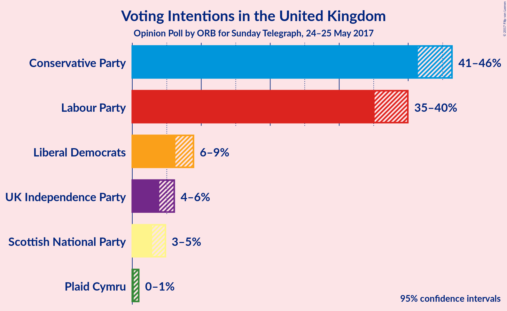
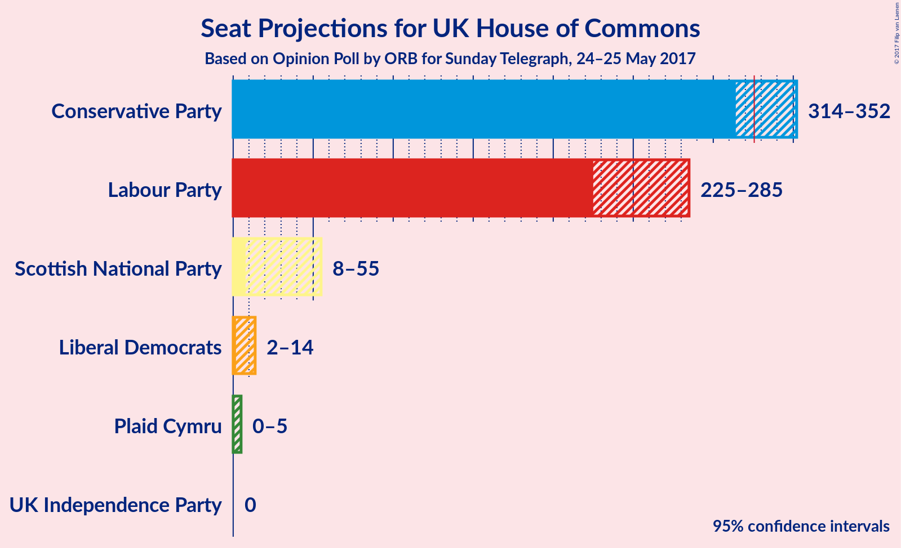
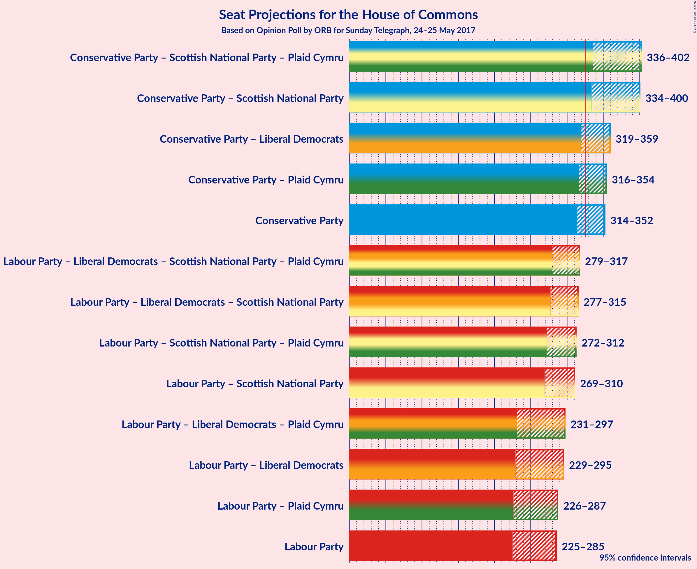

# Opinion Poll by ORB for Sunday Telegraph, 24–25 May 2017

<a href="#voting-intentions">Voting Intentions</a> | <a href="#seats">Seats</a> | <a href="#coalitions">Coalitions</a> | <a href="#technical-information">Technical Information</a>

## Voting Intentions

### Confidence Intervals

| Party | Last Result | Poll Result | 80% Confidence Interval | 90% Confidence Interval | 95% Confidence Interval | 99% Confidence Interval |
|:-----:|:-----------:|:-----------:|:-----------------------:|:-----------------------:|:-----------------------:|:-----------------------:|
| Conservative Party | 36.9% | 44.8% | 42.3–45.5% |41.8–46.0% |41.4–46.3% |40.6–47.1% |
| Labour Party | 30.4% | 38.3% | 36.0–39.1% |35.5–39.6% |35.1–39.9% |34.4–40.7% |
| Liberal Democrats | 7.9% | 7.6% | 6.7–8.4% |6.4–8.6% |6.2–8.9% |5.9–9.3% |
| UK Independence Party | 12.6% | 5.0% | 4.2–5.7% |4.1–5.9% |3.9–6.1% |3.6–6.5% |
| Scottish National Party | 4.7% | 3.8% | 3.2–4.4% |3.0–4.6% |2.9–4.8% |2.7–5.2% |
| Plaid Cymru | 0.6% | 0.5% | 0.3–0.8% |0.2–0.9% |0.2–0.9% |0.2–1.1% |

*Note:* The poll result column reflects the actual value used in the calculations. Published results may vary slightly, and in addition be rounded to fewer digits.

## Seats

### Confidence Intervals

| Party | Last Result | 80% Confidence Interval | 90% Confidence Interval | 95% Confidence Interval | 99% Confidence Interval |
|:-----:|:-----------:|:-----------------------:|:-----------------------:|:-----------------------:|:-----------------------:|
| <a href="#conservative-party">Conservative Party</a> | 331 | 319–345 |316–349 |314–352 |309–356 |
| <a href="#labour-party">Labour Party</a> | 232 | 233–274 |229–281 |225–285 |220–293 |
| <a href="#liberal-democrats">Liberal Democrats</a> | 8 | 3–11 |2–13 |2–14 |1–16 |
| <a href="#uk-independence-party">UK Independence Party</a> | 1 | 0 |0 |0 |0 |
| <a href="#scottish-national-party">Scottish National Party</a> | 56 | 18–53 |11–54 |8–55 |3–56 |
| <a href="#plaid-cymru">Plaid Cymru</a> | 3 | 0–4 |0–5 |0–5 |0–5 |

### Conservative Party

| Number of Seats | Probability | Accumulated |
|:---------------:|:-----------:|:-----------:|
| 299 | 0% | 100% |
| 300 | 0% | 99.9% |
| 301 | 0% | 99.9% |
| 302 | 0.1% | 99.9% |
| 303 | 0% | 99.9% |
| 304 | 0% | 99.9% |
| 305 | 0.1% | 99.8% |
| 306 | 0.1% | 99.8% |
| 307 | 0.1% | 99.7% |
| 308 | 0.1% | 99.6% |
| 309 | 0.1% | 99.5% |
| 310 | 0.2% | 99.4% |
| 311 | 0.2% | 99.2% |
| 312 | 0.5% | 99.0% |
| 313 | 0.5% | 98% |
| 314 | 0.8% | 98% |
| 315 | 1.2% | 97% |
| 316 | 1.2% | 96% |
| 317 | 1.4% | 95% |
| 318 | 2% | 93% |
| 319 | 2% | 92% |
| 320 | 4% | 90% |
| 321 | 4% | 86% |
| 322 | 3% | 83% |
| 323 | 5% | 79% |
| 324 | 5% | 74% |
| 325 | 4% | 69% |
| 326 | 6% | 65% |
| 327 | 4% | 59% |
| 328 | 2% | 56% |
| 329 | 1.3% | 54% |
| 330 | 5% | 53% |
| 331 | 3% | 48% |
| 332 | 3% | 45% |
| 333 | 3% | 42% |
| 334 | 2% | 39% |
| 335 | 2% | 37% |
| 336 | 5% | 35% |
| 337 | 3% | 30% |
| 338 | 3% | 27% |
| 339 | 2% | 24% |
| 340 | 2% | 22% |
| 341 | 4% | 20% |
| 342 | 3% | 16% |
| 343 | 1.0% | 14% |
| 344 | 1.0% | 13% |
| 345 | 2% | 11% |
| 346 | 2% | 10% |
| 347 | 2% | 8% |
| 348 | 0.5% | 6% |
| 349 | 0.9% | 6% |
| 350 | 0.5% | 5% |
| 351 | 1.0% | 4% |
| 352 | 1.3% | 3% |
| 353 | 0.6% | 2% |
| 354 | 0.6% | 2% |
| 355 | 0.3% | 0.9% |
| 356 | 0.3% | 0.6% |
| 357 | 0.1% | 0.3% |
| 358 | 0.1% | 0.2% |
| 359 | 0% | 0.2% |
| 360 | 0% | 0.1% |
| 361 | 0% | 0.1% |
| 362 | 0% | 0.1% |
| 363 | 0% | 0% |

### Labour Party

| Number of Seats | Probability | Accumulated |
|:---------------:|:-----------:|:-----------:|
| 214 | 0% | 100% |
| 215 | 0% | 99.9% |
| 216 | 0% | 99.9% |
| 217 | 0.1% | 99.9% |
| 218 | 0.1% | 99.8% |
| 219 | 0.2% | 99.7% |
| 220 | 0.2% | 99.5% |
| 221 | 0.4% | 99.3% |
| 222 | 0.3% | 99.0% |
| 223 | 0.4% | 98.7% |
| 224 | 0.7% | 98% |
| 225 | 0.5% | 98% |
| 226 | 0.7% | 97% |
| 227 | 0.6% | 96% |
| 228 | 0.6% | 96% |
| 229 | 0.7% | 95% |
| 230 | 2% | 94% |
| 231 | 1.1% | 93% |
| 232 | 1.0% | 92% |
| 233 | 1.1% | 91% |
| 234 | 1.0% | 90% |
| 235 | 1.3% | 89% |
| 236 | 2% | 87% |
| 237 | 2% | 85% |
| 238 | 3% | 84% |
| 239 | 1.2% | 81% |
| 240 | 3% | 80% |
| 241 | 1.3% | 77% |
| 242 | 2% | 76% |
| 243 | 3% | 74% |
| 244 | 1.3% | 71% |
| 245 | 2% | 70% |
| 246 | 2% | 68% |
| 247 | 2% | 66% |
| 248 | 2% | 63% |
| 249 | 3% | 61% |
| 250 | 4% | 58% |
| 251 | 3% | 55% |
| 252 | 3% | 52% |
| 253 | 5% | 48% |
| 254 | 1.3% | 44% |
| 255 | 3% | 43% |
| 256 | 3% | 40% |
| 257 | 1.3% | 37% |
| 258 | 2% | 36% |
| 259 | 3% | 34% |
| 260 | 2% | 31% |
| 261 | 0.8% | 29% |
| 262 | 2% | 28% |
| 263 | 3% | 26% |
| 264 | 1.0% | 23% |
| 265 | 2% | 22% |
| 266 | 2% | 20% |
| 267 | 1.3% | 18% |
| 268 | 0.7% | 17% |
| 269 | 0.9% | 17% |
| 270 | 2% | 16% |
| 271 | 0.5% | 14% |
| 272 | 2% | 13% |
| 273 | 0.7% | 12% |
| 274 | 1.2% | 11% |
| 275 | 0.6% | 10% |
| 276 | 0.7% | 9% |
| 277 | 2% | 8% |
| 278 | 0.5% | 7% |
| 279 | 0.6% | 6% |
| 280 | 0.6% | 6% |
| 281 | 0.5% | 5% |
| 282 | 0.7% | 5% |
| 283 | 0.8% | 4% |
| 284 | 0.4% | 3% |
| 285 | 0.3% | 3% |
| 286 | 0.6% | 2% |
| 287 | 0.2% | 2% |
| 288 | 0.4% | 2% |
| 289 | 0.2% | 1.2% |
| 290 | 0.2% | 1.1% |
| 291 | 0.1% | 0.9% |
| 292 | 0.1% | 0.7% |
| 293 | 0.2% | 0.6% |
| 294 | 0.1% | 0.4% |
| 295 | 0.1% | 0.3% |
| 296 | 0% | 0.2% |
| 297 | 0% | 0.2% |
| 298 | 0.1% | 0.2% |
| 299 | 0% | 0.1% |
| 300 | 0% | 0.1% |
| 301 | 0% | 0.1% |
| 302 | 0% | 0.1% |
| 303 | 0% | 0% |

### Liberal Democrats

| Number of Seats | Probability | Accumulated |
|:---------------:|:-----------:|:-----------:|
| 0 | 0.3% | 100% |
| 1 | 1.3% | 99.7% |
| 2 | 7% | 98% |
| 3 | 16% | 92% |
| 4 | 14% | 76% |
| 5 | 18% | 62% |
| 6 | 8% | 44% |
| 7 | 6% | 36% |
| 8 | 5% | 30% |
| 9 | 7% | 25% |
| 10 | 6% | 18% |
| 11 | 4% | 12% |
| 12 | 3% | 9% |
| 13 | 3% | 6% |
| 14 | 1.4% | 3% |
| 15 | 0.5% | 2% |
| 16 | 0.8% | 1.1% |
| 17 | 0.1% | 0.2% |
| 18 | 0% | 0.1% |
| 19 | 0% | 0.1% |
| 20 | 0% | 0% |

### UK Independence Party

| Number of Seats | Probability | Accumulated |
|:---------------:|:-----------:|:-----------:|
| 0 | 100% | 100% |
| 1 | 0% | 0% |

### Scottish National Party

| Number of Seats | Probability | Accumulated |
|:---------------:|:-----------:|:-----------:|
| 2 | 0.2% | 100% |
| 3 | 0.3% | 99.8% |
| 4 | 0.4% | 99.5% |
| 5 | 0.5% | 99.1% |
| 6 | 0.4% | 98.5% |
| 7 | 0.4% | 98% |
| 8 | 1.1% | 98% |
| 9 | 0.4% | 97% |
| 10 | 1.1% | 96% |
| 11 | 0.8% | 95% |
| 12 | 0.3% | 94% |
| 13 | 0.5% | 94% |
| 14 | 0.3% | 93% |
| 15 | 0.8% | 93% |
| 16 | 0.5% | 92% |
| 17 | 2% | 92% |
| 18 | 1.4% | 90% |
| 19 | 2% | 89% |
| 20 | 0.7% | 87% |
| 21 | 0.8% | 86% |
| 22 | 2% | 85% |
| 23 | 0.5% | 84% |
| 24 | 0.5% | 83% |
| 25 | 0.4% | 83% |
| 26 | 0.8% | 82% |
| 27 | 1.5% | 81% |
| 28 | 1.0% | 80% |
| 29 | 1.0% | 79% |
| 30 | 3% | 78% |
| 31 | 5% | 75% |
| 32 | 2% | 70% |
| 33 | 2% | 68% |
| 34 | 1.4% | 66% |
| 35 | 0.8% | 65% |
| 36 | 2% | 64% |
| 37 | 2% | 62% |
| 38 | 2% | 60% |
| 39 | 3% | 58% |
| 40 | 0.4% | 55% |
| 41 | 0.4% | 55% |
| 42 | 0.7% | 55% |
| 43 | 2% | 54% |
| 44 | 4% | 52% |
| 45 | 3% | 48% |
| 46 | 2% | 45% |
| 47 | 3% | 43% |
| 48 | 5% | 41% |
| 49 | 8% | 35% |
| 50 | 5% | 27% |
| 51 | 8% | 23% |
| 52 | 3% | 14% |
| 53 | 2% | 12% |
| 54 | 5% | 9% |
| 55 | 3% | 4% |
| 56 | 1.2% | 1.3% |
| 57 | 0.1% | 0.1% |
| 58 | 0% | 0% |

### Plaid Cymru

| Number of Seats | Probability | Accumulated |
|:---------------:|:-----------:|:-----------:|
| 0 | 27% | 100% |
| 1 | 14% | 73% |
| 2 | 11% | 60% |
| 3 | 34% | 49% |
| 4 | 5% | 14% |
| 5 | 9% | 9% |
| 6 | 0% | 0.1% |
| 7 | 0% | 0% |

## Coalitions

### Confidence Intervals

| Coalition | Last Result | 80% Confidence Interval | 90% Confidence Interval | 95% Confidence Interval | 99% Confidence Interval |
|:---------:|:-----------:|:-----------------------:|:-----------------------:|:-----------------------:|:-----------------------:|
| Conservative Party – Scottish National Party – Plaid Cymru | 390 | 348–393 | 341–397 | 336–402 | 327–407 |
| Conservative Party – Scottish National Party | 387 | 346–391 | 339–396 | 334–400 | 325–404 |
| Conservative Party – Liberal Democrats | 339 | 325–352 | 322–356 | 319–359 | 314–365 |
| Conservative Party – Plaid Cymru | 334 | 321–347 | 318–352 | 316–354 | 311–359 |
| Conservative Party | 331 | 319–345 | 316–349 | 314–352 | 309–356 |
| Labour Party – Liberal Democrats – Scottish National Party – Plaid Cymru | 299 | 286–312 | 282–315 | 279–317 | 275–322 |
| Labour Party – Liberal Democrats – Scottish National Party | 296 | 284–310 | 279–313 | 277–315 | 272–320 |
| Labour Party – Scottish National Party – Plaid Cymru | 291 | 279–306 | 275–309 | 272–312 | 266–317 |
| Labour Party – Scottish National Party | 288 | 277–304 | 273–307 | 269–310 | 263–315 |
| Labour Party – Liberal Democrats – Plaid Cymru | 243 | 240–285 | 235–292 | 231–297 | 227–306 |
| Labour Party – Liberal Democrats | 240 | 238–283 | 234–290 | 229–295 | 224–304 |
| Labour Party – Plaid Cymru | 235 | 235–277 | 231–283 | 226–287 | 222–294 |
| Labour Party | 232 | 233–274 | 229–281 | 225–285 | 220–293 |

## Technical Information

### Opinion Poll

+ **Pollster:** ORB
+ **Media:** Sunday Telegraph
+ **Fieldwork period:** 24–25 May 2017

### Calculations

+ **Sample size:** 1524
+ **Simulations done:** 524,288
+ **Error estimate:** 0.38%

