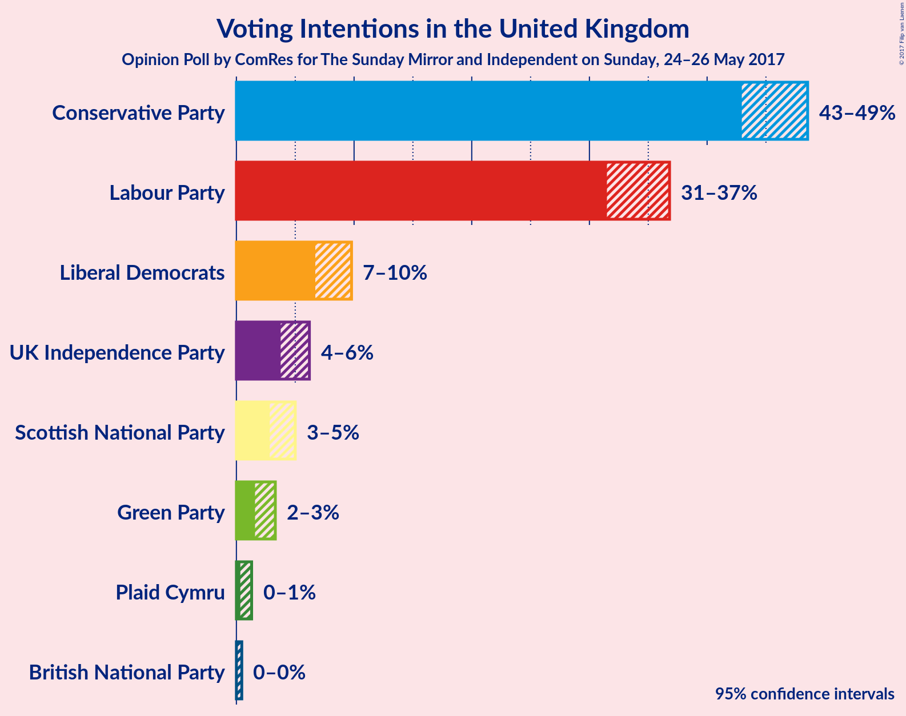

# Opinion Poll by ComRes for The Sunday Mirror and Independent on Sunday, 24–26 May 2017

<a href="#voting-intentions">Voting Intentions</a> | <a href="#seats">Seats</a> | <a href="#coalitions">Coalitions</a> | <a href="#technical-information">Technical Information</a>

## Voting Intentions

### Confidence Intervals

| Party | Last Result | Poll Result | 80% Confidence Interval | 90% Confidence Interval | 95% Confidence Interval | 99% Confidence Interval |
|:-----:|:-----------:|:-----------:|:-----------------------:|:-----------------------:|:-----------------------:|:-----------------------:|
| Conservative Party | 36.9% | 45.9% | 43.9–47.6% |43.4–48.1% |43.0–48.5% |42.1–49.4% |
| Labour Party | 30.4% | 34.2% | 32.4–35.9% |31.9–36.4% |31.5–36.8% |30.7–37.7% |
| Liberal Democrats | 7.9% | 8.1% | 7.2–9.2% |6.9–9.5% |6.7–9.8% |6.3–10.3% |
| UK Independence Party | 12.6% | 4.9% | 4.1–5.7% |3.9–6.0% |3.8–6.2% |3.4–6.6% |
| Scottish National Party | 4.7% | 3.8% | 3.2–4.6% |3.0–4.8% |2.8–5.0% |2.6–5.4% |
| Green Party | 3.8% | 2.3% | 1.8–3.0% |1.7–3.1% |1.6–3.3% |1.4–3.6% |
| Plaid Cymru | 0.6% | 0.7% | 0.4–1.1% |0.4–1.2% |0.3–1.3% |0.2–1.5% |
| British National Party | 0.0% | 0.1% | 0.0–0.3% |0.0–0.4% |0.0–0.5% |0.0–0.6% |

*Note:* The poll result column reflects the actual value used in the calculations. Published results may vary slightly, and in addition be rounded to fewer digits.

## Seats

### Confidence Intervals

| Party | Last Result | 80% Confidence Interval | 90% Confidence Interval | 95% Confidence Interval | 99% Confidence Interval |
|:-----:|:-----------:|:-----------------------:|:-----------------------:|:-----------------------:|:-----------------------:|
| <a href="#conservative-party">Conservative Party</a> | 331 | 338–371 |329–375 |329–379 |320–383 |
| <a href="#labour-party">Labour Party</a> | 232 | 204–244 |198–249 |194–257 |190–267 |
| <a href="#liberal-democrats">Liberal Democrats</a> | 8 | 4–15 |2–16 |2–17 |1–19 |
| <a href="#uk-independence-party">UK Independence Party</a> | 1 | 0 |0 |0 |0 |
| <a href="#scottish-national-party">Scottish National Party</a> | 56 | 31–55 |23–55 |10–55 |4–56 |
| <a href="#green-party">Green Party</a> | 1 | 0–1 |0–1 |0–1 |0–1 |
| <a href="#plaid-cymru">Plaid Cymru</a> | 3 | 0–5 |0–6 |0–7 |0–7 |
| <a href="#british-national-party">British National Party</a> | 0 | 0 |0 |0 |0 |

### Conservative Party

| Number of Seats | Probability | Accumulated |
|:---------------:|:-----------:|:-----------:|
| 314 | 0% | 100% |
| 315 | 0% | 99.9% |
| 316 | 0% | 99.9% |
| 317 | 0% | 99.9% |
| 318 | 0% | 99.9% |
| 319 | 0.2% | 99.9% |
| 320 | 0.3% | 99.7% |
| 321 | 0.1% | 99.4% |
| 322 | 0.1% | 99.3% |
| 323 | 0.5% | 99.2% |
| 324 | 0.1% | 98.7% |
| 325 | 0.1% | 98.6% |
| 326 | 0.3% | 98.5% |
| 327 | 0.1% | 98% |
| 328 | 0.4% | 98% |
| 329 | 4% | 98% |
| 330 | 0.1% | 93% |
| 331 | 0.4% | 93% |
| 332 | 0.3% | 93% |
| 333 | 1.2% | 93% |
| 334 | 0% | 91% |
| 335 | 0.2% | 91% |
| 336 | 0.5% | 91% |
| 337 | 0.4% | 91% |
| 338 | 0.8% | 90% |
| 339 | 3% | 89% |
| 340 | 0.2% | 86% |
| 341 | 0.3% | 86% |
| 342 | 1.2% | 86% |
| 343 | 0.6% | 84% |
| 344 | 0.7% | 84% |
| 345 | 1.4% | 83% |
| 346 | 0.3% | 82% |
| 347 | 0.4% | 81% |
| 348 | 3% | 81% |
| 349 | 3% | 78% |
| 350 | 6% | 74% |
| 351 | 3% | 68% |
| 352 | 10% | 65% |
| 353 | 7% | 54% |
| 354 | 2% | 47% |
| 355 | 20% | 45% |
| 356 | 2% | 25% |
| 357 | 1.2% | 23% |
| 358 | 0.7% | 22% |
| 359 | 0.7% | 21% |
| 360 | 1.0% | 20% |
| 361 | 1.4% | 19% |
| 362 | 0% | 18% |
| 363 | 2% | 18% |
| 364 | 0.4% | 15% |
| 365 | 0.4% | 15% |
| 366 | 0.3% | 15% |
| 367 | 0.1% | 14% |
| 368 | 1.2% | 14% |
| 369 | 0.5% | 13% |
| 370 | 2% | 13% |
| 371 | 1.4% | 11% |
| 372 | 0.8% | 10% |
| 373 | 0.4% | 9% |
| 374 | 3% | 8% |
| 375 | 1.0% | 5% |
| 376 | 1.5% | 4% |
| 377 | 0.1% | 3% |
| 378 | 0% | 3% |
| 379 | 1.3% | 3% |
| 380 | 0% | 1.4% |
| 381 | 0.6% | 1.4% |
| 382 | 0.3% | 0.9% |
| 383 | 0% | 0.5% |
| 384 | 0% | 0.5% |
| 385 | 0.1% | 0.4% |
| 386 | 0.1% | 0.3% |
| 387 | 0.1% | 0.3% |
| 388 | 0% | 0.2% |
| 389 | 0% | 0.2% |
| 390 | 0% | 0.1% |
| 391 | 0.1% | 0.1% |
| 392 | 0% | 0% |

### Labour Party

| Number of Seats | Probability | Accumulated |
|:---------------:|:-----------:|:-----------:|
| 182 | 0% | 100% |
| 183 | 0% | 99.9% |
| 184 | 0.1% | 99.9% |
| 185 | 0.1% | 99.8% |
| 186 | 0.1% | 99.7% |
| 187 | 0.1% | 99.7% |
| 188 | 0% | 99.6% |
| 189 | 0.1% | 99.6% |
| 190 | 0.1% | 99.5% |
| 191 | 1.2% | 99.4% |
| 192 | 0% | 98% |
| 193 | 0.7% | 98% |
| 194 | 0.2% | 98% |
| 195 | 0.1% | 97% |
| 196 | 0.2% | 97% |
| 197 | 0.1% | 97% |
| 198 | 3% | 97% |
| 199 | 1.4% | 94% |
| 200 | 0.5% | 93% |
| 201 | 0.2% | 92% |
| 202 | 0.4% | 92% |
| 203 | 0.2% | 92% |
| 204 | 2% | 91% |
| 205 | 0.4% | 89% |
| 206 | 2% | 89% |
| 207 | 1.1% | 87% |
| 208 | 0.3% | 85% |
| 209 | 0.3% | 85% |
| 210 | 2% | 85% |
| 211 | 0.8% | 83% |
| 212 | 0.4% | 82% |
| 213 | 0.5% | 82% |
| 214 | 7% | 82% |
| 215 | 19% | 75% |
| 216 | 0.3% | 56% |
| 217 | 0.7% | 55% |
| 218 | 3% | 55% |
| 219 | 4% | 52% |
| 220 | 0.8% | 48% |
| 221 | 10% | 47% |
| 222 | 9% | 37% |
| 223 | 0.3% | 28% |
| 224 | 0.1% | 28% |
| 225 | 1.0% | 28% |
| 226 | 1.0% | 27% |
| 227 | 4% | 26% |
| 228 | 0.4% | 22% |
| 229 | 1.1% | 22% |
| 230 | 1.1% | 21% |
| 231 | 0.2% | 20% |
| 232 | 3% | 19% |
| 233 | 1.3% | 17% |
| 234 | 0.1% | 15% |
| 235 | 0.1% | 15% |
| 236 | 0.1% | 15% |
| 237 | 0.1% | 15% |
| 238 | 0.4% | 15% |
| 239 | 0.1% | 15% |
| 240 | 2% | 14% |
| 241 | 0.1% | 13% |
| 242 | 0% | 13% |
| 243 | 0.4% | 13% |
| 244 | 4% | 12% |
| 245 | 0.5% | 8% |
| 246 | 0.4% | 7% |
| 247 | 1.5% | 7% |
| 248 | 0.2% | 5% |
| 249 | 0.5% | 5% |
| 250 | 0.3% | 5% |
| 251 | 0.2% | 4% |
| 252 | 0% | 4% |
| 253 | 0.2% | 4% |
| 254 | 0.1% | 4% |
| 255 | 0.8% | 4% |
| 256 | 0.1% | 3% |
| 257 | 0.7% | 3% |
| 258 | 0% | 2% |
| 259 | 0.1% | 2% |
| 260 | 0.1% | 2% |
| 261 | 0.1% | 2% |
| 262 | 0% | 2% |
| 263 | 1.1% | 2% |
| 264 | 0% | 0.8% |
| 265 | 0.3% | 0.8% |
| 266 | 0% | 0.5% |
| 267 | 0.3% | 0.5% |
| 268 | 0% | 0.3% |
| 269 | 0% | 0.3% |
| 270 | 0% | 0.2% |
| 271 | 0% | 0.2% |
| 272 | 0% | 0.2% |
| 273 | 0% | 0.2% |
| 274 | 0% | 0.2% |
| 275 | 0% | 0.2% |
| 276 | 0% | 0.2% |
| 277 | 0% | 0.1% |
| 278 | 0% | 0.1% |
| 279 | 0% | 0.1% |
| 280 | 0% | 0.1% |
| 281 | 0% | 0.1% |
| 282 | 0% | 0.1% |
| 283 | 0% | 0.1% |
| 284 | 0% | 0.1% |
| 285 | 0% | 0% |

### Liberal Democrats

| Number of Seats | Probability | Accumulated |
|:---------------:|:-----------:|:-----------:|
| 0 | 0.1% | 100% |
| 1 | 1.1% | 99.9% |
| 2 | 5% | 98.8% |
| 3 | 1.3% | 94% |
| 4 | 7% | 93% |
| 5 | 6% | 86% |
| 6 | 10% | 80% |
| 7 | 4% | 70% |
| 8 | 22% | 66% |
| 9 | 3% | 44% |
| 10 | 13% | 41% |
| 11 | 5% | 28% |
| 12 | 2% | 22% |
| 13 | 7% | 20% |
| 14 | 3% | 13% |
| 15 | 4% | 10% |
| 16 | 1.1% | 6% |
| 17 | 3% | 5% |
| 18 | 0.3% | 2% |
| 19 | 0.8% | 1.2% |
| 20 | 0% | 0.4% |
| 21 | 0.1% | 0.4% |
| 22 | 0% | 0.3% |
| 23 | 0.3% | 0.3% |
| 24 | 0% | 0.1% |
| 25 | 0% | 0% |

### UK Independence Party

| Number of Seats | Probability | Accumulated |
|:---------------:|:-----------:|:-----------:|
| 0 | 100% | 100% |
| 1 | 0% | 0% |

### Scottish National Party

| Number of Seats | Probability | Accumulated |
|:---------------:|:-----------:|:-----------:|
| 2 | 0.1% | 100% |
| 3 | 0.1% | 99.9% |
| 4 | 0.5% | 99.8% |
| 5 | 0.3% | 99.3% |
| 6 | 0% | 99.1% |
| 7 | 0.1% | 99.0% |
| 8 | 0% | 99.0% |
| 9 | 1.0% | 98.9% |
| 10 | 0.5% | 98% |
| 11 | 0% | 97% |
| 12 | 0% | 97% |
| 13 | 0.2% | 97% |
| 14 | 0.1% | 97% |
| 15 | 0.1% | 97% |
| 16 | 0% | 97% |
| 17 | 0.5% | 97% |
| 18 | 0.1% | 96% |
| 19 | 0.4% | 96% |
| 20 | 0.2% | 96% |
| 21 | 0% | 96% |
| 22 | 0% | 96% |
| 23 | 2% | 96% |
| 24 | 0.1% | 93% |
| 25 | 0.2% | 93% |
| 26 | 0% | 93% |
| 27 | 0.5% | 93% |
| 28 | 1.1% | 92% |
| 29 | 0.6% | 91% |
| 30 | 0.1% | 91% |
| 31 | 1.1% | 91% |
| 32 | 0.6% | 89% |
| 33 | 0.1% | 89% |
| 34 | 0.8% | 89% |
| 35 | 0.7% | 88% |
| 36 | 0.4% | 87% |
| 37 | 0.3% | 87% |
| 38 | 0.6% | 87% |
| 39 | 3% | 86% |
| 40 | 0.2% | 83% |
| 41 | 5% | 83% |
| 42 | 2% | 78% |
| 43 | 5% | 76% |
| 44 | 11% | 71% |
| 45 | 1.1% | 60% |
| 46 | 2% | 59% |
| 47 | 3% | 58% |
| 48 | 3% | 55% |
| 49 | 2% | 51% |
| 50 | 1.1% | 49% |
| 51 | 21% | 48% |
| 52 | 5% | 27% |
| 53 | 4% | 22% |
| 54 | 7% | 18% |
| 55 | 10% | 12% |
| 56 | 2% | 2% |
| 57 | 0.2% | 0.2% |
| 58 | 0% | 0.1% |
| 59 | 0% | 0% |

### Green Party

| Number of Seats | Probability | Accumulated |
|:---------------:|:-----------:|:-----------:|
| 0 | 67% | 100% |
| 1 | 33% | 33% |
| 2 | 0% | 0% |

### Plaid Cymru

| Number of Seats | Probability | Accumulated |
|:---------------:|:-----------:|:-----------:|
| 0 | 12% | 100% |
| 1 | 0.4% | 88% |
| 2 | 4% | 88% |
| 3 | 40% | 83% |
| 4 | 21% | 43% |
| 5 | 17% | 22% |
| 6 | 2% | 5% |
| 7 | 3% | 3% |
| 8 | 0.2% | 0.3% |
| 9 | 0% | 0.1% |
| 10 | 0% | 0.1% |
| 11 | 0.1% | 0.1% |
| 12 | 0% | 0% |

### British National Party

| Number of Seats | Probability | Accumulated |
|:---------------:|:-----------:|:-----------:|
| 0 | 100% | 100% |
| 1 | 0% | 0% |

## Coalitions

### Confidence Intervals

| Coalition | Last Result | 80% Confidence Interval | 90% Confidence Interval | 95% Confidence Interval | 99% Confidence Interval |
|:---------:|:-----------:|:-----------------------:|:-----------------------:|:-----------------------:|:-----------------------:|
| Conservative Party – Scottish National Party – Plaid Cymru | 390 | 375–422 | 368–426 | 364–428 | 356–436 |
| Conservative Party – Scottish National Party | 387 | 372–418 | 365–426 | 363–426 | 351–432 |
| Conservative Party – Liberal Democrats | 339 | 342–382 | 341–384 | 338–388 | 329–394 |
| Conservative Party – Plaid Cymru | 334 | 340–374 | 332–379 | 332–381 | 323–387 |
| Conservative Party | 331 | 338–371 | 329–375 | 329–379 | 320–383 |
| Labour Party – Liberal Democrats – Scottish National Party – Plaid Cymru | 299 | 261–294 | 256–303 | 253–303 | 249–312 |
| Labour Party – Liberal Democrats – Scottish National Party | 296 | 258–291 | 253–300 | 250–300 | 245–309 |
| Labour Party – Scottish National Party – Plaid Cymru | 291 | 250–290 | 248–291 | 243–294 | 238–303 |
| Labour Party – Scottish National Party | 288 | 250–286 | 244–287 | 239–294 | 234–300 |
| Labour Party – Liberal Democrats – Plaid Cymru | 243 | 214–260 | 206–267 | 206–269 | 200–281 |
| Labour Party – Liberal Democrats | 240 | 210–257 | 206–264 | 204–268 | 196–276 |
| Labour Party – Plaid Cymru | 235 | 208–247 | 198–254 | 198–262 | 193–272 |
| Labour Party | 232 | 204–244 | 198–249 | 194–257 | 190–267 |

## Technical Information

### Opinion Poll

+ **Pollster:** ComRes
+ **Media:** The Sunday Mirror and Independent on Sunday
+ **Fieldwork period:** 24–26 May 2017

### Calculations

+ **Sample size:** 1215
+ **Simulations done:** 524,288
+ **Error estimate:** 3.49%

