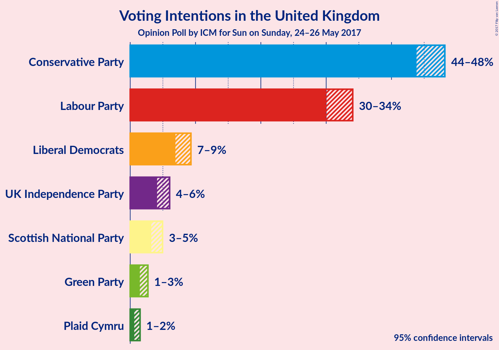

# Opinion Poll by ICM for Sun on Sunday, 24–26 May 2017

<a href="#voting-intentions">Voting Intentions</a> | <a href="#seats">Seats</a> | <a href="#coalitions">Coalitions</a> | <a href="#technical-information">Technical Information</a>

## Voting Intentions

### Confidence Intervals

| Party | Last Result | Poll Result | 80% Confidence Interval | 90% Confidence Interval | 95% Confidence Interval | 99% Confidence Interval |
|:-----:|:-----------:|:-----------:|:-----------------------:|:-----------------------:|:-----------------------:|:-----------------------:|
| Conservative Party | 36.9% | 46.9% | 44.6–47.4% |44.2–47.8% |43.8–48.2% |43.1–48.8% |
| Labour Party | 30.4% | 32.7% | 30.7–33.3% |30.3–33.7% |30.0–34.1% |29.4–34.7% |
| Liberal Democrats | 7.9% | 8.2% | 7.3–8.9% |7.1–9.1% |6.9–9.3% |6.6–9.7% |
| UK Independence Party | 12.6% | 5.1% | 4.4–5.7% |4.3–5.9% |4.1–6.0% |3.9–6.4% |
| Scottish National Party | 4.7% | 4.1% | 3.5–4.6% |3.4–4.8% |3.2–5.0% |3.0–5.3% |
| Green Party | 3.8% | 2.0% | 1.7–2.5% |1.6–2.6% |1.5–2.7% |1.3–3.0% |
| Plaid Cymru | 0.6% | 1.0% | 0.7–1.3% |0.7–1.4% |0.6–1.5% |0.5–1.7% |

*Note:* The poll result column reflects the actual value used in the calculations. Published results may vary slightly, and in addition be rounded to fewer digits.

## Seats

### Confidence Intervals

| Party | Last Result | 80% Confidence Interval | 90% Confidence Interval | 95% Confidence Interval | 99% Confidence Interval |
|:-----:|:-----------:|:-----------------------:|:-----------------------:|:-----------------------:|:-----------------------:|
| <a href="#conservative-party">Conservative Party</a> | 331 | 352–377 |349–381 |348–382 |342–387 |
| <a href="#labour-party">Labour Party</a> | 232 | 194–219 |188–222 |186–227 |183–234 |
| <a href="#liberal-democrats">Liberal Democrats</a> | 8 | 4–11 |3–13 |2–14 |1–16 |
| <a href="#uk-independence-party">UK Independence Party</a> | 1 | 0 |0 |0 |0 |
| <a href="#scottish-national-party">Scottish National Party</a> | 56 | 42–55 |38–55 |32–56 |23–56 |
| <a href="#green-party">Green Party</a> | 1 | 0 |0–1 |0–1 |0–1 |
| <a href="#plaid-cymru">Plaid Cymru</a> | 3 | 4–7 |4–7 |4–8 |3–8 |

### Conservative Party

| Number of Seats | Probability | Accumulated |
|:---------------:|:-----------:|:-----------:|
| 335 | 0% | 100% |
| 336 | 0% | 99.9% |
| 337 | 0% | 99.9% |
| 338 | 0% | 99.9% |
| 339 | 0.1% | 99.9% |
| 340 | 0% | 99.8% |
| 341 | 0.2% | 99.8% |
| 342 | 0.1% | 99.6% |
| 343 | 0.2% | 99.5% |
| 344 | 0% | 99.3% |
| 345 | 0.2% | 99.2% |
| 346 | 0.2% | 99.0% |
| 347 | 1.2% | 98.8% |
| 348 | 0.4% | 98% |
| 349 | 2% | 97% |
| 350 | 1.4% | 95% |
| 351 | 3% | 93% |
| 352 | 8% | 91% |
| 353 | 1.2% | 82% |
| 354 | 6% | 81% |
| 355 | 4% | 75% |
| 356 | 0.8% | 72% |
| 357 | 6% | 71% |
| 358 | 3% | 65% |
| 359 | 1.4% | 62% |
| 360 | 0.7% | 60% |
| 361 | 1.0% | 60% |
| 362 | 0.3% | 59% |
| 363 | 9% | 58% |
| 364 | 5% | 49% |
| 365 | 0.4% | 44% |
| 366 | 5% | 44% |
| 367 | 6% | 39% |
| 368 | 5% | 33% |
| 369 | 2% | 28% |
| 370 | 4% | 26% |
| 371 | 2% | 22% |
| 372 | 3% | 19% |
| 373 | 1.3% | 17% |
| 374 | 2% | 15% |
| 375 | 2% | 13% |
| 376 | 1.0% | 12% |
| 377 | 2% | 11% |
| 378 | 1.0% | 9% |
| 379 | 0.8% | 8% |
| 380 | 2% | 7% |
| 381 | 2% | 5% |
| 382 | 1.0% | 3% |
| 383 | 0.3% | 2% |
| 384 | 0.4% | 2% |
| 385 | 0.6% | 2% |
| 386 | 0.3% | 1.0% |
| 387 | 0.4% | 0.7% |
| 388 | 0.1% | 0.2% |
| 389 | 0% | 0.1% |
| 390 | 0% | 0.1% |
| 391 | 0% | 0.1% |
| 392 | 0% | 0% |

### Labour Party

| Number of Seats | Probability | Accumulated |
|:---------------:|:-----------:|:-----------:|
| 177 | 0% | 100% |
| 178 | 0% | 99.9% |
| 179 | 0% | 99.9% |
| 180 | 0% | 99.9% |
| 181 | 0.1% | 99.9% |
| 182 | 0.2% | 99.8% |
| 183 | 0.6% | 99.6% |
| 184 | 0.1% | 99.0% |
| 185 | 0.3% | 98.9% |
| 186 | 2% | 98.6% |
| 187 | 1.5% | 97% |
| 188 | 1.2% | 96% |
| 189 | 0.8% | 94% |
| 190 | 0.5% | 93% |
| 191 | 0.7% | 93% |
| 192 | 0.8% | 92% |
| 193 | 0.6% | 91% |
| 194 | 4% | 91% |
| 195 | 2% | 87% |
| 196 | 4% | 85% |
| 197 | 0.6% | 82% |
| 198 | 2% | 81% |
| 199 | 2% | 79% |
| 200 | 5% | 77% |
| 201 | 4% | 72% |
| 202 | 2% | 67% |
| 203 | 8% | 65% |
| 204 | 2% | 58% |
| 205 | 4% | 55% |
| 206 | 4% | 51% |
| 207 | 0.4% | 47% |
| 208 | 3% | 47% |
| 209 | 1.4% | 44% |
| 210 | 3% | 42% |
| 211 | 1.1% | 39% |
| 212 | 6% | 38% |
| 213 | 7% | 32% |
| 214 | 3% | 26% |
| 215 | 3% | 23% |
| 216 | 3% | 19% |
| 217 | 3% | 17% |
| 218 | 2% | 14% |
| 219 | 2% | 11% |
| 220 | 0.5% | 10% |
| 221 | 4% | 9% |
| 222 | 0.6% | 5% |
| 223 | 0.7% | 4% |
| 224 | 0.2% | 4% |
| 225 | 0.3% | 3% |
| 226 | 0.5% | 3% |
| 227 | 0.3% | 3% |
| 228 | 0.5% | 2% |
| 229 | 0.2% | 2% |
| 230 | 0.1% | 2% |
| 231 | 0.1% | 2% |
| 232 | 0% | 1.5% |
| 233 | 0.7% | 1.4% |
| 234 | 0.3% | 0.7% |
| 235 | 0% | 0.4% |
| 236 | 0% | 0.4% |
| 237 | 0.1% | 0.3% |
| 238 | 0% | 0.2% |
| 239 | 0.1% | 0.2% |
| 240 | 0% | 0.1% |
| 241 | 0% | 0.1% |
| 242 | 0% | 0.1% |
| 243 | 0% | 0.1% |
| 244 | 0% | 0.1% |
| 245 | 0% | 0% |

### Liberal Democrats

| Number of Seats | Probability | Accumulated |
|:---------------:|:-----------:|:-----------:|
| 0 | 0.1% | 100% |
| 1 | 0.9% | 99.9% |
| 2 | 2% | 99.0% |
| 3 | 6% | 97% |
| 4 | 11% | 91% |
| 5 | 14% | 80% |
| 6 | 15% | 66% |
| 7 | 16% | 51% |
| 8 | 4% | 34% |
| 9 | 4% | 30% |
| 10 | 11% | 25% |
| 11 | 6% | 15% |
| 12 | 3% | 8% |
| 13 | 2% | 5% |
| 14 | 1.1% | 3% |
| 15 | 1.3% | 2% |
| 16 | 0.5% | 0.8% |
| 17 | 0.2% | 0.2% |
| 18 | 0% | 0.1% |
| 19 | 0% | 0.1% |
| 20 | 0% | 0% |

### UK Independence Party

| Number of Seats | Probability | Accumulated |
|:---------------:|:-----------:|:-----------:|
| 0 | 100% | 100% |
| 1 | 0% | 0% |

### Scottish National Party

| Number of Seats | Probability | Accumulated |
|:---------------:|:-----------:|:-----------:|
| 15 | 0% | 100% |
| 16 | 0% | 99.9% |
| 17 | 0% | 99.9% |
| 18 | 0.2% | 99.9% |
| 19 | 0% | 99.8% |
| 20 | 0% | 99.8% |
| 21 | 0.1% | 99.7% |
| 22 | 0% | 99.7% |
| 23 | 0.3% | 99.7% |
| 24 | 0.1% | 99.4% |
| 25 | 0.3% | 99.2% |
| 26 | 0.1% | 98.9% |
| 27 | 0.1% | 98.9% |
| 28 | 0% | 98.7% |
| 29 | 0.1% | 98.7% |
| 30 | 0.7% | 98.6% |
| 31 | 0.1% | 98% |
| 32 | 0.8% | 98% |
| 33 | 0.6% | 97% |
| 34 | 0% | 97% |
| 35 | 0% | 96% |
| 36 | 0.3% | 96% |
| 37 | 0.8% | 96% |
| 38 | 0.4% | 95% |
| 39 | 0.4% | 95% |
| 40 | 0.8% | 95% |
| 41 | 3% | 94% |
| 42 | 5% | 90% |
| 43 | 1.1% | 85% |
| 44 | 0.9% | 84% |
| 45 | 4% | 83% |
| 46 | 5% | 79% |
| 47 | 3% | 74% |
| 48 | 5% | 72% |
| 49 | 3% | 67% |
| 50 | 5% | 64% |
| 51 | 8% | 59% |
| 52 | 5% | 51% |
| 53 | 10% | 46% |
| 54 | 11% | 36% |
| 55 | 23% | 26% |
| 56 | 3% | 3% |
| 57 | 0% | 0% |

### Green Party

| Number of Seats | Probability | Accumulated |
|:---------------:|:-----------:|:-----------:|
| 0 | 94% | 100% |
| 1 | 6% | 6% |
| 2 | 0% | 0% |

### Plaid Cymru

| Number of Seats | Probability | Accumulated |
|:---------------:|:-----------:|:-----------:|
| 1 | 0% | 100% |
| 2 | 0% | 99.9% |
| 3 | 2% | 99.9% |
| 4 | 15% | 98% |
| 5 | 52% | 83% |
| 6 | 5% | 30% |
| 7 | 22% | 25% |
| 8 | 2% | 3% |
| 9 | 0.1% | 0.4% |
| 10 | 0.2% | 0.3% |
| 11 | 0.1% | 0.1% |
| 12 | 0% | 0% |

## Coalitions

### Confidence Intervals

| Coalition | Last Result | 80% Confidence Interval | 90% Confidence Interval | 95% Confidence Interval | 99% Confidence Interval |
|:---------:|:-----------:|:-----------------------:|:-----------------------:|:-----------------------:|:-----------------------:|
| Conservative Party – Scottish National Party – Plaid Cymru | 390 | 405–432 | 401–437 | 396–441 | 388–443 |
| Conservative Party – Scottish National Party | 387 | 400–426 | 395–431 | 391–436 | 383–437 |
| Conservative Party – Liberal Democrats | 339 | 358–385 | 355–387 | 354–391 | 349–396 |
| Conservative Party – Plaid Cymru | 334 | 357–382 | 355–386 | 352–388 | 347–393 |
| Conservative Party | 331 | 352–377 | 349–381 | 348–382 | 342–387 |
| Labour Party – Liberal Democrats – Scottish National Party – Plaid Cymru | 299 | 255–280 | 251–283 | 250–284 | 245–290 |
| Labour Party – Liberal Democrats – Scottish National Party | 296 | 250–275 | 246–277 | 244–279 | 239–285 |
| Labour Party – Scottish National Party – Plaid Cymru | 291 | 247–274 | 245–277 | 241–278 | 235–283 |
| Labour Party – Scottish National Party | 288 | 242–270 | 240–271 | 234–273 | 230–278 |
| Labour Party – Liberal Democrats – Plaid Cymru | 243 | 206–232 | 201–237 | 196–241 | 194–249 |
| Labour Party – Liberal Democrats | 240 | 200–227 | 195–231 | 191–236 | 189–244 |
| Labour Party – Plaid Cymru | 235 | 199–225 | 193–227 | 192–233 | 188–239 |
| Labour Party | 232 | 194–219 | 188–222 | 186–227 | 183–234 |

## Technical Information

### Opinion Poll

+ **Pollster:** ICM
+ **Media:** Sun on Sunday
+ **Fieldwork period:** 24–26 May 2017

### Calculations

+ **Sample size:** 2003
+ **Simulations done:** 262,144
+ **Error estimate:** 0.73%

