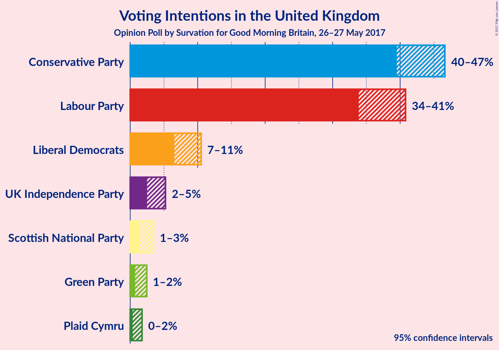
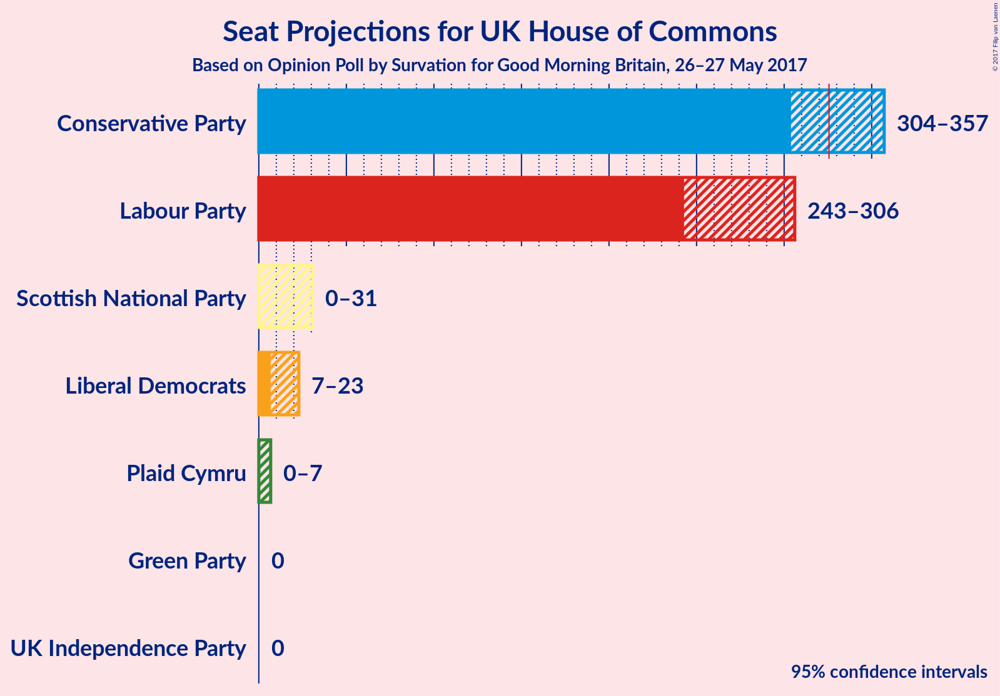
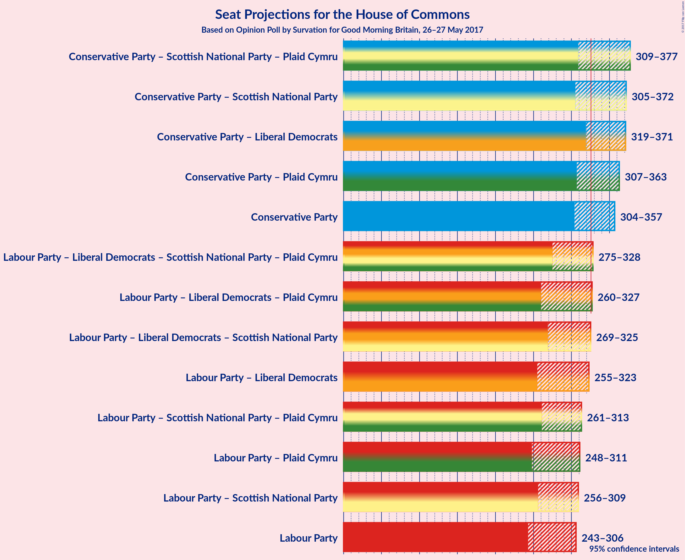

# Opinion Poll by Survation for Good Morning Britain, 26–27 May 2017

<a href="#voting-intentions">Voting Intentions</a> | <a href="#seats">Seats</a> | <a href="#coalitions">Coalitions</a> | <a href="#technical-information">Technical Information</a>

## Voting Intentions

### Confidence Intervals

| Party | Last Result | Poll Result | 80% Confidence Interval | 90% Confidence Interval | 95% Confidence Interval | 99% Confidence Interval |
|:-----:|:-----------:|:-----------:|:-----------------------:|:-----------------------:|:-----------------------:|:-----------------------:|
| Conservative Party | 36.9% | 44.6% | 40.7–45.4% |40.1–46.0% |39.5–46.6% |38.4–47.8% |
| Labour Party | 30.4% | 38.6% | 35.0–39.6% |34.4–40.2% |33.9–40.8% |32.8–41.9% |
| Liberal Democrats | 7.9% | 8.6% | 7.1–9.8% |6.8–10.2% |6.5–10.5% |6.0–11.2% |
| UK Independence Party | 12.6% | 3.8% | 2.9–4.7% |2.7–5.0% |2.5–5.2% |2.2–5.8% |
| Scottish National Party | 4.7% | 2.2% | 1.6–3.0% |1.4–3.2% |1.3–3.5% |1.1–3.9% |
| Green Party | 3.8% | 1.4% | 0.9–2.1% |0.8–2.3% |0.7–2.5% |0.6–2.9% |
| Plaid Cymru | 0.6% | 0.8% | 0.5–1.4% |0.4–1.6% |0.4–1.8% |0.3–2.1% |

*Note:* The poll result column reflects the actual value used in the calculations. Published results may vary slightly, and in addition be rounded to fewer digits.

## Seats

### Confidence Intervals

| Party | Last Result | 80% Confidence Interval | 90% Confidence Interval | 95% Confidence Interval | 99% Confidence Interval |
|:-----:|:-----------:|:-----------------------:|:-----------------------:|:-----------------------:|:-----------------------:|
| <a href="#conservative-party">Conservative Party</a> | 331 | 316–347 |308–355 |303–357 |287–367 |
| <a href="#labour-party">Labour Party</a> | 232 | 258–296 |252–301 |241–307 |227–320 |
| <a href="#liberal-democrats">Liberal Democrats</a> | 8 | 10–18 |8–21 |7–23 |4–25 |
| <a href="#uk-independence-party">UK Independence Party</a> | 1 | 0 |0 |0 |0 |
| <a href="#scottish-national-party">Scottish National Party</a> | 56 | 0–14 |0–24 |0–32 |0–47 |
| <a href="#green-party">Green Party</a> | 1 | 0 |0 |0 |0 |
| <a href="#plaid-cymru">Plaid Cymru</a> | 3 | 3–7 |1–7 |0–7 |0–9 |

### Conservative Party

| Number of Seats | Probability | Accumulated |
|:---------------:|:-----------:|:-----------:|
| 276 | 0% | 100% |
| 277 | 0% | 99.9% |
| 278 | 0% | 99.9% |
| 279 | 0% | 99.9% |
| 280 | 0% | 99.9% |
| 281 | 0% | 99.9% |
| 282 | 0% | 99.8% |
| 283 | 0.1% | 99.8% |
| 284 | 0% | 99.7% |
| 285 | 0.1% | 99.7% |
| 286 | 0.1% | 99.6% |
| 287 | 0.1% | 99.5% |
| 288 | 0% | 99.5% |
| 289 | 0.1% | 99.4% |
| 290 | 0% | 99.3% |
| 291 | 0.2% | 99.3% |
| 292 | 0.1% | 99.2% |
| 293 | 0.1% | 99.0% |
| 294 | 0% | 99.0% |
| 295 | 0% | 98.9% |
| 296 | 0.1% | 98.9% |
| 297 | 0% | 98.8% |
| 298 | 0.1% | 98.8% |
| 299 | 0.1% | 98.7% |
| 300 | 0.1% | 98.6% |
| 301 | 0.3% | 98.5% |
| 302 | 0.4% | 98% |
| 303 | 0.5% | 98% |
| 304 | 0.3% | 97% |
| 305 | 0.3% | 97% |
| 306 | 0.4% | 97% |
| 307 | 1.2% | 96% |
| 308 | 0.3% | 95% |
| 309 | 1.2% | 95% |
| 310 | 0.5% | 94% |
| 311 | 0.4% | 93% |
| 312 | 0.9% | 93% |
| 313 | 0.6% | 92% |
| 314 | 0.6% | 91% |
| 315 | 0.5% | 91% |
| 316 | 0.9% | 90% |
| 317 | 2% | 89% |
| 318 | 5% | 88% |
| 319 | 7% | 82% |
| 320 | 2% | 76% |
| 321 | 3% | 73% |
| 322 | 2% | 70% |
| 323 | 2% | 68% |
| 324 | 3% | 66% |
| 325 | 1.1% | 63% |
| 326 | 5% | 62% |
| 327 | 6% | 57% |
| 328 | 3% | 51% |
| 329 | 6% | 48% |
| 330 | 4% | 43% |
| 331 | 0.8% | 39% |
| 332 | 2% | 38% |
| 333 | 1.3% | 36% |
| 334 | 1.2% | 35% |
| 335 | 0.8% | 33% |
| 336 | 2% | 33% |
| 337 | 0.7% | 31% |
| 338 | 2% | 30% |
| 339 | 3% | 29% |
| 340 | 1.3% | 26% |
| 341 | 0.6% | 25% |
| 342 | 2% | 24% |
| 343 | 4% | 22% |
| 344 | 2% | 18% |
| 345 | 2% | 16% |
| 346 | 0.5% | 15% |
| 347 | 4% | 14% |
| 348 | 1.0% | 10% |
| 349 | 0.5% | 9% |
| 350 | 0.6% | 8% |
| 351 | 0.8% | 8% |
| 352 | 0.4% | 7% |
| 353 | 0.8% | 7% |
| 354 | 0.6% | 6% |
| 355 | 2% | 5% |
| 356 | 0.7% | 3% |
| 357 | 0.6% | 3% |
| 358 | 0.3% | 2% |
| 359 | 0.3% | 2% |
| 360 | 0.3% | 1.5% |
| 361 | 0.3% | 1.2% |
| 362 | 0.1% | 0.9% |
| 363 | 0.1% | 0.8% |
| 364 | 0.1% | 0.7% |
| 365 | 0% | 0.6% |
| 366 | 0.1% | 0.6% |
| 367 | 0% | 0.5% |
| 368 | 0% | 0.5% |
| 369 | 0% | 0.4% |
| 370 | 0% | 0.4% |
| 371 | 0.1% | 0.4% |
| 372 | 0.1% | 0.3% |
| 373 | 0.1% | 0.2% |
| 374 | 0% | 0.2% |
| 375 | 0% | 0.1% |
| 376 | 0% | 0.1% |
| 377 | 0% | 0.1% |
| 378 | 0% | 0.1% |
| 379 | 0% | 0.1% |
| 380 | 0% | 0.1% |
| 381 | 0% | 0% |

### Labour Party

| Number of Seats | Probability | Accumulated |
|:---------------:|:-----------:|:-----------:|
| 215 | 0% | 100% |
| 216 | 0% | 99.9% |
| 217 | 0% | 99.9% |
| 218 | 0% | 99.9% |
| 219 | 0% | 99.9% |
| 220 | 0% | 99.8% |
| 221 | 0% | 99.8% |
| 222 | 0% | 99.8% |
| 223 | 0% | 99.7% |
| 224 | 0% | 99.7% |
| 225 | 0.1% | 99.7% |
| 226 | 0.1% | 99.6% |
| 227 | 0.1% | 99.5% |
| 228 | 0.1% | 99.5% |
| 229 | 0.1% | 99.4% |
| 230 | 0.1% | 99.3% |
| 231 | 0.1% | 99.3% |
| 232 | 0% | 99.1% |
| 233 | 0.1% | 99.1% |
| 234 | 0.2% | 99.1% |
| 235 | 0.1% | 98.9% |
| 236 | 0% | 98.8% |
| 237 | 0.3% | 98.8% |
| 238 | 0.3% | 98.5% |
| 239 | 0.3% | 98% |
| 240 | 0.2% | 98% |
| 241 | 0.2% | 98% |
| 242 | 0.2% | 97% |
| 243 | 0.2% | 97% |
| 244 | 0.1% | 97% |
| 245 | 0.2% | 97% |
| 246 | 0.1% | 97% |
| 247 | 0.2% | 97% |
| 248 | 0.3% | 97% |
| 249 | 0.2% | 96% |
| 250 | 0.4% | 96% |
| 251 | 0.4% | 96% |
| 252 | 0.8% | 95% |
| 253 | 0.9% | 94% |
| 254 | 0.8% | 94% |
| 255 | 0.5% | 93% |
| 256 | 0.5% | 92% |
| 257 | 1.0% | 92% |
| 258 | 1.1% | 91% |
| 259 | 0.3% | 90% |
| 260 | 1.0% | 89% |
| 261 | 1.3% | 88% |
| 262 | 0.6% | 87% |
| 263 | 0.8% | 86% |
| 264 | 2% | 86% |
| 265 | 2% | 83% |
| 266 | 2% | 81% |
| 267 | 0.8% | 79% |
| 268 | 0.6% | 78% |
| 269 | 2% | 78% |
| 270 | 3% | 76% |
| 271 | 0.8% | 73% |
| 272 | 3% | 72% |
| 273 | 2% | 69% |
| 274 | 1.3% | 68% |
| 275 | 2% | 66% |
| 276 | 4% | 64% |
| 277 | 2% | 61% |
| 278 | 1.3% | 59% |
| 279 | 2% | 57% |
| 280 | 1.3% | 55% |
| 281 | 1.0% | 54% |
| 282 | 0.8% | 53% |
| 283 | 2% | 52% |
| 284 | 4% | 51% |
| 285 | 6% | 47% |
| 286 | 3% | 41% |
| 287 | 1.4% | 38% |
| 288 | 3% | 36% |
| 289 | 4% | 33% |
| 290 | 3% | 29% |
| 291 | 2% | 26% |
| 292 | 1.2% | 24% |
| 293 | 7% | 23% |
| 294 | 2% | 16% |
| 295 | 3% | 14% |
| 296 | 2% | 11% |
| 297 | 1.3% | 9% |
| 298 | 1.0% | 8% |
| 299 | 1.3% | 7% |
| 300 | 0.6% | 6% |
| 301 | 0.5% | 5% |
| 302 | 0.2% | 5% |
| 303 | 0.3% | 4% |
| 304 | 0.3% | 4% |
| 305 | 0.4% | 4% |
| 306 | 0.6% | 3% |
| 307 | 0.4% | 3% |
| 308 | 0.1% | 2% |
| 309 | 0.2% | 2% |
| 310 | 0.1% | 2% |
| 311 | 0.1% | 2% |
| 312 | 0.5% | 2% |
| 313 | 0.2% | 1.4% |
| 314 | 0.1% | 1.2% |
| 315 | 0.2% | 1.2% |
| 316 | 0.1% | 1.0% |
| 317 | 0.1% | 0.9% |
| 318 | 0.2% | 0.8% |
| 319 | 0.1% | 0.6% |
| 320 | 0.1% | 0.6% |
| 321 | 0% | 0.5% |
| 322 | 0% | 0.5% |
| 323 | 0% | 0.5% |
| 324 | 0% | 0.4% |
| 325 | 0% | 0.4% |
| 326 | 0.1% | 0.4% |
| 327 | 0.1% | 0.3% |
| 328 | 0% | 0.2% |
| 329 | 0% | 0.2% |
| 330 | 0% | 0.2% |
| 331 | 0% | 0.1% |
| 332 | 0% | 0.1% |
| 333 | 0% | 0.1% |
| 334 | 0% | 0% |

### Liberal Democrats

| Number of Seats | Probability | Accumulated |
|:---------------:|:-----------:|:-----------:|
| 2 | 0.1% | 100% |
| 3 | 0.2% | 99.8% |
| 4 | 0.6% | 99.6% |
| 5 | 0.5% | 99.0% |
| 6 | 0.3% | 98.6% |
| 7 | 1.1% | 98% |
| 8 | 3% | 97% |
| 9 | 2% | 94% |
| 10 | 6% | 92% |
| 11 | 12% | 85% |
| 12 | 15% | 73% |
| 13 | 9% | 58% |
| 14 | 14% | 49% |
| 15 | 15% | 35% |
| 16 | 6% | 20% |
| 17 | 3% | 14% |
| 18 | 2% | 11% |
| 19 | 2% | 9% |
| 20 | 1.2% | 7% |
| 21 | 0.8% | 6% |
| 22 | 2% | 5% |
| 23 | 2% | 3% |
| 24 | 0.6% | 1.3% |
| 25 | 0.3% | 0.7% |
| 26 | 0.1% | 0.5% |
| 27 | 0.1% | 0.3% |
| 28 | 0.1% | 0.2% |
| 29 | 0% | 0.1% |
| 30 | 0% | 0.1% |
| 31 | 0% | 0.1% |
| 32 | 0% | 0.1% |
| 33 | 0% | 0.1% |
| 34 | 0% | 0% |

### UK Independence Party

| Number of Seats | Probability | Accumulated |
|:---------------:|:-----------:|:-----------:|
| 0 | 100% | 100% |
| 1 | 0% | 0% |

### Scottish National Party

| Number of Seats | Probability | Accumulated |
|:---------------:|:-----------:|:-----------:|
| 0 | 27% | 100% |
| 1 | 21% | 73% |
| 2 | 18% | 52% |
| 3 | 6% | 35% |
| 4 | 5% | 28% |
| 5 | 5% | 23% |
| 6 | 1.3% | 18% |
| 7 | 1.3% | 17% |
| 8 | 1.4% | 15% |
| 9 | 2% | 14% |
| 10 | 0.4% | 13% |
| 11 | 1.0% | 12% |
| 12 | 0.6% | 11% |
| 13 | 0.3% | 10% |
| 14 | 0.8% | 10% |
| 15 | 1.0% | 9% |
| 16 | 0.5% | 8% |
| 17 | 0.3% | 8% |
| 18 | 0.5% | 8% |
| 19 | 0.3% | 7% |
| 20 | 0.6% | 7% |
| 21 | 0.3% | 6% |
| 22 | 0.3% | 6% |
| 23 | 0.5% | 6% |
| 24 | 0.4% | 5% |
| 25 | 0.2% | 5% |
| 26 | 0.3% | 5% |
| 27 | 0.6% | 4% |
| 28 | 0.3% | 4% |
| 29 | 0.2% | 3% |
| 30 | 0.3% | 3% |
| 31 | 0.3% | 3% |
| 32 | 0.2% | 3% |
| 33 | 0.2% | 2% |
| 34 | 0.1% | 2% |
| 35 | 0.1% | 2% |
| 36 | 0.3% | 2% |
| 37 | 0.1% | 2% |
| 38 | 0.1% | 2% |
| 39 | 0% | 2% |
| 40 | 0.2% | 2% |
| 41 | 0.1% | 1.3% |
| 42 | 0.1% | 1.1% |
| 43 | 0.1% | 1.0% |
| 44 | 0.1% | 0.9% |
| 45 | 0.2% | 0.8% |
| 46 | 0.1% | 0.6% |
| 47 | 0.1% | 0.5% |
| 48 | 0.1% | 0.4% |
| 49 | 0.1% | 0.3% |
| 50 | 0.1% | 0.2% |
| 51 | 0% | 0.1% |
| 52 | 0% | 0.1% |
| 53 | 0% | 0.1% |
| 54 | 0% | 0% |

### Green Party

| Number of Seats | Probability | Accumulated |
|:---------------:|:-----------:|:-----------:|
| 0 | 99.6% | 100% |
| 1 | 0.4% | 0.4% |
| 2 | 0% | 0% |

### Plaid Cymru

| Number of Seats | Probability | Accumulated |
|:---------------:|:-----------:|:-----------:|
| 0 | 3% | 100% |
| 1 | 3% | 97% |
| 2 | 2% | 94% |
| 3 | 24% | 92% |
| 4 | 10% | 68% |
| 5 | 46% | 58% |
| 6 | 2% | 12% |
| 7 | 8% | 11% |
| 8 | 2% | 2% |
| 9 | 0.1% | 0.6% |
| 10 | 0.2% | 0.5% |
| 11 | 0.2% | 0.3% |
| 12 | 0% | 0.1% |
| 13 | 0.1% | 0.1% |
| 14 | 0% | 0% |

## Coalitions

### Confidence Intervals

| Coalition | Last Result | 80% Confidence Interval | 90% Confidence Interval | 95% Confidence Interval | 99% Confidence Interval |
|:---------:|:-----------:|:-----------------------:|:-----------------------:|:-----------------------:|:-----------------------:|
| Conservative Party – Scottish National Party – Plaid Cymru | 390 | 321–361 | 316–368 | 308–378 | 293–394 |
| Conservative Party – Scottish National Party | 387 | 318–356 | 311–364 | 304–373 | 289–389 |
| Conservative Party – Liberal Democrats | 339 | 330–361 | 324–367 | 319–371 | 302–380 |
| Conservative Party – Plaid Cymru | 334 | 319–352 | 312–359 | 307–362 | 291–372 |
| Conservative Party | 331 | 316–347 | 308–355 | 303–357 | 287–367 |
| Labour Party – Liberal Democrats – Scottish National Party – Plaid Cymru | 299 | 285–316 | 277–324 | 275–329 | 265–345 |
| Labour Party – Liberal Democrats – Plaid Cymru | 243 | 276–314 | 268–321 | 259–328 | 243–343 |
| Labour Party – Liberal Democrats – Scottish National Party | 296 | 280–313 | 273–320 | 270–325 | 260–341 |
| Labour Party – Liberal Democrats | 240 | 271–311 | 264–316 | 254–324 | 238–339 |
| Labour Party – Scottish National Party – Plaid Cymru | 291 | 271–302 | 265–308 | 261–313 | 252–330 |
| Labour Party – Plaid Cymru | 235 | 263–300 | 256–304 | 246–312 | 231–324 |
| Labour Party – Scottish National Party | 288 | 267–299 | 260–304 | 256–310 | 247–325 |
| Labour Party | 232 | 258–296 | 252–301 | 241–307 | 227–320 |

## Technical Information

### Opinion Poll

+ **Pollster:** Survation
+ **Media:** Good Morning Britain
+ **Fieldwork period:** 26–27 May 2017

### Calculations

+ **Sample size:** 720
+ **Simulations done:** 1,048,576
+ **Error estimate:** 3.22%

