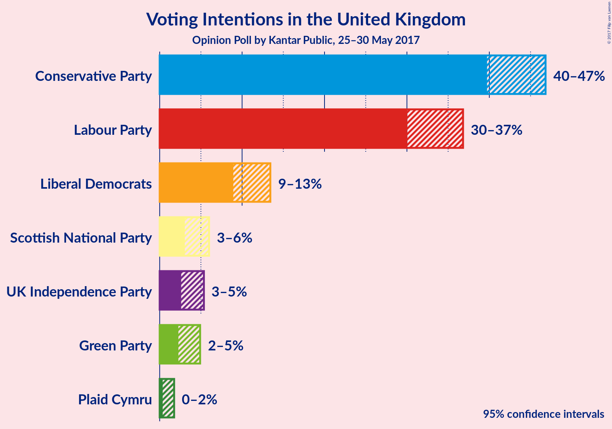
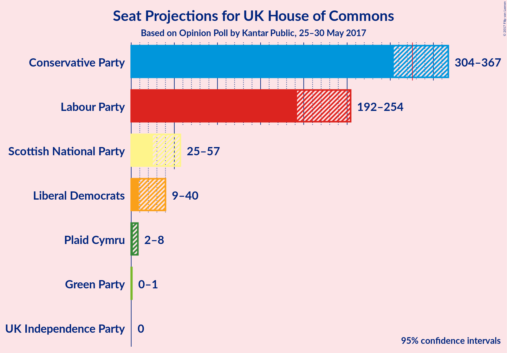
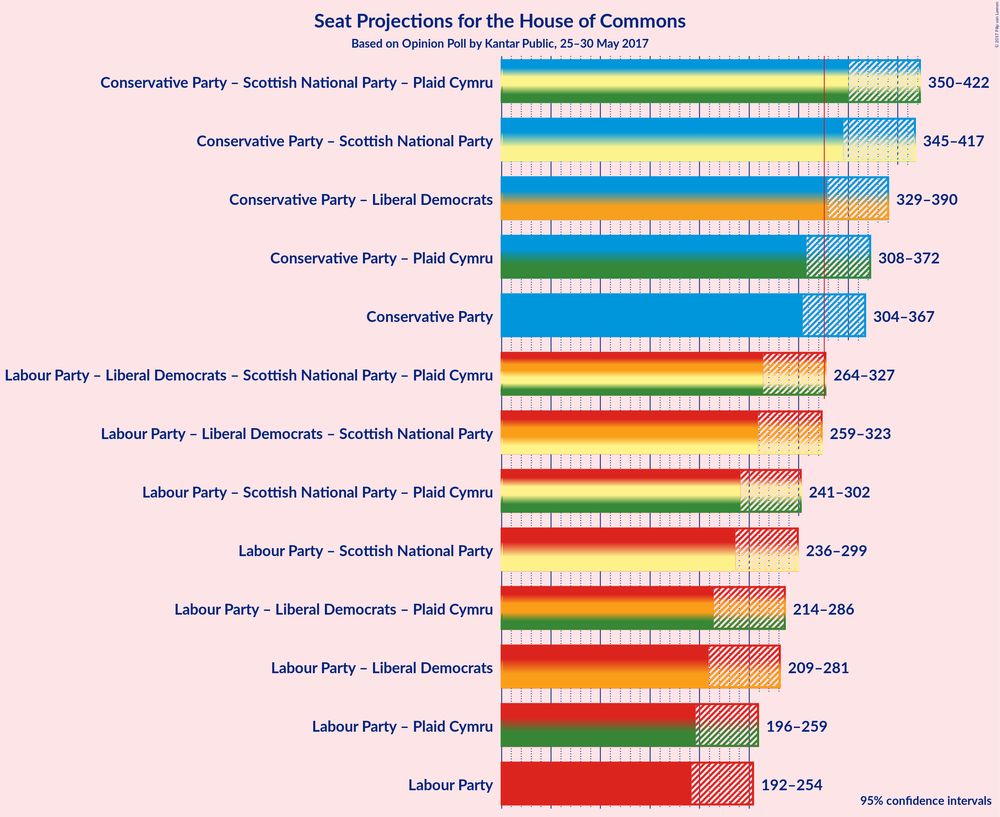

# Opinion Poll by Kantar Public, 25–30 May 2017

<a href="#voting-intentions">Voting Intentions</a> | <a href="#seats">Seats</a> | <a href="#coalitions">Coalitions</a> | <a href="#technical-information">Technical Information</a>

## Voting Intentions

### Confidence Intervals

| Party | Last Result | Poll Result | 80% Confidence Interval | 90% Confidence Interval | 95% Confidence Interval | 99% Confidence Interval |
|:-----:|:-----------:|:-----------:|:-----------------------:|:-----------------------:|:-----------------------:|:-----------------------:|
| Conservative Party | 36.9% | 43.4% | 40.9–45.6% |40.3–46.3% |39.7–46.8% |38.6–48.0% |
| Labour Party | 30.4% | 33.4% | 31.2–35.6% |30.6–36.2% |30.0–36.8% |29.0–37.9% |
| Liberal Democrats | 7.9% | 11.0% | 9.6–12.6% |9.3–13.0% |8.9–13.4% |8.3–14.2% |
| Scottish National Party | 4.7% | 4.3% | 3.5–5.4% |3.2–5.7% |3.0–6.0% |2.7–6.6% |
| UK Independence Party | 12.6% | 3.8% | 3.0–4.8% |2.8–5.1% |2.6–5.4% |2.3–5.9% |
| Green Party | 3.8% | 3.4% | 2.6–4.4% |2.4–4.6% |2.3–4.9% |2.0–5.4% |
| Plaid Cymru | 0.6% | 0.8% | 0.5–1.4% |0.4–1.6% |0.4–1.8% |0.3–2.1% |

*Note:* The poll result column reflects the actual value used in the calculations. Published results may vary slightly, and in addition be rounded to fewer digits.

## Seats

### Confidence Intervals

| Party | Last Result | 80% Confidence Interval | 90% Confidence Interval | 95% Confidence Interval | 99% Confidence Interval |
|:-----:|:-----------:|:-----------------------:|:-----------------------:|:-----------------------:|:-----------------------:|
| <a href="#conservative-party">Conservative Party</a> | 331 | 314–357 |310–364 |304–367 |295–379 |
| <a href="#labour-party">Labour Party</a> | 232 | 200–243 |195–248 |192–254 |181–269 |
| <a href="#liberal-democrats">Liberal Democrats</a> | 8 | 12–32 |10–37 |9–40 |6–45 |
| <a href="#scottish-national-party">Scottish National Party</a> | 56 | 39–55 |28–56 |25–57 |7–58 |
| <a href="#uk-independence-party">UK Independence Party</a> | 1 | 0 |0 |0 |0 |
| <a href="#green-party">Green Party</a> | 1 | 0–1 |0–1 |0–1 |0–2 |
| <a href="#plaid-cymru">Plaid Cymru</a> | 3 | 3–7 |2–8 |2–8 |0–11 |

### Conservative Party

| Number of Seats | Probability | Accumulated |
|:---------------:|:-----------:|:-----------:|
| 284 | 0% | 100% |
| 285 | 0% | 99.9% |
| 286 | 0% | 99.9% |
| 287 | 0% | 99.9% |
| 288 | 0% | 99.9% |
| 289 | 0% | 99.9% |
| 290 | 0% | 99.9% |
| 291 | 0% | 99.9% |
| 292 | 0% | 99.8% |
| 293 | 0.1% | 99.8% |
| 294 | 0.1% | 99.7% |
| 295 | 0.1% | 99.6% |
| 296 | 0.1% | 99.5% |
| 297 | 0.2% | 99.4% |
| 298 | 0.1% | 99.2% |
| 299 | 0% | 99.1% |
| 300 | 0.2% | 99.1% |
| 301 | 0.2% | 98.9% |
| 302 | 0.5% | 98.7% |
| 303 | 0.4% | 98% |
| 304 | 0.9% | 98% |
| 305 | 0.1% | 97% |
| 306 | 0.3% | 97% |
| 307 | 0.5% | 96% |
| 308 | 0.6% | 96% |
| 309 | 0.3% | 95% |
| 310 | 0.5% | 95% |
| 311 | 0.9% | 95% |
| 312 | 2% | 94% |
| 313 | 0.5% | 92% |
| 314 | 2% | 92% |
| 315 | 1.0% | 90% |
| 316 | 1.4% | 89% |
| 317 | 2% | 87% |
| 318 | 0.7% | 86% |
| 319 | 0.4% | 85% |
| 320 | 1.3% | 84% |
| 321 | 2% | 83% |
| 322 | 0.6% | 81% |
| 323 | 1.0% | 81% |
| 324 | 0.4% | 80% |
| 325 | 0.7% | 79% |
| 326 | 0.8% | 79% |
| 327 | 2% | 78% |
| 328 | 2% | 76% |
| 329 | 3% | 74% |
| 330 | 3% | 71% |
| 331 | 2% | 69% |
| 332 | 5% | 67% |
| 333 | 0.8% | 62% |
| 334 | 2% | 61% |
| 335 | 3% | 59% |
| 336 | 2% | 57% |
| 337 | 2% | 55% |
| 338 | 1.2% | 53% |
| 339 | 3% | 52% |
| 340 | 2% | 49% |
| 341 | 8% | 47% |
| 342 | 2% | 39% |
| 343 | 2% | 37% |
| 344 | 2% | 36% |
| 345 | 3% | 34% |
| 346 | 3% | 31% |
| 347 | 2% | 28% |
| 348 | 1.1% | 26% |
| 349 | 3% | 25% |
| 350 | 1.5% | 22% |
| 351 | 4% | 20% |
| 352 | 2% | 16% |
| 353 | 2% | 14% |
| 354 | 0.8% | 12% |
| 355 | 0.6% | 11% |
| 356 | 0.4% | 11% |
| 357 | 0.5% | 10% |
| 358 | 1.0% | 10% |
| 359 | 0.1% | 9% |
| 360 | 0.8% | 9% |
| 361 | 0.6% | 8% |
| 362 | 1.0% | 7% |
| 363 | 0.3% | 6% |
| 364 | 0.9% | 6% |
| 365 | 0.9% | 5% |
| 366 | 0.9% | 4% |
| 367 | 0.8% | 3% |
| 368 | 0.3% | 2% |
| 369 | 0.2% | 2% |
| 370 | 0.1% | 2% |
| 371 | 0% | 2% |
| 372 | 0.2% | 2% |
| 373 | 0.2% | 1.5% |
| 374 | 0.2% | 1.2% |
| 375 | 0.2% | 1.0% |
| 376 | 0.2% | 0.9% |
| 377 | 0% | 0.6% |
| 378 | 0.1% | 0.6% |
| 379 | 0.2% | 0.5% |
| 380 | 0.1% | 0.3% |
| 381 | 0% | 0.3% |
| 382 | 0.1% | 0.3% |
| 383 | 0.1% | 0.2% |
| 384 | 0% | 0.1% |
| 385 | 0% | 0.1% |
| 386 | 0% | 0.1% |
| 387 | 0% | 0.1% |
| 388 | 0% | 0.1% |
| 389 | 0% | 0% |

### Labour Party

| Number of Seats | Probability | Accumulated |
|:---------------:|:-----------:|:-----------:|
| 173 | 0% | 100% |
| 174 | 0% | 99.9% |
| 175 | 0.1% | 99.9% |
| 176 | 0% | 99.9% |
| 177 | 0% | 99.8% |
| 178 | 0% | 99.8% |
| 179 | 0.1% | 99.7% |
| 180 | 0% | 99.6% |
| 181 | 0.2% | 99.6% |
| 182 | 0.2% | 99.4% |
| 183 | 0.2% | 99.1% |
| 184 | 0.2% | 98.9% |
| 185 | 0.1% | 98.7% |
| 186 | 0.2% | 98.6% |
| 187 | 0.1% | 98% |
| 188 | 0.1% | 98% |
| 189 | 0.1% | 98% |
| 190 | 0.1% | 98% |
| 191 | 0.2% | 98% |
| 192 | 2% | 98% |
| 193 | 0.7% | 96% |
| 194 | 0.3% | 95% |
| 195 | 0.5% | 95% |
| 196 | 0.9% | 95% |
| 197 | 2% | 94% |
| 198 | 0.6% | 92% |
| 199 | 1.3% | 92% |
| 200 | 0.6% | 90% |
| 201 | 0.3% | 90% |
| 202 | 0.9% | 89% |
| 203 | 0.2% | 88% |
| 204 | 2% | 88% |
| 205 | 1.2% | 86% |
| 206 | 1.0% | 85% |
| 207 | 1.1% | 84% |
| 208 | 2% | 83% |
| 209 | 3% | 81% |
| 210 | 5% | 78% |
| 211 | 2% | 73% |
| 212 | 2% | 71% |
| 213 | 2% | 69% |
| 214 | 7% | 67% |
| 215 | 4% | 60% |
| 216 | 2% | 57% |
| 217 | 4% | 55% |
| 218 | 2% | 51% |
| 219 | 3% | 48% |
| 220 | 2% | 46% |
| 221 | 1.4% | 43% |
| 222 | 2% | 42% |
| 223 | 0.7% | 39% |
| 224 | 1.1% | 39% |
| 225 | 0.5% | 38% |
| 226 | 1.0% | 37% |
| 227 | 0.9% | 36% |
| 228 | 4% | 35% |
| 229 | 1.1% | 31% |
| 230 | 3% | 30% |
| 231 | 3% | 27% |
| 232 | 3% | 25% |
| 233 | 2% | 22% |
| 234 | 2% | 19% |
| 235 | 0.8% | 17% |
| 236 | 0.2% | 16% |
| 237 | 0.3% | 16% |
| 238 | 1.4% | 16% |
| 239 | 0.4% | 15% |
| 240 | 0.9% | 14% |
| 241 | 0.7% | 13% |
| 242 | 2% | 13% |
| 243 | 2% | 11% |
| 244 | 1.4% | 9% |
| 245 | 0.6% | 8% |
| 246 | 0.6% | 7% |
| 247 | 0.9% | 6% |
| 248 | 1.1% | 6% |
| 249 | 0.3% | 4% |
| 250 | 0.3% | 4% |
| 251 | 0.3% | 4% |
| 252 | 0.3% | 4% |
| 253 | 0.6% | 3% |
| 254 | 0.3% | 3% |
| 255 | 0.5% | 2% |
| 256 | 0.2% | 2% |
| 257 | 0.1% | 2% |
| 258 | 0.1% | 2% |
| 259 | 0.1% | 2% |
| 260 | 0.1% | 1.4% |
| 261 | 0.1% | 1.3% |
| 262 | 0.1% | 1.2% |
| 263 | 0% | 1.2% |
| 264 | 0.1% | 1.2% |
| 265 | 0.3% | 1.0% |
| 266 | 0% | 0.7% |
| 267 | 0.1% | 0.7% |
| 268 | 0% | 0.6% |
| 269 | 0.1% | 0.5% |
| 270 | 0% | 0.4% |
| 271 | 0% | 0.4% |
| 272 | 0.1% | 0.4% |
| 273 | 0% | 0.3% |
| 274 | 0% | 0.3% |
| 275 | 0% | 0.2% |
| 276 | 0% | 0.2% |
| 277 | 0% | 0.2% |
| 278 | 0% | 0.2% |
| 279 | 0% | 0.2% |
| 280 | 0% | 0.1% |
| 281 | 0% | 0.1% |
| 282 | 0.1% | 0.1% |
| 283 | 0% | 0.1% |
| 284 | 0% | 0.1% |
| 285 | 0% | 0% |

### Liberal Democrats

| Number of Seats | Probability | Accumulated |
|:---------------:|:-----------:|:-----------:|
| 3 | 0% | 100% |
| 4 | 0.2% | 99.9% |
| 5 | 0.3% | 99.8% |
| 6 | 0.4% | 99.5% |
| 7 | 0.5% | 99.2% |
| 8 | 0.7% | 98.6% |
| 9 | 2% | 98% |
| 10 | 3% | 96% |
| 11 | 2% | 93% |
| 12 | 1.0% | 91% |
| 13 | 4% | 90% |
| 14 | 2% | 86% |
| 15 | 3% | 84% |
| 16 | 3% | 81% |
| 17 | 4% | 77% |
| 18 | 3% | 74% |
| 19 | 5% | 71% |
| 20 | 3% | 66% |
| 21 | 10% | 63% |
| 22 | 6% | 53% |
| 23 | 4% | 47% |
| 24 | 7% | 44% |
| 25 | 5% | 37% |
| 26 | 6% | 32% |
| 27 | 3% | 27% |
| 28 | 4% | 23% |
| 29 | 2% | 19% |
| 30 | 2% | 16% |
| 31 | 0.8% | 14% |
| 32 | 4% | 13% |
| 33 | 1.0% | 9% |
| 34 | 1.2% | 8% |
| 35 | 0.8% | 7% |
| 36 | 0.3% | 6% |
| 37 | 1.4% | 6% |
| 38 | 0.9% | 4% |
| 39 | 0.7% | 3% |
| 40 | 0.3% | 3% |
| 41 | 1.0% | 2% |
| 42 | 0.3% | 1.3% |
| 43 | 0.2% | 0.9% |
| 44 | 0.2% | 0.8% |
| 45 | 0% | 0.5% |
| 46 | 0.2% | 0.5% |
| 47 | 0.1% | 0.3% |
| 48 | 0.1% | 0.2% |
| 49 | 0.1% | 0.1% |
| 50 | 0% | 0% |

### Scottish National Party

| Number of Seats | Probability | Accumulated |
|:---------------:|:-----------:|:-----------:|
| 3 | 0.1% | 100% |
| 4 | 0% | 99.9% |
| 5 | 0.2% | 99.8% |
| 6 | 0.1% | 99.6% |
| 7 | 0.1% | 99.5% |
| 8 | 0% | 99.5% |
| 9 | 0% | 99.4% |
| 10 | 0% | 99.4% |
| 11 | 0% | 99.4% |
| 12 | 0% | 99.3% |
| 13 | 0.1% | 99.3% |
| 14 | 0.5% | 99.2% |
| 15 | 0.4% | 98.7% |
| 16 | 0% | 98% |
| 17 | 0.1% | 98% |
| 18 | 0.2% | 98% |
| 19 | 0% | 98% |
| 20 | 0.1% | 98% |
| 21 | 0% | 98% |
| 22 | 0.1% | 98% |
| 23 | 0.1% | 98% |
| 24 | 0.2% | 98% |
| 25 | 0.7% | 98% |
| 26 | 0.1% | 97% |
| 27 | 2% | 97% |
| 28 | 0.5% | 95% |
| 29 | 0.6% | 95% |
| 30 | 0.5% | 94% |
| 31 | 0.2% | 94% |
| 32 | 0.8% | 93% |
| 33 | 0.2% | 93% |
| 34 | 0.1% | 92% |
| 35 | 0.1% | 92% |
| 36 | 0.1% | 92% |
| 37 | 0.2% | 92% |
| 38 | 1.4% | 92% |
| 39 | 2% | 91% |
| 40 | 2% | 89% |
| 41 | 6% | 86% |
| 42 | 2% | 81% |
| 43 | 3% | 79% |
| 44 | 4% | 75% |
| 45 | 2% | 71% |
| 46 | 7% | 69% |
| 47 | 8% | 62% |
| 48 | 5% | 53% |
| 49 | 8% | 48% |
| 50 | 9% | 40% |
| 51 | 6% | 31% |
| 52 | 4% | 25% |
| 53 | 8% | 21% |
| 54 | 3% | 13% |
| 55 | 4% | 10% |
| 56 | 3% | 6% |
| 57 | 1.5% | 3% |
| 58 | 1.1% | 1.4% |
| 59 | 0.3% | 0.3% |
| 60 | 0% | 0% |

### UK Independence Party

| Number of Seats | Probability | Accumulated |
|:---------------:|:-----------:|:-----------:|
| 0 | 100% | 100% |
| 1 | 0% | 0% |

### Green Party

| Number of Seats | Probability | Accumulated |
|:---------------:|:-----------:|:-----------:|
| 0 | 12% | 100% |
| 1 | 88% | 88% |
| 2 | 0.6% | 0.6% |
| 3 | 0% | 0% |

### Plaid Cymru

| Number of Seats | Probability | Accumulated |
|:---------------:|:-----------:|:-----------:|
| 0 | 1.2% | 100% |
| 1 | 0.7% | 98.8% |
| 2 | 3% | 98% |
| 3 | 19% | 95% |
| 4 | 47% | 76% |
| 5 | 7% | 29% |
| 6 | 5% | 22% |
| 7 | 12% | 17% |
| 8 | 4% | 6% |
| 9 | 0.6% | 2% |
| 10 | 0.4% | 1.2% |
| 11 | 0.7% | 0.9% |
| 12 | 0% | 0.2% |
| 13 | 0.1% | 0.2% |
| 14 | 0% | 0.1% |
| 15 | 0.1% | 0.1% |
| 16 | 0% | 0% |

## Coalitions

### Confidence Intervals

| Coalition | Last Result | 80% Confidence Interval | 90% Confidence Interval | 95% Confidence Interval | 99% Confidence Interval |
|:---------:|:-----------:|:-----------------------:|:-----------------------:|:-----------------------:|:-----------------------:|
| Conservative Party – Scottish National Party – Plaid Cymru | 390 | 364–410 | 355–418 | 350–422 | 333–433 |
| Conservative Party – Scottish National Party | 387 | 360–406 | 351–412 | 345–417 | 330–429 |
| Conservative Party – Liberal Democrats | 339 | 339–378 | 333–385 | 329–390 | 323–399 |
| Conservative Party – Plaid Cymru | 334 | 318–362 | 313–369 | 308–372 | 299–383 |
| Conservative Party | 331 | 314–357 | 310–364 | 304–367 | 295–379 |
| Labour Party – Liberal Democrats – Scottish National Party – Plaid Cymru | 299 | 274–317 | 267–322 | 264–327 | 252–336 |
| Labour Party – Liberal Democrats – Scottish National Party | 296 | 269–313 | 262–318 | 259–323 | 248–332 |
| Labour Party – Scottish National Party – Plaid Cymru | 291 | 253–292 | 246–298 | 241–302 | 232–309 |
| Labour Party – Scottish National Party | 288 | 248–288 | 241–294 | 236–299 | 227–304 |
| Labour Party – Liberal Democrats – Plaid Cymru | 243 | 226–271 | 219–281 | 214–286 | 202–302 |
| Labour Party – Liberal Democrats | 240 | 221–268 | 213–276 | 209–281 | 198–298 |
| Labour Party – Plaid Cymru | 235 | 205–246 | 200–252 | 196–259 | 185–272 |
| Labour Party | 232 | 200–243 | 195–248 | 192–254 | 181–269 |

## Technical Information

### Opinion Poll

+ **Pollster:** Kantar Public
+ **Media:** —
+ **Fieldwork period:** 25–30 May 2017

### Calculations

+ **Sample size:** 745
+ **Simulations done:** 1,048,576
+ **Error estimate:** 1.84%

