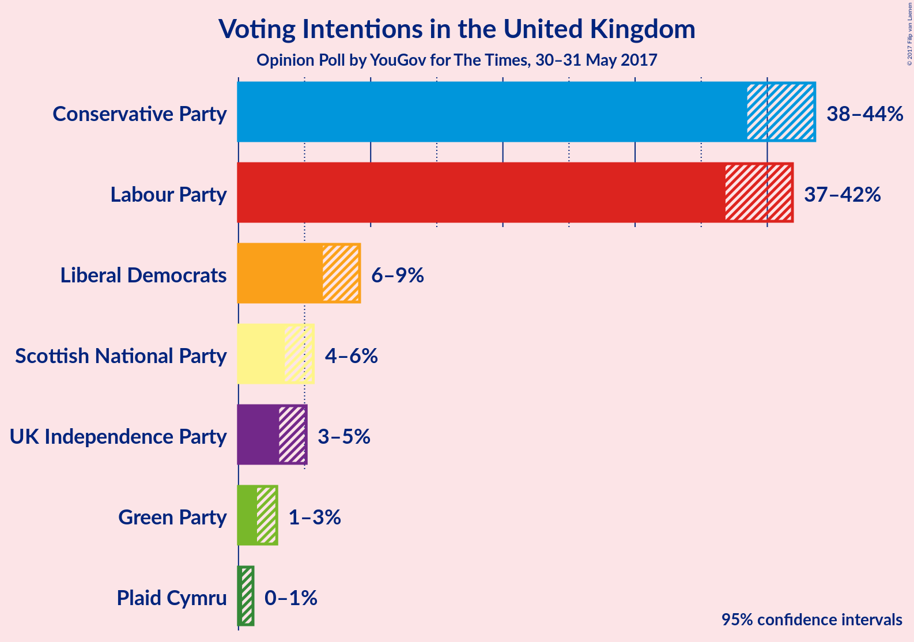
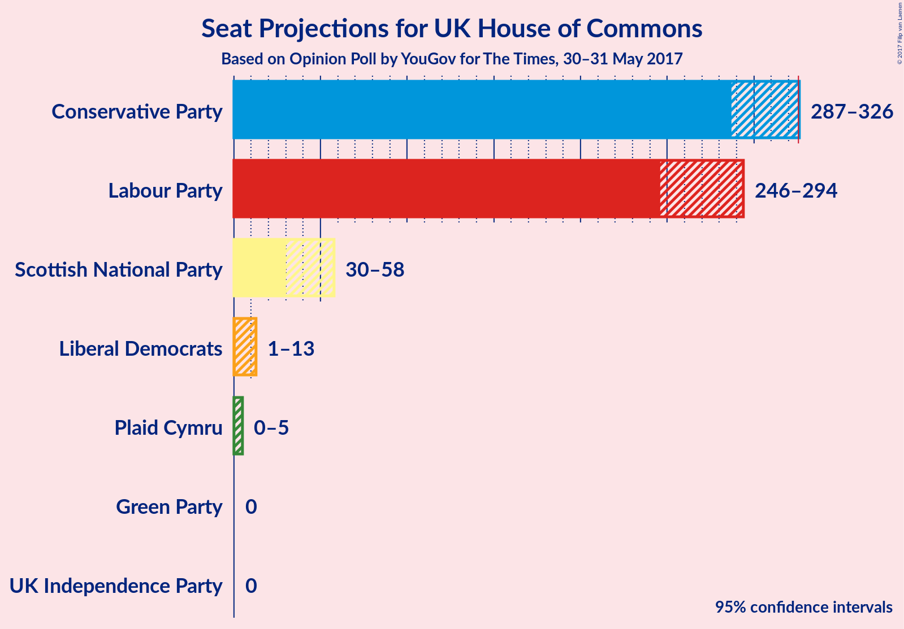
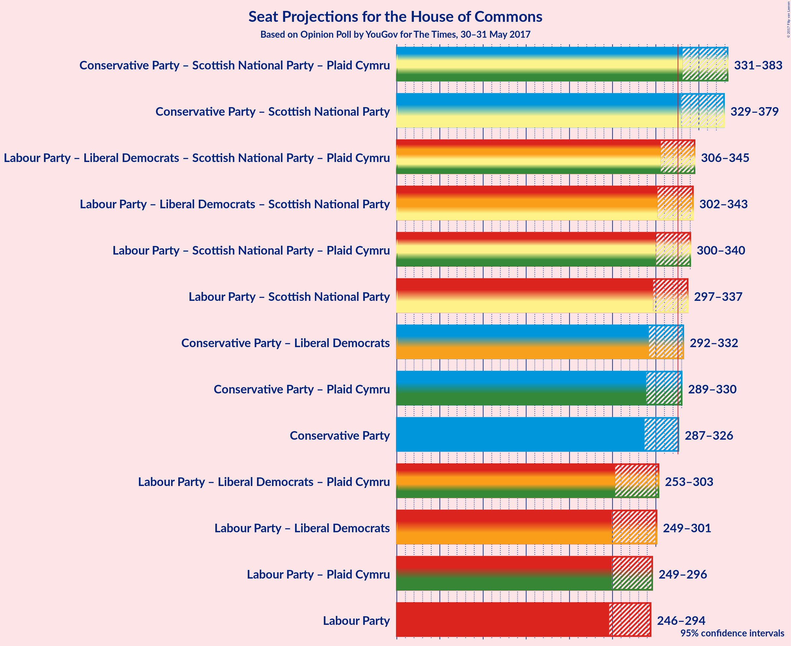

# Opinion Poll by YouGov for The Times, 30–31 May 2017

<a href="#voting-intentions">Voting Intentions</a> | <a href="#seats">Seats</a> | <a href="#coalitions">Coalitions</a> | <a href="#technical-information">Technical Information</a>

## Voting Intentions

### Confidence Intervals

| Party | Last Result | Poll Result | 80% Confidence Interval | 90% Confidence Interval | 95% Confidence Interval | 99% Confidence Interval |
|:-----:|:-----------:|:-----------:|:-----------------------:|:-----------------------:|:-----------------------:|:-----------------------:|
| Conservative Party | 36.9% | 41.4% | 39.4–42.7% |38.9–43.2% |38.5–43.6% |37.7–44.4% |
| Labour Party | 30.4% | 39.7% | 37.7–41.0% |37.2–41.5% |36.8–41.9% |36.1–42.7% |
| Liberal Democrats | 7.9% | 7.7% | 6.8–8.6% |6.6–8.9% |6.4–9.2% |6.0–9.6% |
| Scottish National Party | 4.7% | 4.5% | 3.8–5.2% |3.6–5.5% |3.5–5.7% |3.2–6.1% |
| UK Independence Party | 12.6% | 4.0% | 3.4–4.7% |3.2–4.9% |3.1–5.1% |2.8–5.5% |
| Green Party | 3.8% | 2.0% | 1.6–2.6% |1.5–2.7% |1.4–2.9% |1.2–3.2% |
| Plaid Cymru | 0.6% | 0.6% | 0.4–0.9% |0.3–1.0% |0.3–1.1% |0.2–1.3% |

*Note:* The poll result column reflects the actual value used in the calculations. Published results may vary slightly, and in addition be rounded to fewer digits.

## Seats

### Confidence Intervals

| Party | Last Result | 80% Confidence Interval | 90% Confidence Interval | 95% Confidence Interval | 99% Confidence Interval |
|:-----:|:-----------:|:-----------------------:|:-----------------------:|:-----------------------:|:-----------------------:|
| <a href="#conservative-party">Conservative Party</a> | 331 | 298–321 |291–323 |287–326 |277–334 |
| <a href="#labour-party">Labour Party</a> | 232 | 251–281 |248–287 |246–294 |237–307 |
| <a href="#liberal-democrats">Liberal Democrats</a> | 8 | 2–9 |2–11 |1–13 |1–17 |
| <a href="#scottish-national-party">Scottish National Party</a> | 56 | 38–56 |34–57 |30–58 |12–58 |
| <a href="#uk-independence-party">UK Independence Party</a> | 1 | 0 |0 |0 |0 |
| <a href="#green-party">Green Party</a> | 1 | 0 |0 |0 |0–1 |
| <a href="#plaid-cymru">Plaid Cymru</a> | 3 | 0–5 |0–5 |0–5 |0–5 |

### Conservative Party

| Number of Seats | Probability | Accumulated |
|:---------------:|:-----------:|:-----------:|
| 269 | 0% | 100% |
| 270 | 0% | 99.9% |
| 271 | 0% | 99.9% |
| 272 | 0% | 99.9% |
| 273 | 0% | 99.9% |
| 274 | 0.2% | 99.9% |
| 275 | 0.1% | 99.7% |
| 276 | 0.1% | 99.6% |
| 277 | 0.2% | 99.5% |
| 278 | 0.2% | 99.3% |
| 279 | 0.1% | 99.2% |
| 280 | 0.1% | 99.1% |
| 281 | 0.2% | 99.0% |
| 282 | 0.3% | 98.7% |
| 283 | 0.2% | 98% |
| 284 | 0.3% | 98% |
| 285 | 0.2% | 98% |
| 286 | 0.2% | 98% |
| 287 | 0.6% | 98% |
| 288 | 0.7% | 97% |
| 289 | 0.2% | 96% |
| 290 | 0.9% | 96% |
| 291 | 0.3% | 95% |
| 292 | 0.4% | 95% |
| 293 | 0.9% | 94% |
| 294 | 0.2% | 93% |
| 295 | 0.7% | 93% |
| 296 | 0.8% | 92% |
| 297 | 1.2% | 92% |
| 298 | 1.0% | 90% |
| 299 | 2% | 89% |
| 300 | 1.4% | 88% |
| 301 | 0.6% | 86% |
| 302 | 4% | 86% |
| 303 | 2% | 82% |
| 304 | 3% | 80% |
| 305 | 4% | 77% |
| 306 | 3% | 74% |
| 307 | 2% | 70% |
| 308 | 4% | 69% |
| 309 | 2% | 65% |
| 310 | 5% | 63% |
| 311 | 5% | 58% |
| 312 | 3% | 53% |
| 313 | 5% | 50% |
| 314 | 10% | 45% |
| 315 | 9% | 35% |
| 316 | 2% | 26% |
| 317 | 2% | 24% |
| 318 | 4% | 22% |
| 319 | 1.3% | 18% |
| 320 | 5% | 17% |
| 321 | 4% | 12% |
| 322 | 2% | 8% |
| 323 | 2% | 6% |
| 324 | 1.1% | 4% |
| 325 | 0.7% | 3% |
| 326 | 0.2% | 3% |
| 327 | 0.2% | 2% |
| 328 | 0.4% | 2% |
| 329 | 0.2% | 2% |
| 330 | 0.2% | 1.5% |
| 331 | 0.2% | 1.3% |
| 332 | 0.2% | 1.1% |
| 333 | 0.2% | 0.8% |
| 334 | 0.1% | 0.6% |
| 335 | 0.1% | 0.5% |
| 336 | 0.1% | 0.4% |
| 337 | 0.1% | 0.3% |
| 338 | 0% | 0.3% |
| 339 | 0% | 0.2% |
| 340 | 0.1% | 0.2% |
| 341 | 0% | 0.1% |
| 342 | 0% | 0.1% |
| 343 | 0% | 0.1% |
| 344 | 0% | 0.1% |
| 345 | 0% | 0.1% |
| 346 | 0% | 0% |

### Labour Party

| Number of Seats | Probability | Accumulated |
|:---------------:|:-----------:|:-----------:|
| 227 | 0% | 100% |
| 228 | 0% | 99.9% |
| 229 | 0% | 99.9% |
| 230 | 0% | 99.9% |
| 231 | 0% | 99.9% |
| 232 | 0% | 99.8% |
| 233 | 0% | 99.8% |
| 234 | 0.1% | 99.8% |
| 235 | 0.1% | 99.7% |
| 236 | 0.1% | 99.7% |
| 237 | 0.1% | 99.5% |
| 238 | 0.1% | 99.4% |
| 239 | 0.3% | 99.3% |
| 240 | 0.2% | 99.0% |
| 241 | 0.1% | 98.8% |
| 242 | 0.2% | 98.7% |
| 243 | 0.2% | 98% |
| 244 | 0.3% | 98% |
| 245 | 0.3% | 98% |
| 246 | 0.6% | 98% |
| 247 | 1.0% | 97% |
| 248 | 1.4% | 96% |
| 249 | 2% | 95% |
| 250 | 2% | 93% |
| 251 | 2% | 91% |
| 252 | 3% | 89% |
| 253 | 3% | 86% |
| 254 | 2% | 83% |
| 255 | 3% | 81% |
| 256 | 6% | 78% |
| 257 | 6% | 72% |
| 258 | 5% | 66% |
| 259 | 6% | 62% |
| 260 | 3% | 56% |
| 261 | 3% | 53% |
| 262 | 3% | 50% |
| 263 | 6% | 47% |
| 264 | 4% | 41% |
| 265 | 2% | 37% |
| 266 | 2% | 35% |
| 267 | 2% | 32% |
| 268 | 2% | 30% |
| 269 | 2% | 29% |
| 270 | 4% | 27% |
| 271 | 3% | 23% |
| 272 | 1.4% | 20% |
| 273 | 1.4% | 19% |
| 274 | 1.5% | 17% |
| 275 | 1.1% | 16% |
| 276 | 2% | 15% |
| 277 | 0.3% | 13% |
| 278 | 0.7% | 12% |
| 279 | 0.6% | 12% |
| 280 | 0.4% | 11% |
| 281 | 2% | 11% |
| 282 | 1.0% | 9% |
| 283 | 0.5% | 8% |
| 284 | 0.7% | 8% |
| 285 | 0.7% | 7% |
| 286 | 0.9% | 6% |
| 287 | 0.4% | 5% |
| 288 | 0.4% | 5% |
| 289 | 0.2% | 4% |
| 290 | 0.3% | 4% |
| 291 | 0.3% | 4% |
| 292 | 0.6% | 4% |
| 293 | 0.2% | 3% |
| 294 | 0.3% | 3% |
| 295 | 0.4% | 2% |
| 296 | 0.2% | 2% |
| 297 | 0.5% | 2% |
| 298 | 0.1% | 1.3% |
| 299 | 0% | 1.2% |
| 300 | 0.2% | 1.2% |
| 301 | 0.2% | 1.0% |
| 302 | 0.2% | 0.9% |
| 303 | 0% | 0.7% |
| 304 | 0.1% | 0.6% |
| 305 | 0% | 0.6% |
| 306 | 0% | 0.5% |
| 307 | 0.1% | 0.5% |
| 308 | 0.1% | 0.4% |
| 309 | 0.1% | 0.3% |
| 310 | 0% | 0.3% |
| 311 | 0% | 0.3% |
| 312 | 0% | 0.2% |
| 313 | 0% | 0.2% |
| 314 | 0% | 0.2% |
| 315 | 0% | 0.2% |
| 316 | 0% | 0.2% |
| 317 | 0% | 0.1% |
| 318 | 0% | 0.1% |
| 319 | 0% | 0.1% |
| 320 | 0% | 0.1% |
| 321 | 0% | 0.1% |
| 322 | 0% | 0.1% |
| 323 | 0% | 0% |

### Liberal Democrats

| Number of Seats | Probability | Accumulated |
|:---------------:|:-----------:|:-----------:|
| 0 | 0.1% | 100% |
| 1 | 4% | 99.9% |
| 2 | 9% | 96% |
| 3 | 21% | 87% |
| 4 | 17% | 65% |
| 5 | 8% | 49% |
| 6 | 11% | 40% |
| 7 | 10% | 29% |
| 8 | 7% | 19% |
| 9 | 4% | 12% |
| 10 | 3% | 9% |
| 11 | 1.3% | 6% |
| 12 | 2% | 5% |
| 13 | 1.2% | 3% |
| 14 | 0.9% | 2% |
| 15 | 0.3% | 1.2% |
| 16 | 0.2% | 0.9% |
| 17 | 0.4% | 0.7% |
| 18 | 0.2% | 0.4% |
| 19 | 0% | 0.2% |
| 20 | 0.1% | 0.2% |
| 21 | 0% | 0.1% |
| 22 | 0% | 0% |

### Scottish National Party

| Number of Seats | Probability | Accumulated |
|:---------------:|:-----------:|:-----------:|
| 6 | 0% | 100% |
| 7 | 0% | 99.9% |
| 8 | 0.1% | 99.9% |
| 9 | 0.1% | 99.8% |
| 10 | 0.1% | 99.7% |
| 11 | 0.1% | 99.6% |
| 12 | 0.1% | 99.5% |
| 13 | 0.1% | 99.4% |
| 14 | 0% | 99.3% |
| 15 | 0.1% | 99.3% |
| 16 | 0% | 99.2% |
| 17 | 0.1% | 99.1% |
| 18 | 0.1% | 99.0% |
| 19 | 0.2% | 98.9% |
| 20 | 0.1% | 98.8% |
| 21 | 0% | 98.7% |
| 22 | 0% | 98.6% |
| 23 | 0% | 98.6% |
| 24 | 0% | 98.6% |
| 25 | 0% | 98.5% |
| 26 | 0.2% | 98% |
| 27 | 0.2% | 98% |
| 28 | 0.3% | 98% |
| 29 | 0.2% | 98% |
| 30 | 0.3% | 98% |
| 31 | 0.2% | 97% |
| 32 | 0.6% | 97% |
| 33 | 0.8% | 96% |
| 34 | 0.6% | 96% |
| 35 | 1.4% | 95% |
| 36 | 1.0% | 94% |
| 37 | 0.4% | 93% |
| 38 | 3% | 92% |
| 39 | 0.7% | 89% |
| 40 | 1.5% | 89% |
| 41 | 0.8% | 87% |
| 42 | 2% | 86% |
| 43 | 0.9% | 84% |
| 44 | 0.2% | 83% |
| 45 | 0.4% | 83% |
| 46 | 2% | 83% |
| 47 | 0.5% | 81% |
| 48 | 1.5% | 80% |
| 49 | 4% | 79% |
| 50 | 9% | 75% |
| 51 | 15% | 65% |
| 52 | 11% | 50% |
| 53 | 5% | 40% |
| 54 | 10% | 35% |
| 55 | 10% | 25% |
| 56 | 7% | 15% |
| 57 | 4% | 8% |
| 58 | 4% | 4% |
| 59 | 0% | 0% |

### UK Independence Party

| Number of Seats | Probability | Accumulated |
|:---------------:|:-----------:|:-----------:|
| 0 | 100% | 100% |
| 1 | 0% | 0% |

### Green Party

| Number of Seats | Probability | Accumulated |
|:---------------:|:-----------:|:-----------:|
| 0 | 99.4% | 100% |
| 1 | 0.6% | 0.6% |
| 2 | 0% | 0% |

### Plaid Cymru

| Number of Seats | Probability | Accumulated |
|:---------------:|:-----------:|:-----------:|
| 0 | 11% | 100% |
| 1 | 14% | 89% |
| 2 | 10% | 75% |
| 3 | 35% | 65% |
| 4 | 10% | 30% |
| 5 | 20% | 21% |
| 6 | 0.1% | 0.3% |
| 7 | 0.2% | 0.2% |
| 8 | 0% | 0% |

## Coalitions

### Confidence Intervals

| Coalition | Last Result | 80% Confidence Interval | 90% Confidence Interval | 95% Confidence Interval | 99% Confidence Interval |
|:---------:|:-----------:|:-----------------------:|:-----------------------:|:-----------------------:|:-----------------------:|
| Conservative Party – Scottish National Party – Plaid Cymru | 390 | 345–377 | 338–380 | 331–383 | 318–391 |
| Conservative Party – Scottish National Party | 387 | 342–374 | 335–377 | 329–379 | 314–388 |
| Labour Party – Liberal Democrats – Scottish National Party – Plaid Cymru | 299 | 311–334 | 309–341 | 306–345 | 298–355 |
| Labour Party – Liberal Democrats – Scottish National Party | 296 | 308–332 | 305–339 | 302–343 | 294–353 |
| Labour Party – Scottish National Party – Plaid Cymru | 291 | 306–328 | 304–335 | 300–340 | 291–350 |
| Labour Party – Scottish National Party | 288 | 303–326 | 300–332 | 297–337 | 288–347 |
| Conservative Party – Liberal Democrats | 339 | 304–326 | 297–328 | 292–332 | 282–341 |
| Conservative Party – Plaid Cymru | 334 | 300–324 | 293–327 | 289–330 | 279–338 |
| Conservative Party | 331 | 298–321 | 291–323 | 287–326 | 277–334 |
| Labour Party – Liberal Democrats – Plaid Cymru | 243 | 258–290 | 255–297 | 253–303 | 244–318 |
| Labour Party – Liberal Democrats | 240 | 255–287 | 252–294 | 249–301 | 241–314 |
| Labour Party – Plaid Cymru | 235 | 254–284 | 251–290 | 249–296 | 240–308 |
| Labour Party | 232 | 251–281 | 248–287 | 246–294 | 237–307 |

## Technical Information

### Opinion Poll

+ **Pollster:** YouGov
+ **Media:** The Times
+ **Fieldwork period:** 30–31 May 2017

### Calculations

+ **Sample size:** 1422
+ **Simulations done:** 1,048,576
+ **Error estimate:** 0.79%

