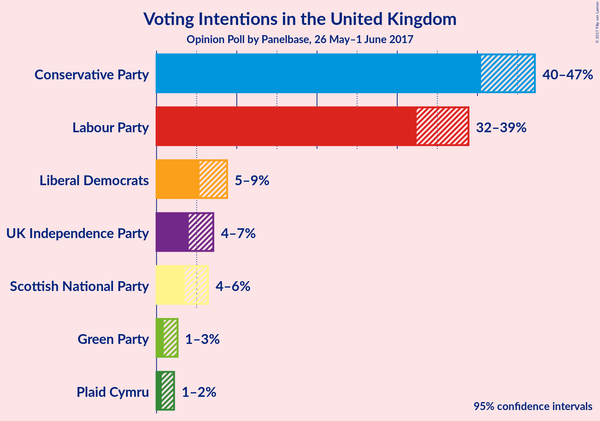
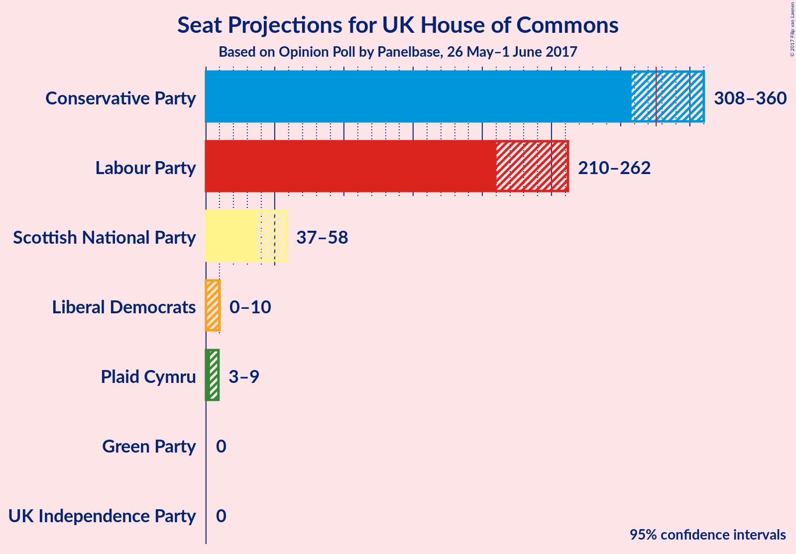
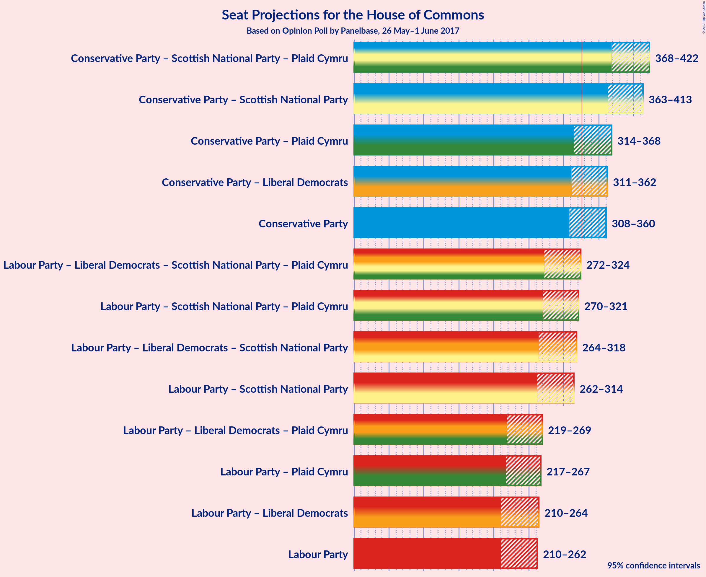

# Opinion Poll by Panelbase, 26 May–1 June 2017

<a href="#voting-intentions">Voting Intentions</a> | <a href="#seats">Seats</a> | <a href="#coalitions">Coalitions</a> | <a href="#technical-information">Technical Information</a>

## Voting Intentions

### Confidence Intervals

| Party | Last Result | Poll Result | 80% Confidence Interval | 90% Confidence Interval | 95% Confidence Interval | 99% Confidence Interval |
|:-----:|:-----------:|:-----------:|:-----------------------:|:-----------------------:|:-----------------------:|:-----------------------:|
| Conservative Party | 36.9% | 44.2% | 41.6–46.0% |41.0–46.6% |40.5–47.2% |39.4–48.2% |
| Labour Party | 30.4% | 35.9% | 33.5–37.8% |32.9–38.4% |32.4–38.9% |31.4–39.9% |
| Liberal Democrats | 7.9% | 6.9% | 5.9–8.1% |5.6–8.5% |5.3–8.8% |4.9–9.4% |
| UK Independence Party | 12.6% | 5.4% | 4.5–6.5% |4.2–6.8% |4.0–7.1% |3.6–7.7% |
| Scottish National Party | 4.7% | 4.8% | 3.9–5.8% |3.7–6.1% |3.5–6.4% |3.1–7.0% |
| Green Party | 3.8% | 1.6% | 1.1–2.2% |1.0–2.4% |0.9–2.6% |0.7–3.0% |
| Plaid Cymru | 0.6% | 1.2% | 0.8–1.8% |0.7–2.0% |0.6–2.2% |0.5–2.5% |

*Note:* The poll result column reflects the actual value used in the calculations. Published results may vary slightly, and in addition be rounded to fewer digits.

## Seats

### Confidence Intervals

| Party | Last Result | 80% Confidence Interval | 90% Confidence Interval | 95% Confidence Interval | 99% Confidence Interval |
|:-----:|:-----------:|:-----------------------:|:-----------------------:|:-----------------------:|:-----------------------:|
| <a href="#conservative-party">Conservative Party</a> | 331 | 321–351 |314–354 |308–360 |305–371 |
| <a href="#labour-party">Labour Party</a> | 232 | 217–251 |214–256 |210–262 |197–271 |
| <a href="#liberal-democrats">Liberal Democrats</a> | 8 | 1–6 |0–7 |0–10 |0–12 |
| <a href="#uk-independence-party">UK Independence Party</a> | 1 | 0 |0 |0 |0 |
| <a href="#scottish-national-party">Scottish National Party</a> | 56 | 46–56 |41–57 |37–58 |27–59 |
| <a href="#green-party">Green Party</a> | 1 | 0 |0 |0 |0–1 |
| <a href="#plaid-cymru">Plaid Cymru</a> | 3 | 5–7 |5–8 |3–9 |1–13 |

### Conservative Party

| Number of Seats | Probability | Accumulated |
|:---------------:|:-----------:|:-----------:|
| 288 | 0.1% | 100% |
| 289 | 0% | 99.9% |
| 290 | 0% | 99.9% |
| 291 | 0% | 99.9% |
| 292 | 0% | 99.9% |
| 293 | 0% | 99.9% |
| 294 | 0.1% | 99.9% |
| 295 | 0% | 99.8% |
| 296 | 0% | 99.8% |
| 297 | 0.1% | 99.8% |
| 298 | 0% | 99.7% |
| 299 | 0% | 99.7% |
| 300 | 0% | 99.7% |
| 301 | 0% | 99.6% |
| 302 | 0% | 99.6% |
| 303 | 0% | 99.6% |
| 304 | 0% | 99.6% |
| 305 | 0.2% | 99.6% |
| 306 | 0.1% | 99.4% |
| 307 | 0.7% | 99.3% |
| 308 | 2% | 98.6% |
| 309 | 0% | 97% |
| 310 | 0% | 97% |
| 311 | 0% | 97% |
| 312 | 0.1% | 97% |
| 313 | 2% | 97% |
| 314 | 0.2% | 95% |
| 315 | 0.1% | 95% |
| 316 | 0.2% | 95% |
| 317 | 0.4% | 95% |
| 318 | 1.1% | 94% |
| 319 | 0.4% | 93% |
| 320 | 3% | 93% |
| 321 | 2% | 90% |
| 322 | 0.8% | 88% |
| 323 | 0.4% | 87% |
| 324 | 3% | 87% |
| 325 | 0.4% | 84% |
| 326 | 0.1% | 84% |
| 327 | 0.1% | 84% |
| 328 | 0.8% | 83% |
| 329 | 2% | 83% |
| 330 | 5% | 80% |
| 331 | 0.2% | 76% |
| 332 | 0.4% | 76% |
| 333 | 19% | 75% |
| 334 | 1.1% | 56% |
| 335 | 0.1% | 55% |
| 336 | 2% | 55% |
| 337 | 8% | 53% |
| 338 | 0% | 45% |
| 339 | 0.5% | 45% |
| 340 | 0.2% | 44% |
| 341 | 8% | 44% |
| 342 | 12% | 36% |
| 343 | 0.1% | 24% |
| 344 | 3% | 24% |
| 345 | 2% | 21% |
| 346 | 0.1% | 19% |
| 347 | 2% | 19% |
| 348 | 5% | 17% |
| 349 | 0.7% | 12% |
| 350 | 0.8% | 11% |
| 351 | 1.3% | 11% |
| 352 | 2% | 9% |
| 353 | 2% | 8% |
| 354 | 0.7% | 6% |
| 355 | 0.2% | 5% |
| 356 | 0.1% | 5% |
| 357 | 1.3% | 5% |
| 358 | 0.4% | 3% |
| 359 | 0% | 3% |
| 360 | 0.9% | 3% |
| 361 | 0.1% | 2% |
| 362 | 0.2% | 2% |
| 363 | 0% | 2% |
| 364 | 0.4% | 2% |
| 365 | 0.1% | 1.4% |
| 366 | 0.2% | 1.3% |
| 367 | 0% | 1.1% |
| 368 | 0% | 1.0% |
| 369 | 0% | 1.0% |
| 370 | 0% | 1.0% |
| 371 | 0.5% | 1.0% |
| 372 | 0.2% | 0.5% |
| 373 | 0% | 0.3% |
| 374 | 0.1% | 0.3% |
| 375 | 0% | 0.2% |
| 376 | 0.1% | 0.2% |
| 377 | 0% | 0.1% |
| 378 | 0% | 0.1% |
| 379 | 0% | 0.1% |
| 380 | 0% | 0% |

### Labour Party

| Number of Seats | Probability | Accumulated |
|:---------------:|:-----------:|:-----------:|
| 191 | 0% | 100% |
| 192 | 0.1% | 99.9% |
| 193 | 0% | 99.8% |
| 194 | 0% | 99.8% |
| 195 | 0% | 99.8% |
| 196 | 0.1% | 99.8% |
| 197 | 0.3% | 99.7% |
| 198 | 0% | 99.4% |
| 199 | 0% | 99.4% |
| 200 | 0.1% | 99.3% |
| 201 | 0% | 99.2% |
| 202 | 0.3% | 99.2% |
| 203 | 0% | 99.0% |
| 204 | 0.4% | 99.0% |
| 205 | 0.1% | 98.6% |
| 206 | 0.3% | 98% |
| 207 | 0.3% | 98% |
| 208 | 0.1% | 98% |
| 209 | 0% | 98% |
| 210 | 1.1% | 98% |
| 211 | 0.1% | 97% |
| 212 | 0.8% | 97% |
| 213 | 0.1% | 96% |
| 214 | 1.2% | 96% |
| 215 | 1.2% | 94% |
| 216 | 1.1% | 93% |
| 217 | 3% | 92% |
| 218 | 1.1% | 90% |
| 219 | 0.7% | 89% |
| 220 | 2% | 88% |
| 221 | 0.6% | 86% |
| 222 | 0.4% | 85% |
| 223 | 12% | 85% |
| 224 | 0.1% | 73% |
| 225 | 0.6% | 73% |
| 226 | 2% | 72% |
| 227 | 0.7% | 70% |
| 228 | 0.4% | 69% |
| 229 | 3% | 69% |
| 230 | 9% | 66% |
| 231 | 0.6% | 57% |
| 232 | 0.4% | 56% |
| 233 | 8% | 56% |
| 234 | 0% | 48% |
| 235 | 0.3% | 48% |
| 236 | 12% | 48% |
| 237 | 1.0% | 36% |
| 238 | 0.1% | 35% |
| 239 | 2% | 34% |
| 240 | 5% | 33% |
| 241 | 1.1% | 27% |
| 242 | 3% | 26% |
| 243 | 5% | 23% |
| 244 | 0.4% | 19% |
| 245 | 0.3% | 18% |
| 246 | 2% | 18% |
| 247 | 2% | 16% |
| 248 | 0.6% | 14% |
| 249 | 3% | 13% |
| 250 | 0.3% | 10% |
| 251 | 2% | 10% |
| 252 | 0% | 8% |
| 253 | 0.6% | 8% |
| 254 | 1.1% | 7% |
| 255 | 1.2% | 6% |
| 256 | 0.1% | 5% |
| 257 | 0.4% | 5% |
| 258 | 0.2% | 5% |
| 259 | 0.5% | 4% |
| 260 | 0.2% | 4% |
| 261 | 0.1% | 4% |
| 262 | 3% | 4% |
| 263 | 0% | 0.9% |
| 264 | 0% | 0.9% |
| 265 | 0% | 0.9% |
| 266 | 0% | 0.9% |
| 267 | 0% | 0.8% |
| 268 | 0.1% | 0.8% |
| 269 | 0.1% | 0.7% |
| 270 | 0.1% | 0.6% |
| 271 | 0.1% | 0.5% |
| 272 | 0.2% | 0.5% |
| 273 | 0% | 0.2% |
| 274 | 0% | 0.2% |
| 275 | 0% | 0.2% |
| 276 | 0% | 0.2% |
| 277 | 0% | 0.2% |
| 278 | 0.1% | 0.2% |
| 279 | 0% | 0.1% |
| 280 | 0% | 0.1% |
| 281 | 0% | 0% |

### Liberal Democrats

| Number of Seats | Probability | Accumulated |
|:---------------:|:-----------:|:-----------:|
| 0 | 5% | 100% |
| 1 | 23% | 95% |
| 2 | 34% | 72% |
| 3 | 5% | 38% |
| 4 | 6% | 33% |
| 5 | 15% | 27% |
| 6 | 5% | 12% |
| 7 | 3% | 7% |
| 8 | 0.6% | 4% |
| 9 | 1.2% | 4% |
| 10 | 1.1% | 3% |
| 11 | 0.1% | 1.5% |
| 12 | 1.0% | 1.4% |
| 13 | 0.2% | 0.4% |
| 14 | 0% | 0.2% |
| 15 | 0.1% | 0.2% |
| 16 | 0% | 0.1% |
| 17 | 0% | 0.1% |
| 18 | 0.1% | 0.1% |
| 19 | 0% | 0% |

### UK Independence Party

| Number of Seats | Probability | Accumulated |
|:---------------:|:-----------:|:-----------:|
| 0 | 100% | 100% |
| 1 | 0% | 0% |

### Scottish National Party

| Number of Seats | Probability | Accumulated |
|:---------------:|:-----------:|:-----------:|
| 9 | 0.1% | 100% |
| 10 | 0% | 99.8% |
| 11 | 0% | 99.8% |
| 12 | 0% | 99.8% |
| 13 | 0% | 99.8% |
| 14 | 0% | 99.8% |
| 15 | 0% | 99.8% |
| 16 | 0% | 99.8% |
| 17 | 0% | 99.8% |
| 18 | 0% | 99.8% |
| 19 | 0% | 99.8% |
| 20 | 0% | 99.8% |
| 21 | 0% | 99.8% |
| 22 | 0% | 99.8% |
| 23 | 0% | 99.8% |
| 24 | 0.1% | 99.8% |
| 25 | 0% | 99.7% |
| 26 | 0.2% | 99.7% |
| 27 | 0% | 99.5% |
| 28 | 0.2% | 99.5% |
| 29 | 0.4% | 99.3% |
| 30 | 0% | 98.9% |
| 31 | 0% | 98.9% |
| 32 | 0% | 98.9% |
| 33 | 0.1% | 98.9% |
| 34 | 0.5% | 98.8% |
| 35 | 0.1% | 98% |
| 36 | 0.1% | 98% |
| 37 | 3% | 98% |
| 38 | 0% | 96% |
| 39 | 0% | 95% |
| 40 | 0.1% | 95% |
| 41 | 0.4% | 95% |
| 42 | 0.5% | 95% |
| 43 | 0% | 95% |
| 44 | 0% | 95% |
| 45 | 0.2% | 94% |
| 46 | 5% | 94% |
| 47 | 2% | 89% |
| 48 | 0.6% | 87% |
| 49 | 1.0% | 86% |
| 50 | 6% | 85% |
| 51 | 2% | 79% |
| 52 | 2% | 77% |
| 53 | 8% | 75% |
| 54 | 23% | 67% |
| 55 | 21% | 44% |
| 56 | 15% | 22% |
| 57 | 4% | 8% |
| 58 | 2% | 3% |
| 59 | 2% | 2% |
| 60 | 0% | 0% |

### Green Party

| Number of Seats | Probability | Accumulated |
|:---------------:|:-----------:|:-----------:|
| 0 | 99.5% | 100% |
| 1 | 0.5% | 0.5% |
| 2 | 0% | 0% |

### Plaid Cymru

| Number of Seats | Probability | Accumulated |
|:---------------:|:-----------:|:-----------:|
| 0 | 0.1% | 100% |
| 1 | 0.4% | 99.9% |
| 2 | 0.1% | 99.5% |
| 3 | 3% | 99.4% |
| 4 | 0.7% | 97% |
| 5 | 48% | 96% |
| 6 | 5% | 48% |
| 7 | 36% | 43% |
| 8 | 5% | 8% |
| 9 | 1.0% | 3% |
| 10 | 0.4% | 2% |
| 11 | 0.9% | 2% |
| 12 | 0% | 0.8% |
| 13 | 0.4% | 0.7% |
| 14 | 0% | 0.3% |
| 15 | 0.2% | 0.3% |
| 16 | 0.1% | 0.1% |
| 17 | 0.1% | 0.1% |
| 18 | 0% | 0% |

## Coalitions

### Confidence Intervals

| Coalition | Last Result | 80% Confidence Interval | 90% Confidence Interval | 95% Confidence Interval | 99% Confidence Interval |
|:---------:|:-----------:|:-----------------------:|:-----------------------:|:-----------------------:|:-----------------------:|
| Conservative Party – Scottish National Party – Plaid Cymru | 390 | 378–410 | 371–416 | 368–422 | 357–433 |
| Conservative Party – Scottish National Party | 387 | 372–403 | 365–408 | 363–413 | 352–425 |
| Conservative Party – Plaid Cymru | 334 | 327–358 | 321–362 | 314–368 | 310–379 |
| Conservative Party – Liberal Democrats | 339 | 323–356 | 320–358 | 311–362 | 310–374 |
| Conservative Party | 331 | 321–351 | 314–354 | 308–360 | 305–371 |
| Labour Party – Liberal Democrats – Scottish National Party – Plaid Cymru | 299 | 281–311 | 278–318 | 272–324 | 261–327 |
| Labour Party – Scottish National Party – Plaid Cymru | 291 | 276–309 | 273–312 | 270–321 | 258–322 |
| Labour Party – Liberal Democrats – Scottish National Party | 296 | 274–305 | 270–311 | 264–318 | 253–322 |
| Labour Party – Scottish National Party | 288 | 270–303 | 267–306 | 262–314 | 250–317 |
| Labour Party – Liberal Democrats – Plaid Cymru | 243 | 229–260 | 224–267 | 219–269 | 207–280 |
| Labour Party – Plaid Cymru | 235 | 224–257 | 221–263 | 217–267 | 206–277 |
| Labour Party – Liberal Democrats | 240 | 222–254 | 216–261 | 210–264 | 199–275 |
| Labour Party | 232 | 217–251 | 214–256 | 210–262 | 197–271 |

## Technical Information

### Opinion Poll

+ **Pollster:** Panelbase
+ **Media:** —
+ **Fieldwork period:** 26 May–1 June 2017

### Calculations

+ **Sample size:** 835
+ **Simulations done:** 65,536
+ **Error estimate:** 1.17%

