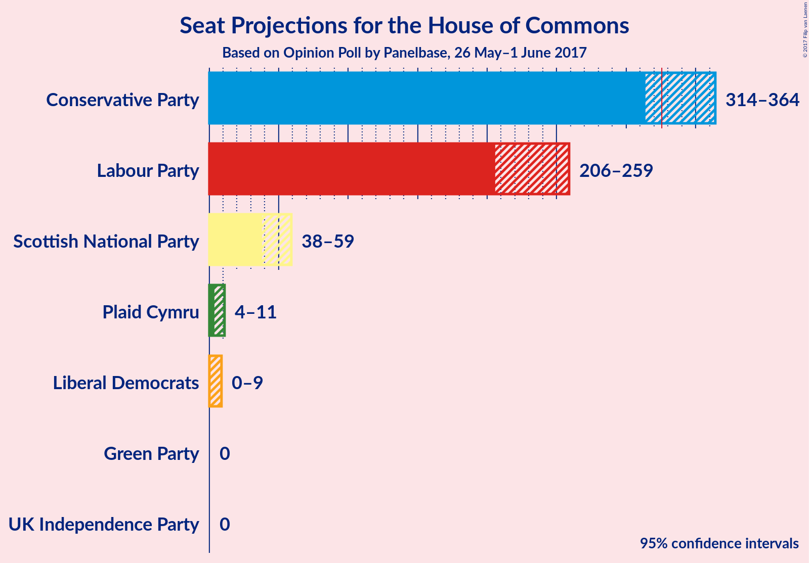

# Opinion Poll by Panelbase, 26 May–1 June 2017

<a href="#voting-intentions">Voting Intentions</a> | <a href="#seats">Seats</a> | <a href="#coalitions">Coalitions</a> | <a href="#technical-information">Technical Information</a>

## Voting Intentions

### Confidence Intervals

| Party | Last Result | Poll Result | 80% Confidence Interval | 90% Confidence Interval | 95% Confidence Interval | 99% Confidence Interval |
|:-----:|:-----------:|:-----------:|:-----------------------:|:-----------------------:|:-----------------------:|:-----------------------:|
| Conservative Party | 36.9% | 44.2% | 41.6–46.0% |41.0–46.6% |40.5–47.2% |39.4–48.2% |
| Labour Party | 30.4% | 35.9% | 33.5–37.8% |32.9–38.4% |32.4–38.9% |31.4–39.9% |
| Liberal Democrats | 7.9% | 6.9% | 5.9–8.1% |5.6–8.5% |5.3–8.8% |4.9–9.4% |
| UK Independence Party | 12.6% | 5.4% | 4.5–6.5% |4.2–6.8% |4.0–7.1% |3.6–7.7% |
| Scottish National Party | 4.7% | 4.8% | 3.9–5.8% |3.7–6.1% |3.5–6.4% |3.1–7.0% |
| Green Party | 3.8% | 1.6% | 1.1–2.2% |1.0–2.4% |0.9–2.6% |0.7–3.0% |
| Plaid Cymru | 0.6% | 1.2% | 0.8–1.8% |0.7–2.0% |0.6–2.2% |0.5–2.5% |

*Note:* The poll result column reflects the actual value used in the calculations. Published results may vary slightly, and in addition be rounded to fewer digits.

## Seats

### Confidence Intervals

| Party | Last Result | 80% Confidence Interval | 90% Confidence Interval | 95% Confidence Interval | 99% Confidence Interval |
|:-----:|:-----------:|:-----------------------:|:-----------------------:|:-----------------------:|:-----------------------:|
| <a href="#conservative-party">Conservative Party</a> | 331 | 320–353 |316–357 |314–364 |306–372 |
| <a href="#labour-party">Labour Party</a> | 232 | 215–250 |211–254 |206–259 |195–271 |
| <a href="#liberal-democrats">Liberal Democrats</a> | 8 | 0–6 |0–8 |0–9 |0–13 |
| <a href="#uk-independence-party">UK Independence Party</a> | 1 | 0 |0 |0 |0 |
| <a href="#scottish-national-party">Scottish National Party</a> | 56 | 49–58 |46–58 |38–59 |22–59 |
| <a href="#green-party">Green Party</a> | 1 | 0 |0 |0 |0–1 |
| <a href="#plaid-cymru">Plaid Cymru</a> | 3 | 5–8 |4–10 |4–11 |3–13 |

### Conservative Party

| Number of Seats | Probability | Accumulated |
|:---------------:|:-----------:|:-----------:|
| 293 | 0% | 100% |
| 294 | 0% | 99.9% |
| 295 | 0% | 99.9% |
| 296 | 0% | 99.9% |
| 297 | 0% | 99.9% |
| 298 | 0% | 99.9% |
| 299 | 0% | 99.9% |
| 300 | 0% | 99.8% |
| 301 | 0% | 99.8% |
| 302 | 0% | 99.8% |
| 303 | 0% | 99.7% |
| 304 | 0% | 99.7% |
| 305 | 0.1% | 99.7% |
| 306 | 0.1% | 99.6% |
| 307 | 0.1% | 99.5% |
| 308 | 0.2% | 99.3% |
| 309 | 0.1% | 99.1% |
| 310 | 0.1% | 99.0% |
| 311 | 0.3% | 98.9% |
| 312 | 0.6% | 98.6% |
| 313 | 0.4% | 98% |
| 314 | 0.8% | 98% |
| 315 | 1.0% | 97% |
| 316 | 1.1% | 96% |
| 317 | 0.8% | 95% |
| 318 | 1.3% | 94% |
| 319 | 1.2% | 92% |
| 320 | 3% | 91% |
| 321 | 2% | 88% |
| 322 | 3% | 86% |
| 323 | 1.1% | 83% |
| 324 | 4% | 82% |
| 325 | 3% | 78% |
| 326 | 1.2% | 75% |
| 327 | 2% | 74% |
| 328 | 1.3% | 73% |
| 329 | 1.2% | 71% |
| 330 | 1.1% | 70% |
| 331 | 1.2% | 69% |
| 332 | 2% | 68% |
| 333 | 5% | 66% |
| 334 | 3% | 61% |
| 335 | 1.4% | 58% |
| 336 | 3% | 57% |
| 337 | 2% | 54% |
| 338 | 3% | 52% |
| 339 | 1.4% | 49% |
| 340 | 4% | 48% |
| 341 | 2% | 44% |
| 342 | 4% | 42% |
| 343 | 2% | 38% |
| 344 | 2% | 36% |
| 345 | 1.2% | 34% |
| 346 | 1.5% | 33% |
| 347 | 2% | 31% |
| 348 | 4% | 29% |
| 349 | 4% | 25% |
| 350 | 5% | 22% |
| 351 | 4% | 16% |
| 352 | 1.5% | 12% |
| 353 | 2% | 11% |
| 354 | 1.4% | 9% |
| 355 | 1.1% | 8% |
| 356 | 1.4% | 7% |
| 357 | 1.2% | 6% |
| 358 | 0.7% | 4% |
| 359 | 0.1% | 4% |
| 360 | 0.2% | 4% |
| 361 | 0.1% | 3% |
| 362 | 0.4% | 3% |
| 363 | 0.2% | 3% |
| 364 | 0.2% | 3% |
| 365 | 0.8% | 2% |
| 366 | 0.4% | 2% |
| 367 | 0.2% | 1.3% |
| 368 | 0.2% | 1.1% |
| 369 | 0.2% | 0.9% |
| 370 | 0.1% | 0.7% |
| 371 | 0.1% | 0.6% |
| 372 | 0.1% | 0.6% |
| 373 | 0.1% | 0.5% |
| 374 | 0% | 0.4% |
| 375 | 0.1% | 0.3% |
| 376 | 0% | 0.3% |
| 377 | 0.1% | 0.2% |
| 378 | 0% | 0.2% |
| 379 | 0% | 0.1% |
| 380 | 0% | 0.1% |
| 381 | 0% | 0.1% |
| 382 | 0% | 0.1% |
| 383 | 0% | 0% |

### Labour Party

| Number of Seats | Probability | Accumulated |
|:---------------:|:-----------:|:-----------:|
| 185 | 0% | 100% |
| 186 | 0% | 99.9% |
| 187 | 0% | 99.9% |
| 188 | 0% | 99.9% |
| 189 | 0% | 99.9% |
| 190 | 0% | 99.8% |
| 191 | 0% | 99.8% |
| 192 | 0.1% | 99.8% |
| 193 | 0% | 99.7% |
| 194 | 0.1% | 99.7% |
| 195 | 0.1% | 99.6% |
| 196 | 0% | 99.5% |
| 197 | 0.1% | 99.4% |
| 198 | 0.1% | 99.3% |
| 199 | 0.3% | 99.3% |
| 200 | 0.2% | 99.0% |
| 201 | 0.1% | 98.8% |
| 202 | 0.2% | 98.6% |
| 203 | 0.4% | 98% |
| 204 | 0.3% | 98% |
| 205 | 0.1% | 98% |
| 206 | 0.7% | 98% |
| 207 | 0.2% | 97% |
| 208 | 0.4% | 97% |
| 209 | 0.4% | 96% |
| 210 | 0.8% | 96% |
| 211 | 0.2% | 95% |
| 212 | 0.8% | 95% |
| 213 | 2% | 94% |
| 214 | 1.1% | 92% |
| 215 | 2% | 91% |
| 216 | 1.4% | 90% |
| 217 | 4% | 88% |
| 218 | 2% | 85% |
| 219 | 5% | 82% |
| 220 | 4% | 78% |
| 221 | 3% | 74% |
| 222 | 1.2% | 71% |
| 223 | 3% | 69% |
| 224 | 0.6% | 66% |
| 225 | 2% | 66% |
| 226 | 3% | 64% |
| 227 | 1.0% | 61% |
| 228 | 4% | 60% |
| 229 | 2% | 55% |
| 230 | 1.4% | 53% |
| 231 | 4% | 52% |
| 232 | 2% | 48% |
| 233 | 3% | 46% |
| 234 | 2% | 43% |
| 235 | 1.1% | 41% |
| 236 | 1.5% | 40% |
| 237 | 2% | 38% |
| 238 | 2% | 36% |
| 239 | 2% | 34% |
| 240 | 2% | 32% |
| 241 | 1.4% | 30% |
| 242 | 1.4% | 29% |
| 243 | 2% | 27% |
| 244 | 3% | 25% |
| 245 | 3% | 22% |
| 246 | 1.2% | 19% |
| 247 | 3% | 18% |
| 248 | 2% | 15% |
| 249 | 2% | 14% |
| 250 | 3% | 12% |
| 251 | 1.3% | 9% |
| 252 | 0.5% | 8% |
| 253 | 1.4% | 7% |
| 254 | 0.6% | 6% |
| 255 | 0.8% | 5% |
| 256 | 0.8% | 4% |
| 257 | 0.2% | 3% |
| 258 | 0.5% | 3% |
| 259 | 0.4% | 3% |
| 260 | 0.2% | 2% |
| 261 | 0.2% | 2% |
| 262 | 0.5% | 2% |
| 263 | 0.2% | 1.3% |
| 264 | 0.1% | 1.1% |
| 265 | 0.1% | 1.0% |
| 266 | 0.1% | 0.9% |
| 267 | 0% | 0.8% |
| 268 | 0.1% | 0.8% |
| 269 | 0% | 0.7% |
| 270 | 0.1% | 0.7% |
| 271 | 0.1% | 0.6% |
| 272 | 0% | 0.5% |
| 273 | 0% | 0.5% |
| 274 | 0.1% | 0.4% |
| 275 | 0% | 0.4% |
| 276 | 0% | 0.3% |
| 277 | 0% | 0.3% |
| 278 | 0% | 0.2% |
| 279 | 0% | 0.2% |
| 280 | 0% | 0.2% |
| 281 | 0% | 0.2% |
| 282 | 0% | 0.2% |
| 283 | 0% | 0.1% |
| 284 | 0% | 0.1% |
| 285 | 0% | 0.1% |
| 286 | 0% | 0.1% |
| 287 | 0% | 0.1% |
| 288 | 0% | 0% |

### Liberal Democrats

| Number of Seats | Probability | Accumulated |
|:---------------:|:-----------:|:-----------:|
| 0 | 14% | 100% |
| 1 | 32% | 86% |
| 2 | 19% | 54% |
| 3 | 10% | 35% |
| 4 | 9% | 25% |
| 5 | 5% | 16% |
| 6 | 4% | 11% |
| 7 | 2% | 8% |
| 8 | 2% | 5% |
| 9 | 1.1% | 3% |
| 10 | 0.7% | 2% |
| 11 | 0.3% | 1.3% |
| 12 | 0.4% | 1.0% |
| 13 | 0.2% | 0.6% |
| 14 | 0.1% | 0.3% |
| 15 | 0.1% | 0.2% |
| 16 | 0% | 0.1% |
| 17 | 0% | 0.1% |
| 18 | 0% | 0.1% |
| 19 | 0% | 0% |

### UK Independence Party

| Number of Seats | Probability | Accumulated |
|:---------------:|:-----------:|:-----------:|
| 0 | 100% | 100% |
| 1 | 0% | 0% |

### Scottish National Party

| Number of Seats | Probability | Accumulated |
|:---------------:|:-----------:|:-----------:|
| 7 | 0% | 100% |
| 8 | 0% | 99.9% |
| 9 | 0% | 99.9% |
| 10 | 0% | 99.9% |
| 11 | 0% | 99.9% |
| 12 | 0% | 99.9% |
| 13 | 0% | 99.9% |
| 14 | 0% | 99.8% |
| 15 | 0% | 99.8% |
| 16 | 0% | 99.8% |
| 17 | 0% | 99.8% |
| 18 | 0% | 99.8% |
| 19 | 0% | 99.7% |
| 20 | 0.1% | 99.7% |
| 21 | 0.1% | 99.6% |
| 22 | 0% | 99.5% |
| 23 | 0% | 99.5% |
| 24 | 0% | 99.5% |
| 25 | 0.1% | 99.4% |
| 26 | 0.1% | 99.4% |
| 27 | 0% | 99.3% |
| 28 | 0.1% | 99.3% |
| 29 | 0.1% | 99.2% |
| 30 | 0.1% | 99.1% |
| 31 | 0.4% | 99.0% |
| 32 | 0.1% | 98.6% |
| 33 | 0.1% | 98.5% |
| 34 | 0.1% | 98% |
| 35 | 0.1% | 98% |
| 36 | 0.1% | 98% |
| 37 | 0.4% | 98% |
| 38 | 0.4% | 98% |
| 39 | 0.4% | 97% |
| 40 | 0.1% | 97% |
| 41 | 0.1% | 97% |
| 42 | 0.2% | 97% |
| 43 | 0.3% | 97% |
| 44 | 0.2% | 96% |
| 45 | 0.6% | 96% |
| 46 | 1.1% | 96% |
| 47 | 1.1% | 94% |
| 48 | 2% | 93% |
| 49 | 3% | 92% |
| 50 | 2% | 89% |
| 51 | 4% | 87% |
| 52 | 5% | 83% |
| 53 | 4% | 78% |
| 54 | 10% | 74% |
| 55 | 15% | 64% |
| 56 | 31% | 48% |
| 57 | 7% | 17% |
| 58 | 7% | 10% |
| 59 | 3% | 3% |
| 60 | 0% | 0% |

### Green Party

| Number of Seats | Probability | Accumulated |
|:---------------:|:-----------:|:-----------:|
| 0 | 98.9% | 100% |
| 1 | 1.1% | 1.1% |
| 2 | 0% | 0% |

### Plaid Cymru

| Number of Seats | Probability | Accumulated |
|:---------------:|:-----------:|:-----------:|
| 0 | 0.1% | 100% |
| 1 | 0.1% | 99.9% |
| 2 | 0.1% | 99.8% |
| 3 | 2% | 99.7% |
| 4 | 4% | 98% |
| 5 | 41% | 94% |
| 6 | 7% | 53% |
| 7 | 32% | 46% |
| 8 | 8% | 15% |
| 9 | 1.1% | 7% |
| 10 | 1.4% | 5% |
| 11 | 3% | 4% |
| 12 | 0% | 0.9% |
| 13 | 0.3% | 0.8% |
| 14 | 0% | 0.5% |
| 15 | 0.3% | 0.5% |
| 16 | 0.1% | 0.1% |
| 17 | 0% | 0.1% |
| 18 | 0% | 0% |

## Coalitions

### Confidence Intervals

| Coalition | Last Result | 80% Confidence Interval | 90% Confidence Interval | 95% Confidence Interval | 99% Confidence Interval |
|:---------:|:-----------:|:-----------------------:|:-----------------------:|:-----------------------:|:-----------------------:|
| Conservative Party – Scottish National Party – Plaid Cymru | 390 | 379–414 | 375–418 | 370–424 | 355–433 |
| Conservative Party – Scottish National Party | 387 | 373–408 | 369–411 | 364–418 | 350–426 |
| Conservative Party – Plaid Cymru | 334 | 325–360 | 322–364 | 319–370 | 312–379 |
| Conservative Party – Liberal Democrats | 339 | 322–356 | 319–360 | 316–367 | 308–376 |
| Conservative Party | 331 | 320–353 | 316–357 | 314–364 | 306–372 |
| Labour Party – Liberal Democrats – Scottish National Party – Plaid Cymru | 299 | 279–312 | 275–316 | 267–318 | 260–326 |
| Labour Party – Scottish National Party – Plaid Cymru | 291 | 276–310 | 272–313 | 265–316 | 256–324 |
| Labour Party – Liberal Democrats – Scottish National Party | 296 | 272–307 | 268–310 | 262–313 | 253–320 |
| Labour Party – Scottish National Party | 288 | 269–304 | 265–308 | 259–310 | 249–317 |
| Labour Party – Liberal Democrats – Plaid Cymru | 243 | 224–259 | 221–263 | 214–268 | 206–282 |
| Labour Party – Plaid Cymru | 235 | 222–256 | 218–260 | 211–264 | 203–277 |
| Labour Party – Liberal Democrats | 240 | 218–253 | 214–257 | 208–262 | 199–277 |
| Labour Party | 232 | 215–250 | 211–254 | 206–259 | 195–271 |

## Technical Information

### Opinion Poll

+ **Pollster:** Panelbase
+ **Media:** —
+ **Fieldwork period:** 26 May–1 June 2017

### Calculations

+ **Sample size:** 835
+ **Simulations done:** 1,048,576
+ **Error estimate:** 0.91%

