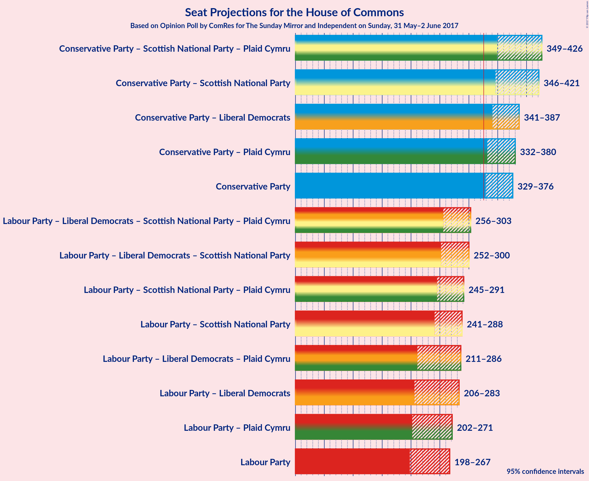

# Opinion Poll by ComRes for The Sunday Mirror and Independent on Sunday, 31 May–2 June 2017

<a href="#voting-intentions">Voting Intentions</a> | <a href="#seats">Seats</a> | <a href="#coalitions">Coalitions</a> | <a href="#technical-information">Technical Information</a>

## Voting Intentions

### Confidence Intervals

| Party | Last Result | Poll Result | 80% Confidence Interval | 90% Confidence Interval | 95% Confidence Interval | 99% Confidence Interval |
|:-----:|:-----------:|:-----------:|:-----------------------:|:-----------------------:|:-----------------------:|:-----------------------:|
| Conservative Party | 36.9% | 48.0% | 45.6–48.4% |45.2–48.8% |44.8–49.2% |44.2–49.9% |
| Labour Party | 30.4% | 35.7% | 33.6–36.4% |33.3–36.7% |32.9–37.1% |32.3–37.8% |
| Liberal Democrats | 7.9% | 8.2% | 7.3–8.8% |7.1–9.1% |6.9–9.3% |6.6–9.7% |
| UK Independence Party | 12.6% | 4.1% | 3.5–4.6% |3.4–4.8% |3.2–5.0% |3.0–5.3% |
| Scottish National Party | 4.7% | 3.1% | 2.6–3.5% |2.4–3.7% |2.3–3.8% |2.1–4.1% |
| Green Party | 3.8% | 1.0% | 0.7–1.3% |0.7–1.4% |0.6–1.5% |0.5–1.7% |

*Note:* The poll result column reflects the actual value used in the calculations. Published results may vary slightly, and in addition be rounded to fewer digits.

## Seats

### Confidence Intervals

| Party | Last Result | 80% Confidence Interval | 90% Confidence Interval | 95% Confidence Interval | 99% Confidence Interval |
|:-----:|:-----------:|:-----------------------:|:-----------------------:|:-----------------------:|:-----------------------:|
| <a href="#conservative-party">Conservative Party</a> | 331 | 346–369 |343–372 |340–375 |334–381 |
| <a href="#labour-party">Labour Party</a> | 232 | 221–258 |216–264 |211–267 |204–275 |
| <a href="#liberal-democrats">Liberal Democrats</a> | 8 | 8–14 |6–16 |5–17 |3–17 |
| <a href="#uk-independence-party">UK Independence Party</a> | 1 | 0 |0 |0 |0 |
| <a href="#scottish-national-party">Scottish National Party</a> | 56 | 4–41 |3–45 |2–46 |2–50 |
| <a href="#green-party">Green Party</a> | 1 | 0 |0 |0 |0 |

### Conservative Party

| Number of Seats | Probability | Accumulated |
|:---------------:|:-----------:|:-----------:|
| 326 | 0% | 100% |
| 327 | 0% | 99.9% |
| 328 | 0% | 99.9% |
| 329 | 0.1% | 99.9% |
| 330 | 0% | 99.8% |
| 331 | 0.1% | 99.8% |
| 332 | 0.1% | 99.7% |
| 333 | 0.1% | 99.6% |
| 334 | 0.2% | 99.5% |
| 335 | 0.1% | 99.4% |
| 336 | 0.2% | 99.2% |
| 337 | 0.6% | 99.0% |
| 338 | 0.3% | 98% |
| 339 | 0.5% | 98% |
| 340 | 0.2% | 98% |
| 341 | 0.7% | 97% |
| 342 | 1.0% | 97% |
| 343 | 0.8% | 96% |
| 344 | 1.0% | 95% |
| 345 | 2% | 94% |
| 346 | 2% | 92% |
| 347 | 2% | 90% |
| 348 | 2% | 88% |
| 349 | 2% | 87% |
| 350 | 2% | 85% |
| 351 | 4% | 83% |
| 352 | 5% | 79% |
| 353 | 6% | 74% |
| 354 | 8% | 68% |
| 355 | 7% | 60% |
| 356 | 7% | 53% |
| 357 | 4% | 46% |
| 358 | 5% | 42% |
| 359 | 6% | 37% |
| 360 | 3% | 31% |
| 361 | 6% | 28% |
| 362 | 4% | 22% |
| 363 | 2% | 18% |
| 364 | 0.9% | 16% |
| 365 | 2% | 15% |
| 366 | 0.8% | 13% |
| 367 | 1.0% | 12% |
| 368 | 0.8% | 11% |
| 369 | 0.8% | 10% |
| 370 | 2% | 9% |
| 371 | 1.0% | 8% |
| 372 | 2% | 7% |
| 373 | 0.7% | 4% |
| 374 | 1.2% | 4% |
| 375 | 0.5% | 3% |
| 376 | 0.6% | 2% |
| 377 | 0.4% | 1.4% |
| 378 | 0.1% | 1.0% |
| 379 | 0.2% | 0.9% |
| 380 | 0.2% | 0.7% |
| 381 | 0.1% | 0.5% |
| 382 | 0.1% | 0.4% |
| 383 | 0.1% | 0.3% |
| 384 | 0% | 0.2% |
| 385 | 0.1% | 0.2% |
| 386 | 0% | 0.1% |
| 387 | 0% | 0.1% |
| 388 | 0% | 0% |

### Labour Party

| Number of Seats | Probability | Accumulated |
|:---------------:|:-----------:|:-----------:|
| 195 | 0% | 100% |
| 196 | 0% | 99.9% |
| 197 | 0% | 99.9% |
| 198 | 0% | 99.9% |
| 199 | 0% | 99.9% |
| 200 | 0.1% | 99.9% |
| 201 | 0% | 99.7% |
| 202 | 0% | 99.7% |
| 203 | 0.2% | 99.7% |
| 204 | 0.2% | 99.5% |
| 205 | 0.2% | 99.3% |
| 206 | 0.2% | 99.1% |
| 207 | 0.4% | 98.9% |
| 208 | 0.2% | 98% |
| 209 | 0.5% | 98% |
| 210 | 0.3% | 98% |
| 211 | 0.1% | 98% |
| 212 | 0.4% | 97% |
| 213 | 0.3% | 97% |
| 214 | 0.4% | 97% |
| 215 | 0.5% | 96% |
| 216 | 0.8% | 96% |
| 217 | 0.7% | 95% |
| 218 | 0.6% | 94% |
| 219 | 2% | 94% |
| 220 | 1.1% | 92% |
| 221 | 2% | 91% |
| 222 | 0.7% | 89% |
| 223 | 3% | 88% |
| 224 | 2% | 85% |
| 225 | 0.9% | 83% |
| 226 | 2% | 82% |
| 227 | 0.8% | 80% |
| 228 | 2% | 79% |
| 229 | 0.4% | 77% |
| 230 | 2% | 77% |
| 231 | 3% | 75% |
| 232 | 2% | 72% |
| 233 | 4% | 70% |
| 234 | 1.4% | 66% |
| 235 | 2% | 65% |
| 236 | 1.4% | 63% |
| 237 | 2% | 61% |
| 238 | 4% | 59% |
| 239 | 1.0% | 55% |
| 240 | 4% | 54% |
| 241 | 0.9% | 51% |
| 242 | 1.2% | 50% |
| 243 | 4% | 49% |
| 244 | 0.6% | 44% |
| 245 | 6% | 44% |
| 246 | 0.4% | 38% |
| 247 | 2% | 37% |
| 248 | 2% | 35% |
| 249 | 1.0% | 33% |
| 250 | 1.3% | 31% |
| 251 | 1.0% | 30% |
| 252 | 4% | 29% |
| 253 | 5% | 25% |
| 254 | 1.1% | 20% |
| 255 | 2% | 19% |
| 256 | 3% | 18% |
| 257 | 3% | 15% |
| 258 | 2% | 12% |
| 259 | 1.1% | 10% |
| 260 | 2% | 9% |
| 261 | 0.2% | 7% |
| 262 | 1.4% | 7% |
| 263 | 0.3% | 5% |
| 264 | 1.1% | 5% |
| 265 | 0.3% | 4% |
| 266 | 0.7% | 4% |
| 267 | 1.1% | 3% |
| 268 | 0.1% | 2% |
| 269 | 0.2% | 2% |
| 270 | 0.2% | 2% |
| 271 | 0.3% | 1.4% |
| 272 | 0.2% | 1.1% |
| 273 | 0.2% | 0.9% |
| 274 | 0.1% | 0.7% |
| 275 | 0.2% | 0.5% |
| 276 | 0% | 0.4% |
| 277 | 0.1% | 0.3% |
| 278 | 0.1% | 0.3% |
| 279 | 0.1% | 0.2% |
| 280 | 0% | 0.1% |
| 281 | 0% | 0.1% |
| 282 | 0% | 0.1% |
| 283 | 0% | 0.1% |
| 284 | 0% | 0% |

### Liberal Democrats

| Number of Seats | Probability | Accumulated |
|:---------------:|:-----------:|:-----------:|
| 2 | 0.1% | 100% |
| 3 | 0.5% | 99.9% |
| 4 | 0.8% | 99.5% |
| 5 | 3% | 98.6% |
| 6 | 2% | 95% |
| 7 | 2% | 94% |
| 8 | 6% | 92% |
| 9 | 10% | 86% |
| 10 | 8% | 76% |
| 11 | 14% | 68% |
| 12 | 17% | 54% |
| 13 | 10% | 37% |
| 14 | 20% | 28% |
| 15 | 1.5% | 8% |
| 16 | 4% | 6% |
| 17 | 2% | 3% |
| 18 | 0% | 0.1% |
| 19 | 0% | 0% |

### UK Independence Party

| Number of Seats | Probability | Accumulated |
|:---------------:|:-----------:|:-----------:|
| 0 | 100% | 100% |
| 1 | 0% | 0% |

### Scottish National Party

| Number of Seats | Probability | Accumulated |
|:---------------:|:-----------:|:-----------:|
| 1 | 0.4% | 100% |
| 2 | 3% | 99.6% |
| 3 | 4% | 96% |
| 4 | 7% | 92% |
| 5 | 4% | 85% |
| 6 | 3% | 81% |
| 7 | 3% | 78% |
| 8 | 1.0% | 75% |
| 9 | 5% | 74% |
| 10 | 2% | 69% |
| 11 | 0.8% | 67% |
| 12 | 1.3% | 67% |
| 13 | 2% | 65% |
| 14 | 2% | 63% |
| 15 | 2% | 61% |
| 16 | 3% | 60% |
| 17 | 2% | 57% |
| 18 | 5% | 55% |
| 19 | 4% | 50% |
| 20 | 0.7% | 47% |
| 21 | 3% | 46% |
| 22 | 1.0% | 43% |
| 23 | 1.3% | 42% |
| 24 | 1.4% | 41% |
| 25 | 2% | 40% |
| 26 | 4% | 38% |
| 27 | 3% | 33% |
| 28 | 3% | 31% |
| 29 | 1.2% | 28% |
| 30 | 5% | 27% |
| 31 | 1.0% | 22% |
| 32 | 1.3% | 21% |
| 33 | 0.8% | 19% |
| 34 | 1.2% | 19% |
| 35 | 2% | 17% |
| 36 | 0.3% | 15% |
| 37 | 1.0% | 15% |
| 38 | 1.1% | 14% |
| 39 | 0.4% | 13% |
| 40 | 2% | 13% |
| 41 | 3% | 11% |
| 42 | 0.6% | 8% |
| 43 | 0.4% | 7% |
| 44 | 1.2% | 7% |
| 45 | 2% | 6% |
| 46 | 1.4% | 4% |
| 47 | 0.8% | 2% |
| 48 | 0.6% | 1.4% |
| 49 | 0.2% | 0.8% |
| 50 | 0.2% | 0.7% |
| 51 | 0.2% | 0.4% |
| 52 | 0.1% | 0.3% |
| 53 | 0.1% | 0.2% |
| 54 | 0.1% | 0.1% |
| 55 | 0% | 0% |

### Green Party

| Number of Seats | Probability | Accumulated |
|:---------------:|:-----------:|:-----------:|
| 0 | 100% | 100% |
| 1 | 0% | 0% |

## Coalitions

### Confidence Intervals

| Coalition | Last Result | 80% Confidence Interval | 90% Confidence Interval | 95% Confidence Interval | 99% Confidence Interval |
|:---------:|:-----------:|:-----------------------:|:-----------------------:|:-----------------------:|:-----------------------:|
| Conservative Party – Scottish National Party | 387 | 358–398 | 354–403 | 349–410 | 341–417 |
| Conservative Party – Liberal Democrats | 339 | 358–380 | 354–385 | 350–387 | 343–393 |
| Conservative Party | 331 | 346–369 | 343–372 | 340–375 | 334–381 |
| Labour Party – Liberal Democrats – Scottish National Party | 296 | 260–283 | 257–286 | 254–289 | 248–295 |
| Labour Party – Liberal Democrats | 240 | 231–271 | 226–275 | 219–280 | 212–288 |
| Labour Party – Scottish National Party | 288 | 249–271 | 244–275 | 242–279 | 236–286 |
| Labour Party | 232 | 221–258 | 216–264 | 211–267 | 204–275 |

## Technical Information

### Opinion Poll

+ **Pollster:** ComRes
+ **Media:** The Sunday Mirror and Independent on Sunday
+ **Fieldwork period:** 31 May–2 June 2017

### Calculations

+ **Sample size:** 1997
+ **Simulations done:** 262,144
+ **Error estimate:** 0.67%

