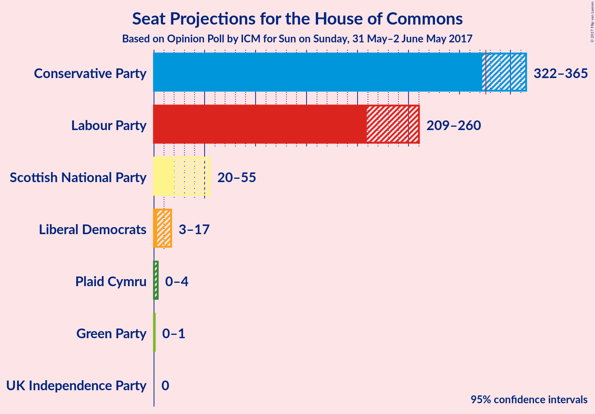

# Opinion Poll by ICM for Sun on Sunday, 31 May–2 June May 2017

<a href="#voting-intentions">Voting Intentions</a> | <a href="#seats">Seats</a> | <a href="#coalitions">Coalitions</a> | <a href="#technical-information">Technical Information</a>

## Voting Intentions

### Confidence Intervals

| Party | Last Result | Poll Result | 80% Confidence Interval | 90% Confidence Interval | 95% Confidence Interval | 99% Confidence Interval |
|:-----:|:-----------:|:-----------:|:-----------------------:|:-----------------------:|:-----------------------:|:-----------------------:|
| Conservative Party | 36.9% | 45.0% | 43.0–46.2% |42.5–46.7% |42.1–47.1% |41.4–47.9% |
| Labour Party | 30.4% | 35.2% | 33.4–36.5% |33.0–36.9% |32.6–37.3% |31.9–38.1% |
| Liberal Democrats | 7.9% | 8.3% | 7.4–9.1% |7.1–9.4% |6.9–9.7% |6.6–10.1% |
| UK Independence Party | 12.6% | 4.7% | 4.1–5.4% |3.9–5.7% |3.7–5.8% |3.4–6.2% |
| Scottish National Party | 4.7% | 4.0% | 3.4–4.7% |3.2–4.9% |3.1–5.1% |2.9–5.4% |
| Green Party | 3.8% | 2.5% | 2.1–3.1% |1.9–3.2% |1.8–3.4% |1.6–3.7% |
| Plaid Cymru | 0.6% | 0.3% | 0.2–0.6% |0.2–0.7% |0.1–0.7% |0.1–0.9% |

*Note:* The poll result column reflects the actual value used in the calculations. Published results may vary slightly, and in addition be rounded to fewer digits.

## Seats

### Confidence Intervals

| Party | Last Result | Median | 80% Confidence Interval | 90% Confidence Interval | 95% Confidence Interval | 99% Confidence Interval |
|:-----:|:-----------:|:------:|:-----------------------:|:-----------------------:|:-----------------------:|:-----------------------:|
| <a href="#conservative-party">Conservative Party</a> | 331 | 340 | 340 |340–350 |340–350 |337–354 |
| <a href="#labour-party">Labour Party</a> | 232 | 237 | 237 |228–237 |228–237 |218–250 |
| <a href="#liberal-democrats">Liberal Democrats</a> | 8 | 12 | 12 |4–12 |4–12 |2–16 |
| <a href="#uk-independence-party">UK Independence Party</a> | 1 | 0 | 0 |0 |0 |0 |
| <a href="#scottish-national-party">Scottish National Party</a> | 56 | 42 | 42 |42–47 |42–47 |10–56 |
| <a href="#green-party">Green Party</a> | 1 | 1 | 1 |0–1 |0–1 |0–1 |
| <a href="#plaid-cymru">Plaid Cymru</a> | 3 | 0 | 0 |0–3 |0–3 |0–4 |

### Conservative Party

| Number of Seats | Probability | Accumulated |
|:---------------:|:-----------:|:-----------:|
| 321 | 0% | 100% |
| 322 | 0% | 99.9% |
| 323 | 0% | 99.9% |
| 324 | 0% | 99.9% |
| 325 | 0% | 99.9% |
| 326 | 0% | 99.9% |
| 327 | 0.3% | 99.9% |
| 328 | 0% | 99.7% |
| 329 | 0% | 99.7% |
| 330 | 0% | 99.7% |
| 331 | 0% | 99.7% |
| 332 | 0% | 99.7% |
| 333 | 0% | 99.7% |
| 334 | 0% | 99.7% |
| 335 | 0% | 99.7% |
| 336 | 0% | 99.7% |
| 337 | 2% | 99.7% |
| 338 | 0% | 98% |
| 339 | 0% | 98% |
| 340 | 91% | 98% |
| 341 | 0% | 7% |
| 342 | 0% | 7% |
| 343 | 0% | 7% |
| 344 | 0% | 7% |
| 345 | 0% | 7% |
| 346 | 0% | 7% |
| 347 | 0% | 7% |
| 348 | 0% | 7% |
| 349 | 0% | 7% |
| 350 | 6% | 7% |
| 351 | 0% | 1.4% |
| 352 | 0.9% | 1.4% |
| 353 | 0% | 0.6% |
| 354 | 0.4% | 0.6% |
| 355 | 0% | 0.2% |
| 356 | 0% | 0.2% |
| 357 | 0% | 0.2% |
| 358 | 0.1% | 0.2% |
| 359 | 0% | 0% |

### Labour Party

| Number of Seats | Probability | Accumulated |
|:---------------:|:-----------:|:-----------:|
| 217 | 0.1% | 100% |
| 218 | 0.4% | 99.8% |
| 219 | 0% | 99.4% |
| 220 | 0% | 99.4% |
| 221 | 0% | 99.4% |
| 222 | 0% | 99.4% |
| 223 | 0% | 99.4% |
| 224 | 0% | 99.4% |
| 225 | 0% | 99.4% |
| 226 | 0% | 99.4% |
| 227 | 0% | 99.4% |
| 228 | 6% | 99.4% |
| 229 | 0% | 93% |
| 230 | 0% | 93% |
| 231 | 0% | 93% |
| 232 | 0% | 93% |
| 233 | 2% | 93% |
| 234 | 0% | 92% |
| 235 | 0% | 92% |
| 236 | 0% | 92% |
| 237 | 91% | 92% |
| 238 | 0% | 1.2% |
| 239 | 0% | 1.2% |
| 240 | 0% | 1.2% |
| 241 | 0% | 1.2% |
| 242 | 0% | 1.2% |
| 243 | 0% | 1.2% |
| 244 | 0% | 1.2% |
| 245 | 0% | 1.2% |
| 246 | 0% | 1.2% |
| 247 | 0% | 1.2% |
| 248 | 0% | 1.2% |
| 249 | 0% | 1.2% |
| 250 | 0.9% | 1.2% |
| 251 | 0% | 0.3% |
| 252 | 0% | 0.3% |
| 253 | 0% | 0.3% |
| 254 | 0% | 0.3% |
| 255 | 0% | 0.3% |
| 256 | 0% | 0.3% |
| 257 | 0% | 0.3% |
| 258 | 0% | 0.3% |
| 259 | 0% | 0.3% |
| 260 | 0% | 0.3% |
| 261 | 0% | 0.3% |
| 262 | 0% | 0.3% |
| 263 | 0% | 0.3% |
| 264 | 0% | 0.3% |
| 265 | 0% | 0.3% |
| 266 | 0% | 0.3% |
| 267 | 0% | 0.3% |
| 268 | 0% | 0.3% |
| 269 | 0% | 0.3% |
| 270 | 0% | 0.3% |
| 271 | 0% | 0.3% |
| 272 | 0% | 0.3% |
| 273 | 0% | 0.3% |
| 274 | 0% | 0.3% |
| 275 | 0% | 0.3% |
| 276 | 0% | 0.3% |
| 277 | 0% | 0.3% |
| 278 | 0% | 0.3% |
| 279 | 0% | 0.3% |
| 280 | 0% | 0.3% |
| 281 | 0% | 0.3% |
| 282 | 0% | 0.3% |
| 283 | 0.3% | 0.3% |
| 284 | 0% | 0% |

### Liberal Democrats

| Number of Seats | Probability | Accumulated |
|:---------------:|:-----------:|:-----------:|
| 1 | 0.4% | 100% |
| 2 | 2% | 99.6% |
| 3 | 0% | 98% |
| 4 | 6% | 98% |
| 5 | 0% | 92% |
| 6 | 0% | 92% |
| 7 | 0.3% | 92% |
| 8 | 0.1% | 92% |
| 9 | 0% | 92% |
| 10 | 0% | 92% |
| 11 | 0% | 92% |
| 12 | 91% | 92% |
| 13 | 0% | 0.9% |
| 14 | 0% | 0.9% |
| 15 | 0% | 0.9% |
| 16 | 0.9% | 0.9% |
| 17 | 0% | 0% |

### UK Independence Party

| Number of Seats | Probability | Accumulated |
|:---------------:|:-----------:|:-----------:|
| 0 | 100% | 100% |
| 1 | 0% | 0% |

### Scottish National Party

| Number of Seats | Probability | Accumulated |
|:---------------:|:-----------:|:-----------:|
| 10 | 0.9% | 100% |
| 11 | 0% | 99.1% |
| 12 | 0% | 99.1% |
| 13 | 0% | 99.1% |
| 14 | 0% | 99.1% |
| 15 | 0.3% | 99.1% |
| 16 | 0% | 98.9% |
| 17 | 0% | 98.9% |
| 18 | 0% | 98.9% |
| 19 | 0% | 98.9% |
| 20 | 0% | 98.9% |
| 21 | 0% | 98.9% |
| 22 | 0% | 98.9% |
| 23 | 0% | 98.9% |
| 24 | 0% | 98.9% |
| 25 | 0% | 98.9% |
| 26 | 0% | 98.9% |
| 27 | 0% | 98.9% |
| 28 | 0% | 98.9% |
| 29 | 0% | 98.9% |
| 30 | 0% | 98.9% |
| 31 | 0% | 98.9% |
| 32 | 0% | 98.9% |
| 33 | 0% | 98.9% |
| 34 | 0% | 98.9% |
| 35 | 0% | 98.9% |
| 36 | 0% | 98.9% |
| 37 | 0% | 98.9% |
| 38 | 0% | 98.9% |
| 39 | 0% | 98.8% |
| 40 | 0% | 98.8% |
| 41 | 0% | 98.8% |
| 42 | 91% | 98.8% |
| 43 | 0% | 8% |
| 44 | 0% | 8% |
| 45 | 0% | 8% |
| 46 | 0.1% | 8% |
| 47 | 6% | 8% |
| 48 | 0% | 2% |
| 49 | 0% | 2% |
| 50 | 0% | 2% |
| 51 | 0% | 2% |
| 52 | 0% | 2% |
| 53 | 0% | 2% |
| 54 | 0% | 2% |
| 55 | 0% | 2% |
| 56 | 2% | 2% |
| 57 | 0% | 0% |

### Green Party

| Number of Seats | Probability | Accumulated |
|:---------------:|:-----------:|:-----------:|
| 0 | 8% | 100% |
| 1 | 92% | 92% |
| 2 | 0% | 0% |

### Plaid Cymru

| Number of Seats | Probability | Accumulated |
|:---------------:|:-----------:|:-----------:|
| 0 | 91% | 100% |
| 1 | 0% | 9% |
| 2 | 0% | 9% |
| 3 | 8% | 9% |
| 4 | 0.9% | 0.9% |
| 5 | 0% | 0% |

## Coalitions

### Confidence Intervals

| Coalition | Last Result | Median | 80% Confidence Interval | 90% Confidence Interval | 95% Confidence Interval | 99% Confidence Interval |
|:---------:|:-----------:|:------:|:-----------------------:|:-----------------------:|:-----------------------:|:-----------------------:|
| Conservative Party – Scottish National Party – Plaid Cymru | 390 | 382 | 382 | 382–400 | 382–400 | 366–407 |
| Conservative Party – Scottish National Party | 387 | 382 | 382 | 382–397 | 382–397 | 362–404 |
| Conservative Party – Liberal Democrats | 339 | 352 | 352 | 352–354 | 352–354 | 339–368 |
| Conservative Party – Plaid Cymru | 334 | 340 | 340 | 340–353 | 340–353 | 340–357 |
| Conservative Party | 331 | 340 | 340 | 340–350 | 340–350 | 337–354 |
| Labour Party – Liberal Democrats – Scottish National Party – Plaid Cymru | 299 | 291 | 291 | 282–291 | 282–291 | 278–294 |
| Labour Party – Liberal Democrats – Scottish National Party | 296 | 291 | 291 | 279–291 | 279–291 | 275–291 |
| Labour Party – Scottish National Party – Plaid Cymru | 291 | 279 | 279 | 278–279 | 278–279 | 264–292 |
| Labour Party – Scottish National Party | 288 | 279 | 279 | 275–279 | 275–279 | 260–289 |
| Labour Party – Liberal Democrats – Plaid Cymru | 243 | 249 | 249 | 235–249 | 235–249 | 228–270 |
| Labour Party – Liberal Democrats | 240 | 249 | 249 | 232–249 | 232–249 | 225–266 |
| Labour Party – Plaid Cymru | 235 | 237 | 237 | 231–237 | 231–237 | 221–254 |
| Labour Party | 232 | 237 | 237 | 228–237 | 228–237 | 218–250 |

### Conservative Party – Scottish National Party – Plaid Cymru

| Number of Seats | Probability | Accumulated |
|:---------------:|:-----------:|:-----------:|
| 342 | 0.3% | 100% |
| 343 | 0% | 99.7% |
| 344 | 0% | 99.7% |
| 345 | 0% | 99.7% |
| 346 | 0% | 99.7% |
| 347 | 0% | 99.7% |
| 348 | 0% | 99.7% |
| 349 | 0% | 99.7% |
| 350 | 0% | 99.7% |
| 351 | 0% | 99.7% |
| 352 | 0% | 99.7% |
| 353 | 0% | 99.7% |
| 354 | 0% | 99.7% |
| 355 | 0% | 99.7% |
| 356 | 0% | 99.7% |
| 357 | 0% | 99.7% |
| 358 | 0% | 99.7% |
| 359 | 0% | 99.7% |
| 360 | 0% | 99.7% |
| 361 | 0% | 99.7% |
| 362 | 0% | 99.7% |
| 363 | 0% | 99.7% |
| 364 | 0% | 99.7% |
| 365 | 0% | 99.7% |
| 366 | 0.9% | 99.7% |
| 367 | 0% | 98.9% |
| 368 | 0% | 98.9% |
| 369 | 0% | 98.9% |
| 370 | 0% | 98.8% |
| 371 | 0% | 98.8% |
| 372 | 0% | 98.8% |
| 373 | 0% | 98.8% |
| 374 | 0% | 98.8% |
| 375 | 0% | 98.8% |
| 376 | 0% | 98.8% |
| 377 | 0% | 98.8% |
| 378 | 0% | 98.8% |
| 379 | 0% | 98.8% |
| 380 | 0% | 98.8% |
| 381 | 0% | 98.8% |
| 382 | 91% | 98.8% |
| 383 | 0% | 8% |
| 384 | 0% | 8% |
| 385 | 0% | 8% |
| 386 | 0% | 8% |
| 387 | 0% | 8% |
| 388 | 0% | 8% |
| 389 | 0% | 8% |
| 390 | 0% | 8% |
| 391 | 0% | 8% |
| 392 | 0% | 8% |
| 393 | 0% | 8% |
| 394 | 0% | 8% |
| 395 | 0% | 8% |
| 396 | 2% | 8% |
| 397 | 0% | 7% |
| 398 | 0% | 7% |
| 399 | 0% | 7% |
| 400 | 6% | 7% |
| 401 | 0% | 0.6% |
| 402 | 0% | 0.6% |
| 403 | 0% | 0.6% |
| 404 | 0% | 0.6% |
| 405 | 0% | 0.6% |
| 406 | 0% | 0.6% |
| 407 | 0.1% | 0.6% |
| 408 | 0% | 0.4% |
| 409 | 0% | 0.4% |
| 410 | 0% | 0.4% |
| 411 | 0% | 0.4% |
| 412 | 0% | 0.4% |
| 413 | 0.4% | 0.4% |
| 414 | 0% | 0% |

### Conservative Party – Scottish National Party

| Number of Seats | Probability | Accumulated |
|:---------------:|:-----------:|:-----------:|
| 342 | 0.3% | 100% |
| 343 | 0% | 99.7% |
| 344 | 0% | 99.7% |
| 345 | 0% | 99.7% |
| 346 | 0% | 99.7% |
| 347 | 0% | 99.7% |
| 348 | 0% | 99.7% |
| 349 | 0% | 99.7% |
| 350 | 0% | 99.7% |
| 351 | 0% | 99.7% |
| 352 | 0% | 99.7% |
| 353 | 0% | 99.7% |
| 354 | 0% | 99.7% |
| 355 | 0% | 99.7% |
| 356 | 0% | 99.7% |
| 357 | 0% | 99.7% |
| 358 | 0% | 99.7% |
| 359 | 0% | 99.7% |
| 360 | 0% | 99.7% |
| 361 | 0% | 99.7% |
| 362 | 0.9% | 99.7% |
| 363 | 0% | 98.9% |
| 364 | 0% | 98.9% |
| 365 | 0% | 98.9% |
| 366 | 0% | 98.9% |
| 367 | 0% | 98.8% |
| 368 | 0% | 98.8% |
| 369 | 0% | 98.8% |
| 370 | 0% | 98.8% |
| 371 | 0% | 98.8% |
| 372 | 0% | 98.8% |
| 373 | 0% | 98.8% |
| 374 | 0% | 98.8% |
| 375 | 0% | 98.8% |
| 376 | 0% | 98.8% |
| 377 | 0% | 98.8% |
| 378 | 0% | 98.8% |
| 379 | 0% | 98.8% |
| 380 | 0% | 98.8% |
| 381 | 0% | 98.8% |
| 382 | 91% | 98.8% |
| 383 | 0% | 8% |
| 384 | 0% | 8% |
| 385 | 0% | 8% |
| 386 | 0% | 8% |
| 387 | 0% | 8% |
| 388 | 0% | 8% |
| 389 | 0% | 8% |
| 390 | 0% | 8% |
| 391 | 0% | 8% |
| 392 | 0% | 8% |
| 393 | 2% | 8% |
| 394 | 0% | 7% |
| 395 | 0% | 7% |
| 396 | 0% | 7% |
| 397 | 6% | 7% |
| 398 | 0% | 0.6% |
| 399 | 0% | 0.6% |
| 400 | 0% | 0.6% |
| 401 | 0% | 0.6% |
| 402 | 0% | 0.6% |
| 403 | 0% | 0.6% |
| 404 | 0.1% | 0.6% |
| 405 | 0% | 0.4% |
| 406 | 0% | 0.4% |
| 407 | 0% | 0.4% |
| 408 | 0% | 0.4% |
| 409 | 0% | 0.4% |
| 410 | 0.4% | 0.4% |
| 411 | 0% | 0% |

### Conservative Party – Liberal Democrats

| Number of Seats | Probability | Accumulated |
|:---------------:|:-----------:|:-----------:|
| 334 | 0.3% | 100% |
| 335 | 0% | 99.7% |
| 336 | 0% | 99.7% |
| 337 | 0% | 99.7% |
| 338 | 0% | 99.7% |
| 339 | 2% | 99.7% |
| 340 | 0% | 98% |
| 341 | 0% | 98% |
| 342 | 0% | 98% |
| 343 | 0% | 98% |
| 344 | 0% | 98% |
| 345 | 0% | 98% |
| 346 | 0% | 98% |
| 347 | 0% | 98% |
| 348 | 0% | 98% |
| 349 | 0% | 98% |
| 350 | 0% | 98% |
| 351 | 0% | 98% |
| 352 | 91% | 98% |
| 353 | 0% | 7% |
| 354 | 6% | 7% |
| 355 | 0.4% | 1.5% |
| 356 | 0% | 1.1% |
| 357 | 0% | 1.0% |
| 358 | 0% | 1.0% |
| 359 | 0% | 1.0% |
| 360 | 0% | 1.0% |
| 361 | 0% | 1.0% |
| 362 | 0% | 1.0% |
| 363 | 0% | 1.0% |
| 364 | 0% | 1.0% |
| 365 | 0% | 1.0% |
| 366 | 0.1% | 1.0% |
| 367 | 0% | 0.9% |
| 368 | 0.9% | 0.9% |
| 369 | 0% | 0% |

### Conservative Party – Plaid Cymru

| Number of Seats | Probability | Accumulated |
|:---------------:|:-----------:|:-----------:|
| 321 | 0% | 100% |
| 322 | 0% | 99.9% |
| 323 | 0% | 99.9% |
| 324 | 0% | 99.9% |
| 325 | 0% | 99.9% |
| 326 | 0% | 99.9% |
| 327 | 0.3% | 99.9% |
| 328 | 0% | 99.7% |
| 329 | 0% | 99.7% |
| 330 | 0% | 99.7% |
| 331 | 0% | 99.7% |
| 332 | 0% | 99.7% |
| 333 | 0% | 99.7% |
| 334 | 0% | 99.7% |
| 335 | 0% | 99.7% |
| 336 | 0% | 99.7% |
| 337 | 0% | 99.7% |
| 338 | 0% | 99.7% |
| 339 | 0% | 99.7% |
| 340 | 92% | 99.6% |
| 341 | 0% | 7% |
| 342 | 0% | 7% |
| 343 | 0% | 7% |
| 344 | 0% | 7% |
| 345 | 0% | 7% |
| 346 | 0% | 7% |
| 347 | 0% | 7% |
| 348 | 0% | 7% |
| 349 | 0% | 7% |
| 350 | 0% | 7% |
| 351 | 0% | 7% |
| 352 | 0% | 7% |
| 353 | 6% | 7% |
| 354 | 0% | 1.4% |
| 355 | 0% | 1.4% |
| 356 | 0.9% | 1.4% |
| 357 | 0.4% | 0.6% |
| 358 | 0% | 0.2% |
| 359 | 0% | 0.2% |
| 360 | 0% | 0.2% |
| 361 | 0.1% | 0.2% |
| 362 | 0% | 0% |

### Conservative Party

| Number of Seats | Probability | Accumulated |
|:---------------:|:-----------:|:-----------:|
| 321 | 0% | 100% |
| 322 | 0% | 99.9% |
| 323 | 0% | 99.9% |
| 324 | 0% | 99.9% |
| 325 | 0% | 99.9% |
| 326 | 0% | 99.9% |
| 327 | 0.3% | 99.9% |
| 328 | 0% | 99.7% |
| 329 | 0% | 99.7% |
| 330 | 0% | 99.7% |
| 331 | 0% | 99.7% |
| 332 | 0% | 99.7% |
| 333 | 0% | 99.7% |
| 334 | 0% | 99.7% |
| 335 | 0% | 99.7% |
| 336 | 0% | 99.7% |
| 337 | 2% | 99.7% |
| 338 | 0% | 98% |
| 339 | 0% | 98% |
| 340 | 91% | 98% |
| 341 | 0% | 7% |
| 342 | 0% | 7% |
| 343 | 0% | 7% |
| 344 | 0% | 7% |
| 345 | 0% | 7% |
| 346 | 0% | 7% |
| 347 | 0% | 7% |
| 348 | 0% | 7% |
| 349 | 0% | 7% |
| 350 | 6% | 7% |
| 351 | 0% | 1.4% |
| 352 | 0.9% | 1.4% |
| 353 | 0% | 0.6% |
| 354 | 0.4% | 0.6% |
| 355 | 0% | 0.2% |
| 356 | 0% | 0.2% |
| 357 | 0% | 0.2% |
| 358 | 0.1% | 0.2% |
| 359 | 0% | 0% |

### Labour Party – Liberal Democrats – Scottish National Party – Plaid Cymru

| Number of Seats | Probability | Accumulated |
|:---------------:|:-----------:|:-----------:|
| 274 | 0.1% | 100% |
| 275 | 0% | 99.8% |
| 276 | 0% | 99.8% |
| 277 | 0% | 99.8% |
| 278 | 0.4% | 99.8% |
| 279 | 0% | 99.4% |
| 280 | 0.9% | 99.4% |
| 281 | 0% | 98.6% |
| 282 | 6% | 98.6% |
| 283 | 0% | 93% |
| 284 | 0% | 93% |
| 285 | 0% | 93% |
| 286 | 0% | 93% |
| 287 | 0% | 93% |
| 288 | 0% | 93% |
| 289 | 0% | 93% |
| 290 | 0% | 93% |
| 291 | 91% | 93% |
| 292 | 0% | 2% |
| 293 | 0% | 2% |
| 294 | 2% | 2% |
| 295 | 0% | 0.4% |
| 296 | 0% | 0.3% |
| 297 | 0% | 0.3% |
| 298 | 0% | 0.3% |
| 299 | 0% | 0.3% |
| 300 | 0% | 0.3% |
| 301 | 0% | 0.3% |
| 302 | 0% | 0.3% |
| 303 | 0% | 0.3% |
| 304 | 0% | 0.3% |
| 305 | 0.3% | 0.3% |
| 306 | 0% | 0.1% |
| 307 | 0% | 0.1% |
| 308 | 0% | 0.1% |
| 309 | 0% | 0.1% |
| 310 | 0% | 0.1% |
| 311 | 0% | 0% |

### Labour Party – Liberal Democrats – Scottish National Party

| Number of Seats | Probability | Accumulated |
|:---------------:|:-----------:|:-----------:|
| 271 | 0.1% | 100% |
| 272 | 0% | 99.8% |
| 273 | 0% | 99.8% |
| 274 | 0% | 99.8% |
| 275 | 0.4% | 99.8% |
| 276 | 0.9% | 99.4% |
| 277 | 0% | 98.6% |
| 278 | 0% | 98.6% |
| 279 | 6% | 98.6% |
| 280 | 0% | 93% |
| 281 | 0% | 93% |
| 282 | 0% | 93% |
| 283 | 0% | 93% |
| 284 | 0% | 93% |
| 285 | 0% | 93% |
| 286 | 0% | 93% |
| 287 | 0% | 93% |
| 288 | 0% | 93% |
| 289 | 0% | 93% |
| 290 | 0% | 93% |
| 291 | 92% | 93% |
| 292 | 0% | 0.4% |
| 293 | 0% | 0.4% |
| 294 | 0% | 0.3% |
| 295 | 0% | 0.3% |
| 296 | 0% | 0.3% |
| 297 | 0% | 0.3% |
| 298 | 0% | 0.3% |
| 299 | 0% | 0.3% |
| 300 | 0% | 0.3% |
| 301 | 0% | 0.3% |
| 302 | 0% | 0.3% |
| 303 | 0% | 0.3% |
| 304 | 0% | 0.3% |
| 305 | 0.3% | 0.3% |
| 306 | 0% | 0.1% |
| 307 | 0% | 0.1% |
| 308 | 0% | 0.1% |
| 309 | 0% | 0.1% |
| 310 | 0% | 0.1% |
| 311 | 0% | 0% |

### Labour Party – Scottish National Party – Plaid Cymru

| Number of Seats | Probability | Accumulated |
|:---------------:|:-----------:|:-----------:|
| 264 | 0.9% | 100% |
| 265 | 0% | 99.1% |
| 266 | 0.1% | 99.1% |
| 267 | 0% | 99.0% |
| 268 | 0% | 99.0% |
| 269 | 0% | 99.0% |
| 270 | 0% | 99.0% |
| 271 | 0% | 99.0% |
| 272 | 0% | 99.0% |
| 273 | 0% | 99.0% |
| 274 | 0% | 99.0% |
| 275 | 0% | 99.0% |
| 276 | 0% | 99.0% |
| 277 | 0.4% | 98.9% |
| 278 | 6% | 98.5% |
| 279 | 91% | 93% |
| 280 | 0% | 2% |
| 281 | 0% | 2% |
| 282 | 0% | 2% |
| 283 | 0% | 2% |
| 284 | 0% | 2% |
| 285 | 0% | 2% |
| 286 | 0% | 2% |
| 287 | 0% | 2% |
| 288 | 0% | 2% |
| 289 | 0% | 2% |
| 290 | 0% | 2% |
| 291 | 0% | 2% |
| 292 | 2% | 2% |
| 293 | 0% | 0.3% |
| 294 | 0% | 0.3% |
| 295 | 0% | 0.3% |
| 296 | 0% | 0.3% |
| 297 | 0% | 0.3% |
| 298 | 0.3% | 0.3% |
| 299 | 0% | 0% |

### Labour Party – Scottish National Party

| Number of Seats | Probability | Accumulated |
|:---------------:|:-----------:|:-----------:|
| 260 | 0.9% | 100% |
| 261 | 0% | 99.1% |
| 262 | 0% | 99.1% |
| 263 | 0.1% | 99.1% |
| 264 | 0% | 99.0% |
| 265 | 0% | 99.0% |
| 266 | 0% | 99.0% |
| 267 | 0% | 99.0% |
| 268 | 0% | 99.0% |
| 269 | 0% | 99.0% |
| 270 | 0% | 99.0% |
| 271 | 0% | 99.0% |
| 272 | 0% | 98.9% |
| 273 | 0% | 98.9% |
| 274 | 0.4% | 98.9% |
| 275 | 6% | 98.6% |
| 276 | 0% | 93% |
| 277 | 0% | 93% |
| 278 | 0% | 93% |
| 279 | 91% | 93% |
| 280 | 0% | 2% |
| 281 | 0% | 2% |
| 282 | 0% | 2% |
| 283 | 0% | 2% |
| 284 | 0% | 2% |
| 285 | 0% | 2% |
| 286 | 0% | 2% |
| 287 | 0% | 2% |
| 288 | 0% | 2% |
| 289 | 2% | 2% |
| 290 | 0% | 0.3% |
| 291 | 0% | 0.3% |
| 292 | 0% | 0.3% |
| 293 | 0% | 0.3% |
| 294 | 0% | 0.3% |
| 295 | 0% | 0.3% |
| 296 | 0% | 0.3% |
| 297 | 0% | 0.3% |
| 298 | 0.3% | 0.3% |
| 299 | 0% | 0% |

### Labour Party – Liberal Democrats – Plaid Cymru

| Number of Seats | Probability | Accumulated |
|:---------------:|:-----------:|:-----------:|
| 222 | 0.4% | 100% |
| 223 | 0% | 99.6% |
| 224 | 0% | 99.6% |
| 225 | 0% | 99.6% |
| 226 | 0% | 99.6% |
| 227 | 0% | 99.6% |
| 228 | 0.1% | 99.6% |
| 229 | 0% | 99.4% |
| 230 | 0% | 99.4% |
| 231 | 0% | 99.4% |
| 232 | 0% | 99.4% |
| 233 | 0% | 99.4% |
| 234 | 0% | 99.4% |
| 235 | 6% | 99.4% |
| 236 | 0% | 93% |
| 237 | 0% | 93% |
| 238 | 2% | 93% |
| 239 | 0% | 92% |
| 240 | 0% | 92% |
| 241 | 0% | 92% |
| 242 | 0% | 92% |
| 243 | 0% | 92% |
| 244 | 0% | 92% |
| 245 | 0% | 92% |
| 246 | 0% | 92% |
| 247 | 0% | 92% |
| 248 | 0% | 92% |
| 249 | 91% | 92% |
| 250 | 0% | 1.2% |
| 251 | 0% | 1.2% |
| 252 | 0% | 1.2% |
| 253 | 0% | 1.2% |
| 254 | 0% | 1.2% |
| 255 | 0% | 1.2% |
| 256 | 0% | 1.2% |
| 257 | 0% | 1.2% |
| 258 | 0% | 1.2% |
| 259 | 0% | 1.2% |
| 260 | 0% | 1.2% |
| 261 | 0% | 1.2% |
| 262 | 0% | 1.2% |
| 263 | 0% | 1.2% |
| 264 | 0% | 1.2% |
| 265 | 0% | 1.2% |
| 266 | 0% | 1.1% |
| 267 | 0% | 1.1% |
| 268 | 0% | 1.1% |
| 269 | 0% | 1.1% |
| 270 | 0.9% | 1.1% |
| 271 | 0% | 0.3% |
| 272 | 0% | 0.3% |
| 273 | 0% | 0.3% |
| 274 | 0% | 0.3% |
| 275 | 0% | 0.3% |
| 276 | 0% | 0.3% |
| 277 | 0% | 0.3% |
| 278 | 0% | 0.3% |
| 279 | 0% | 0.3% |
| 280 | 0% | 0.3% |
| 281 | 0% | 0.3% |
| 282 | 0% | 0.3% |
| 283 | 0% | 0.3% |
| 284 | 0% | 0.3% |
| 285 | 0% | 0.3% |
| 286 | 0% | 0.3% |
| 287 | 0% | 0.3% |
| 288 | 0% | 0.3% |
| 289 | 0% | 0.3% |
| 290 | 0.3% | 0.3% |
| 291 | 0% | 0% |

### Labour Party – Liberal Democrats

| Number of Seats | Probability | Accumulated |
|:---------------:|:-----------:|:-----------:|
| 219 | 0.4% | 100% |
| 220 | 0% | 99.6% |
| 221 | 0% | 99.6% |
| 222 | 0% | 99.6% |
| 223 | 0% | 99.6% |
| 224 | 0% | 99.6% |
| 225 | 0.1% | 99.6% |
| 226 | 0% | 99.4% |
| 227 | 0% | 99.4% |
| 228 | 0% | 99.4% |
| 229 | 0% | 99.4% |
| 230 | 0% | 99.4% |
| 231 | 0% | 99.4% |
| 232 | 6% | 99.4% |
| 233 | 0% | 93% |
| 234 | 0% | 93% |
| 235 | 2% | 93% |
| 236 | 0% | 92% |
| 237 | 0% | 92% |
| 238 | 0% | 92% |
| 239 | 0% | 92% |
| 240 | 0% | 92% |
| 241 | 0% | 92% |
| 242 | 0% | 92% |
| 243 | 0% | 92% |
| 244 | 0% | 92% |
| 245 | 0% | 92% |
| 246 | 0% | 92% |
| 247 | 0% | 92% |
| 248 | 0% | 92% |
| 249 | 91% | 92% |
| 250 | 0% | 1.2% |
| 251 | 0% | 1.2% |
| 252 | 0% | 1.2% |
| 253 | 0% | 1.2% |
| 254 | 0% | 1.2% |
| 255 | 0% | 1.2% |
| 256 | 0% | 1.2% |
| 257 | 0% | 1.2% |
| 258 | 0% | 1.2% |
| 259 | 0% | 1.2% |
| 260 | 0% | 1.2% |
| 261 | 0% | 1.2% |
| 262 | 0% | 1.2% |
| 263 | 0% | 1.1% |
| 264 | 0% | 1.1% |
| 265 | 0% | 1.1% |
| 266 | 0.9% | 1.1% |
| 267 | 0% | 0.3% |
| 268 | 0% | 0.3% |
| 269 | 0% | 0.3% |
| 270 | 0% | 0.3% |
| 271 | 0% | 0.3% |
| 272 | 0% | 0.3% |
| 273 | 0% | 0.3% |
| 274 | 0% | 0.3% |
| 275 | 0% | 0.3% |
| 276 | 0% | 0.3% |
| 277 | 0% | 0.3% |
| 278 | 0% | 0.3% |
| 279 | 0% | 0.3% |
| 280 | 0% | 0.3% |
| 281 | 0% | 0.3% |
| 282 | 0% | 0.3% |
| 283 | 0% | 0.3% |
| 284 | 0% | 0.3% |
| 285 | 0% | 0.3% |
| 286 | 0% | 0.3% |
| 287 | 0% | 0.3% |
| 288 | 0% | 0.3% |
| 289 | 0% | 0.3% |
| 290 | 0.3% | 0.3% |
| 291 | 0% | 0% |

### Labour Party – Plaid Cymru

| Number of Seats | Probability | Accumulated |
|:---------------:|:-----------:|:-----------:|
| 220 | 0.1% | 100% |
| 221 | 0.4% | 99.8% |
| 222 | 0% | 99.4% |
| 223 | 0% | 99.4% |
| 224 | 0% | 99.4% |
| 225 | 0% | 99.4% |
| 226 | 0% | 99.4% |
| 227 | 0% | 99.4% |
| 228 | 0% | 99.4% |
| 229 | 0% | 99.4% |
| 230 | 0% | 99.4% |
| 231 | 6% | 99.4% |
| 232 | 0% | 93% |
| 233 | 0% | 93% |
| 234 | 0% | 93% |
| 235 | 0% | 93% |
| 236 | 2% | 93% |
| 237 | 91% | 92% |
| 238 | 0% | 1.2% |
| 239 | 0% | 1.2% |
| 240 | 0% | 1.2% |
| 241 | 0% | 1.2% |
| 242 | 0% | 1.2% |
| 243 | 0% | 1.2% |
| 244 | 0% | 1.2% |
| 245 | 0% | 1.2% |
| 246 | 0% | 1.2% |
| 247 | 0% | 1.2% |
| 248 | 0% | 1.2% |
| 249 | 0% | 1.2% |
| 250 | 0% | 1.2% |
| 251 | 0% | 1.2% |
| 252 | 0% | 1.2% |
| 253 | 0% | 1.2% |
| 254 | 0.9% | 1.2% |
| 255 | 0% | 0.3% |
| 256 | 0% | 0.3% |
| 257 | 0% | 0.3% |
| 258 | 0% | 0.3% |
| 259 | 0% | 0.3% |
| 260 | 0% | 0.3% |
| 261 | 0% | 0.3% |
| 262 | 0% | 0.3% |
| 263 | 0% | 0.3% |
| 264 | 0% | 0.3% |
| 265 | 0% | 0.3% |
| 266 | 0% | 0.3% |
| 267 | 0% | 0.3% |
| 268 | 0% | 0.3% |
| 269 | 0% | 0.3% |
| 270 | 0% | 0.3% |
| 271 | 0% | 0.3% |
| 272 | 0% | 0.3% |
| 273 | 0% | 0.3% |
| 274 | 0% | 0.3% |
| 275 | 0% | 0.3% |
| 276 | 0% | 0.3% |
| 277 | 0% | 0.3% |
| 278 | 0% | 0.3% |
| 279 | 0% | 0.3% |
| 280 | 0% | 0.3% |
| 281 | 0% | 0.3% |
| 282 | 0% | 0.3% |
| 283 | 0.3% | 0.3% |
| 284 | 0% | 0% |

### Labour Party

| Number of Seats | Probability | Accumulated |
|:---------------:|:-----------:|:-----------:|
| 217 | 0.1% | 100% |
| 218 | 0.4% | 99.8% |
| 219 | 0% | 99.4% |
| 220 | 0% | 99.4% |
| 221 | 0% | 99.4% |
| 222 | 0% | 99.4% |
| 223 | 0% | 99.4% |
| 224 | 0% | 99.4% |
| 225 | 0% | 99.4% |
| 226 | 0% | 99.4% |
| 227 | 0% | 99.4% |
| 228 | 6% | 99.4% |
| 229 | 0% | 93% |
| 230 | 0% | 93% |
| 231 | 0% | 93% |
| 232 | 0% | 93% |
| 233 | 2% | 93% |
| 234 | 0% | 92% |
| 235 | 0% | 92% |
| 236 | 0% | 92% |
| 237 | 91% | 92% |
| 238 | 0% | 1.2% |
| 239 | 0% | 1.2% |
| 240 | 0% | 1.2% |
| 241 | 0% | 1.2% |
| 242 | 0% | 1.2% |
| 243 | 0% | 1.2% |
| 244 | 0% | 1.2% |
| 245 | 0% | 1.2% |
| 246 | 0% | 1.2% |
| 247 | 0% | 1.2% |
| 248 | 0% | 1.2% |
| 249 | 0% | 1.2% |
| 250 | 0.9% | 1.2% |
| 251 | 0% | 0.3% |
| 252 | 0% | 0.3% |
| 253 | 0% | 0.3% |
| 254 | 0% | 0.3% |
| 255 | 0% | 0.3% |
| 256 | 0% | 0.3% |
| 257 | 0% | 0.3% |
| 258 | 0% | 0.3% |
| 259 | 0% | 0.3% |
| 260 | 0% | 0.3% |
| 261 | 0% | 0.3% |
| 262 | 0% | 0.3% |
| 263 | 0% | 0.3% |
| 264 | 0% | 0.3% |
| 265 | 0% | 0.3% |
| 266 | 0% | 0.3% |
| 267 | 0% | 0.3% |
| 268 | 0% | 0.3% |
| 269 | 0% | 0.3% |
| 270 | 0% | 0.3% |
| 271 | 0% | 0.3% |
| 272 | 0% | 0.3% |
| 273 | 0% | 0.3% |
| 274 | 0% | 0.3% |
| 275 | 0% | 0.3% |
| 276 | 0% | 0.3% |
| 277 | 0% | 0.3% |
| 278 | 0% | 0.3% |
| 279 | 0% | 0.3% |
| 280 | 0% | 0.3% |
| 281 | 0% | 0.3% |
| 282 | 0% | 0.3% |
| 283 | 0.3% | 0.3% |
| 284 | 0% | 0% |

## Technical Information

### Opinion Poll

+ **Pollster:** ICM
+ **Media:** Sun on Sunday
+ **Fieldwork period:** 31 May–2 June May 2017

### Calculations

+ **Sample size:** 1550
+ **Simulations done:** 1,024
+ **Error estimate:** 1.43%

