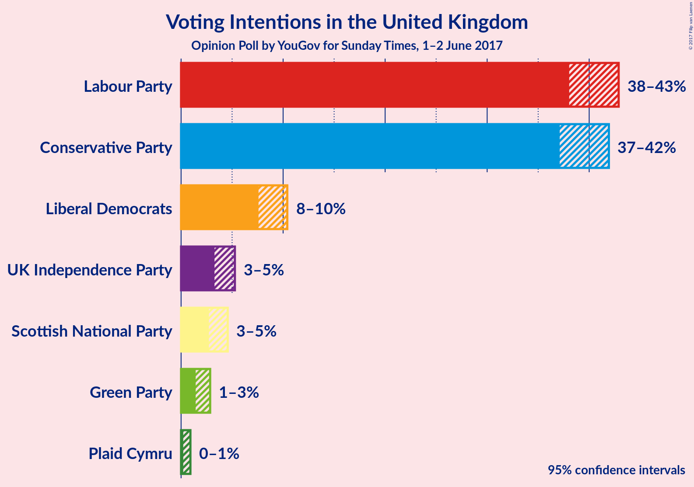
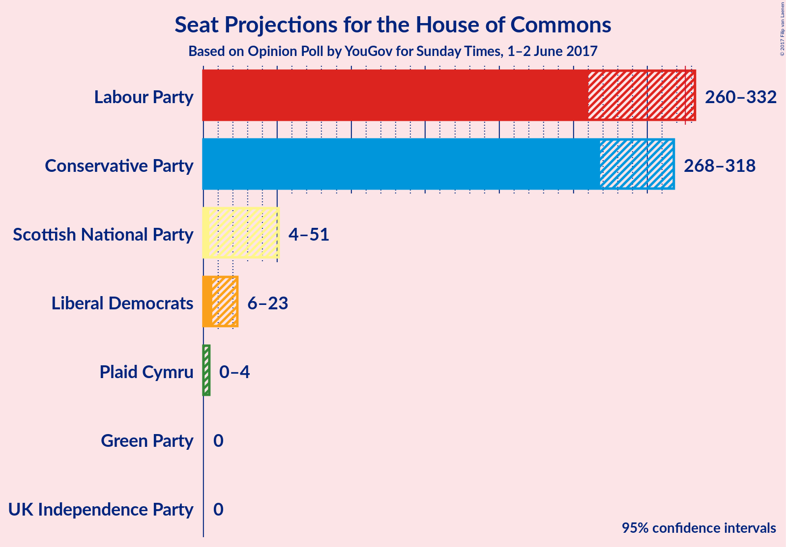
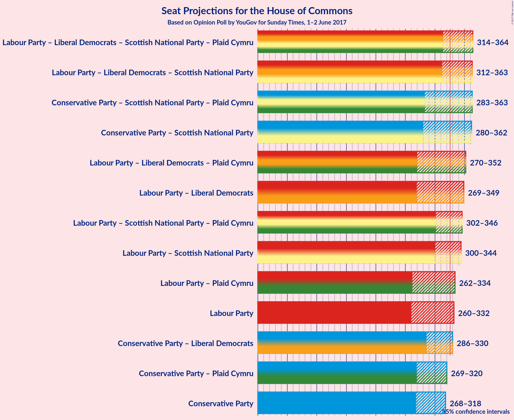

# Opinion Poll by YouGov for Sunday Times, 1–2 June 2017

<a href="#voting-intentions">Voting Intentions</a> | <a href="#seats">Seats</a> | <a href="#coalitions">Coalitions</a> | <a href="#technical-information">Technical Information</a>

## Voting Intentions

### Confidence Intervals

| Party | Last Result | Poll Result | 80% Confidence Interval | 90% Confidence Interval | 95% Confidence Interval | 99% Confidence Interval |
|:-----:|:-----------:|:-----------:|:-----------------------:|:-----------------------:|:-----------------------:|:-----------------------:|
| Labour Party | 30.4% | 40.9% | 38.9–42.0% |38.4–42.5% |38.0–42.9% |37.3–43.7% |
| Conservative Party | 36.9% | 39.9% | 37.9–41.1% |37.5–41.5% |37.1–41.9% |36.4–42.7% |
| Liberal Democrats | 7.9% | 9.0% | 8.0–9.9% |7.8–10.2% |7.6–10.4% |7.2–10.9% |
| UK Independence Party | 12.6% | 4.2% | 3.6–4.9% |3.4–5.1% |3.3–5.3% |3.0–5.6% |
| Scottish National Party | 4.7% | 3.6% | 3.0–4.2% |2.9–4.4% |2.7–4.6% |2.5–4.9% |
| Green Party | 3.8% | 2.0% | 1.6–2.6% |1.5–2.7% |1.4–2.9% |1.3–3.1% |
| Plaid Cymru | 0.6% | 0.4% | 0.3–0.7% |0.2–0.8% |0.2–0.9% |0.2–1.1% |

*Note:* The poll result column reflects the actual value used in the calculations. Published results may vary slightly, and in addition be rounded to fewer digits.

## Seats

### Confidence Intervals

| Party | Last Result | Median | 80% Confidence Interval | 90% Confidence Interval | 95% Confidence Interval | 99% Confidence Interval |
|:-----:|:-----------:|:------:|:-----------------------:|:-----------------------:|:-----------------------:|:-----------------------:|
| <a href="#labour-party">Labour Party</a> | 232 | 293 | 266–319 |263–327 |260–332 |253–335 |
| <a href="#conservative-party">Conservative Party</a> | 331 | 298 | 275–313 |271–315 |268–318 |260–322 |
| <a href="#liberal-democrats">Liberal Democrats</a> | 8 | 16 | 8–22 |7–22 |6–23 |4–26 |
| <a href="#uk-independence-party">UK Independence Party</a> | 1 | 0 | 0 |0 |0 |0 |
| <a href="#scottish-national-party">Scottish National Party</a> | 56 | 24 | 7–48 |5–49 |4–51 |2–54 |
| <a href="#green-party">Green Party</a> | 1 | 0 | 0 |0 |0 |0 |
| <a href="#plaid-cymru">Plaid Cymru</a> | 3 | 1 | 1–3 |0–3 |0–4 |0–5 |

### Labour Party

| Number of Seats | Probability | Accumulated |
|:---------------:|:-----------:|:-----------:|
| 247 | 0% | 100% |
| 248 | 0% | 99.9% |
| 249 | 0% | 99.9% |
| 250 | 0.1% | 99.9% |
| 251 | 0.1% | 99.7% |
| 252 | 0.2% | 99.7% |
| 253 | 0.1% | 99.5% |
| 254 | 0.1% | 99.4% |
| 255 | 0.1% | 99.3% |
| 256 | 0.2% | 99.2% |
| 257 | 0.5% | 99.0% |
| 258 | 0.2% | 98.5% |
| 259 | 0.7% | 98% |
| 260 | 0.3% | 98% |
| 261 | 0.5% | 97% |
| 262 | 0.6% | 97% |
| 263 | 4% | 96% |
| 264 | 0.6% | 92% |
| 265 | 0.1% | 91% |
| 266 | 4% | 91% |
| 267 | 0.7% | 87% |
| 268 | 0.9% | 87% |
| 269 | 3% | 86% |
| 270 | 2% | 83% |
| 271 | 0.3% | 81% |
| 272 | 3% | 81% |
| 273 | 0.5% | 78% |
| 274 | 0.1% | 78% |
| 275 | 0.9% | 77% |
| 276 | 0.5% | 77% |
| 277 | 0.1% | 76% |
| 278 | 3% | 76% |
| 279 | 0.8% | 73% |
| 280 | 0.6% | 72% |
| 281 | 1.0% | 72% |
| 282 | 2% | 71% |
| 283 | 0.2% | 69% |
| 284 | 2% | 69% |
| 285 | 0.5% | 67% |
| 286 | 0.7% | 67% |
| 287 | 2% | 66% |
| 288 | 4% | 64% |
| 289 | 0.9% | 60% |
| 290 | 0.7% | 59% |
| 291 | 0.3% | 58% |
| 292 | 4% | 58% |
| 293 | 5% | 54% |
| 294 | 0.5% | 49% |
| 295 | 0.9% | 48% |
| 296 | 0.1% | 47% |
| 297 | 0.2% | 47% |
| 298 | 2% | 47% |
| 299 | 1.2% | 45% |
| 300 | 3% | 44% |
| 301 | 1.4% | 41% |
| 302 | 3% | 39% |
| 303 | 0.8% | 36% |
| 304 | 0.1% | 35% |
| 305 | 6% | 35% |
| 306 | 2% | 29% |
| 307 | 8% | 27% |
| 308 | 1.0% | 19% |
| 309 | 0.2% | 18% |
| 310 | 0.2% | 18% |
| 311 | 0.2% | 18% |
| 312 | 0.4% | 17% |
| 313 | 0% | 17% |
| 314 | 0.9% | 17% |
| 315 | 2% | 16% |
| 316 | 0.1% | 14% |
| 317 | 0.2% | 14% |
| 318 | 3% | 13% |
| 319 | 2% | 11% |
| 320 | 0.2% | 9% |
| 321 | 0.6% | 9% |
| 322 | 0.3% | 8% |
| 323 | 0.5% | 8% |
| 324 | 0% | 8% |
| 325 | 0.3% | 8% |
| 326 | 0.6% | 7% |
| 327 | 2% | 7% |
| 328 | 0.1% | 4% |
| 329 | 0.7% | 4% |
| 330 | 0.1% | 4% |
| 331 | 0.8% | 3% |
| 332 | 0.2% | 3% |
| 333 | 1.1% | 2% |
| 334 | 0.4% | 1.4% |
| 335 | 0.5% | 1.0% |
| 336 | 0% | 0.4% |
| 337 | 0% | 0.4% |
| 338 | 0% | 0.4% |
| 339 | 0% | 0.4% |
| 340 | 0% | 0.3% |
| 341 | 0% | 0.3% |
| 342 | 0% | 0.3% |
| 343 | 0% | 0.2% |
| 344 | 0.2% | 0.2% |
| 345 | 0% | 0.1% |
| 346 | 0% | 0.1% |
| 347 | 0% | 0.1% |
| 348 | 0% | 0.1% |
| 349 | 0% | 0% |

### Conservative Party

| Number of Seats | Probability | Accumulated |
|:---------------:|:-----------:|:-----------:|
| 252 | 0% | 100% |
| 253 | 0% | 99.9% |
| 254 | 0% | 99.9% |
| 255 | 0% | 99.9% |
| 256 | 0% | 99.9% |
| 257 | 0.1% | 99.8% |
| 258 | 0% | 99.7% |
| 259 | 0.1% | 99.7% |
| 260 | 0.1% | 99.5% |
| 261 | 0.1% | 99.5% |
| 262 | 0% | 99.4% |
| 263 | 0.2% | 99.4% |
| 264 | 0.1% | 99.2% |
| 265 | 0.6% | 99.1% |
| 266 | 0.3% | 98% |
| 267 | 0% | 98% |
| 268 | 0.7% | 98% |
| 269 | 1.2% | 97% |
| 270 | 0.4% | 96% |
| 271 | 3% | 96% |
| 272 | 0.6% | 93% |
| 273 | 0.8% | 93% |
| 274 | 0.2% | 92% |
| 275 | 4% | 92% |
| 276 | 2% | 88% |
| 277 | 0.7% | 85% |
| 278 | 1.0% | 85% |
| 279 | 0.2% | 84% |
| 280 | 1.4% | 84% |
| 281 | 0.3% | 82% |
| 282 | 1.1% | 82% |
| 283 | 8% | 81% |
| 284 | 3% | 73% |
| 285 | 0.2% | 70% |
| 286 | 0.8% | 70% |
| 287 | 0.8% | 69% |
| 288 | 1.2% | 68% |
| 289 | 3% | 67% |
| 290 | 1.1% | 64% |
| 291 | 3% | 63% |
| 292 | 0.5% | 60% |
| 293 | 3% | 59% |
| 294 | 0.3% | 56% |
| 295 | 0.2% | 55% |
| 296 | 0.8% | 55% |
| 297 | 2% | 54% |
| 298 | 12% | 52% |
| 299 | 0.4% | 40% |
| 300 | 1.0% | 40% |
| 301 | 1.1% | 39% |
| 302 | 7% | 38% |
| 303 | 4% | 31% |
| 304 | 0.8% | 27% |
| 305 | 4% | 26% |
| 306 | 3% | 22% |
| 307 | 1.3% | 19% |
| 308 | 0.8% | 17% |
| 309 | 3% | 17% |
| 310 | 0.7% | 14% |
| 311 | 2% | 13% |
| 312 | 0.7% | 11% |
| 313 | 3% | 10% |
| 314 | 1.2% | 7% |
| 315 | 1.0% | 6% |
| 316 | 0.5% | 5% |
| 317 | 2% | 4% |
| 318 | 0.7% | 3% |
| 319 | 0.2% | 2% |
| 320 | 0.5% | 2% |
| 321 | 0.1% | 1.3% |
| 322 | 0.9% | 1.2% |
| 323 | 0% | 0.3% |
| 324 | 0.1% | 0.3% |
| 325 | 0.1% | 0.2% |
| 326 | 0% | 0.1% |
| 327 | 0% | 0.1% |
| 328 | 0% | 0.1% |
| 329 | 0% | 0% |

### Liberal Democrats

| Number of Seats | Probability | Accumulated |
|:---------------:|:-----------:|:-----------:|
| 3 | 0.2% | 100% |
| 4 | 0.6% | 99.8% |
| 5 | 1.5% | 99.2% |
| 6 | 2% | 98% |
| 7 | 0.7% | 95% |
| 8 | 5% | 95% |
| 9 | 3% | 90% |
| 10 | 3% | 87% |
| 11 | 5% | 84% |
| 12 | 3% | 79% |
| 13 | 6% | 75% |
| 14 | 4% | 69% |
| 15 | 14% | 66% |
| 16 | 4% | 51% |
| 17 | 11% | 47% |
| 18 | 7% | 36% |
| 19 | 2% | 29% |
| 20 | 7% | 27% |
| 21 | 8% | 20% |
| 22 | 8% | 11% |
| 23 | 2% | 4% |
| 24 | 0.9% | 2% |
| 25 | 0.1% | 0.7% |
| 26 | 0.3% | 0.6% |
| 27 | 0.1% | 0.3% |
| 28 | 0% | 0.1% |
| 29 | 0% | 0.1% |
| 30 | 0% | 0.1% |
| 31 | 0% | 0% |

### UK Independence Party

| Number of Seats | Probability | Accumulated |
|:---------------:|:-----------:|:-----------:|
| 0 | 100% | 100% |
| 1 | 0% | 0% |

### Scottish National Party

| Number of Seats | Probability | Accumulated |
|:---------------:|:-----------:|:-----------:|
| 1 | 0.1% | 100% |
| 2 | 0.5% | 99.9% |
| 3 | 1.0% | 99.4% |
| 4 | 3% | 98% |
| 5 | 3% | 96% |
| 6 | 2% | 93% |
| 7 | 2% | 91% |
| 8 | 1.5% | 89% |
| 9 | 1.4% | 87% |
| 10 | 0.7% | 86% |
| 11 | 9% | 85% |
| 12 | 0.8% | 76% |
| 13 | 3% | 75% |
| 14 | 0.8% | 73% |
| 15 | 0.2% | 72% |
| 16 | 0.4% | 72% |
| 17 | 0.2% | 71% |
| 18 | 4% | 71% |
| 19 | 5% | 67% |
| 20 | 5% | 61% |
| 21 | 0.4% | 57% |
| 22 | 4% | 56% |
| 23 | 1.0% | 52% |
| 24 | 1.1% | 51% |
| 25 | 0.4% | 50% |
| 26 | 0.6% | 49% |
| 27 | 0.3% | 49% |
| 28 | 0.7% | 48% |
| 29 | 8% | 48% |
| 30 | 1.5% | 40% |
| 31 | 0.9% | 38% |
| 32 | 2% | 37% |
| 33 | 0.9% | 35% |
| 34 | 2% | 34% |
| 35 | 2% | 33% |
| 36 | 0.1% | 30% |
| 37 | 1.0% | 30% |
| 38 | 0.4% | 29% |
| 39 | 3% | 29% |
| 40 | 0.5% | 26% |
| 41 | 0.5% | 26% |
| 42 | 2% | 25% |
| 43 | 2% | 24% |
| 44 | 0.5% | 22% |
| 45 | 5% | 21% |
| 46 | 4% | 17% |
| 47 | 2% | 12% |
| 48 | 4% | 11% |
| 49 | 2% | 6% |
| 50 | 2% | 5% |
| 51 | 2% | 3% |
| 52 | 0.6% | 1.4% |
| 53 | 0.1% | 0.8% |
| 54 | 0.5% | 0.7% |
| 55 | 0.1% | 0.2% |
| 56 | 0.1% | 0.1% |
| 57 | 0.1% | 0.1% |
| 58 | 0% | 0% |

### Green Party

| Number of Seats | Probability | Accumulated |
|:---------------:|:-----------:|:-----------:|
| 0 | 99.7% | 100% |
| 1 | 0.3% | 0.3% |
| 2 | 0% | 0% |

### Plaid Cymru

| Number of Seats | Probability | Accumulated |
|:---------------:|:-----------:|:-----------:|
| 0 | 9% | 100% |
| 1 | 43% | 91% |
| 2 | 12% | 47% |
| 3 | 32% | 35% |
| 4 | 1.3% | 4% |
| 5 | 2% | 2% |
| 6 | 0% | 0% |

## Coalitions

### Confidence Intervals

| Coalition | Last Result | Median | 80% Confidence Interval | 90% Confidence Interval | 95% Confidence Interval | 99% Confidence Interval |
|:---------:|:-----------:|:------:|:-----------------------:|:-----------------------:|:-----------------------:|:-----------------------:|
| Labour Party – Liberal Democrats – Scottish National Party – Plaid Cymru | 299 | 334 | 319–357 | 317–361 | 314–364 | 310–372 |
| Labour Party – Liberal Democrats – Scottish National Party | 296 | 333 | 317–356 | 315–360 | 312–363 | 307–371 |
| Conservative Party – Scottish National Party – Plaid Cymru | 390 | 323 | 295–352 | 285–356 | 283–363 | 277–369 |
| Conservative Party – Scottish National Party | 387 | 320 | 292–351 | 284–355 | 280–362 | 275–367 |
| Labour Party – Liberal Democrats – Plaid Cymru | 243 | 312 | 281–340 | 277–348 | 270–352 | 265–357 |
| Labour Party – Liberal Democrats | 240 | 309 | 280–337 | 275–347 | 269–349 | 263–355 |
| Labour Party – Scottish National Party – Plaid Cymru | 291 | 320 | 305–340 | 304–343 | 302–346 | 295–353 |
| Labour Party – Scottish National Party | 288 | 318 | 302–340 | 301–341 | 300–344 | 292–352 |
| Labour Party – Plaid Cymru | 235 | 294 | 268–322 | 264–328 | 262–334 | 255–336 |
| Labour Party | 232 | 293 | 266–319 | 263–327 | 260–332 | 253–335 |
| Conservative Party – Liberal Democrats | 339 | 312 | 292–327 | 289–328 | 286–330 | 279–337 |
| Conservative Party – Plaid Cymru | 334 | 299 | 276–315 | 272–317 | 269–320 | 261–325 |
| Conservative Party | 331 | 298 | 275–313 | 271–315 | 268–318 | 260–322 |

### Labour Party – Liberal Democrats – Scottish National Party – Plaid Cymru

| Number of Seats | Probability | Accumulated |
|:---------------:|:-----------:|:-----------:|
| 304 | 0% | 100% |
| 305 | 0% | 99.9% |
| 306 | 0% | 99.9% |
| 307 | 0.1% | 99.9% |
| 308 | 0.1% | 99.8% |
| 309 | 0% | 99.7% |
| 310 | 0.9% | 99.7% |
| 311 | 0.1% | 98.8% |
| 312 | 0.5% | 98.7% |
| 313 | 0.2% | 98% |
| 314 | 0.7% | 98% |
| 315 | 2% | 97% |
| 316 | 0.5% | 96% |
| 317 | 1.0% | 95% |
| 318 | 1.2% | 94% |
| 319 | 3% | 93% |
| 320 | 0.7% | 90% |
| 321 | 2% | 89% |
| 322 | 0.7% | 87% |
| 323 | 3% | 86% |
| 324 | 0.7% | 83% |
| 325 | 1.3% | 83% |
| 326 | 3% | 81% |
| 327 | 4% | 78% |
| 328 | 0.8% | 74% |
| 329 | 4% | 73% |
| 330 | 7% | 69% |
| 331 | 1.1% | 62% |
| 332 | 1.0% | 61% |
| 333 | 0.4% | 60% |
| 334 | 12% | 60% |
| 335 | 2% | 48% |
| 336 | 0.8% | 46% |
| 337 | 0.2% | 45% |
| 338 | 0.3% | 45% |
| 339 | 3% | 44% |
| 340 | 0.5% | 41% |
| 341 | 3% | 40% |
| 342 | 1.1% | 37% |
| 343 | 3% | 36% |
| 344 | 1.2% | 33% |
| 345 | 0.8% | 32% |
| 346 | 0.8% | 31% |
| 347 | 0.2% | 30% |
| 348 | 3% | 30% |
| 349 | 8% | 27% |
| 350 | 1.1% | 19% |
| 351 | 0.3% | 18% |
| 352 | 1.4% | 18% |
| 353 | 0.2% | 16% |
| 354 | 1.0% | 16% |
| 355 | 0.7% | 15% |
| 356 | 2% | 15% |
| 357 | 4% | 12% |
| 358 | 0.2% | 8% |
| 359 | 0.8% | 8% |
| 360 | 0.6% | 7% |
| 361 | 3% | 7% |
| 362 | 0.4% | 4% |
| 363 | 1.2% | 4% |
| 364 | 0.7% | 3% |
| 365 | 0% | 2% |
| 366 | 0.3% | 2% |
| 367 | 0.6% | 2% |
| 368 | 0.1% | 0.9% |
| 369 | 0.2% | 0.8% |
| 370 | 0% | 0.6% |
| 371 | 0.1% | 0.6% |
| 372 | 0.1% | 0.5% |
| 373 | 0.1% | 0.5% |
| 374 | 0% | 0.3% |
| 375 | 0.1% | 0.3% |
| 376 | 0% | 0.2% |
| 377 | 0% | 0.1% |
| 378 | 0% | 0.1% |
| 379 | 0% | 0.1% |
| 380 | 0% | 0.1% |
| 381 | 0% | 0% |

### Labour Party – Liberal Democrats – Scottish National Party

| Number of Seats | Probability | Accumulated |
|:---------------:|:-----------:|:-----------:|
| 301 | 0% | 100% |
| 302 | 0% | 99.9% |
| 303 | 0% | 99.9% |
| 304 | 0.1% | 99.9% |
| 305 | 0.1% | 99.8% |
| 306 | 0% | 99.8% |
| 307 | 0.6% | 99.8% |
| 308 | 0% | 99.2% |
| 309 | 0.4% | 99.1% |
| 310 | 0.5% | 98.7% |
| 311 | 0.6% | 98% |
| 312 | 0.4% | 98% |
| 313 | 1.1% | 97% |
| 314 | 0.9% | 96% |
| 315 | 0.8% | 95% |
| 316 | 4% | 94% |
| 317 | 0.8% | 90% |
| 318 | 0.7% | 90% |
| 319 | 0.5% | 89% |
| 320 | 4% | 88% |
| 321 | 1.0% | 85% |
| 322 | 1.1% | 84% |
| 323 | 0.8% | 83% |
| 324 | 3% | 82% |
| 325 | 3% | 79% |
| 326 | 3% | 77% |
| 327 | 0.9% | 73% |
| 328 | 9% | 73% |
| 329 | 3% | 63% |
| 330 | 0.2% | 60% |
| 331 | 0.5% | 60% |
| 332 | 2% | 60% |
| 333 | 12% | 58% |
| 334 | 0.8% | 46% |
| 335 | 0.3% | 45% |
| 336 | 0.9% | 45% |
| 337 | 0.1% | 44% |
| 338 | 5% | 44% |
| 339 | 2% | 39% |
| 340 | 0.2% | 37% |
| 341 | 3% | 37% |
| 342 | 2% | 34% |
| 343 | 0.5% | 32% |
| 344 | 0.7% | 31% |
| 345 | 0.6% | 31% |
| 346 | 5% | 30% |
| 347 | 5% | 25% |
| 348 | 1.0% | 19% |
| 349 | 0.3% | 18% |
| 350 | 0.5% | 18% |
| 351 | 0.8% | 17% |
| 352 | 0.9% | 17% |
| 353 | 2% | 16% |
| 354 | 3% | 14% |
| 355 | 1.0% | 11% |
| 356 | 2% | 10% |
| 357 | 0.2% | 8% |
| 358 | 1.0% | 8% |
| 359 | 1.0% | 7% |
| 360 | 2% | 6% |
| 361 | 0.3% | 4% |
| 362 | 0.9% | 3% |
| 363 | 0.7% | 3% |
| 364 | 0% | 2% |
| 365 | 0.4% | 2% |
| 366 | 0.7% | 1.5% |
| 367 | 0.1% | 0.8% |
| 368 | 0.1% | 0.7% |
| 369 | 0.1% | 0.6% |
| 370 | 0% | 0.5% |
| 371 | 0.1% | 0.5% |
| 372 | 0.1% | 0.4% |
| 373 | 0.1% | 0.3% |
| 374 | 0.1% | 0.2% |
| 375 | 0.1% | 0.1% |
| 376 | 0% | 0.1% |
| 377 | 0% | 0.1% |
| 378 | 0% | 0.1% |
| 379 | 0% | 0.1% |
| 380 | 0% | 0% |

### Conservative Party – Scottish National Party – Plaid Cymru

| Number of Seats | Probability | Accumulated |
|:---------------:|:-----------:|:-----------:|
| 264 | 0% | 100% |
| 265 | 0% | 99.9% |
| 266 | 0% | 99.9% |
| 267 | 0% | 99.9% |
| 268 | 0.1% | 99.9% |
| 269 | 0% | 99.8% |
| 270 | 0% | 99.7% |
| 271 | 0% | 99.7% |
| 272 | 0% | 99.7% |
| 273 | 0% | 99.7% |
| 274 | 0% | 99.7% |
| 275 | 0% | 99.7% |
| 276 | 0% | 99.6% |
| 277 | 0.2% | 99.6% |
| 278 | 1.4% | 99.4% |
| 279 | 0.2% | 98% |
| 280 | 0% | 98% |
| 281 | 0.2% | 98% |
| 282 | 0% | 98% |
| 283 | 0.4% | 98% |
| 284 | 0.4% | 97% |
| 285 | 3% | 97% |
| 286 | 0.1% | 94% |
| 287 | 0.3% | 94% |
| 288 | 0.3% | 94% |
| 289 | 0.8% | 94% |
| 290 | 1.2% | 93% |
| 291 | 0.5% | 92% |
| 292 | 0.1% | 91% |
| 293 | 0.3% | 91% |
| 294 | 0.7% | 91% |
| 295 | 0.6% | 90% |
| 296 | 3% | 90% |
| 297 | 2% | 87% |
| 298 | 0.1% | 85% |
| 299 | 0.5% | 85% |
| 300 | 0.2% | 85% |
| 301 | 0.5% | 84% |
| 302 | 0.6% | 84% |
| 303 | 0.5% | 83% |
| 304 | 0.9% | 83% |
| 305 | 5% | 82% |
| 306 | 0.5% | 77% |
| 307 | 1.2% | 76% |
| 308 | 0.5% | 75% |
| 309 | 0.1% | 74% |
| 310 | 7% | 74% |
| 311 | 3% | 68% |
| 312 | 0.5% | 65% |
| 313 | 2% | 65% |
| 314 | 3% | 63% |
| 315 | 0.1% | 60% |
| 316 | 0.6% | 60% |
| 317 | 0.4% | 59% |
| 318 | 0.5% | 59% |
| 319 | 4% | 58% |
| 320 | 1.0% | 54% |
| 321 | 0.8% | 53% |
| 322 | 1.1% | 52% |
| 323 | 3% | 51% |
| 324 | 2% | 48% |
| 325 | 0.2% | 46% |
| 326 | 6% | 45% |
| 327 | 0.2% | 40% |
| 328 | 0.5% | 40% |
| 329 | 0.6% | 39% |
| 330 | 3% | 38% |
| 331 | 0.9% | 35% |
| 332 | 0.7% | 34% |
| 333 | 0.1% | 34% |
| 334 | 0.5% | 33% |
| 335 | 4% | 33% |
| 336 | 0.6% | 29% |
| 337 | 2% | 29% |
| 338 | 0.8% | 27% |
| 339 | 0.7% | 26% |
| 340 | 0.8% | 25% |
| 341 | 0.3% | 25% |
| 342 | 0.7% | 24% |
| 343 | 0.8% | 24% |
| 344 | 0.3% | 23% |
| 345 | 3% | 23% |
| 346 | 0.7% | 20% |
| 347 | 2% | 19% |
| 348 | 0.3% | 17% |
| 349 | 5% | 17% |
| 350 | 0.2% | 12% |
| 351 | 0.5% | 12% |
| 352 | 3% | 12% |
| 353 | 0.2% | 8% |
| 354 | 0.8% | 8% |
| 355 | 2% | 7% |
| 356 | 0.3% | 5% |
| 357 | 0.5% | 5% |
| 358 | 0.6% | 4% |
| 359 | 0.2% | 4% |
| 360 | 0.1% | 4% |
| 361 | 0.3% | 4% |
| 362 | 0.2% | 3% |
| 363 | 1.4% | 3% |
| 364 | 0.5% | 2% |
| 365 | 0.2% | 1.1% |
| 366 | 0.1% | 1.0% |
| 367 | 0.1% | 0.8% |
| 368 | 0.1% | 0.8% |
| 369 | 0.2% | 0.6% |
| 370 | 0.1% | 0.4% |
| 371 | 0% | 0.3% |
| 372 | 0.2% | 0.3% |
| 373 | 0% | 0.1% |
| 374 | 0% | 0.1% |
| 375 | 0% | 0.1% |
| 376 | 0% | 0.1% |
| 377 | 0% | 0.1% |
| 378 | 0% | 0% |

### Conservative Party – Scottish National Party

| Number of Seats | Probability | Accumulated |
|:---------------:|:-----------:|:-----------:|
| 263 | 0% | 100% |
| 264 | 0% | 99.9% |
| 265 | 0% | 99.9% |
| 266 | 0% | 99.9% |
| 267 | 0.2% | 99.9% |
| 268 | 0% | 99.7% |
| 269 | 0% | 99.7% |
| 270 | 0% | 99.7% |
| 271 | 0% | 99.7% |
| 272 | 0% | 99.7% |
| 273 | 0% | 99.6% |
| 274 | 0.1% | 99.6% |
| 275 | 0.1% | 99.6% |
| 276 | 0.2% | 99.5% |
| 277 | 1.4% | 99.3% |
| 278 | 0.2% | 98% |
| 279 | 0.1% | 98% |
| 280 | 0.4% | 98% |
| 281 | 0% | 97% |
| 282 | 0.5% | 97% |
| 283 | 0.4% | 97% |
| 284 | 2% | 96% |
| 285 | 0.1% | 94% |
| 286 | 0.1% | 94% |
| 287 | 1.3% | 94% |
| 288 | 0.1% | 92% |
| 289 | 0.9% | 92% |
| 290 | 0.5% | 92% |
| 291 | 0.7% | 91% |
| 292 | 0.3% | 90% |
| 293 | 2% | 90% |
| 294 | 0.4% | 88% |
| 295 | 2% | 87% |
| 296 | 0.4% | 86% |
| 297 | 0.1% | 85% |
| 298 | 0.7% | 85% |
| 299 | 0.1% | 84% |
| 300 | 0.7% | 84% |
| 301 | 1.2% | 84% |
| 302 | 6% | 82% |
| 303 | 0.2% | 77% |
| 304 | 0.2% | 76% |
| 305 | 1.4% | 76% |
| 306 | 0.1% | 75% |
| 307 | 0.5% | 75% |
| 308 | 0.9% | 74% |
| 309 | 7% | 73% |
| 310 | 1.3% | 66% |
| 311 | 1.4% | 65% |
| 312 | 4% | 64% |
| 313 | 0.3% | 60% |
| 314 | 0.1% | 59% |
| 315 | 0.8% | 59% |
| 316 | 0.9% | 58% |
| 317 | 1.0% | 58% |
| 318 | 3% | 57% |
| 319 | 0.4% | 53% |
| 320 | 4% | 53% |
| 321 | 1.1% | 49% |
| 322 | 0.6% | 48% |
| 323 | 2% | 47% |
| 324 | 0.8% | 45% |
| 325 | 5% | 44% |
| 326 | 0.1% | 40% |
| 327 | 3% | 39% |
| 328 | 2% | 37% |
| 329 | 0.9% | 35% |
| 330 | 0.2% | 34% |
| 331 | 0.7% | 34% |
| 332 | 0.4% | 33% |
| 333 | 0.8% | 33% |
| 334 | 2% | 32% |
| 335 | 1.4% | 30% |
| 336 | 2% | 28% |
| 337 | 1.0% | 27% |
| 338 | 0.7% | 26% |
| 339 | 0.6% | 25% |
| 340 | 1.4% | 24% |
| 341 | 0.1% | 23% |
| 342 | 3% | 23% |
| 343 | 0.8% | 20% |
| 344 | 0.2% | 19% |
| 345 | 0.5% | 19% |
| 346 | 2% | 19% |
| 347 | 4% | 17% |
| 348 | 0.2% | 13% |
| 349 | 0.3% | 12% |
| 350 | 1.0% | 12% |
| 351 | 3% | 11% |
| 352 | 0.5% | 8% |
| 353 | 0.4% | 7% |
| 354 | 2% | 7% |
| 355 | 0.6% | 5% |
| 356 | 0.3% | 5% |
| 357 | 0.5% | 4% |
| 358 | 0.2% | 4% |
| 359 | 0.2% | 4% |
| 360 | 0.5% | 3% |
| 361 | 0.1% | 3% |
| 362 | 1.1% | 3% |
| 363 | 0.6% | 2% |
| 364 | 0.1% | 0.9% |
| 365 | 0.2% | 0.9% |
| 366 | 0% | 0.7% |
| 367 | 0.2% | 0.7% |
| 368 | 0.1% | 0.5% |
| 369 | 0.2% | 0.4% |
| 370 | 0% | 0.2% |
| 371 | 0% | 0.1% |
| 372 | 0% | 0.1% |
| 373 | 0% | 0.1% |
| 374 | 0% | 0.1% |
| 375 | 0% | 0.1% |
| 376 | 0% | 0% |

### Labour Party – Liberal Democrats – Plaid Cymru

| Number of Seats | Probability | Accumulated |
|:---------------:|:-----------:|:-----------:|
| 257 | 0% | 100% |
| 258 | 0% | 99.9% |
| 259 | 0% | 99.9% |
| 260 | 0% | 99.9% |
| 261 | 0% | 99.9% |
| 262 | 0% | 99.9% |
| 263 | 0.2% | 99.8% |
| 264 | 0.1% | 99.6% |
| 265 | 0.2% | 99.5% |
| 266 | 0% | 99.3% |
| 267 | 0.2% | 99.3% |
| 268 | 0.1% | 99.1% |
| 269 | 0.6% | 99.1% |
| 270 | 1.1% | 98% |
| 271 | 0.1% | 97% |
| 272 | 0.5% | 97% |
| 273 | 0.2% | 97% |
| 274 | 0.2% | 96% |
| 275 | 0.5% | 96% |
| 276 | 0.3% | 96% |
| 277 | 0.6% | 95% |
| 278 | 2% | 95% |
| 279 | 0.4% | 93% |
| 280 | 0.5% | 93% |
| 281 | 3% | 92% |
| 282 | 1.0% | 89% |
| 283 | 0.3% | 88% |
| 284 | 0.2% | 88% |
| 285 | 4% | 87% |
| 286 | 2% | 83% |
| 287 | 0.5% | 81% |
| 288 | 0.2% | 81% |
| 289 | 0.8% | 81% |
| 290 | 3% | 80% |
| 291 | 0.1% | 77% |
| 292 | 1.4% | 77% |
| 293 | 0.6% | 76% |
| 294 | 0.6% | 75% |
| 295 | 1.0% | 74% |
| 296 | 2% | 73% |
| 297 | 1.4% | 72% |
| 298 | 2% | 70% |
| 299 | 0.8% | 68% |
| 300 | 0.4% | 67% |
| 301 | 0.7% | 67% |
| 302 | 0.2% | 66% |
| 303 | 0.9% | 66% |
| 304 | 1.5% | 65% |
| 305 | 3% | 63% |
| 306 | 0.1% | 61% |
| 307 | 5% | 60% |
| 308 | 0.8% | 56% |
| 309 | 2% | 55% |
| 310 | 0.6% | 53% |
| 311 | 1.1% | 52% |
| 312 | 4% | 51% |
| 313 | 0.4% | 47% |
| 314 | 3% | 47% |
| 315 | 1.0% | 43% |
| 316 | 0.9% | 42% |
| 317 | 0.8% | 42% |
| 318 | 0.1% | 41% |
| 319 | 0.3% | 41% |
| 320 | 4% | 40% |
| 321 | 1.4% | 36% |
| 322 | 1.3% | 35% |
| 323 | 7% | 34% |
| 324 | 0.9% | 27% |
| 325 | 0.5% | 26% |
| 326 | 0.1% | 25% |
| 327 | 1.4% | 25% |
| 328 | 0.2% | 24% |
| 329 | 0.2% | 24% |
| 330 | 6% | 23% |
| 331 | 1.2% | 18% |
| 332 | 0.7% | 16% |
| 333 | 0.1% | 16% |
| 334 | 0.7% | 16% |
| 335 | 0.1% | 15% |
| 336 | 0.4% | 15% |
| 337 | 2% | 14% |
| 338 | 0.4% | 13% |
| 339 | 2% | 12% |
| 340 | 0.3% | 10% |
| 341 | 0.7% | 10% |
| 342 | 0.5% | 9% |
| 343 | 0.9% | 8% |
| 344 | 0.1% | 8% |
| 345 | 1.3% | 7% |
| 346 | 0.1% | 6% |
| 347 | 0.1% | 6% |
| 348 | 2% | 6% |
| 349 | 0.4% | 4% |
| 350 | 0.5% | 3% |
| 351 | 0% | 3% |
| 352 | 0.4% | 3% |
| 353 | 0.1% | 2% |
| 354 | 0.2% | 2% |
| 355 | 1.4% | 2% |
| 356 | 0.2% | 0.7% |
| 357 | 0.1% | 0.5% |
| 358 | 0.1% | 0.4% |
| 359 | 0% | 0.4% |
| 360 | 0% | 0.4% |
| 361 | 0% | 0.3% |
| 362 | 0% | 0.3% |
| 363 | 0% | 0.3% |
| 364 | 0% | 0.3% |
| 365 | 0.2% | 0.3% |
| 366 | 0% | 0.1% |
| 367 | 0% | 0.1% |
| 368 | 0% | 0.1% |
| 369 | 0% | 0.1% |
| 370 | 0% | 0% |

### Labour Party – Liberal Democrats

| Number of Seats | Probability | Accumulated |
|:---------------:|:-----------:|:-----------:|
| 255 | 0% | 100% |
| 256 | 0% | 99.9% |
| 257 | 0% | 99.9% |
| 258 | 0% | 99.9% |
| 259 | 0% | 99.9% |
| 260 | 0.2% | 99.9% |
| 261 | 0% | 99.7% |
| 262 | 0.1% | 99.7% |
| 263 | 0.2% | 99.6% |
| 264 | 0.1% | 99.4% |
| 265 | 0.1% | 99.2% |
| 266 | 0.1% | 99.2% |
| 267 | 0.2% | 99.0% |
| 268 | 0.5% | 98.8% |
| 269 | 1.4% | 98% |
| 270 | 0.2% | 97% |
| 271 | 0.3% | 97% |
| 272 | 0.1% | 96% |
| 273 | 0.2% | 96% |
| 274 | 0.6% | 96% |
| 275 | 0.5% | 96% |
| 276 | 0.3% | 95% |
| 277 | 2% | 95% |
| 278 | 0.8% | 93% |
| 279 | 0.2% | 92% |
| 280 | 3% | 92% |
| 281 | 0.5% | 88% |
| 282 | 0.2% | 88% |
| 283 | 4% | 88% |
| 284 | 0.3% | 83% |
| 285 | 2% | 83% |
| 286 | 0.7% | 81% |
| 287 | 3% | 80% |
| 288 | 0.3% | 77% |
| 289 | 0.8% | 77% |
| 290 | 0.7% | 76% |
| 291 | 0.3% | 76% |
| 292 | 0.8% | 75% |
| 293 | 0.8% | 75% |
| 294 | 0.7% | 74% |
| 295 | 2% | 73% |
| 296 | 0.6% | 71% |
| 297 | 4% | 71% |
| 298 | 0.5% | 67% |
| 299 | 0.1% | 67% |
| 300 | 0.7% | 66% |
| 301 | 0.9% | 66% |
| 302 | 3% | 65% |
| 303 | 0.6% | 62% |
| 304 | 0.5% | 61% |
| 305 | 0.2% | 60% |
| 306 | 6% | 60% |
| 307 | 0.2% | 55% |
| 308 | 2% | 54% |
| 309 | 3% | 52% |
| 310 | 1.1% | 49% |
| 311 | 0.8% | 48% |
| 312 | 1.0% | 47% |
| 313 | 4% | 46% |
| 314 | 0.5% | 42% |
| 315 | 0.4% | 41% |
| 316 | 0.6% | 41% |
| 317 | 0.1% | 40% |
| 318 | 3% | 40% |
| 319 | 2% | 37% |
| 320 | 0.5% | 35% |
| 321 | 3% | 35% |
| 322 | 7% | 32% |
| 323 | 0.1% | 26% |
| 324 | 0.5% | 26% |
| 325 | 1.2% | 25% |
| 326 | 0.5% | 24% |
| 327 | 5% | 23% |
| 328 | 0.9% | 18% |
| 329 | 0.5% | 17% |
| 330 | 0.6% | 17% |
| 331 | 0.5% | 16% |
| 332 | 0.3% | 16% |
| 333 | 0.5% | 15% |
| 334 | 0.1% | 15% |
| 335 | 2% | 15% |
| 336 | 3% | 13% |
| 337 | 0.6% | 10% |
| 338 | 0.7% | 10% |
| 339 | 0.3% | 9% |
| 340 | 0.1% | 9% |
| 341 | 0.5% | 9% |
| 342 | 1.2% | 8% |
| 343 | 0.8% | 7% |
| 344 | 0.3% | 6% |
| 345 | 0.3% | 6% |
| 346 | 0.1% | 6% |
| 347 | 3% | 6% |
| 348 | 0.4% | 3% |
| 349 | 0.4% | 3% |
| 350 | 0% | 2% |
| 351 | 0.2% | 2% |
| 352 | 0% | 2% |
| 353 | 0.2% | 2% |
| 354 | 1.4% | 2% |
| 355 | 0.2% | 0.6% |
| 356 | 0% | 0.4% |
| 357 | 0% | 0.4% |
| 358 | 0% | 0.3% |
| 359 | 0% | 0.3% |
| 360 | 0% | 0.3% |
| 361 | 0% | 0.3% |
| 362 | 0% | 0.3% |
| 363 | 0% | 0.3% |
| 364 | 0.1% | 0.2% |
| 365 | 0% | 0.1% |
| 366 | 0% | 0.1% |
| 367 | 0% | 0.1% |
| 368 | 0% | 0.1% |
| 369 | 0% | 0% |

### Labour Party – Scottish National Party – Plaid Cymru

| Number of Seats | Probability | Accumulated |
|:---------------:|:-----------:|:-----------:|
| 290 | 0% | 100% |
| 291 | 0% | 99.9% |
| 292 | 0.1% | 99.9% |
| 293 | 0.1% | 99.8% |
| 294 | 0.2% | 99.8% |
| 295 | 0.4% | 99.6% |
| 296 | 0.1% | 99.2% |
| 297 | 0.1% | 99.1% |
| 298 | 0.1% | 99.0% |
| 299 | 0.5% | 98.9% |
| 300 | 0.3% | 98% |
| 301 | 0.5% | 98% |
| 302 | 1.5% | 98% |
| 303 | 1.0% | 96% |
| 304 | 3% | 95% |
| 305 | 4% | 92% |
| 306 | 0.9% | 88% |
| 307 | 0.8% | 87% |
| 308 | 0.7% | 86% |
| 309 | 2% | 85% |
| 310 | 3% | 83% |
| 311 | 1.2% | 80% |
| 312 | 1.1% | 78% |
| 313 | 5% | 77% |
| 314 | 0.9% | 72% |
| 315 | 2% | 71% |
| 316 | 5% | 69% |
| 317 | 1.1% | 64% |
| 318 | 2% | 63% |
| 319 | 9% | 61% |
| 320 | 5% | 52% |
| 321 | 1.0% | 46% |
| 322 | 2% | 45% |
| 323 | 3% | 43% |
| 324 | 1.0% | 40% |
| 325 | 0.2% | 39% |
| 326 | 3% | 38% |
| 327 | 6% | 36% |
| 328 | 1.1% | 30% |
| 329 | 0.1% | 29% |
| 330 | 1.2% | 29% |
| 331 | 3% | 27% |
| 332 | 3% | 24% |
| 333 | 1.2% | 21% |
| 334 | 1.2% | 20% |
| 335 | 0.8% | 19% |
| 336 | 3% | 18% |
| 337 | 0.9% | 15% |
| 338 | 1.3% | 14% |
| 339 | 1.2% | 13% |
| 340 | 2% | 11% |
| 341 | 4% | 10% |
| 342 | 1.1% | 6% |
| 343 | 1.0% | 5% |
| 344 | 0.1% | 4% |
| 345 | 1.5% | 4% |
| 346 | 0.2% | 3% |
| 347 | 0.3% | 2% |
| 348 | 0.7% | 2% |
| 349 | 0.2% | 1.2% |
| 350 | 0.1% | 1.1% |
| 351 | 0.3% | 1.0% |
| 352 | 0% | 0.7% |
| 353 | 0.3% | 0.6% |
| 354 | 0% | 0.4% |
| 355 | 0.1% | 0.4% |
| 356 | 0.1% | 0.3% |
| 357 | 0% | 0.3% |
| 358 | 0% | 0.2% |
| 359 | 0.1% | 0.2% |
| 360 | 0.1% | 0.1% |
| 361 | 0% | 0% |

### Labour Party – Scottish National Party

| Number of Seats | Probability | Accumulated |
|:---------------:|:-----------:|:-----------:|
| 288 | 0% | 100% |
| 289 | 0.1% | 99.9% |
| 290 | 0% | 99.9% |
| 291 | 0.2% | 99.8% |
| 292 | 0.4% | 99.7% |
| 293 | 0.1% | 99.2% |
| 294 | 0.1% | 99.1% |
| 295 | 0.1% | 99.0% |
| 296 | 0.3% | 98.9% |
| 297 | 0.2% | 98.7% |
| 298 | 0.4% | 98.5% |
| 299 | 0.4% | 98% |
| 300 | 1.3% | 98% |
| 301 | 4% | 96% |
| 302 | 5% | 93% |
| 303 | 0.7% | 88% |
| 304 | 1.0% | 87% |
| 305 | 0.7% | 86% |
| 306 | 0.9% | 86% |
| 307 | 1.2% | 85% |
| 308 | 1.4% | 84% |
| 309 | 5% | 82% |
| 310 | 0.3% | 78% |
| 311 | 4% | 77% |
| 312 | 0.9% | 73% |
| 313 | 2% | 72% |
| 314 | 2% | 70% |
| 315 | 5% | 68% |
| 316 | 0.9% | 63% |
| 317 | 6% | 62% |
| 318 | 9% | 57% |
| 319 | 3% | 48% |
| 320 | 0.7% | 45% |
| 321 | 2% | 44% |
| 322 | 3% | 42% |
| 323 | 2% | 39% |
| 324 | 7% | 37% |
| 325 | 0.9% | 30% |
| 326 | 0.6% | 30% |
| 327 | 0.5% | 29% |
| 328 | 0.7% | 28% |
| 329 | 4% | 28% |
| 330 | 1.4% | 24% |
| 331 | 3% | 23% |
| 332 | 0.2% | 20% |
| 333 | 3% | 20% |
| 334 | 1.1% | 17% |
| 335 | 1.1% | 15% |
| 336 | 0.6% | 14% |
| 337 | 2% | 14% |
| 338 | 0.4% | 11% |
| 339 | 0.7% | 11% |
| 340 | 3% | 10% |
| 341 | 2% | 7% |
| 342 | 0.9% | 5% |
| 343 | 0.3% | 4% |
| 344 | 1.3% | 4% |
| 345 | 0.1% | 2% |
| 346 | 0.1% | 2% |
| 347 | 0.8% | 2% |
| 348 | 0.2% | 1.2% |
| 349 | 0.1% | 1.0% |
| 350 | 0.3% | 0.9% |
| 351 | 0% | 0.6% |
| 352 | 0.2% | 0.6% |
| 353 | 0% | 0.4% |
| 354 | 0% | 0.4% |
| 355 | 0.1% | 0.3% |
| 356 | 0% | 0.2% |
| 357 | 0% | 0.2% |
| 358 | 0.1% | 0.2% |
| 359 | 0.1% | 0.1% |
| 360 | 0% | 0% |

### Labour Party – Plaid Cymru

| Number of Seats | Probability | Accumulated |
|:---------------:|:-----------:|:-----------:|
| 250 | 0% | 100% |
| 251 | 0% | 99.9% |
| 252 | 0% | 99.9% |
| 253 | 0.1% | 99.9% |
| 254 | 0.1% | 99.7% |
| 255 | 0.3% | 99.7% |
| 256 | 0.1% | 99.3% |
| 257 | 0.1% | 99.3% |
| 258 | 0% | 99.2% |
| 259 | 0.3% | 99.1% |
| 260 | 1.1% | 98.9% |
| 261 | 0.1% | 98% |
| 262 | 0.3% | 98% |
| 263 | 0.5% | 97% |
| 264 | 4% | 97% |
| 265 | 0.6% | 92% |
| 266 | 0.1% | 92% |
| 267 | 0.2% | 92% |
| 268 | 4% | 91% |
| 269 | 0.3% | 87% |
| 270 | 3% | 87% |
| 271 | 3% | 84% |
| 272 | 0.8% | 82% |
| 273 | 0.2% | 81% |
| 274 | 0.4% | 81% |
| 275 | 2% | 80% |
| 276 | 0.5% | 78% |
| 277 | 0.4% | 77% |
| 278 | 0.7% | 77% |
| 279 | 2% | 76% |
| 280 | 0.3% | 75% |
| 281 | 2% | 74% |
| 282 | 1.3% | 73% |
| 283 | 0.8% | 71% |
| 284 | 0.6% | 71% |
| 285 | 0.9% | 70% |
| 286 | 0.6% | 69% |
| 287 | 2% | 68% |
| 288 | 3% | 66% |
| 289 | 0.3% | 63% |
| 290 | 0.7% | 63% |
| 291 | 4% | 62% |
| 292 | 1.2% | 59% |
| 293 | 3% | 58% |
| 294 | 4% | 54% |
| 295 | 1.2% | 50% |
| 296 | 0.7% | 49% |
| 297 | 0.9% | 48% |
| 298 | 0.5% | 47% |
| 299 | 0.4% | 47% |
| 300 | 0.1% | 46% |
| 301 | 2% | 46% |
| 302 | 4% | 45% |
| 303 | 4% | 41% |
| 304 | 2% | 37% |
| 305 | 0.1% | 35% |
| 306 | 2% | 35% |
| 307 | 0.4% | 33% |
| 308 | 12% | 33% |
| 309 | 2% | 21% |
| 310 | 0.3% | 19% |
| 311 | 0.8% | 19% |
| 312 | 0.2% | 18% |
| 313 | 0.4% | 18% |
| 314 | 0.3% | 17% |
| 315 | 0.9% | 17% |
| 316 | 0.2% | 16% |
| 317 | 0% | 16% |
| 318 | 2% | 16% |
| 319 | 1.1% | 14% |
| 320 | 1.5% | 12% |
| 321 | 0.4% | 11% |
| 322 | 2% | 11% |
| 323 | 0.1% | 9% |
| 324 | 0.7% | 8% |
| 325 | 0.2% | 8% |
| 326 | 0.1% | 8% |
| 327 | 0.4% | 7% |
| 328 | 2% | 7% |
| 329 | 0.4% | 5% |
| 330 | 0.4% | 5% |
| 331 | 0.9% | 4% |
| 332 | 0.6% | 3% |
| 333 | 0.1% | 3% |
| 334 | 1.0% | 3% |
| 335 | 0.5% | 2% |
| 336 | 0.7% | 1.1% |
| 337 | 0% | 0.5% |
| 338 | 0% | 0.4% |
| 339 | 0% | 0.4% |
| 340 | 0% | 0.4% |
| 341 | 0% | 0.4% |
| 342 | 0% | 0.3% |
| 343 | 0.1% | 0.3% |
| 344 | 0% | 0.3% |
| 345 | 0.2% | 0.2% |
| 346 | 0% | 0.1% |
| 347 | 0% | 0.1% |
| 348 | 0% | 0.1% |
| 349 | 0% | 0.1% |
| 350 | 0% | 0% |

### Labour Party

| Number of Seats | Probability | Accumulated |
|:---------------:|:-----------:|:-----------:|
| 247 | 0% | 100% |
| 248 | 0% | 99.9% |
| 249 | 0% | 99.9% |
| 250 | 0.1% | 99.9% |
| 251 | 0.1% | 99.7% |
| 252 | 0.2% | 99.7% |
| 253 | 0.1% | 99.5% |
| 254 | 0.1% | 99.4% |
| 255 | 0.1% | 99.3% |
| 256 | 0.2% | 99.2% |
| 257 | 0.5% | 99.0% |
| 258 | 0.2% | 98.5% |
| 259 | 0.7% | 98% |
| 260 | 0.3% | 98% |
| 261 | 0.5% | 97% |
| 262 | 0.6% | 97% |
| 263 | 4% | 96% |
| 264 | 0.6% | 92% |
| 265 | 0.1% | 91% |
| 266 | 4% | 91% |
| 267 | 0.7% | 87% |
| 268 | 0.9% | 87% |
| 269 | 3% | 86% |
| 270 | 2% | 83% |
| 271 | 0.3% | 81% |
| 272 | 3% | 81% |
| 273 | 0.5% | 78% |
| 274 | 0.1% | 78% |
| 275 | 0.9% | 77% |
| 276 | 0.5% | 77% |
| 277 | 0.1% | 76% |
| 278 | 3% | 76% |
| 279 | 0.8% | 73% |
| 280 | 0.6% | 72% |
| 281 | 1.0% | 72% |
| 282 | 2% | 71% |
| 283 | 0.2% | 69% |
| 284 | 2% | 69% |
| 285 | 0.5% | 67% |
| 286 | 0.7% | 67% |
| 287 | 2% | 66% |
| 288 | 4% | 64% |
| 289 | 0.9% | 60% |
| 290 | 0.7% | 59% |
| 291 | 0.3% | 58% |
| 292 | 4% | 58% |
| 293 | 5% | 54% |
| 294 | 0.5% | 49% |
| 295 | 0.9% | 48% |
| 296 | 0.1% | 47% |
| 297 | 0.2% | 47% |
| 298 | 2% | 47% |
| 299 | 1.2% | 45% |
| 300 | 3% | 44% |
| 301 | 1.4% | 41% |
| 302 | 3% | 39% |
| 303 | 0.8% | 36% |
| 304 | 0.1% | 35% |
| 305 | 6% | 35% |
| 306 | 2% | 29% |
| 307 | 8% | 27% |
| 308 | 1.0% | 19% |
| 309 | 0.2% | 18% |
| 310 | 0.2% | 18% |
| 311 | 0.2% | 18% |
| 312 | 0.4% | 17% |
| 313 | 0% | 17% |
| 314 | 0.9% | 17% |
| 315 | 2% | 16% |
| 316 | 0.1% | 14% |
| 317 | 0.2% | 14% |
| 318 | 3% | 13% |
| 319 | 2% | 11% |
| 320 | 0.2% | 9% |
| 321 | 0.6% | 9% |
| 322 | 0.3% | 8% |
| 323 | 0.5% | 8% |
| 324 | 0% | 8% |
| 325 | 0.3% | 8% |
| 326 | 0.6% | 7% |
| 327 | 2% | 7% |
| 328 | 0.1% | 4% |
| 329 | 0.7% | 4% |
| 330 | 0.1% | 4% |
| 331 | 0.8% | 3% |
| 332 | 0.2% | 3% |
| 333 | 1.1% | 2% |
| 334 | 0.4% | 1.4% |
| 335 | 0.5% | 1.0% |
| 336 | 0% | 0.4% |
| 337 | 0% | 0.4% |
| 338 | 0% | 0.4% |
| 339 | 0% | 0.4% |
| 340 | 0% | 0.3% |
| 341 | 0% | 0.3% |
| 342 | 0% | 0.3% |
| 343 | 0% | 0.2% |
| 344 | 0.2% | 0.2% |
| 345 | 0% | 0.1% |
| 346 | 0% | 0.1% |
| 347 | 0% | 0.1% |
| 348 | 0% | 0.1% |
| 349 | 0% | 0% |

### Conservative Party – Liberal Democrats

| Number of Seats | Probability | Accumulated |
|:---------------:|:-----------:|:-----------:|
| 272 | 0.1% | 100% |
| 273 | 0.1% | 99.9% |
| 274 | 0% | 99.8% |
| 275 | 0% | 99.8% |
| 276 | 0.1% | 99.7% |
| 277 | 0.1% | 99.7% |
| 278 | 0% | 99.6% |
| 279 | 0.3% | 99.6% |
| 280 | 0% | 99.3% |
| 281 | 0.3% | 99.3% |
| 282 | 0.1% | 99.0% |
| 283 | 0.2% | 98.9% |
| 284 | 0.7% | 98.8% |
| 285 | 0.3% | 98% |
| 286 | 0.2% | 98% |
| 287 | 1.5% | 97% |
| 288 | 0.1% | 96% |
| 289 | 1.0% | 96% |
| 290 | 1.1% | 95% |
| 291 | 4% | 94% |
| 292 | 2% | 90% |
| 293 | 1.2% | 89% |
| 294 | 1.3% | 87% |
| 295 | 0.9% | 86% |
| 296 | 3% | 85% |
| 297 | 0.8% | 82% |
| 298 | 1.2% | 81% |
| 299 | 1.2% | 80% |
| 300 | 3% | 79% |
| 301 | 3% | 76% |
| 302 | 1.2% | 73% |
| 303 | 0.1% | 71% |
| 304 | 1.1% | 71% |
| 305 | 6% | 70% |
| 306 | 3% | 64% |
| 307 | 0.2% | 62% |
| 308 | 1.0% | 61% |
| 309 | 3% | 60% |
| 310 | 2% | 57% |
| 311 | 1.1% | 55% |
| 312 | 5% | 54% |
| 313 | 9% | 48% |
| 314 | 2% | 39% |
| 315 | 1.1% | 37% |
| 316 | 5% | 36% |
| 317 | 2% | 31% |
| 318 | 0.9% | 29% |
| 319 | 5% | 28% |
| 320 | 1.0% | 23% |
| 321 | 1.3% | 22% |
| 322 | 3% | 20% |
| 323 | 2% | 17% |
| 324 | 0.7% | 15% |
| 325 | 0.9% | 14% |
| 326 | 0.8% | 13% |
| 327 | 4% | 12% |
| 328 | 3% | 8% |
| 329 | 1.0% | 5% |
| 330 | 1.5% | 4% |
| 331 | 0.5% | 2% |
| 332 | 0.3% | 2% |
| 333 | 0.5% | 2% |
| 334 | 0.1% | 1.1% |
| 335 | 0.1% | 1.0% |
| 336 | 0.1% | 0.9% |
| 337 | 0.4% | 0.8% |
| 338 | 0.2% | 0.4% |
| 339 | 0.1% | 0.2% |
| 340 | 0.1% | 0.2% |
| 341 | 0% | 0.1% |
| 342 | 0% | 0.1% |
| 343 | 0% | 0% |

### Conservative Party – Plaid Cymru

| Number of Seats | Probability | Accumulated |
|:---------------:|:-----------:|:-----------:|
| 253 | 0% | 100% |
| 254 | 0% | 99.9% |
| 255 | 0% | 99.9% |
| 256 | 0% | 99.9% |
| 257 | 0.1% | 99.9% |
| 258 | 0.1% | 99.9% |
| 259 | 0.1% | 99.8% |
| 260 | 0.1% | 99.7% |
| 261 | 0.1% | 99.6% |
| 262 | 0% | 99.5% |
| 263 | 0.1% | 99.5% |
| 264 | 0.1% | 99.4% |
| 265 | 0.1% | 99.3% |
| 266 | 0.7% | 99.2% |
| 267 | 0.4% | 98.5% |
| 268 | 0% | 98% |
| 269 | 0.7% | 98% |
| 270 | 0.9% | 97% |
| 271 | 0.3% | 97% |
| 272 | 2% | 96% |
| 273 | 1.0% | 94% |
| 274 | 1.0% | 93% |
| 275 | 0.2% | 92% |
| 276 | 2% | 92% |
| 277 | 1.0% | 90% |
| 278 | 3% | 89% |
| 279 | 2% | 86% |
| 280 | 0.9% | 84% |
| 281 | 0.8% | 83% |
| 282 | 0.5% | 83% |
| 283 | 0.3% | 82% |
| 284 | 1.0% | 82% |
| 285 | 5% | 81% |
| 286 | 5% | 75% |
| 287 | 0.6% | 70% |
| 288 | 0.7% | 69% |
| 289 | 0.5% | 69% |
| 290 | 2% | 68% |
| 291 | 3% | 66% |
| 292 | 0.2% | 63% |
| 293 | 2% | 63% |
| 294 | 5% | 61% |
| 295 | 0.1% | 56% |
| 296 | 0.9% | 56% |
| 297 | 0.3% | 55% |
| 298 | 0.8% | 55% |
| 299 | 12% | 54% |
| 300 | 2% | 42% |
| 301 | 0.5% | 40% |
| 302 | 0.2% | 40% |
| 303 | 3% | 40% |
| 304 | 9% | 37% |
| 305 | 0.9% | 27% |
| 306 | 3% | 27% |
| 307 | 3% | 23% |
| 308 | 3% | 21% |
| 309 | 0.8% | 18% |
| 310 | 1.1% | 17% |
| 311 | 1.0% | 16% |
| 312 | 4% | 15% |
| 313 | 0.5% | 12% |
| 314 | 0.7% | 11% |
| 315 | 0.8% | 10% |
| 316 | 4% | 10% |
| 317 | 0.7% | 5% |
| 318 | 0.9% | 5% |
| 319 | 1.1% | 4% |
| 320 | 0.4% | 3% |
| 321 | 0.6% | 2% |
| 322 | 0.5% | 2% |
| 323 | 0.4% | 1.3% |
| 324 | 0% | 0.9% |
| 325 | 0.6% | 0.8% |
| 326 | 0% | 0.2% |
| 327 | 0.1% | 0.2% |
| 328 | 0.1% | 0.2% |
| 329 | 0% | 0.1% |
| 330 | 0% | 0.1% |
| 331 | 0% | 0.1% |
| 332 | 0% | 0% |

### Conservative Party

| Number of Seats | Probability | Accumulated |
|:---------------:|:-----------:|:-----------:|
| 252 | 0% | 100% |
| 253 | 0% | 99.9% |
| 254 | 0% | 99.9% |
| 255 | 0% | 99.9% |
| 256 | 0% | 99.9% |
| 257 | 0.1% | 99.8% |
| 258 | 0% | 99.7% |
| 259 | 0.1% | 99.7% |
| 260 | 0.1% | 99.5% |
| 261 | 0.1% | 99.5% |
| 262 | 0% | 99.4% |
| 263 | 0.2% | 99.4% |
| 264 | 0.1% | 99.2% |
| 265 | 0.6% | 99.1% |
| 266 | 0.3% | 98% |
| 267 | 0% | 98% |
| 268 | 0.7% | 98% |
| 269 | 1.2% | 97% |
| 270 | 0.4% | 96% |
| 271 | 3% | 96% |
| 272 | 0.6% | 93% |
| 273 | 0.8% | 93% |
| 274 | 0.2% | 92% |
| 275 | 4% | 92% |
| 276 | 2% | 88% |
| 277 | 0.7% | 85% |
| 278 | 1.0% | 85% |
| 279 | 0.2% | 84% |
| 280 | 1.4% | 84% |
| 281 | 0.3% | 82% |
| 282 | 1.1% | 82% |
| 283 | 8% | 81% |
| 284 | 3% | 73% |
| 285 | 0.2% | 70% |
| 286 | 0.8% | 70% |
| 287 | 0.8% | 69% |
| 288 | 1.2% | 68% |
| 289 | 3% | 67% |
| 290 | 1.1% | 64% |
| 291 | 3% | 63% |
| 292 | 0.5% | 60% |
| 293 | 3% | 59% |
| 294 | 0.3% | 56% |
| 295 | 0.2% | 55% |
| 296 | 0.8% | 55% |
| 297 | 2% | 54% |
| 298 | 12% | 52% |
| 299 | 0.4% | 40% |
| 300 | 1.0% | 40% |
| 301 | 1.1% | 39% |
| 302 | 7% | 38% |
| 303 | 4% | 31% |
| 304 | 0.8% | 27% |
| 305 | 4% | 26% |
| 306 | 3% | 22% |
| 307 | 1.3% | 19% |
| 308 | 0.8% | 17% |
| 309 | 3% | 17% |
| 310 | 0.7% | 14% |
| 311 | 2% | 13% |
| 312 | 0.7% | 11% |
| 313 | 3% | 10% |
| 314 | 1.2% | 7% |
| 315 | 1.0% | 6% |
| 316 | 0.5% | 5% |
| 317 | 2% | 4% |
| 318 | 0.7% | 3% |
| 319 | 0.2% | 2% |
| 320 | 0.5% | 2% |
| 321 | 0.1% | 1.3% |
| 322 | 0.9% | 1.2% |
| 323 | 0% | 0.3% |
| 324 | 0.1% | 0.3% |
| 325 | 0.1% | 0.2% |
| 326 | 0% | 0.1% |
| 327 | 0% | 0.1% |
| 328 | 0% | 0.1% |
| 329 | 0% | 0% |

## Technical Information

### Opinion Poll

+ **Pollster:** YouGov
+ **Media:** Sunday Times
+ **Fieldwork period:** 1–2 June 2017

### Calculations

+ **Sample size:** 1569
+ **Simulations done:** 262,144
+ **Error estimate:** 0.47%

