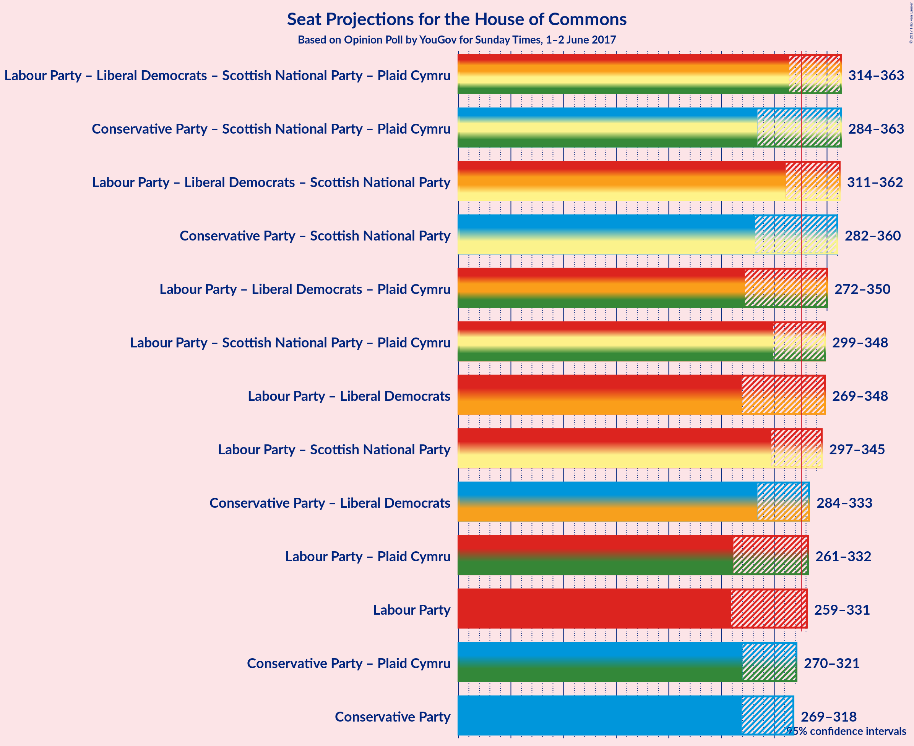

# Opinion Poll by YouGov for Sunday Times, 1–2 June 2017

<a href="#voting-intentions">Voting Intentions</a> | <a href="#seats">Seats</a> | <a href="#coalitions">Coalitions</a> | <a href="#technical-information">Technical Information</a>

## Voting Intentions

### Confidence Intervals

| Party | Last Result | Poll Result | 80% Confidence Interval | 90% Confidence Interval | 95% Confidence Interval | 99% Confidence Interval |
|:-----:|:-----------:|:-----------:|:-----------------------:|:-----------------------:|:-----------------------:|:-----------------------:|
| Labour Party | 30.4% | 40.9% | N/A |N/A |N/A |N/A |
| Conservative Party | 36.9% | 39.9% | N/A |N/A |N/A |N/A |
| Liberal Democrats | 7.9% | 9.0% | N/A |N/A |N/A |N/A |
| UK Independence Party | 12.6% | 4.2% | N/A |N/A |N/A |N/A |
| Scottish National Party | 4.7% | 3.6% | N/A |N/A |N/A |N/A |
| Green Party | 3.8% | 2.0% | N/A |N/A |N/A |N/A |
| Plaid Cymru | 0.6% | 0.4% | N/A |N/A |N/A |N/A |

*Note:* The poll result column reflects the actual value used in the calculations. Published results may vary slightly, and in addition be rounded to fewer digits.

## Seats

### Confidence Intervals

| Party | Last Result | Median | 80% Confidence Interval | 90% Confidence Interval | 95% Confidence Interval | 99% Confidence Interval |
|:-----:|:-----------:|:------:|:-----------------------:|:-----------------------:|:-----------------------:|:-----------------------:|
| <a href="#labour-party">Labour Party</a> | 232 | N/A | N/A |N/A |N/A |N/A |
| <a href="#conservative-party">Conservative Party</a> | 331 | N/A | N/A |N/A |N/A |N/A |
| <a href="#liberal-democrats">Liberal Democrats</a> | 8 | N/A | N/A |N/A |N/A |N/A |
| <a href="#uk-independence-party">UK Independence Party</a> | 1 | N/A | N/A |N/A |N/A |N/A |
| <a href="#scottish-national-party">Scottish National Party</a> | 56 | N/A | N/A |N/A |N/A |N/A |
| <a href="#green-party">Green Party</a> | 1 | N/A | N/A |N/A |N/A |N/A |
| <a href="#plaid-cymru">Plaid Cymru</a> | 3 | N/A | N/A |N/A |N/A |N/A |

## Coalitions

## Technical Information

### Opinion Poll

+ **Pollster:** YouGov
+ **Media:** Sunday Times
+ **Fieldwork period:** 1–2 June 2017

### Calculations

+ **Sample size:** 1569
+ **Simulations done:** 0
+ **Error estimate:** 100.00%

