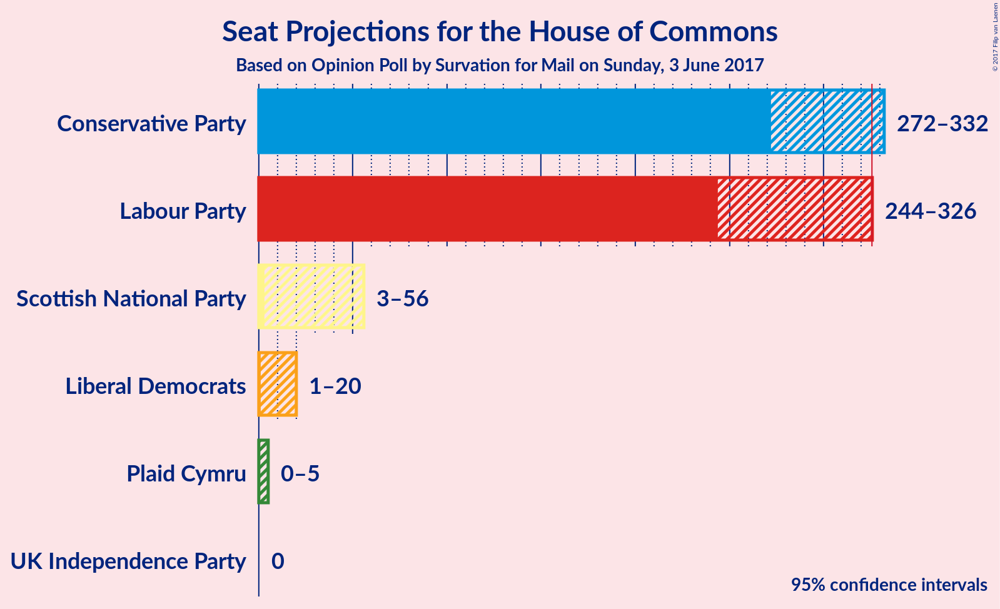

# Opinion Poll by Survation for Mail on Sunday, 3 June 2017

<a href="#voting-intentions">Voting Intentions</a> | <a href="#seats">Seats</a> | <a href="#coalitions">Coalitions</a> | <a href="#technical-information">Technical Information</a>

## Voting Intentions

### Confidence Intervals

| Party | Last Result | Poll Result | 80% Confidence Interval | 90% Confidence Interval | 95% Confidence Interval | 99% Confidence Interval |
|:-----:|:-----------:|:-----------:|:-----------------------:|:-----------------------:|:-----------------------:|:-----------------------:|
| Conservative Party | 36.9% | 41.8% | 37.7–42.1% |37.1–42.7% |36.5–43.3% |35.5–44.4% |
| Labour Party | 30.4% | 41.0% | 36.9–41.4% |36.3–42.0% |35.8–42.5% |34.8–43.6% |
| Liberal Democrats | 7.9% | 8.0% | 6.5–8.9% |6.2–9.3% |6.0–9.6% |5.5–10.3% |
| UK Independence Party | 12.6% | 4.8% | 3.8–5.7% |3.6–6.0% |3.4–6.3% |3.0–6.9% |
| Scottish National Party | 4.7% | 3.8% | 2.9–4.6% |2.7–4.9% |2.5–5.2% |2.2–5.7% |
| Plaid Cymru | 0.6% | 0.5% | 0.3–1.0% |0.2–1.1% |0.2–1.3% |0.1–1.6% |

*Note:* The poll result column reflects the actual value used in the calculations. Published results may vary slightly, and in addition be rounded to fewer digits.

## Seats

### Confidence Intervals

| Party | Last Result | 80% Confidence Interval | 90% Confidence Interval | 95% Confidence Interval | 99% Confidence Interval |
|:-----:|:-----------:|:-----------------------:|:-----------------------:|:-----------------------:|:-----------------------:|
| <a href="#conservative-party">Conservative Party</a> | 331 | 286–324 |277–326 |273–331 |261–343 |
| <a href="#labour-party">Labour Party</a> | 232 | 253–311 |249–321 |246–326 |233–338 |
| <a href="#liberal-democrats">Liberal Democrats</a> | 8 | 3–15 |2–19 |1–21 |1–24 |
| <a href="#uk-independence-party">UK Independence Party</a> | 1 | 0 |0 |0 |0 |
| <a href="#scottish-national-party">Scottish National Party</a> | 56 | 7–53 |4–55 |3–56 |1–58 |
| <a href="#plaid-cymru">Plaid Cymru</a> | 3 | 0–5 |0–5 |0–5 |0–7 |

### Conservative Party

| Number of Seats | Probability | Accumulated |
|:---------------:|:-----------:|:-----------:|
| 253 | 0% | 100% |
| 254 | 0.1% | 99.9% |
| 255 | 0% | 99.9% |
| 256 | 0.1% | 99.8% |
| 257 | 0% | 99.8% |
| 258 | 0.1% | 99.8% |
| 259 | 0% | 99.7% |
| 260 | 0.1% | 99.6% |
| 261 | 0.1% | 99.6% |
| 262 | 0% | 99.5% |
| 263 | 0.2% | 99.5% |
| 264 | 0.1% | 99.2% |
| 265 | 0.1% | 99.1% |
| 266 | 0.1% | 99.0% |
| 267 | 0.2% | 99.0% |
| 268 | 0.2% | 98.7% |
| 269 | 0.2% | 98.5% |
| 270 | 0.2% | 98% |
| 271 | 0.3% | 98% |
| 272 | 0.3% | 98% |
| 273 | 0.6% | 98% |
| 274 | 0.4% | 97% |
| 275 | 0.7% | 97% |
| 276 | 0.6% | 96% |
| 277 | 1.0% | 95% |
| 278 | 0.6% | 94% |
| 279 | 0.4% | 94% |
| 280 | 0.3% | 93% |
| 281 | 0.4% | 93% |
| 282 | 0.6% | 93% |
| 283 | 0.4% | 92% |
| 284 | 0.4% | 92% |
| 285 | 1.1% | 91% |
| 286 | 1.5% | 90% |
| 287 | 2% | 89% |
| 288 | 1.2% | 87% |
| 289 | 1.1% | 86% |
| 290 | 1.0% | 85% |
| 291 | 0.8% | 84% |
| 292 | 2% | 83% |
| 293 | 1.1% | 81% |
| 294 | 2% | 80% |
| 295 | 0.7% | 77% |
| 296 | 3% | 77% |
| 297 | 1.0% | 74% |
| 298 | 0.8% | 73% |
| 299 | 0.8% | 72% |
| 300 | 0.4% | 71% |
| 301 | 1.3% | 71% |
| 302 | 1.1% | 70% |
| 303 | 3% | 69% |
| 304 | 3% | 66% |
| 305 | 3% | 63% |
| 306 | 1.4% | 60% |
| 307 | 2% | 58% |
| 308 | 1.4% | 57% |
| 309 | 0.7% | 55% |
| 310 | 4% | 55% |
| 311 | 3% | 51% |
| 312 | 2% | 48% |
| 313 | 6% | 46% |
| 314 | 7% | 39% |
| 315 | 7% | 32% |
| 316 | 2% | 25% |
| 317 | 1.3% | 23% |
| 318 | 2% | 22% |
| 319 | 2% | 20% |
| 320 | 2% | 18% |
| 321 | 1.0% | 16% |
| 322 | 1.5% | 15% |
| 323 | 2% | 14% |
| 324 | 4% | 12% |
| 325 | 2% | 8% |
| 326 | 2% | 6% |
| 327 | 0.5% | 4% |
| 328 | 0.3% | 4% |
| 329 | 0.5% | 4% |
| 330 | 0.4% | 3% |
| 331 | 0.4% | 3% |
| 332 | 0.1% | 2% |
| 333 | 0.1% | 2% |
| 334 | 0.1% | 2% |
| 335 | 0.2% | 2% |
| 336 | 0.3% | 2% |
| 337 | 0.2% | 2% |
| 338 | 0.1% | 1.3% |
| 339 | 0.2% | 1.2% |
| 340 | 0.1% | 1.1% |
| 341 | 0.1% | 1.0% |
| 342 | 0.2% | 0.9% |
| 343 | 0.2% | 0.7% |
| 344 | 0.1% | 0.5% |
| 345 | 0.1% | 0.4% |
| 346 | 0% | 0.3% |
| 347 | 0% | 0.2% |
| 348 | 0% | 0.2% |
| 349 | 0% | 0.2% |
| 350 | 0% | 0.1% |
| 351 | 0% | 0.1% |
| 352 | 0% | 0.1% |
| 353 | 0% | 0.1% |
| 354 | 0% | 0.1% |
| 355 | 0% | 0% |

### Labour Party

| Number of Seats | Probability | Accumulated |
|:---------------:|:-----------:|:-----------:|
| 220 | 0% | 100% |
| 221 | 0% | 99.9% |
| 222 | 0% | 99.9% |
| 223 | 0% | 99.9% |
| 224 | 0% | 99.9% |
| 225 | 0% | 99.9% |
| 226 | 0% | 99.9% |
| 227 | 0% | 99.8% |
| 228 | 0% | 99.8% |
| 229 | 0% | 99.8% |
| 230 | 0.1% | 99.8% |
| 231 | 0% | 99.7% |
| 232 | 0.1% | 99.6% |
| 233 | 0.2% | 99.5% |
| 234 | 0% | 99.4% |
| 235 | 0.1% | 99.3% |
| 236 | 0.1% | 99.2% |
| 237 | 0.1% | 99.2% |
| 238 | 0.2% | 99.1% |
| 239 | 0.1% | 98.9% |
| 240 | 0.3% | 98.8% |
| 241 | 0.1% | 98.5% |
| 242 | 0.2% | 98% |
| 243 | 0.3% | 98% |
| 244 | 0.2% | 98% |
| 245 | 0.2% | 98% |
| 246 | 0.7% | 98% |
| 247 | 0.3% | 97% |
| 248 | 0.4% | 97% |
| 249 | 2% | 96% |
| 250 | 0.6% | 94% |
| 251 | 0.8% | 93% |
| 252 | 0.6% | 93% |
| 253 | 2% | 92% |
| 254 | 0.8% | 90% |
| 255 | 0.9% | 89% |
| 256 | 2% | 88% |
| 257 | 2% | 87% |
| 258 | 2% | 84% |
| 259 | 3% | 82% |
| 260 | 2% | 80% |
| 261 | 0.6% | 78% |
| 262 | 2% | 77% |
| 263 | 0.8% | 75% |
| 264 | 2% | 74% |
| 265 | 0.9% | 72% |
| 266 | 2% | 71% |
| 267 | 4% | 69% |
| 268 | 2% | 65% |
| 269 | 0.7% | 64% |
| 270 | 2% | 63% |
| 271 | 7% | 61% |
| 272 | 2% | 54% |
| 273 | 0.2% | 53% |
| 274 | 2% | 53% |
| 275 | 3% | 51% |
| 276 | 2% | 48% |
| 277 | 0.9% | 47% |
| 278 | 0.5% | 46% |
| 279 | 0.8% | 45% |
| 280 | 1.3% | 45% |
| 281 | 0.6% | 43% |
| 282 | 2% | 43% |
| 283 | 1.3% | 41% |
| 284 | 0.8% | 40% |
| 285 | 2% | 39% |
| 286 | 0.6% | 37% |
| 287 | 1.2% | 37% |
| 288 | 0.5% | 36% |
| 289 | 0.9% | 35% |
| 290 | 2% | 34% |
| 291 | 2% | 32% |
| 292 | 0.7% | 30% |
| 293 | 2% | 29% |
| 294 | 0.5% | 27% |
| 295 | 3% | 27% |
| 296 | 0.6% | 24% |
| 297 | 2% | 23% |
| 298 | 0.6% | 22% |
| 299 | 0.3% | 21% |
| 300 | 2% | 21% |
| 301 | 0.3% | 18% |
| 302 | 3% | 18% |
| 303 | 0.6% | 15% |
| 304 | 0.7% | 15% |
| 305 | 0.7% | 14% |
| 306 | 0.8% | 13% |
| 307 | 2% | 13% |
| 308 | 0.3% | 11% |
| 309 | 0.2% | 11% |
| 310 | 0.5% | 11% |
| 311 | 0.6% | 10% |
| 312 | 0.8% | 10% |
| 313 | 0.5% | 9% |
| 314 | 0.3% | 8% |
| 315 | 0.1% | 8% |
| 316 | 0.5% | 8% |
| 317 | 0.4% | 7% |
| 318 | 0.2% | 7% |
| 319 | 0.2% | 7% |
| 320 | 0.9% | 7% |
| 321 | 0.8% | 6% |
| 322 | 0.1% | 5% |
| 323 | 0.9% | 5% |
| 324 | 0% | 4% |
| 325 | 0.7% | 4% |
| 326 | 0.6% | 3% |
| 327 | 0.3% | 2% |
| 328 | 0.3% | 2% |
| 329 | 0.2% | 2% |
| 330 | 0.3% | 2% |
| 331 | 0.2% | 1.4% |
| 332 | 0.3% | 1.2% |
| 333 | 0.1% | 0.8% |
| 334 | 0% | 0.7% |
| 335 | 0.1% | 0.7% |
| 336 | 0% | 0.6% |
| 337 | 0% | 0.5% |
| 338 | 0.1% | 0.5% |
| 339 | 0% | 0.4% |
| 340 | 0% | 0.4% |
| 341 | 0% | 0.4% |
| 342 | 0% | 0.3% |
| 343 | 0.1% | 0.3% |
| 344 | 0% | 0.2% |
| 345 | 0.1% | 0.2% |
| 346 | 0% | 0.1% |
| 347 | 0% | 0.1% |
| 348 | 0% | 0.1% |
| 349 | 0% | 0% |

### Liberal Democrats

| Number of Seats | Probability | Accumulated |
|:---------------:|:-----------:|:-----------:|
| 0 | 0.2% | 100% |
| 1 | 3% | 99.8% |
| 2 | 6% | 97% |
| 3 | 9% | 91% |
| 4 | 8% | 82% |
| 5 | 5% | 74% |
| 6 | 9% | 69% |
| 7 | 9% | 60% |
| 8 | 5% | 51% |
| 9 | 7% | 46% |
| 10 | 6% | 39% |
| 11 | 8% | 32% |
| 12 | 6% | 24% |
| 13 | 4% | 18% |
| 14 | 4% | 15% |
| 15 | 1.4% | 11% |
| 16 | 1.3% | 9% |
| 17 | 1.2% | 8% |
| 18 | 2% | 7% |
| 19 | 1.2% | 5% |
| 20 | 1.3% | 4% |
| 21 | 0.5% | 3% |
| 22 | 1.2% | 2% |
| 23 | 0.5% | 1.1% |
| 24 | 0.2% | 0.6% |
| 25 | 0.1% | 0.4% |
| 26 | 0.1% | 0.2% |
| 27 | 0.1% | 0.2% |
| 28 | 0% | 0.1% |
| 29 | 0% | 0.1% |
| 30 | 0% | 0% |

### UK Independence Party

| Number of Seats | Probability | Accumulated |
|:---------------:|:-----------:|:-----------:|
| 0 | 100% | 100% |
| 1 | 0% | 0% |

### Scottish National Party

| Number of Seats | Probability | Accumulated |
|:---------------:|:-----------:|:-----------:|
| 0 | 0.2% | 100% |
| 1 | 1.0% | 99.8% |
| 2 | 0.6% | 98.8% |
| 3 | 1.4% | 98% |
| 4 | 2% | 97% |
| 5 | 2% | 95% |
| 6 | 2% | 93% |
| 7 | 2% | 91% |
| 8 | 2% | 89% |
| 9 | 1.4% | 88% |
| 10 | 1.2% | 86% |
| 11 | 2% | 85% |
| 12 | 2% | 83% |
| 13 | 2% | 81% |
| 14 | 0.5% | 79% |
| 15 | 0.8% | 79% |
| 16 | 1.4% | 78% |
| 17 | 2% | 76% |
| 18 | 0.6% | 74% |
| 19 | 0.8% | 74% |
| 20 | 0.2% | 73% |
| 21 | 1.3% | 73% |
| 22 | 0.6% | 72% |
| 23 | 2% | 71% |
| 24 | 0.8% | 69% |
| 25 | 2% | 68% |
| 26 | 0.5% | 67% |
| 27 | 0.6% | 66% |
| 28 | 4% | 66% |
| 29 | 0.6% | 62% |
| 30 | 2% | 62% |
| 31 | 1.0% | 59% |
| 32 | 1.2% | 58% |
| 33 | 2% | 57% |
| 34 | 3% | 55% |
| 35 | 0.9% | 51% |
| 36 | 0.9% | 50% |
| 37 | 0.2% | 49% |
| 38 | 2% | 49% |
| 39 | 0.5% | 47% |
| 40 | 2% | 47% |
| 41 | 1.0% | 45% |
| 42 | 3% | 44% |
| 43 | 1.0% | 42% |
| 44 | 0.8% | 40% |
| 45 | 2% | 40% |
| 46 | 1.2% | 38% |
| 47 | 1.2% | 36% |
| 48 | 2% | 35% |
| 49 | 6% | 33% |
| 50 | 6% | 27% |
| 51 | 5% | 21% |
| 52 | 6% | 17% |
| 53 | 2% | 11% |
| 54 | 2% | 9% |
| 55 | 3% | 6% |
| 56 | 0.9% | 3% |
| 57 | 1.3% | 2% |
| 58 | 1.1% | 1.1% |
| 59 | 0% | 0% |

### Plaid Cymru

| Number of Seats | Probability | Accumulated |
|:---------------:|:-----------:|:-----------:|
| 0 | 18% | 100% |
| 1 | 22% | 82% |
| 2 | 4% | 60% |
| 3 | 23% | 56% |
| 4 | 9% | 33% |
| 5 | 21% | 23% |
| 6 | 0.5% | 2% |
| 7 | 1.0% | 1.1% |
| 8 | 0.1% | 0.1% |
| 9 | 0% | 0% |

## Coalitions

### Confidence Intervals

| Coalition | Last Result | 80% Confidence Interval | 90% Confidence Interval | 95% Confidence Interval | 99% Confidence Interval |
|:---------:|:-----------:|:-----------------------:|:-----------------------:|:-----------------------:|:-----------------------:|
| Conservative Party – Scottish National Party – Plaid Cymru | 390 | 309–371 | 298–378 | 293–380 | 280–393 |
| Conservative Party – Scottish National Party | 387 | 308–370 | 296–374 | 291–377 | 278–390 |
| Labour Party – Liberal Democrats – Scottish National Party – Plaid Cymru | 299 | 307–345 | 305–354 | 300–358 | 288–370 |
| Labour Party – Liberal Democrats – Scottish National Party | 296 | 304–343 | 302–352 | 296–357 | 285–367 |
| Labour Party – Scottish National Party – Plaid Cymru | 291 | 298–337 | 294–346 | 289–351 | 278–361 |
| Labour Party – Scottish National Party | 288 | 295–335 | 291–343 | 286–348 | 275–359 |
| Conservative Party – Liberal Democrats | 339 | 294–333 | 285–337 | 280–342 | 270–353 |
| Labour Party – Liberal Democrats – Plaid Cymru | 243 | 261–323 | 257–335 | 254–340 | 241–353 |
| Labour Party – Liberal Democrats | 240 | 260–322 | 253–333 | 251–338 | 238–351 |
| Conservative Party – Plaid Cymru | 334 | 288–327 | 279–329 | 274–335 | 264–346 |
| Conservative Party | 331 | 286–324 | 277–326 | 273–331 | 261–343 |
| Labour Party – Plaid Cymru | 235 | 256–312 | 252–325 | 249–328 | 236–341 |
| Labour Party | 232 | 253–311 | 249–321 | 246–326 | 233–338 |

## Technical Information

### Opinion Poll

+ **Pollster:** Survation
+ **Media:** Mail on Sunday
+ **Fieldwork period:** 3 June 2017

### Calculations

+ **Sample size:** 765
+ **Simulations done:** 262,144
+ **Error estimate:** 2.09%

