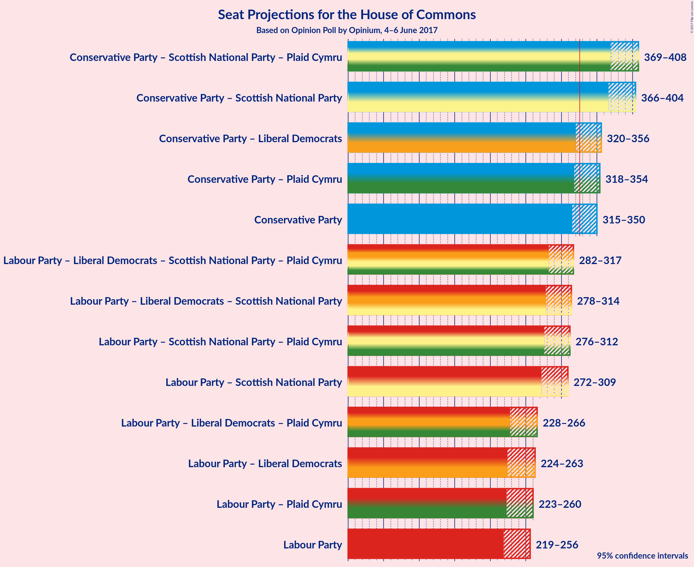

# Opinion Poll by Opinium, 4–6 June 2017

<a href="#voting-intentions">Voting Intentions</a> | <a href="#seats">Seats</a> | <a href="#coalitions">Coalitions</a> | <a href="#technical-information">Technical Information</a>

## Voting Intentions

### Confidence Intervals

| Party | Last Result | Poll Result | 80% Confidence Interval | 90% Confidence Interval | 95% Confidence Interval | 99% Confidence Interval |
|:-----:|:-----------:|:-----------:|:-----------------------:|:-----------------------:|:-----------------------:|:-----------------------:|
| Conservative Party | 36.9% | 43.6% | 42.0–44.9% |41.6–45.3% |41.3–45.6% |40.6–46.3% |
| Labour Party | 30.4% | 36.4% | 34.9–37.7% |34.5–38.1% |34.2–38.4% |33.5–39.1% |
| Liberal Democrats | 7.9% | 7.9% | 7.2–8.7% |7.0–9.0% |6.8–9.2% |6.5–9.6% |
| UK Independence Party | 12.6% | 4.6% | 4.1–5.3% |3.9–5.5% |3.8–5.6% |3.5–5.9% |
| Scottish National Party | 4.7% | 4.6% | 4.1–5.3% |3.9–5.5% |3.8–5.6% |3.5–5.9% |
| Green Party | 3.8% | 2.2% | 1.8–2.7% |1.7–2.8% |1.6–3.0% |1.5–3.2% |
| Plaid Cymru | 0.6% | 0.7% | 0.5–1.0% |0.4–1.0% |0.4–1.1% |0.3–1.3% |

*Note:* The poll result column reflects the actual value used in the calculations. Published results may vary slightly, and in addition be rounded to fewer digits.

## Seats

### Confidence Intervals

| Party | Last Result | Median | 80% Confidence Interval | 90% Confidence Interval | 95% Confidence Interval | 99% Confidence Interval |
|:-----:|:-----------:|:------:|:-----------------------:|:-----------------------:|:-----------------------:|:-----------------------:|
| <a href="#conservative-party">Conservative Party</a> | 331 | 330 | 319–345 |318–349 |315–350 |312–354 |
| <a href="#labour-party">Labour Party</a> | 232 | 240 | 224–251 |221–254 |219–257 |215–262 |
| <a href="#liberal-democrats">Liberal Democrats</a> | 8 | 5 | 2–9 |2–10 |1–12 |1–14 |
| <a href="#uk-independence-party">UK Independence Party</a> | 1 | 0 | 0 |0 |0 |0 |
| <a href="#scottish-national-party">Scottish National Party</a> | 56 | 54 | 49–56 |47–57 |45–58 |33–58 |
| <a href="#green-party">Green Party</a> | 1 | 0 | 0 |0 |0–1 |0–1 |
| <a href="#plaid-cymru">Plaid Cymru</a> | 3 | 3 | 2–5 |1–5 |0–5 |0–6 |

### Conservative Party

| Number of Seats | Probability | Accumulated |
|:---------------:|:-----------:|:-----------:|
| 307 | 0% | 100% |
| 308 | 0.1% | 99.9% |
| 309 | 0% | 99.9% |
| 310 | 0.1% | 99.8% |
| 311 | 0.2% | 99.8% |
| 312 | 0.6% | 99.6% |
| 313 | 0.5% | 99.0% |
| 314 | 0.9% | 98.5% |
| 315 | 0.5% | 98% |
| 316 | 0.8% | 97% |
| 317 | 0.7% | 96% |
| 318 | 5% | 96% |
| 319 | 3% | 91% |
| 320 | 6% | 88% |
| 321 | 6% | 83% |
| 322 | 4% | 77% |
| 323 | 6% | 73% |
| 324 | 2% | 66% |
| 325 | 1.2% | 65% |
| 326 | 3% | 63% |
| 327 | 5% | 61% |
| 328 | 3% | 56% |
| 329 | 0.7% | 53% |
| 330 | 5% | 52% |
| 331 | 2% | 47% |
| 332 | 5% | 45% |
| 333 | 5% | 40% |
| 334 | 1.1% | 35% |
| 335 | 4% | 34% |
| 336 | 3% | 30% |
| 337 | 4% | 27% |
| 338 | 0.6% | 23% |
| 339 | 2% | 22% |
| 340 | 2% | 20% |
| 341 | 3% | 18% |
| 342 | 3% | 15% |
| 343 | 1.1% | 12% |
| 344 | 0.6% | 11% |
| 345 | 1.5% | 10% |
| 346 | 1.3% | 9% |
| 347 | 1.1% | 8% |
| 348 | 0.9% | 6% |
| 349 | 3% | 6% |
| 350 | 1.3% | 3% |
| 351 | 0.4% | 2% |
| 352 | 0.4% | 1.3% |
| 353 | 0.3% | 1.0% |
| 354 | 0.4% | 0.7% |
| 355 | 0.1% | 0.3% |
| 356 | 0.1% | 0.2% |
| 357 | 0.1% | 0.2% |
| 358 | 0% | 0.1% |
| 359 | 0% | 0.1% |
| 360 | 0% | 0% |

### Labour Party

| Number of Seats | Probability | Accumulated |
|:---------------:|:-----------:|:-----------:|
| 210 | 0% | 100% |
| 211 | 0% | 99.9% |
| 212 | 0% | 99.9% |
| 213 | 0.2% | 99.9% |
| 214 | 0.1% | 99.7% |
| 215 | 0.2% | 99.6% |
| 216 | 0.2% | 99.4% |
| 217 | 0.2% | 99.2% |
| 218 | 0.6% | 99.0% |
| 219 | 1.3% | 98% |
| 220 | 1.4% | 97% |
| 221 | 0.8% | 96% |
| 222 | 2% | 95% |
| 223 | 2% | 93% |
| 224 | 1.5% | 91% |
| 225 | 0.5% | 90% |
| 226 | 2% | 89% |
| 227 | 1.3% | 87% |
| 228 | 3% | 86% |
| 229 | 3% | 84% |
| 230 | 2% | 81% |
| 231 | 2% | 79% |
| 232 | 2% | 77% |
| 233 | 6% | 76% |
| 234 | 3% | 69% |
| 235 | 2% | 67% |
| 236 | 4% | 65% |
| 237 | 2% | 61% |
| 238 | 4% | 59% |
| 239 | 2% | 55% |
| 240 | 3% | 53% |
| 241 | 4% | 50% |
| 242 | 4% | 46% |
| 243 | 2% | 42% |
| 244 | 3% | 40% |
| 245 | 2% | 37% |
| 246 | 3% | 35% |
| 247 | 5% | 31% |
| 248 | 5% | 26% |
| 249 | 3% | 21% |
| 250 | 4% | 18% |
| 251 | 5% | 14% |
| 252 | 2% | 9% |
| 253 | 1.4% | 7% |
| 254 | 1.5% | 6% |
| 255 | 2% | 5% |
| 256 | 0.4% | 3% |
| 257 | 0.8% | 3% |
| 258 | 0.4% | 2% |
| 259 | 0.4% | 1.4% |
| 260 | 0.1% | 1.0% |
| 261 | 0.3% | 0.9% |
| 262 | 0.1% | 0.6% |
| 263 | 0.1% | 0.5% |
| 264 | 0.1% | 0.4% |
| 265 | 0% | 0.3% |
| 266 | 0.1% | 0.3% |
| 267 | 0% | 0.2% |
| 268 | 0% | 0.2% |
| 269 | 0.1% | 0.2% |
| 270 | 0% | 0.1% |
| 271 | 0% | 0.1% |
| 272 | 0% | 0.1% |
| 273 | 0% | 0.1% |
| 274 | 0% | 0% |

### Liberal Democrats

| Number of Seats | Probability | Accumulated |
|:---------------:|:-----------:|:-----------:|
| 1 | 3% | 100% |
| 2 | 9% | 97% |
| 3 | 13% | 88% |
| 4 | 17% | 74% |
| 5 | 15% | 58% |
| 6 | 11% | 42% |
| 7 | 7% | 31% |
| 8 | 7% | 24% |
| 9 | 8% | 17% |
| 10 | 5% | 9% |
| 11 | 1.0% | 4% |
| 12 | 0.9% | 3% |
| 13 | 1.2% | 2% |
| 14 | 0.5% | 0.9% |
| 15 | 0.2% | 0.4% |
| 16 | 0% | 0.2% |
| 17 | 0% | 0.1% |
| 18 | 0% | 0.1% |
| 19 | 0.1% | 0.1% |
| 20 | 0% | 0% |

### UK Independence Party

| Number of Seats | Probability | Accumulated |
|:---------------:|:-----------:|:-----------:|
| 0 | 100% | 100% |
| 1 | 0% | 0% |

### Scottish National Party

| Number of Seats | Probability | Accumulated |
|:---------------:|:-----------:|:-----------:|
| 23 | 0% | 100% |
| 24 | 0% | 99.9% |
| 25 | 0% | 99.9% |
| 26 | 0% | 99.9% |
| 27 | 0.1% | 99.9% |
| 28 | 0.1% | 99.8% |
| 29 | 0% | 99.8% |
| 30 | 0.1% | 99.7% |
| 31 | 0.1% | 99.7% |
| 32 | 0.1% | 99.6% |
| 33 | 0.1% | 99.5% |
| 34 | 0.1% | 99.4% |
| 35 | 0% | 99.4% |
| 36 | 0.1% | 99.4% |
| 37 | 0% | 99.3% |
| 38 | 0% | 99.2% |
| 39 | 0.1% | 99.2% |
| 40 | 0.1% | 99.1% |
| 41 | 0.1% | 99.0% |
| 42 | 0.2% | 98.9% |
| 43 | 0.2% | 98.7% |
| 44 | 0.6% | 98% |
| 45 | 0.7% | 98% |
| 46 | 2% | 97% |
| 47 | 2% | 95% |
| 48 | 1.5% | 93% |
| 49 | 2% | 92% |
| 50 | 5% | 90% |
| 51 | 7% | 85% |
| 52 | 8% | 78% |
| 53 | 3% | 70% |
| 54 | 28% | 67% |
| 55 | 22% | 39% |
| 56 | 12% | 18% |
| 57 | 3% | 6% |
| 58 | 3% | 3% |
| 59 | 0.1% | 0.1% |
| 60 | 0% | 0% |

### Green Party

| Number of Seats | Probability | Accumulated |
|:---------------:|:-----------:|:-----------:|
| 0 | 96% | 100% |
| 1 | 4% | 4% |
| 2 | 0% | 0% |

### Plaid Cymru

| Number of Seats | Probability | Accumulated |
|:---------------:|:-----------:|:-----------:|
| 0 | 4% | 100% |
| 1 | 4% | 96% |
| 2 | 5% | 92% |
| 3 | 44% | 87% |
| 4 | 11% | 43% |
| 5 | 31% | 31% |
| 6 | 0.3% | 0.6% |
| 7 | 0.3% | 0.3% |
| 8 | 0% | 0% |

## Coalitions

### Confidence Intervals

| Coalition | Last Result | Median | 80% Confidence Interval | 90% Confidence Interval | 95% Confidence Interval | 99% Confidence Interval |
|:---------:|:-----------:|:------:|:-----------------------:|:-----------------------:|:-----------------------:|:-----------------------:|
| Conservative Party – Scottish National Party – Plaid Cymru | 390 | 386 | 375–403 | 373–406 | 369–408 | 361–412 |
| Conservative Party – Scottish National Party | 387 | 383 | 371–398 | 369–402 | 366–404 | 358–408 |
| Conservative Party – Liberal Democrats | 339 | 335 | 324–350 | 323–354 | 320–356 | 317–361 |
| Conservative Party – Plaid Cymru | 334 | 333 | 322–348 | 321–352 | 318–355 | 315–358 |
| Conservative Party | 331 | 330 | 319–345 | 318–349 | 315–350 | 312–354 |
| Labour Party – Liberal Democrats – Scottish National Party – Plaid Cymru | 299 | 302 | 287–313 | 283–314 | 282–317 | 278–320 |
| Labour Party – Liberal Democrats – Scottish National Party | 296 | 299 | 284–310 | 280–311 | 277–314 | 274–317 |
| Labour Party – Scottish National Party – Plaid Cymru | 291 | 297 | 282–308 | 278–309 | 276–312 | 271–315 |
| Labour Party – Scottish National Party | 288 | 293 | 278–305 | 275–306 | 272–309 | 267–311 |
| Labour Party – Liberal Democrats – Plaid Cymru | 243 | 249 | 234–261 | 230–263 | 228–266 | 224–274 |
| Labour Party – Liberal Democrats | 240 | 246 | 229–257 | 226–259 | 224–263 | 220–271 |
| Labour Party – Plaid Cymru | 235 | 244 | 229–255 | 225–257 | 223–260 | 219–265 |
| Labour Party | 232 | 240 | 224–251 | 221–254 | 219–257 | 215–262 |

### Conservative Party – Scottish National Party – Plaid Cymru

| Number of Seats | Probability | Accumulated |
|:---------------:|:-----------:|:-----------:|
| 351 | 0% | 100% |
| 352 | 0% | 99.9% |
| 353 | 0.1% | 99.9% |
| 354 | 0% | 99.8% |
| 355 | 0% | 99.8% |
| 356 | 0.1% | 99.8% |
| 357 | 0.1% | 99.7% |
| 358 | 0% | 99.6% |
| 359 | 0% | 99.6% |
| 360 | 0% | 99.6% |
| 361 | 0.1% | 99.5% |
| 362 | 0% | 99.5% |
| 363 | 0.2% | 99.4% |
| 364 | 0.1% | 99.2% |
| 365 | 0.2% | 99.1% |
| 366 | 0.3% | 99.0% |
| 367 | 0.5% | 98.6% |
| 368 | 0.5% | 98% |
| 369 | 0.5% | 98% |
| 370 | 0.4% | 97% |
| 371 | 0.8% | 97% |
| 372 | 0.8% | 96% |
| 373 | 3% | 95% |
| 374 | 2% | 92% |
| 375 | 5% | 90% |
| 376 | 2% | 85% |
| 377 | 4% | 83% |
| 378 | 3% | 79% |
| 379 | 3% | 76% |
| 380 | 5% | 73% |
| 381 | 4% | 68% |
| 382 | 2% | 64% |
| 383 | 2% | 62% |
| 384 | 4% | 60% |
| 385 | 4% | 56% |
| 386 | 3% | 52% |
| 387 | 2% | 50% |
| 388 | 4% | 48% |
| 389 | 3% | 44% |
| 390 | 5% | 41% |
| 391 | 3% | 35% |
| 392 | 3% | 33% |
| 393 | 2% | 30% |
| 394 | 4% | 28% |
| 395 | 3% | 24% |
| 396 | 1.3% | 21% |
| 397 | 2% | 20% |
| 398 | 2% | 18% |
| 399 | 1.4% | 16% |
| 400 | 2% | 15% |
| 401 | 2% | 13% |
| 402 | 2% | 12% |
| 403 | 2% | 10% |
| 404 | 1.5% | 8% |
| 405 | 0.5% | 6% |
| 406 | 2% | 6% |
| 407 | 0.8% | 4% |
| 408 | 1.0% | 3% |
| 409 | 0.7% | 2% |
| 410 | 0.2% | 1.4% |
| 411 | 0.5% | 1.1% |
| 412 | 0.2% | 0.6% |
| 413 | 0.1% | 0.4% |
| 414 | 0.2% | 0.3% |
| 415 | 0% | 0.1% |
| 416 | 0% | 0.1% |
| 417 | 0% | 0.1% |
| 418 | 0% | 0% |

### Conservative Party – Scottish National Party

| Number of Seats | Probability | Accumulated |
|:---------------:|:-----------:|:-----------:|
| 348 | 0% | 100% |
| 349 | 0% | 99.9% |
| 350 | 0.1% | 99.9% |
| 351 | 0% | 99.8% |
| 352 | 0% | 99.8% |
| 353 | 0% | 99.8% |
| 354 | 0% | 99.7% |
| 355 | 0.1% | 99.7% |
| 356 | 0% | 99.6% |
| 357 | 0% | 99.6% |
| 358 | 0% | 99.5% |
| 359 | 0.1% | 99.5% |
| 360 | 0.2% | 99.4% |
| 361 | 0.1% | 99.2% |
| 362 | 0.3% | 99.1% |
| 363 | 0.4% | 98.8% |
| 364 | 0.5% | 98% |
| 365 | 0.3% | 98% |
| 366 | 0.4% | 98% |
| 367 | 0.7% | 97% |
| 368 | 0.9% | 97% |
| 369 | 0.9% | 96% |
| 370 | 3% | 95% |
| 371 | 3% | 92% |
| 372 | 3% | 88% |
| 373 | 4% | 85% |
| 374 | 4% | 82% |
| 375 | 4% | 78% |
| 376 | 3% | 73% |
| 377 | 5% | 70% |
| 378 | 3% | 65% |
| 379 | 2% | 63% |
| 380 | 2% | 60% |
| 381 | 3% | 59% |
| 382 | 5% | 56% |
| 383 | 4% | 51% |
| 384 | 1.4% | 47% |
| 385 | 3% | 46% |
| 386 | 5% | 43% |
| 387 | 5% | 38% |
| 388 | 2% | 34% |
| 389 | 2% | 32% |
| 390 | 4% | 30% |
| 391 | 4% | 26% |
| 392 | 2% | 22% |
| 393 | 0.5% | 20% |
| 394 | 2% | 19% |
| 395 | 2% | 18% |
| 396 | 2% | 15% |
| 397 | 3% | 14% |
| 398 | 2% | 11% |
| 399 | 1.2% | 9% |
| 400 | 0.8% | 8% |
| 401 | 1.4% | 7% |
| 402 | 2% | 6% |
| 403 | 1.2% | 4% |
| 404 | 1.3% | 3% |
| 405 | 0.5% | 2% |
| 406 | 0.5% | 1.4% |
| 407 | 0.1% | 0.8% |
| 408 | 0.3% | 0.7% |
| 409 | 0.2% | 0.4% |
| 410 | 0.1% | 0.2% |
| 411 | 0% | 0.1% |
| 412 | 0% | 0.1% |
| 413 | 0% | 0.1% |
| 414 | 0% | 0.1% |
| 415 | 0% | 0% |

### Conservative Party – Liberal Democrats

| Number of Seats | Probability | Accumulated |
|:---------------:|:-----------:|:-----------:|
| 312 | 0% | 100% |
| 313 | 0% | 99.9% |
| 314 | 0.1% | 99.9% |
| 315 | 0.1% | 99.9% |
| 316 | 0.1% | 99.8% |
| 317 | 0.4% | 99.7% |
| 318 | 0.8% | 99.3% |
| 319 | 0.3% | 98% |
| 320 | 1.2% | 98% |
| 321 | 0.7% | 97% |
| 322 | 0.9% | 96% |
| 323 | 3% | 95% |
| 324 | 4% | 93% |
| 325 | 6% | 88% |
| 326 | 4% | 82% |
| 327 | 2% | 79% |
| 328 | 5% | 76% |
| 329 | 4% | 71% |
| 330 | 3% | 67% |
| 331 | 3% | 64% |
| 332 | 6% | 62% |
| 333 | 2% | 55% |
| 334 | 2% | 53% |
| 335 | 3% | 52% |
| 336 | 3% | 49% |
| 337 | 2% | 46% |
| 338 | 4% | 44% |
| 339 | 3% | 40% |
| 340 | 5% | 37% |
| 341 | 1.4% | 32% |
| 342 | 4% | 31% |
| 343 | 4% | 26% |
| 344 | 2% | 22% |
| 345 | 3% | 20% |
| 346 | 2% | 17% |
| 347 | 1.4% | 15% |
| 348 | 2% | 14% |
| 349 | 2% | 12% |
| 350 | 0.9% | 10% |
| 351 | 1.0% | 9% |
| 352 | 2% | 8% |
| 353 | 1.4% | 7% |
| 354 | 2% | 5% |
| 355 | 0.5% | 3% |
| 356 | 1.1% | 3% |
| 357 | 0.6% | 2% |
| 358 | 0.4% | 1.2% |
| 359 | 0.1% | 0.8% |
| 360 | 0.1% | 0.7% |
| 361 | 0.2% | 0.6% |
| 362 | 0.1% | 0.3% |
| 363 | 0.1% | 0.2% |
| 364 | 0% | 0.1% |
| 365 | 0% | 0.1% |
| 366 | 0% | 0.1% |
| 367 | 0% | 0.1% |
| 368 | 0% | 0% |

### Conservative Party – Plaid Cymru

| Number of Seats | Probability | Accumulated |
|:---------------:|:-----------:|:-----------:|
| 310 | 0% | 100% |
| 311 | 0% | 99.9% |
| 312 | 0% | 99.9% |
| 313 | 0.1% | 99.9% |
| 314 | 0.2% | 99.8% |
| 315 | 0.6% | 99.6% |
| 316 | 0.2% | 99.1% |
| 317 | 0.8% | 98.8% |
| 318 | 0.7% | 98% |
| 319 | 2% | 97% |
| 320 | 0.7% | 96% |
| 321 | 3% | 95% |
| 322 | 3% | 92% |
| 323 | 4% | 88% |
| 324 | 4% | 85% |
| 325 | 6% | 81% |
| 326 | 5% | 75% |
| 327 | 3% | 70% |
| 328 | 3% | 68% |
| 329 | 3% | 64% |
| 330 | 5% | 62% |
| 331 | 2% | 57% |
| 332 | 0.8% | 54% |
| 333 | 6% | 53% |
| 334 | 1.0% | 48% |
| 335 | 5% | 47% |
| 336 | 5% | 42% |
| 337 | 3% | 37% |
| 338 | 4% | 35% |
| 339 | 3% | 31% |
| 340 | 5% | 28% |
| 341 | 2% | 24% |
| 342 | 2% | 22% |
| 343 | 2% | 20% |
| 344 | 2% | 18% |
| 345 | 1.2% | 16% |
| 346 | 2% | 15% |
| 347 | 2% | 14% |
| 348 | 2% | 11% |
| 349 | 1.2% | 9% |
| 350 | 1.3% | 8% |
| 351 | 0.9% | 7% |
| 352 | 2% | 6% |
| 353 | 1.0% | 5% |
| 354 | 0.9% | 4% |
| 355 | 1.4% | 3% |
| 356 | 0.3% | 1.2% |
| 357 | 0.1% | 0.9% |
| 358 | 0.3% | 0.7% |
| 359 | 0.2% | 0.4% |
| 360 | 0.1% | 0.2% |
| 361 | 0% | 0.1% |
| 362 | 0% | 0.1% |
| 363 | 0% | 0.1% |
| 364 | 0% | 0.1% |
| 365 | 0% | 0% |

### Conservative Party

| Number of Seats | Probability | Accumulated |
|:---------------:|:-----------:|:-----------:|
| 307 | 0% | 100% |
| 308 | 0.1% | 99.9% |
| 309 | 0% | 99.9% |
| 310 | 0.1% | 99.8% |
| 311 | 0.2% | 99.8% |
| 312 | 0.6% | 99.6% |
| 313 | 0.5% | 99.0% |
| 314 | 0.9% | 98.5% |
| 315 | 0.5% | 98% |
| 316 | 0.8% | 97% |
| 317 | 0.7% | 96% |
| 318 | 5% | 96% |
| 319 | 3% | 91% |
| 320 | 6% | 88% |
| 321 | 6% | 83% |
| 322 | 4% | 77% |
| 323 | 6% | 73% |
| 324 | 2% | 66% |
| 325 | 1.2% | 65% |
| 326 | 3% | 63% |
| 327 | 5% | 61% |
| 328 | 3% | 56% |
| 329 | 0.7% | 53% |
| 330 | 5% | 52% |
| 331 | 2% | 47% |
| 332 | 5% | 45% |
| 333 | 5% | 40% |
| 334 | 1.1% | 35% |
| 335 | 4% | 34% |
| 336 | 3% | 30% |
| 337 | 4% | 27% |
| 338 | 0.6% | 23% |
| 339 | 2% | 22% |
| 340 | 2% | 20% |
| 341 | 3% | 18% |
| 342 | 3% | 15% |
| 343 | 1.1% | 12% |
| 344 | 0.6% | 11% |
| 345 | 1.5% | 10% |
| 346 | 1.3% | 9% |
| 347 | 1.1% | 8% |
| 348 | 0.9% | 6% |
| 349 | 3% | 6% |
| 350 | 1.3% | 3% |
| 351 | 0.4% | 2% |
| 352 | 0.4% | 1.3% |
| 353 | 0.3% | 1.0% |
| 354 | 0.4% | 0.7% |
| 355 | 0.1% | 0.3% |
| 356 | 0.1% | 0.2% |
| 357 | 0.1% | 0.2% |
| 358 | 0% | 0.1% |
| 359 | 0% | 0.1% |
| 360 | 0% | 0% |

### Labour Party – Liberal Democrats – Scottish National Party – Plaid Cymru

| Number of Seats | Probability | Accumulated |
|:---------------:|:-----------:|:-----------:|
| 273 | 0% | 100% |
| 274 | 0% | 99.9% |
| 275 | 0.1% | 99.9% |
| 276 | 0.1% | 99.8% |
| 277 | 0.1% | 99.8% |
| 278 | 0.4% | 99.7% |
| 279 | 0.3% | 99.3% |
| 280 | 0.5% | 99.0% |
| 281 | 0.3% | 98.6% |
| 282 | 1.3% | 98% |
| 283 | 2% | 97% |
| 284 | 0.9% | 94% |
| 285 | 1.0% | 93% |
| 286 | 1.3% | 92% |
| 287 | 1.5% | 91% |
| 288 | 0.6% | 90% |
| 289 | 1.2% | 89% |
| 290 | 3% | 88% |
| 291 | 2% | 85% |
| 292 | 2% | 82% |
| 293 | 2% | 80% |
| 294 | 0.9% | 78% |
| 295 | 5% | 77% |
| 296 | 2% | 73% |
| 297 | 4% | 70% |
| 298 | 1.3% | 66% |
| 299 | 5% | 65% |
| 300 | 6% | 60% |
| 301 | 2% | 54% |
| 302 | 5% | 53% |
| 303 | 0.7% | 48% |
| 304 | 3% | 47% |
| 305 | 5% | 44% |
| 306 | 3% | 39% |
| 307 | 1.3% | 37% |
| 308 | 2% | 35% |
| 309 | 6% | 33% |
| 310 | 4% | 27% |
| 311 | 6% | 23% |
| 312 | 6% | 17% |
| 313 | 3% | 12% |
| 314 | 5% | 9% |
| 315 | 0.7% | 4% |
| 316 | 0.8% | 4% |
| 317 | 0.5% | 3% |
| 318 | 0.9% | 2% |
| 319 | 0.4% | 1.5% |
| 320 | 0.6% | 1.0% |
| 321 | 0.2% | 0.4% |
| 322 | 0.1% | 0.2% |
| 323 | 0% | 0.2% |
| 324 | 0.1% | 0.1% |
| 325 | 0% | 0.1% |
| 326 | 0% | 0% |

### Labour Party – Liberal Democrats – Scottish National Party

| Number of Seats | Probability | Accumulated |
|:---------------:|:-----------:|:-----------:|
| 268 | 0% | 100% |
| 269 | 0% | 99.9% |
| 270 | 0% | 99.9% |
| 271 | 0% | 99.9% |
| 272 | 0.1% | 99.9% |
| 273 | 0.3% | 99.8% |
| 274 | 0.3% | 99.5% |
| 275 | 0.2% | 99.2% |
| 276 | 0.3% | 99.1% |
| 277 | 1.4% | 98.8% |
| 278 | 1.0% | 97% |
| 279 | 0.9% | 96% |
| 280 | 2% | 95% |
| 281 | 0.9% | 94% |
| 282 | 1.2% | 93% |
| 283 | 1.1% | 92% |
| 284 | 2% | 91% |
| 285 | 3% | 89% |
| 286 | 2% | 86% |
| 287 | 2% | 85% |
| 288 | 1.5% | 83% |
| 289 | 2% | 82% |
| 290 | 2% | 80% |
| 291 | 2% | 78% |
| 292 | 5% | 76% |
| 293 | 3% | 71% |
| 294 | 4% | 69% |
| 295 | 3% | 65% |
| 296 | 5% | 63% |
| 297 | 4% | 58% |
| 298 | 1.0% | 53% |
| 299 | 6% | 52% |
| 300 | 0.8% | 47% |
| 301 | 2% | 46% |
| 302 | 5% | 43% |
| 303 | 3% | 38% |
| 304 | 3% | 36% |
| 305 | 3% | 32% |
| 306 | 5% | 30% |
| 307 | 6% | 25% |
| 308 | 4% | 19% |
| 309 | 4% | 15% |
| 310 | 3% | 12% |
| 311 | 3% | 8% |
| 312 | 0.7% | 5% |
| 313 | 2% | 4% |
| 314 | 0.7% | 3% |
| 315 | 0.8% | 2% |
| 316 | 0.2% | 1.2% |
| 317 | 0.6% | 0.9% |
| 318 | 0.2% | 0.4% |
| 319 | 0.1% | 0.2% |
| 320 | 0% | 0.1% |
| 321 | 0% | 0.1% |
| 322 | 0% | 0.1% |
| 323 | 0% | 0% |

### Labour Party – Scottish National Party – Plaid Cymru

| Number of Seats | Probability | Accumulated |
|:---------------:|:-----------:|:-----------:|
| 265 | 0% | 100% |
| 266 | 0% | 99.9% |
| 267 | 0% | 99.9% |
| 268 | 0% | 99.9% |
| 269 | 0.1% | 99.9% |
| 270 | 0.1% | 99.8% |
| 271 | 0.2% | 99.7% |
| 272 | 0.2% | 99.4% |
| 273 | 0.1% | 99.3% |
| 274 | 0.3% | 99.1% |
| 275 | 0.7% | 98.8% |
| 276 | 1.2% | 98% |
| 277 | 0.5% | 97% |
| 278 | 2% | 96% |
| 279 | 1.4% | 95% |
| 280 | 2% | 93% |
| 281 | 1.0% | 92% |
| 282 | 0.9% | 91% |
| 283 | 2% | 90% |
| 284 | 2% | 88% |
| 285 | 2% | 86% |
| 286 | 1.4% | 84% |
| 287 | 3% | 83% |
| 288 | 2% | 80% |
| 289 | 4% | 77% |
| 290 | 4% | 74% |
| 291 | 1.2% | 69% |
| 292 | 5% | 68% |
| 293 | 3% | 63% |
| 294 | 4% | 60% |
| 295 | 2% | 56% |
| 296 | 2% | 54% |
| 297 | 3% | 51% |
| 298 | 2% | 48% |
| 299 | 2% | 46% |
| 300 | 6% | 45% |
| 301 | 3% | 38% |
| 302 | 3% | 36% |
| 303 | 4% | 33% |
| 304 | 5% | 29% |
| 305 | 2% | 24% |
| 306 | 4% | 21% |
| 307 | 6% | 18% |
| 308 | 4% | 12% |
| 309 | 3% | 7% |
| 310 | 0.9% | 5% |
| 311 | 0.7% | 4% |
| 312 | 1.2% | 3% |
| 313 | 0.3% | 2% |
| 314 | 0.8% | 2% |
| 315 | 0.4% | 0.7% |
| 316 | 0.1% | 0.3% |
| 317 | 0.1% | 0.2% |
| 318 | 0.1% | 0.1% |
| 319 | 0% | 0.1% |
| 320 | 0% | 0.1% |
| 321 | 0% | 0% |

### Labour Party – Scottish National Party

| Number of Seats | Probability | Accumulated |
|:---------------:|:-----------:|:-----------:|
| 261 | 0% | 100% |
| 262 | 0% | 99.9% |
| 263 | 0% | 99.9% |
| 264 | 0.1% | 99.9% |
| 265 | 0% | 99.9% |
| 266 | 0.1% | 99.8% |
| 267 | 0.2% | 99.7% |
| 268 | 0.1% | 99.5% |
| 269 | 0.2% | 99.3% |
| 270 | 0.3% | 99.2% |
| 271 | 0.9% | 98.9% |
| 272 | 0.9% | 98% |
| 273 | 0.9% | 97% |
| 274 | 0.7% | 96% |
| 275 | 1.4% | 95% |
| 276 | 2% | 94% |
| 277 | 1.3% | 92% |
| 278 | 1.1% | 91% |
| 279 | 1.3% | 90% |
| 280 | 2% | 88% |
| 281 | 2% | 87% |
| 282 | 3% | 85% |
| 283 | 2% | 82% |
| 284 | 2% | 80% |
| 285 | 2% | 78% |
| 286 | 2% | 76% |
| 287 | 5% | 74% |
| 288 | 3% | 69% |
| 289 | 5% | 67% |
| 290 | 3% | 62% |
| 291 | 5% | 59% |
| 292 | 3% | 54% |
| 293 | 1.5% | 51% |
| 294 | 2% | 50% |
| 295 | 1.1% | 47% |
| 296 | 2% | 46% |
| 297 | 6% | 44% |
| 298 | 7% | 38% |
| 299 | 2% | 31% |
| 300 | 1.5% | 29% |
| 301 | 6% | 27% |
| 302 | 4% | 22% |
| 303 | 3% | 18% |
| 304 | 4% | 15% |
| 305 | 4% | 11% |
| 306 | 3% | 7% |
| 307 | 0.7% | 4% |
| 308 | 0.4% | 3% |
| 309 | 1.1% | 3% |
| 310 | 0.6% | 2% |
| 311 | 0.8% | 1.3% |
| 312 | 0.2% | 0.5% |
| 313 | 0.1% | 0.3% |
| 314 | 0% | 0.2% |
| 315 | 0% | 0.1% |
| 316 | 0% | 0.1% |
| 317 | 0% | 0% |

### Labour Party – Liberal Democrats – Plaid Cymru

| Number of Seats | Probability | Accumulated |
|:---------------:|:-----------:|:-----------:|
| 218 | 0% | 100% |
| 219 | 0% | 99.9% |
| 220 | 0% | 99.9% |
| 221 | 0% | 99.9% |
| 222 | 0.1% | 99.8% |
| 223 | 0.2% | 99.8% |
| 224 | 0.3% | 99.6% |
| 225 | 0.2% | 99.3% |
| 226 | 0.5% | 99.1% |
| 227 | 0.5% | 98.6% |
| 228 | 1.3% | 98% |
| 229 | 1.2% | 97% |
| 230 | 2% | 96% |
| 231 | 1.3% | 94% |
| 232 | 0.9% | 93% |
| 233 | 1.3% | 92% |
| 234 | 2% | 91% |
| 235 | 3% | 89% |
| 236 | 1.5% | 86% |
| 237 | 2% | 84% |
| 238 | 2% | 82% |
| 239 | 0.5% | 81% |
| 240 | 2% | 80% |
| 241 | 4% | 78% |
| 242 | 4% | 74% |
| 243 | 2% | 70% |
| 244 | 1.4% | 68% |
| 245 | 5% | 66% |
| 246 | 4% | 61% |
| 247 | 3% | 57% |
| 248 | 1.3% | 54% |
| 249 | 4% | 53% |
| 250 | 5% | 49% |
| 251 | 3% | 44% |
| 252 | 2% | 41% |
| 253 | 2% | 39% |
| 254 | 3% | 37% |
| 255 | 5% | 35% |
| 256 | 3% | 30% |
| 257 | 4% | 26% |
| 258 | 4% | 22% |
| 259 | 4% | 18% |
| 260 | 3% | 15% |
| 261 | 3% | 12% |
| 262 | 3% | 8% |
| 263 | 0.9% | 5% |
| 264 | 0.9% | 4% |
| 265 | 0.7% | 3% |
| 266 | 0.4% | 3% |
| 267 | 0.3% | 2% |
| 268 | 0.5% | 2% |
| 269 | 0.4% | 2% |
| 270 | 0.3% | 1.2% |
| 271 | 0.1% | 0.9% |
| 272 | 0.2% | 0.8% |
| 273 | 0.1% | 0.6% |
| 274 | 0% | 0.5% |
| 275 | 0% | 0.5% |
| 276 | 0% | 0.4% |
| 277 | 0.1% | 0.4% |
| 278 | 0% | 0.3% |
| 279 | 0% | 0.3% |
| 280 | 0% | 0.2% |
| 281 | 0% | 0.2% |
| 282 | 0.1% | 0.2% |
| 283 | 0% | 0.1% |
| 284 | 0% | 0.1% |
| 285 | 0% | 0% |

### Labour Party – Liberal Democrats

| Number of Seats | Probability | Accumulated |
|:---------------:|:-----------:|:-----------:|
| 215 | 0% | 100% |
| 216 | 0% | 99.9% |
| 217 | 0% | 99.9% |
| 218 | 0.2% | 99.8% |
| 219 | 0.1% | 99.7% |
| 220 | 0.2% | 99.6% |
| 221 | 0.5% | 99.4% |
| 222 | 0.3% | 98.8% |
| 223 | 0.6% | 98.5% |
| 224 | 1.0% | 98% |
| 225 | 0.8% | 97% |
| 226 | 2% | 96% |
| 227 | 0.6% | 94% |
| 228 | 1.4% | 94% |
| 229 | 2% | 92% |
| 230 | 2% | 90% |
| 231 | 1.4% | 88% |
| 232 | 2% | 87% |
| 233 | 1.1% | 85% |
| 234 | 2% | 84% |
| 235 | 2% | 82% |
| 236 | 1.2% | 80% |
| 237 | 3% | 79% |
| 238 | 4% | 76% |
| 239 | 2% | 72% |
| 240 | 3% | 70% |
| 241 | 3% | 67% |
| 242 | 5% | 64% |
| 243 | 3% | 59% |
| 244 | 4% | 56% |
| 245 | 2% | 52% |
| 246 | 3% | 50% |
| 247 | 4% | 47% |
| 248 | 4% | 44% |
| 249 | 2% | 40% |
| 250 | 2% | 38% |
| 251 | 4% | 36% |
| 252 | 5% | 32% |
| 253 | 3% | 27% |
| 254 | 3% | 24% |
| 255 | 4% | 21% |
| 256 | 2% | 17% |
| 257 | 5% | 15% |
| 258 | 2% | 10% |
| 259 | 3% | 8% |
| 260 | 0.8% | 5% |
| 261 | 0.8% | 4% |
| 262 | 0.4% | 3% |
| 263 | 0.5% | 3% |
| 264 | 0.5% | 2% |
| 265 | 0.5% | 2% |
| 266 | 0.3% | 1.3% |
| 267 | 0.2% | 1.0% |
| 268 | 0.1% | 0.8% |
| 269 | 0.2% | 0.8% |
| 270 | 0% | 0.6% |
| 271 | 0.1% | 0.5% |
| 272 | 0% | 0.5% |
| 273 | 0.1% | 0.4% |
| 274 | 0% | 0.4% |
| 275 | 0.1% | 0.3% |
| 276 | 0.1% | 0.3% |
| 277 | 0% | 0.2% |
| 278 | 0% | 0.2% |
| 279 | 0.1% | 0.2% |
| 280 | 0% | 0.1% |
| 281 | 0% | 0.1% |
| 282 | 0% | 0% |

### Labour Party – Plaid Cymru

| Number of Seats | Probability | Accumulated |
|:---------------:|:-----------:|:-----------:|
| 213 | 0% | 100% |
| 214 | 0% | 99.9% |
| 215 | 0% | 99.9% |
| 216 | 0% | 99.9% |
| 217 | 0.2% | 99.9% |
| 218 | 0% | 99.7% |
| 219 | 0.2% | 99.6% |
| 220 | 0.2% | 99.4% |
| 221 | 0.3% | 99.2% |
| 222 | 0.5% | 98.9% |
| 223 | 2% | 98% |
| 224 | 1.2% | 97% |
| 225 | 1.4% | 96% |
| 226 | 1.4% | 94% |
| 227 | 1.0% | 93% |
| 228 | 1.2% | 92% |
| 229 | 2% | 90% |
| 230 | 1.0% | 88% |
| 231 | 3% | 87% |
| 232 | 2% | 85% |
| 233 | 2% | 83% |
| 234 | 3% | 80% |
| 235 | 0.8% | 77% |
| 236 | 6% | 76% |
| 237 | 3% | 71% |
| 238 | 3% | 68% |
| 239 | 2% | 65% |
| 240 | 2% | 63% |
| 241 | 5% | 61% |
| 242 | 3% | 57% |
| 243 | 2% | 54% |
| 244 | 4% | 51% |
| 245 | 4% | 48% |
| 246 | 3% | 44% |
| 247 | 3% | 41% |
| 248 | 2% | 38% |
| 249 | 3% | 36% |
| 250 | 4% | 33% |
| 251 | 4% | 29% |
| 252 | 5% | 25% |
| 253 | 6% | 20% |
| 254 | 4% | 15% |
| 255 | 2% | 11% |
| 256 | 2% | 8% |
| 257 | 2% | 6% |
| 258 | 1.5% | 4% |
| 259 | 0.5% | 3% |
| 260 | 0.5% | 3% |
| 261 | 0.4% | 2% |
| 262 | 0.5% | 2% |
| 263 | 0.1% | 1.1% |
| 264 | 0.4% | 1.0% |
| 265 | 0.1% | 0.6% |
| 266 | 0.1% | 0.5% |
| 267 | 0% | 0.4% |
| 268 | 0% | 0.3% |
| 269 | 0.1% | 0.3% |
| 270 | 0% | 0.2% |
| 271 | 0% | 0.2% |
| 272 | 0.1% | 0.2% |
| 273 | 0% | 0.1% |
| 274 | 0% | 0.1% |
| 275 | 0% | 0.1% |
| 276 | 0% | 0% |

### Labour Party

| Number of Seats | Probability | Accumulated |
|:---------------:|:-----------:|:-----------:|
| 210 | 0% | 100% |
| 211 | 0% | 99.9% |
| 212 | 0% | 99.9% |
| 213 | 0.2% | 99.9% |
| 214 | 0.1% | 99.7% |
| 215 | 0.2% | 99.6% |
| 216 | 0.2% | 99.4% |
| 217 | 0.2% | 99.2% |
| 218 | 0.6% | 99.0% |
| 219 | 1.3% | 98% |
| 220 | 1.4% | 97% |
| 221 | 0.8% | 96% |
| 222 | 2% | 95% |
| 223 | 2% | 93% |
| 224 | 1.5% | 91% |
| 225 | 0.5% | 90% |
| 226 | 2% | 89% |
| 227 | 1.3% | 87% |
| 228 | 3% | 86% |
| 229 | 3% | 84% |
| 230 | 2% | 81% |
| 231 | 2% | 79% |
| 232 | 2% | 77% |
| 233 | 6% | 76% |
| 234 | 3% | 69% |
| 235 | 2% | 67% |
| 236 | 4% | 65% |
| 237 | 2% | 61% |
| 238 | 4% | 59% |
| 239 | 2% | 55% |
| 240 | 3% | 53% |
| 241 | 4% | 50% |
| 242 | 4% | 46% |
| 243 | 2% | 42% |
| 244 | 3% | 40% |
| 245 | 2% | 37% |
| 246 | 3% | 35% |
| 247 | 5% | 31% |
| 248 | 5% | 26% |
| 249 | 3% | 21% |
| 250 | 4% | 18% |
| 251 | 5% | 14% |
| 252 | 2% | 9% |
| 253 | 1.4% | 7% |
| 254 | 1.5% | 6% |
| 255 | 2% | 5% |
| 256 | 0.4% | 3% |
| 257 | 0.8% | 3% |
| 258 | 0.4% | 2% |
| 259 | 0.4% | 1.4% |
| 260 | 0.1% | 1.0% |
| 261 | 0.3% | 0.9% |
| 262 | 0.1% | 0.6% |
| 263 | 0.1% | 0.5% |
| 264 | 0.1% | 0.4% |
| 265 | 0% | 0.3% |
| 266 | 0.1% | 0.3% |
| 267 | 0% | 0.2% |
| 268 | 0% | 0.2% |
| 269 | 0.1% | 0.2% |
| 270 | 0% | 0.1% |
| 271 | 0% | 0.1% |
| 272 | 0% | 0.1% |
| 273 | 0% | 0.1% |
| 274 | 0% | 0% |

## Technical Information

### Opinion Poll

+ **Pollster:** Opinium
+ **Media:** —
+ **Fieldwork period:** 4–6 June 2017

### Calculations

+ **Sample size:** 1992
+ **Simulations done:** 1,048,576
+ **Error estimate:** 0.49%

