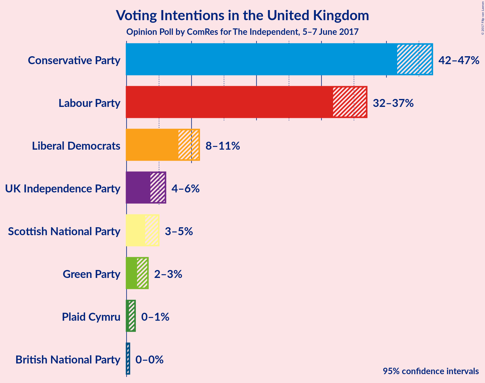
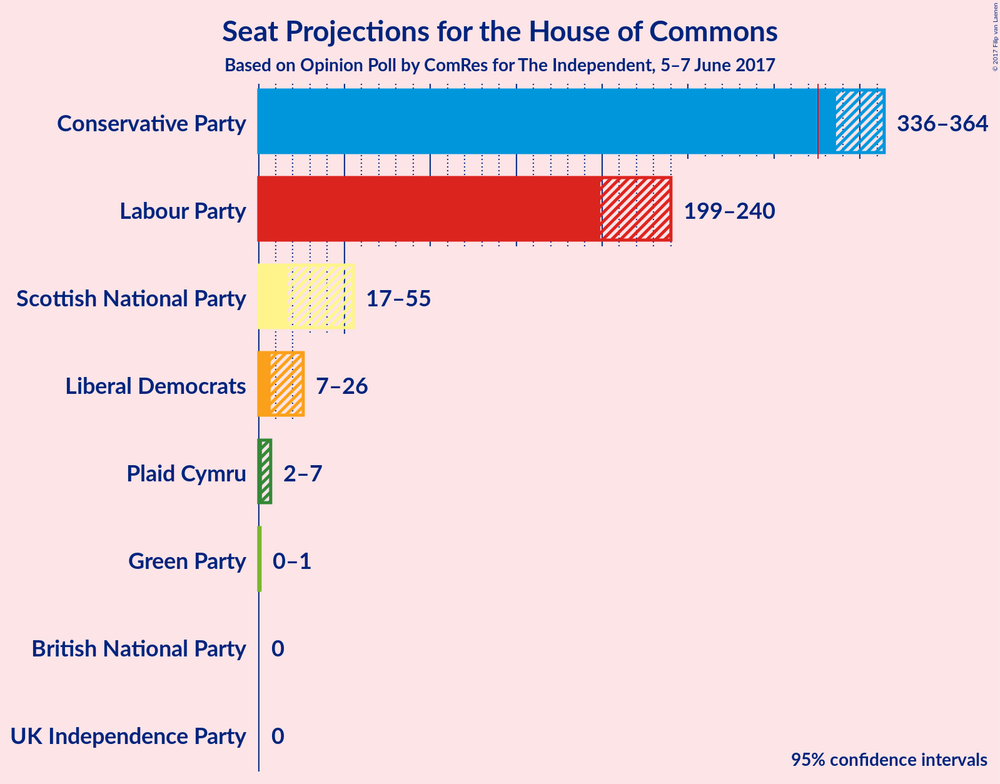
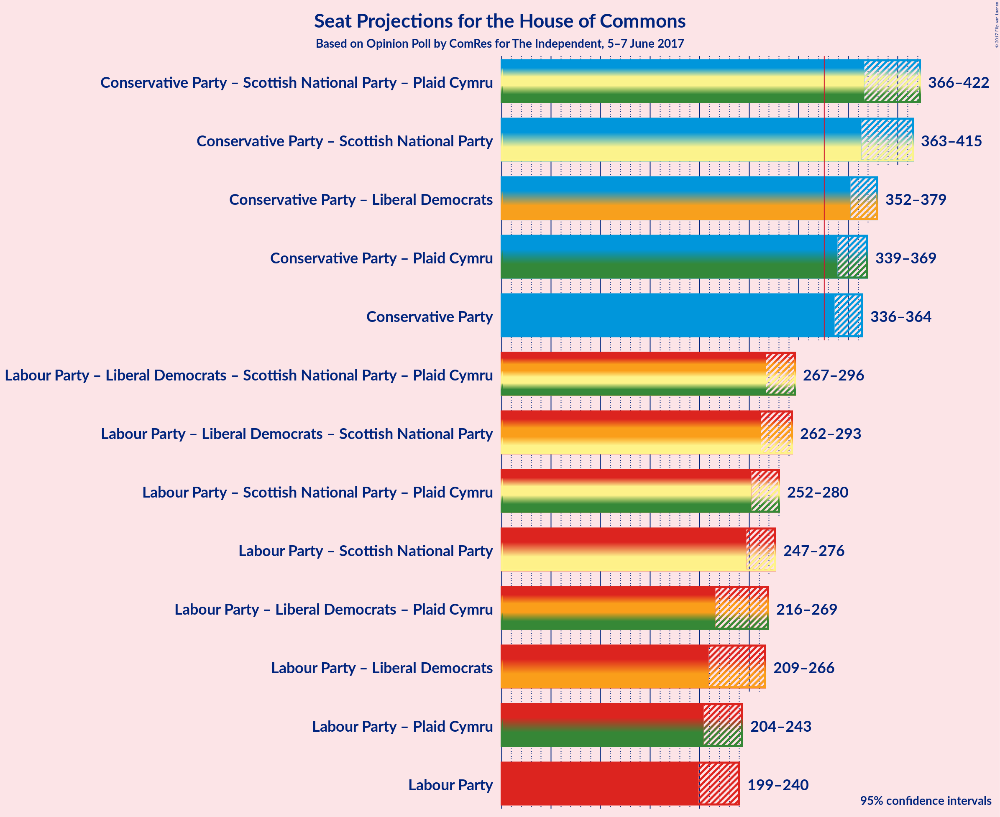

# Opinion Poll by ComRes for The Independent, 5–7 June 2017

<a href="#voting-intentions">Voting Intentions</a> | <a href="#seats">Seats</a> | <a href="#coalitions">Coalitions</a> | <a href="#technical-information">Technical Information</a>

## Voting Intentions

### Confidence Intervals

| Party | Last Result | Poll Result | 80% Confidence Interval | 90% Confidence Interval | 95% Confidence Interval | 99% Confidence Interval |
|:-----:|:-----------:|:-----------:|:-----------------------:|:-----------------------:|:-----------------------:|:-----------------------:|
| Conservative Party | 36.9% | 44.5% | 42.6–46.1% |42.1–46.6% |41.7–47.1% |40.8–47.9% |
| Labour Party | 30.4% | 34.4% | 32.7–36.1% |32.2–36.5% |31.8–37.0% |31.0–37.8% |
| Liberal Democrats | 7.9% | 9.5% | 8.5–10.6% |8.2–10.9% |8.0–11.2% |7.5–11.8% |
| UK Independence Party | 12.6% | 4.7% | 4.0–5.5% |3.8–5.8% |3.7–6.0% |3.4–6.4% |
| Scottish National Party | 4.7% | 3.8% | 3.2–4.5% |3.0–4.8% |2.9–5.0% |2.6–5.3% |
| Green Party | 3.8% | 2.3% | 1.8–2.9% |1.7–3.1% |1.6–3.3% |1.4–3.6% |
| Plaid Cymru | 0.6% | 0.7% | 0.5–1.1% |0.4–1.2% |0.4–1.3% |0.3–1.5% |
| British National Party | 0.0% | 0.1% | 0.0–0.3% |0.0–0.4% |0.0–0.4% |0.0–0.6% |

*Note:* The poll result column reflects the actual value used in the calculations. Published results may vary slightly, and in addition be rounded to fewer digits.

## Seats

### Confidence Intervals

| Party | Last Result | Median | 80% Confidence Interval | 90% Confidence Interval | 95% Confidence Interval | 99% Confidence Interval |
|:-----:|:-----------:|:------:|:-----------------------:|:-----------------------:|:-----------------------:|:-----------------------:|
| <a href="#conservative-party">Conservative Party</a> | 331 | 347 | 345–362 |345–363 |336–364 |321–365 |
| <a href="#labour-party">Labour Party</a> | 232 | 218 | 204–235 |199–240 |199–240 |199–257 |
| <a href="#liberal-democrats">Liberal Democrats</a> | 8 | 10 | 7–23 |7–26 |7–26 |7–29 |
| <a href="#uk-independence-party">UK Independence Party</a> | 1 | 0 | 0 |0 |0 |0 |
| <a href="#scottish-national-party">Scottish National Party</a> | 56 | 53 | 40–55 |17–55 |17–55 |17–56 |
| <a href="#green-party">Green Party</a> | 1 | 0 | 0–1 |0–1 |0–1 |0–1 |
| <a href="#plaid-cymru">Plaid Cymru</a> | 3 | 5 | 3–5 |3–5 |2–7 |1–7 |
| <a href="#british-national-party">British National Party</a> | 0 | 0 | 0 |0 |0 |0 |

### Conservative Party

| Number of Seats | Probability | Accumulated |
|:---------------:|:-----------:|:-----------:|
| 313 | 0.3% | 100% |
| 314 | 0% | 99.6% |
| 315 | 0% | 99.6% |
| 316 | 0% | 99.6% |
| 317 | 0% | 99.6% |
| 318 | 0% | 99.6% |
| 319 | 0% | 99.6% |
| 320 | 0% | 99.6% |
| 321 | 1.1% | 99.6% |
| 322 | 0% | 98.5% |
| 323 | 0% | 98.5% |
| 324 | 0% | 98% |
| 325 | 0% | 98% |
| 326 | 0% | 98% |
| 327 | 0.2% | 98% |
| 328 | 0% | 98% |
| 329 | 0.2% | 98% |
| 330 | 0.1% | 98% |
| 331 | 0% | 98% |
| 332 | 0.2% | 98% |
| 333 | 0% | 98% |
| 334 | 0% | 98% |
| 335 | 0.1% | 98% |
| 336 | 0.7% | 98% |
| 337 | 0.4% | 97% |
| 338 | 0% | 96% |
| 339 | 0% | 96% |
| 340 | 0% | 96% |
| 341 | 0% | 96% |
| 342 | 0.1% | 96% |
| 343 | 0.1% | 96% |
| 344 | 0.5% | 96% |
| 345 | 25% | 96% |
| 346 | 10% | 71% |
| 347 | 49% | 61% |
| 348 | 0% | 12% |
| 349 | 0% | 12% |
| 350 | 1.3% | 12% |
| 351 | 0.1% | 11% |
| 352 | 0% | 11% |
| 353 | 0% | 11% |
| 354 | 0% | 11% |
| 355 | 0% | 11% |
| 356 | 0% | 11% |
| 357 | 0% | 11% |
| 358 | 0% | 11% |
| 359 | 0.1% | 11% |
| 360 | 0% | 11% |
| 361 | 0% | 11% |
| 362 | 2% | 11% |
| 363 | 5% | 8% |
| 364 | 3% | 4% |
| 365 | 0.9% | 1.1% |
| 366 | 0% | 0.2% |
| 367 | 0.1% | 0.2% |
| 368 | 0% | 0.2% |
| 369 | 0% | 0.1% |
| 370 | 0.1% | 0.1% |
| 371 | 0% | 0.1% |
| 372 | 0% | 0.1% |
| 373 | 0% | 0.1% |
| 374 | 0% | 0.1% |
| 375 | 0% | 0.1% |
| 376 | 0% | 0.1% |
| 377 | 0% | 0.1% |
| 378 | 0% | 0.1% |
| 379 | 0% | 0.1% |
| 380 | 0% | 0% |

### Labour Party

| Number of Seats | Probability | Accumulated |
|:---------------:|:-----------:|:-----------:|
| 189 | 0% | 100% |
| 190 | 0% | 99.9% |
| 191 | 0% | 99.9% |
| 192 | 0% | 99.9% |
| 193 | 0.1% | 99.9% |
| 194 | 0% | 99.9% |
| 195 | 0% | 99.9% |
| 196 | 0.1% | 99.9% |
| 197 | 0.1% | 99.7% |
| 198 | 0.1% | 99.7% |
| 199 | 7% | 99.6% |
| 200 | 0% | 93% |
| 201 | 0.7% | 93% |
| 202 | 0% | 92% |
| 203 | 0% | 92% |
| 204 | 3% | 92% |
| 205 | 0% | 89% |
| 206 | 0% | 89% |
| 207 | 0% | 89% |
| 208 | 0% | 89% |
| 209 | 0% | 89% |
| 210 | 0% | 89% |
| 211 | 0% | 89% |
| 212 | 0% | 89% |
| 213 | 0% | 89% |
| 214 | 0% | 89% |
| 215 | 0% | 89% |
| 216 | 0% | 89% |
| 217 | 3% | 89% |
| 218 | 49% | 86% |
| 219 | 0.1% | 37% |
| 220 | 25% | 37% |
| 221 | 0.5% | 12% |
| 222 | 0.2% | 12% |
| 223 | 0% | 12% |
| 224 | 0.7% | 12% |
| 225 | 0.3% | 11% |
| 226 | 0.1% | 11% |
| 227 | 0.1% | 10% |
| 228 | 0.2% | 10% |
| 229 | 0% | 10% |
| 230 | 0% | 10% |
| 231 | 0% | 10% |
| 232 | 0% | 10% |
| 233 | 0% | 10% |
| 234 | 0% | 10% |
| 235 | 0.1% | 10% |
| 236 | 0.2% | 10% |
| 237 | 0% | 10% |
| 238 | 0% | 10% |
| 239 | 0% | 10% |
| 240 | 8% | 10% |
| 241 | 0% | 2% |
| 242 | 0% | 2% |
| 243 | 0% | 2% |
| 244 | 0.1% | 2% |
| 245 | 0% | 2% |
| 246 | 0% | 2% |
| 247 | 0.3% | 2% |
| 248 | 0% | 1.3% |
| 249 | 0% | 1.3% |
| 250 | 0% | 1.3% |
| 251 | 0% | 1.3% |
| 252 | 0% | 1.3% |
| 253 | 0% | 1.3% |
| 254 | 0% | 1.3% |
| 255 | 0% | 1.3% |
| 256 | 0% | 1.3% |
| 257 | 1.1% | 1.3% |
| 258 | 0% | 0.1% |
| 259 | 0% | 0.1% |
| 260 | 0% | 0.1% |
| 261 | 0% | 0.1% |
| 262 | 0% | 0.1% |
| 263 | 0% | 0.1% |
| 264 | 0% | 0.1% |
| 265 | 0% | 0.1% |
| 266 | 0% | 0.1% |
| 267 | 0% | 0.1% |
| 268 | 0% | 0.1% |
| 269 | 0% | 0.1% |
| 270 | 0% | 0.1% |
| 271 | 0% | 0.1% |
| 272 | 0% | 0.1% |
| 273 | 0% | 0.1% |
| 274 | 0% | 0.1% |
| 275 | 0% | 0.1% |
| 276 | 0% | 0.1% |
| 277 | 0% | 0.1% |
| 278 | 0% | 0.1% |
| 279 | 0% | 0.1% |
| 280 | 0% | 0.1% |
| 281 | 0% | 0.1% |
| 282 | 0% | 0.1% |
| 283 | 0% | 0.1% |
| 284 | 0% | 0.1% |
| 285 | 0.1% | 0.1% |
| 286 | 0% | 0% |

### Liberal Democrats

| Number of Seats | Probability | Accumulated |
|:---------------:|:-----------:|:-----------:|
| 3 | 0.1% | 100% |
| 4 | 0% | 99.9% |
| 5 | 0.1% | 99.9% |
| 6 | 0.1% | 99.8% |
| 7 | 48% | 99.6% |
| 8 | 0.4% | 52% |
| 9 | 0.2% | 51% |
| 10 | 27% | 51% |
| 11 | 1.5% | 24% |
| 12 | 2% | 23% |
| 13 | 0.1% | 21% |
| 14 | 0.1% | 21% |
| 15 | 3% | 21% |
| 16 | 6% | 18% |
| 17 | 0.1% | 11% |
| 18 | 0% | 11% |
| 19 | 0.7% | 11% |
| 20 | 0.2% | 11% |
| 21 | 0.1% | 10% |
| 22 | 0.1% | 10% |
| 23 | 1.1% | 10% |
| 24 | 0.1% | 9% |
| 25 | 0.2% | 9% |
| 26 | 8% | 9% |
| 27 | 0% | 0.8% |
| 28 | 0% | 0.8% |
| 29 | 0.7% | 0.8% |
| 30 | 0% | 0% |

### UK Independence Party

| Number of Seats | Probability | Accumulated |
|:---------------:|:-----------:|:-----------:|
| 0 | 100% | 100% |
| 1 | 0% | 0% |

### Scottish National Party

| Number of Seats | Probability | Accumulated |
|:---------------:|:-----------:|:-----------:|
| 2 | 0.1% | 100% |
| 3 | 0% | 99.9% |
| 4 | 0% | 99.9% |
| 5 | 0% | 99.9% |
| 6 | 0% | 99.9% |
| 7 | 0% | 99.9% |
| 8 | 0% | 99.9% |
| 9 | 0% | 99.9% |
| 10 | 0% | 99.9% |
| 11 | 0% | 99.9% |
| 12 | 0.1% | 99.9% |
| 13 | 0% | 99.8% |
| 14 | 0% | 99.8% |
| 15 | 0% | 99.8% |
| 16 | 0% | 99.8% |
| 17 | 8% | 99.8% |
| 18 | 0% | 92% |
| 19 | 0% | 92% |
| 20 | 0% | 92% |
| 21 | 0% | 92% |
| 22 | 0% | 92% |
| 23 | 0% | 92% |
| 24 | 0% | 92% |
| 25 | 0% | 92% |
| 26 | 0% | 92% |
| 27 | 0% | 92% |
| 28 | 0% | 92% |
| 29 | 0% | 92% |
| 30 | 1.1% | 92% |
| 31 | 0% | 91% |
| 32 | 0% | 91% |
| 33 | 0% | 91% |
| 34 | 0% | 91% |
| 35 | 0% | 91% |
| 36 | 0% | 91% |
| 37 | 0% | 91% |
| 38 | 0.1% | 91% |
| 39 | 0.1% | 91% |
| 40 | 0.9% | 90% |
| 41 | 0.1% | 90% |
| 42 | 0% | 89% |
| 43 | 0% | 89% |
| 44 | 3% | 89% |
| 45 | 0.5% | 87% |
| 46 | 0.1% | 86% |
| 47 | 2% | 86% |
| 48 | 5% | 84% |
| 49 | 0% | 80% |
| 50 | 0.1% | 80% |
| 51 | 0.4% | 79% |
| 52 | 0% | 79% |
| 53 | 30% | 79% |
| 54 | 0.2% | 49% |
| 55 | 48% | 49% |
| 56 | 0.3% | 0.8% |
| 57 | 0.4% | 0.4% |
| 58 | 0.1% | 0.1% |
| 59 | 0% | 0% |

### Green Party

| Number of Seats | Probability | Accumulated |
|:---------------:|:-----------:|:-----------:|
| 0 | 62% | 100% |
| 1 | 38% | 38% |
| 2 | 0% | 0% |

### Plaid Cymru

| Number of Seats | Probability | Accumulated |
|:---------------:|:-----------:|:-----------:|
| 0 | 0.3% | 100% |
| 1 | 2% | 99.7% |
| 2 | 0.2% | 98% |
| 3 | 37% | 97% |
| 4 | 5% | 61% |
| 5 | 52% | 55% |
| 6 | 0% | 3% |
| 7 | 3% | 3% |
| 8 | 0.1% | 0.2% |
| 9 | 0% | 0.1% |
| 10 | 0.1% | 0.1% |
| 11 | 0% | 0% |

### British National Party

| Number of Seats | Probability | Accumulated |
|:---------------:|:-----------:|:-----------:|
| 0 | 100% | 100% |
| 1 | 0% | 0% |

## Coalitions

### Confidence Intervals

| Coalition | Last Result | Median | 80% Confidence Interval | 90% Confidence Interval | 95% Confidence Interval | 99% Confidence Interval |
|:---------:|:-----------:|:------:|:-----------------------:|:-----------------------:|:-----------------------:|:-----------------------:|
| Conservative Party – Scottish National Party – Plaid Cymru | 390 | 407 | 379–412 | 366–416 | 366–422 | 352–423 |
| Conservative Party – Scottish National Party | 387 | 402 | 376–408 | 363–411 | 363–415 | 351–420 |
| Conservative Party – Liberal Democrats | 339 | 355 | 354–372 | 354–379 | 352–379 | 338–379 |
| Conservative Party – Plaid Cymru | 334 | 352 | 348–368 | 348–368 | 339–369 | 322–369 |
| Conservative Party | 331 | 347 | 345–362 | 345–363 | 336–364 | 321–365 |
| Labour Party – Liberal Democrats – Scottish National Party – Plaid Cymru | 299 | 285 | 269–286 | 268–286 | 267–296 | 266–311 |
| Labour Party – Liberal Democrats – Scottish National Party | 296 | 280 | 263–283 | 263–283 | 262–293 | 262–310 |
| Labour Party – Scottish National Party – Plaid Cymru | 291 | 276 | 259–278 | 252–278 | 252–280 | 252–294 |
| Labour Party – Scottish National Party | 288 | 273 | 254–273 | 248–273 | 247–276 | 247–290 |
| Labour Party – Liberal Democrats – Plaid Cymru | 243 | 230 | 223–256 | 220–269 | 216–269 | 211–281 |
| Labour Party – Liberal Democrats | 240 | 225 | 219–253 | 215–266 | 209–266 | 208–280 |
| Labour Party – Plaid Cymru | 235 | 223 | 208–238 | 204–243 | 204–243 | 204–258 |
| Labour Party | 232 | 218 | 204–235 | 199–240 | 199–240 | 199–257 |

### Conservative Party – Scottish National Party – Plaid Cymru

| Number of Seats | Probability | Accumulated |
|:---------------:|:-----------:|:-----------:|
| 334 | 0% | 100% |
| 335 | 0% | 99.9% |
| 336 | 0% | 99.9% |
| 337 | 0% | 99.9% |
| 338 | 0% | 99.9% |
| 339 | 0% | 99.9% |
| 340 | 0% | 99.9% |
| 341 | 0% | 99.9% |
| 342 | 0% | 99.9% |
| 343 | 0% | 99.9% |
| 344 | 0% | 99.9% |
| 345 | 0% | 99.9% |
| 346 | 0% | 99.9% |
| 347 | 0% | 99.9% |
| 348 | 0% | 99.9% |
| 349 | 0% | 99.9% |
| 350 | 0% | 99.9% |
| 351 | 0% | 99.9% |
| 352 | 1.1% | 99.9% |
| 353 | 0% | 98.8% |
| 354 | 0% | 98.8% |
| 355 | 0% | 98.8% |
| 356 | 0% | 98.8% |
| 357 | 0% | 98.8% |
| 358 | 0% | 98.8% |
| 359 | 0% | 98.8% |
| 360 | 0% | 98.8% |
| 361 | 0% | 98.8% |
| 362 | 0% | 98.7% |
| 363 | 0% | 98.7% |
| 364 | 0% | 98.7% |
| 365 | 0% | 98.7% |
| 366 | 8% | 98.7% |
| 367 | 0% | 91% |
| 368 | 0% | 91% |
| 369 | 0% | 91% |
| 370 | 0% | 91% |
| 371 | 0.1% | 91% |
| 372 | 0.1% | 91% |
| 373 | 0.3% | 91% |
| 374 | 0% | 90% |
| 375 | 0% | 90% |
| 376 | 0% | 90% |
| 377 | 0% | 90% |
| 378 | 0.1% | 90% |
| 379 | 0.7% | 90% |
| 380 | 0% | 89% |
| 381 | 0.1% | 89% |
| 382 | 0% | 89% |
| 383 | 0% | 89% |
| 384 | 0.2% | 89% |
| 385 | 0% | 89% |
| 386 | 0% | 89% |
| 387 | 0.1% | 89% |
| 388 | 0% | 89% |
| 389 | 0.1% | 89% |
| 390 | 0.3% | 89% |
| 391 | 0% | 89% |
| 392 | 0.9% | 89% |
| 393 | 0% | 88% |
| 394 | 0% | 88% |
| 395 | 0% | 88% |
| 396 | 0% | 88% |
| 397 | 0% | 88% |
| 398 | 2% | 88% |
| 399 | 0.3% | 86% |
| 400 | 0% | 86% |
| 401 | 25% | 86% |
| 402 | 2% | 61% |
| 403 | 0.1% | 59% |
| 404 | 1.1% | 59% |
| 405 | 0.2% | 58% |
| 406 | 0% | 58% |
| 407 | 47% | 58% |
| 408 | 0% | 11% |
| 409 | 0% | 11% |
| 410 | 0% | 11% |
| 411 | 0% | 11% |
| 412 | 3% | 11% |
| 413 | 0% | 8% |
| 414 | 0% | 8% |
| 415 | 0% | 8% |
| 416 | 5% | 8% |
| 417 | 0% | 3% |
| 418 | 0% | 3% |
| 419 | 0% | 3% |
| 420 | 0% | 3% |
| 421 | 0% | 3% |
| 422 | 2% | 3% |
| 423 | 0.7% | 1.0% |
| 424 | 0% | 0.3% |
| 425 | 0.1% | 0.3% |
| 426 | 0% | 0.2% |
| 427 | 0.1% | 0.2% |
| 428 | 0% | 0.1% |
| 429 | 0.1% | 0.1% |
| 430 | 0% | 0% |

### Conservative Party – Scottish National Party

| Number of Seats | Probability | Accumulated |
|:---------------:|:-----------:|:-----------:|
| 331 | 0% | 100% |
| 332 | 0% | 99.9% |
| 333 | 0% | 99.9% |
| 334 | 0% | 99.9% |
| 335 | 0% | 99.9% |
| 336 | 0% | 99.9% |
| 337 | 0% | 99.9% |
| 338 | 0% | 99.9% |
| 339 | 0% | 99.9% |
| 340 | 0% | 99.9% |
| 341 | 0% | 99.9% |
| 342 | 0% | 99.9% |
| 343 | 0% | 99.9% |
| 344 | 0% | 99.9% |
| 345 | 0% | 99.9% |
| 346 | 0% | 99.9% |
| 347 | 0% | 99.9% |
| 348 | 0% | 99.9% |
| 349 | 0% | 99.9% |
| 350 | 0% | 99.9% |
| 351 | 1.1% | 99.9% |
| 352 | 0% | 98.8% |
| 353 | 0.1% | 98.8% |
| 354 | 0% | 98.7% |
| 355 | 0% | 98.7% |
| 356 | 0% | 98.7% |
| 357 | 0% | 98.7% |
| 358 | 0% | 98.7% |
| 359 | 0% | 98.7% |
| 360 | 0% | 98.7% |
| 361 | 0% | 98.7% |
| 362 | 0% | 98.7% |
| 363 | 8% | 98.7% |
| 364 | 0% | 91% |
| 365 | 0% | 91% |
| 366 | 0% | 91% |
| 367 | 0% | 91% |
| 368 | 0% | 91% |
| 369 | 0.3% | 91% |
| 370 | 0% | 90% |
| 371 | 0.1% | 90% |
| 372 | 0% | 90% |
| 373 | 0% | 90% |
| 374 | 0.2% | 90% |
| 375 | 0% | 90% |
| 376 | 0.7% | 90% |
| 377 | 0% | 89% |
| 378 | 0% | 89% |
| 379 | 0% | 89% |
| 380 | 0% | 89% |
| 381 | 0% | 89% |
| 382 | 0.2% | 89% |
| 383 | 0.2% | 89% |
| 384 | 0.1% | 89% |
| 385 | 0.1% | 89% |
| 386 | 0.1% | 89% |
| 387 | 0% | 89% |
| 388 | 0.2% | 89% |
| 389 | 0.7% | 88% |
| 390 | 0% | 88% |
| 391 | 0% | 88% |
| 392 | 0% | 88% |
| 393 | 0% | 88% |
| 394 | 2% | 88% |
| 395 | 0% | 86% |
| 396 | 0% | 86% |
| 397 | 0% | 86% |
| 398 | 25% | 86% |
| 399 | 2% | 61% |
| 400 | 0.1% | 59% |
| 401 | 0.1% | 59% |
| 402 | 47% | 59% |
| 403 | 1.1% | 12% |
| 404 | 0% | 11% |
| 405 | 0.1% | 11% |
| 406 | 0% | 11% |
| 407 | 0% | 11% |
| 408 | 3% | 11% |
| 409 | 0% | 8% |
| 410 | 0% | 8% |
| 411 | 5% | 8% |
| 412 | 0% | 3% |
| 413 | 0% | 3% |
| 414 | 0% | 3% |
| 415 | 2% | 3% |
| 416 | 0% | 1.1% |
| 417 | 0% | 1.1% |
| 418 | 0.1% | 1.1% |
| 419 | 0% | 0.9% |
| 420 | 0.7% | 0.9% |
| 421 | 0% | 0.2% |
| 422 | 0% | 0.2% |
| 423 | 0.1% | 0.2% |
| 424 | 0.1% | 0.1% |
| 425 | 0% | 0% |

### Conservative Party – Liberal Democrats

| Number of Seats | Probability | Accumulated |
|:---------------:|:-----------:|:-----------:|
| 325 | 0.3% | 100% |
| 326 | 0% | 99.7% |
| 327 | 0% | 99.7% |
| 328 | 0% | 99.7% |
| 329 | 0.1% | 99.7% |
| 330 | 0% | 99.6% |
| 331 | 0% | 99.6% |
| 332 | 0% | 99.6% |
| 333 | 0% | 99.6% |
| 334 | 0% | 99.6% |
| 335 | 0% | 99.6% |
| 336 | 0% | 99.5% |
| 337 | 0% | 99.5% |
| 338 | 0.1% | 99.5% |
| 339 | 0% | 99.4% |
| 340 | 0% | 99.4% |
| 341 | 0.2% | 99.4% |
| 342 | 0.1% | 99.3% |
| 343 | 0% | 99.2% |
| 344 | 1.1% | 99.2% |
| 345 | 0.3% | 98% |
| 346 | 0.1% | 98% |
| 347 | 0% | 98% |
| 348 | 0% | 98% |
| 349 | 0% | 98% |
| 350 | 0% | 98% |
| 351 | 0% | 98% |
| 352 | 0.2% | 98% |
| 353 | 0.2% | 97% |
| 354 | 47% | 97% |
| 355 | 25% | 50% |
| 356 | 0.3% | 25% |
| 357 | 0% | 25% |
| 358 | 2% | 25% |
| 359 | 0.1% | 23% |
| 360 | 0% | 23% |
| 361 | 1.1% | 23% |
| 362 | 0.1% | 22% |
| 363 | 2% | 22% |
| 364 | 0% | 20% |
| 365 | 0.8% | 20% |
| 366 | 0% | 19% |
| 367 | 0% | 19% |
| 368 | 0.1% | 19% |
| 369 | 0.1% | 19% |
| 370 | 0% | 19% |
| 371 | 0.1% | 19% |
| 372 | 11% | 19% |
| 373 | 0% | 8% |
| 374 | 0% | 8% |
| 375 | 0% | 8% |
| 376 | 0.2% | 8% |
| 377 | 0% | 8% |
| 378 | 0% | 8% |
| 379 | 7% | 8% |
| 380 | 0% | 0.3% |
| 381 | 0.1% | 0.3% |
| 382 | 0% | 0.3% |
| 383 | 0% | 0.3% |
| 384 | 0.1% | 0.2% |
| 385 | 0% | 0.1% |
| 386 | 0% | 0.1% |
| 387 | 0% | 0.1% |
| 388 | 0% | 0.1% |
| 389 | 0% | 0.1% |
| 390 | 0% | 0.1% |
| 391 | 0% | 0% |

### Conservative Party – Plaid Cymru

| Number of Seats | Probability | Accumulated |
|:---------------:|:-----------:|:-----------:|
| 316 | 0.1% | 100% |
| 317 | 0.3% | 99.9% |
| 318 | 0% | 99.6% |
| 319 | 0% | 99.6% |
| 320 | 0% | 99.6% |
| 321 | 0% | 99.6% |
| 322 | 1.1% | 99.6% |
| 323 | 0% | 98.5% |
| 324 | 0% | 98.5% |
| 325 | 0% | 98.5% |
| 326 | 0% | 98% |
| 327 | 0% | 98% |
| 328 | 0% | 98% |
| 329 | 0.1% | 98% |
| 330 | 0% | 98% |
| 331 | 0.3% | 98% |
| 332 | 0.1% | 98% |
| 333 | 0% | 98% |
| 334 | 0.1% | 98% |
| 335 | 0% | 98% |
| 336 | 0% | 98% |
| 337 | 0% | 98% |
| 338 | 0.1% | 98% |
| 339 | 0.9% | 98% |
| 340 | 0% | 97% |
| 341 | 0.2% | 97% |
| 342 | 0.3% | 97% |
| 343 | 0% | 96% |
| 344 | 0% | 96% |
| 345 | 0% | 96% |
| 346 | 0.2% | 96% |
| 347 | 0.5% | 96% |
| 348 | 25% | 96% |
| 349 | 10% | 71% |
| 350 | 0.3% | 61% |
| 351 | 3% | 61% |
| 352 | 47% | 58% |
| 353 | 0.1% | 11% |
| 354 | 0.1% | 11% |
| 355 | 0.1% | 11% |
| 356 | 0% | 11% |
| 357 | 0% | 11% |
| 358 | 0% | 11% |
| 359 | 0.1% | 11% |
| 360 | 0% | 11% |
| 361 | 0% | 11% |
| 362 | 0% | 11% |
| 363 | 0% | 11% |
| 364 | 0% | 11% |
| 365 | 0% | 11% |
| 366 | 0% | 11% |
| 367 | 0% | 11% |
| 368 | 8% | 11% |
| 369 | 2% | 3% |
| 370 | 0% | 0.4% |
| 371 | 0% | 0.4% |
| 372 | 0.3% | 0.4% |
| 373 | 0% | 0.1% |
| 374 | 0.1% | 0.1% |
| 375 | 0% | 0.1% |
| 376 | 0% | 0.1% |
| 377 | 0% | 0.1% |
| 378 | 0% | 0.1% |
| 379 | 0% | 0.1% |
| 380 | 0% | 0.1% |
| 381 | 0% | 0.1% |
| 382 | 0% | 0.1% |
| 383 | 0% | 0.1% |
| 384 | 0% | 0% |

### Conservative Party

| Number of Seats | Probability | Accumulated |
|:---------------:|:-----------:|:-----------:|
| 313 | 0.3% | 100% |
| 314 | 0% | 99.6% |
| 315 | 0% | 99.6% |
| 316 | 0% | 99.6% |
| 317 | 0% | 99.6% |
| 318 | 0% | 99.6% |
| 319 | 0% | 99.6% |
| 320 | 0% | 99.6% |
| 321 | 1.1% | 99.6% |
| 322 | 0% | 98.5% |
| 323 | 0% | 98.5% |
| 324 | 0% | 98% |
| 325 | 0% | 98% |
| 326 | 0% | 98% |
| 327 | 0.2% | 98% |
| 328 | 0% | 98% |
| 329 | 0.2% | 98% |
| 330 | 0.1% | 98% |
| 331 | 0% | 98% |
| 332 | 0.2% | 98% |
| 333 | 0% | 98% |
| 334 | 0% | 98% |
| 335 | 0.1% | 98% |
| 336 | 0.7% | 98% |
| 337 | 0.4% | 97% |
| 338 | 0% | 96% |
| 339 | 0% | 96% |
| 340 | 0% | 96% |
| 341 | 0% | 96% |
| 342 | 0.1% | 96% |
| 343 | 0.1% | 96% |
| 344 | 0.5% | 96% |
| 345 | 25% | 96% |
| 346 | 10% | 71% |
| 347 | 49% | 61% |
| 348 | 0% | 12% |
| 349 | 0% | 12% |
| 350 | 1.3% | 12% |
| 351 | 0.1% | 11% |
| 352 | 0% | 11% |
| 353 | 0% | 11% |
| 354 | 0% | 11% |
| 355 | 0% | 11% |
| 356 | 0% | 11% |
| 357 | 0% | 11% |
| 358 | 0% | 11% |
| 359 | 0.1% | 11% |
| 360 | 0% | 11% |
| 361 | 0% | 11% |
| 362 | 2% | 11% |
| 363 | 5% | 8% |
| 364 | 3% | 4% |
| 365 | 0.9% | 1.1% |
| 366 | 0% | 0.2% |
| 367 | 0.1% | 0.2% |
| 368 | 0% | 0.2% |
| 369 | 0% | 0.1% |
| 370 | 0.1% | 0.1% |
| 371 | 0% | 0.1% |
| 372 | 0% | 0.1% |
| 373 | 0% | 0.1% |
| 374 | 0% | 0.1% |
| 375 | 0% | 0.1% |
| 376 | 0% | 0.1% |
| 377 | 0% | 0.1% |
| 378 | 0% | 0.1% |
| 379 | 0% | 0.1% |
| 380 | 0% | 0% |

### Labour Party – Liberal Democrats – Scottish National Party – Plaid Cymru

| Number of Seats | Probability | Accumulated |
|:---------------:|:-----------:|:-----------:|
| 253 | 0% | 100% |
| 254 | 0% | 99.9% |
| 255 | 0% | 99.9% |
| 256 | 0% | 99.9% |
| 257 | 0% | 99.9% |
| 258 | 0% | 99.9% |
| 259 | 0% | 99.9% |
| 260 | 0% | 99.9% |
| 261 | 0.1% | 99.9% |
| 262 | 0% | 99.9% |
| 263 | 0% | 99.9% |
| 264 | 0% | 99.8% |
| 265 | 0.1% | 99.8% |
| 266 | 0.7% | 99.8% |
| 267 | 3% | 99.0% |
| 268 | 5% | 96% |
| 269 | 2% | 92% |
| 270 | 0% | 89% |
| 271 | 0% | 89% |
| 272 | 0% | 89% |
| 273 | 0.1% | 89% |
| 274 | 0% | 89% |
| 275 | 0% | 89% |
| 276 | 0% | 89% |
| 277 | 0% | 89% |
| 278 | 0% | 89% |
| 279 | 0% | 89% |
| 280 | 0% | 89% |
| 281 | 0.2% | 89% |
| 282 | 1.2% | 89% |
| 283 | 0.1% | 88% |
| 284 | 2% | 88% |
| 285 | 47% | 86% |
| 286 | 34% | 39% |
| 287 | 0.1% | 4% |
| 288 | 0.6% | 4% |
| 289 | 0% | 4% |
| 290 | 0.1% | 4% |
| 291 | 0% | 4% |
| 292 | 0% | 4% |
| 293 | 0% | 4% |
| 294 | 0.2% | 4% |
| 295 | 0.3% | 3% |
| 296 | 0.8% | 3% |
| 297 | 0% | 2% |
| 298 | 0% | 2% |
| 299 | 0% | 2% |
| 300 | 0.2% | 2% |
| 301 | 0% | 2% |
| 302 | 0.1% | 2% |
| 303 | 0.3% | 2% |
| 304 | 0.2% | 2% |
| 305 | 0% | 2% |
| 306 | 0% | 2% |
| 307 | 0% | 2% |
| 308 | 0% | 2% |
| 309 | 0% | 2% |
| 310 | 0% | 1.5% |
| 311 | 1.1% | 1.5% |
| 312 | 0% | 0.4% |
| 313 | 0% | 0.4% |
| 314 | 0% | 0.4% |
| 315 | 0% | 0.4% |
| 316 | 0% | 0.4% |
| 317 | 0% | 0.4% |
| 318 | 0% | 0.4% |
| 319 | 0.3% | 0.4% |
| 320 | 0% | 0% |

### Labour Party – Liberal Democrats – Scottish National Party

| Number of Seats | Probability | Accumulated |
|:---------------:|:-----------:|:-----------:|
| 249 | 0% | 100% |
| 250 | 0% | 99.9% |
| 251 | 0% | 99.9% |
| 252 | 0% | 99.9% |
| 253 | 0% | 99.9% |
| 254 | 0% | 99.9% |
| 255 | 0% | 99.9% |
| 256 | 0% | 99.9% |
| 257 | 0.1% | 99.9% |
| 258 | 0% | 99.9% |
| 259 | 0.1% | 99.9% |
| 260 | 0.2% | 99.8% |
| 261 | 0% | 99.6% |
| 262 | 2% | 99.6% |
| 263 | 8% | 97% |
| 264 | 0.1% | 89% |
| 265 | 0% | 89% |
| 266 | 0% | 89% |
| 267 | 0% | 89% |
| 268 | 0% | 89% |
| 269 | 0% | 89% |
| 270 | 0% | 89% |
| 271 | 0% | 89% |
| 272 | 0% | 89% |
| 273 | 0.1% | 89% |
| 274 | 0% | 89% |
| 275 | 0% | 89% |
| 276 | 0% | 89% |
| 277 | 0.1% | 89% |
| 278 | 0.1% | 89% |
| 279 | 0.1% | 89% |
| 280 | 49% | 89% |
| 281 | 1.2% | 40% |
| 282 | 0.2% | 39% |
| 283 | 34% | 39% |
| 284 | 0% | 4% |
| 285 | 0.7% | 4% |
| 286 | 0% | 4% |
| 287 | 0% | 4% |
| 288 | 0% | 4% |
| 289 | 0% | 4% |
| 290 | 0.5% | 4% |
| 291 | 0% | 3% |
| 292 | 0% | 3% |
| 293 | 1.0% | 3% |
| 294 | 0% | 2% |
| 295 | 0% | 2% |
| 296 | 0% | 2% |
| 297 | 0% | 2% |
| 298 | 0.1% | 2% |
| 299 | 0% | 2% |
| 300 | 0.2% | 2% |
| 301 | 0.2% | 2% |
| 302 | 0% | 2% |
| 303 | 0.1% | 2% |
| 304 | 0% | 2% |
| 305 | 0% | 2% |
| 306 | 0% | 2% |
| 307 | 0% | 2% |
| 308 | 0% | 1.5% |
| 309 | 0% | 1.5% |
| 310 | 1.1% | 1.5% |
| 311 | 0% | 0.4% |
| 312 | 0% | 0.4% |
| 313 | 0% | 0.4% |
| 314 | 0% | 0.4% |
| 315 | 0.3% | 0.4% |
| 316 | 0.1% | 0.1% |
| 317 | 0% | 0% |

### Labour Party – Scottish National Party – Plaid Cymru

| Number of Seats | Probability | Accumulated |
|:---------------:|:-----------:|:-----------:|
| 241 | 0% | 100% |
| 242 | 0% | 99.9% |
| 243 | 0% | 99.9% |
| 244 | 0% | 99.9% |
| 245 | 0% | 99.9% |
| 246 | 0% | 99.9% |
| 247 | 0.1% | 99.9% |
| 248 | 0% | 99.8% |
| 249 | 0% | 99.7% |
| 250 | 0.1% | 99.7% |
| 251 | 0% | 99.7% |
| 252 | 7% | 99.7% |
| 253 | 0% | 92% |
| 254 | 0% | 92% |
| 255 | 0% | 92% |
| 256 | 0.2% | 92% |
| 257 | 0% | 92% |
| 258 | 0% | 92% |
| 259 | 3% | 92% |
| 260 | 8% | 89% |
| 261 | 0.1% | 81% |
| 262 | 0.1% | 81% |
| 263 | 0.1% | 81% |
| 264 | 0% | 81% |
| 265 | 0% | 81% |
| 266 | 0% | 81% |
| 267 | 0.7% | 81% |
| 268 | 2% | 80% |
| 269 | 0.6% | 78% |
| 270 | 0% | 78% |
| 271 | 1.1% | 78% |
| 272 | 0% | 77% |
| 273 | 0.1% | 77% |
| 274 | 2% | 77% |
| 275 | 0.3% | 75% |
| 276 | 25% | 75% |
| 277 | 0% | 50% |
| 278 | 47% | 50% |
| 279 | 0.1% | 3% |
| 280 | 0.2% | 3% |
| 281 | 0% | 2% |
| 282 | 0% | 2% |
| 283 | 0% | 2% |
| 284 | 0% | 2% |
| 285 | 0.1% | 2% |
| 286 | 0% | 2% |
| 287 | 0.3% | 2% |
| 288 | 1.1% | 2% |
| 289 | 0% | 0.8% |
| 290 | 0.1% | 0.8% |
| 291 | 0.2% | 0.7% |
| 292 | 0% | 0.6% |
| 293 | 0% | 0.6% |
| 294 | 0.1% | 0.6% |
| 295 | 0% | 0.5% |
| 296 | 0% | 0.5% |
| 297 | 0% | 0.5% |
| 298 | 0% | 0.4% |
| 299 | 0% | 0.4% |
| 300 | 0% | 0.4% |
| 301 | 0% | 0.4% |
| 302 | 0% | 0.4% |
| 303 | 0.1% | 0.4% |
| 304 | 0% | 0.3% |
| 305 | 0% | 0.3% |
| 306 | 0% | 0.3% |
| 307 | 0.3% | 0.3% |
| 308 | 0% | 0% |

### Labour Party – Scottish National Party

| Number of Seats | Probability | Accumulated |
|:---------------:|:-----------:|:-----------:|
| 236 | 0% | 100% |
| 237 | 0.1% | 99.9% |
| 238 | 0% | 99.8% |
| 239 | 0% | 99.8% |
| 240 | 0% | 99.8% |
| 241 | 0% | 99.8% |
| 242 | 0% | 99.8% |
| 243 | 0% | 99.8% |
| 244 | 0% | 99.8% |
| 245 | 0% | 99.7% |
| 246 | 0.1% | 99.7% |
| 247 | 5% | 99.7% |
| 248 | 3% | 95% |
| 249 | 0.1% | 92% |
| 250 | 0% | 92% |
| 251 | 0% | 92% |
| 252 | 2% | 92% |
| 253 | 0% | 90% |
| 254 | 0% | 90% |
| 255 | 0.1% | 90% |
| 256 | 0.8% | 90% |
| 257 | 8% | 89% |
| 258 | 0% | 81% |
| 259 | 0% | 81% |
| 260 | 0.2% | 81% |
| 261 | 0% | 81% |
| 262 | 0% | 81% |
| 263 | 0% | 81% |
| 264 | 2% | 81% |
| 265 | 0.1% | 78% |
| 266 | 0.6% | 78% |
| 267 | 0% | 78% |
| 268 | 0% | 78% |
| 269 | 0% | 78% |
| 270 | 1.1% | 78% |
| 271 | 2% | 77% |
| 272 | 0% | 75% |
| 273 | 72% | 75% |
| 274 | 0.2% | 3% |
| 275 | 0.1% | 3% |
| 276 | 0.1% | 3% |
| 277 | 0.1% | 2% |
| 278 | 0% | 2% |
| 279 | 0.1% | 2% |
| 280 | 0% | 2% |
| 281 | 0% | 2% |
| 282 | 0.4% | 2% |
| 283 | 0% | 2% |
| 284 | 0% | 2% |
| 285 | 0% | 2% |
| 286 | 0% | 2% |
| 287 | 1.1% | 2% |
| 288 | 0% | 0.7% |
| 289 | 0.2% | 0.7% |
| 290 | 0.1% | 0.6% |
| 291 | 0% | 0.5% |
| 292 | 0% | 0.5% |
| 293 | 0% | 0.5% |
| 294 | 0.1% | 0.5% |
| 295 | 0% | 0.4% |
| 296 | 0% | 0.4% |
| 297 | 0% | 0.4% |
| 298 | 0% | 0.4% |
| 299 | 0% | 0.4% |
| 300 | 0.1% | 0.4% |
| 301 | 0% | 0.3% |
| 302 | 0% | 0.3% |
| 303 | 0.3% | 0.3% |
| 304 | 0% | 0% |

### Labour Party – Liberal Democrats – Plaid Cymru

| Number of Seats | Probability | Accumulated |
|:---------------:|:-----------:|:-----------:|
| 208 | 0.1% | 100% |
| 209 | 0% | 99.8% |
| 210 | 0% | 99.8% |
| 211 | 0.7% | 99.8% |
| 212 | 0% | 99.1% |
| 213 | 0% | 99.1% |
| 214 | 0.1% | 99.0% |
| 215 | 0% | 98.9% |
| 216 | 2% | 98.9% |
| 217 | 0% | 97% |
| 218 | 0% | 97% |
| 219 | 0% | 97% |
| 220 | 5% | 97% |
| 221 | 0% | 92% |
| 222 | 0% | 92% |
| 223 | 3% | 92% |
| 224 | 0% | 89% |
| 225 | 0% | 89% |
| 226 | 0.1% | 89% |
| 227 | 0% | 89% |
| 228 | 0% | 89% |
| 229 | 1.2% | 89% |
| 230 | 47% | 88% |
| 231 | 0% | 41% |
| 232 | 0.1% | 41% |
| 233 | 26% | 41% |
| 234 | 0.1% | 14% |
| 235 | 0% | 14% |
| 236 | 0% | 14% |
| 237 | 2% | 14% |
| 238 | 0.3% | 13% |
| 239 | 0% | 12% |
| 240 | 0% | 12% |
| 241 | 0% | 12% |
| 242 | 0.1% | 12% |
| 243 | 0.7% | 12% |
| 244 | 0% | 11% |
| 245 | 0% | 11% |
| 246 | 0.1% | 11% |
| 247 | 0.2% | 11% |
| 248 | 0% | 11% |
| 249 | 0.2% | 11% |
| 250 | 0.2% | 11% |
| 251 | 0% | 11% |
| 252 | 0% | 11% |
| 253 | 0% | 11% |
| 254 | 0% | 11% |
| 255 | 0% | 11% |
| 256 | 0.7% | 11% |
| 257 | 0.2% | 10% |
| 258 | 0% | 10% |
| 259 | 0% | 10% |
| 260 | 0% | 10% |
| 261 | 0.1% | 10% |
| 262 | 0% | 10% |
| 263 | 0.3% | 10% |
| 264 | 0% | 9% |
| 265 | 0% | 9% |
| 266 | 0% | 9% |
| 267 | 0% | 9% |
| 268 | 0% | 9% |
| 269 | 8% | 9% |
| 270 | 0% | 1.3% |
| 271 | 0% | 1.3% |
| 272 | 0% | 1.3% |
| 273 | 0% | 1.3% |
| 274 | 0% | 1.3% |
| 275 | 0% | 1.3% |
| 276 | 0% | 1.3% |
| 277 | 0% | 1.3% |
| 278 | 0% | 1.3% |
| 279 | 0.1% | 1.3% |
| 280 | 0% | 1.2% |
| 281 | 1.1% | 1.2% |
| 282 | 0% | 0.1% |
| 283 | 0% | 0.1% |
| 284 | 0% | 0.1% |
| 285 | 0% | 0.1% |
| 286 | 0% | 0.1% |
| 287 | 0% | 0.1% |
| 288 | 0% | 0.1% |
| 289 | 0% | 0.1% |
| 290 | 0% | 0.1% |
| 291 | 0% | 0.1% |
| 292 | 0% | 0.1% |
| 293 | 0% | 0.1% |
| 294 | 0% | 0.1% |
| 295 | 0% | 0.1% |
| 296 | 0% | 0.1% |
| 297 | 0% | 0.1% |
| 298 | 0% | 0.1% |
| 299 | 0% | 0.1% |
| 300 | 0% | 0.1% |
| 301 | 0% | 0.1% |
| 302 | 0% | 0% |

### Labour Party – Liberal Democrats

| Number of Seats | Probability | Accumulated |
|:---------------:|:-----------:|:-----------:|
| 203 | 0.1% | 100% |
| 204 | 0.1% | 99.9% |
| 205 | 0% | 99.8% |
| 206 | 0% | 99.8% |
| 207 | 0.1% | 99.8% |
| 208 | 0.7% | 99.7% |
| 209 | 2% | 99.0% |
| 210 | 0% | 97% |
| 211 | 0% | 97% |
| 212 | 0% | 97% |
| 213 | 0% | 97% |
| 214 | 0% | 97% |
| 215 | 5% | 97% |
| 216 | 0% | 92% |
| 217 | 0% | 92% |
| 218 | 0% | 92% |
| 219 | 3% | 92% |
| 220 | 0% | 89% |
| 221 | 0% | 89% |
| 222 | 0% | 89% |
| 223 | 0% | 89% |
| 224 | 0% | 89% |
| 225 | 47% | 89% |
| 226 | 0.2% | 42% |
| 227 | 0.1% | 42% |
| 228 | 1.1% | 42% |
| 229 | 0.1% | 41% |
| 230 | 26% | 41% |
| 231 | 0% | 14% |
| 232 | 0% | 14% |
| 233 | 2% | 14% |
| 234 | 0% | 12% |
| 235 | 0% | 12% |
| 236 | 0% | 12% |
| 237 | 0% | 12% |
| 238 | 0% | 12% |
| 239 | 0.3% | 12% |
| 240 | 0.6% | 12% |
| 241 | 0% | 11% |
| 242 | 0.3% | 11% |
| 243 | 0.1% | 11% |
| 244 | 0.1% | 11% |
| 245 | 0% | 11% |
| 246 | 0% | 11% |
| 247 | 0% | 11% |
| 248 | 0.2% | 11% |
| 249 | 0% | 11% |
| 250 | 0% | 11% |
| 251 | 0% | 11% |
| 252 | 0% | 11% |
| 253 | 0.8% | 11% |
| 254 | 0% | 10% |
| 255 | 0% | 10% |
| 256 | 0% | 10% |
| 257 | 0% | 10% |
| 258 | 0% | 10% |
| 259 | 0.3% | 10% |
| 260 | 0.1% | 9% |
| 261 | 0.1% | 9% |
| 262 | 0% | 9% |
| 263 | 0% | 9% |
| 264 | 0% | 9% |
| 265 | 0% | 9% |
| 266 | 8% | 9% |
| 267 | 0% | 1.3% |
| 268 | 0% | 1.3% |
| 269 | 0% | 1.3% |
| 270 | 0% | 1.3% |
| 271 | 0.1% | 1.3% |
| 272 | 0% | 1.2% |
| 273 | 0% | 1.2% |
| 274 | 0% | 1.2% |
| 275 | 0% | 1.2% |
| 276 | 0% | 1.2% |
| 277 | 0% | 1.2% |
| 278 | 0% | 1.2% |
| 279 | 0% | 1.2% |
| 280 | 1.1% | 1.2% |
| 281 | 0% | 0.1% |
| 282 | 0% | 0.1% |
| 283 | 0% | 0.1% |
| 284 | 0% | 0.1% |
| 285 | 0% | 0.1% |
| 286 | 0% | 0.1% |
| 287 | 0% | 0.1% |
| 288 | 0% | 0.1% |
| 289 | 0% | 0.1% |
| 290 | 0% | 0.1% |
| 291 | 0% | 0.1% |
| 292 | 0% | 0.1% |
| 293 | 0% | 0.1% |
| 294 | 0% | 0.1% |
| 295 | 0% | 0.1% |
| 296 | 0% | 0.1% |
| 297 | 0% | 0.1% |
| 298 | 0% | 0.1% |
| 299 | 0% | 0% |

### Labour Party – Plaid Cymru

| Number of Seats | Probability | Accumulated |
|:---------------:|:-----------:|:-----------:|
| 196 | 0% | 100% |
| 197 | 0.1% | 99.9% |
| 198 | 0% | 99.9% |
| 199 | 0% | 99.9% |
| 200 | 0% | 99.9% |
| 201 | 0% | 99.9% |
| 202 | 0% | 99.9% |
| 203 | 0.2% | 99.8% |
| 204 | 5% | 99.7% |
| 205 | 0% | 94% |
| 206 | 2% | 94% |
| 207 | 0.1% | 92% |
| 208 | 3% | 92% |
| 209 | 0% | 89% |
| 210 | 0% | 89% |
| 211 | 0% | 89% |
| 212 | 0% | 89% |
| 213 | 0% | 89% |
| 214 | 0% | 89% |
| 215 | 0% | 89% |
| 216 | 0% | 89% |
| 217 | 0% | 89% |
| 218 | 1.1% | 89% |
| 219 | 0% | 88% |
| 220 | 0.1% | 88% |
| 221 | 4% | 88% |
| 222 | 0.1% | 84% |
| 223 | 72% | 84% |
| 224 | 0.7% | 12% |
| 225 | 0% | 12% |
| 226 | 0% | 12% |
| 227 | 0.7% | 12% |
| 228 | 0% | 11% |
| 229 | 0.2% | 11% |
| 230 | 0.3% | 11% |
| 231 | 0.4% | 11% |
| 232 | 0% | 10% |
| 233 | 0% | 10% |
| 234 | 0% | 10% |
| 235 | 0% | 10% |
| 236 | 0% | 10% |
| 237 | 0% | 10% |
| 238 | 0.2% | 10% |
| 239 | 0.1% | 10% |
| 240 | 0% | 10% |
| 241 | 0% | 10% |
| 242 | 0% | 10% |
| 243 | 8% | 10% |
| 244 | 0.1% | 2% |
| 245 | 0% | 2% |
| 246 | 0% | 2% |
| 247 | 0.1% | 2% |
| 248 | 0% | 2% |
| 249 | 0% | 2% |
| 250 | 0% | 2% |
| 251 | 0.3% | 2% |
| 252 | 0% | 1.4% |
| 253 | 0% | 1.3% |
| 254 | 0% | 1.3% |
| 255 | 0% | 1.3% |
| 256 | 0% | 1.3% |
| 257 | 0% | 1.3% |
| 258 | 1.1% | 1.3% |
| 259 | 0% | 0.2% |
| 260 | 0% | 0.2% |
| 261 | 0% | 0.2% |
| 262 | 0% | 0.2% |
| 263 | 0% | 0.2% |
| 264 | 0% | 0.2% |
| 265 | 0% | 0.2% |
| 266 | 0% | 0.1% |
| 267 | 0% | 0.1% |
| 268 | 0% | 0.1% |
| 269 | 0% | 0.1% |
| 270 | 0% | 0.1% |
| 271 | 0% | 0.1% |
| 272 | 0% | 0.1% |
| 273 | 0% | 0.1% |
| 274 | 0% | 0.1% |
| 275 | 0% | 0.1% |
| 276 | 0% | 0.1% |
| 277 | 0% | 0.1% |
| 278 | 0% | 0.1% |
| 279 | 0% | 0.1% |
| 280 | 0% | 0.1% |
| 281 | 0% | 0.1% |
| 282 | 0% | 0.1% |
| 283 | 0% | 0.1% |
| 284 | 0% | 0.1% |
| 285 | 0% | 0.1% |
| 286 | 0% | 0.1% |
| 287 | 0% | 0.1% |
| 288 | 0% | 0.1% |
| 289 | 0% | 0% |

### Labour Party

| Number of Seats | Probability | Accumulated |
|:---------------:|:-----------:|:-----------:|
| 189 | 0% | 100% |
| 190 | 0% | 99.9% |
| 191 | 0% | 99.9% |
| 192 | 0% | 99.9% |
| 193 | 0.1% | 99.9% |
| 194 | 0% | 99.9% |
| 195 | 0% | 99.9% |
| 196 | 0.1% | 99.9% |
| 197 | 0.1% | 99.7% |
| 198 | 0.1% | 99.7% |
| 199 | 7% | 99.6% |
| 200 | 0% | 93% |
| 201 | 0.7% | 93% |
| 202 | 0% | 92% |
| 203 | 0% | 92% |
| 204 | 3% | 92% |
| 205 | 0% | 89% |
| 206 | 0% | 89% |
| 207 | 0% | 89% |
| 208 | 0% | 89% |
| 209 | 0% | 89% |
| 210 | 0% | 89% |
| 211 | 0% | 89% |
| 212 | 0% | 89% |
| 213 | 0% | 89% |
| 214 | 0% | 89% |
| 215 | 0% | 89% |
| 216 | 0% | 89% |
| 217 | 3% | 89% |
| 218 | 49% | 86% |
| 219 | 0.1% | 37% |
| 220 | 25% | 37% |
| 221 | 0.5% | 12% |
| 222 | 0.2% | 12% |
| 223 | 0% | 12% |
| 224 | 0.7% | 12% |
| 225 | 0.3% | 11% |
| 226 | 0.1% | 11% |
| 227 | 0.1% | 10% |
| 228 | 0.2% | 10% |
| 229 | 0% | 10% |
| 230 | 0% | 10% |
| 231 | 0% | 10% |
| 232 | 0% | 10% |
| 233 | 0% | 10% |
| 234 | 0% | 10% |
| 235 | 0.1% | 10% |
| 236 | 0.2% | 10% |
| 237 | 0% | 10% |
| 238 | 0% | 10% |
| 239 | 0% | 10% |
| 240 | 8% | 10% |
| 241 | 0% | 2% |
| 242 | 0% | 2% |
| 243 | 0% | 2% |
| 244 | 0.1% | 2% |
| 245 | 0% | 2% |
| 246 | 0% | 2% |
| 247 | 0.3% | 2% |
| 248 | 0% | 1.3% |
| 249 | 0% | 1.3% |
| 250 | 0% | 1.3% |
| 251 | 0% | 1.3% |
| 252 | 0% | 1.3% |
| 253 | 0% | 1.3% |
| 254 | 0% | 1.3% |
| 255 | 0% | 1.3% |
| 256 | 0% | 1.3% |
| 257 | 1.1% | 1.3% |
| 258 | 0% | 0.1% |
| 259 | 0% | 0.1% |
| 260 | 0% | 0.1% |
| 261 | 0% | 0.1% |
| 262 | 0% | 0.1% |
| 263 | 0% | 0.1% |
| 264 | 0% | 0.1% |
| 265 | 0% | 0.1% |
| 266 | 0% | 0.1% |
| 267 | 0% | 0.1% |
| 268 | 0% | 0.1% |
| 269 | 0% | 0.1% |
| 270 | 0% | 0.1% |
| 271 | 0% | 0.1% |
| 272 | 0% | 0.1% |
| 273 | 0% | 0.1% |
| 274 | 0% | 0.1% |
| 275 | 0% | 0.1% |
| 276 | 0% | 0.1% |
| 277 | 0% | 0.1% |
| 278 | 0% | 0.1% |
| 279 | 0% | 0.1% |
| 280 | 0% | 0.1% |
| 281 | 0% | 0.1% |
| 282 | 0% | 0.1% |
| 283 | 0% | 0.1% |
| 284 | 0% | 0.1% |
| 285 | 0.1% | 0.1% |
| 286 | 0% | 0% |

## Technical Information

### Opinion Poll

+ **Pollster:** ComRes
+ **Media:** The Independent
+ **Fieldwork period:** 5–7 June 2017

### Calculations

+ **Sample size:** 1295
+ **Simulations done:** 32,768
+ **Error estimate:** 2.83%

