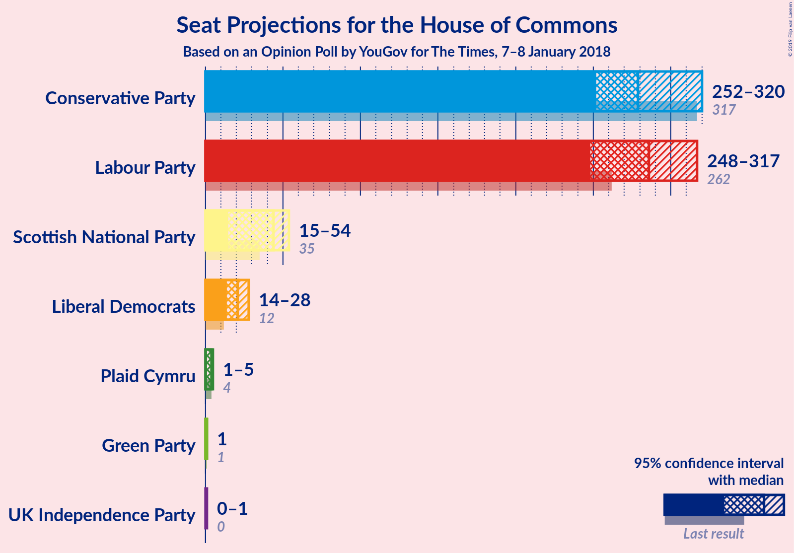

# Opinion Poll by YouGov for The Times, 7–8 January 2018

<a href="#voting-intentions">Voting Intentions</a> | <a href="#seats">Seats</a> | <a href="#coalitions">Coalitions</a> | <a href="#technical-information">Technical Information</a>

## Voting Intentions

### Confidence Intervals

| Party | Last Result | Poll Result | 80% Confidence Interval | 90% Confidence Interval | 95% Confidence Interval | 99% Confidence Interval |
|:-----:|:-----------:|:-----------:|:-----------------------:|:-----------------------:|:-----------------------:|:-----------------------:|
| Labour Party | 40.0% | 41.3% | 39.8–42.9% |39.3–43.3% |39.0–43.7% |38.2–44.5% |
| Conservative Party | 42.4% | 40.3% | 38.8–41.9% |38.3–42.3% |38.0–42.7% |37.2–43.4% |
| Liberal Democrats | 7.4% | 9.1% | 8.2–10.0% |8.0–10.3% |7.8–10.6% |7.4–11.1% |
| Scottish National Party | 3.0% | 3.4% | 2.9–4.1% |2.8–4.3% |2.7–4.4% |2.4–4.8% |
| UK Independence Party | 1.8% | 3.0% | 2.5–3.6% |2.4–3.8% |2.3–3.9% |2.1–4.3% |
| Green Party | 1.6% | 2.0% | 1.7–2.6% |1.6–2.7% |1.5–2.9% |1.3–3.1% |
| Plaid Cymru | 0.5% | 0.6% | 0.4–0.9% |0.4–1.0% |0.3–1.1% |0.3–1.3% |

*Note:* The poll result column reflects the actual value used in the calculations. Published results may vary slightly, and in addition be rounded to fewer digits.

## Seats

### Confidence Intervals

| Party | Last Result | Median | 80% Confidence Interval | 90% Confidence Interval | 95% Confidence Interval | 99% Confidence Interval |
|:-----:|:-----------:|:------:|:-----------------------:|:-----------------------:|:-----------------------:|:-----------------------:|
| <a href="#labour-party">Labour Party</a> | 262 | 273 | 262–293 |262–293 |262–293 |262–299 |
| <a href="#conservative-party">Conservative Party</a> | 317 | 281 | 278–321 |278–321 |278–321 |275–321 |
| <a href="#liberal-democrats">Liberal Democrats</a> | 12 | 25 | 19–27 |19–27 |19–27 |19–27 |
| <a href="#scottish-national-party">Scottish National Party</a> | 35 | 29 | 26–29 |26–52 |26–52 |24–52 |
| <a href="#uk-independence-party">UK Independence Party</a> | 0 | 0 | 0 |0 |0 |0–1 |
| <a href="#green-party">Green Party</a> | 1 | 1 | 1 |1 |1 |1 |
| <a href="#plaid-cymru">Plaid Cymru</a> | 4 | 3 | 3–4 |0–4 |0–4 |0–4 |

### Labour Party

*For a full overview of the results for this party, see the [Labour Party](party-labourparty.html) page.*

| Number of Seats | Probability | Accumulated | Special Marks |
|:---------------:|:-----------:|:-----------:|:-------------:|
| 262 | 47% | 100% | Last Result |
| 263 | 0% | 53% |  |
| 264 | 0% | 53% |  |
| 265 | 0% | 53% |  |
| 266 | 0% | 53% |  |
| 267 | 0% | 53% |  |
| 268 | 0% | 53% |  |
| 269 | 0% | 53% |  |
| 270 | 0% | 53% |  |
| 271 | 0% | 53% |  |
| 272 | 0% | 53% |  |
| 273 | 6% | 53% | Median |
| 274 | 0% | 47% |  |
| 275 | 0% | 47% |  |
| 276 | 0% | 47% |  |
| 277 | 0% | 47% |  |
| 278 | 0% | 47% |  |
| 279 | 0% | 47% |  |
| 280 | 0% | 47% |  |
| 281 | 0% | 47% |  |
| 282 | 0% | 47% |  |
| 283 | 0% | 47% |  |
| 284 | 0.3% | 47% |  |
| 285 | 0% | 47% |  |
| 286 | 0% | 47% |  |
| 287 | 0% | 47% |  |
| 288 | 0% | 47% |  |
| 289 | 0% | 47% |  |
| 290 | 0% | 47% |  |
| 291 | 0% | 47% |  |
| 292 | 0% | 47% |  |
| 293 | 46% | 47% |  |
| 294 | 0% | 0.9% |  |
| 295 | 0% | 0.9% |  |
| 296 | 0% | 0.9% |  |
| 297 | 0% | 0.9% |  |
| 298 | 0% | 0.9% |  |
| 299 | 0.6% | 0.9% |  |
| 300 | 0% | 0.3% |  |
| 301 | 0% | 0.3% |  |
| 302 | 0% | 0.2% |  |
| 303 | 0% | 0.2% |  |
| 304 | 0% | 0.2% |  |
| 305 | 0% | 0.2% |  |
| 306 | 0% | 0.2% |  |
| 307 | 0.2% | 0.2% |  |
| 308 | 0% | 0% |  |

### Conservative Party

*For a full overview of the results for this party, see the [Conservative Party](party-conservativeparty.html) page.*

| Number of Seats | Probability | Accumulated | Special Marks |
|:---------------:|:-----------:|:-----------:|:-------------:|
| 250 | 0.2% | 100% |  |
| 251 | 0% | 99.8% |  |
| 252 | 0% | 99.7% |  |
| 253 | 0% | 99.7% |  |
| 254 | 0% | 99.7% |  |
| 255 | 0% | 99.7% |  |
| 256 | 0% | 99.7% |  |
| 257 | 0% | 99.7% |  |
| 258 | 0% | 99.7% |  |
| 259 | 0% | 99.7% |  |
| 260 | 0% | 99.7% |  |
| 261 | 0% | 99.7% |  |
| 262 | 0% | 99.7% |  |
| 263 | 0% | 99.7% |  |
| 264 | 0% | 99.7% |  |
| 265 | 0% | 99.7% |  |
| 266 | 0% | 99.7% |  |
| 267 | 0% | 99.7% |  |
| 268 | 0% | 99.7% |  |
| 269 | 0% | 99.7% |  |
| 270 | 0% | 99.7% |  |
| 271 | 0% | 99.7% |  |
| 272 | 0% | 99.7% |  |
| 273 | 0% | 99.7% |  |
| 274 | 0% | 99.7% |  |
| 275 | 0.3% | 99.7% |  |
| 276 | 0% | 99.4% |  |
| 277 | 0% | 99.4% |  |
| 278 | 46% | 99.4% |  |
| 279 | 0% | 54% |  |
| 280 | 0% | 54% |  |
| 281 | 6% | 54% | Median |
| 282 | 0% | 47% |  |
| 283 | 0.6% | 47% |  |
| 284 | 0% | 47% |  |
| 285 | 0% | 47% |  |
| 286 | 0% | 47% |  |
| 287 | 0% | 47% |  |
| 288 | 0% | 47% |  |
| 289 | 0% | 47% |  |
| 290 | 0% | 47% |  |
| 291 | 0% | 47% |  |
| 292 | 0% | 47% |  |
| 293 | 0% | 47% |  |
| 294 | 0% | 47% |  |
| 295 | 0% | 47% |  |
| 296 | 0% | 47% |  |
| 297 | 0% | 47% |  |
| 298 | 0% | 47% |  |
| 299 | 0% | 47% |  |
| 300 | 0% | 47% |  |
| 301 | 0% | 47% |  |
| 302 | 0% | 47% |  |
| 303 | 0% | 47% |  |
| 304 | 0% | 47% |  |
| 305 | 0% | 47% |  |
| 306 | 0% | 47% |  |
| 307 | 0% | 47% |  |
| 308 | 0% | 47% |  |
| 309 | 0% | 47% |  |
| 310 | 0% | 47% |  |
| 311 | 0% | 47% |  |
| 312 | 0% | 47% |  |
| 313 | 0% | 47% |  |
| 314 | 0% | 47% |  |
| 315 | 0% | 47% |  |
| 316 | 0% | 47% |  |
| 317 | 0% | 47% | Last Result |
| 318 | 0% | 47% |  |
| 319 | 0% | 47% |  |
| 320 | 0% | 47% |  |
| 321 | 47% | 47% |  |
| 322 | 0% | 0% |  |

### Liberal Democrats

*For a full overview of the results for this party, see the [Liberal Democrats](party-liberaldemocrats.html) page.*

| Number of Seats | Probability | Accumulated | Special Marks |
|:---------------:|:-----------:|:-----------:|:-------------:|
| 12 | 0.2% | 100% | Last Result |
| 13 | 0% | 99.8% |  |
| 14 | 0% | 99.8% |  |
| 15 | 0% | 99.8% |  |
| 16 | 0% | 99.8% |  |
| 17 | 0% | 99.8% |  |
| 18 | 0% | 99.8% |  |
| 19 | 47% | 99.8% |  |
| 20 | 0.6% | 53% |  |
| 21 | 0% | 52% |  |
| 22 | 0% | 52% |  |
| 23 | 0% | 52% |  |
| 24 | 0% | 52% |  |
| 25 | 6% | 52% | Median |
| 26 | 0% | 46% |  |
| 27 | 46% | 46% |  |
| 28 | 0% | 0% |  |

### Scottish National Party

*For a full overview of the results for this party, see the [Scottish National Party](party-scottishnationalparty.html) page.*

| Number of Seats | Probability | Accumulated | Special Marks |
|:---------------:|:-----------:|:-----------:|:-------------:|
| 24 | 0.6% | 100% |  |
| 25 | 0% | 99.4% |  |
| 26 | 47% | 99.4% |  |
| 27 | 0% | 53% |  |
| 28 | 0% | 53% |  |
| 29 | 46% | 53% | Median |
| 30 | 0% | 7% |  |
| 31 | 0% | 7% |  |
| 32 | 0% | 7% |  |
| 33 | 0% | 7% |  |
| 34 | 0% | 7% |  |
| 35 | 0% | 7% | Last Result |
| 36 | 0% | 7% |  |
| 37 | 0% | 7% |  |
| 38 | 0% | 7% |  |
| 39 | 0% | 7% |  |
| 40 | 0% | 7% |  |
| 41 | 0% | 7% |  |
| 42 | 0% | 7% |  |
| 43 | 0% | 7% |  |
| 44 | 0% | 7% |  |
| 45 | 0% | 7% |  |
| 46 | 0% | 7% |  |
| 47 | 0% | 7% |  |
| 48 | 0% | 7% |  |
| 49 | 0.3% | 7% |  |
| 50 | 0% | 7% |  |
| 51 | 0% | 7% |  |
| 52 | 6% | 7% |  |
| 53 | 0% | 0.2% |  |
| 54 | 0% | 0.2% |  |
| 55 | 0% | 0.2% |  |
| 56 | 0% | 0.2% |  |
| 57 | 0.2% | 0.2% |  |
| 58 | 0% | 0% |  |

### UK Independence Party

*For a full overview of the results for this party, see the [UK Independence Party](party-ukindependenceparty.html) page.*

| Number of Seats | Probability | Accumulated | Special Marks |
|:---------------:|:-----------:|:-----------:|:-------------:|
| 0 | 99.1% | 100% | Last Result, Median |
| 1 | 0.9% | 0.9% |  |
| 2 | 0% | 0% |  |

### Green Party

*For a full overview of the results for this party, see the [Green Party](party-greenparty.html) page.*

| Number of Seats | Probability | Accumulated | Special Marks |
|:---------------:|:-----------:|:-----------:|:-------------:|
| 1 | 100% | 100% | Last Result, Median |

### Plaid Cymru

*For a full overview of the results for this party, see the [Plaid Cymru](party-plaidcymru.html) page.*

| Number of Seats | Probability | Accumulated | Special Marks |
|:---------------:|:-----------:|:-----------:|:-------------:|
| 0 | 6% | 100% |  |
| 1 | 0% | 94% |  |
| 2 | 0% | 94% |  |
| 3 | 47% | 94% | Median |
| 4 | 46% | 47% | Last Result |
| 5 | 0.2% | 0.2% |  |
| 6 | 0% | 0% |  |

## Coalitions

### Confidence Intervals

| Coalition | Last Result | Median | Majority? | 80% Confidence Interval | 90% Confidence Interval | 95% Confidence Interval | 99% Confidence Interval |
|:---------:|:-----------:|:------:|:---------:|:-----------------------:|:-----------------------:|:-----------------------:|:-----------------------:|
| Labour Party – Liberal Democrats – Scottish National Party – Plaid Cymru | 313 | 350 | 53% | 310–353 | 310–353 | 310–353 | 310–355 |
| Conservative Party – Scottish National Party – Plaid Cymru | 356 | 333 | 53% | 311–350 | 311–350 | 311–350 | 311–350 |
| Labour Party – Liberal Democrats – Scottish National Party | 309 | 349 | 53% | 307–349 | 307–350 | 307–350 | 307–352 |
| Conservative Party – Scottish National Party | 352 | 333 | 53% | 307–347 | 307–347 | 307–347 | 307–347 |
| Conservative Party – Liberal Democrats | 329 | 306 | 47% | 305–340 | 305–340 | 305–340 | 294–340 |
| Labour Party – Scottish National Party – Plaid Cymru | 301 | 325 | 47% | 291–326 | 291–326 | 291–326 | 291–336 |
| Labour Party – Scottish National Party | 297 | 322 | 0.6% | 288–322 | 288–325 | 288–325 | 288–333 |
| Labour Party – Liberal Democrats – Plaid Cymru | 278 | 298 | 0.1% | 284–324 | 284–324 | 284–324 | 284–324 |
| Conservative Party – Plaid Cymru | 321 | 282 | 0% | 282–324 | 281–324 | 281–324 | 278–324 |
| Conservative Party | 317 | 281 | 0% | 278–321 | 278–321 | 278–321 | 275–321 |
| Labour Party – Liberal Democrats | 274 | 298 | 0.1% | 281–320 | 281–320 | 281–320 | 281–320 |
| Labour Party – Plaid Cymru | 266 | 273 | 0% | 265–297 | 265–297 | 265–297 | 265–303 |
| Labour Party | 262 | 273 | 0% | 262–293 | 262–293 | 262–293 | 262–299 |

### Labour Party – Liberal Democrats – Scottish National Party – Plaid Cymru

| Number of Seats | Probability | Accumulated | Special Marks |
|:---------------:|:-----------:|:-----------:|:-------------:|
| 310 | 47% | 100% |  |
| 311 | 0% | 53% |  |
| 312 | 0% | 53% |  |
| 313 | 0% | 53% | Last Result |
| 314 | 0% | 53% |  |
| 315 | 0% | 53% |  |
| 316 | 0% | 53% |  |
| 317 | 0% | 53% |  |
| 318 | 0% | 53% |  |
| 319 | 0% | 53% |  |
| 320 | 0% | 53% |  |
| 321 | 0% | 53% |  |
| 322 | 0% | 53% |  |
| 323 | 0% | 53% |  |
| 324 | 0% | 53% |  |
| 325 | 0% | 53% |  |
| 326 | 0% | 53% | Majority |
| 327 | 0% | 53% |  |
| 328 | 0% | 53% |  |
| 329 | 0% | 53% |  |
| 330 | 0% | 53% | Median |
| 331 | 0% | 53% |  |
| 332 | 0% | 53% |  |
| 333 | 0% | 53% |  |
| 334 | 0% | 53% |  |
| 335 | 0% | 53% |  |
| 336 | 0% | 53% |  |
| 337 | 0% | 53% |  |
| 338 | 0% | 53% |  |
| 339 | 0% | 53% |  |
| 340 | 0% | 53% |  |
| 341 | 0% | 53% |  |
| 342 | 0% | 53% |  |
| 343 | 0% | 53% |  |
| 344 | 0% | 53% |  |
| 345 | 0% | 53% |  |
| 346 | 0% | 53% |  |
| 347 | 0.6% | 53% |  |
| 348 | 0% | 53% |  |
| 349 | 0% | 53% |  |
| 350 | 6% | 53% |  |
| 351 | 0% | 46% |  |
| 352 | 0% | 46% |  |
| 353 | 46% | 46% |  |
| 354 | 0% | 0.6% |  |
| 355 | 0.3% | 0.6% |  |
| 356 | 0% | 0.3% |  |
| 357 | 0% | 0.3% |  |
| 358 | 0% | 0.3% |  |
| 359 | 0% | 0.3% |  |
| 360 | 0% | 0.3% |  |
| 361 | 0% | 0.3% |  |
| 362 | 0% | 0.3% |  |
| 363 | 0% | 0.3% |  |
| 364 | 0% | 0.3% |  |
| 365 | 0% | 0.3% |  |
| 366 | 0% | 0.3% |  |
| 367 | 0% | 0.3% |  |
| 368 | 0% | 0.3% |  |
| 369 | 0% | 0.3% |  |
| 370 | 0% | 0.3% |  |
| 371 | 0% | 0.3% |  |
| 372 | 0% | 0.3% |  |
| 373 | 0% | 0.3% |  |
| 374 | 0% | 0.3% |  |
| 375 | 0% | 0.3% |  |
| 376 | 0% | 0.3% |  |
| 377 | 0% | 0.3% |  |
| 378 | 0% | 0.3% |  |
| 379 | 0% | 0.3% |  |
| 380 | 0% | 0.3% |  |
| 381 | 0.2% | 0.2% |  |
| 382 | 0% | 0% |  |

### Conservative Party – Scottish National Party – Plaid Cymru

| Number of Seats | Probability | Accumulated | Special Marks |
|:---------------:|:-----------:|:-----------:|:-------------:|
| 302 | 0% | 100% |  |
| 303 | 0% | 99.9% |  |
| 304 | 0% | 99.9% |  |
| 305 | 0% | 99.9% |  |
| 306 | 0% | 99.9% |  |
| 307 | 0% | 99.9% |  |
| 308 | 0% | 99.9% |  |
| 309 | 0% | 99.9% |  |
| 310 | 0% | 99.9% |  |
| 311 | 46% | 99.9% |  |
| 312 | 0.2% | 54% |  |
| 313 | 0% | 53% | Median |
| 314 | 0% | 53% |  |
| 315 | 0% | 53% |  |
| 316 | 0% | 53% |  |
| 317 | 0% | 53% |  |
| 318 | 0% | 53% |  |
| 319 | 0% | 53% |  |
| 320 | 0% | 53% |  |
| 321 | 0% | 53% |  |
| 322 | 0% | 53% |  |
| 323 | 0% | 53% |  |
| 324 | 0% | 53% |  |
| 325 | 0% | 53% |  |
| 326 | 0% | 53% | Majority |
| 327 | 0.3% | 53% |  |
| 328 | 0% | 53% |  |
| 329 | 0% | 53% |  |
| 330 | 0% | 53% |  |
| 331 | 0% | 53% |  |
| 332 | 0% | 53% |  |
| 333 | 6% | 53% |  |
| 334 | 0% | 47% |  |
| 335 | 0% | 47% |  |
| 336 | 0% | 47% |  |
| 337 | 0% | 47% |  |
| 338 | 0% | 47% |  |
| 339 | 0% | 47% |  |
| 340 | 0% | 47% |  |
| 341 | 0% | 47% |  |
| 342 | 0% | 47% |  |
| 343 | 0% | 47% |  |
| 344 | 0% | 47% |  |
| 345 | 0% | 47% |  |
| 346 | 0% | 47% |  |
| 347 | 0% | 47% |  |
| 348 | 0% | 47% |  |
| 349 | 0% | 47% |  |
| 350 | 47% | 47% |  |
| 351 | 0% | 0% |  |
| 352 | 0% | 0% |  |
| 353 | 0% | 0% |  |
| 354 | 0% | 0% |  |
| 355 | 0% | 0% |  |
| 356 | 0% | 0% | Last Result |

### Labour Party – Liberal Democrats – Scottish National Party

| Number of Seats | Probability | Accumulated | Special Marks |
|:---------------:|:-----------:|:-----------:|:-------------:|
| 307 | 47% | 100% |  |
| 308 | 0% | 53% |  |
| 309 | 0% | 53% | Last Result |
| 310 | 0% | 53% |  |
| 311 | 0% | 53% |  |
| 312 | 0% | 53% |  |
| 313 | 0% | 53% |  |
| 314 | 0% | 53% |  |
| 315 | 0% | 53% |  |
| 316 | 0% | 53% |  |
| 317 | 0% | 53% |  |
| 318 | 0% | 53% |  |
| 319 | 0% | 53% |  |
| 320 | 0% | 53% |  |
| 321 | 0% | 53% |  |
| 322 | 0% | 53% |  |
| 323 | 0% | 53% |  |
| 324 | 0% | 53% |  |
| 325 | 0% | 53% |  |
| 326 | 0% | 53% | Majority |
| 327 | 0% | 53% | Median |
| 328 | 0% | 53% |  |
| 329 | 0% | 53% |  |
| 330 | 0% | 53% |  |
| 331 | 0% | 53% |  |
| 332 | 0% | 53% |  |
| 333 | 0% | 53% |  |
| 334 | 0% | 53% |  |
| 335 | 0% | 53% |  |
| 336 | 0% | 53% |  |
| 337 | 0% | 53% |  |
| 338 | 0% | 53% |  |
| 339 | 0% | 53% |  |
| 340 | 0% | 53% |  |
| 341 | 0% | 53% |  |
| 342 | 0% | 53% |  |
| 343 | 0.6% | 53% |  |
| 344 | 0% | 53% |  |
| 345 | 0% | 53% |  |
| 346 | 0% | 53% |  |
| 347 | 0% | 53% |  |
| 348 | 0% | 53% |  |
| 349 | 46% | 53% |  |
| 350 | 6% | 7% |  |
| 351 | 0% | 0.6% |  |
| 352 | 0.3% | 0.6% |  |
| 353 | 0% | 0.3% |  |
| 354 | 0% | 0.3% |  |
| 355 | 0% | 0.3% |  |
| 356 | 0% | 0.3% |  |
| 357 | 0% | 0.3% |  |
| 358 | 0% | 0.3% |  |
| 359 | 0% | 0.3% |  |
| 360 | 0% | 0.3% |  |
| 361 | 0% | 0.3% |  |
| 362 | 0% | 0.3% |  |
| 363 | 0% | 0.3% |  |
| 364 | 0% | 0.3% |  |
| 365 | 0% | 0.3% |  |
| 366 | 0% | 0.3% |  |
| 367 | 0% | 0.3% |  |
| 368 | 0% | 0.3% |  |
| 369 | 0% | 0.3% |  |
| 370 | 0% | 0.3% |  |
| 371 | 0% | 0.3% |  |
| 372 | 0% | 0.3% |  |
| 373 | 0% | 0.3% |  |
| 374 | 0% | 0.3% |  |
| 375 | 0% | 0.3% |  |
| 376 | 0.2% | 0.2% |  |
| 377 | 0% | 0% |  |

### Conservative Party – Scottish National Party

| Number of Seats | Probability | Accumulated | Special Marks |
|:---------------:|:-----------:|:-----------:|:-------------:|
| 298 | 0% | 100% |  |
| 299 | 0% | 99.9% |  |
| 300 | 0% | 99.9% |  |
| 301 | 0% | 99.9% |  |
| 302 | 0% | 99.9% |  |
| 303 | 0% | 99.9% |  |
| 304 | 0% | 99.9% |  |
| 305 | 0% | 99.9% |  |
| 306 | 0% | 99.9% |  |
| 307 | 47% | 99.9% |  |
| 308 | 0% | 53% |  |
| 309 | 0% | 53% |  |
| 310 | 0% | 53% | Median |
| 311 | 0% | 53% |  |
| 312 | 0% | 53% |  |
| 313 | 0% | 53% |  |
| 314 | 0% | 53% |  |
| 315 | 0% | 53% |  |
| 316 | 0% | 53% |  |
| 317 | 0% | 53% |  |
| 318 | 0% | 53% |  |
| 319 | 0% | 53% |  |
| 320 | 0% | 53% |  |
| 321 | 0% | 53% |  |
| 322 | 0% | 53% |  |
| 323 | 0% | 53% |  |
| 324 | 0.3% | 53% |  |
| 325 | 0% | 53% |  |
| 326 | 0% | 53% | Majority |
| 327 | 0% | 53% |  |
| 328 | 0% | 53% |  |
| 329 | 0% | 53% |  |
| 330 | 0% | 53% |  |
| 331 | 0% | 53% |  |
| 332 | 0% | 53% |  |
| 333 | 6% | 53% |  |
| 334 | 0% | 47% |  |
| 335 | 0% | 47% |  |
| 336 | 0% | 47% |  |
| 337 | 0% | 47% |  |
| 338 | 0% | 47% |  |
| 339 | 0% | 47% |  |
| 340 | 0% | 47% |  |
| 341 | 0% | 47% |  |
| 342 | 0% | 47% |  |
| 343 | 0% | 47% |  |
| 344 | 0% | 47% |  |
| 345 | 0% | 47% |  |
| 346 | 0% | 47% |  |
| 347 | 47% | 47% |  |
| 348 | 0% | 0% |  |
| 349 | 0% | 0% |  |
| 350 | 0% | 0% |  |
| 351 | 0% | 0% |  |
| 352 | 0% | 0% | Last Result |

### Conservative Party – Liberal Democrats

| Number of Seats | Probability | Accumulated | Special Marks |
|:---------------:|:-----------:|:-----------:|:-------------:|
| 262 | 0.2% | 100% |  |
| 263 | 0% | 99.8% |  |
| 264 | 0% | 99.8% |  |
| 265 | 0% | 99.8% |  |
| 266 | 0% | 99.8% |  |
| 267 | 0% | 99.8% |  |
| 268 | 0% | 99.8% |  |
| 269 | 0% | 99.8% |  |
| 270 | 0% | 99.8% |  |
| 271 | 0% | 99.8% |  |
| 272 | 0% | 99.8% |  |
| 273 | 0% | 99.8% |  |
| 274 | 0% | 99.8% |  |
| 275 | 0% | 99.8% |  |
| 276 | 0% | 99.7% |  |
| 277 | 0% | 99.7% |  |
| 278 | 0% | 99.7% |  |
| 279 | 0% | 99.7% |  |
| 280 | 0% | 99.7% |  |
| 281 | 0% | 99.7% |  |
| 282 | 0% | 99.7% |  |
| 283 | 0% | 99.7% |  |
| 284 | 0% | 99.7% |  |
| 285 | 0% | 99.7% |  |
| 286 | 0% | 99.7% |  |
| 287 | 0% | 99.7% |  |
| 288 | 0% | 99.7% |  |
| 289 | 0% | 99.7% |  |
| 290 | 0% | 99.7% |  |
| 291 | 0% | 99.7% |  |
| 292 | 0% | 99.7% |  |
| 293 | 0% | 99.7% |  |
| 294 | 0.3% | 99.7% |  |
| 295 | 0% | 99.4% |  |
| 296 | 0% | 99.4% |  |
| 297 | 0% | 99.4% |  |
| 298 | 0% | 99.4% |  |
| 299 | 0% | 99.4% |  |
| 300 | 0% | 99.4% |  |
| 301 | 0% | 99.4% |  |
| 302 | 0% | 99.4% |  |
| 303 | 0.6% | 99.4% |  |
| 304 | 0% | 98.8% |  |
| 305 | 46% | 98.8% |  |
| 306 | 6% | 53% | Median |
| 307 | 0% | 47% |  |
| 308 | 0% | 47% |  |
| 309 | 0% | 47% |  |
| 310 | 0% | 47% |  |
| 311 | 0% | 47% |  |
| 312 | 0% | 47% |  |
| 313 | 0% | 47% |  |
| 314 | 0% | 47% |  |
| 315 | 0% | 47% |  |
| 316 | 0% | 47% |  |
| 317 | 0% | 47% |  |
| 318 | 0% | 47% |  |
| 319 | 0% | 47% |  |
| 320 | 0% | 47% |  |
| 321 | 0% | 47% |  |
| 322 | 0% | 47% |  |
| 323 | 0% | 47% |  |
| 324 | 0% | 47% |  |
| 325 | 0% | 47% |  |
| 326 | 0% | 47% | Majority |
| 327 | 0% | 47% |  |
| 328 | 0% | 47% |  |
| 329 | 0% | 47% | Last Result |
| 330 | 0% | 47% |  |
| 331 | 0% | 47% |  |
| 332 | 0% | 47% |  |
| 333 | 0% | 47% |  |
| 334 | 0% | 47% |  |
| 335 | 0% | 47% |  |
| 336 | 0% | 47% |  |
| 337 | 0% | 47% |  |
| 338 | 0% | 47% |  |
| 339 | 0% | 47% |  |
| 340 | 47% | 47% |  |
| 341 | 0% | 0% |  |

### Labour Party – Scottish National Party – Plaid Cymru

| Number of Seats | Probability | Accumulated | Special Marks |
|:---------------:|:-----------:|:-----------:|:-------------:|
| 291 | 47% | 100% |  |
| 292 | 0% | 53% |  |
| 293 | 0% | 53% |  |
| 294 | 0% | 53% |  |
| 295 | 0% | 53% |  |
| 296 | 0% | 53% |  |
| 297 | 0% | 53% |  |
| 298 | 0% | 53% |  |
| 299 | 0% | 53% |  |
| 300 | 0% | 53% |  |
| 301 | 0% | 53% | Last Result |
| 302 | 0% | 53% |  |
| 303 | 0% | 53% |  |
| 304 | 0% | 53% |  |
| 305 | 0% | 53% | Median |
| 306 | 0% | 53% |  |
| 307 | 0% | 53% |  |
| 308 | 0% | 53% |  |
| 309 | 0% | 53% |  |
| 310 | 0% | 53% |  |
| 311 | 0% | 53% |  |
| 312 | 0% | 53% |  |
| 313 | 0% | 53% |  |
| 314 | 0% | 53% |  |
| 315 | 0% | 53% |  |
| 316 | 0% | 53% |  |
| 317 | 0% | 53% |  |
| 318 | 0% | 53% |  |
| 319 | 0% | 53% |  |
| 320 | 0% | 53% |  |
| 321 | 0% | 53% |  |
| 322 | 0% | 53% |  |
| 323 | 0% | 53% |  |
| 324 | 0% | 53% |  |
| 325 | 6% | 53% |  |
| 326 | 46% | 47% | Majority |
| 327 | 0.6% | 1.2% |  |
| 328 | 0% | 0.6% |  |
| 329 | 0% | 0.6% |  |
| 330 | 0% | 0.6% |  |
| 331 | 0% | 0.6% |  |
| 332 | 0% | 0.6% |  |
| 333 | 0% | 0.6% |  |
| 334 | 0% | 0.6% |  |
| 335 | 0% | 0.6% |  |
| 336 | 0.3% | 0.6% |  |
| 337 | 0% | 0.3% |  |
| 338 | 0% | 0.3% |  |
| 339 | 0% | 0.3% |  |
| 340 | 0% | 0.3% |  |
| 341 | 0% | 0.3% |  |
| 342 | 0% | 0.3% |  |
| 343 | 0% | 0.3% |  |
| 344 | 0% | 0.3% |  |
| 345 | 0% | 0.3% |  |
| 346 | 0% | 0.3% |  |
| 347 | 0% | 0.3% |  |
| 348 | 0% | 0.3% |  |
| 349 | 0% | 0.3% |  |
| 350 | 0% | 0.3% |  |
| 351 | 0% | 0.3% |  |
| 352 | 0% | 0.3% |  |
| 353 | 0% | 0.3% |  |
| 354 | 0% | 0.3% |  |
| 355 | 0% | 0.3% |  |
| 356 | 0% | 0.2% |  |
| 357 | 0% | 0.2% |  |
| 358 | 0% | 0.2% |  |
| 359 | 0% | 0.2% |  |
| 360 | 0% | 0.2% |  |
| 361 | 0% | 0.2% |  |
| 362 | 0% | 0.2% |  |
| 363 | 0% | 0.2% |  |
| 364 | 0% | 0.2% |  |
| 365 | 0% | 0.2% |  |
| 366 | 0% | 0.2% |  |
| 367 | 0% | 0.2% |  |
| 368 | 0% | 0.2% |  |
| 369 | 0.2% | 0.2% |  |
| 370 | 0% | 0% |  |

### Labour Party – Scottish National Party

| Number of Seats | Probability | Accumulated | Special Marks |
|:---------------:|:-----------:|:-----------:|:-------------:|
| 288 | 47% | 100% |  |
| 289 | 0% | 53% |  |
| 290 | 0% | 53% |  |
| 291 | 0% | 53% |  |
| 292 | 0% | 53% |  |
| 293 | 0% | 53% |  |
| 294 | 0% | 53% |  |
| 295 | 0% | 53% |  |
| 296 | 0% | 53% |  |
| 297 | 0% | 53% | Last Result |
| 298 | 0% | 53% |  |
| 299 | 0% | 53% |  |
| 300 | 0% | 53% |  |
| 301 | 0% | 53% |  |
| 302 | 0% | 53% | Median |
| 303 | 0% | 53% |  |
| 304 | 0% | 53% |  |
| 305 | 0% | 53% |  |
| 306 | 0% | 53% |  |
| 307 | 0% | 53% |  |
| 308 | 0% | 53% |  |
| 309 | 0% | 53% |  |
| 310 | 0% | 53% |  |
| 311 | 0% | 53% |  |
| 312 | 0% | 53% |  |
| 313 | 0% | 53% |  |
| 314 | 0% | 53% |  |
| 315 | 0% | 53% |  |
| 316 | 0% | 53% |  |
| 317 | 0% | 53% |  |
| 318 | 0% | 53% |  |
| 319 | 0% | 53% |  |
| 320 | 0% | 53% |  |
| 321 | 0% | 53% |  |
| 322 | 46% | 53% |  |
| 323 | 0.6% | 8% |  |
| 324 | 0% | 7% |  |
| 325 | 6% | 7% |  |
| 326 | 0% | 0.6% | Majority |
| 327 | 0% | 0.6% |  |
| 328 | 0% | 0.6% |  |
| 329 | 0% | 0.6% |  |
| 330 | 0% | 0.6% |  |
| 331 | 0% | 0.6% |  |
| 332 | 0% | 0.6% |  |
| 333 | 0.3% | 0.6% |  |
| 334 | 0% | 0.3% |  |
| 335 | 0% | 0.3% |  |
| 336 | 0% | 0.3% |  |
| 337 | 0% | 0.3% |  |
| 338 | 0% | 0.3% |  |
| 339 | 0% | 0.3% |  |
| 340 | 0% | 0.3% |  |
| 341 | 0% | 0.3% |  |
| 342 | 0% | 0.3% |  |
| 343 | 0% | 0.3% |  |
| 344 | 0% | 0.3% |  |
| 345 | 0% | 0.3% |  |
| 346 | 0% | 0.3% |  |
| 347 | 0% | 0.3% |  |
| 348 | 0% | 0.3% |  |
| 349 | 0% | 0.3% |  |
| 350 | 0% | 0.3% |  |
| 351 | 0% | 0.3% |  |
| 352 | 0% | 0.2% |  |
| 353 | 0% | 0.2% |  |
| 354 | 0% | 0.2% |  |
| 355 | 0% | 0.2% |  |
| 356 | 0% | 0.2% |  |
| 357 | 0% | 0.2% |  |
| 358 | 0% | 0.2% |  |
| 359 | 0% | 0.2% |  |
| 360 | 0% | 0.2% |  |
| 361 | 0% | 0.2% |  |
| 362 | 0% | 0.2% |  |
| 363 | 0% | 0.2% |  |
| 364 | 0.2% | 0.2% |  |
| 365 | 0% | 0% |  |

### Labour Party – Liberal Democrats – Plaid Cymru

| Number of Seats | Probability | Accumulated | Special Marks |
|:---------------:|:-----------:|:-----------:|:-------------:|
| 278 | 0% | 100% | Last Result |
| 279 | 0% | 100% |  |
| 280 | 0% | 100% |  |
| 281 | 0% | 100% |  |
| 282 | 0% | 100% |  |
| 283 | 0% | 100% |  |
| 284 | 47% | 100% |  |
| 285 | 0% | 53% |  |
| 286 | 0% | 53% |  |
| 287 | 0% | 53% |  |
| 288 | 0% | 53% |  |
| 289 | 0% | 53% |  |
| 290 | 0% | 53% |  |
| 291 | 0% | 53% |  |
| 292 | 0% | 53% |  |
| 293 | 0% | 53% |  |
| 294 | 0% | 53% |  |
| 295 | 0% | 53% |  |
| 296 | 0% | 53% |  |
| 297 | 0% | 53% |  |
| 298 | 6% | 53% |  |
| 299 | 0% | 47% |  |
| 300 | 0% | 47% |  |
| 301 | 0% | 47% | Median |
| 302 | 0% | 47% |  |
| 303 | 0% | 47% |  |
| 304 | 0% | 47% |  |
| 305 | 0% | 47% |  |
| 306 | 0.3% | 47% |  |
| 307 | 0% | 47% |  |
| 308 | 0% | 47% |  |
| 309 | 0% | 47% |  |
| 310 | 0% | 47% |  |
| 311 | 0% | 47% |  |
| 312 | 0% | 47% |  |
| 313 | 0% | 47% |  |
| 314 | 0% | 47% |  |
| 315 | 0% | 47% |  |
| 316 | 0% | 47% |  |
| 317 | 0% | 47% |  |
| 318 | 0% | 47% |  |
| 319 | 0% | 47% |  |
| 320 | 0% | 47% |  |
| 321 | 0% | 47% |  |
| 322 | 0% | 47% |  |
| 323 | 0.6% | 47% |  |
| 324 | 46% | 46% |  |
| 325 | 0% | 0.1% |  |
| 326 | 0% | 0.1% | Majority |
| 327 | 0% | 0.1% |  |
| 328 | 0% | 0.1% |  |
| 329 | 0% | 0.1% |  |
| 330 | 0% | 0.1% |  |
| 331 | 0% | 0.1% |  |
| 332 | 0% | 0.1% |  |
| 333 | 0% | 0% |  |

### Conservative Party – Plaid Cymru

| Number of Seats | Probability | Accumulated | Special Marks |
|:---------------:|:-----------:|:-----------:|:-------------:|
| 255 | 0.2% | 100% |  |
| 256 | 0% | 99.8% |  |
| 257 | 0% | 99.7% |  |
| 258 | 0% | 99.7% |  |
| 259 | 0% | 99.7% |  |
| 260 | 0% | 99.7% |  |
| 261 | 0% | 99.7% |  |
| 262 | 0% | 99.7% |  |
| 263 | 0% | 99.7% |  |
| 264 | 0% | 99.7% |  |
| 265 | 0% | 99.7% |  |
| 266 | 0% | 99.7% |  |
| 267 | 0% | 99.7% |  |
| 268 | 0% | 99.7% |  |
| 269 | 0% | 99.7% |  |
| 270 | 0% | 99.7% |  |
| 271 | 0% | 99.7% |  |
| 272 | 0% | 99.7% |  |
| 273 | 0% | 99.7% |  |
| 274 | 0% | 99.7% |  |
| 275 | 0% | 99.7% |  |
| 276 | 0% | 99.7% |  |
| 277 | 0% | 99.7% |  |
| 278 | 0.3% | 99.7% |  |
| 279 | 0% | 99.4% |  |
| 280 | 0% | 99.4% |  |
| 281 | 6% | 99.4% |  |
| 282 | 46% | 93% |  |
| 283 | 0% | 47% |  |
| 284 | 0% | 47% | Median |
| 285 | 0% | 47% |  |
| 286 | 0% | 47% |  |
| 287 | 0.6% | 47% |  |
| 288 | 0% | 47% |  |
| 289 | 0% | 47% |  |
| 290 | 0% | 47% |  |
| 291 | 0% | 47% |  |
| 292 | 0% | 47% |  |
| 293 | 0% | 47% |  |
| 294 | 0% | 47% |  |
| 295 | 0% | 47% |  |
| 296 | 0% | 47% |  |
| 297 | 0% | 47% |  |
| 298 | 0% | 47% |  |
| 299 | 0% | 47% |  |
| 300 | 0% | 47% |  |
| 301 | 0% | 47% |  |
| 302 | 0% | 47% |  |
| 303 | 0% | 47% |  |
| 304 | 0% | 47% |  |
| 305 | 0% | 47% |  |
| 306 | 0% | 47% |  |
| 307 | 0% | 47% |  |
| 308 | 0% | 47% |  |
| 309 | 0% | 47% |  |
| 310 | 0% | 47% |  |
| 311 | 0% | 47% |  |
| 312 | 0% | 47% |  |
| 313 | 0% | 47% |  |
| 314 | 0% | 47% |  |
| 315 | 0% | 47% |  |
| 316 | 0% | 47% |  |
| 317 | 0% | 47% |  |
| 318 | 0% | 47% |  |
| 319 | 0% | 47% |  |
| 320 | 0% | 47% |  |
| 321 | 0% | 47% | Last Result |
| 322 | 0% | 47% |  |
| 323 | 0% | 47% |  |
| 324 | 47% | 47% |  |
| 325 | 0% | 0% |  |

### Conservative Party

| Number of Seats | Probability | Accumulated | Special Marks |
|:---------------:|:-----------:|:-----------:|:-------------:|
| 250 | 0.2% | 100% |  |
| 251 | 0% | 99.8% |  |
| 252 | 0% | 99.7% |  |
| 253 | 0% | 99.7% |  |
| 254 | 0% | 99.7% |  |
| 255 | 0% | 99.7% |  |
| 256 | 0% | 99.7% |  |
| 257 | 0% | 99.7% |  |
| 258 | 0% | 99.7% |  |
| 259 | 0% | 99.7% |  |
| 260 | 0% | 99.7% |  |
| 261 | 0% | 99.7% |  |
| 262 | 0% | 99.7% |  |
| 263 | 0% | 99.7% |  |
| 264 | 0% | 99.7% |  |
| 265 | 0% | 99.7% |  |
| 266 | 0% | 99.7% |  |
| 267 | 0% | 99.7% |  |
| 268 | 0% | 99.7% |  |
| 269 | 0% | 99.7% |  |
| 270 | 0% | 99.7% |  |
| 271 | 0% | 99.7% |  |
| 272 | 0% | 99.7% |  |
| 273 | 0% | 99.7% |  |
| 274 | 0% | 99.7% |  |
| 275 | 0.3% | 99.7% |  |
| 276 | 0% | 99.4% |  |
| 277 | 0% | 99.4% |  |
| 278 | 46% | 99.4% |  |
| 279 | 0% | 54% |  |
| 280 | 0% | 54% |  |
| 281 | 6% | 54% | Median |
| 282 | 0% | 47% |  |
| 283 | 0.6% | 47% |  |
| 284 | 0% | 47% |  |
| 285 | 0% | 47% |  |
| 286 | 0% | 47% |  |
| 287 | 0% | 47% |  |
| 288 | 0% | 47% |  |
| 289 | 0% | 47% |  |
| 290 | 0% | 47% |  |
| 291 | 0% | 47% |  |
| 292 | 0% | 47% |  |
| 293 | 0% | 47% |  |
| 294 | 0% | 47% |  |
| 295 | 0% | 47% |  |
| 296 | 0% | 47% |  |
| 297 | 0% | 47% |  |
| 298 | 0% | 47% |  |
| 299 | 0% | 47% |  |
| 300 | 0% | 47% |  |
| 301 | 0% | 47% |  |
| 302 | 0% | 47% |  |
| 303 | 0% | 47% |  |
| 304 | 0% | 47% |  |
| 305 | 0% | 47% |  |
| 306 | 0% | 47% |  |
| 307 | 0% | 47% |  |
| 308 | 0% | 47% |  |
| 309 | 0% | 47% |  |
| 310 | 0% | 47% |  |
| 311 | 0% | 47% |  |
| 312 | 0% | 47% |  |
| 313 | 0% | 47% |  |
| 314 | 0% | 47% |  |
| 315 | 0% | 47% |  |
| 316 | 0% | 47% |  |
| 317 | 0% | 47% | Last Result |
| 318 | 0% | 47% |  |
| 319 | 0% | 47% |  |
| 320 | 0% | 47% |  |
| 321 | 47% | 47% |  |
| 322 | 0% | 0% |  |

### Labour Party – Liberal Democrats

| Number of Seats | Probability | Accumulated | Special Marks |
|:---------------:|:-----------:|:-----------:|:-------------:|
| 274 | 0% | 100% | Last Result |
| 275 | 0% | 100% |  |
| 276 | 0% | 100% |  |
| 277 | 0% | 100% |  |
| 278 | 0% | 100% |  |
| 279 | 0% | 100% |  |
| 280 | 0% | 100% |  |
| 281 | 47% | 100% |  |
| 282 | 0% | 53% |  |
| 283 | 0% | 53% |  |
| 284 | 0% | 53% |  |
| 285 | 0% | 53% |  |
| 286 | 0% | 53% |  |
| 287 | 0% | 53% |  |
| 288 | 0% | 53% |  |
| 289 | 0% | 53% |  |
| 290 | 0% | 53% |  |
| 291 | 0% | 53% |  |
| 292 | 0% | 53% |  |
| 293 | 0% | 53% |  |
| 294 | 0% | 53% |  |
| 295 | 0% | 53% |  |
| 296 | 0% | 53% |  |
| 297 | 0% | 53% |  |
| 298 | 6% | 53% | Median |
| 299 | 0% | 47% |  |
| 300 | 0% | 47% |  |
| 301 | 0% | 47% |  |
| 302 | 0% | 47% |  |
| 303 | 0.3% | 47% |  |
| 304 | 0% | 47% |  |
| 305 | 0% | 47% |  |
| 306 | 0% | 47% |  |
| 307 | 0% | 47% |  |
| 308 | 0% | 47% |  |
| 309 | 0% | 47% |  |
| 310 | 0% | 47% |  |
| 311 | 0% | 47% |  |
| 312 | 0% | 47% |  |
| 313 | 0% | 47% |  |
| 314 | 0% | 47% |  |
| 315 | 0% | 47% |  |
| 316 | 0% | 47% |  |
| 317 | 0% | 47% |  |
| 318 | 0% | 47% |  |
| 319 | 0.8% | 47% |  |
| 320 | 46% | 46% |  |
| 321 | 0% | 0.1% |  |
| 322 | 0% | 0.1% |  |
| 323 | 0% | 0.1% |  |
| 324 | 0% | 0.1% |  |
| 325 | 0% | 0.1% |  |
| 326 | 0% | 0.1% | Majority |
| 327 | 0% | 0.1% |  |
| 328 | 0% | 0.1% |  |
| 329 | 0% | 0% |  |

### Labour Party – Plaid Cymru

| Number of Seats | Probability | Accumulated | Special Marks |
|:---------------:|:-----------:|:-----------:|:-------------:|
| 265 | 47% | 100% |  |
| 266 | 0% | 53% | Last Result |
| 267 | 0% | 53% |  |
| 268 | 0% | 53% |  |
| 269 | 0% | 53% |  |
| 270 | 0% | 53% |  |
| 271 | 0% | 53% |  |
| 272 | 0% | 53% |  |
| 273 | 6% | 53% |  |
| 274 | 0% | 47% |  |
| 275 | 0% | 47% |  |
| 276 | 0% | 47% | Median |
| 277 | 0% | 47% |  |
| 278 | 0% | 47% |  |
| 279 | 0% | 47% |  |
| 280 | 0% | 47% |  |
| 281 | 0% | 47% |  |
| 282 | 0% | 47% |  |
| 283 | 0% | 47% |  |
| 284 | 0% | 47% |  |
| 285 | 0% | 47% |  |
| 286 | 0% | 47% |  |
| 287 | 0.3% | 47% |  |
| 288 | 0% | 47% |  |
| 289 | 0% | 47% |  |
| 290 | 0% | 47% |  |
| 291 | 0% | 47% |  |
| 292 | 0% | 47% |  |
| 293 | 0% | 47% |  |
| 294 | 0% | 47% |  |
| 295 | 0% | 47% |  |
| 296 | 0% | 47% |  |
| 297 | 46% | 47% |  |
| 298 | 0% | 0.9% |  |
| 299 | 0% | 0.9% |  |
| 300 | 0% | 0.9% |  |
| 301 | 0% | 0.9% |  |
| 302 | 0% | 0.9% |  |
| 303 | 0.6% | 0.9% |  |
| 304 | 0% | 0.3% |  |
| 305 | 0% | 0.3% |  |
| 306 | 0% | 0.2% |  |
| 307 | 0% | 0.2% |  |
| 308 | 0% | 0.2% |  |
| 309 | 0% | 0.2% |  |
| 310 | 0% | 0.2% |  |
| 311 | 0% | 0.2% |  |
| 312 | 0.2% | 0.2% |  |
| 313 | 0% | 0% |  |

### Labour Party

| Number of Seats | Probability | Accumulated | Special Marks |
|:---------------:|:-----------:|:-----------:|:-------------:|
| 262 | 47% | 100% | Last Result |
| 263 | 0% | 53% |  |
| 264 | 0% | 53% |  |
| 265 | 0% | 53% |  |
| 266 | 0% | 53% |  |
| 267 | 0% | 53% |  |
| 268 | 0% | 53% |  |
| 269 | 0% | 53% |  |
| 270 | 0% | 53% |  |
| 271 | 0% | 53% |  |
| 272 | 0% | 53% |  |
| 273 | 6% | 53% | Median |
| 274 | 0% | 47% |  |
| 275 | 0% | 47% |  |
| 276 | 0% | 47% |  |
| 277 | 0% | 47% |  |
| 278 | 0% | 47% |  |
| 279 | 0% | 47% |  |
| 280 | 0% | 47% |  |
| 281 | 0% | 47% |  |
| 282 | 0% | 47% |  |
| 283 | 0% | 47% |  |
| 284 | 0.3% | 47% |  |
| 285 | 0% | 47% |  |
| 286 | 0% | 47% |  |
| 287 | 0% | 47% |  |
| 288 | 0% | 47% |  |
| 289 | 0% | 47% |  |
| 290 | 0% | 47% |  |
| 291 | 0% | 47% |  |
| 292 | 0% | 47% |  |
| 293 | 46% | 47% |  |
| 294 | 0% | 0.9% |  |
| 295 | 0% | 0.9% |  |
| 296 | 0% | 0.9% |  |
| 297 | 0% | 0.9% |  |
| 298 | 0% | 0.9% |  |
| 299 | 0.6% | 0.9% |  |
| 300 | 0% | 0.3% |  |
| 301 | 0% | 0.3% |  |
| 302 | 0% | 0.2% |  |
| 303 | 0% | 0.2% |  |
| 304 | 0% | 0.2% |  |
| 305 | 0% | 0.2% |  |
| 306 | 0% | 0.2% |  |
| 307 | 0.2% | 0.2% |  |
| 308 | 0% | 0% |  |

## Technical Information

### Opinion Poll

+ **Polling firm:** YouGov
+ **Commissioner(s):** The Times
+ **Fieldwork period:** 7–8 January 2018

### Calculations

+ **Sample size:** 1663
+ **Simulations done:** 1,024
+ **Error estimate:** 3.19%

